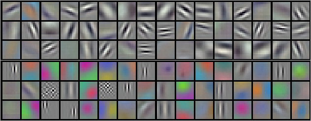
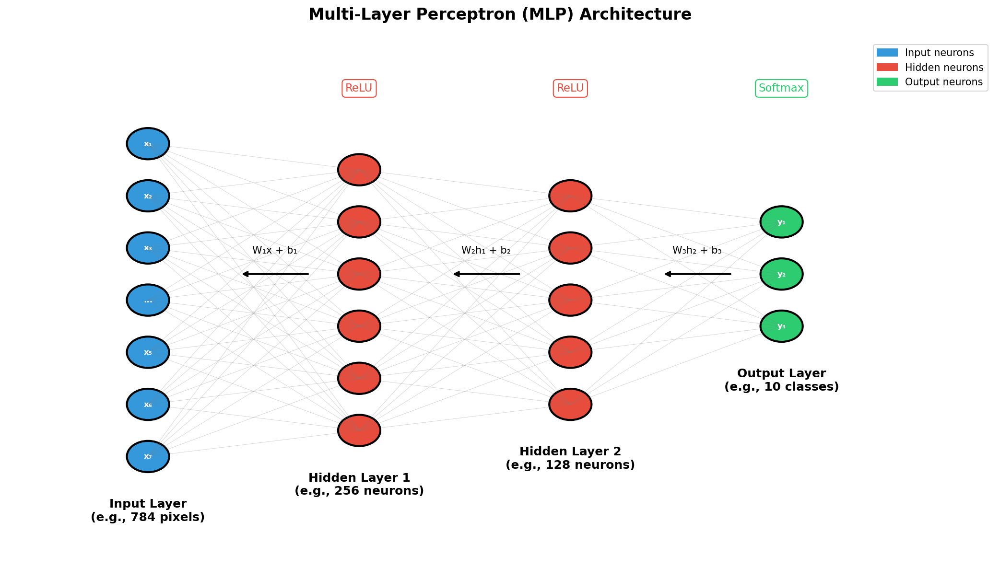
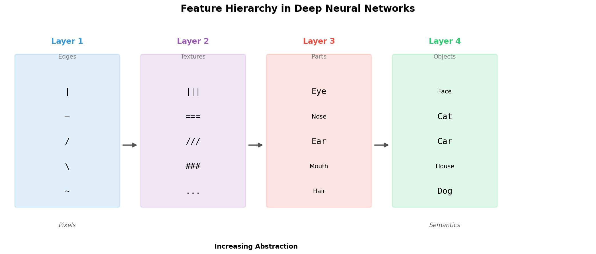
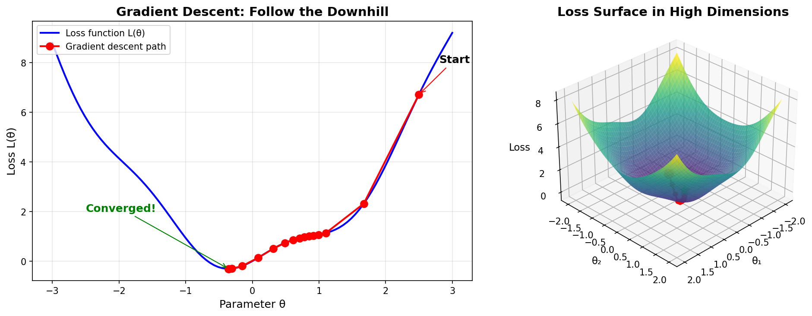
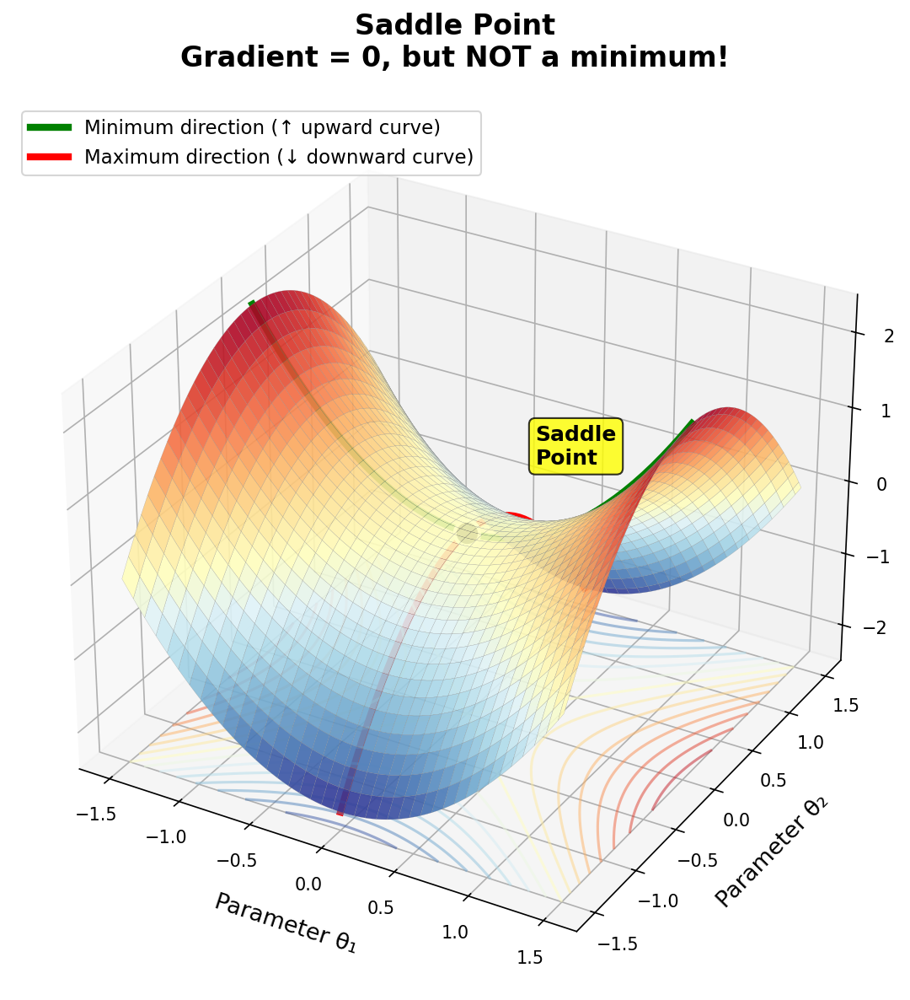
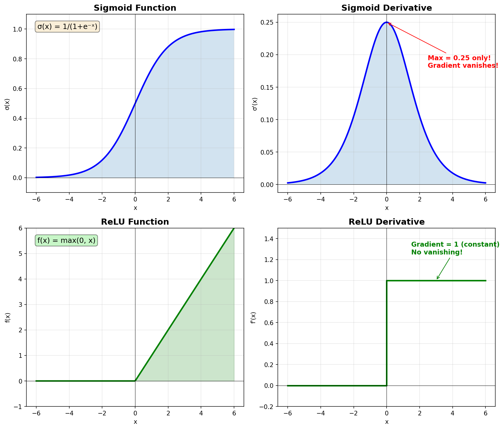
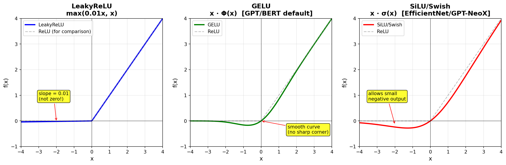

# Day 1: Neural Network Overview

> **Core Question**: Why does deep learning actually work?

---

## Opening

On September 30, 2012, the ImageNet Large Scale Visual Recognition Challenge (ILSVRC) announced its results. A neural network called AlexNet achieved a top-5 error rate of 15.3%—the runner-up was at 26.2%. The gap was so large that judges suspected cheating.

This wasn't the first time neural networks appeared. Backpropagation was invented back in the 1980s. But insufficient compute, insufficient data, and insufficient techniques pushed neural networks into an "AI winter" in the 1990s, dominated by SVMs for two decades.

After 2012, everything changed. GPU compute exploded, ImageNet provided millions of labeled images, and ReLU activation solved vanishing gradients—deep learning was reborn. Then came AlphaGo, BERT, GPT-3, and ChatGPT.


*Figure 1: The 96 filters learned by AlexNet's first convolutional layer. The top rows are edge detectors (lines in various orientations), the bottom rows are color and texture detectors. These were learned automatically from data, not hand-designed. (Source: Krizhevsky et al., 2012)*

Today, ChatGPT can write code, chat, and translate—all powered by neural networks, just bigger (hundreds of billions of parameters), deeper (hundreds of layers), and more sophisticated (Transformers).

But the question remains: **Why does a stack of matrix multiplications and nonlinear functions "understand" language and "see" images?**

This isn't magic. Today we'll build foundational understanding from both mathematical and intuitive perspectives.

---

## 1. What Is a Neural Network?

### 1.1 One-Sentence Definition

**A neural network is a learnable function approximator.**

Give it input x, it outputs y = f(x; θ). Here θ represents parameters (potentially billions). Training is the process of adjusting θ to make f perform better on your task of interest.

This definition is crucial. It tells us:
- A neural network is fundamentally a **function**
- The function's shape is determined by **parameters**
- Training = **searching** for optimal parameters

### 1.2 The Simplest Neural Network

The simplest neural network is the **Multi-Layer Perceptron (MLP)**:


*Figure 2: Multi-Layer Perceptron (MLP) architecture. The input layer receives raw data, hidden layers extract features through weight matrices and activation functions, and the output layer produces final predictions.*

Let's break down each step:

**Step 1: Linear Transformation**
```
z = Wx + b
```
- W is the weight matrix, shape (h, d)
- b is the bias vector, shape (h,)
- This maps d-dimensional input to h-dimensional space

**Step 2: Nonlinear Activation**
```
h = σ(z)
```
- σ is an activation function (e.g., ReLU: σ(x) = max(0, x))
- This introduces nonlinearity—**without it, multiple layers collapse to one**

**Step 3: Output Layer**
```
y = softmax(Vh + c)
```
- V is another weight matrix, shape (k, h)
- softmax converts outputs to a probability distribution (sums to 1)

That's it. Complex networks simply:
1. Stack this structure many times (depth)
2. Have many neurons per layer (width)
3. Get creative with connection patterns (convolution, attention, etc.)

### 1.3 Why Do We Need Nonlinearity?

This is a key question. Suppose we have two linear transformations:

```
h = W₁x
y = W₂h = W₂W₁x = Wx
```

Two linear layers equal one! Because matrix multiplication is linear, W₂W₁ can be merged into a single matrix W.

This means: **No matter how many linear layers you stack, you can only represent linear functions.**

But real-world problems are almost always nonlinear. Image classification—"is this a cat or dog"—can't be determined by a linear combination of pixel values.

That's why we insert nonlinear activation functions between layers. This way, deep networks can represent complex nonlinear functions.

---

## 2. Why Do Neural Networks Work?

This is the core question. We'll answer from three angles.

### 2.1 Theoretical Foundation: Universal Approximation Theorem

In 1989, George Cybenko proved a landmark theorem:

> **Universal Approximation Theorem**: A single-hidden-layer neural network, with enough neurons in the hidden layer, can approximate any continuous function on a compact set to arbitrary precision.

In plain English: with enough neurons, neural networks can fit arbitrarily complex functions.

**Intuitive Understanding**:

Imagine you want to approximate a complex curve. Each neuron can be thought of as a "step function" or "small bump." With enough bumps added together, you can approximate any shape.

It's like Fourier transforms: any function can be decomposed into a sum of sine waves. Neural networks use activation functions instead of sine waves, but the idea is similar.

**But note**:

This theorem only says "such a network exists." It doesn't say:
1. How many neurons you need (might be astronomical)
2. Whether you can actually train it (optimization might be hard)
3. Whether it will generalize to new data (might overfit)

Theoretical possibility and practical feasibility are different things.

### 2.2 The Power of Depth: Why Go "Deep"?

If a single layer can approximate any function, why do we need depth?

The answer is **efficiency**.

**Example 1: XOR Problem**

Computing XOR of n variables:
- Shallow network needs O(2ⁿ) neurons
- Deep network needs only O(n) neurons

The gap is exponential.

**Example 2: Image Feature Hierarchy**

Recognizing a face image:
- Layer 1: Detect edges (horizontal, vertical, diagonal lines)
- Layer 2: Combine edges into simple shapes (corners, arcs)
- Layer 3: Combine shapes into parts (eyes, nose, mouth)
- Layer 4: Combine parts into faces


*Figure 3: Feature hierarchy in deep networks. Layer 1 detects edges, Layer 2 combines them into textures, Layer 3 recognizes parts, Layer 4 recognizes complete objects. Each layer builds more abstract representations on top of the previous one.*

Each layer builds more abstract features on top of the previous. With a single-layer network, you'd need to jump directly from pixels to "face," requiring massive numbers of neurons to encode all possible combinations.

**Mathematical Explanation**:

Deep networks have **combinatorial explosion** in expressiveness. Assume each layer has n neurons, with L layers of depth:
- Shallow network (1 layer): Can represent O(n) patterns
- Deep network (L layers): Can represent O(nᴸ) patterns

Depth brings **exponential** growth in expressiveness.

### 2.3 Optimization: Why Can Gradient Descent Find Good Solutions?

With powerful function approximation ability, we still need to actually train it. This relies on **Gradient Descent** + **Backpropagation**.

**Core Idea of Gradient Descent**:

Imagine you're standing on a mountain, wanting to reach the lowest point (minimum loss), but you're blindfolded. What do you do?

An intuitive approach: feel around with your feet for which direction goes downhill, then take a small step that way. Repeat this process, and eventually you'll reach some low point.

Mathematically:
```
θ_new = θ_old - η · ∇L(θ)
```
- θ is parameters
- L(θ) is the loss function (lower is better)
- ∇L(θ) is the gradient (points toward steepest increase in loss)
- η is the learning rate (step size)


*Figure 5: Gradient descent visualization. The left panel shows iteration along the "downhill" direction in 2D; the right panel shows a high-dimensional loss surface, with red dot as starting position and green star as convergence point.*

**The Role of Backpropagation**:

Neural networks might have billions of parameters. Naively computing each parameter's gradient has O(parameters²) complexity—completely infeasible.

Backpropagation uses the chain rule to reduce gradient computation to O(parameters). This is key to scaling deep learning.

**A Mysterious Phenomenon**:

Neural network loss functions are **non-convex**, with countless local minima. Theoretically, gradient descent could get stuck at any local minimum.

But empirically, in high-dimensional spaces, most local minima have similarly good loss values. Moreover, saddle points are more common than local minima, and SGD can escape saddle points.

> **Quick terminology**:
> - **Local minimum**: A point where loss is lower than all nearby points, but not necessarily the global lowest. Like being at the bottom of a small valley—you can't go further down by taking small steps, but there might be deeper valleys elsewhere.
> - **Saddle point**: A point that's a minimum in some directions but a maximum in others—like sitting on a horse saddle. The surface curves up in front/behind you, but curves down to your left/right. Gradient is zero here, but it's not actually a minimum.
> - **SGD (Stochastic Gradient Descent)**: Standard gradient descent computes gradients on the entire dataset. SGD randomly samples a small batch each time, adding noise that helps escape saddle points.


*Figure: A saddle point visualized. At the center, gradient is zero, but it's a minimum along one axis (green arrows, loss curves up) and a maximum along the other (red arrows, loss curves down). SGD's noise helps escape along the "downhill" direction.*

Why does this work? It's still an open research question. But it works, and works remarkably well.

---

## 3. Key Technical Details

### 3.1 Evolution of Activation Functions

**Sigmoid (1980s-2000s)**
```
σ(x) = 1 / (1 + e^(-x))
```
Outputs between (0, 1), has probability interpretation.


*Figure 4: Sigmoid vs ReLU activation function comparison. Left column shows the functions themselves, right column shows derivatives. Note Sigmoid's derivative maxes at only 0.25, while ReLU's derivative is constant 1 for x > 0.*

Problem: When |x| is large, σ'(x) ≈ 0. Gradients decay exponentially through deep networks—this is called **vanishing gradient**, a nightmare for deep network training.

> **Why is vanishing gradient so bad?**
> 
> During backpropagation, gradients are multiplied layer by layer (chain rule). With Sigmoid, each layer multiplies by at most 0.25. After just 10 layers: 0.25¹⁰ ≈ 0.000001. The gradient essentially disappears!
> 
> **Consequence**: Early layers receive near-zero gradients and almost don't update. The network can only learn shallow patterns—deep layers learn, but early layers stay random. This is why deep networks with Sigmoid simply couldn't train before ReLU came along.

**ReLU (2010s to present)**
```
ReLU(x) = max(0, x)
```
Advantages:
- When x > 0, gradient is constant 1, doesn't vanish
- Computationally simple, 6x faster than sigmoid
- Sparse activation: ~50% of neurons output 0, providing regularization

> **What does "sparse activation" mean?**
> 
> ReLU outputs 0 for any negative input. In practice, about half of neurons in a layer receive negative inputs and output zero—they're "off."
> 
> This is like having a huge team, but only half are working on any given task. It prevents the network from memorizing training data too precisely (overfitting), because different subsets of neurons are active for different inputs. This implicit "dropout" effect is a form of **regularization**—it forces the network to learn more robust features rather than relying on any single neuron.

Disadvantage:
- When x < 0, gradient is 0, neurons can "die"

> **What does "neurons die" mean?**
> 
> Here x is the neuron's input: x = Σ(weights × previous layer outputs) + bias. If the weights update in a way that makes x always negative for all training examples, this neuron will always output 0 and receive 0 gradient—it stops learning forever. It's "dead."
> 
> *But wait—why would x be negative?* Even if raw inputs (like pixel values 0-255) are non-negative, we typically **normalize** them first: subtract the mean, divide by standard deviation. This centers the data around 0, so inputs can be positive or negative. Plus, weights themselves are randomly initialized around 0 (positive and negative), and biases can also be negative. So: positive input × negative weight = negative contribution, and the sum can easily end up negative.
> 
> This can happen when the learning rate is too high, causing weights to jump too far in the wrong direction. That's why LeakyReLU exists: it outputs 0.01x instead of 0 for negative inputs, keeping a tiny gradient alive.

**ReLU Variants**

- **LeakyReLU**: `max(0.01x, x)`
  - Instead of outputting 0 for negative inputs, outputs a small value (0.01x)
  - Solves the "dying ReLU" problem—neurons always have some gradient
  - The 0.01 slope is a hyperparameter; PReLU learns it automatically

- **GELU** (Gaussian Error Linear Unit): `x · Φ(x)` where Φ is the standard normal CDF
  - Outputs x weighted by "how likely x is to be greater than other inputs"
  - Smoother than ReLU—no sharp corner at x=0
  - **Default activation in GPT and BERT**. Why? Transformers benefit from smooth gradients
  - Approximation: `0.5x(1 + tanh(√(2/π)(x + 0.044715x³)))`

- **SiLU/Swish**: `x · σ(x)` where σ is sigmoid
  - Discovered by Google Brain through automated search (2017)
  - Like GELU, it's smooth and allows small negative outputs
  - Used in EfficientNet, GPT-NeoX, and many recent models
  - Fun fact: "Swish" was named arbitrarily—researchers just needed a name


*Figure: Comparison of LeakyReLU, GELU, and SiLU/Swish. Gray dashed line shows standard ReLU for reference. Note how GELU and Swish are smooth (no sharp corner at x=0) and allow small negative outputs.*

### 3.2 The Importance of Initialization

Parameter initial values greatly impact training.

**Bad Initialization**:
- All zeros: all neurons identical, can't learn
- Too large: gradient explosion
- Too small: gradient vanishing

**Proper Initialization (Xavier/He)**:
```python
# Xavier initialization (for sigmoid/tanh)
W = np.random.randn(fan_in, fan_out) * np.sqrt(1 / fan_in)

# He initialization (for ReLU)
W = np.random.randn(fan_in, fan_out) * np.sqrt(2 / fan_in)
```

> **What is this formula actually doing?**
> 
> Let's break it down:
> - `np.random.randn(fan_in, fan_out)` → Random numbers from standard normal distribution (mean=0, variance=1)
> - `fan_in` → Number of input connections to this layer (e.g., 784 for first layer after MNIST input)
> - `* np.sqrt(2 / fan_in)` → Scale down the random numbers
> 
> **Why scale by √(2/fan_in)?** 
> 
> When you multiply many random numbers together (which happens as signals flow through layers), variances multiply too. If each layer's output has variance > 1, it explodes; if < 1, it vanishes.
> 
> Math: If input has variance 1, and weights have variance 2/fan_in, then output variance ≈ 1 (for ReLU, which zeroes half the values, hence the "2"). This keeps signals stable across layers.
> 
> The "He" in He initialization is Kaiming He (何恺明)—the same researcher behind ResNet!

Core idea: keep each layer's output variance stable—not growing or shrinking.

### 3.3 Regularization: Preventing Overfitting

Neural networks have many parameters and easily overfit (perform well on training set, poorly on test set).

**Dropout**
During training, randomly "turn off" some neurons (e.g., 50%). This forces the network not to rely on any single neuron, improving robustness.

```python
# During training
h = h * (torch.rand_like(h) > 0.5)  # Random zeroing
h = h * 2  # Scale to maintain expectation

# During inference
# No dropout
```

**Weight Decay (L2 Regularization)**
Add L2 norm of parameters to loss:
```
L_total = L_task + λ · ||θ||²
```
This penalizes large parameters, making the network "simpler."

> **Dropout vs L2 Regularization: Different Techniques!**
> 
> These are two **separate** regularization methods:
> - **Dropout**: Randomly disables neurons during training (e.g., `nn.Dropout(0.2)` turns off 20%)
> - **L2 Regularization**: Adds a penalty term to the loss function, shrinking weights
> 
> In PyTorch, Dropout is a layer in your model, while L2 regularization is set in the optimizer:
> ```python
> # Dropout: in model definition
> nn.Dropout(0.2)
> 
> # L2 regularization: in optimizer (weight_decay parameter)
> optimizer = torch.optim.Adam(model.parameters(), lr=0.001, weight_decay=1e-4)
> ```
> 
> You can use both together—they complement each other!

---

## 4. Code Example: Complete Training Pipeline

A complete training pipeline with PyTorch:

```python
import torch
import torch.nn as nn
import torch.optim as optim
from torch.utils.data import DataLoader
from torchvision import datasets, transforms

# 1. Define Network
class MLP(nn.Module):
    def __init__(self):
        super().__init__()
        self.layers = nn.Sequential(
            nn.Flatten(),                    # 28x28 -> 784
            nn.Linear(784, 512),             # 784 -> 512
            nn.ReLU(),
            nn.Dropout(0.2),                 # Prevent overfitting
            nn.Linear(512, 256),             # 512 -> 256
            nn.ReLU(),
            nn.Dropout(0.2),
            nn.Linear(256, 10)               # 256 -> 10 (digits 0-9)
        )
    
    def forward(self, x):
        return self.layers(x)

# 2. Prepare Data (MNIST handwritten digits)
transform = transforms.Compose([
    transforms.ToTensor(),
    transforms.Normalize((0.1307,), (0.3081,))  # Standardization
])

train_dataset = datasets.MNIST('./data', train=True, download=True, transform=transform)
test_dataset = datasets.MNIST('./data', train=False, transform=transform)

train_loader = DataLoader(train_dataset, batch_size=64, shuffle=True)
test_loader = DataLoader(test_dataset, batch_size=1000)

# 3. Training
device = torch.device('cuda' if torch.cuda.is_available() else 'cpu')
model = MLP().to(device)
optimizer = optim.Adam(model.parameters(), lr=0.001)
criterion = nn.CrossEntropyLoss()

for epoch in range(5):
    model.train()
    total_loss = 0
    for batch_idx, (data, target) in enumerate(train_loader):
        data, target = data.to(device), target.to(device)
        
        optimizer.zero_grad()        # Clear gradients
        output = model(data)         # Forward pass
        loss = criterion(output, target)  # Compute loss
        loss.backward()              # Backward pass
        optimizer.step()             # Update parameters
        
        total_loss += loss.item()
    
    # Testing
    model.eval()
    correct = 0
    with torch.no_grad():
        for data, target in test_loader:
            data, target = data.to(device), target.to(device)
            output = model(data)
            pred = output.argmax(dim=1)
            correct += pred.eq(target).sum().item()
    
    accuracy = 100. * correct / len(test_dataset)
    print(f'Epoch {epoch+1}: Loss={total_loss/len(train_loader):.4f}, Test Accuracy={accuracy:.2f}%')

# Example output:
# Epoch 1: Loss=0.3521, Test Accuracy=96.12%
# Epoch 2: Loss=0.1423, Test Accuracy=97.45%
# Epoch 3: Loss=0.1024, Test Accuracy=97.89%
# Epoch 4: Loss=0.0812, Test Accuracy=98.01%
# Epoch 5: Loss=0.0673, Test Accuracy=98.15%
```

Key points:
1. **nn.Sequential** chains layers together
2. **optimizer.zero_grad()** is crucial: PyTorch accumulates gradients by default, must clear before each batch
3. **model.train() / model.eval()** switches modes: Dropout only active during training
4. **with torch.no_grad()** inference doesn't need gradients, saves memory

---

## 5. Math Derivation [Optional]

> This section is for readers who want deeper understanding. Feel free to skip.

### 5.1 Forward Pass in Matrix Form

For an L-layer neural network, let h⁽⁰⁾ = x (input), then:

$$
\begin{aligned}
z^{(l)} &= W^{(l)} h^{(l-1)} + b^{(l)} \quad &\text{(linear transformation)} \\
h^{(l)} &= \sigma(z^{(l)}) \quad &\text{(activation)} \\
\hat{y} &= \text{softmax}(z^{(L)}) \quad &\text{(output)}
\end{aligned}
$$

### 5.2 Backpropagation Derivation

Let the loss function be cross-entropy:
$$
L = -\sum_k y_k \log \hat{y}_k
$$

Define error signal:
$$
\delta^{(l)} = \frac{\partial L}{\partial z^{(l)}}
$$

For the output layer (using special property of softmax + cross-entropy):
$$
\delta^{(L)} = \hat{y} - y
$$

For hidden layers (chain rule):
$$
\delta^{(l)} = (W^{(l+1)})^T \delta^{(l+1)} \odot \sigma'(z^{(l)})
$$

Parameter gradients:
$$
\frac{\partial L}{\partial W^{(l)}} = \delta^{(l)} (h^{(l-1)})^T
$$
$$
\frac{\partial L}{\partial b^{(l)}} = \delta^{(l)}
$$

### 5.3 Why Xavier Initialization Works

Let input x have n elements, each with variance Var(x). Weight W has i.i.d. elements with mean 0 and variance Var(W).

Linear layer output:
$$
z = \sum_{i=1}^{n} W_i x_i
$$

Output variance:
$$
\text{Var}(z) = n \cdot \text{Var}(W) \cdot \text{Var}(x)
$$

To keep Var(z) = Var(x) (variance preserved), we need:
$$
\text{Var}(W) = \frac{1}{n}
$$

This is the origin of Xavier initialization.

---

## 6. Common Misconceptions

### ❌ "Neural networks simulate the brain"

This is a beautiful misunderstanding. The similarity between modern neural networks and biological neurons is limited to "both are connected nodes" at an abstract level.

Actual differences:
| Aspect | Biological Neurons | Artificial Neurons |
|--------|-------------------|-------------------|
| Signal | Spikes, time-dependent | Continuous values |
| Learning | Synaptic plasticity, local rules | Backpropagation, global gradients |
| Structure | Sparse, irregular connections | Usually fully connected or regular |
| Power | ~20W (whole brain) | ~300W (one GPU) |

Neural networks succeed not because they're brain-like, but because:
1. They're powerful function approximators
2. We have efficient training algorithms (backpropagation)
3. We have enough data and compute

### ❌ "Deep learning is a black box, no one knows why it works"

This is half true, half false.

**What we truly don't understand**:
- Why non-convex optimization finds good solutions
- Why overparameterization helps generalization
- What "representations" neural networks learn internally

**What we have solid theory for**:
- Universal Approximation Theorem explains expressiveness
- Statistical learning theory (VC dimension, Rademacher complexity) explains generalization
- Scaling Laws give empirical formulas for performance vs. scale

"Don't fully understand" ≠ "Don't understand at all." Deep learning has both theory and many unsolved mysteries.

### ❌ "More parameters are always better"

Not necessarily. More parameters make overfitting easier.

But interestingly, when parameters exceed a certain threshold ("overparameterization"), generalization can actually improve. This is called the **double descent** phenomenon, a hot topic in recent deep learning theory.

Rule of thumb: Modern large models do get better with scale (see Scaling Laws), but only with sufficient data and regularization.

---

## 7. Further Reading

### Beginner
1. **3Blue1Brown: Neural Networks** (Video)  
   Most intuitive visual explanation of neural networks  
   https://www.youtube.com/playlist?list=PLZHQObOWTQDNU6R1_67000Dx_ZCJB-3pi

2. **Neural Networks and Deep Learning** (Michael Nielsen)  
   Interactive online book, from scratch  
   http://neuralnetworksanddeeplearning.com/

### Advanced
3. **Deep Learning Book - Chapter 6** (Goodfellow et al.)  
   The deep learning bible's neural network chapter  
   https://www.deeplearningbook.org/contents/mlp.html

4. **CS231n: Convolutional Neural Networks** (Stanford)  
   Stanford's classic course with detailed backprop derivations  
   https://cs231n.stanford.edu/

### Papers
5. **Universal Approximation Theorem** (Cybenko, 1989)  
   Foundational paper  
   https://doi.org/10.1007/BF02551274

6. **ImageNet Classification with Deep CNNs** (Krizhevsky et al., 2012)  
   AlexNet paper, the starting point of deep learning's resurgence  
   https://papers.nips.cc/paper/4824-imagenet-classification-with-deep-convolutional-neural-networks

---

## Reflection Questions

1. **ReLU has gradient 0 when x < 0, meaning some neurons might "die" (never update). Is this a bug or a feature? What solutions exist?**

2. **The Universal Approximation Theorem says a single-layer network can approximate any function, so why do deep networks work better in practice? Besides "efficiency," what other reasons are there?**

3. **If you replaced all activation functions in a neural network with linear functions σ(x) = x, what would the network become? Could it still learn complex tasks?**

---

## Summary

Today we built foundational understanding of neural networks:

| Concept | One-line Explanation |
|---------|---------------------|
| Neural Network | Learnable function approximator |
| Universal Approximation | Can theoretically approximate any continuous function |
| Value of Depth | Represent more complex functions with fewer parameters |
| Backpropagation | Efficient algorithm for computing gradients |
| ReLU | Activation function that solves vanishing gradients |
| Dropout | Regularization technique to prevent overfitting |
| Xavier/He Initialization | Keep variance stable across layers |

**Key Takeaway**: Neural networks aren't magic—they're math. Their success comes from powerful function approximation + efficient optimization algorithms + sufficient data and compute.

Tomorrow we'll discuss RNNs—neural networks' first attempt at handling sequential data, and why they were eventually replaced by Transformers.

---

*Day 1 of 60 | LLM Fundamentals*
*Word count: ~4200 | Reading time: ~18 minutes*
