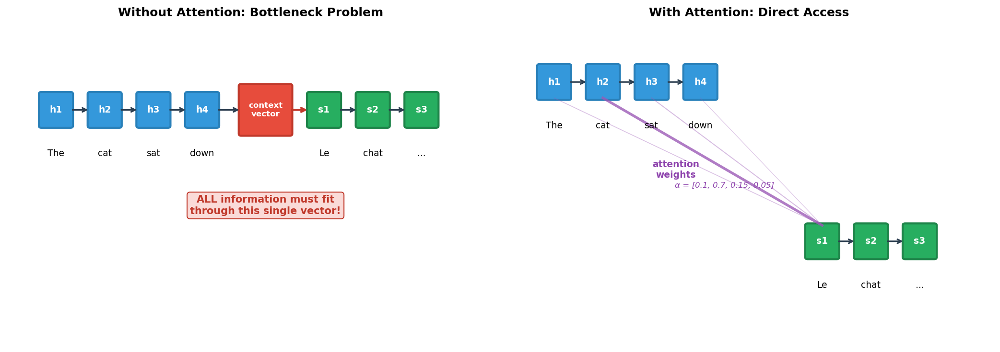
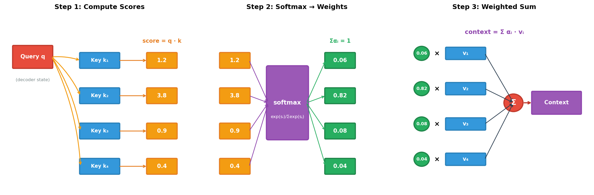
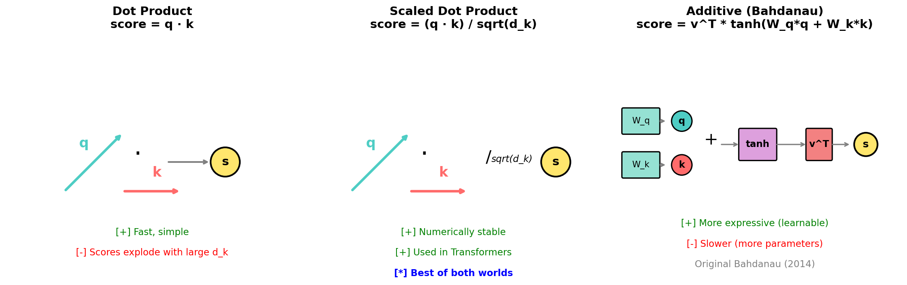
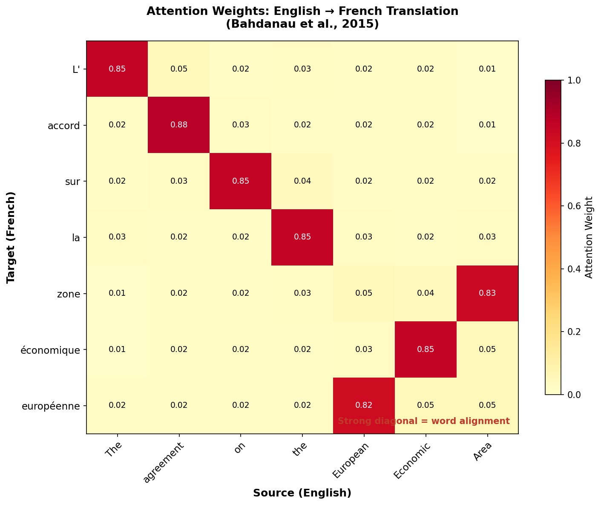
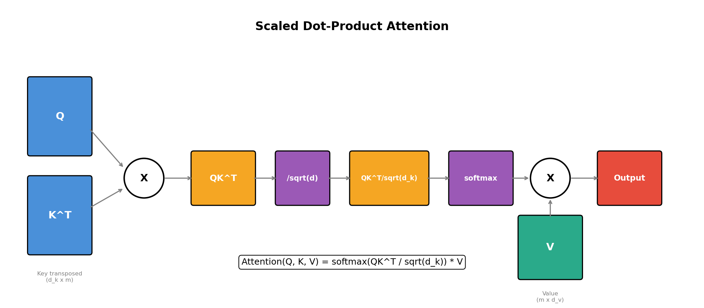
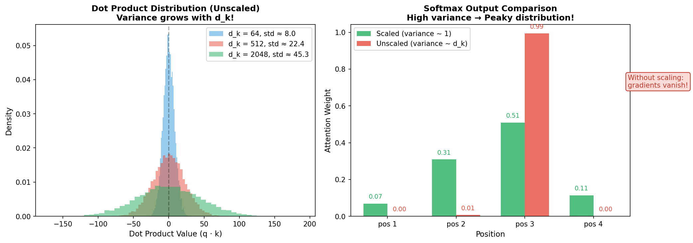
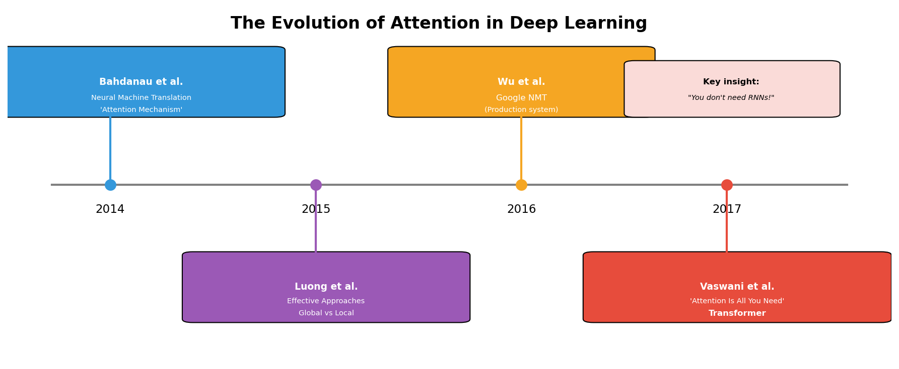
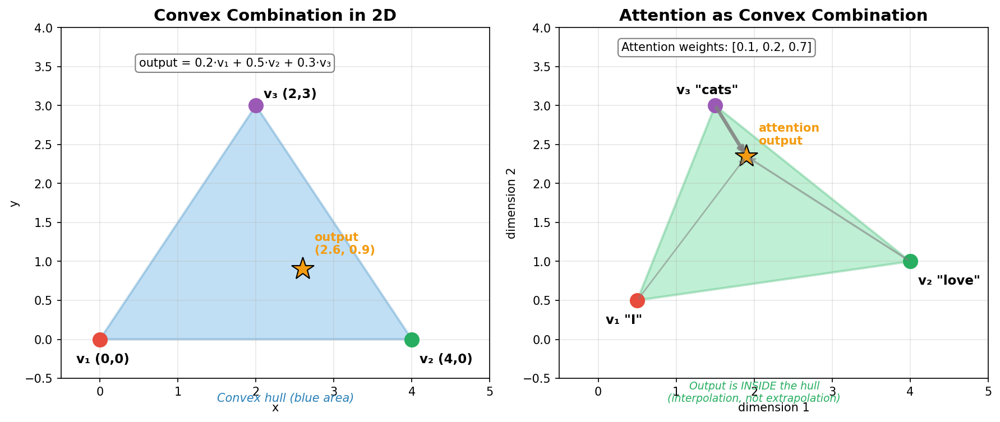

# Day 3: Birth of Attention

> **Core Question**: What problem does attention solve, and how does the mechanism actually work?

---

## Opening

In 2014, neural machine translation was exciting but frustrating. Seq2seq models could translate sentences, but they had a fatal flaw: no matter how long the input sentence, everything had to be compressed into a single fixed-size vector.

Imagine being asked to translate a 100-word legal document into French, but you can only take notes on a single Post-it. That's what seq2seq models were doing.

The bottleneck was obvious: long sentences performed terribly. Information was lost. The decoder had to somehow extract "European Economic Area agreement" from a compressed blob that also contained everything else.

Then came Bahdanau, Cho, and Bengio's 2014 paper: "Neural Machine Translation by Jointly Learning to Align and Translate." The key insight was simple but profound: **instead of compressing everything into one vector (the final encoder hidden state), let the decoder look back at all encoder states and decide which ones are relevant for each output word.**

This was the birth of attention.


*Figure 1: Left: Without attention, all information must pass through a single "bottleneck" vector. Right: With attention, the decoder can directly access all encoder hidden states, with learned weights indicating relevance.*

Three years later, "Attention Is All You Need" took this further: what if we built an entire architecture around attention, without any recurrence at all? The Transformer was born, and with it, the foundation for GPT, BERT, and every modern LLM.

Today, we'll understand attention from first principles—why it was invented, exactly how it works mathematically, and why the "scaled dot-product" formulation became standard.

---

## 1. The Bottleneck Problem

### 1.1 Seq2seq Recap

Let's revisit how seq2seq models worked (covered in Day 2):

1. **Encoder**: Process the input sequence word by word, producing hidden states h₁, h₂, ..., hₙ
2. **Context vector**: Take the final hidden state hₙ as the "summary" of the entire input
3. **Decoder**: Generate output sequence conditioned on this context vector

The problem is in step 2. The final hidden state must encode *everything*: the subject, the object, the verb tense, the relationships between words—all compressed into a 512 or 1024-dimensional vector.

This works for short sentences. For long ones? Information gets lost.

### 1.2 Evidence from Experiments

Bahdanau et al. showed this empirically. They plotted BLEU score (translation quality) vs. sentence length:

| Sentence Length | Standard Seq2seq | With Attention |
|-----------------|------------------|----------------|
| 10-20 words | Good | Good |
| 30-40 words | Degrading | Still good |
| 50+ words | Poor | Remains stable |

The standard model's performance collapsed for long sentences. Attention-based models maintained quality regardless of length.

### 1.3 The Key Insight

Human translators don't read the entire source sentence, compress it into their head, then write the translation. They look back and forth. When translating "European Economic Area," they glance at those specific English words, not at "The" from the beginning.

Attention gives neural networks this ability: **dynamic, content-based lookup** into the source sequence.

---

## 2. How Attention Works

### 2.1 The Core Mechanism

Attention computes a weighted sum of values, where the weights are determined by the similarity between a query and a set of keys.

**The three key concepts:**
- **Query (Q)**: What am I looking for?
- **Keys (K)**: What do I have available?
- **Values (V)**: What do I retrieve?

> **Library analogy**: Think of a library search.
> - **Query** = your search description: "I need a book about machine learning"
> - **Keys** = labels/indices on each book: "ML Intro", "Deep Learning", "Cooking"...
> - **Values** = the actual content inside the books
> 
> Keys tell you what **options exist** (available). Values are what you **actually get** (retrieve).
> Why separate them? The search criteria and the returned content can be different!

In the original seq2seq attention:
- Query = current decoder hidden state (what I need to generate next)
- Keys = all encoder hidden states (what I can look at)
- Values = same as keys (what I retrieve)

### 2.2 The Three Steps


*Figure 2: The three steps of attention: (1) compute similarity scores between query and keys, (2) normalize scores via softmax to get weights, (3) compute weighted sum of values.*

**Step 1: Compute Scores**

For each key kᵢ, compute a similarity score with the query q:

```
score_i = similarity(q, k_i)
```

Common similarity functions:
- **Dot product**: `score = q · k` (fast, simple)
- **Scaled dot product**: `score = (q · k) / √d_k` (what Transformers use)
- **Additive**: `score = v^T · tanh(W_q q + W_k k)` (original Bahdanau)


*Figure: Comparison of three similarity functions. Dot product is simple but scores explode with high dimensions. Scaled dot product fixes this by dividing by √d_k. Additive is more expressive but slower.*

> **Why does dot product "explode"?**
> 
> **Coin flip analogy**: Imagine flipping coins where each shows +1 or -1:
> 
> | Coins | Possible sums | Range |
> |-------|---------------|-------|
> | 1 coin | -1, +1 | ±1 |
> | 3 coins | -3, -1, +1, +3 | ±3 |
> | 100 coins | -100 to +100 | ±100 |
> 
> More coins = more "fluctuation sources" adding up = wider range of results.
> 
> **Dot product is the same:**
> $$q \cdot k = \underbrace{q_1 k_1}_{\text{source 1}} + \underbrace{q_2 k_2}_{\text{source 2}} + ... + \underbrace{q_d k_d}_{\text{source d}}$$
> 
> Each qᵢkᵢ is a "fluctuation source" with variance 1. Sum d sources → total variance = d.
> 
> **The higher the dimension, the more likely the dot product "runs far away"!**
> 
> | Dimension d | Std Dev of score | Typical range |
> |-------------|------------------|---------------|
> | 1 | 1 | -3 ~ +3 |
> | 64 | √64 = 8 | -24 ~ +24 |
> | 512 | √512 ≈ 22.6 | -68 ~ +68 |
> 
> Large scores → softmax becomes nearly one-hot → gradients vanish → training fails.
> 
> **What is "one-hot"?** A vector where only one position is 1, all others are 0.
> 
> **Why do large scores cause one-hot?** Because softmax uses **exponential function**, which is extremely sensitive to large values:
> 
> | x | e^x |
> |---|-----|
> | 1 | 2.7 |
> | 10 | 22,026 |
> | 20 | 485,165,195 |
> | 30 | 10,686,474,581,524 |
> 
> A difference of 10 → exponential difference of **20,000x**!
> 
> **Small scores** → `softmax([1, 2, 3])`:
> ```
> e^1 = 2.7,  e^2 = 7.4,  e^3 = 20.1
> sum = 30.2
> → [2.7/30.2, 7.4/30.2, 20.1/30.2]
> → [0.09, 0.24, 0.67]  ✅ smooth distribution
> ```
> 
> **Large scores** → `softmax([10, 20, 30])`:
> ```
> e^10 = 22,026
> e^20 = 485,165,195
> e^30 = 10,686,474,581,524  ← dominates everything!
> sum ≈ e^30
> → [≈0, ≈0, ≈1]  ❌ one-hot
> ```
> 
> The exponential makes big values bigger and small values smaller. When scores differ too much, the max "eats" all others → one-hot.
> 
> When softmax output is nearly 0 or 1, gradients approach 0 → parameters stop updating → training fails.
> 
> **Solution**: Divide by √d_k to normalize variance back to 1.

**Step 2: Normalize via Softmax**

Convert scores to a probability distribution (weights sum to 1):

```
α_i = softmax(score_i) = exp(score_i) / Σ_j exp(score_j)
```

Now αᵢ ∈ [0, 1] and Σαᵢ = 1. These are the **attention weights**.

> **Key distinction:**
> - **Score** = scaled dot product (raw similarity)
> - **Attention Weight** = softmax(score) (normalized attention distribution)

**Step 3: Weighted Sum**

Compute the context vector as a weighted combination of values:

```
context = Σ_i α_i · v_i
```

That's it! The context vector is a weighted average of all values, where the weights indicate "how much attention" to pay to each position.

> **Static vs Dynamic Context**
> 
> | Model | Context Vector | Property |
> |-------|----------------|----------|
> | **Original Seq2Seq** | Fixed (encoder's final hidden state) | **Static**, same for all decoder steps |
> | **Attention** | Dynamic weighted sum based on Query | **Dynamic**, different at each step |
> 
> Example: Translating "I love cats" → "J'aime les chats"
> ```
> Generate "J'aime" → context focuses on "I love"  (weights: I=0.4, love=0.5, cats=0.1)
> Generate "les"    → context focuses on "cats"    (weights: I=0.1, love=0.1, cats=0.8)
> Generate "chats"  → context focuses on "cats"    (weights: I=0.1, love=0.1, cats=0.8)
> ```
> 
> **Attention transforms the context vector from a "fixed photo" to a "camera that can refocus anytime"** 📷

### 2.3 Intuition: Soft Addressing

Think of attention as **soft, differentiable memory lookup**.

In a traditional database:
```
query = "European Economic Area"
result = exact_match(query, database)  # Returns one record or none
```

In attention:
```
query = decoder_state
weights = softmax(similarity(query, all_keys))  # Returns weights for ALL records
result = weighted_sum(weights, all_values)  # Soft mixture of all records
```

The "soft" part is crucial: instead of hard selection, we get a differentiable operation that can be trained end-to-end with backpropagation.

---

## 3. Attention Visualized: Alignment

One beautiful property of attention: the weights are interpretable. They show which source words the model "looks at" when generating each target word.


*Figure 3: Attention weights for English→French translation. Each row shows what the model attends to when generating that French word. The rough diagonal indicates word alignment.*

Notice:
- "L'" attends strongly to "The" (article alignment)
- "accord" attends to "agreement" (direct translation)
- "européenne" attends to "European" (adjective, different position in French)
- "zone" attends to "Area" (word reordering handled gracefully)

This is **learned alignment**, not hand-coded rules. The model discovers that when generating French word X, it should look at English word Y—purely from translation examples.

---

## 4. Scaled Dot-Product Attention

The Transformer paper ("Attention Is All You Need") introduced a specific formulation that became the standard: **scaled dot-product attention**.

### 4.1 The Formula

$$
\text{Attention}(Q, K, V) = \text{softmax}\left(\frac{QK^T}{\sqrt{d_k}}\right) V
$$

Let's unpack this:

1. **QK^T**: Matrix of dot products. If Q has shape (n, d_k) and K has shape (m, d_k), then QK^T has shape (n, m). Entry (i, j) is the similarity between query i and key j.

> **What does Q look like?**
> 
> Each **row** of Q is one token's query vector:
> ```
> Q = ┌─────────────────────────────┐
>     │ q₁ = [0.1, 0.3, -0.2, ...]  │  ← Row 1: "I"'s query
>     │ q₂ = [0.5, -0.1, 0.4, ...]  │  ← Row 2: "love"'s query
>     │ q₃ = [-0.3, 0.2, 0.1, ...]  │  ← Row 3: "cats"'s query
>     └─────────────────────────────┘
>     Shape: (3, d_k) = (num_tokens, query_dimension)
> ```
> Each q is not a word — it's a **vector representation** of a word after embedding + linear projection.

2. **√d_k**: The scaling factor. d_k is the dimension of keys/queries.

3. **softmax**: Applied row-wise. Each row sums to 1.

> **Why row-wise softmax?** 
> 
> Each row represents one Query's attention distribution over all Keys:
> 
> $$QK^T = \begin{bmatrix} q_1 \cdot k_1 & q_1 \cdot k_2 & \cdots & q_1 \cdot k_m \\ q_2 \cdot k_1 & q_2 \cdot k_2 & \cdots & q_2 \cdot k_m \\ \vdots & \vdots & \ddots & \vdots \\ q_n \cdot k_1 & q_n \cdot k_2 & \cdots & q_n \cdot k_m \end{bmatrix}$$
> 
> - **Row 1** = Query 1's similarity to all Keys → softmax → Query 1's attention weights (sums to 1)
> - **Row 2** = Query 2's similarity to all Keys → softmax → Query 2's attention weights (sums to 1)
> 
> Each Query independently decides "which Keys to attend to". Column-wise softmax would mean "each Key's total attention received sums to 1" — not what we want!

4. **V**: The values matrix. Shape (m, d_v). The output has shape (n, d_v).


*Figure 4: Data flow in scaled dot-product attention. The scaling by √d_k is crucial for stable training.*

### 4.2 Why Scale by √d_k?

This is a subtle but important detail. Without scaling, attention breaks for high-dimensional embeddings.

**The Problem**:

Assume query and key elements are independent random variables with mean 0 and variance 1.

> **What does this mean in plain English?**
> 
> Imagine q and k as lists of numbers that two people randomly wrote:
> ```
> q = [0.5, -1.2, 0.8, ...]   ← Alice's random numbers
> k = [1.1, 0.3, -0.9, ...]   ← Bob's random numbers
> ```
> - "mean 0" = numbers average to ~0 (positives and negatives roughly cancel)
> - "variance 1" = numbers fluctuate in a similar range (not too big or small)
> - "independent" = Alice and Bob write independently, no peeking!
> 
> This is how neural networks typically **initialize weights** — random numbers with mean 0 and variance 1. So this assumption matches real training conditions.

The dot product q · k is the sum of d_k products:

$$
q \cdot k = \sum_{i=1}^{d_k} q_i \cdot k_i
$$

Each product qᵢ · kᵢ has variance 1 (product of two variance-1 variables). The sum has variance d_k (variance is additive for independent variables).

So the dot product has standard deviation √d_k. For d_k = 512, that's std ≈ 22.6!


*Figure 5: Left: Dot product distributions for different d_k values—variance grows with dimension. Right: Effect on softmax—high variance leads to peaky distributions with near-zero gradients for all but one position.*

**Why This Matters**:

When softmax inputs have large magnitude, the output becomes extremely peaky—one element close to 1, others close to 0. This causes:

1. **Vanishing gradients**: ∂softmax/∂x ≈ 0 for extreme values
2. **Hard attention**: No smooth learning signal, just hard selection
3. **Training instability**: Gradients either explode or vanish

**The Solution**:

Divide by √d_k to normalize the variance back to ~1:

```
scaled_score = (q · k) / √d_k
```

Now the scores have reasonable magnitude regardless of embedding dimension. Softmax stays in its "useful" range where gradients flow properly.

> **Quick check**: If q, k have dimension d_k = 64, the unscaled dot product has std ≈ 8. After scaling: std ≈ 1. Much better for softmax!

### 4.3 Code Implementation

```python
import torch
import torch.nn.functional as F
import math

def scaled_dot_product_attention(Q, K, V, mask=None):
    """
    Scaled Dot-Product Attention.
    
    Args:
        Q: Queries, shape (batch, n_queries, d_k)
        K: Keys, shape (batch, n_keys, d_k)
        V: Values, shape (batch, n_keys, d_v)
        mask: Optional mask, shape (batch, n_queries, n_keys)
    
    Returns:
        Output: shape (batch, n_queries, d_v)
        Attention weights: shape (batch, n_queries, n_keys)
    """
    d_k = Q.size(-1)
    
    # Step 1: Compute scaled scores
    # (batch, n_queries, d_k) @ (batch, d_k, n_keys) -> (batch, n_queries, n_keys)
    scores = torch.matmul(Q, K.transpose(-2, -1)) / math.sqrt(d_k)
    
    # Optional: Apply mask (for decoder self-attention, padding, etc.)
    if mask is not None:
        scores = scores.masked_fill(mask == 0, float('-inf'))
    
    # Step 2: Softmax to get attention weights
    attention_weights = F.softmax(scores, dim=-1)
    
    # Step 3: Weighted sum of values
    # (batch, n_queries, n_keys) @ (batch, n_keys, d_v) -> (batch, n_queries, d_v)
    output = torch.matmul(attention_weights, V)
    
    return output, attention_weights


# Example usage
batch_size = 2
n_queries = 4  # e.g., 4 decoder positions
n_keys = 6     # e.g., 6 encoder positions
d_k = 64
d_v = 64

Q = torch.randn(batch_size, n_queries, d_k)
K = torch.randn(batch_size, n_keys, d_k)
V = torch.randn(batch_size, n_keys, d_v)

output, weights = scaled_dot_product_attention(Q, K, V)

print(f"Output shape: {output.shape}")      # (2, 4, 64)
print(f"Weights shape: {weights.shape}")    # (2, 4, 6)
print(f"Weights sum per query: {weights.sum(dim=-1)}")  # All 1.0

# Visualize one attention pattern
print(f"\nAttention weights for batch 0, query 0:")
print(weights[0, 0])  # Shows how query 0 attends to all 6 keys
```

Output:
```
Output shape: torch.Size([2, 4, 64])
Weights shape: torch.Size([2, 4, 6])
Weights sum per query: tensor([[1., 1., 1., 1.],
                               [1., 1., 1., 1.]])

Attention weights for batch 0, query 0:
tensor([0.1842, 0.0823, 0.2451, 0.1253, 0.1891, 0.1740])
```

---

## 5. The Evolution: From Bahdanau to Transformers


*Figure 6: Timeline of attention in deep learning. From add-on mechanism (2014) to core architecture (2017).*

### 5.1 Bahdanau Attention (2014)

The original. Used **additive attention**:

```
score(s, h) = v^T · tanh(W_s · s + W_h · h)
```

Where:
- s = decoder state
- h = encoder hidden state
- W_s, W_h, v = learned parameters

This is more expressive than dot product (two separate projections), but slower.

### 5.2 Luong Attention (2015)

Simplified to **multiplicative attention**:

```
score(s, h) = s^T · W · h   (general)
score(s, h) = s^T · h       (dot)
```

Faster than additive, with comparable performance. The "dot" variant became popular.

### 5.3 Google Neural Machine Translation (2016)

Production system at Google. Used attention with 8-layer LSTMs. State-of-the-art translation quality. But still fundamentally sequential—couldn't parallelize well.

### 5.4 "Attention Is All You Need" (2017)

The big leap: **remove recurrence entirely**. The Transformer uses only attention:

1. **Self-attention**: Each position attends to all other positions in the same sequence
2. **Multi-head attention**: Multiple attention "heads" looking at different aspects
3. **Positional encoding**: Since there's no recurrence, position info is added explicitly

This is what we'll dive into in Day 4. But the key insight was already here in 2014: attention lets us bypass the sequential bottleneck.

---

## 6. Math Derivation [Optional]

> This section is for readers who want deeper understanding. Feel free to skip.

### 6.1 Attention as Weighted Average

The attention output is a convex combination of values:

$$
\begin{aligned}
\text{output} &= \sum_{i=1}^{n} \alpha_i v_i \\
\text{where } \alpha_i &\geq 0 \text{ and } \sum_i \alpha_i = 1
\end{aligned}
$$

This means the output always lies in the **convex hull** of the value vectors. Attention doesn't create new directions—it interpolates between existing ones.


*Figure: Left: A convex combination of 3 points always lands inside the triangle. Right: Attention output is "pulled" toward high-weight values but stays inside the convex hull.*

> **Cocktail Analogy** 🍸
> 
> Think of it like mixing cocktails:
> - You have red wine, white wine, and juice 🍷🥂🧃
> - You can mix them in any proportion
> - But you can **never** make coffee ☕ — it's not in your ingredients!
> 
> **2D Example**: If you only have v₁=(0,0) and v₂=(4,0):
> ```
>         ❌ (2, 5) impossible!
>         
> A ●─────●─────● B      ← Output can only be on this line
> (0,0)  (2,0)  (4,0)
>        ↑
>     ✅ possible outputs
> ```
> Any point with y≠0 is impossible — your Values don't have that direction!

### 6.2 Gradient of Attention

Let's compute the gradient of attention output w.r.t. the query. This shows how attention learns.

For a single query q and keys K = [k₁, ..., kₙ]:

$$
\begin{aligned}
s_i &= q^T k_i / \sqrt{d_k} \quad &\text{(scores)} \\
\alpha_i &= \text{softmax}(s)_i \quad &\text{(weights)} \\
o &= \sum_i \alpha_i v_i \quad &\text{(output)}
\end{aligned}
$$

The gradient w.r.t. q:

$$
\begin{aligned}
\frac{\partial o}{\partial q} &= \sum_i v_i \frac{\partial \alpha_i}{\partial q} \\
\frac{\partial \alpha_i}{\partial q} &= \frac{\partial \alpha_i}{\partial s_j} \frac{\partial s_j}{\partial q} \\
&= \alpha_i (\delta_{ij} - \alpha_j) \cdot \frac{k_j}{\sqrt{d_k}}
\end{aligned}
$$

The term (δᵢⱼ - αⱼ) comes from the softmax gradient. This shows:
- If αⱼ is close to 1 (high attention), gradient is small (already converged)
- If αⱼ is close to 0, gradient is also small (not contributing)
- Gradient is largest for intermediate attention weights

> **Intuitive Understanding**
> 
> | Situation | Meaning | Gradient |
> |-----------|---------|----------|
> | α ≈ 1 | "I'm 100% focused on this" | Small — nothing to learn |
> | α ≈ 0 | "I'm ignoring this completely" | Small — doesn't contribute anyway |
> | α ≈ 0.5 | "I'm not sure whether to attend" | **Large — actively learning!** |
> 
> **Key insight: Attention learns fastest where it's uncertain, and slowest where it's already decided.**
> 
> This is the essence of softmax: **ignore certainty, focus on uncertainty**.

### 6.3 Connection to Kernel Methods

There's a beautiful connection between attention and kernel machines. The attention weight can be written as:

$$
\alpha_i = \frac{\exp(q^T k_i / \sqrt{d_k})}{\sum_j \exp(q^T k_j / \sqrt{d_k})} = \frac{K(q, k_i)}{\sum_j K(q, k_j)}
$$

Where K(q, k) = exp(q^T k / √d_k) is a **kernel function** (specifically, a scaled exponential of the linear kernel).

This perspective led to work on "linear attention" and infinite-context transformers, which we'll touch on later in the course.

---

## 7. Common Misconceptions

### ❌ "Attention is the same as memory"

Attention and memory are related but distinct concepts.

**Attention**: A mechanism for computing relevance weights. It's a single-pass computation: given a query, compute weights over keys, return weighted values.

**Memory**: Typically implies storage that persists across time steps or even across forward passes. Memory networks, for example, have explicit read/write operations.

In Transformers, there's no persistent memory within a single forward pass—everything is computed fresh from the input. The KV cache (which we'll discuss in Day 17) is a form of memory, but it's implementation optimization, not part of the core attention mechanism.

### ❌ "Attention makes models interpretable"

The attention heatmaps are beautiful and suggestive, but interpretation is tricky.

**Problems**:
1. Attention weights don't always correlate with importance (shown in gradient-based analysis)
2. Multiple attention heads may attend to the same positions for different reasons
3. In deep networks, later layers build on transformed representations—attention patterns become harder to interpret

**Better for**: Getting rough intuition about alignment. **Not reliable for**: Fine-grained model explanations.

### ❌ "Higher attention weight means that position is more important"

Not necessarily. Research by Jain & Wallace (2019) showed that:
- Randomly permuting attention weights sometimes doesn't hurt performance
- Adversarial attention weights (maximally different but same output) exist
- Attention ≠ explanation

Use attention visualizations as rough guides, not ground truth.

---

## 8. Further Reading

### Beginner
1. **Jay Alammar: Visualizing Attention** (Blog)  
   Excellent visual walkthrough of attention mechanisms  
   https://jalammar.github.io/visualizing-neural-machine-translation-mechanics-of-seq2seq-models-with-attention/

2. **Lilian Weng: Attention? Attention!** (Blog)  
   Comprehensive overview of attention variants  
   https://lilianweng.github.io/posts/2018-06-24-attention/

### Advanced
3. **The Illustrated Transformer** (Jay Alammar)  
   The definitive visual guide to Transformers  
   https://jalammar.github.io/illustrated-transformer/

4. **Formal Algorithms for Transformers** (DeepMind)  
   Mathematical treatment of Transformer operations  
   https://arxiv.org/abs/2207.09238

### Papers
5. **Neural Machine Translation by Jointly Learning to Align and Translate** (Bahdanau et al., 2014)  
   The paper that introduced attention to seq2seq  
   https://arxiv.org/abs/1409.0473

6. **Attention Is All You Need** (Vaswani et al., 2017)  
   The Transformer paper—required reading  
   https://arxiv.org/abs/1706.03762

---

## Reflection Questions

1. **Attention computes a weighted average of values. This means the output must lie within the "convex hull" of the value vectors. What are the implications of this? Can attention "create" information that isn't in the values?**

2. **The original Bahdanau attention used additive scoring, while Transformers use dot-product. What are the trade-offs? When might additive attention be preferred?**

3. **We discussed that attention weights aren't reliable for interpretation. If you needed to understand what parts of the input your model is using, what alternatives might you try?**

---

## Summary

| Concept | One-line Explanation |
|---------|---------------------|
| Bottleneck Problem | Fixed-size context vector can't encode long sequences |
| Attention Mechanism | Weighted sum of values based on query-key similarity |
| Query, Key, Value | What I want, what's available, what I retrieve |
| Softmax Normalization | Converts scores to probability distribution |
| Scaled Dot-Product | Division by √d_k prevents gradient issues |
| Attention Weights | Interpretable (roughly) as alignment/relevance |

**Key Takeaway**: Attention solves the bottleneck problem by letting the decoder directly access all encoder states. Instead of compressing everything into one vector, it computes dynamic, content-based weights that indicate which source positions are relevant for each output step. The scaled dot-product formulation became standard because it's fast (parallelizable matrix operations) and numerically stable (√d_k scaling).

Tomorrow, we'll see how the Transformer takes attention further—**self-attention** where every position attends to every other position, **multi-head attention** that captures different relationships, and the full architecture that made GPT and BERT possible.

---

*Day 3 of 60 | LLM Fundamentals*  
*Word count: ~3500 | Reading time: ~17 minutes*
