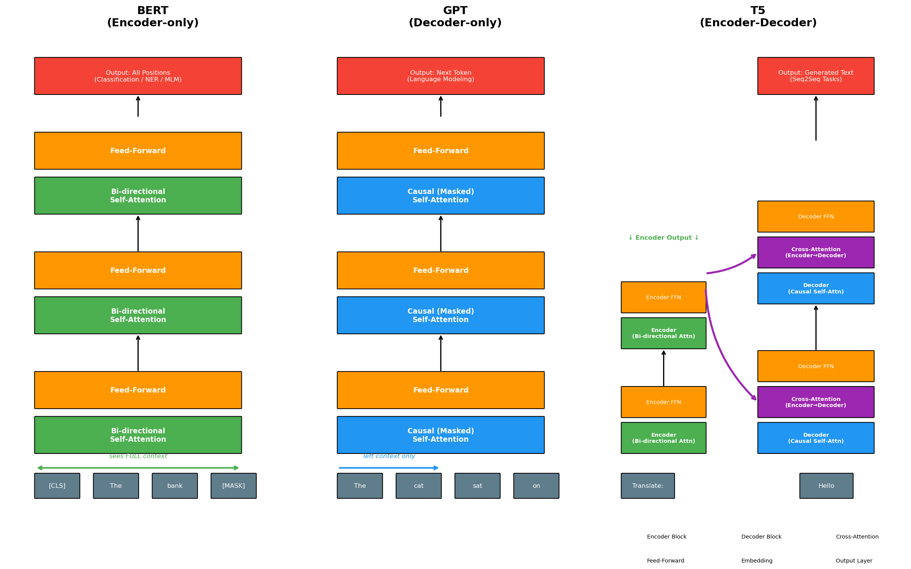

# Day 5: Encoder-Decoder to Decoder-only — BERT vs GPT, Why GPT Won

> **Core Question**: Why did decoder-only architectures (GPT) come to dominate modern AI, even though BERT initially seemed like the clear winner?

---

## Opening: The Exam Analogy

Imagine two students taking a fill-in-the-blank exam.

**BERT** reads the entire exam paper first — scanning every question, every surrounding sentence — before filling in any blank. It's like an editor who absorbs the full document and then makes targeted edits. This bidirectional approach makes BERT exceptionally good at *understanding* text.

**GPT** writes an essay from scratch, one word at a time. It never looks ahead — each word is chosen based only on everything written so far. It's like a writer in full flow, generating naturally without revision.

Both approaches seemed equally promising in 2018. Yet by 2022, GPT-style models had completely reshaped the AI landscape, spawning ChatGPT and triggering the current LLM explosion. BERT, despite its initial dominance, became a specialized tool rather than the foundation for the future.

Why? The answer lies in four concrete mechanisms — and understanding them will transform how you think about architecture choices in deep learning.


*Figure 1: Three transformer architectures — Encoder-only (BERT), Decoder-only (GPT), and Encoder-Decoder (T5). Each makes different tradeoffs between understanding and generation.*

---

## 1. The Three Architectures

The 2017 Transformer paper ([Vaswani et al.](https://arxiv.org/abs/1706.03762)) introduced an encoder-decoder model for machine translation. But researchers quickly realized the architecture could be split, specialized, and scaled in different ways. By 2018–2020, three distinct paradigms had emerged.

### 1.1 Encoder-only: BERT (2018)

BERT ([Devlin et al., 2018](https://arxiv.org/abs/1810.04805)) strips the Transformer down to its encoder half. Each layer applies **bidirectional self-attention** — every token attends to every other token in the sequence, in both directions simultaneously.

Think of it like having a conversation where you've already read the entire transcript before responding. The word "bank" in "I walked to the bank by the river" is understood in full context — BERT sees both "river" (downstream) and "walked to" (upstream) when encoding that ambiguous word.

The training objective is **Masked Language Modeling (MLM)**: randomly mask 15% of input tokens and train the model to predict them. Why 15%? Lower is too easy (too much context); higher is too hard (not enough signal). The 15% was found empirically optimal in the original paper.

```python
# BERT in action: masked token prediction
from transformers import BertTokenizer, BertForMaskedLM
import torch

tokenizer = BertTokenizer.from_pretrained('bert-base-uncased')
model = BertForMaskedLM.from_pretrained('bert-base-uncased')

# Mask "sat" in "The cat sat on the mat"
text = "The cat [MASK] on the mat."
inputs = tokenizer(text, return_tensors='pt')

with torch.no_grad():
    outputs = model(**inputs)

# Get predicted token for the [MASK] position
mask_idx = (inputs['input_ids'] == tokenizer.mask_token_id).nonzero()[0][1]
logits = outputs.logits[0, mask_idx]
predicted_token = tokenizer.decode([logits.argmax()])
print(f"Predicted: {predicted_token}")  # → "sat"
```

BERT's bidirectional attention is powerful for **understanding** — but it creates a fundamental problem for **generation**: to predict the next token, you'd need to mask it and re-run the full model. This is prohibitively slow.

### 1.2 Decoder-only: GPT (2018–present)

GPT ([Radford et al., 2018](https://openai.com/research/language-unsupervised)) uses only the Transformer decoder's self-attention layers, with one critical modification: a **causal mask** (lower-triangular mask) that prevents each position from attending to future positions.

This is the "moving wall" mental model: at position *t*, you can see tokens 1 through *t*, but positions *t+1* onward are invisible. This constraint makes GPT naturally autoregressive — it generates text one token at a time, each prediction conditioned only on what came before.

The training objective is **Causal Language Modeling (CLM)**: predict the next token at every position simultaneously. The beauty of this? Training signal comes from *every single position* in the sequence, not just the masked 15% like BERT.

```python
# GPT in action: text generation
from transformers import GPT2LMHeadModel, GPT2Tokenizer

tokenizer = GPT2Tokenizer.from_pretrained('gpt2')
model = GPT2LMHeadModel.from_pretrained('gpt2')

prompt = "The transformer architecture"
inputs = tokenizer(prompt, return_tensors='pt')

# Autoregressively generate 30 more tokens
# Each token is predicted from all previous tokens
outputs = model.generate(
    inputs['input_ids'],
    max_new_tokens=30,
    do_sample=True,        # Sampling for diversity
    temperature=0.8,       # Controls randomness
    pad_token_id=tokenizer.eos_token_id
)
print(tokenizer.decode(outputs[0], skip_special_tokens=True))
```

### 1.3 Encoder-Decoder: T5 (2020)

T5 ([Raffel et al., 2020](https://arxiv.org/abs/1910.10683)) keeps the full Transformer — encoder reads the input with bidirectional attention, decoder generates the output with causal attention, and **cross-attention** lets the decoder query encoder representations at each step.

T5's insight was framing everything as "text-to-text": translation, summarization, classification, QA — all become "given this text, generate that text." It's elegant and powerful, but also complex: two separate stacks, cross-attention to manage, and inference that requires the full encoder pass before any decoding begins.

---

## 2. Attention Masks: The Core Difference

The single most important structural difference between BERT and GPT is the attention mask.


*Figure 2: Left — BERT's full attention matrix: every token attends to every other token (all ✓). Right — GPT's causal mask: lower-triangular, with future positions blocked (✗). This one difference determines everything.*

For a sequence of length *n*:

- **BERT**: attention matrix is fully dense — O(n²) operations, all positions attend to all positions
- **GPT**: attention matrix is lower-triangular — same O(n²) operations, but with future masked out

The mathematical consequence: BERT can't generate text efficiently, because generating token *t+1* requires the token to be present in the input (masked), which defeats the purpose of generation. GPT can generate efficiently because predicting position *t+1* only requires the already-computed representations of positions 1 through *t*.

---

## 3. Training Objectives: MLM vs CLM

### 3.1 The Math

Here are the formal objectives for both training paradigms:

$$
\begin{aligned}
\mathcal{L}_{\text{MLM}} &= -\sum_{i \in \mathcal{M}} \log P(x_i \mid x_{\backslash \mathcal{M}}) \quad &\text{(BERT: predict masked tokens)} \\[8pt]
\mathcal{L}_{\text{CLM}} &= -\sum_{t=1}^{T} \log P(x_t \mid x_1, x_2, \ldots, x_{t-1}) \quad &\text{(GPT: predict next token)} \\[8pt]
P(x_1, \ldots, x_T) &= \prod_{t=1}^{T} P(x_t \mid x_{<t}) \quad &\text{(chain rule factorization)}
\end{aligned}
$$

Where:
- $\mathcal{M}$ = set of masked token indices (for MLM)
- $x_{\backslash \mathcal{M}}$ = all non-masked tokens (visible context for BERT)
- $x_{<t}$ = all tokens before position *t* (left context for GPT)

**Key insight from the math**: MLM trains on only ~15% of tokens per sequence (the masked ones). CLM trains on *every single token position* — 100% training signal efficiency. This means GPT extracts 6–7× more training signal from the same amount of data.


*Figure 3: MLM vs CLM training objectives. BERT predicts masked tokens in parallel using full bidirectional context. GPT predicts each next token sequentially using only left context — but trains on every position.*

### 3.2 Why CLM Gets More Signal

Consider a sequence of 1000 tokens:
- BERT masks ~150 tokens → trains on 150 prediction tasks
- GPT trains on 1000 prediction tasks (every position predicts the next)

This isn't just about efficiency — it's about what the model learns. GPT must internalize the entire distributional structure of language to minimize CLM loss. It can't "cheat" by just copying visible context; it must actually model language.

---

## 4. Why GPT Won: Four Concrete Mechanisms

This is the crux of the article. The question isn't just "which is better" — it's *why* the mechanisms of decoder-only architectures proved decisive at scale.


*Figure 4: Four concrete reasons why decoder-only architectures came to dominate. Each reason compounds the others — together they create a decisive advantage at scale.*

### 4.1 KV-Cache: The Inference Efficiency Killer Feature

When GPT generates token *t+1*, it needs attention over positions 1 through *t*. In standard attention, computing the Key (K) and Value (V) matrices for all previous positions at every new step would be O(n²) per token — brutally slow.

The solution: **KV-cache**. Since past positions never change (causal mask — position *t* only sees *t* and earlier), we cache the K and V matrices for all previous positions. Adding token *t+1* only requires computing K and V for that *one new position*, not all previous ones.

```python
# Pseudocode: KV-cache in action
class GPTWithKVCache:
    def __init__(self):
        self.kv_cache = []  # Cache of (K, V) for each layer
    
    def generate_one_token(self, new_token_embedding):
        # For each transformer layer:
        for layer in self.layers:
            # Compute K, V for NEW token only
            new_k = layer.W_k(new_token_embedding)
            new_v = layer.W_v(new_token_embedding)
            
            # Extend cache with new K, V
            self.kv_cache[layer].append((new_k, new_v))
            
            # Compute Q for new token, attend to ALL cached K, V
            new_q = layer.W_q(new_token_embedding)
            all_k = torch.cat([c[0] for c in self.kv_cache[layer]])
            all_v = torch.cat([c[1] for c in self.kv_cache[layer]])
            
            attn_output = attention(new_q, all_k, all_v)
            new_token_embedding = layer.ffn(attn_output)
        
        return new_token_embedding
```

**Why does BERT lack this?** BERT's bidirectional attention means every position can see every other position. If you change one token (e.g., append a new token), you potentially change all attention scores everywhere — the cache is invalidated. There is no simple KV-cache for bidirectional models.

This single advantage makes GPT-style generation dramatically faster at inference time. GPT's per-token generation cost is O(n) (attend to cached K,V), not O(n²) per step.

### 4.2 Training Parallelization: Full Sequence Utilization

During training, GPT processes the entire sequence in one forward pass due to the causal mask. All positions (1 through T) are trained simultaneously:

- Position 1 predicts position 2
- Position 2 predicts position 3
- ...
- Position T-1 predicts position T

This is massively GPU-parallel. Every single token in every single training document contributes gradients simultaneously. For a 1-trillion-token training corpus, GPT trains on 1 trillion prediction tasks. BERT trains on roughly 150 billion (15% × 1T).

The implication for scaling: GPT can be trained on larger datasets with greater computational efficiency. When you're pushing to 100B+ parameters, this efficiency gap becomes critical.

### 4.3 Unified Paradigm: One Architecture, All Tasks

BERT's bidirectionality is great for classification — but BERT needs a different head for every task:
- Text classification: [CLS] token → linear classifier
- Named entity recognition: each token → linear classifier
- Question answering: two pointers for start/end spans
- Machine translation: needs an entirely separate decoder architecture

GPT says: *every task is text generation*. The API for every task is identical:

```python
# Everything is text generation with GPT
tasks = {
    "translation":    "Translate to French: The cat is sleeping. →",
    "classification": "Sentiment of 'I loved this movie': positive or negative? →",
    "summarization":  "Summarize: [long article]... Summary:",
    "qa":             "Q: What is the capital of France? A:",
    "code":           "Write a Python function to reverse a string:\ndef reverse_string(",
}

for task, prompt in tasks.items():
    result = gpt.generate(prompt)
    print(f"{task}: {result}")
```

This unified paradigm means:
1. One model can handle unlimited task types without fine-tuning
2. New capabilities emerge from prompting alone
3. No architecture modifications for new tasks
4. Transfer across tasks happens naturally

### 4.4 In-Context Learning: The Emergent Scaling Reward

This is perhaps the most surprising mechanism. At sufficient scale (GPT-3's 175B parameters), decoder-only models develop the ability to **learn from examples provided directly in the input**:

```
# Zero-shot
Translate to French: The cat is sleeping.
Translation:

# Few-shot (in-context learning)
Translate to French: The dog runs. → Le chien court.
Translate to French: Birds fly. → Les oiseaux volent.
Translate to French: The cat is sleeping.
Translation:
```

The few-shot GPT-3 often matches or beats fine-tuned BERT-sized models on the same tasks — *without any gradient updates*. The model appears to perform task recognition and adaptation within a single forward pass.

Why does this emerge in decoder-only models and not encoder-only? The leading hypothesis: autoregressive training forces the model to solve an implicit meta-learning problem. To predict each next token, it must track what task is being described in the context, adapt its "strategy," and apply that strategy to new inputs. This meta-learning capacity is baked into CLM training at scale.

Bidirectional models like BERT don't develop this capability — there's no incentive during masked-token prediction to learn to read task specifications and apply them.

---

## 5. The Architecture Evolution Timeline


*Figure 5: Architecture evolution from 2017 to 2023. BERT initially dominated NLP benchmarks, but decoder-only models (GPT-2, GPT-3, ChatGPT) showed increasingly powerful capabilities at scale, ultimately winning the mainstream.*

The timeline tells the story clearly:

| Year | Model | Architecture | Significance |
|------|-------|-------------|--------------|
| 2017 | Transformer | Enc-Dec | Foundation: "Attention Is All You Need" |
| 2018 | BERT | Encoder-only | SOTA on 11 NLP benchmarks — BERT fever |
| 2018 | GPT-1 | Decoder-only | 117M params, promising but not yet viral |
| 2019 | GPT-2 | Decoder-only | 1.5B params — "too dangerous to release" |
| 2020 | T5 | Enc-Dec | Text-to-text unification, 11B params |
| 2020 | GPT-3 | Decoder-only | 175B params — in-context learning emerges |
| 2022 | ChatGPT | Decoder-only + RLHF | 100M users in 2 months |
| 2023 | LLaMA/Gemini/Claude | Decoder-only | Entire industry converges on decoder-only |

The tipping point was GPT-3 (2020). Its in-context learning capability, combined with the inference efficiency advantages of KV-cache, made scaling decoder-only models the obvious path forward. ChatGPT (2022) just made this mainstream-visible.

---

## 6. BERT Isn't Dead

A common misconception: "GPT won, so BERT is obsolete." This is wrong.

BERT's bidirectional encoding remains the best tool for several critical applications:

**Semantic Search & Retrieval**: BERT-style models (and their descendants like [Sentence-BERT](https://arxiv.org/abs/1908.10084)) generate rich contextual embeddings that capture meaning in a fixed-size vector. These power modern search systems:

```python
from sentence_transformers import SentenceTransformer
import numpy as np

# Encode documents and queries for semantic search
model = SentenceTransformer('all-MiniLM-L6-v2')

documents = [
    "Neural networks learn from data",
    "Transformers use attention mechanisms",
    "BERT is bidirectional",
]
query = "How does BERT process text?"

# Encode everything at once (batch processing)
doc_embeddings = model.encode(documents)
query_embedding = model.encode(query)

# Cosine similarity search
similarities = np.dot(doc_embeddings, query_embedding) / (
    np.linalg.norm(doc_embeddings, axis=1) * np.linalg.norm(query_embedding)
)
best_match = documents[np.argmax(similarities)]
print(f"Most relevant: {best_match}")
```

**Text Classification at Scale**: For production classification systems (spam detection, sentiment, intent classification), BERT-sized models fine-tuned on labeled data are often faster, cheaper, and more accurate than prompting a large GPT model.

**Retrieval-Augmented Generation (RAG)**: In modern RAG systems, the *retrieval* step often uses BERT-style encoders to find relevant documents, while GPT-style decoders generate the final answer. BERT and GPT work together.

**Why BERT survives**: Its bidirectional encoding creates better token/sentence embeddings for *understanding* tasks. GPT embeddings are less semantically tight because the model is optimized for generation, not similarity matching.

---

## 7. Common Misconceptions

### ❌ "BERT can be used for text generation too, just slowly"

Not really. BERT's fill-in-the-blank (MLM) can fill one masked token per forward pass, but this doesn't scale to coherent multi-sentence generation. The model was never trained to maintain narrative coherence across autoregressively generated text. True generation requires the causal structure of GPT.

### ❌ "T5 should have won because it combines the best of both"

T5 is powerful and still widely used (especially for specific seq2seq tasks). But the encoder-decoder split creates inference complexity: you need to run the full encoder before starting decoding, and there's no simple KV-cache for the cross-attention mechanism. At inference time, this overhead compounds. For conversational AI at scale, GPT's simpler architecture wins on deployment economics.

### ❌ "Decoder-only models don't understand text, they just predict tokens"

This conflates mechanism with capability. GPT-3 and later models demonstrate sophisticated language understanding (reading comprehension, logical reasoning, code analysis) despite being "just" next-token predictors. The CLM objective, applied at sufficient scale, forces the model to build deep world models to minimize prediction loss. Understanding emerges from generation training.

### ❌ "Bigger always beats architecture choice"

Architecture matters enormously. A 7B decoder-only model (e.g., LLaMA-2-7B) outperforms many earlier 13B models across benchmarks. The decoder-only architecture's training efficiency means each parameter is better utilized.

---

## 8. Code Example: Architecture in Practice

```python
# Side-by-side comparison: BERT vs GPT for the same task
from transformers import (
    BertTokenizer, BertForSequenceClassification,
    GPT2LMHeadModel, GPT2Tokenizer,
    pipeline
)

# ---- BERT: Classification (its strength) ----
bert_classifier = pipeline(
    'sentiment-analysis',
    model='distilbert-base-uncased-finetuned-sst-2-english'
)
text = "The transformer architecture changed everything about NLP"

# BERT processes the full text bidirectionally
result = bert_classifier(text)
print(f"BERT sentiment: {result[0]['label']} ({result[0]['score']:.3f})")

# ---- GPT: Generation (its strength) ----
gpt_generator = pipeline('text-generation', model='gpt2')

# GPT generates the next tokens autoregressively
generated = gpt_generator(
    "The transformer architecture changed everything about",
    max_new_tokens=20,
    do_sample=True,
    temperature=0.7,
    pad_token_id=50256  # GPT-2's EOS token
)
print(f"GPT completion: {generated[0]['generated_text']}")

# Key insight: these models excel at fundamentally different tasks
# Use BERT-family for: classification, NER, embeddings, retrieval
# Use GPT-family for: generation, conversation, in-context learning
```

---

## 9. Further Reading

### Beginner

1. [The Illustrated BERT, ELMo, and co.](https://jalammar.github.io/illustrated-bert/) by Jay Alammar — Visual walkthrough of BERT's design
2. [The Illustrated GPT-2](https://jalammar.github.io/illustrated-gpt2/) by Jay Alammar — How GPT generates text, step by step

### Advanced

1. [Understanding Large Language Models](https://www.cs.princeton.edu/courses/archive/fall22/cos597G/lectures/lec01.pdf) — Princeton COS 597G lecture notes
2. [Efficient Transformers: A Survey](https://arxiv.org/abs/2009.06732) — Overview of attention efficiency improvements including KV-cache

### Papers

1. [BERT: Pre-training of Deep Bidirectional Transformers](https://arxiv.org/abs/1810.04805) — Devlin et al., Google (2018)
2. [Language Models are Unsupervised Multitask Learners (GPT-2)](https://cdn.openai.com/better-language-models/language_models_are_unsupervised_multitask_learners.pdf) — Radford et al., OpenAI (2019)
3. [Language Models are Few-Shot Learners (GPT-3)](https://arxiv.org/abs/2005.14165) — Brown et al., OpenAI (2020)
4. [Exploring the Limits of Transfer Learning with T5](https://arxiv.org/abs/1910.10683) — Raffel et al., Google (2020)
5. [Sentence-BERT: Sentence Embeddings using Siamese BERT-Networks](https://arxiv.org/abs/1908.10084) — Reimers & Gurevych (2019)

---

## Reflection Questions

1. **The KV-cache advantage**: Why does the causal mask enable KV-caching but bidirectional attention does not? What specifically about bidirectional attention invalidates a cached Key-Value matrix when a new token is appended?

2. **Training efficiency tradeoff**: CLM trains on 100% of token positions vs MLM's ~15%. Does this mean CLM always converges faster? Are there tasks where MLM's bidirectional training signal is actually *better* per token? Think about tasks where context is symmetric.

3. **The unified paradigm assumption**: GPT claims "all tasks = text generation." But some tasks are genuinely not text generation — for example, structured prediction (output a parse tree, a table, a protein sequence). How would you use a decoder-only model for these? What are the limits of the text-generation paradigm?

4. **BERT's future**: In a world where RAG systems use BERT for retrieval and GPT for generation, is there a single architecture that could do both well? What would it look like?

---

## Summary

| Concept | One-line Explanation |
|---------|---------------------|
| **BERT** | Encoder-only; bidirectional attention; excellent for understanding, poor for generation |
| **GPT** | Decoder-only; causal mask; excellent for generation, scales to trillion-token training |
| **T5** | Encoder-Decoder; powerful seq2seq but complex inference |
| **MLM** | Train by predicting ~15% masked tokens — bidirectional but data-inefficient |
| **CLM** | Train by predicting next token at every position — 100% data efficiency |
| **KV-cache** | Cache K,V for past tokens; enabled by causal mask; makes GPT inference fast |
| **In-context learning** | Emerges at scale in decoder-only; adapt to new tasks from examples in prompt |
| **Why BERT survives** | Better embeddings for search/retrieval/classification; used in RAG retrieval step |

**Key Takeaway**: GPT's victory over BERT wasn't a matter of one architecture being "smarter" — it was four concrete mechanical advantages that compound at scale: KV-cache enables fast inference, CLM provides more training signal, the unified text-generation paradigm eliminates task-specific engineering, and in-context learning emerges naturally from autoregressive training. BERT isn't dead, but its domain is now clearly circumscribed: dense retrieval, classification, and embedding tasks where bidirectional understanding genuinely matters. Everything else has converged on decoder-only architectures.

---

*Day 5 of 60 | LLM Fundamentals*
*Word count: ~3250 | Reading time: ~16 minutes*
