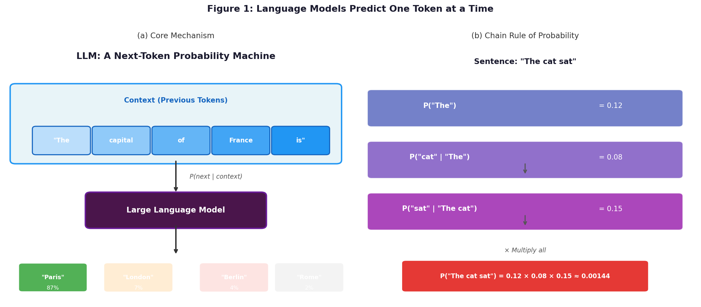
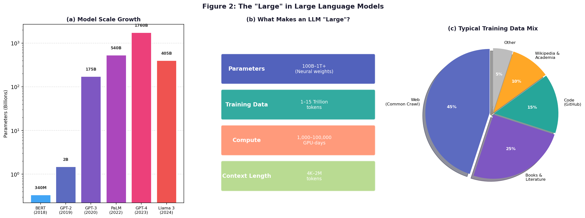
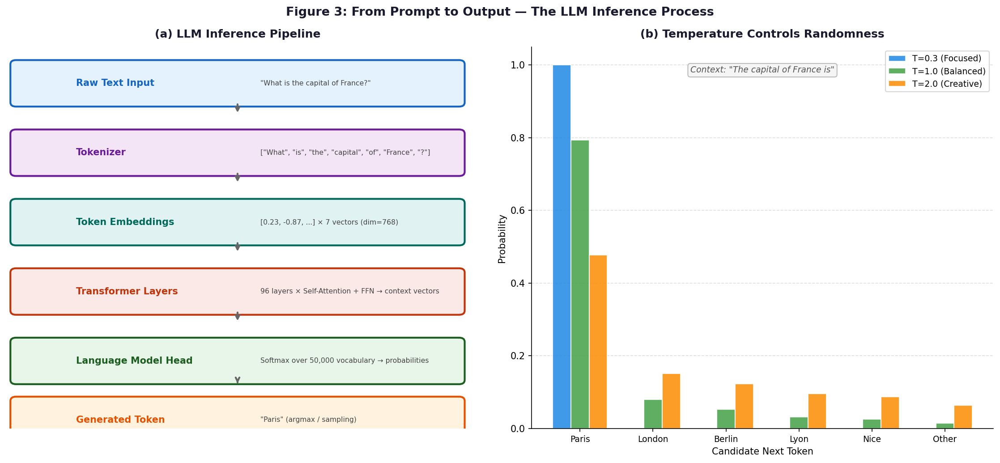

# Day 6: What Is a Large Language Model?

> **Core Question**: What *exactly* is a Large Language Model doing when it generates text — and why does that simple mechanism produce something that feels like intelligence?

---

## Opening: The World's Most Sophisticated Autocomplete

You've seen autocomplete on your phone keyboard. Type "Happy birth" and it suggests "day." Type "I'll be there" and it offers "soon." It's useful, occasionally uncanny, but nobody would call it intelligent.

Now imagine scaling that autocomplete by a factor of a billion. Not just trained on your personal messages, but on virtually everything humans have written — novels, scientific papers, Reddit arguments, Stack Overflow answers, Shakespeare, Reddit arguments about Shakespeare. And instead of a simple lookup table, imagine a system with hundreds of billions of adjustable parameters, trained for months on thousands of GPUs, learning intricate statistical patterns in language.

The result is a Large Language Model. And its core job is still "predict the next word." But that deceptively simple objective, applied at massive scale, produces something that can write code, explain quantum mechanics, translate languages, and pass medical licensing exams.

This is one of the most surprising findings in modern AI: **you don't need to explicitly program intelligence. You just need to predict the next token, at scale, on enough data.**

---

## 1. The One-Sentence Definition

An LLM is a function that computes:

$$
P(\text{next token} \mid \text{context})
$$

That's it. Given a sequence of tokens (words, subwords, punctuation), it outputs a probability distribution over what token is likely to come next.

Everything else — the seemingly intelligent responses, the code generation, the multi-step reasoning — emerges from applying this single operation repeatedly, one token at a time.


*Figure 1: At its core, an LLM assigns a probability to every possible next token given the context. Panel (a) shows the intuition: given "The capital of France is", the model assigns 87% probability to "Paris". Panel (b) shows how a full sentence's probability is computed by multiplying individual conditional probabilities — the chain rule of probability.*

---

## 2. The Mathematics Behind the Definition

### 2.1 Joint Probability via the Chain Rule

How does a language model assign a probability to an entire sentence? Through the **chain rule of probability**:

$$
P(x_1, x_2, \ldots, x_T) = \prod_{t=1}^{T} P(x_t \mid x_1, x_2, \ldots, x_{t-1})
$$

This says: the probability of a sentence is the product of the probability of each word given all the words before it. An LLM learns to compute each of these conditional probabilities.

For example, for the sentence "The cat sat on the mat":

$$
\begin{aligned}
P(\text{"The cat sat"}) &= P(\text{"The"}) \\
&\times P(\text{"cat"} \mid \text{"The"}) \\
&\times P(\text{"sat"} \mid \text{"The cat"})
\end{aligned}
$$

### 2.2 Training: Learning from Prediction Errors

The model is trained by minimizing the **cross-entropy loss** — essentially penalizing the model whenever it assigns low probability to the actual next token:

$$
\mathcal{L} = -\frac{1}{T} \sum_{t=1}^{T} \log P(x_t \mid x_1, \ldots, x_{t-1})
$$

If the model predicted 10% probability for the correct next token, the loss is $-\log(0.1) \approx 2.30$. If it predicted 90% correctly, the loss is $-\log(0.9) \approx 0.10$. Training pushes the model to be as confident as possible about the right answer — on trillions of examples.

### 2.3 Autoregressive Generation

At inference time, generation is **autoregressive**: the model produces one token, appends it to the context, then predicts the next token using that extended context, and so on:

$$
x_{T+1} \sim P(\cdot \mid x_1, \ldots, x_T)
$$
$$
x_{T+2} \sim P(\cdot \mid x_1, \ldots, x_T, x_{T+1})
$$
$$
\vdots
$$

This is why generation can feel fluent — each new token is chosen to be coherent with everything that came before.

---

## 3. What Makes It "Large"?

The word "large" in Large Language Model is doing a lot of work. It refers to three interrelated things:


*Figure 2: Panel (a) shows the explosion of model sizes from BERT (340M parameters in 2018) to modern models exceeding 400B parameters. Panel (b) summarizes the key dimensions of scale. Panel (c) shows a typical training data composition — the internet (Common Crawl) dominates, supplemented by books, code, and structured knowledge.*

### 3.1 Parameters: The Learned Knowledge

Modern LLMs have tens to hundreds of billions of **parameters** — numerical values in matrices that encode the model's knowledge and capabilities. Think of parameters like the weights of a vast web of associations: "when I see the token sequence 'Eiffel Tower', the word 'Paris' should get high probability." These weights are adjusted during training to minimize prediction error.

GPT-3 has 175 billion parameters. GPT-4 is estimated at around 1.76 trillion. For reference, the human brain has roughly 100 trillion synapses — but synapses and parameters aren't directly comparable (models are usually much more efficient per unit of compute).

### 3.2 Training Data: The Compressed Knowledge

LLMs are trained on **1 to 15 trillion tokens** of text. That's roughly the equivalent of reading every book in the Library of Congress hundreds of times, plus consuming a significant fraction of the indexed internet.

Here's an analogy: think of the trained model as a **compressed representation of human written knowledge**. The weights don't literally store sentences — instead, they encode statistical patterns so deep and intricate that the model can reconstruct or generalize from them. It's like the difference between storing every photo you've ever seen vs. learning to recognize faces well enough to recognize ones you've never seen before.

### 3.3 Compute: The Industrial Process

Training a frontier LLM requires tens of thousands of specialized GPUs running in parallel for months. GPT-3's training run was estimated to cost around $4–5 million in compute alone. Training GPT-4 reportedly cost over $100 million. This isn't just "running code" — it's an industrial-scale optimization process that requires careful engineering of data pipelines, distributed training, numerical stability, and hardware failure recovery.

---

## 4. The Transformer: The Architecture That Made This Possible

While the "what" of an LLM is *next-token prediction*, the "how" is almost universally the **Transformer architecture** (which we explored in Day 3 and Day 4). Worth briefly recapping why:

Before Transformers, sequence models were RNNs — they processed tokens one by one, maintaining a hidden state that had to encode everything relevant. This was a bottleneck: by the time you processed the 500th token, the model had largely "forgotten" the 1st.

Transformers replaced this with **self-attention**: every token can directly "look at" every other token in the context window, with learned attention weights determining what's relevant. This means:
- No forgetting — the entire context is always accessible
- Parallelizable — all tokens can be processed simultaneously during training
- Scalable — bigger models simply have more attention heads and larger weight matrices

For Day 6, think of it this way: the Transformer is the engine; next-token prediction is the fuel; scale is what makes the engine roar.

---

## 5. From Next-Token Prediction to Apparent Intelligence

This is the part that puzzles many people. How does "predict the next word" produce something that can:
- Write working Python code
- Explain the French Revolution
- Debug a segfault
- Pass the bar exam

The answer isn't fully understood, but the current best hypothesis is **compression as understanding**. To accurately predict the next token in a research paper about protein folding, the model must have learned something about protein folding. To predict the next token in a Python function, it must understand Python semantics. To predict dialogue in a novel, it must model human psychology.

The training objective *forces* the model to develop internal representations that capture the underlying structure of the data. Prediction at this scale and breadth requires building something like a model of the world.

---

## 6. The Inference Pipeline in Practice

Let's trace what actually happens when you send a message to an LLM:


*Figure 3: Panel (a) shows the full inference pipeline from raw text to generated token — through tokenization, embedding, transformer layers, and the language model head. Panel (b) shows how the temperature parameter controls the sharpness of the output probability distribution, trading off determinism vs. diversity.*

1. **Tokenization**: Your text is split into tokens (subwords, roughly 3–4 characters each for English). "ChatGPT" becomes ["Chat", "G", "PT"]. The vocabulary is typically 50,000–100,000 tokens.

2. **Embedding**: Each token is mapped to a dense vector (e.g., 768 or 4096 dimensions). Similar tokens get similar vectors — "cat" and "kitten" end up nearby in this space.

3. **Transformer Processing**: The token vectors flow through dozens (or hundreds) of transformer layers. Self-attention lets every token update its representation by attending to other tokens. By the final layer, each token's vector encodes rich contextual information.

4. **Language Model Head**: The final token's vector is projected through a weight matrix to produce a score for every token in the vocabulary — 50,000+ numbers.

5. **Softmax**: Scores are converted to probabilities via softmax. The highest-scoring token gets the highest probability.

6. **Sampling**: A token is chosen according to these probabilities. At **temperature = 0** (greedy decoding), always the highest-probability token. At **temperature > 1**, the distribution is flattened, producing more diverse (and sometimes more creative, sometimes more wrong) outputs.

---

## 7. Code Example: Simulating the Core Idea

Here's a simplified PyTorch sketch of the core LLM mechanism — not a full implementation, but enough to see the math:

```python
import torch
import torch.nn.functional as F

def next_token_probabilities(logits: torch.Tensor, temperature: float = 1.0) -> torch.Tensor:
    """
    Convert raw logits to a probability distribution over next tokens.
    
    Args:
        logits: Raw scores from model's final layer, shape (vocab_size,)
        temperature: Controls sharpness. 
                     < 1.0 = more deterministic, > 1.0 = more random
    Returns:
        Probability distribution over vocabulary, shape (vocab_size,)
    """
    # Scale logits by temperature
    scaled_logits = logits / temperature
    
    # Convert to probabilities via softmax
    # softmax(x_i) = exp(x_i) / sum(exp(x_j) for all j)
    probs = F.softmax(scaled_logits, dim=-1)
    
    return probs


def greedy_decode(probs: torch.Tensor) -> int:
    """Always pick the highest probability token."""
    return torch.argmax(probs).item()


def sample_decode(probs: torch.Tensor) -> int:
    """Sample a token proportional to probabilities."""
    return torch.multinomial(probs, num_samples=1).item()


# Example: imagine vocab size = 5
# Tokens: ["Paris", "London", "Berlin", "Lyon", "Other"]
logits = torch.tensor([3.5, 1.2, 0.8, 0.3, -0.5])

# Different temperatures, different behaviors
for temp in [0.3, 1.0, 2.0]:
    probs = next_token_probabilities(logits, temperature=temp)
    print(f"T={temp}: Paris={probs[0]:.3f}, London={probs[1]:.3f}, Berlin={probs[2]:.3f}")

# Output:
# T=0.3: Paris=0.986, London=0.010, Berlin=0.003
# T=1.0: Paris=0.850, London=0.099, Berlin=0.066
# T=2.0: Paris=0.565, London=0.170, Berlin=0.134
```

The key insight: at low temperature, the model is very confident and almost always picks "Paris." At high temperature, it might occasionally pick "Berlin" — which could be wrong for a factual question, but might be desirable for generating diverse creative text.

---

## 8. Common Misconceptions

### ❌ "LLMs understand language like humans do"

LLMs are extraordinarily good at *predicting* language patterns. Whether this constitutes "understanding" in a philosophical sense is genuinely debated. What's clear is that LLMs have no sensory experience, no embodiment, and no persistent memory across conversations (by default). Their "knowledge" is frozen at training time. They may not "understand" anything — but they've learned statistical patterns deep enough to be extremely useful.

### ❌ "LLMs are just lookup tables / search engines"

A lookup table stores explicit answers. An LLM generates responses token by token based on learned *patterns*, not stored text. This is why it can write a poem about a topic it has never encountered explicitly, or combine concepts in novel ways. It's more like a jazz musician who has internalized musical theory than a DJ who plays existing recordings.

### ❌ "Bigger is always better"

While scaling has produced dramatic improvements, there are diminishing returns. A 7B parameter model running locally on your laptop may outperform a 175B model for specific narrow tasks if it's been better fine-tuned. The Chinchilla scaling laws (Day 9) showed that GPT-3 was actually *undertrained* — more data and fewer parameters can beat more parameters with less data.

### ❌ "The model knows what it knows"

LLMs have no reliable mechanism for knowing what they know vs. what they don't. This is the root cause of hallucination — a topic we'll dig into in Day 21. The model will confidently produce a plausible-looking next token even when no correct answer exists in its training distribution.

---

## 9. Why "Large" Was the Key Insight

For years, researchers built language models but they remained narrow. They could predict the next word in a newspaper corpus reasonably well, but they didn't generalize. The crucial insight from scaling research was:

**Emergent capabilities appear at scale thresholds that weren't predictable from smaller models.**

A model with 10 million parameters struggles at in-context learning. A model with 100 billion parameters does it surprisingly well — even though nobody explicitly programmed this capability. This is the phenomenon of **emergence** (Day 10), and it's one reason frontier AI labs invest so heavily in compute: they're essentially buying capabilities they can't get by smarter engineering alone.

---

## 10. Capability Boundaries and Academic Debates

Now that you understand *what* an LLM is, it's equally important to understand what it *isn't*. LLMs are powerful, but they're not a universal solution — and the AI research community is actively debating their fundamental limitations.

### 10.1 What LLMs Excel At

| Capability | Why It Works |
|------------|--------------|
| **Text generation** | Direct training objective |
| **Translation** | Massive multilingual data |
| **Summarization** | Compression is implicit in next-token prediction |
| **Code generation** | Code follows learnable patterns |
| **Style transfer** | Stylistic patterns in training data |
| **Few-shot learning** | Emergent in-context learning ability |

These tasks share a common thread: they can be framed as *plausible continuation* of an input sequence. LLMs are essentially masters of *what sounds right* based on the patterns they've absorbed.

### 10.2 What LLMs Struggle With (And What's Improving)

| Limitation | Root Cause | 2026 Status |
|------------|------------|-------------|
| **Precise calculation** | Pattern-matching, not computation | ✅ **Largely solved** via CoT + verification |
| **Reliable factual recall** | Knowledge is compressed, not indexed | 🟡 Improving with RAG |
| **Causal reasoning** | Correlation ≠ causation | ✅ **Much better** with CoT/ToT |
| **Real-time learning** | Weights frozen at inference | ❌ Still unsolved |
| **Self-knowledge** | No reliable uncertainty mechanism | 🟡 Improving with calibration |
| **Long-horizon planning** | Myopic token generation | 🟡 Improving with agents |

**The 2026 reality**: Chain-of-Thought (CoT) and reasoning models like o1/o3 have dramatically improved math and reasoning capabilities. Models now solve IMO-level problems and pass bar exams. However, this is achieved through *learning to reason step-by-step* rather than fundamental architectural changes — the debate continues on whether this is "true" reasoning or sophisticated pattern-matching of reasoning patterns.

**What remains hard**: Real-time learning (updating knowledge without retraining), reliable self-knowledge (knowing when to say "I don't know"), and tasks requiring genuine world interaction rather than text manipulation.

### 10.3 The "Stochastic Parrot" Critique

In 2021, a famous paper by Bender et al. introduced the term **"stochastic parrot"** to describe LLMs:

> "A stochastic parrot is a system that haphazardly stitches together sequences of linguistic forms ... without any reference to meaning."

**The critique**: LLMs manipulate symbols without grounding in the real world. They learn correlations between words, but not the *concepts* those words refer to. A child learns "hot" by touching a stove; an LLM learns "hot" by observing which words appear near it.

**The counter-argument**: At sufficient scale, do rich enough correlations *become* a form of understanding? The debate continues.

### 10.4 Yann LeCun and the World Model Argument

**Yann LeCun**, formerly Meta's Chief AI Scientist (now founder of his own AI research company), has been one of the most vocal critics of the LLM paradigm. His key arguments:

1. **LLMs lack world models**: They don't build internal representations of how the world works — they only model text distributions.

2. **Next-token prediction is insufficient**: Human cognition involves predicting the future state of the world, not just the next word.

3. **LLMs can't reason**: They can mimic reasoning patterns they've seen, but don't perform genuine causal inference.

LeCun advocates for a different approach: **Joint Embedding Predictive Architectures (JEPA)** — models that learn to predict in *representation space* rather than token space, and build hierarchical world models.

### 10.5 Alternative Architectures Being Explored

| Architecture | Key Idea | Status |
|--------------|----------|--------|
| **JEPA** (LeCun) | Predict representations, not tokens; build world models | Research stage |
| **V-JEPA** | Video-based JEPA for learning physics | Published 2024 |
| **Mamba / State Space Models** | O(n) complexity for long sequences (100K+ tokens); Transformer still wins on short sequences | Growing adoption for long-context use cases |
| **Neuro-symbolic AI** | Combine neural networks with symbolic reasoning | Active research |
| **Retrieval-Augmented Generation** | Ground LLMs with external knowledge | Production use |

**The honest answer**: As of 2026, no alternative has matched LLMs' general capability, but the fundamental limitations LeCun and others highlight remain unsolved.

### 10.6 A Balanced View

LLMs are best understood as:
- ✅ **Extremely powerful** for language-centric tasks
- ✅ **Useful components** in larger systems (with tools, retrieval, verification)
- ❌ **Not AGI** — they lack genuine reasoning, world models, and self-awareness
- ❌ **Not reliable** for tasks requiring factual precision without verification

**The practical takeaway**: Use LLMs for what they're good at, build guardrails for what they're bad at, and stay informed as the field evolves.

---

## 11. Further Reading

### Foundational Papers
1. [Language Models are Unsupervised Multitask Learners (GPT-2)](https://cdn.openai.com/better-language-models/language_models_are_unsupervised_multitask_learners.pdf) — The paper that showed scale unlocks unexpected capabilities
2. [Language Models are Few-Shot Learners (GPT-3)](https://arxiv.org/abs/2005.14165) — The landmark 175B paper; read Section 2 for the training setup
3. [Training Compute-Optimal Large Language Models (Chinchilla)](https://arxiv.org/abs/2203.15556) — The paper that changed how we think about the right balance of parameters vs. data

### Accessible Explanations
1. [Andrej Karpathy - "Intro to Large Language Models"](https://www.youtube.com/watch?v=zjkBMFhNj_g) — 1-hour lecture, excellent from-scratch intuition
2. [Jay Alammar - "The Illustrated GPT-2"](https://jalammar.github.io/illustrated-gpt2/) — Visual walkthrough of the autoregressive generation process
3. [Simon Willison - "What I've learned about LLMs"](https://simonwillison.net/2023/Aug/3/weird-world-of-llms/) — Practitioner's perspective on how LLMs actually behave

---

## 12. Reflection Questions

1. If an LLM's entire training signal is "predict the next token," what are the fundamental *limits* of what it can learn? What kinds of knowledge or skills are in principle impossible to acquire this way?

2. The temperature parameter trades off determinism vs. diversity. When would you want a very low temperature? When would you want a high temperature? Can you think of use cases where either extreme causes problems?

3. Consider this claim: "LLMs don't understand — they just pattern-match." Design a thought experiment that would help you distinguish between 'deep pattern matching' and 'genuine understanding' — if such a distinction is even coherent.

---

## 13. Summary

| Concept | One-line Explanation |
|---------|---------------------|
| LLM core operation | $P(\text{next token} \mid \text{context})$ — predict the next token |
| Chain rule | $P(\text{sentence}) = \prod_t P(x_t \mid x_{<t})$ |
| Training objective | Minimize cross-entropy loss on next-token prediction |
| "Large" | Refers to parameters (100B+), training data (1T+ tokens), and compute |
| Autoregressive generation | Generate one token at a time, feeding output back as input |
| Temperature | Controls sharpness of output distribution; lower = more deterministic |
| Emergence | Capabilities that appear at scale thresholds, not visible in smaller models |
| Hallucination root cause | No mechanism to distinguish "I know this" from "I'll predict something plausible" |

**Key Takeaway**: A Large Language Model is a function that computes $P(\text{next token} \mid \text{context})$, trained at massive scale to minimize prediction error on human text. The intelligence we observe is not programmed explicitly — it *emerges* from the pressure of accurately predicting an enormous diversity of human-generated text. Everything you've seen LLMs do (code, reasoning, translation, creativity) is downstream of this deceptively simple objective applied at previously impossible scale.

---

*Day 6 of 60 | LLM Fundamentals*  
*Word count: ~2400 | Reading time: ~12 minutes*
