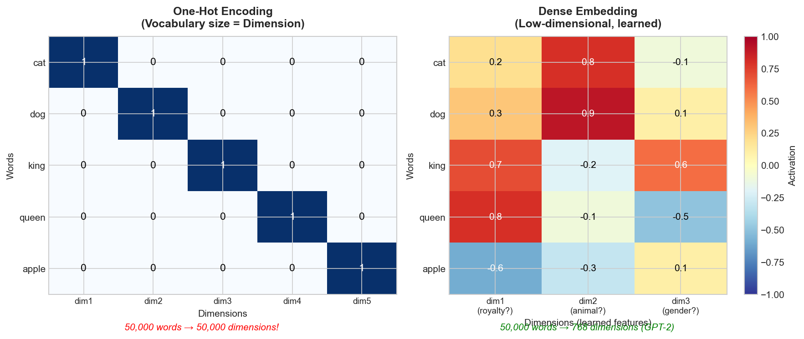
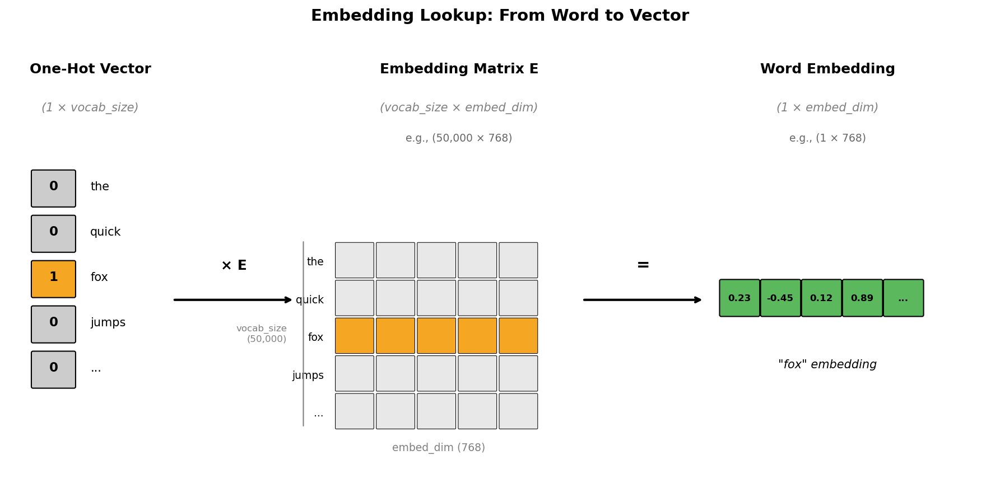
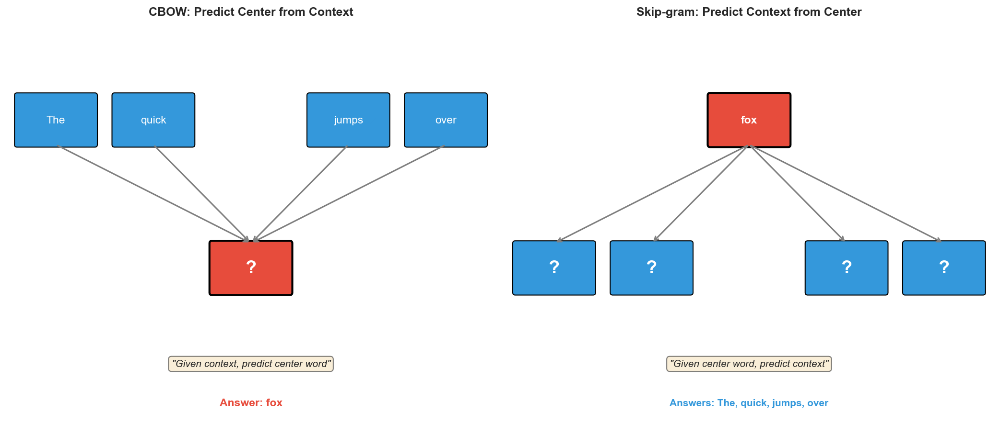
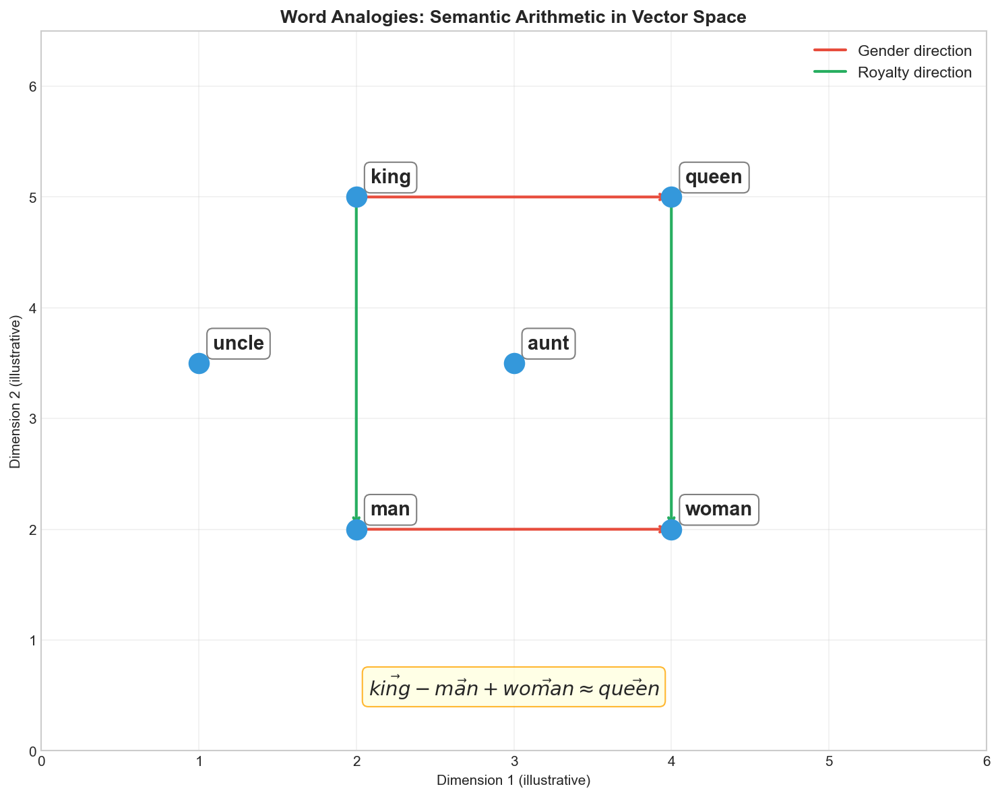
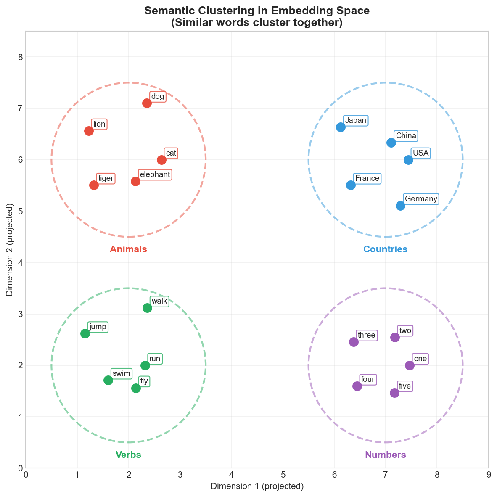
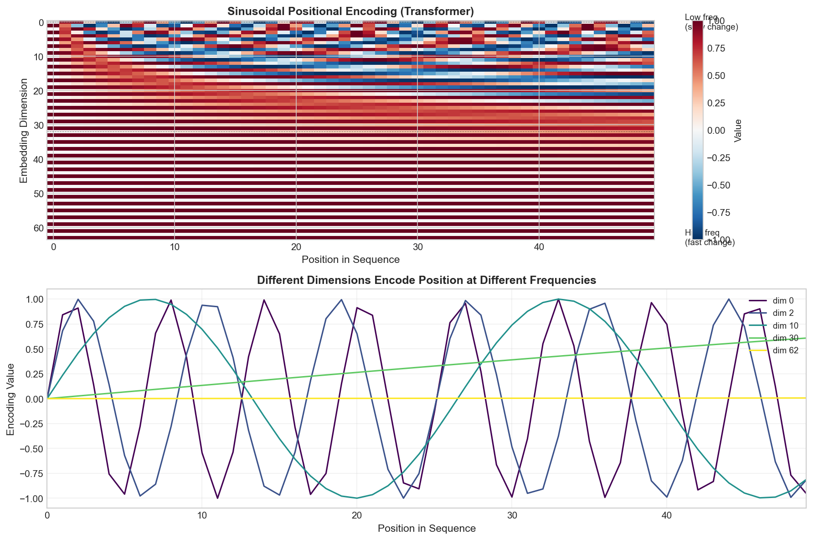
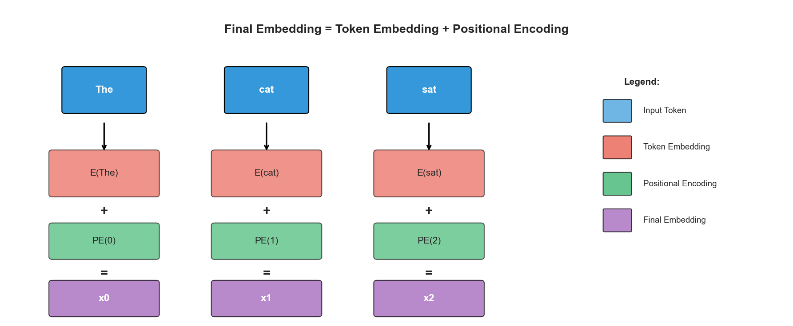

# Day 8: The Magic of Embeddings

> **Core Question**: How do neural networks understand words? How does "king - man + woman = queen" actually work?

---

## Opening

Imagine you're asked to measure the "distance" between two words: *cat* and *dog*. How would you do it?

If words were just arbitrary symbols—like index numbers in a dictionary—there'd be no meaningful way to measure this. "Cat" might be word #3,847 and "dog" might be word #12,456. The numerical difference tells us nothing about their relationship.

But what if we could place words in a **space** where position carries meaning? What if *cat* and *dog* naturally sat close together (both are pets, animals, four-legged), while *democracy* floated far away?

This is exactly what **embeddings** do. They transform discrete symbols into continuous vectors where **geometric relationships encode semantic relationships**. It's like giving words GPS coordinates in a universe of meaning—and it's one of the most beautiful ideas in modern AI.

Think of it this way: a library organizes books by call numbers (discrete labels), but a good librarian knows that books on similar topics *should* sit on nearby shelves. Embeddings are the mathematical machinery that automatically discovers where each "book" (word) should be placed.

In this article, we'll explore how embeddings work, why they're fundamental to every language model, and how simple arithmetic on vectors can capture complex semantic relationships.

---

## 1. From One-Hot to Dense: The Representation Problem

### 1.1 The Curse of One-Hot Encoding

The naive way to represent words for a computer is **one-hot encoding**: create a vector as long as your vocabulary, put a 1 in the position for that word, and 0s everywhere else.


*Figure 1: One-hot encoding creates sparse, high-dimensional vectors with no semantic information. Dense embeddings compress meaning into few dimensions.*

For a vocabulary of 50,000 words, each word becomes a 50,000-dimensional vector with exactly one non-zero element. This has three fatal problems:

1. **Dimensional explosion**: Memory and computation scale with vocabulary size
2. **No similarity**: Every pair of one-hot vectors is equally distant (orthogonal)
3. **No generalization**: "cat" and "kitten" share nothing in common structurally

The last point is crucial. If a model learns something about "cat," that knowledge cannot transfer to "kitten" because their representations share no structure.

### 1.2 The Distributional Hypothesis

The solution comes from a linguistic insight known as the **distributional hypothesis**:

> *"You shall know a word by the company it keeps."* — J.R. Firth, 1957

Words that appear in similar contexts tend to have similar meanings. "Dog" and "cat" both appear near words like "pet," "fur," "veterinarian"—this contextual pattern reveals their semantic similarity.

Embeddings operationalize this insight: they learn vector representations such that words appearing in similar contexts get similar vectors.

### 1.3 Dense Embeddings: Compression with Meaning

A **dense embedding** maps each word to a low-dimensional vector (typically 256-1024 dimensions) where:

- **Proximity encodes similarity**: Similar words have similar vectors
- **Dimensions are learned features**: Each dimension might capture some aspect of meaning (though not usually interpretable)
- **Arithmetic captures relationships**: Vector operations correspond to semantic operations

The embedding matrix $E \in \mathbb{R}^{V \times d}$ where $V$ is vocabulary size and $d$ is embedding dimension, contains one row per word. Looking up a word's embedding is just fetching that row:

$$
\text{embedding}(\text{word}_i) = E[i, :] \in \mathbb{R}^d
$$

This is mathematically equivalent to multiplying a one-hot vector by the embedding matrix—but implemented as a direct lookup for efficiency.


*Figure 2: An embedding layer is simply a lookup table. The one-hot multiplication is equivalent to selecting a row from the learned matrix.*

---

## 2. Word2Vec: Learning Embeddings from Context

### 2.1 The Word2Vec Revolution

In 2013, Tomas Mikolov and colleagues at Google released **Word2Vec**, demonstrating that simple neural networks trained on large text corpora could learn embeddings that captured remarkable semantic properties.

Word2Vec comes in two flavors:

- **CBOW (Continuous Bag of Words)**: Predict the center word from surrounding context
- **Skip-gram**: Predict surrounding context words from the center word


*Figure 3: CBOW predicts the center word from context; Skip-gram predicts context from the center word. Skip-gram generally works better for rare words.*

### 2.2 Skip-gram in Detail

For the sentence "The quick **fox** jumps over", Skip-gram asks: given "fox," can we predict "quick" and "jumps"?

The model has two matrices:
- $W_{\text{in}} \in \mathbb{R}^{V \times d}$: Input embeddings (for center words)
- $W_{\text{out}} \in \mathbb{R}^{d \times V}$: Output embeddings (for context words)

For each (center, context) pair, the probability is:

$$
P(\text{context} | \text{center}) = \frac{\exp(w_{\text{context}}^T \cdot w_{\text{center}})}{\sum_{w \in V} \exp(w^T \cdot w_{\text{center}})}
$$

**Breaking down this formula:**

| Symbol | Meaning | Example |
|--------|---------|---------|
| $w_{\text{center}}$ | Vector of the center word (from $W_{\text{in}}$) | "fox" → [0.7, 0.8, 0.9] |
| $w_{\text{context}}$ | Vector of the context word (from $W_{\text{out}}$) | "quick" → [0.3, 0.4, 0.5] |
| $w_{\text{context}}^T \cdot w_{\text{center}}$ | Dot product = similarity score | 0.98 (higher = more similar) |
| $\exp(\cdot)$ | Exponential function, makes all values positive (see below) | $e^{0.98} = 2.66$ |
| $\sum_{w \in V}$ | Sum over ALL words in vocabulary | Sum for the, quick, fox, jumps, over... |

**In plain English:**

- **Numerator** $\exp(w_{\text{context}}^T \cdot w_{\text{center}})$: "How similar are 'fox' and 'quick'?" — Higher dot product = more similar = larger numerator.

- **Denominator** $\sum_{w \in V} \exp(w^T \cdot w_{\text{center}})$: "How similar is 'fox' to EVERY word in the vocabulary?" — This normalizes the score so all probabilities sum to 1.

- **The whole formula**: "What fraction of the total similarity does 'quick' get?" — If fox-quick similarity is high relative to fox-everything-else, P(quick|fox) is high.

> **Intuition**: This is just softmax! We're asking: "Given that I see 'fox', which word is most likely to appear nearby?" The model learns to give high scores to words that actually co-occur.

**Why do we need exp()?**

Vector elements can be **negative** (they're learned from random initialization), so dot products can also be negative:

| Dot product | exp() result | Meaning |
|-------------|--------------|---------|
| -2.0 | 0.135 | Low similarity → low probability |
| 0.0 | 1.0 | Neutral |
| +2.0 | 7.39 | High similarity → high probability |

Since probabilities must be positive, exp() maps any real number to **(0, +∞)**. This is why softmax uses exp()—it converts arbitrary similarity scores into valid probabilities.

**Why do probabilities sum to 1?**

Notice that the denominator sums over ALL words, while the numerator is just ONE word. When we add up probabilities for all words:

$$\sum_{\text{all words}} P(\text{word}|\text{fox}) = \sum_{\text{all words}} \frac{\exp(\text{score}_{\text{word}})}{\underbrace{\sum_{w} \exp(\text{score}_w)}_{\text{same for all}}} = \frac{\text{denominator}}{\text{denominator}} = 1$$

**Verification with our numbers:**
```
P(the|fox)   = 1.65 / 11.45 = 0.144
P(quick|fox) = 2.66 / 11.45 = 0.232
P(fox|fox)   = 2.10 / 11.45 = 0.183
P(jumps|fox) = 3.39 / 11.45 = 0.296
P(over|fox)  = 1.65 / 11.45 = 0.144
────────────────────────────────────
Total                       = 0.999 ≈ 1 ✓
```

Training maximizes this probability across all observed (center, context) pairs in the corpus. The resulting $W_{\text{in}}$ matrix becomes the word embeddings.

#### Concrete Example: Computing P(quick | fox)

Let's walk through Step by step with actual numbers.

**Setup:**
- Sentence: "The quick fox jumps over"
- Center word: "fox"
- Context word we want to predict: "quick" (window size = 1)
- Tiny vocabulary: {the, quick, fox, jumps, over} (V = 5)
- Embedding dimension: d = 3

**The two matrices (randomly initialized):**

$W_{\text{in}}$ (5×3) - for center words:
| Word | dim0 | dim1 | dim2 |
|------|------|------|------|
| the | 0.1 | 0.2 | 0.3 |
| quick | 0.4 | 0.5 | 0.6 |
| **fox** | **0.7** | **0.8** | **0.9** |
| jumps | 0.2 | 0.3 | 0.4 |
| over | 0.5 | 0.6 | 0.7 |

$W_{\text{out}}$ (3×5) - for context words:
| | the | quick | fox | jumps | over |
|------|------|------|------|------|------|
| dim0 | 0.1 | 0.3 | 0.2 | 0.4 | 0.1 |
| dim1 | 0.2 | 0.4 | 0.3 | 0.5 | 0.2 |
| dim2 | 0.3 | 0.5 | 0.4 | 0.6 | 0.3 |

**Step 1:** Get "fox" input vector: $w_{\text{center}} = [0.7, 0.8, 0.9]$

**Step 2:** Get "quick" output vector: $w_{\text{context}} = [0.3, 0.4, 0.5]$

**Step 3:** Compute dot product (similarity):
$$w_{\text{context}}^T \cdot w_{\text{center}} = 0.3 \times 0.7 + 0.4 \times 0.8 + 0.5 \times 0.9 = 0.98$$

**Step 4:** Compute dot products for ALL words (the denominator):
- the: $0.1 \times 0.7 + 0.2 \times 0.8 + 0.3 \times 0.9 = 0.50$
- quick: $0.98$ ← our target
- fox: $0.2 \times 0.7 + 0.3 \times 0.8 + 0.4 \times 0.9 = 0.74$
- jumps: $0.4 \times 0.7 + 0.5 \times 0.8 + 0.6 \times 0.9 = 1.22$
- over: $0.50$

**Step 5:** Apply softmax:
$$P(\text{quick} | \text{fox}) = \frac{e^{0.98}}{e^{0.50} + e^{0.98} + e^{0.74} + e^{1.22} + e^{0.50}} = \frac{2.66}{11.45} = 0.23$$

**Result:** Only 23% probability—too low! Training will adjust the matrices so that "fox" and "quick" have higher dot product (more similar vectors), making P(quick|fox) higher.

> **Key Insight:** Words that frequently appear together get pushed to have similar vectors through this training process.

### 2.3 Negative Sampling: Making Training Practical

The softmax denominator requires summing over all vocabulary words—prohibitively expensive. **Negative sampling** solves this by reformulating the problem:

Instead of predicting the correct context word, the model learns to distinguish **real** (center, context) pairs from **fake** ones (center, random word).

For a positive pair $(w, c)$ and $k$ negative samples $\{n_1, ..., n_k\}$:

$$
\begin{aligned}
\mathcal{L} &= \log \sigma(w_c^T \cdot w_w) + \sum_{i=1}^{k} \log \sigma(-w_{n_i}^T \cdot w_w)
\end{aligned}
$$

where $\sigma$ is the sigmoid function. This transforms an expensive softmax into $k+1$ binary classifications.

#### Concrete Example: Why Negative Sampling is Faster

Let's continue with our "fox" example to see why this matters.

**The Problem with Softmax:**

In Step 4 above, we computed dot products for ALL 5 words. But real vocabularies have 50,000+ words—that's 50,000 dot products per training sample!

**Negative Sampling Solution:**

Instead of asking "which word is the context?" (50,000-way classification), we ask "is this pair real or fake?" (binary classification).

**Setup:**
- Positive sample: (fox, quick) ✅ — actually appeared together
- Negative samples (k=2): (fox, the) ❌, (fox, over) ❌ — randomly paired

**What the model learns:**
- Give (fox, quick) a HIGH score → they really co-occur
- Give (fox, the) a LOW score → fake pair
- Give (fox, over) a LOW score → fake pair

**Computing the Loss:**

Using our vectors from before:
- fox = [0.7, 0.8, 0.9]
- quick = [0.3, 0.4, 0.5] (positive)
- the = [0.1, 0.2, 0.3] (negative)

Dot products:
- fox · quick = 0.98 (want this HIGH)
- fox · the = 0.50 (want this LOW)

Loss calculation:
$$\mathcal{L} = \log \sigma(0.98) + \log \sigma(-0.50) = \log(0.73) + \log(0.38) = -0.31 + (-0.97) = -1.28$$

Training pushes:
- fox · quick **higher** → first term improves
- fox · the **lower** → second term improves

**Speed Comparison:**

| Method | Dot products per sample |
|--------|------------------------|
| Softmax | 50,000 |
| Negative Sampling (k=5) | **6** (1 positive + 5 negative) |

That's **8,000x faster**!

> 📚 **Historical Note: Where Did Negative Sampling Come From?**
> 
> Negative sampling was introduced by Tomas Mikolov et al. at Google in 2013, in the paper *"Distributed Representations of Words and Phrases and their Compositionality."*
> 
> The idea evolved in stages:
> 1. **Original Word2Vec (early 2013)**: Used *Hierarchical Softmax* — a binary tree structure that reduced V computations to log(V). Faster, but still complex.
> 2. **Inspiration from NCE**: A statistical technique called *Noise Contrastive Estimation* (Gutmann & Hyvärinen, 2010) proposed: instead of learning "what's the right answer," learn "how to distinguish real from fake."
> 3. **Simplification**: Mikolov simplified NCE by dropping the normalization constant estimation. Mathematically less rigorous, but practically just as effective—and much simpler to implement.
> 
> The key insight: reframe a 50,000-class problem as "is this pair real or fake?" Like changing an exam from "pick the right answer from 50,000 choices" to "is this answer correct? yes/no."

---

## 3. The Magic: Semantic Arithmetic

### 3.1 King - Man + Woman = Queen

The most famous result from Word2Vec is that vector arithmetic captures semantic relationships:

$$
\vec{\text{king}} - \vec{\text{man}} + \vec{\text{woman}} \approx \vec{\text{queen}}
$$

This works because embeddings learn **consistent directional relationships**:
- The "male→female" direction is similar whether you start from "king," "man," "uncle," or "actor"
- The "commoner→royalty" direction is consistent across genders


*Figure 4: Word analogies work because relationships are encoded as consistent directions in embedding space.*

### 3.2 Why Does This Work?

The magic comes from the training objective. Consider the analogy "king:queen :: man:woman."

During training:
- "King" and "queen" appear in similar contexts (royalty, throne, crown)
- "King" and "man" share contexts (he, him, male names)
- "Queen" and "woman" share contexts (she, her, female names)

The optimization pressure forces embeddings to satisfy all these constraints simultaneously. The solution is a structured space where semantic relationships emerge as geometric properties.

### 3.3 Limitations of Static Embeddings

Word2Vec embeddings are **static**—each word gets exactly one vector regardless of context. This fails for:

- **Polysemy**: "bank" (financial) vs "bank" (river) get the same embedding
- **Context-dependent meaning**: "apple" in "Apple stock" vs "apple pie"

This limitation motivated **contextual embeddings** (ELMo, BERT, GPT) where word representations depend on their surrounding context. We'll explore these in later articles.

---

## 4. Semantic Clustering in Vector Space

Embeddings naturally organize into semantic clusters. Similar words cluster together, and relationships between clusters often parallel real-world taxonomies.


*Figure 5: Words cluster by semantic category. Animals, countries, verbs, and numbers form distinct regions in embedding space.*

This clustering emerges automatically from the distributional patterns in training data. No one tells the model that "dog" and "cat" are animals—it discovers this structure by observing that they appear in similar contexts.

**Why does this self-organization happen?** Think about it: "cat" and "dog" both frequently co-occur with words like "feed", "vet", "pet", "cute". Training pushes "cat" closer to these context words, and separately pushes "dog" closer to the same context words. As a side effect, "cat" and "dog" end up near each other — not because we labeled them as similar, but because they share similar contexts. The semantic geometry emerges naturally from co-occurrence statistics.

The practical implication: tasks like finding synonyms, detecting related concepts, or clustering documents become simple geometric operations (nearest neighbors, clustering algorithms, etc.).

---

## 5. Positional Encoding: Where Are You in the Sequence?

### 5.1 The Position Problem

Embeddings solve word representation, but they don't capture **word order**. The sentences "Dog bites man" and "Man bites dog" would have identical bag-of-embeddings representations despite meaning very different things.

RNNs (Recurrent Neural Networks) solved this by processing words sequentially—position was implicit in the processing order. But Transformers process all positions in parallel, so they need explicit position information.

### 5.2 Sinusoidal Positional Encoding

The original Transformer paper introduced **sinusoidal positional encoding**:

$$
\begin{aligned}
PE_{(pos, 2i)} &= \sin\left(\frac{pos}{10000^{2i/d}}\right) \\
PE_{(pos, 2i+1)} &= \cos\left(\frac{pos}{10000^{2i/d}}\right)
\end{aligned}
$$

where $pos$ is the position and $i$ is the dimension index.


*Figure 6: Sinusoidal positional encoding. Different dimensions encode position at different frequencies, allowing the model to attend to both local and global positions.*

### 5.3 Why Sinusoids?

This design has elegant properties:

1. **Unique encoding**: Each position gets a unique pattern
2. **Relative positions**: $PE_{pos+k}$ can be expressed as a linear function of $PE_{pos}$
3. **Bounded values**: All values stay in $[-1, 1]$
4. **Extrapolation**: Can theoretically extend to positions longer than training

The intuition: different frequencies let the model reason about position at different scales. Low-frequency dimensions change slowly across positions (capturing global structure), while high-frequency dimensions change rapidly (capturing local relationships).

### 5.4 Learned vs Fixed Positional Encodings

Modern models often use **learned positional embeddings** instead—just another embedding matrix indexed by position. GPT-2 and BERT both use learned positions.

More recent innovations include:
- **RoPE (Rotary Position Embedding)**: Encodes relative position through rotation in complex space
- **ALiBi (Attention with Linear Biases)**: Adds position-dependent bias to attention scores
- **NoPE**: Some models work without explicit positional encoding by relying on causal attention structure

---

## 6. Token + Position = Input Representation

In Transformers, the final input representation combines token embeddings with positional encodings:

$$
x_i = \text{TokenEmbed}(w_i) + \text{PositionEncode}(i)
$$


*Figure 7: The final embedding fed to the Transformer is the sum of token embedding and positional encoding.*

This simple addition is remarkably effective. The model learns to use both pieces of information—the token embedding tells it *what* the word is, and the positional encoding tells it *where* the word is.

---

## 7. Code Example: Exploring Embeddings

```python
import torch
import torch.nn as nn
import numpy as np

# Create a simple embedding layer
vocab_size = 10000
embedding_dim = 256

# This is just a learnable lookup table!
embedding = nn.Embedding(vocab_size, embedding_dim)

# Look up embeddings for some tokens
token_ids = torch.tensor([42, 1337, 999])  # Three words
vectors = embedding(token_ids)  # Shape: (3, 256)

print(f"Token IDs shape: {token_ids.shape}")
print(f"Embeddings shape: {vectors.shape}")

# Compute cosine similarity between words
def cosine_similarity(v1, v2):
    return torch.dot(v1, v2) / (torch.norm(v1) * torch.norm(v2))

# Before training, embeddings are random
sim_01 = cosine_similarity(vectors[0], vectors[1])
print(f"Similarity between word 42 and 1337: {sim_01:.4f}")

# Positional encoding implementation
def get_positional_encoding(max_len, d_model):
    """Generate sinusoidal positional encoding."""
    pe = torch.zeros(max_len, d_model)
    position = torch.arange(0, max_len, dtype=torch.float).unsqueeze(1)
    div_term = torch.exp(torch.arange(0, d_model, 2).float() * 
                        (-np.log(10000.0) / d_model))
    
    pe[:, 0::2] = torch.sin(position * div_term)  # Even dimensions
    pe[:, 1::2] = torch.cos(position * div_term)  # Odd dimensions
    
    return pe

# Generate positional encodings
pe = get_positional_encoding(max_len=512, d_model=256)
print(f"Positional encoding shape: {pe.shape}")

# Combine token + position embeddings
sequence_length = 3
token_embeddings = vectors  # From embedding lookup
position_embeddings = pe[:sequence_length]  # Get first 3 positions

# Final input to transformer
final_embeddings = token_embeddings + position_embeddings
print(f"Final embeddings shape: {final_embeddings.shape}")
```

---

## 8. Math Derivation [Optional]

> This section provides deeper mathematical foundations for interested readers.

### 8.1 Why Dot Product Measures Similarity

The dot product between two vectors $\mathbf{a}$ and $\mathbf{b}$ is:

$$
\mathbf{a} \cdot \mathbf{b} = \|\mathbf{a}\| \|\mathbf{b}\| \cos(\theta)
$$

where $\theta$ is the angle between them. For normalized vectors (unit length):

$$
\mathbf{a} \cdot \mathbf{b} = \cos(\theta)
$$

This ranges from:
- $+1$ when vectors point the same direction (angle = 0°)
- $0$ when vectors are perpendicular (angle = 90°)
- $-1$ when vectors point opposite directions (angle = 180°)

This is why **cosine similarity** is the standard metric for comparing embeddings.

### 8.2 The Embedding Matrix as Linear Transform

Mathematically, looking up an embedding can be viewed as a matrix multiplication:

$$
\mathbf{e} = \mathbf{x}^T E
$$

where $\mathbf{x} \in \mathbb{R}^V$ is a one-hot vector and $E \in \mathbb{R}^{V \times d}$ is the embedding matrix.

Since $\mathbf{x}$ has exactly one non-zero element (at position $i$), this multiplication simply selects row $i$ of $E$. But the matrix formulation shows that embeddings are a learnable linear projection from the one-hot space to the embedding space.


*Figure 7: The complete flow from one-hot to dense embedding. Left: sparse one-hot vector (only 1 non-zero). Middle: the learned embedding matrix (each row is a word's "meaning"). Right: dense embedding (every value carries semantic information). The operation is just matrix multiplication, but equivalently, it's looking up row i of E.*

**What this projection really means:**

| Space | Dimensionality | Properties |
|-------|----------------|------------|
| One-hot space | V = 50,000 | Sparse, no semantics, just an index |
| Embedding space | d = 768 | Dense, every dimension carries meaning |

The embedding matrix $E$ learns to compress the vast, meaningless one-hot space into a compact, semantically rich space where similar words are nearby.

### 8.3 Why Addition Works for Position + Token

When we add token and position embeddings, it might seem like information would get mixed up and lost. But the model can later separate them through linear operations!

Consider the attention query:

$$
Q = W_Q (E_{\text{token}} + E_{\text{pos}}) = W_Q E_{\text{token}} + W_Q E_{\text{pos}}
$$

This uses the **distributive property** of linear algebra. But why doesn't the information interfere?

**Concrete Example:**

```
E_token("fox") = [0.5, 0.3, 0.8, 0.2]   ← semantic meaning of "fox"
E_pos(3)       = [0.1, 0.0, 0.1, 0.0]   ← encoding for position 3
──────────────────────────────────────
Sum            = [0.6, 0.3, 0.9, 0.2]   ← combined vector
```

The information looks "mixed," but $W_Q$ can learn to **separate them**:
- Some rows of $W_Q$ focus on dimensions where token info is strong
- Other rows focus on dimensions where position info is strong

**Why this works: Approximate Orthogonality**

Token embeddings and position embeddings tend to live in different "directions" in the vector space:

$$\langle E_{\text{token}}, E_{\text{pos}} \rangle \approx 0$$

When two signals are roughly orthogonal (perpendicular), they don't destructively interfere, and a linear transformation can learn to extract each one separately.

**Analogy:** It's like audio mixing—if vocals are mostly in low frequencies and music is mostly in high frequencies, you can design a filter to separate them. Similarly, if token and position information occupy different "frequency bands" in the embedding space, the model can learn to tease them apart.

---

## 9. Common Misconceptions

### ❌ "Each embedding dimension represents a specific concept like 'royalty' or 'gender'"

**Reality**: While we visualize embeddings with interpretable axes, the actual learned dimensions are typically not human-interpretable. The meaningful structure exists in the **relationships between vectors**, not in individual dimensions. Some research (like [Mikolov et al., 2013](https://arxiv.org/abs/1301.3781)) found semi-interpretable directions, but this is the exception, not the rule.

### ❌ "Larger embedding dimensions are always better"

**Reality**: There's a sweet spot. Too few dimensions underfit (can't capture vocabulary complexity), too many overfit and waste computation. Most modern LLMs use 768-4096 dimensions depending on model size. The embedding dimension typically scales with model capacity.

### ❌ "Word2Vec embeddings capture all the meaning of words"

**Reality**: Static embeddings like Word2Vec give each word exactly one vector, which fails for polysemous words. "Bank" gets a single embedding that averages its financial and river meanings. Modern contextual embeddings (from Transformers) generate different representations based on context.

---

## 10. Further Reading

### Beginner
1. [The Illustrated Word2Vec](https://jalammar.github.io/illustrated-word2vec/)
   Jay Alammar's visual explanation of Word2Vec mechanics and intuitions.

2. [Understanding Word Vectors](https://gist.github.com/aparrish/2f562e3737544cf29aaf1af30362f469)
   Allison Parrish's creative exploration of what embeddings capture.

### Advanced
1. [Efficient Estimation of Word Representations in Vector Space](https://arxiv.org/abs/1301.3781)
   The original Word2Vec paper (Mikolov et al., 2013).

2. [GloVe: Global Vectors for Word Representation](https://nlp.stanford.edu/projects/glove/)
   Stanford's GloVe project, an alternative to Word2Vec using matrix factorization.

### Papers
1. [Attention Is All You Need](https://arxiv.org/abs/1706.03762)
   Section 3.5 describes the sinusoidal positional encoding in detail.

2. [RoFormer: Enhanced Transformer with Rotary Position Embedding](https://arxiv.org/abs/2104.09864)
   The RoPE paper, widely adopted in modern LLMs like LLaMA.

---

## Reflection Questions

1. **Why might adding (rather than concatenating) token and position embeddings work so well?** Consider the attention mechanism and what information it needs to access.

2. **If embeddings capture meaning through context patterns, what meanings might they fail to capture?** Think about concepts that rarely appear in text or require world knowledge.

   *Hint:* Embeddings can only learn from text co-occurrence. Information that never appears in context cannot be captured:
   
   | Type | Example | Why it's missing |
   |------|---------|------------------|
   | Visual | "Apples are red" | Model never *saw* an apple, only saw "apple" and "red" co-occur |
   | Physical intuition | "Water flows downhill" | Text mentions it, but model doesn't *understand* gravity |
   | Rare entities | Your street name | Probably not in the training corpus |
   | Private knowledge | Your birthday | Not in public text |
   | Recent events | Yesterday's news | After training data cutoff |
   | Commonsense | "Elephant in a fridge" | Absurd scenarios rarely discussed in text |
   
   This is the **Symbol Grounding Problem**: embeddings capture relationships between words in text, not real-world experiences. This limitation is why multimodal models (text + image + audio) are an active research direction.

3. **Modern LLMs often share input and output embeddings (tied embeddings). What does this imply about the relationship between understanding and generating language?**

---

## Summary

| Concept | One-line Explanation |
|---------|---------------------|
| One-hot encoding | Sparse representation where vocabulary size = dimension; no semantic similarity |
| Dense embedding | Learned low-dimensional vectors where proximity encodes semantic similarity |
| Word2Vec | Neural network that learns embeddings by predicting context words |
| Distributional hypothesis | Words with similar contexts have similar meanings |
| Embedding arithmetic | Vector operations (like king - man + woman) capture semantic relationships |
| Positional encoding | Sinusoidal or learned vectors that encode sequence position |
| Final input | Token embedding + positional encoding fed to Transformer |

**Key Takeaway**: Embeddings are the bridge between discrete symbols and continuous mathematics. By learning to place words in a geometric space where distance reflects meaning, neural networks can leverage powerful tools from linear algebra and calculus to process language. This representation learning—turning symbols into vectors—is arguably the foundation of modern NLP. Without embeddings, there would be no way for neural networks to understand that "happy" and "joyful" are related, or to perform the kind of compositional reasoning that makes language models useful.

---

*Day 8 of 60 | LLM Fundamentals*
*Word count: ~2800 | Reading time: ~15 minutes*
