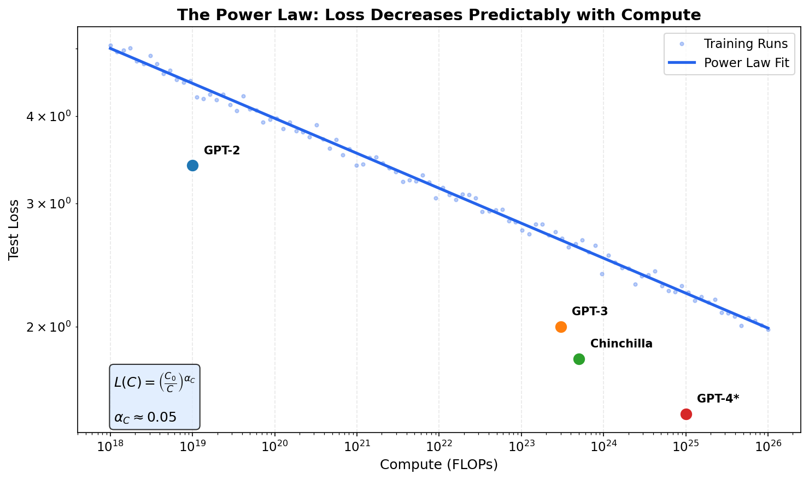
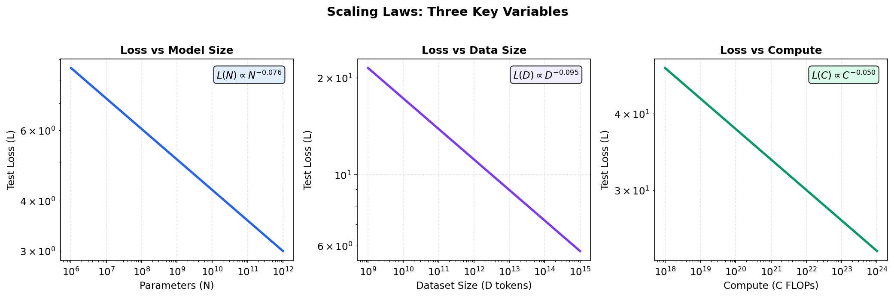
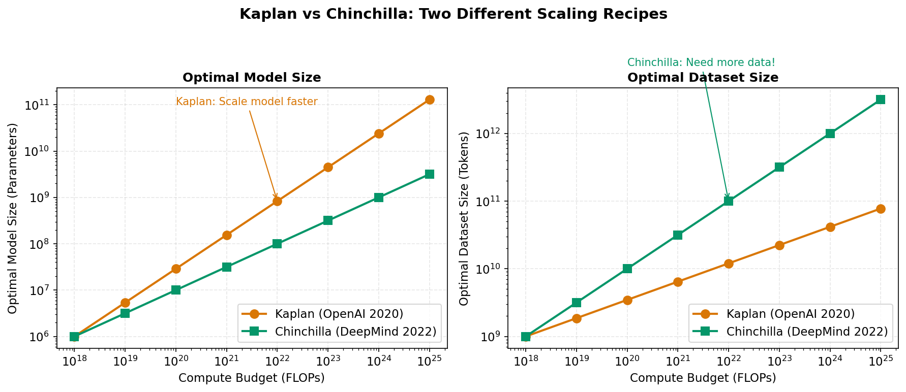
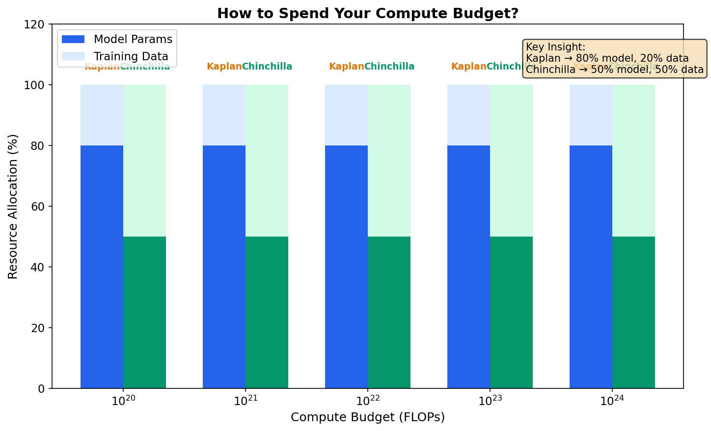
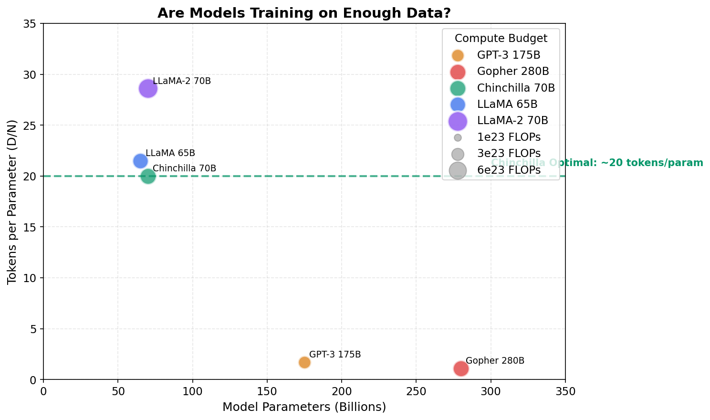
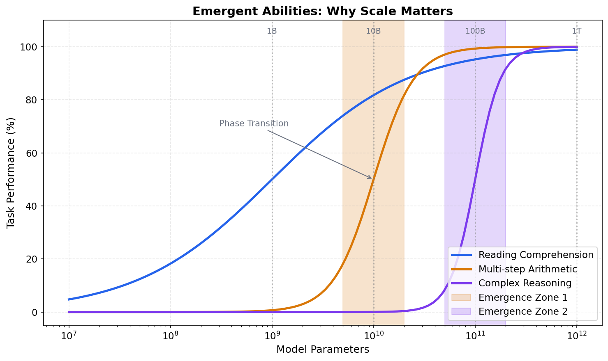
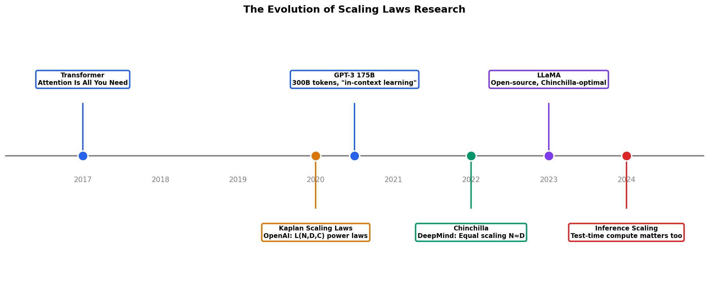

# Day 9: Scaling Laws — The Science of "Bigger is Better"

> **Core Question**: Why do larger models perform better, and how do we predict exactly how much better?

---

## Opening

Imagine you're planning a cross-country road trip with a fixed budget. You have two major expenses: the car itself and fuel. Buy an expensive sports car, and you might run out of gas halfway. Buy a cheap car and fill up constantly, but the car might break down. There's an optimal balance—and it depends on how far you want to go.

Training large language models faces the same dilemma. Your "budget" is compute (measured in FLOPs—floating point operations). Your two expenses are **model size** (more parameters = more expensive to train) and **data** (more training tokens = more compute). The question that haunted researchers for years: **Given a fixed compute budget, what's the optimal way to allocate resources between model size and training data?**

In 2020, OpenAI discovered something remarkable: model performance follows predictable mathematical laws. These **scaling laws** transformed AI development from an art into a science—enabling researchers to predict how well a trillion-parameter model would perform *before* spending hundreds of millions of dollars training it.

This article explains the physics behind why "bigger is better"—and reveals why that's only half the story.

---

## 1. The Power Law: An Unexpectedly Simple Pattern

### 1.1 What Scaling Laws Actually Say

In 2020, Jared Kaplan and colleagues at OpenAI published "Scaling Laws for Neural Language Models," revealing that language model performance (measured by test loss) follows a surprisingly clean mathematical relationship:


*Loss decreases predictably as compute increases, following a power law. Each generation of models falls on this curve.*

The core finding: **Test loss L follows power laws with respect to three key variables**:

$$
\begin{aligned}
L(N) &= \left(\frac{N_c}{N}\right)^{\alpha_N} & \text{where } \alpha_N \approx 0.076 \\
L(D) &= \left(\frac{D_c}{D}\right)^{\alpha_D} & \text{where } \alpha_D \approx 0.095 \\
L(C) &= \left(\frac{C_c}{C}\right)^{\alpha_C} & \text{where } \alpha_C \approx 0.050
\end{aligned}
$$

Where:
- **N** = number of parameters (model size)
- **D** = number of training tokens (dataset size)
- **C** = compute budget (in FLOPs)
- **$\alpha$** = scaling exponents (the crucial numbers!)

### 1.2 What These Numbers Mean

Think of the scaling exponents as "efficiency coefficients":

- **$\alpha_N = 0.076$**: Doubling model size reduces loss by about $2^{0.076} \approx 5.4\%$
- **$\alpha_D = 0.095$**: Doubling training data reduces loss by about $2^{0.095} \approx 6.8\%$
- **$\alpha_C = 0.050$**: Doubling total compute reduces loss by about $2^{0.050} \approx 3.5\%$

This reveals a crucial insight: **Data is slightly more efficient than parameters** for reducing loss (0.095 > 0.076). This seemingly small difference has massive implications, which we'll explore shortly.


*The three fundamental scaling relationships. All follow power laws with different exponents, making performance remarkably predictable.*

### 1.3 Why Power Laws?

Why should neural network performance follow such clean mathematical relationships? Several theories exist:

1. **Statistical mechanics**: Neural networks can be viewed as statistical systems where macro properties emerge from many micro interactions. Power laws are ubiquitous in physics for similar reasons.

2. **Data distribution**: Natural language follows Zipf's law (itself a power law). Models that learn to predict language may inherit this structure.

3. **Feature learning hierarchy**: Larger models learn progressively more abstract features. Each layer of abstraction provides diminishing returns, characteristic of power law behavior.

4. **Optimization dynamics**: The loss landscape of neural networks has fractal-like properties that lead to power law scaling.

The honest answer: we don't fully understand *why* power laws emerge, but empirically, they're remarkably consistent across different architectures, datasets, and training procedures.

---

## 2. Kaplan vs. Chinchilla: A Tale of Two Recipes

### 2.1 The Kaplan Scaling Laws (2020)

The original OpenAI scaling paper recommended a specific recipe for optimal training:

**Kaplan's Recommendation**: When you have more compute, **grow the model faster than the data**.

Specifically, they found:
- Optimal model size scales as $N^* \propto C^{0.73}$
- Optimal dataset size scales as $D^* \propto C^{0.27}$

Translation: If you 10x your compute budget, you should ~5x your model size but only ~2x your data.

This led to a scaling philosophy captured in GPT-3's design: a 175 billion parameter model trained on "only" 300 billion tokens—roughly 1.7 tokens per parameter.

### 2.2 The Chinchilla Revolution (2022)

Two years later, DeepMind's Jordan Hoffmann and colleagues dropped a bombshell: **Kaplan was wrong.**

Their paper "Training Compute-Optimal Large Language Models" (nicknamed "Chinchilla") showed that the optimal allocation is actually:

**Chinchilla's Recommendation**: Model size and data should scale **equally**.

- Optimal model size: $N^* \propto C^{0.5}$  
- Optimal dataset size: $D^* \propto C^{0.5}$

This means for any compute budget, you should train on roughly **20 tokens per parameter**.


*The two scaling recipes give dramatically different recommendations. Chinchilla suggests we need much more training data than Kaplan predicted.*

### 2.3 Why Did Kaplan Get It Wrong?

The Kaplan study made a crucial mistake: they fit their scaling laws on **undertrained models**.

When you don't train a model to convergence, larger models look artificially efficient. It's like judging sports cars by how fast they accelerate from 0-30 mph—the expensive car wins, but that's not the whole race.

DeepMind trained over 400 models across different sizes and training durations, carefully tracking the point of optimal training. Their key insight: **previous large models were significantly undertrained**.

### 2.4 The Real-World Impact


*How should you spend your compute budget? Kaplan and Chinchilla give very different answers.*

Consider Gopher, DeepMind's 280B parameter model:

| Metric | Gopher (Pre-Chinchilla) | Chinchilla (Same Compute) |
|--------|------------------------|---------------------------|
| Parameters | 280B | 70B |
| Training Tokens | 300B | 1.4T |
| Tokens/Parameter | 1.1 | 20 |
| Performance | Baseline | **Significantly Better** |

Chinchilla—a model 4x smaller—outperformed Gopher on almost every benchmark while using the same compute budget. This was a watershed moment: **we had been building models wrong for years**.

---

## 3. Are Today's Models Compute-Optimal?

The Chinchilla paper forced a reckoning. Let's see how well different models follow the ~20 tokens/parameter rule:


*Plotting tokens per parameter reveals which models are "Chinchilla-optimal." Many early models were severely undertrained.*

| Model | Params | Tokens | Tokens/Param | Verdict |
|-------|--------|--------|--------------|---------|
| GPT-3 | 175B | 300B | 1.7 | Severely undertrained |
| Gopher | 280B | 300B | 1.1 | Severely undertrained |
| **Chinchilla** | 70B | 1.4T | 20 | ✅ Optimal |
| LLaMA | 65B | 1.4T | 21.5 | ✅ Optimal |
| LLaMA-2 | 70B | 2T | 28.6 | Slightly "overtrained"* |
| Mistral 7B | 7B | ??? | ??? | Unknown (closed) |

*"Overtrained" isn't bad—it reduces inference costs at the expense of training costs, which may be worthwhile for widely-deployed models.*

### 3.1 The Inference Cost Consideration

Chinchilla-optimal means optimal *training* efficiency. But there's another consideration: **inference costs**.

A 70B model serving billions of queries is much more expensive than a 7B model. Meta's LLaMA-2 was intentionally trained beyond the Chinchilla-optimal point because:

$$
\text{Total Cost} = \text{Training Cost} + \text{Inference Cost} \times \text{Number of Queries}
$$

For models deployed at massive scale, spending extra on training (more tokens) to get a smaller model can dramatically reduce total cost.

### 3.2 The Data Wall

Chinchilla raised an uncomfortable question: **Do we have enough data?**

If optimal training requires ~20 tokens per parameter, then:
- A 1 trillion parameter model needs **20 trillion tokens**
- That's roughly **15 trillion words** or **20 million books**

We may be approaching the limits of high-quality text data on the internet. This "data wall" is driving research into:
- Synthetic data generation
- Multimodal training (images, video, audio)
- Better data curation and filtering
- Learning from fewer tokens (data efficiency)

---

## 4. Beyond Training: Inference-Time Scaling

The story doesn't end with training compute. Recent research reveals another dimension of scaling: **test-time compute**.

### 4.1 Chain-of-Thought as Compute

When GPT-4 "thinks step by step," it's effectively using more compute at inference time. Each token generated is a unit of computation. Longer chains of reasoning = more inference FLOPs.

OpenAI's o1 model (2024) explicitly trains models to use variable amounts of inference compute. The key insight:

$$
L(\text{test-time compute}) \propto C_{\text{inference}}^{-\alpha_I}
$$

This suggests a new paradigm: **train a smaller model and spend compute at inference instead**.

### 4.2 The Scaling Triad

We now have three dimensions of scaling:

| Dimension | Scaling Exponent | Trade-offs |
|-----------|------------------|------------|
| Model Size (N) | ~0.076 | High inference cost, one-time training |
| Training Data (D) | ~0.095 | Need more data, longer training |
| Inference Compute | ~??? (TBD) | Higher latency, per-query cost |

The optimal allocation depends on your deployment scenario:
- **API providers** (many queries): Invest in training, minimize inference
- **Researchers** (few queries): Larger models, less training
- **Real-time applications**: Smaller models, maybe more inference tokens

---

## 5. Emergent Abilities: The "Phase Transition" Debate

Scaling laws predict smooth, predictable improvement. But some researchers claim certain abilities **emerge** suddenly at specific scales—like water suddenly freezing at 0°C.


*Some capabilities appear to emerge suddenly at certain scales, while others improve smoothly. The cause remains debated.*

### 5.1 The Emergence Claim

Wei et al. (2022) documented abilities that appear "emergent":
- Multi-step arithmetic suddenly works at ~10B parameters
- Word unscrambling: random performance until 6B, then jumps to 80%
- Complex reasoning tasks show similar step-function behavior

### 5.2 The Measurement Artifact Argument

However, Schaeffer et al. (2023) argued these "emergent" behaviors might be measurement artifacts:

**The problem with binary metrics**: If you measure "did the model get the right answer?" (0 or 1), you'll see sudden jumps. But if you measure probability of the correct answer, you often see smooth improvement.

Analogy: Imagine judging students by "did they get an A?" A student improving from D to C shows no change in your binary metric. But they're definitely learning.

### 5.3 The Current Consensus

The debate continues, but most researchers agree:
1. **Loss scales smoothly** (the fundamental scaling laws hold)
2. **Task performance is metric-dependent** (how you measure matters)
3. **Some behaviors really are hard to predict** (reasoning capabilities especially)

---

## 6. The Math: Deriving Optimal Allocation

> *This section is optional for readers who want to understand the mathematics deeply.*

### 6.1 The Combined Scaling Law

When we have both model size N and dataset size D, the loss can be modeled as:

$$
L(N, D) = \left[\left(\frac{N_c}{N}\right)^{\frac{\alpha_N}{\alpha_D}} + \frac{D_c}{D}\right]^{\alpha_D}
$$

This elegant form shows that loss depends on both N and D, with diminishing returns for each.

### 6.2 The Compute Constraint

Compute for training is approximately:

$$
C \approx 6 \cdot N \cdot D
$$

The factor of 6 comes from: 2 (forward + backward) × 3 (optimizer state operations, roughly). This is an approximation—actual compute depends on architecture details.

### 6.3 Optimal Allocation

To find compute-optimal scaling, we minimize L subject to the constraint C = 6ND. Using Lagrange multipliers:

$$
\frac{\partial L}{\partial N} = \lambda \frac{\partial C}{\partial N}, \quad \frac{\partial L}{\partial D} = \lambda \frac{\partial C}{\partial D}
$$

Solving this (see Hoffmann et al. Appendix for details) yields the Chinchilla result:

$$
N^* \propto C^{0.5}, \quad D^* \propto C^{0.5}
$$

Or equivalently: $\frac{D^*}{N^*} \approx 20$

---

## 7. Common Misconceptions

### ❌ "Scaling laws mean we just need bigger models"

The Chinchilla paper showed this is exactly wrong. GPT-3 and Gopher were **too big** for their training data. The correct insight: we need **balanced scaling** of both model size and data.

### ❌ "Emergent abilities mean scaling is unpredictable"

Emergence is often a measurement artifact. The underlying loss improvement is remarkably predictable. What's less predictable is how specific downstream tasks translate from loss improvements.

### ❌ "We'll just train on more data forever"

We're approaching the limits of high-quality internet text. Chinchilla-optimal scaling for frontier models requires more data than may exist. This is driving major investments in synthetic data and alternative modalities.

### ❌ "Scaling laws are universal physical constants"

The exponents depend on architecture, data distribution, and training procedure. While they're surprisingly consistent within families of models, they're empirical observations, not fundamental physics. Future architectures may have different scaling behavior.

---

## 8. A Brief History of Scaling Research


*The evolution of scaling laws research, from the Transformer revolution to modern inference-time scaling.*

| Year | Milestone | Key Insight |
|------|-----------|-------------|
| 2017 | Transformer | Architecture that scales well |
| 2020 | Kaplan Scaling Laws | Loss follows power laws with N, D, C |
| 2020 | GPT-3 175B | Demonstrated in-context learning at scale |
| 2022 | Chinchilla | Optimal allocation: ~20 tokens/parameter |
| 2023 | LLaMA | Open-source Chinchilla-optimal models |
| 2024 | Inference Scaling | Test-time compute also matters |

---

## 9. Code: Predicting Model Performance

```python
"""
Scaling Laws Calculator
Predict model performance based on Chinchilla scaling laws.
"""

import numpy as np

def predict_loss(N: float, D: float, 
                 N_c: float = 8.8e13, 
                 D_c: float = 5.4e13,
                 alpha: float = 0.34,
                 E: float = 1.69) -> float:
    """
    Predict test loss using Chinchilla scaling law.
    
    L(N, D) = E + (N_c / N)^(alpha_N/alpha_D) * A + (D_c / D) * B
    
    Simplified form from Hoffmann et al. (2022).
    
    Args:
        N: Number of parameters
        D: Number of training tokens
        N_c, D_c: Critical values (fitted constants)
        alpha: Combined scaling exponent
        E: Irreducible entropy of natural language
    
    Returns:
        Predicted test loss (nat per token)
    """
    # Simplified Chinchilla formula
    A, B = 406.4, 410.7  # Fitted constants
    loss = E + A * (N_c / N) ** alpha + B * (D_c / D) ** alpha
    return loss


def optimal_allocation(compute_budget: float) -> tuple:
    """
    Given a compute budget, find optimal model size and data.
    
    Chinchilla finding: N* ≈ D* / 20
    Compute approximation: C ≈ 6 * N * D
    
    Args:
        compute_budget: FLOPs available for training
    
    Returns:
        (optimal_params, optimal_tokens)
    """
    # From C = 6ND and D = 20N:
    # C = 6N * 20N = 120N²
    # N = sqrt(C / 120)
    
    N_opt = np.sqrt(compute_budget / 120)
    D_opt = 20 * N_opt
    
    return N_opt, D_opt


def tokens_per_parameter_analysis(models: dict) -> None:
    """
    Analyze whether models are Chinchilla-optimal.
    
    Args:
        models: Dict of {name: (params, tokens)}
    """
    print("Model Efficiency Analysis")
    print("=" * 60)
    print(f"{'Model':<20} {'Params':>12} {'Tokens':>12} {'T/P':>8} {'Status':<15}")
    print("-" * 60)
    
    for name, (params, tokens) in models.items():
        ratio = tokens / params
        
        if ratio < 10:
            status = "🔴 Undertrained"
        elif ratio < 18:
            status = "🟡 Suboptimal"
        elif ratio <= 25:
            status = "🟢 Optimal"
        else:
            status = "🔵 Overtrained*"
        
        # Format large numbers
        p_str = f"{params/1e9:.0f}B"
        t_str = f"{tokens/1e12:.1f}T" if tokens >= 1e12 else f"{tokens/1e9:.0f}B"
        
        print(f"{name:<20} {p_str:>12} {t_str:>12} {ratio:>8.1f} {status:<15}")
    
    print("-" * 60)
    print("* Overtrained = more training compute but smaller inference cost")


# Example usage
if __name__ == "__main__":
    # Analyze famous models
    models = {
        "GPT-3": (175e9, 300e9),
        "Gopher": (280e9, 300e9),
        "Chinchilla": (70e9, 1.4e12),
        "LLaMA-65B": (65e9, 1.4e12),
        "LLaMA-2-70B": (70e9, 2e12),
        "Mistral-7B": (7e9, 140e9),  # Assuming ~20 T/P
    }
    
    tokens_per_parameter_analysis(models)
    
    print("\n" + "=" * 60)
    print("Optimal Allocation for Various Compute Budgets")
    print("=" * 60)
    
    for compute in [1e21, 1e22, 1e23, 1e24]:
        N, D = optimal_allocation(compute)
        print(f"Compute: {compute:.0e} FLOPs")
        print(f"  → Optimal params: {N/1e9:.1f}B")
        print(f"  → Optimal tokens: {D/1e12:.2f}T")
        print(f"  → Predicted loss: {predict_loss(N, D):.3f}")
        print()
```

**Output:**
```
Model Efficiency Analysis
============================================================
Model                     Params       Tokens      T/P Status         
------------------------------------------------------------
GPT-3                       175B         300B      1.7 🔴 Undertrained
Gopher                      280B         300B      1.1 🔴 Undertrained
Chinchilla                   70B         1.4T     20.0 🟢 Optimal     
LLaMA-65B                    65B         1.4T     21.5 🟢 Optimal     
LLaMA-2-70B                  70B         2.0T     28.6 🔵 Overtrained*
Mistral-7B                    7B         140B     20.0 🟢 Optimal     
------------------------------------------------------------
* Overtrained = more training compute but smaller inference cost
```

---

## 10. Further Reading

### Foundational Papers

1. **Kaplan et al. (2020)**: ["Scaling Laws for Neural Language Models"](https://arxiv.org/abs/2001.08361)
   The original scaling laws paper from OpenAI. Essential reading.

2. **Hoffmann et al. (2022)**: ["Training Compute-Optimal Large Language Models"](https://arxiv.org/abs/2203.15556)
   The Chinchilla paper. Changed how we think about model training.

3. **Wei et al. (2022)**: ["Emergent Abilities of Large Language Models"](https://arxiv.org/abs/2206.07682)
   Catalogs abilities that appear to emerge at scale.

### Critical Analysis

4. **Schaeffer et al. (2023)**: ["Are Emergent Abilities of Large Language Models a Mirage?"](https://arxiv.org/abs/2304.15004)
   Argues emergence may be a measurement artifact.

### Practical Resources

5. **LLaMA Paper**: ["LLaMA: Open and Efficient Foundation Language Models"](https://arxiv.org/abs/2302.13971)
   How Meta applied Chinchilla scaling to open-source models.

---

## Reflection Questions

1. **The Data Wall**: If high-quality text data becomes the bottleneck, what alternatives exist? How might synthetic data or multimodal training change scaling laws?

2. **Inference vs. Training**: When should you invest in a larger model vs. more inference compute (like chain-of-thought)? What factors determine the optimal trade-off?

3. **Architecture Independence**: Scaling laws seem consistent across different Transformer variants. But will they hold for radically different architectures (Mamba, RWKV)? What would that tell us?

4. **The Chinese Room Revisited**: If performance scales predictably with compute, what does that imply about whether these models "understand" anything? Is smooth scaling evidence for or against genuine comprehension?

---

## Summary

| Concept | Key Insight |
|---------|-------------|
| Power Laws | Loss follows $L \propto C^{-\alpha}$ with remarkable consistency |
| Kaplan (2020) | Predicted larger models are more efficient (later corrected) |
| Chinchilla (2022) | Optimal: ~20 tokens per parameter; prior models undertrained |
| Tokens/Parameter | The key metric for training efficiency |
| Data Wall | We may lack sufficient data for Chinchilla-optimal trillion-param models |
| Inference Scaling | Test-time compute is another dimension of scaling |
| Emergence | Some abilities appear suddenly; may be measurement artifacts |

**Key Takeaway**: Scaling laws transformed LLM development from an art into a science. The Chinchilla revelation—that models like GPT-3 were trained on insufficient data—redirected billions of dollars in research. While "bigger is better" remains true, the Chinchilla insight is more nuanced: **"balanced is better."** As we approach data limits, the next frontier may be more efficient architectures and smarter use of inference compute.

---

*Day 9 of 60 | LLM Fundamentals*  
*Word count: ~3300 | Reading time: ~16 minutes*
