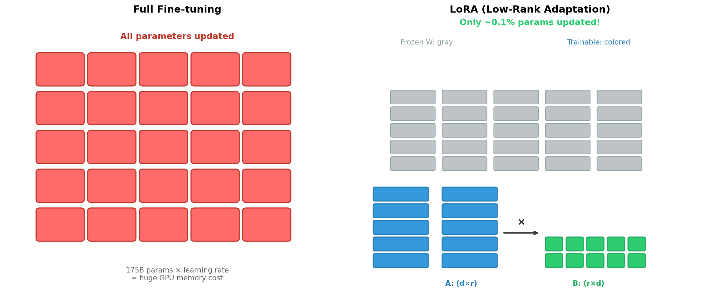
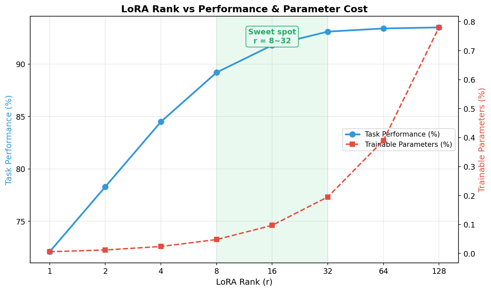
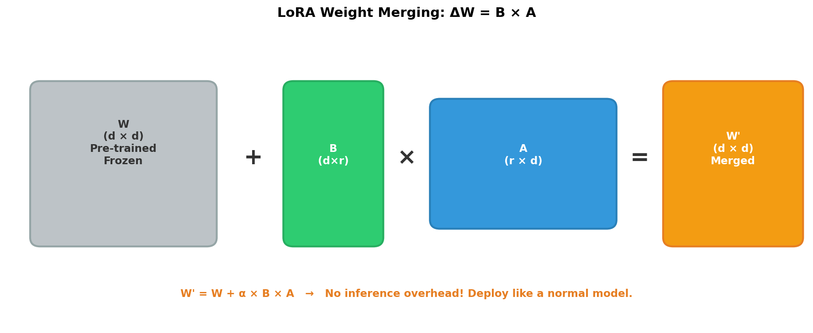
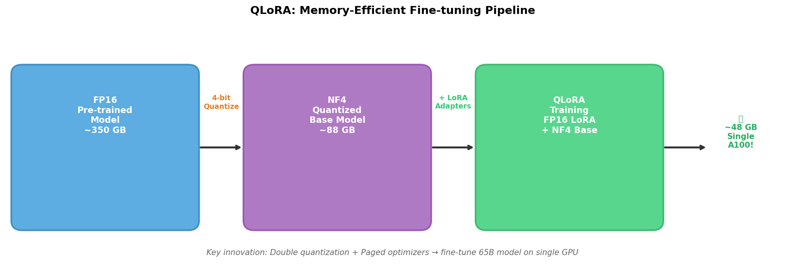
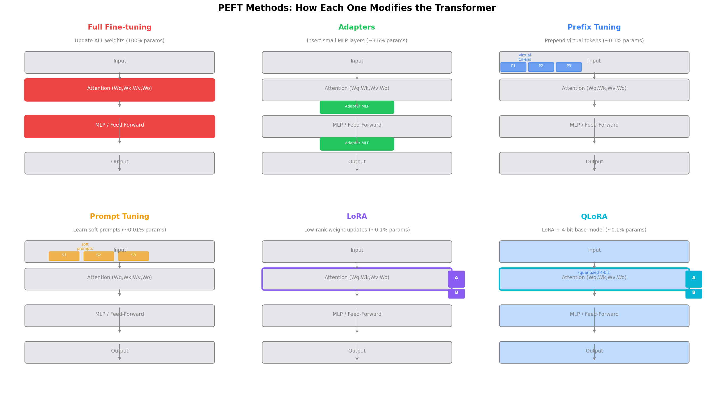

# Day 12: Fine-tuning — Teaching Old Models New Tricks

> **Core Question**: How can we efficiently adapt a massive pre-trained LLM to specific tasks without retraining billions of parameters?

---

## Opening

Imagine you've hired a brilliant generalist — someone who has read the entire internet, speaks multiple languages, and can reason about almost anything. They're incredibly capable, but they don't know your company's jargon, your codebase's conventions, or your customers' common complaints. You wouldn't re-educate them from scratch. You'd give them a few weeks of onboarding.

That's exactly what fine-tuning does for LLMs. Pre-training (Day 11) gives us a model with broad knowledge. Fine-tuning specializes it — teaching a generalist to become an expert. The catch? Traditional fine-tuning updates *every* parameter, which for a 175B-parameter model means moving massive amounts of data through GPU memory. In 2020, fine-tuning GPT-3 required dozens of A100s.

Then came a breakthrough idea: what if you could freeze the original model and only train a tiny number of new parameters? That's the world of **Parameter-Efficient Fine-Tuning (PEFT)**, and it changed everything.

---

## 1. Why Fine-tuning Matters

### 1.1 The Gap Between Pre-training and Application

A pre-trained LLM is like a university graduate — broadly educated but not job-ready. When we deploy an LLM, we need it to:

- **Follow instructions** (not just predict the next token)
- **Adopt a specific tone** (professional, casual, empathetic)
- **Know domain-specific facts** (medical, legal, code)
- **Avoid certain behaviors** (hallucinations, harmful content)

Pre-training gives the model *capability*. Fine-tuning gives it *direction*.

### 1.2 The Full Fine-tuning Problem

In full fine-tuning, we update every parameter in the model:

$$
\begin{aligned}
W_{\text{new}} &= W_{\text{pretrained}} - \eta \cdot \nabla_W L(W)
\end{aligned}
$$

Where $L(W)$ is the task-specific loss and $\eta$ is the learning rate. For a 175B-parameter model stored in FP16, this means:

- **Model weights**: 350 GB of GPU memory just to hold the model
- **Gradients**: another 350 GB (same size as weights)
- **Optimizer states**: Adam needs 2 extra copies → 700 GB
- **Activations**: varies by batch size and sequence length

**Total: ~1.4 TB of GPU memory**. That's 18 A100-80GB GPUs just for one training step.


*Figure 1: Full fine-tuning updates all parameters (red), while LoRA only trains small low-rank matrices (blue and green), keeping the original weights frozen (gray).*

---

## 2. Enter LoRA: Low-Rank Adaptation

### 2.1 The Key Insight

The LoRA paper (Hu et al., 2021) observed something profound: while pre-trained models have billions of parameters, the *changes* needed for adaptation live in a much lower-dimensional space. Think of it like adjusting the steering wheel of a car — you don't need to rebuild the engine to change direction.

Mathematically, LoRA decomposes the weight update $\Delta W$ into two small matrices:

$$
\begin{aligned}
\Delta W &= B \cdot A
\end{aligned}
$$

Where:
- $A \in \mathbb{R}^{r \times d}$ (down-projection, rank $r$)
- $B \in \mathbb{R}^{d \times r}$ (up-projection)
- $r \ll d$ (typically $r = 8$ or $16$, while $d = 4096$ or more)

The forward pass becomes:

$$
\begin{aligned}
h &= W \cdot x + \frac{\alpha}{r} \cdot B \cdot A \cdot x
\end{aligned}
$$

Here, $\alpha$ is a scaling factor that controls the magnitude of the LoRA update relative to the original weights. This is important — it lets you tune how much the adaptation "matters" without changing the learning rate.

### 2.2 Why Does This Work?

You might wonder: how can a rank-8 matrix capture meaningful adaptation when the original weight matrix has rank 4096?

The answer lies in the **intrinsic dimension** hypothesis (Aghajanyan et al., 2020): pre-trained models already live near a good solution in parameter space. Fine-tuning only needs to move a small distance, and that movement can be expressed in a low-dimensional subspace. It's like standing on a hilltop — you only need a small push in the right direction to roll toward a different valley, not a complete relocation.

#### Understanding Intrinsic Dimension

Think of a balloon in 3D space. The balloon exists in 3 dimensions, but its surface is only **2-dimensional** — you only need longitude and latitude to locate any point. That "2" is the balloon's intrinsic dimension: embedded in high-dimensional space, but truly free to move in only a few directions.

For models:
- A 7B model has 7 billion parameters, seemingly living in a 7-billion-dimensional space
- But after pre-training, good parameter configurations cluster in a **low-dimensional subspace**
- Fine-tuning only needs to move within this subspace

The original paper found that a model with millions of parameters may have an intrinsic dimension of only **a few hundred to a few thousand** for fine-tuning. LoRA's rank $r$ directly corresponds to this — using $r=8$ means you're only adjusting within an 8-dimensional subspace.

> **Key insight**: Intrinsic dimension tells us that *changing* the model requires very little space, but *running* the model still needs the full parameter space. LoRA compresses the **updates** ($\Delta W$), not the original weights ($W$). This is why LoRA saves training memory but doesn't reduce inference cost (until you merge the adapters).

#### Wait — If the Model Lives in a Low-Dimensional Subspace, Why Not Compress It for Inference?

A natural follow-up question! If fine-tuning only moves in a low-dimensional subspace, couldn't we use manifold dimensionality reduction to shrink the model and save inference resources?

Unfortunately, **low-dimensional movement ≠ low-dimensional weights**.

Think of standing inside a massive maze. You only need to walk in **one direction** to find the exit (movement = 1D). But the maze itself is 1000-dimensional — you can't compress it to 1D without destroying the paths.

Three reasons why direct compression doesn't work:

1. **Different tasks need different subspaces.** Fine-tuning for translation moves in subspace A; for coding, subspace B. A and B may barely overlap. A pre-trained model's power comes from covering many subspaces — compressing to one destroys adaptability.

2. **What's low-rank is $\Delta W$, not $W$.** $W_{pretrained}$ is full-rank (4096×4096) and contains all knowledge. $\Delta W$ is low-rank (rank 8) and is just a tiny adjustment. You can only compress the update (which LoRA already does), not the original weights.

3. **Full rank is needed for model capability.** The Q/K/V projection matrices in attention layers need full rank to correctly encode complex relationships between tokens. Forcibly reducing dimensionality would lose the ability to distinguish similar tokens.

**So how do we actually save inference resources?** Not through manifold reduction, but through orthogonal techniques:

| Method | How it saves | Effect |
|--------|-------------|--------|
| **Quantization** | FP16 → INT8/INT4 | Same parameters, fewer bits each |
| **Pruning** | Remove unimportant weights | Delete parameters entirely |
| **Distillation** | Small model learns large model's behavior | Replace with smaller model |
| **LoRA** | Only train low-rank updates | Saves training memory, not inference |

> **Analogy**: Intrinsic dimension tells us that *renovating* a building only needs a few walls changed, but *living in* it still requires the whole building.

### 2.3 Which Layers to Adapt?

A critical practical question: should you apply LoRA to all layers, or only specific ones?

<table><tr>
<td width="45%" valign="top">


</td>
<td width="55%" valign="top">

Research shows that applying LoRA to **both attention and MLP (feed-forward) layers** consistently outperforms attention-only adaptation.

**Why both?** The MLP layers store much of the model's factual knowledge, so adapting them is crucial for domain specialization.

**What to skip:**
- **Embedding layer** — maps tokens to model's internal space; different learning dynamics
- **LM head** — maps back to vocabulary; LoRA doesn't help here

**What to target (green ✓):**
- Q, K, V, O projection matrices in attention
- Up/down projection matrices in MLP

LoRA works best on the **intermediate transformation layers**.

</td>
</tr></table>

### 2.4 The Rank Trade-off

The rank $r$ is the key hyperparameter. Too small, and you underfit. Too large, and you waste parameters for diminishing returns.


*Figure 2: Task performance saturates around rank 16-32, while parameter count grows linearly. The sweet spot balances quality and efficiency.*

#### Understanding d and r

**$d$ (original dimension)** — This is NOT a hyperparameter you choose. It's determined by the model architecture:
- Llama 7B: hidden size = 4096 → $d$ = 4096
- Llama 70B: hidden size = 8192 → $d$ = 8192

**$r$ (LoRA rank)** — This IS the hyperparameter you choose. It controls how many degrees of freedom the adaptation has:

| $r$ | Trainable params | Use case |
|-----|-----------------|----------|
| 4 | Very few (<0.1%) | Simple tasks, style transfer |
| 8 | Few (~0.1%) | General-purpose fine-tuning |
| 16 | Moderate (~0.5%) | Complex tasks |
| 32 | More (~1%) | Tasks requiring larger adaptation |
| 64+ | Many (~2%) | Dramatically changing model behavior |

#### How to determine $r$?

There's no theoretical formula — it's determined empirically:

1. **Start small**: Try $r = 8$ first
2. **Watch training loss**: If it won't decrease → $r$ is too small → increase it
3. **Watch validation loss**: If train loss drops but val loss rises → $r$ is too large (overfitting) → decrease it
4. **Resource budget**: Limited VRAM/time → use smaller $r$

**Intuition**: $r$ controls "how much change you allow." The pre-trained model is already strong — most tasks only need small adjustments, so a small $r$ suffices.

In practice, $r = 8$ to $16$ works well for most tasks. Complex reasoning tasks may benefit from $r = 32$ or $64$, but the gains are usually marginal.

---

## 3. LoRA Merge: Zero Inference Overhead

One of LoRA's most elegant properties is that the adapter weights can be **merged into the base model** at deployment time, adding exactly zero inference cost.


*Figure 3: After training, B × A is computed once and added to W. The merged model has identical architecture to the original — no extra latency.*

The merge is simply:

$$
\begin{aligned}
W' &= W + \frac{\alpha}{r} \cdot B \cdot A
\end{aligned}
$$

This means:
- **No special serving infrastructure** — deploy with any standard inference engine
- **No latency penalty** — the merged model runs at the same speed as the base model
- **Multiple adapters** — you can merge different adapters for different tasks, or serve them separately with a shared base

This is a huge advantage over other PEFT methods like adapters (which add extra layers) or prefix tuning (which uses up context window).

---

## 4. QLoRA: Fine-tuning on a Single GPU

### 4.1 The Memory Problem

Even with LoRA reducing trainable parameters by 1000×, we still need to *load* the base model into GPU memory. A 65B-parameter model in FP16 needs ~130 GB. That's 2 A100-80GB GPUs just to load the model, let alone train.

**QLoRA** (Dettmers et al., 2023) solved this with a brilliant combination of techniques:

1. **NF4 Quantization**: A novel 4-bit data type (Normal Float 4) designed specifically for normally-distributed neural network weights
2. **Double Quantization**: Quantize the quantization constants themselves, saving ~0.37 bits per parameter
3. **Paged Optimizers**: Use CPU RAM as overflow for optimizer states during memory spikes


*Figure 4: QLoRA compresses the base model to 4-bit, then applies LoRA in FP16. The result: fine-tune a 65B model on a single 48GB GPU.*

### 4.2 How NF4 Works


*Figure: NF4 places more quantization levels near zero (where most weights are), while uniform INT4 wastes precision on rare extreme values. The bottom flow shows the QLoRA compute pipeline.*

Standard quantization (like INT4) assumes a uniform distribution of values. But neural network weights follow a **normal distribution** — most values cluster near zero. NF4 takes advantage of this by placing more quantization levels near zero:

$$
\begin{aligned}
q_i &= \text{quantile}\left(\mathcal{N}(0,1), \frac{2i + 1}{2k}\right) \quad \text{for } i = 0, \ldots, k-1
\end{aligned}
$$

Where $k = 16$ for 4-bit quantization. This preserves more information than uniform quantization, especially for the small weights that matter most during fine-tuning.

The key insight: during the forward pass, weights are **dequantized back to FP16** (called "brain floating point" or BF16 in practice) for computation. Only storage is 4-bit. This means the LoRA gradients are computed in full precision, just applied to a much smaller set of parameters.

---

## 5. The PEFT Landscape

LoRA and QLoRA are the most popular PEFT methods, but they're not the only ones. Here's how they all compare:


*Figure: Six fine-tuning methods and where they act on the Transformer architecture. Red = updated, gray = frozen, colored = method-specific additions.*

<table>
<tr>
<th align="center" width="16%">Full Fine-tune</th>
<th align="center" width="16%">Adapters</th>
<th align="center" width="16%">Prefix Tuning</th>
<th align="center" width="16%">Prompt Tuning</th>
<th align="center" width="16%">LoRA</th>
<th align="center" width="16%">QLoRA</th>
</tr>
<tr>
<td align="center"><b>Update ALL weights</b></td>
<td align="center"><b>Insert small MLP layers</b> between transformer blocks</td>
<td align="center"><b>Prepend virtual tokens</b> to attention keys/values</td>
<td align="center"><b>Learn soft prompts</b> in embedding space only</td>
<td align="center"><b>Low-rank decomposition</b> of weight updates</td>
<td align="center"><b>LoRA + 4-bit</b> quantized base model</td>
</tr>
<tr>
<td align="center"><b>Trainable:</b> 100%</td>
<td align="center"><b>Trainable:</b> ~3.6%</td>
<td align="center"><b>Trainable:</b> ~0.1%</td>
<td align="center"><b>Trainable:</b> ~0.01%</td>
<td align="center"><b>Trainable:</b> ~0.1%</td>
<td align="center"><b>Trainable:</b> ~0.1%</td>
</tr>
<tr>
<td align="center"><b>Performance:</b> 100% (baseline)</td>
<td align="center"><b>Performance:</b> ~97.2%</td>
<td align="center"><b>Performance:</b> ~96.8%</td>
<td align="center"><b>Performance:</b> ~94.5%</td>
<td align="center"><b>Performance:</b> ~98.5%</td>
<td align="center"><b>Performance:</b> ~98.3%</td>
</tr>
<tr>
<td align="center">Most expensive<br>No inference overhead</td>
<td align="center">Extra latency<br>(added layers)</td>
<td align="center">Uses context window</td>
<td align="center">Lightest weight<br>Simplest to implement</td>
<td align="center">Zero inference overhead<br>Default choice</td>
<td align="center">Best for limited GPU<br>Memory-efficient</td>
</tr>
</table>

---

## 6. Practical Code: LoRA with Hugging Face

Here's how to apply LoRA to a model in just a few lines:

```python
from transformers import AutoModelForCausalLM
from peft import LoraConfig, get_peft_model

# Load base model
model = AutoModelForCausalLM.from_pretrained("meta-llama/Llama-2-7b-hf")

# Configure LoRA
lora_config = LoraConfig(
    r=16,                    # Rank of the update matrices
    lora_alpha=32,           # Scaling factor (α/r controls magnitude)
    target_modules=[         # Which layers to apply LoRA to
        "q_proj", "k_proj",  # Attention query and key projections
        "v_proj", "o_proj",  # Attention value and output projections
        "gate_proj", "up_proj", "down_proj"  # MLP layers
    ],
    lora_dropout=0.05,       # Dropout on LoRA layers
    bias="none",             # Don't train biases
    task_type="CAUSAL_LM"    # Task type for the model
)

# Apply LoRA — this wraps the model with adapter layers
model = get_peft_model(model, lora_config)

# Check how many parameters we're actually training
model.print_trainable_parameters()
# Output: trainable params: 13,107,200 || all params: 6,738,415,616 || trainable%: 0.1945

# Train as usual — only LoRA parameters have gradients
# After training, merge adapters into base model for deployment:
merged_model = model.merge_and_unload()
```

### 6.1 Training Hyperparameters That Matter

Fine-tuning with LoRA uses very different hyperparameters than pre-training:

| Parameter | Pre-training | LoRA Fine-tuning |
|-----------|-------------|-----------------|
| Learning rate | ~1e-4 | ~1e-4 to 2e-4 |
| Batch size | Millions of tokens | 8-128 samples |
| Epochs | 1 (single pass) | 3-10 (multiple passes) |
| Warmup steps | Long (10k+) | Short (100-500) |
| Weight decay | 0.1 | 0.01-0.1 |

A common mistake is using a learning rate that's too high. Because the model is already well-trained, large updates can "catastrophically forget" pre-trained knowledge. LoRA's advantage here is structural — even if you use a high learning rate, the low-rank constraint limits how far the weights can deviate. This is an implicit regularization.

Key observations:
- We're training **0.19%** of total parameters
- Target modules matter: applying LoRA to both attention AND MLP layers gives better results than attention only
- The `lora_alpha` parameter (usually set to 2× rank) controls the effective learning rate for the adapter

---

## 7. Common Misconceptions

### ❌ "LoRA is only for small models"

LoRA was originally validated on GPT-3 175B and works at all scales. In fact, the relative benefit *increases* with model size — larger models need less adaptation (they already know more), so a low-rank update is even more sufficient.

### ❌ "QLoRA means lower quality than LoRA"

Multiple benchmarks show QLoRA matches full-precision LoRA quality. The 4-bit quantization is only for the *frozen* base model. LoRA gradients are computed in full precision during the forward-backward pass. The paper showed that QLoRA on a 65B model matches full fine-tuning quality.

### ❌ "Fine-tuning replaces RAG"

Fine-tuning and Retrieval-Augmented Generation (RAG) solve different problems:
- **Fine-tuning** changes the model's behavior, style, and reasoning patterns
- **RAG** provides up-to-date factual knowledge at inference time

They're complementary, not competing. Many production systems use both.

---

## 8. Further Reading

### Beginner
1. [LoRA: Low-Rank Adaptation of Large Language Models (Hu et al., 2021)](https://arxiv.org/abs/2106.09685) — The original paper, surprisingly readable
2. [Hugging Face PEFT Documentation](https://huggingface.co/docs/peft/en/index) — Practical guides and tutorials
3. [Sebastian Raschka's LLM Fine-tuning Guide](https://github.com/rasbt/LLMs-from-scratch) — Building LLMs from scratch with fine-tuning chapters

### Advanced
1. [QLoRA: Efficient Finetuning of Quantized LLMs (Dettmers et al., 2023)](https://arxiv.org/abs/2305.14314) — The 4-bit quantization breakthrough
2. [Understanding the Intrinsic Dimensionality (Aghajanyan et al., 2020)](https://arxiv.org/abs/2012.13255) — Why low-rank adaptation works
3. [LoRA+: Improved Low Rank Adaptation (Hayou et al., 2024)](https://arxiv.org/abs/2402.12354) — Optimized LoRA initialization

### Papers
1. [Adapter: Parameter-Efficient Transfer Learning (Houlsby et al., 2019)](https://arxiv.org/abs/1902.00751)
2. [Prefix-Tuning: Optimizing Virtual Prompts (Li & Liang, 2021)](https://arxiv.org/abs/2101.00190)
3. [DoRA: Weight-Decomposed Low-Rank Adaptation (Liu et al., 2024)](https://arxiv.org/abs/2402.09353)

---

## Reflection Questions

1. Why does LoRA work despite using only 0.1% of parameters? What does this tell us about the nature of pre-trained representations?

2. If LoRA adapters can be merged with zero inference cost, why would you ever choose *not* to merge them? (Hint: think about multi-tenant serving.)

3. QLoRA quantizes the base model to 4-bit but computes LoRA gradients in FP16. What would happen if you computed everything in 4-bit?

---

## Summary

| Concept | One-line Explanation |
|---------|---------------------|
| Full Fine-tuning | Update all model parameters — expensive but most expressive |
| LoRA | Decompose weight updates into low-rank matrices — 0.1% params, ~98.5% quality |
| LoRA Merge | Add B×A to W after training — zero inference overhead |
| QLoRA | LoRA with 4-bit quantized base model — fine-tune 65B on one GPU |
| PEFT | Umbrella term for methods that train <1% of parameters |
| NF4 | Normal Float 4-bit — quantization designed for neural network weight distributions |
| Intrinsic Dimension | Pre-trained models live near good solutions; adaptation needs low-rank movement |

**Key Takeaway**: Fine-tuning is how we turn generalist LLMs into specialists. LoRA and QLoRA made this practical — what once required a GPU cluster now fits on a single card. The insight that adaptation lives in a low-dimensional space is one of the most impactful discoveries in the LLM era, enabling everything from custom chatbots to domain-specific code assistants.

---

*Day 12 of 60 | LLM Fundamentals*
*Word count: ~2200 | Reading time: ~11 minutes*
