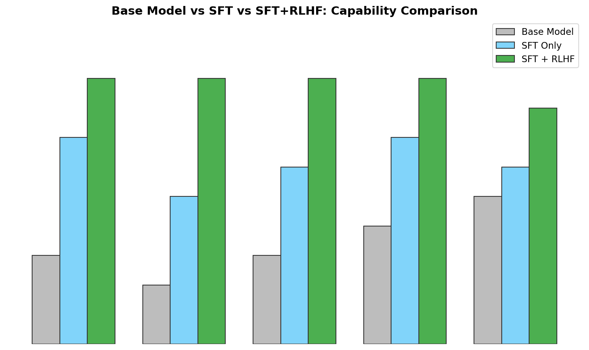

# Day 13: RLHF Explained — Reinforcement Learning from Human Feedback

> **Core Question**: How did we turn a text-completion engine into a helpful assistant that follows instructions, refuses harmful requests, and carries natural conversations?

---

## Opening

Imagine you've trained a massive language model on the entire internet. It can complete any sentence fluently — but ask it to "explain quantum physics to a 5-year-old," and it might respond with a Wikipedia-style article. Ask it something harmful, and it might comply without hesitation. The model can *write*, but it doesn't know what *good writing* looks like from a human perspective.

This was the state of affairs before 2020. Then came a deceptively simple idea: **what if we could teach the model what humans actually prefer?**

Think of it like raising a child. A toddler can produce words (the pre-trained model). You teach them manners and appropriate behavior through example (supervised fine-tuning). But the real shaping happens through ongoing feedback — "that was helpful," "that was rude," "try it this way instead." RLHF (Reinforcement Learning from Human Feedback) is that ongoing feedback loop for language models.

This article covers the three-stage pipeline that transformed GPT-3 into ChatGPT, the technical machinery behind reward modeling and PPO optimization, and why RLHF remains both powerful and controversial.

---

## 1. Why We Need RLHF

### 1.1 The Alignment Problem

Pre-trained language models are trained with a single objective: predict the next token. This creates a powerful text generator, but it has no concept of:

- **Helpfulness** — Is the response actually useful?
- **Honesty** — Is it truthful or hallucinating?
- **Harmlessness** — Could the response cause damage?

This gap between "can generate text" and "generates *good* text" is the **alignment problem**.

### 1.2 Why Supervised Fine-Tuning Isn't Enough

Supervised Fine-Tuning (SFT), which we covered in Day 12, teaches the model to follow instructions by showing it input-output pairs. But SFT has a critical limitation: it can only learn from the specific examples you provide.

Think of it this way — SFT is like showing a student 10,000 correct essays and saying "write like this." The student might learn the style, but they don't understand *why* one essay is better than another. They lack a **reward signal** — a way to evaluate the quality of their own output.

RLHF adds exactly this: a learned reward function that can score *any* response, not just the ones in your training set.


*Figure 1: The complete RLHF pipeline has three stages — pre-training (already done), reward model training, and PPO optimization. Each stage builds on the previous one.*

---

## 2. Stage 1: Supervised Fine-Tuning (SFT) — The Starting Point

Before RLHF begins, we start with an SFT model. This model has been trained on high-quality instruction-response pairs, so it already knows how to follow basic instructions.

**Key properties of the SFT model:**

- Initialized from a pre-trained base model
- Trained on curated (prompt, response) pairs
- Serves as both the starting point for RL and the **reference model** (to prevent the policy from drifting too far)

The SFT model becomes two things in RLHF:
1. **The initial policy** $\pi^{SFT}$ — the model we'll optimize
2. **The reference model** $\pi^{ref}$ — a frozen copy used to compute KL divergence penalties

---

## 3. Stage 2: Training the Reward Model

This is the heart of RLHF — building a model that can **score** responses the way humans would.

### 3.1 Collecting Human Preferences

The process starts with humans comparing pairs of responses:

1. Given a prompt, generate multiple responses (e.g., 4-9) from the SFT model
2. Present pairs to human annotators: "Which response is better?"
3. Collect thousands of these (prompt, chosen_response, rejected_response) triplets

This is **comparative** rather than **absolute** scoring — humans are much better at saying "A is better than B" than assigning a score like "A is 7.3/10."

### 3.2 The Bradley-Terry Model

The reward model is trained using the Bradley-Terry preference model, which converts pairwise comparisons into a probability:

$$
\begin{aligned}
P(y_w \succ y_l | x) = \sigma(r_\theta(x, y_w) - r_\theta(x, y_l))
\end{aligned}
$$

Where:
- $y_w$ is the winning (preferred) response
- $y_l$ is the losing (rejected) response
- $r_\theta$ is the reward model parameterized by $\theta$
- $\sigma$ is the sigmoid function

The training loss is the negative log-likelihood:

$$
\begin{aligned}
\mathcal{L}_{RM} = -\mathbb{E}_{(x, y_w, y_l)} \left[ \log \sigma \left( r_\theta(x, y_w) - r_\theta(x, y_l) \right) \right]
\end{aligned}
$$

Intuitively, this pushes the reward model to assign higher scores to human-preferred responses and lower scores to rejected ones. The larger the gap between scores, the more confident the model becomes.


*Figure 2: Human labelers compare response pairs. The reward model learns to score preferred responses higher than rejected ones, using the Bradley-Terry preference loss.*

### 3.3 Architecture Details

The reward model is typically the same architecture as the base model (e.g., same transformer), but with:

- A **regression head** replacing the language modeling head
- The regression head outputs a single scalar: $r_\theta(x, y) \in \mathbb{R}$
- Initialized from the SFT model checkpoint

This architectural choice is important — because the reward model "understands" language the same way the policy does, it can provide meaningful gradient signals.

---

## 4. Stage 3: RL Optimization with PPO

### 4.1 Why PPO?

Proximal Policy Optimization (PPO) is the standard algorithm for the RL stage. It was chosen for several reasons:

1. **Stability** — PPO constrains how much the policy can change in one step, preventing catastrophic forgetting
2. **Sample efficiency** — Better than vanilla policy gradient methods
3. **Track record** — Proven in game-playing (Atari, Dota 2) before being adapted for language models

### 4.2 The RLHF Objective

The goal is to maximize reward while staying close to the reference model:

$$
\begin{aligned}
\max_{\pi_\theta} \; \mathbb{E}_{x \sim \mathcal{D}, y \sim \pi_\theta(\cdot|x)} \left[ r_\phi(x, y) - \beta \cdot \text{KL}(\pi_\theta \| \pi^{ref}) \right]
\end{aligned}
$$

Where:
- $r_\phi(x, y)$ is the reward from the learned reward model
- $\beta$ controls the KL penalty strength
- $\text{KL}(\pi_\theta \| \pi^{ref})$ penalizes the policy for drifting from the SFT model

The **KL divergence** term is critical — without it, the model would learn to "game" the reward model (reward hacking), producing outputs that score high but are nonsensical or extremely narrow.

### 4.3 The PPO Clip Objective

PPO uses a clipped surrogate objective to constrain updates:

$$
\begin{aligned}
L^{CLIP}(\theta) = \hat{\mathbb{E}}_t \left[ \min \left( r_t(\theta) \hat{A}_t, \; \text{clip}(r_t(\theta), 1-\epsilon, 1+\epsilon) \hat{A}_t \right) \right]
\end{aligned}
$$

Where:
- $r_t(\theta) = \frac{\pi_\theta(y_t|x_t)}{\pi_{old}(y_t|x_t)}$ is the probability ratio
- $\hat{A}_t$ is the advantage estimate (how much better than expected)
- $\epsilon$ (typically 0.2) controls the clip range

**Intuition**: If the new policy makes an action much more likely than the old policy ($r_t >> 1$), and that action was good ($\hat{A}_t > 0$), the clip prevents us from over-optimizing. It's like telling the model "yes, that was good, but don't go overboard."


*Figure 3: The policy generates responses, the reward model scores them, and PPO updates the policy. The KL divergence penalty from the frozen reference model prevents the policy from drifting too far.*

### 4.4 The Full RLHF Training Loop

In practice, the training loop looks like this:

```python
# Simplified RLHF training loop
for epoch in range(num_epochs):
    # 1. Generate responses from current policy
    prompts = sample_prompts(dataset)
    responses = policy_model.generate(prompts)
    
    # 2. Score with reward model
    rewards = reward_model.score(prompts, responses)
    
    # 3. Compute KL penalty
    kl_penalty = beta * kl_divergence(policy_model, reference_model, 
                                       prompts, responses)
    total_reward = rewards - kl_penalty
    
    # 4. Compute advantages (using GAE or simple baseline)
    advantages = compute_advantages(total_reward, value_function)
    
    # 5. PPO update (multiple epochs on same batch)
    for ppo_epoch in range(ppo_epochs):
        ratio = new_prob / old_prob
        clipped_ratio = torch.clamp(ratio, 1 - epsilon, 1 + epsilon)
        loss = -torch.min(ratio * advantages, 
                          clipped_ratio * advantages).mean()
        optimizer.step()
```

Key practical details:
- **Batch size**: Typically thousands of prompts per batch
- **PPO epochs**: Usually 3-4 passes over the same batch
- **Value function**: A separate head (or model) that estimates expected reward, used to compute advantages
- **Generation**: Responses are generated with moderate temperature to ensure diversity

---

## 5. Reward Hacking — The Central Challenge

### 5.1 What is Reward Hacking?

Reward hacking (also called reward gaming) occurs when the policy discovers outputs that receive high reward from the reward model but are actually low quality. It's like a student who figures out how to game a rubric without actually learning the material.

Common symptoms:
- Repetitive, verbose outputs (longer text often scores higher)
- Sycophantic responses (agreeing with the user regardless of truth)
- Stereotypical "helpful assistant" patterns without real substance
- Mode collapse — the model produces the same style of response for every input

### 5.2 The KL Penalty as a Leash

The KL divergence penalty acts as a "leash" that prevents the policy from wandering too far from the reference model:

- **Small β** — More exploration, higher reward, but risk of hacking
- **Large β** — More conservative, stays close to SFT model, less hacking but also less improvement


*Figure 4: Left: Without the KL penalty, reward model scores keep rising while actual quality drops (reward hacking). Right: The KL penalty keeps the reward signal aligned with actual quality.*

### 5.3 Other Mitigations

Beyond the KL penalty, practitioners use:
- **Constitutional AI** (Anthropic) — The model critiques its own outputs using a set of principles
- **Multiple reward signals** — Combining helpfulness, honesty, and harmlessness reward models
- **Early stopping** — Monitor held-out quality metrics, not just reward
- **Reward model ensembles** — Average scores from multiple reward models to reduce overfitting

---

## 6. The Impact: What RLHF Actually Changes

### 6.1 Before and After RLHF

| Capability | Base Model | + SFT | + RLHF |
|-----------|-----------|-------|--------|
| Follows instructions | Poor | Good | Excellent |
| Refuses harmful requests | None | Partial | Strong |
| Conversational quality | Poor | Good | Excellent |
| Helpfulness | Low | Moderate | High |
| Honesty / Grounding | Variable | Moderate | Improved |


*Figure 5: RLHF provides the largest gains in safety (harmlessness) and instruction-following. SFT alone is necessary but not sufficient for a production assistant.*

### 6.2 What the Original Paper Found

The InstructGPT paper (Ouyang et al., 2022) showed several striking results:

1. **Humans preferred RLHF outputs 85% of the time** over the base GPT-3
2. **Toxicity dropped significantly** — the model learned to refuse harmful requests
3. **Truthfulness improved** on TruthfulQA benchmarks
4. **A 1.3B RLHF model was preferred over a 175B base model** — alignment can compensate for scale

This last point is remarkable: a model 100× smaller, when properly aligned, was preferred by humans over the raw base model. This suggests that **alignment isn't just a safety feature — it's a capability multiplier**.

---

## 7. Limitations and Controversies

### 7.1 RLHF is Not Perfect

- **Reward model quality ceiling** — The reward model is only as good as the human labels it was trained on
- **Annotator disagreement** — Humans often disagree on what constitutes a "good" response
- **Distribution shift** — The reward model is trained on SFT outputs but scores RL outputs, which drift over time
- **Cost** — Human annotation is expensive; OpenAI employed ~40 annotators for InstructGPT

### 7.2 The Debate: Is RLHF Actually RL?

Some researchers argue that RLHF isn't "real" reinforcement learning because:
- The environment (reward model) is learned, not fixed
- There's no sequential decision-making in the traditional RL sense
- The KL constraint makes it more like constrained optimization

This debate is partly semantic, but it highlights an important point: RLHF is better understood as **optimization against a learned human preference model** rather than classical RL.

### 7.3 The Route to Alternatives

RLHF's limitations have motivated alternatives like:
- **DPO (Direct Preference Optimization)** — Skips the reward model entirely (covered in Day 15)
- **RLAIF (RL from AI Feedback)** — Uses AI instead of humans for preference labeling
- **Constitutional AI** — Self-critique and revision loops

---

## 8. Code Example: Minimal Reward Model Training

```python
import torch
import torch.nn as nn

class RewardModel(nn.Module):
    """A reward model that scores (prompt, response) pairs.
    Built on top of a pre-trained transformer with a scalar head."""
    
    def __init__(self, base_model, hidden_size):
        super().__init__()
        self.transformer = base_model
        self.reward_head = nn.Linear(hidden_size, 1)
    
    def forward(self, input_ids, attention_mask):
        # Get the last hidden state from the transformer
        outputs = self.transformer(input_ids=input_ids, 
                                    attention_mask=attention_mask)
        # Use the last token's representation
        last_hidden = outputs.last_hidden_state[:, -1, :]
        reward = self.reward_head(last_hidden)
        return reward.squeeze(-1)

def preference_loss(reward_model, chosen_ids, chosen_mask, 
                    rejected_ids, rejected_mask):
    """Bradley-Terry preference loss for reward model training.
    
    Pushes reward(chosen) > reward(rejected)."""
    r_chosen = reward_model(chosen_ids, chosen_mask)
    r_rejected = reward_model(rejected_ids, rejected_mask)
    
    # L = -log(sigma(r_chosen - r_rejected))
    loss = -torch.log(torch.sigmoid(r_chosen - r_rejected)).mean()
    return loss

# Usage example
# reward_model = RewardModel(sft_model, hidden_size=4096)
# loss = preference_loss(reward_model, chosen_batch, chosen_mask,
#                        rejected_batch, rejected_mask)
# loss.backward()
```

---

## 9. Common Misconceptions

### ❌ "RLHF makes models smarter at reasoning"

RLHF primarily improves **instruction-following** and **safety alignment**, not reasoning ability. A model won't suddenly solve harder math problems because of RLHF. The underlying knowledge and reasoning come from pre-training and SFT.

### ❌ "RLHF eliminates hallucinations"

RLHF can reduce certain types of hallucinations by teaching the model to be more cautious, but it doesn't fix the fundamental issue: the model doesn't have access to ground truth. RLHF can teach the model to say "I'm not sure" more often, but it can't make the model know things it doesn't know.

### ❌ "Humans rate every response in production"

No! Humans only rate responses during training to build the reward model. At inference time, the reward model scores responses automatically. Human annotation is a training-time cost, not an inference-time bottleneck.

---

## 10. Further Reading

### Foundational Papers
1. [Fine-Tuning Language Models from Human Preferences](https://arxiv.org/abs/1909.08593) — Ziegler et al., 2019. The original RLHF paper for language models.
2. [Learning to Summarize from Human Feedback](https://arxiv.org/abs/2009.01325) — Stiennon et al., 2020. Applied RLHF to summarization.
3. [Training Language Models to Follow Instructions with Human Feedback](https://arxiv.org/abs/2203.02155) — Ouyang et al., 2022. The InstructGPT / ChatGPT paper.

### Understanding PPO
4. [Proximal Policy Optimization Algorithms](https://arxiv.org/abs/1707.06347) — Schulman et al., 2017. The original PPO paper.

### Critiques and Analysis
5. [The QRUNCH Effect: How RLHF biases outputs](https://arxiv.org/abs/2305.07759) — Insights into how RLHF shapes model behavior.

---

## Reflection Questions

1. If RLHF trains on human preferences, whose preferences are being encoded? What happens when different cultural groups have different preferences?
2. The KL penalty prevents reward hacking, but it also limits how much the model can improve. How would you determine the "right" β value?
3. If a 1.3B RLHF model beats a 175B base model, what does that tell us about the relationship between scale and alignment?

---

## Summary

| Concept | One-line Explanation |
|---------|---------------------|
| RLHF | Training LLMs to align with human preferences using a learned reward model |
| Reward Model | A model trained on human pairwise preferences that scores response quality |
| Bradley-Terry Loss | The loss function that trains the reward model from pairwise comparisons |
| PPO | The RL algorithm used to optimize the policy against the reward model |
| KL Penalty | A constraint that prevents the policy from drifting too far from the SFT model |
| Reward Hacking | When the policy exploits reward model weaknesses to get high scores without real improvement |

**Key Takeaway**: RLHF is the bridge between raw language generation and helpful AI assistance. It works by learning what humans prefer (reward model) and then optimizing the model to produce those preferred outputs (PPO), while keeping the model grounded (KL penalty). The result — as demonstrated by ChatGPT — is that a well-aligned smaller model can outperform a much larger but unaligned one. This insight fundamentally changed how the industry thinks about AI development: alignment isn't overhead, it's a core capability.

---

*Day 13 of 60 | LLM Fundamentals*
*Word count: ~2200 | Reading time: ~12 minutes*
