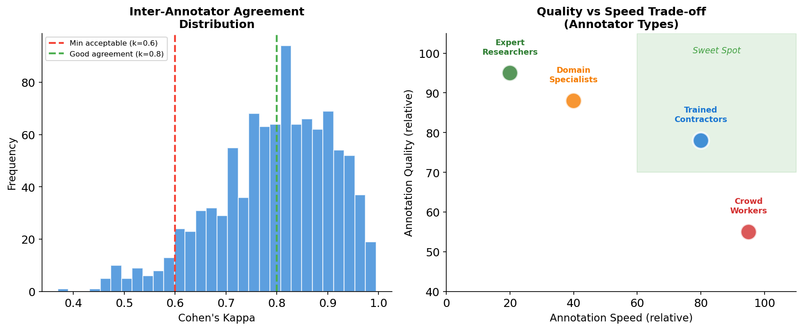

# Day 14: RLHF Data & Practice

> **Core Question**: How do you actually build the datasets that make RLHF work — and how much does it cost?

---

## Opening

Yesterday we explored the three-stage RLHF pipeline: Supervised Fine-Tuning (SFT), Reward Model training, and PPO optimization. But here's the uncomfortable truth that most papers gloss over: **the algorithm is the easy part. The data is where projects live or die.**

Think of RLHF like cooking a fancy recipe. The algorithm is the oven temperature and cooking time — important, but straightforward. The data is the quality of your ingredients. No amount of precise temperature control will save a dish made with rotten fish.

OpenAI reportedly spent months and millions of dollars on human annotation for InstructGPT. Meta employed a team of annotators for Llama 2's alignment. The companies that won the RLHF game didn't win because they had better algorithms — they won because they had better data pipelines.

Today, we'll dive into the practical side: how to collect SFT demonstrations, how preference annotation actually works, what it costs, and how to measure quality.

---

## 1. The Three Types of RLHF Data

RLHF requires three distinct types of data, each serving a different purpose:


*Caption: Each RLHF stage requires different data types with different collection strategies and cost profiles*

### 1.1 SFT Demonstration Data

Supervised Fine-Tuning (SFT) data consists of **prompt-response pairs** where a human demonstrator writes the ideal response. This teaches the model *how* to respond — tone, format, length, and helpfulness.

**Key characteristics:**
- **Volume**: 10K–50K examples (surprisingly small!)
- **Quality bar**: Extremely high — each example is hand-crafted
- **Diversity**: Must cover the full range of intended use cases
- **Cost**: $50K–$500K depending on complexity

The OpenAI InstructGPT paper used roughly 13K SFT examples. Anthropic's Constitutional AI paper used a similar order of magnitude. The insight: **a small amount of high-quality demonstration data goes a long way**. It's better to have 10K excellent examples than 100K mediocre ones.

### 1.2 Preference Comparison Data

This is the core of RLHF — pairs of responses where humans indicate which is better. Think of it as a giant tournament: model generates responses, humans judge them, and we learn a reward signal from these judgments.

**Key characteristics:**
- **Volume**: 100K–1M comparisons (this is the bottleneck)
- **Quality bar**: Moderate per comparison, but consistency matters enormously
- **Annotation type**: Ranking (not scoring — humans are bad at absolute scales)
- **Cost**: $100K–$2M

### 1.3 Prompt Data for RL Training

During the PPO phase, you need a diverse pool of prompts for the model to generate responses and receive rewards. No ground-truth responses are needed — just prompts.

**Key characteristics:**
- **Volume**: 50K–500K prompts
- **Quality bar**: Diversity matters more than quality
- **Cost**: Relatively low — can be synthetically generated or scraped

---

## 2. Preference Annotation: The Bottleneck

Let's zoom into the hardest part: collecting preference comparisons.


*Caption: The end-to-end workflow for collecting preference data, from prompt pool to quality-checked dataset*

### 2.1 Why Ranking, Not Scoring?

A natural question: why not just ask annotators to score each response on a scale of 1–5?

It turns out humans are terrible at absolute scoring. If you show the same response to two annotators and ask for a score, you'll get wildly different numbers. But if you show them two responses and ask "which is better?", agreement goes up significantly.

This is a well-known finding from psychophysics (the study of how humans perceive physical stimuli). Humans are much better at **comparative** judgments than **absolute** ones. The Weber-Fechner law tells us that we perceive differences relative to a baseline, not in absolute terms.

In practice, most RLHF datasets use one of these formats:

| Format | Example | Pros | Cons |
|--------|---------|------|------|
| Binary choice | "A or B?" | Simple, fast | Limited signal |
| Ranked list | "Rank A, B, C, D" | Rich comparisons | More cognitive load |
| Likert + pairwise | Score each, then compare | Calibration data | More expensive |

The InstructGPT paper primarily used binary choices with a third "tie" option.

### 2.2 Annotation Guidelines: The Hidden Art

Writing annotation guidelines is one of the most underestimated tasks in RLHF. These guidelines tell annotators what "better" means. Bad guidelines = inconsistent data = broken reward model.

Good guidelines include:

1. **Concrete examples** of good vs bad responses for each criterion
2. **Priority ordering** when criteria conflict (e.g., helpfulness vs safety)
3. **Edge case handling** — what to do with ties, refusals, or unsafe content
4. **Regular calibration sessions** to keep annotators aligned

The OpenAI InstructGPT guidelines reportedly ran to dozens of pages. Anthropic published a simplified version of their guidelines in the Constitutional AI paper. The key insight: **guidelines are a living document** that evolves as you discover ambiguity.

### 2.3 Who Are the Annotators?

This is a crucial practical decision:

| Type | Quality | Speed | Cost/Comparison | Best For |
|------|---------|-------|-----------------|----------|
| Expert researchers | Very high | Slow (~5/min) | $5–$20 | Gold standard, small datasets |
| Trained contractors | Good | Medium (~15/min) | $0.50–$2 | Production RLHF |
| Domain specialists | High (in domain) | Medium | $1–$5 | Specialized models |
| Crowd workers | Variable | Fast (~30/min) | $0.02–$0.10 | Large-scale, simple tasks |


*Caption: Left: The distribution of inter-annotator agreement scores. Right: The quality-speed trade-off for different annotator types*

Most production RLHF pipelines use a **tiered approach**: expert researchers create the guidelines and validate quality, trained contractors do the bulk of the annotation, and crowd workers handle simple, well-defined tasks.

---

## 3. Measuring Annotation Quality

How do you know if your preference data is any good? This is where quality metrics come in.

### 3.1 Inter-Annotator Agreement

The most important metric is **inter-annotator agreement** — do different annotators reach the same conclusion when shown the same pair of responses?

The standard measure is **Cohen's Kappa (κ)**:

$$
\begin{aligned}
\kappa &= \frac{p_o - p_e}{1 - p_e}
\end{aligned}
$$

Where $p_o$ is the observed agreement rate and $p_e$ is the expected agreement by chance.

**Interpretation:**

| Kappa | Agreement Level |
|-------|----------------|
| < 0.20 | Poor |
| 0.20 – 0.40 | Fair |
| 0.40 – 0.60 | Moderate |
| 0.60 – 0.80 | Good |
| > 0.80 | Very Good |

For RLHF, you typically want κ > 0.6 at minimum. The InstructGPT paper reported agreement rates around 73% (which translates to roughly κ ≈ 0.5–0.6 depending on the task).

When agreement is low, it usually means one of:
- **Ambiguous guidelines** — annotators interpret "better" differently
- **Genuinely subjective comparisons** — both responses are equally good
- **Poor annotator training** — they don't understand the task

### 3.2 Gold Standard Sets

Most teams maintain a **gold standard** set of ~500–1000 comparisons where the "correct" answer is known (agreed upon by experts). Every batch of annotations is checked against this gold set.

Annotators who consistently disagree with the gold standard are either retrained or removed. This is a standard quality control technique from the survey research literature.

### 3.3 Adversarial Testing

A clever technique: deliberately insert **obviously wrong** responses into the annotation pipeline. If annotators consistently fail to reject these, you have a quality problem. This is called "attention checking" in the survey literature and "adversarial quality control" in ML.

---

## 4. The Economics of RLHF

Let's talk money. How much does RLHF actually cost?


*Caption: Left: Where the money goes in a typical RLHF project. Right: How costs scale with project ambition*

### 4.1 Cost Breakdown

A typical RLHF project for a medium-sized model (~7B–70B parameters) costs roughly:

| Item | Cost | Percentage |
|------|------|------------|
| Annotation labor | $50K–$500K | ~45% |
| Compute infrastructure | $25K–$250K | ~25% |
| Quality control | $15K–$150K | ~15% |
| Management & training | $10K–$100K | ~10% |
| Iteration & redo | $5K–$50K | ~5% |

**Key insight**: Labor dominates. The compute costs of RLHF training are actually modest compared to pre-training. The bottleneck is the human annotation.

### 4.2 Scaling Laws for RLHF Data

How much preference data do you actually need? The answer depends on what you're optimizing:

- **Helpfulness**: 100K–500K comparisons for significant improvement
- **Safety/harmlessness**: 50K–200K comparisons (fewer edge cases)
- **Specialized domains**: 10K–50K comparisons (but needs domain experts)

The relationship between data volume and reward model quality follows roughly a **power law**:

$$
\begin{aligned}
\text{Reward Model Accuracy} &\propto N^{\alpha}
\end{aligned}
$$

Where $N$ is the number of preference comparisons and $\alpha \approx 0.3$–$0.5$ in practice. This means **doubling your data gives you diminishing returns** — the first 100K comparisons are worth more than the next 100K.

### 4.2 How Preference Data Becomes a Reward Model

You might wonder: we have pairwise comparisons ("A is better than B"), but the reward model needs to output a **scalar score** for any response. How do we bridge this gap?

The standard approach uses the **Bradley-Terry model**, originally developed for ranking chess players. The key idea: each response has a latent "reward score" $r(x, y)$, and the probability of preferring response $y_1$ over $y_2$ given prompt $x$ is:

$$
\begin{aligned}
P(y_1 \succ y_2 \mid x) &= \frac{\exp(r(x, y_1))}{\exp(r(x, y_1)) + \exp(r(x, y_2))} = \sigma(r(x, y_1) - r(x, y_2))
\end{aligned}
$$

Where $\sigma$ is the sigmoid function. This is elegant: **the reward model only needs to learn relative differences, not absolute scores**. The loss function for training the reward model is simply the negative log-likelihood of the observed preferences:

$$
\begin{aligned}
\mathcal{L} &= -\mathbb{E}_{(x, y_w, y_l)} \left[ \log \sigma(r(x, y_w) - r(x, y_l)) \right]
\end{aligned}
$$

Where $y_w$ is the winning (chosen) response and $y_l$ is the losing (rejected) response. This is why the **quality of pairwise comparisons matters so much** — the reward model directly learns from these judgments. Noisy labels → noisy reward signal → reward hacking during PPO.

### 4.3 Open Source RLHF Datasets

You don't have to collect everything from scratch. Several high-quality open datasets exist:

1. **Open Assistant Conversations** (LAION): ~161K conversation trees with human rankings — [https://huggingface.co/datasets/OpenAssistant/oasst2](https://huggingface.co/datasets/OpenAssistant/oasst2)
2. **HH-RLHF** (Anthropic): ~170K helpfulness and harmlessness comparisons — [https://huggingface.co/datasets/Anthropic/hh-rlhf](https://huggingface.co/datasets/Anthropic/hh-rlhf)
3. **UltraFeedback** (Argilla): ~64K comparisons using GPT-4 as judge — [https://huggingface.co/datasets/argilla/ultrafeedback-binarized-preferences-cleaned](https://huggingface.co/datasets/argilla/ultrafeedback-binarized-preferences-cleaned)
4. **SHP** (Stanford): ~385K comparisons from Reddit upvotes — [https://huggingface.co/datasets/stanfordnlp/SHP](https://huggingface.co/datasets/stanfordnlp/SHP)

These datasets are great starting points, but they have limitations: they may not reflect your specific use case, and the quality varies. Most production systems start with open data and then supplement with custom collection.

---

## 5. RLAIF: AI-as-Annotator

The most exciting recent development is using AI models as annotators instead of (or in addition to) humans. This approach is called **RLAIF (Reinforcement Learning from AI Feedback)**.


*Caption: Traditional RLHF relies on human annotators; RLAIF replaces step 3 with AI evaluation, reducing cost by 10-100x*

### 5.1 Constitutional AI

Anthropic's Constitutional AI (CAI) approach replaces human preference annotation with AI self-evaluation:

1. The model generates multiple responses
2. An AI (typically a stronger model like Claude or GPT-4) evaluates each response against a set of principles (the "constitution")
3. The AI's preferences are used to train the reward model

The "constitution" is a list of rules like:
- "Choose the response that is most helpful while being harmless"
- "Choose the response that is most honest and least deceptive"
- "Choose the response that is least offensive and controversial"

### 5.2 Does It Work?

Surprisingly well. Several papers have shown that RLAIF produces models that are competitive with human-annotated RLHF:

- **Cost reduction**: 10x–100x cheaper
- **Speed**: Days instead of months
- **Scalability**: Virtually unlimited data
- **Consistency**: AI annotators don't have bad days

But there are risks:
- **AI bias amplification**: The AI annotator's biases get baked in
- **Reward hacking**: Models learn to game the AI annotator, not to be genuinely better
- **Homogeneity**: AI preferences may lack the diversity of human preferences

### 5.3 The Hybrid Approach

Most practitioners now use a **hybrid** approach:
1. Start with RLAIF for the bulk of data (cheap, fast)
2. Use human annotators for quality control and edge cases
3. Continuously validate AI annotations against human judgments

This gets you 80% of the quality at 10% of the cost.

---

## 6. Code Example: Building a Preference Dataset

Here's a practical example of how to create a preference dataset:

```python
import json
import random
from dataclasses import dataclass
from typing import List, Optional

@dataclass
class PreferenceExample:
    """A single preference comparison example."""
    prompt: str
    chosen_response: str
    rejected_response: str
    annotator_id: str
    confidence: float  # 0.0-1.0

def collect_preference_data(
    prompts: List[str],
    model_generate,  # function that generates responses
    num_responses_per_prompt: int = 4,
    min_confidence: float = 0.7,
) -> List[PreferenceExample]:
    """Collect preference comparisons for a set of prompts."""
    
    dataset = []
    
    for prompt in prompts:
        # Step 1: Generate multiple diverse responses
        responses = []
        for i in range(num_responses_per_prompt):
            # Vary temperature for diversity
            temp = 0.7 + (i * 0.1)
            resp = model_generate(prompt, temperature=temp)
            responses.append(resp)
        
        # Step 2: Get pairwise comparisons
        # (In practice, this goes to human annotators)
        for i in range(len(responses)):
            for j in range(i + 1, len(responses)):
                comparison = get_human_comparison(
                    prompt, responses[i], responses[j]
                )
                
                if comparison.confidence >= min_confidence:
                    dataset.append(PreferenceExample(
                        prompt=prompt,
                        chosen_response=comparison.winner,
                        rejected_response=comparison.loser,
                        annotator_id=comparison.annotator_id,
                        confidence=comparison.confidence,
                    ))
    
    return dataset

def compute_cohens_kappa(
    annotations_a: List[int],
    annotations_b: List[int],
) -> float:
    """Compute Cohen's Kappa for two annotators."""
    n = len(annotations_a)
    assert n == len(annotations_b)
    
    # Observed agreement
    p_o = sum(a == b for a, b in zip(annotations_a, annotations_b)) / n
    
    # Expected agreement by chance
    categories = set(annotations_a + annotations_b)
    p_e = 0.0
    for c in categories:
        p_a = sum(a == c for a in annotations_a) / n
        p_b = sum(b == c for b in annotations_b) / n
        p_e += p_a * p_b
    
    if p_e == 1.0:
        return 1.0
    
    return (p_o - p_e) / (1 - p_e)

# Example usage
if __name__ == "__main__":
    # Simulate annotation quality check
    ann_a = [1, 1, 0, 1, 0, 0, 1, 1, 0, 1]  # Annotator A's labels
    ann_b = [1, 1, 0, 0, 0, 0, 1, 1, 1, 1]  # Annotator B's labels
    
    kappa = compute_cohens_kappa(ann_a, ann_b)
    print(f"Cohen's Kappa: {kappa:.3f}")
    # Interpretation: > 0.6 is good, > 0.8 is very good
```

---

## 7. Common Misconceptions

### ❌ "More data is always better"

Not true for RLHF. Bad annotations actively hurt your reward model. It's better to have 50K high-quality comparisons than 500K noisy ones. The signal-to-noise ratio matters more than raw volume.

### ❌ "GPT-4 can replace all human annotators"

RLAIF is powerful, but purely AI-generated preferences can create echo chambers. The model optimizes for what the AI annotator likes, which may not align with what humans actually want. Human oversight remains essential.

### ❌ "Preference annotation is just asking 'which is better'"

The annotation guidelines, training, and quality control infrastructure are where the real complexity lives. Two teams can use the same model and same annotation platform, and get wildly different results based solely on how they run their annotation pipeline.

---

## 8. Further Reading

### Beginner
1. [InstructGPT Paper](https://arxiv.org/abs/2203.02155) — The original RLHF paper with detailed annotation methodology
2. [Open Assistant Dataset](https://huggingface.co/datasets/OpenAssistant/oasst2) — Explore a real preference dataset on Hugging Face

### Advanced
1. [Constitutional AI](https://arxiv.org/abs/2212.08073) — Anthropic's approach to AI-generated feedback
2. [RLAIF Paper](https://arxiv.org/abs/2309.00267) — Google DeepMind's systematic comparison of RLAIF vs RLHF

### Tools
1. [Argilla](https://argilla.io/) — Open-source annotation platform designed for LLM feedback
2. [LMSYS Chatbot Arena](https://chat.lmsys.org/) — Large-scale preference collection in action

---

## Reflection Questions

1. If annotation quality is more important than quantity, how would you design a system that maximizes quality per dollar spent?
2. What are the ethical implications of outsourcing preference annotation to workers in lower-cost countries? How would you address fairness concerns?
3. Can a model trained purely on AI feedback ever be truly "aligned" with human values? What's missing?

---

## Summary

| Concept | One-line Explanation |
|---------|---------------------|
| SFT Data | Human-written demonstrations teaching the model *how* to respond (10K-50K examples) |
| Preference Data | Human rankings of model outputs, used to train the reward model (100K-1M comparisons) |
| Prompt Data | Diverse prompts for RL training, no responses needed (50K-500K prompts) |
| Cohen's Kappa | Metric for measuring inter-annotator agreement; > 0.6 is acceptable |
| RLAIF | Using AI models as annotators instead of humans; 10-100x cheaper |
| Constitutional AI | Anthropic's approach: AI evaluates responses against a set of principles |
| Hybrid Approach | Combining cheap RLAIF bulk data with human quality control |

**Key Takeaway**: The data pipeline — not the algorithm — is the bottleneck in RLHF. Collecting high-quality preference comparisons requires careful annotation guidelines, robust quality control, and significant investment. RLAIF is making this dramatically cheaper, but human oversight remains essential for alignment.

---

*Day 14 of 60 | LLM Fundamentals*
*Word count: ~2700 | Reading time: ~14 minutes*
