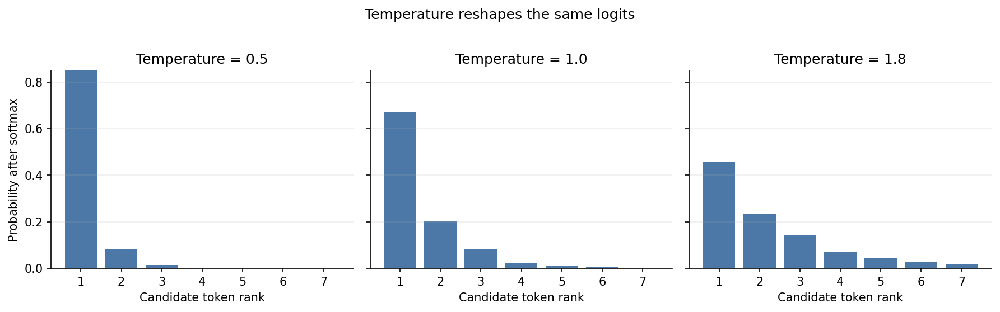
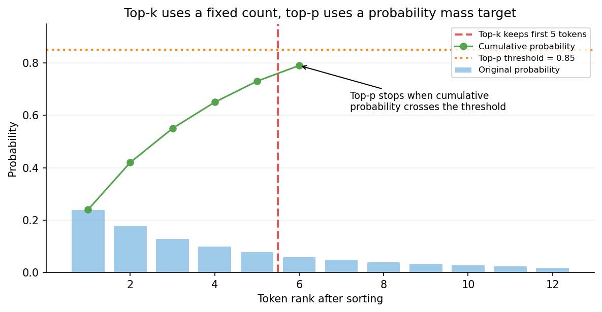
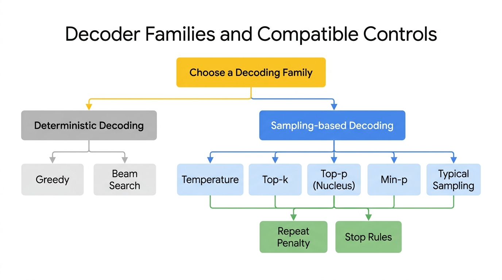

# Day 16: Sampling Strategies

> **Core Question**: If a language model knows the probability of the next token, how do we turn that probability distribution into text that is useful, coherent, and not painfully boring?

---

## Opening

A language model does not directly "write" the next word. It produces a ranked menu of possible next tokens with probabilities attached. Decoding is the policy that decides what to do with that menu. This sounds like a small implementation detail. It is not. Decoding is often the difference between a model that sounds sharp, a model that rambles, and a model that repeats itself like a broken voicemail system.

Think of the model as a jazz pianist who knows many valid next notes. Sampling strategy is the bandleader. A strict bandleader says, "Always play the most likely note." That gives you something orderly, but often predictable and lifeless. A chaotic bandleader says, "Anything goes." That creates surprise, but also mistakes. Good generation sits between those extremes. You want enough freedom for originality, but enough discipline for structure.

This is why the same base model can feel completely different under different settings. Temperature, top-k, and top-p are not cosmetic knobs. They control the shape of uncertainty. Beam search is not just "better search" either, because in open-ended language generation, the most likely sequence is not always the most interesting or most human-sounding one.

> **What is beam search?** Instead of picking only the single best token at each step (greedy decoding), beam search keeps the top $B$ candidate sequences alive simultaneously and picks the best complete sequence at the end. It's more thorough than greedy, but tends to produce safe, generic text. We'll explain it in detail in Section 4.

In this article, we will build intuition for the main sampling strategies, see the math behind them, study their trade-offs, and end with practical rules for choosing them in real systems.

---

## 1. Decoding starts after the model finishes its real job

The core job of an autoregressive language model is simple to state:

$$
\begin{aligned}
P(x) &= \prod_{t=1}^{T} P(x_t \mid x_{<t}) \\
\hat{x}_{t+1} &\sim P(\cdot \mid x_{\le t})
\end{aligned}
$$

The first line says the probability of a sequence is decomposed into conditional next-token probabilities. The second line hides the entire decoding problem inside the symbol $\sim$. Once the model gives you a distribution over possible next tokens, you still need a rule to choose one.

That rule matters because language distributions are broad. For many prompts, several next tokens are plausible. After "The capital of France is", the distribution is sharply peaked and decoding is easy. After "In the moonlit alley, she whispered", the space of reasonable continuations is much wider. A decoder must decide whether to exploit the head of the distribution, explore the tail, or cut the tail off entirely.


*Caption: Temperature does not change the model's logits themselves. It changes how sharply we convert those logits into probabilities, making the same model act more cautious or more adventurous.*

A useful mental model is this: the model gives **beliefs**, the decoding algorithm turns beliefs into **behavior**. Training determines what the model knows. Sampling determines how that knowledge is expressed.

### 1.1 From logits to probabilities

Before sampling, the model outputs **logits**, unnormalized scores for every token in the vocabulary. We convert them into probabilities with softmax:

$$
\begin{aligned}
p_i &= \frac{\exp(z_i)}{\sum_j \exp(z_j)} \\
\sum_i p_i &= 1
\end{aligned}
$$

where $z_i$ is the logit for token $i$. Because softmax is exponential, small changes in logits can create large changes in probabilities. That is why decoding controls can have surprisingly strong effects.

### 1.2 Why greedy decoding often disappoints

The simplest decoder is **greedy decoding**: pick the highest-probability token at every step. It is locally optimal and computationally cheap. It is also often a bad choice for creative or long-form text.

Why? Because local confidence compounds. If the model repeatedly takes the single safest token, the sequence drifts toward bland, repetitive language. Greedy decoding is like always taking the widest, best-lit road in a city. You will not get lost, but you will also never discover anything interesting.

Greedy decoding is still useful when precision matters more than diversity, for example in constrained extraction, deterministic formatting, or some classification-like prompting. But for open-ended generation, it usually underperforms sampling methods that preserve some uncertainty.

---

## 2. Temperature, the simplest and most misunderstood knob

Temperature rescales logits before softmax:

$$
\begin{aligned}
p_i^{(T)} &= \frac{\exp(z_i / T)}{\sum_j \exp(z_j / T)}
\end{aligned}
$$

> **What is $T$ in this formula?** $T$ is the Temperature parameter you set when calling an API (e.g., `temperature=0.7`). It sits in the denominator, so it controls whether the score differences between tokens are amplified or dampened:
> - $z_i$ = the raw score (logit) the model assigns to each candidate token
> - Low $T$ (e.g. 0.5) = scores divided by a small number = differences amplified = model strongly prefers top tokens
> - High $T$ (e.g. 2.0) = scores divided by a large number = differences shrunk = weaker tokens get more chance
>
> **Example:** Suppose the model scores "cat"=4, "dog"=2.
> - T=0.5: exp(8) : exp(4) = 2980:54 = almost certainly picks "cat"
> - T=2.0: exp(2) : exp(1) = 7.4:2.7 = likely "cat", but "dog" has a real chance

This one equation explains a lot:

- If $T < 1$, the distribution gets sharper.
- If $T = 1$, probabilities stay unchanged.
- If $T > 1$, the distribution gets flatter.
- As $T \to 0$, behavior approaches greedy decoding.
- As $T \to \infty$, the distribution approaches uniform randomness.

Temperature does **not** add intelligence. It changes risk tolerance. Lower temperature says, "Trust the model's top choice more strongly." Higher temperature says, "Let lower-ranked candidates compete more seriously."

### 2.1 When lower temperature helps

Low temperature is good when you want:

- factual answers with low stylistic variance,
- reliable structured output,
- fewer bizarre tails,
- more reproducibility.

This is why production APIs often default to values like 0.2 or 0.7 rather than 1.5. A high-capability model already has enough latent variability. You usually do not need to push it into chaos.

### 2.2 When higher temperature helps

Higher temperature can help when you want:

- brainstorming,
- multiple diverse drafts,
- more varied dialogue,
- escaping repetitive local loops.

But there is an important trade-off: higher temperature improves diversity by paying with reliability. If the original probability distribution already contains many weak but bad options, flattening that distribution gives those bad options more influence.

### 2.3 Temperature alone is rarely enough

A common beginner mistake is to think temperature is the only randomness control that matters. It is not. Temperature reshapes the entire distribution, including the ugly tail. If the tail contains junk tokens, higher temperature can make junk more likely. That is why practical systems often combine temperature with truncation methods such as top-k or top-p.

---

## 3. Top-k, top-p, and why truncation matters

**This section is about a different control lever: instead of reshaping probabilities, truncation removes some candidates from consideration entirely.**

If temperature changes the shape of the distribution, truncation changes the **support** of the distribution, meaning which tokens remain eligible to be sampled at all.

### 3.1 Top-k sampling

**Top-k sampling** keeps only the $k$ most likely tokens, renormalizes their probabilities, and samples from that reduced set.

$$
\begin{aligned}
S_k &= \text{set of top } k \text{ tokens by probability} \\
p_i^{(k)} &= \begin{cases}
\frac{p_i}{\sum_{j \in S_k} p_j} & i \in S_k \\
0 & i \notin S_k
\end{cases}
\end{aligned}
$$

This has a clear effect: it chops off the low-probability tail. If your model's vocabulary is 50,000 tokens, a lot of those tokens are effectively noise at a given step. Top-k refuses to consider them.

Top-k is easy to reason about, but it has a weakness: the right value of $k$ depends on the context. For a predictable prompt, only a few tokens may be plausible. For an ambiguous prompt, many may be plausible. A fixed $k$ does not adapt.

> **Example of why fixed k is problematic:**
>
> **Predictable context** — Prompt: *"The capital of France is"*
> - "Paris" (0.95), "Lyon" (0.02), "Marseille" (0.01)...
> - Only 1-2 tokens are plausible. If k=10, you're including 8 meaningless tokens as noise.
>
> **Ambiguous context** — Prompt: *"She looked at the"*
> - "sky" (0.15), "ocean" (0.12), "clock" (0.10), "mountain" (0.09), "painting" (0.08)...
> - Many tokens are plausible. k=10 might not even be enough for good diversity.
>
> **The problem:** k=10 treats both cases identically. It can't adapt. This is why the next section introduces **top-p (nucleus sampling)**, which adapts based on total probability mass instead of a fixed count.

### 3.2 Top-p or nucleus sampling

**Top-p sampling** fixes this by keeping the smallest set of tokens whose cumulative probability exceeds a threshold $p$, such as 0.9 or 0.95.


*Caption: Top-k always keeps the same number of candidates. Top-p expands or shrinks the candidate set depending on how concentrated the probability distribution is in the current context.*

Formally, sort tokens by probability, then choose the smallest set $S_p$ such that:

$$
\begin{aligned}
\sum_{i \in S_p} p_i \ge p
\end{aligned}
$$

This is why top-p is often more robust than top-k. If the model is confident, the nucleus may contain only a few tokens. If the model is uncertain, the nucleus naturally expands. It is adaptive instead of fixed-width.

### 3.3 Why top-p became so popular

Top-p works well because real language distributions are uneven. Some contexts are sharp, some are broad. A fixed top-k treats them the same. Top-p says, "Keep enough candidates to preserve most of the probability mass, then ignore the improbable tail." In practice, this often gives better quality-diversity trade-offs than top-k.

### 3.4 Combining temperature with top-p

This is a very common production recipe:

1. apply temperature to reshape probabilities,
2. apply top-p to remove the tail,
3. sample from the remaining nucleus.

That combination gives controlled creativity. Temperature controls boldness. Top-p keeps boldness from drifting into nonsense.

---

## 4. Beam Search, why it shines in translation and often fails in chat

**This section introduces an alternative decoding family, not just another sampling knob.**

**Beam Search** is not sampling in the usual sense. It keeps the top $B$ partial sequences at each step, expands them, and continues with the best-scoring beams. This approximates global sequence search better than greedy decoding.

> **How beam search works (concrete example, beam width = 3):**
>
> Regular decoding (greedy) picks the single highest-probability token at each step — like always taking the nearest path in a maze. Fast, but you might miss a better route.
>
> Beam search instead keeps $B$ candidate paths alive simultaneously:
>
> **Step 1:** Model outputs candidate tokens: "The" (0.5), "A" (0.3), "This" (0.15)... Keep top 3: `["The", "A", "This"]`
>
> **Step 2:** Expand each path with next tokens:
> - "The cat" (0.5 x 0.4 = 0.20)
> - "The dog" (0.5 x 0.3 = 0.15)
> - "A cat" (0.3 x 0.4 = 0.12)
> - "A dog" (0.3 x 0.3 = 0.09)
> - "This is" (0.15 x 0.5 = 0.075)
>
> Keep top 3 by total score: `["The cat", "The dog", "A cat"]`
>
> **Repeat** until generation ends, then pick the highest-scoring complete sequence.

Beam search is powerful in tasks where there is a relatively clear target sequence, such as machine translation or speech recognition. In such settings, finding a high-probability sequence is closely aligned with finding a good answer.

But open-ended language generation is different. The highest-probability continuation is often generic. If you use beam search for storytelling or chat, you often get text that is grammatically clean but dull, repetitive, and over-safe. This is sometimes called the **likelihood trap**. Models assign high probability to boring continuations because those continuations are broadly acceptable.

A useful way to say it is: beam search optimizes what the model is best at scoring, not necessarily what humans most enjoy reading.

So beam search is not obsolete, but it is specialized. Use it when sequence-level probability strongly correlates with quality. Avoid assuming it is the universally best decoder just because it is more exhaustive.

---

## 5. Practical decoding stacks in real systems

**The clean mental model is: first choose a base decoding family, then add stackable controls such as temperature, truncation, and penalties.**

Real generation systems rarely use one knob in isolation. They use a stack of heuristics.


*Caption: Beam Search is best understood as a different decoder family. Temperature, top-k, top-p, repetition penalties, and stop rules are stackable controls usually applied in sampling-based decoding pipelines.*

A common stack might look like this:

- temperature = 0.7,
- top-p = 0.9,
- frequency penalty or repetition penalty,
- max tokens and stop conditions,
- sometimes a minimum probability cutoff or typical sampling.

### 5.1 Repetition penalties

Sampling strategy is also about avoiding degenerate loops. Language models sometimes fall into repeated phrases because once repetition begins, those tokens can become self-reinforcing in the context. Repetition penalties lower the probability of tokens that have already appeared, reducing this loop effect.

This is especially useful in long-form generation. Without it, even a strong model can produce sequences that feel like a sentence is trying to climb out of a hole by repeating the same words.

### 5.2 Typical sampling and min-p

Newer truncation methods try to improve on top-p.

- **Typical sampling** prefers tokens whose surprise is close to the distribution's expected surprise, rather than just taking the highest-probability tokens.
- **Min-p sampling** keeps tokens whose probability exceeds a threshold relative to the top token.

The acronym story is worth being explicit about here. **Top-k** means “keep a fixed number of candidates.” **Top-p**, also called **nucleus sampling**, means “keep enough candidates to cover a target probability mass.” **Beam Search** means “track several high-scoring partial sequences in parallel.” They solve related problems, but they are not interchangeable controls.

You do not need to memorize all variants. The important pattern is that decoding research keeps trying to answer the same question: how do we preserve meaningful uncertainty while filtering out low-quality tails?

---

## 6. Code example: implementing the main strategies

```python
import torch
import torch.nn.functional as F


def sample_next_token(logits, temperature=1.0, top_k=None, top_p=None):
    """
    Sample one token from a model's logits.

    Args:
        logits: 1D tensor of vocabulary logits for the next token.
        temperature: Rescales confidence. Lower is safer, higher is more random.
        top_k: Keep only the k highest-probability tokens.
        top_p: Keep the smallest set of tokens with cumulative probability >= p.
    """
    # Avoid divide-by-zero. Very small temperature approximates greedy decoding.
    temperature = max(temperature, 1e-5)
    scaled_logits = logits / temperature

    # Convert logits to probabilities.
    probs = F.softmax(scaled_logits, dim=-1)

    if top_k is not None:
        # Find the cutoff probability of the k-th token.
        top_values, top_indices = torch.topk(probs, k=top_k)
        filtered = torch.zeros_like(probs)
        filtered[top_indices] = top_values
        probs = filtered / filtered.sum()

    if top_p is not None:
        # Sort tokens by probability, then keep the nucleus.
        sorted_probs, sorted_indices = torch.sort(probs, descending=True)
        cumulative = torch.cumsum(sorted_probs, dim=-1)

        # Keep every token before the threshold, plus the first token that crosses it.
        # This boundary token matters: otherwise top-p would keep LESS than p mass.
        keep_mask = cumulative <= top_p
        first_cross = torch.nonzero(cumulative > top_p, as_tuple=False)
        if len(first_cross) > 0:
            keep_mask[first_cross[0].item()] = True
        keep_mask[0] = True  # Always keep at least the top token.

        filtered = torch.zeros_like(probs)
        filtered[sorted_indices[keep_mask]] = probs[sorted_indices[keep_mask]]
        probs = filtered / filtered.sum()

    # Draw a sample according to the final probability distribution.
    next_token = torch.multinomial(probs, num_samples=1)
    return next_token.item(), probs


# Example usage
logits = torch.tensor([6.0, 4.8, 3.9, 2.7, 1.8, 1.1, 0.3])

token_id, final_probs = sample_next_token(
    logits,
    temperature=0.8,
    top_p=0.9,
)

print("Sampled token:", token_id)
print("Final distribution:", final_probs)
```

This code is simple, but it exposes the core design choices. Every decoder modifies either the shape of the distribution, the support of the distribution, or both. The subtle detail in top-p is the boundary token: the nucleus should include the first token that pushes cumulative mass over the threshold, otherwise the implementation contradicts the definition of nucleus sampling.

---

## 7. Common misconceptions

### ❌ "Lower temperature means higher factual accuracy"

Not necessarily. Lower temperature reduces randomness. It does not magically repair wrong beliefs inside the model. If the most likely answer is false, greedy decoding will confidently return that false answer.

### ❌ "Beam search is always better because it searches more"

More search is only better if the scoring function matches human quality. In open-ended generation, highest likelihood often means most generic, not most insightful.

### ❌ "Top-p and top-k are interchangeable"

They are related, but not identical. Top-k uses a fixed number of candidates. Top-p adapts to the context by preserving a target probability mass. That difference matters a lot in practice.

### ❌ "Sampling is just for creativity tasks"

Even non-creative applications need decoding choices. Structured extraction, tool calling, summarization, and reasoning all benefit from task-specific decoding settings.

### ❌ "If output quality is bad, increase temperature"

Sometimes the opposite is true. If the model is already uncertain or tail-heavy, higher temperature can amplify noise. Bad outputs are often a prompt, model, or grounding problem, not merely a decoding problem.

---

## 8. How to choose a strategy in practice

**The practical question is not “which decoder is best,” but “which kind of uncertainty is acceptable for this task?”**

Here is a practical rule set that works surprisingly well:

### For factual QA, extraction, or tool use
- start with temperature between 0.0 and 0.3,
- use top-p near 1.0 or disable it,
- prefer determinism and formatting reliability.

### For general chat
- start with temperature around 0.6 to 0.8,
- use top-p around 0.9 to 0.95,
- add repetition controls if outputs are long.

### For brainstorming or creative writing
- try temperature around 0.8 to 1.1,
- keep top-p around 0.9,
- generate multiple candidates and rank them afterward.

### For translation or constrained generation
- greedy or beam search may be reasonable,
- but always compare against sampling baselines rather than assuming search is superior.

The deeper principle is simple: **match the decoder to the task's tolerance for uncertainty**. Some tasks punish variation. Others need it.

---

## 9. Further reading

### Beginner
1. [The Curious Case of Neural Text Degeneration](https://arxiv.org/abs/1904.09751)  
   The paper that made top-p sampling famous by showing why beam search and greedy decoding often produce degenerate text.
2. [How to Generate Text: Using Different Decoding Methods for Language Generation with Transformers](https://huggingface.co/blog/how-to-generate)  
   A practical overview with examples.

### Advanced
1. [Truncation Sampling as Language Model Desmoothing](https://arxiv.org/abs/2210.15191)  
   A deeper look at why truncation-based decoding works.
2. [Locally Typical Sampling](https://arxiv.org/abs/2202.00666)  
   Introduces typical sampling as an alternative to top-k and top-p.

### Papers
1. [The Curious Case of Neural Text Degeneration](https://arxiv.org/abs/1904.09751)
2. [Language Modeling with Nucleus Sampling](https://openreview.net/forum?id=rygGQyrFvH)
3. [Locally Typical Sampling](https://arxiv.org/abs/2202.00666)

---

## Reflection Questions

1. Why does the highest-probability next token at each step often lead to worse long-form text than sampling from a carefully truncated distribution?
2. In what kinds of applications would you prefer deterministic decoding even if it makes the model sound less natural?
3. If a model hallucinates under temperature 0, what does that tell you about the source of the error?

---

## Summary

| Concept | One-line Explanation |
|---------|----------------------|
| Greedy decoding | Always pick the most likely next token, which is stable but often dull |
| Temperature | Rescales confidence, making the distribution sharper or flatter |
| Top-k | Samples only from the top k tokens |
| Top-p | Samples from the smallest set covering a target probability mass |
| Beam search | Searches for high-probability sequences, useful for constrained tasks but often bland for open-ended text |

**Key Takeaway**: A language model predicts probabilities, not final text. Sampling strategies are the bridge between model uncertainty and observed behavior. Good decoding is about disciplined uncertainty management: keep enough randomness to avoid boring local optima, but not so much that you invite the garbage tail to take over.

---

*Day 16 of 60 | LLM Fundamentals*  
*Word count: ~2748 | Reading time: ~16 minutes*
