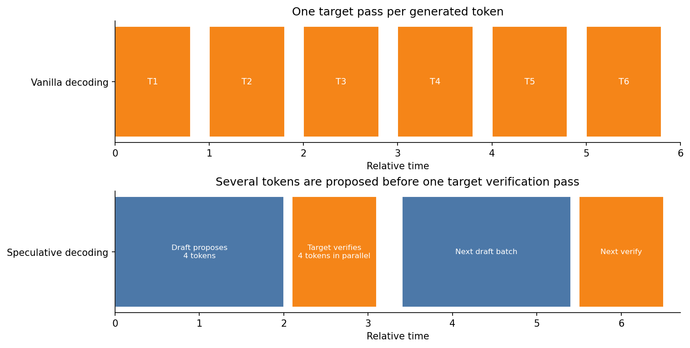
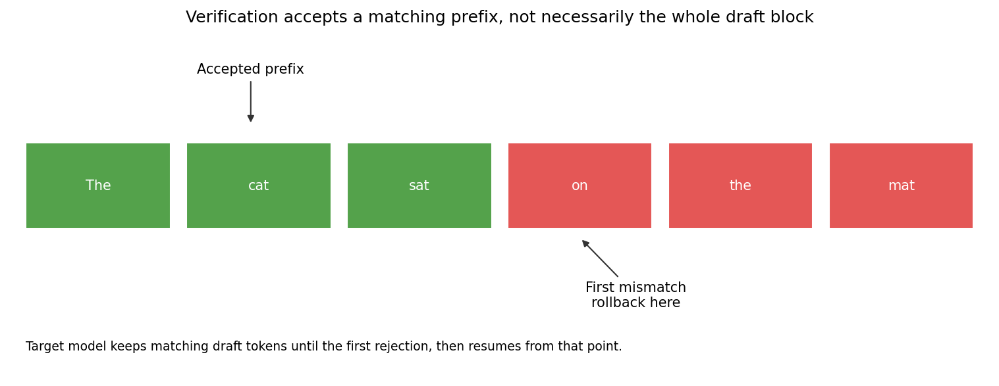
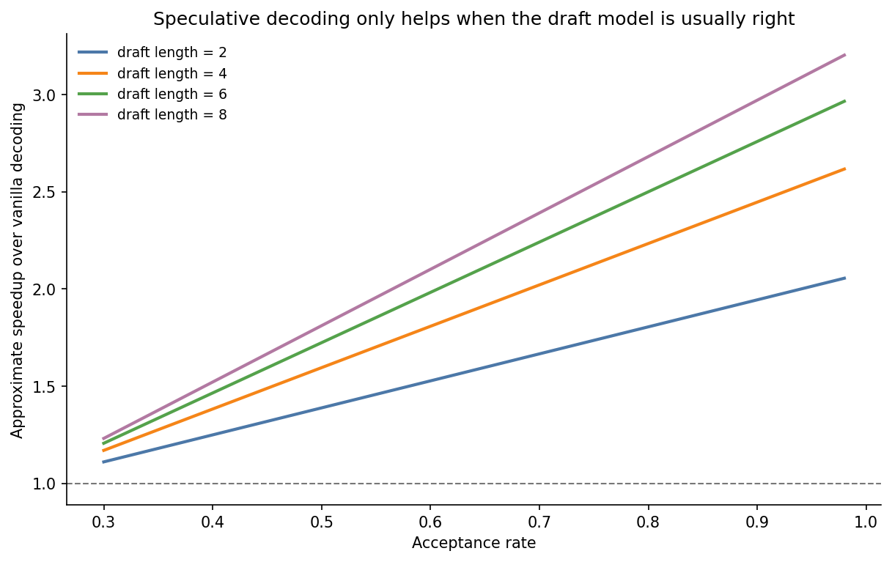
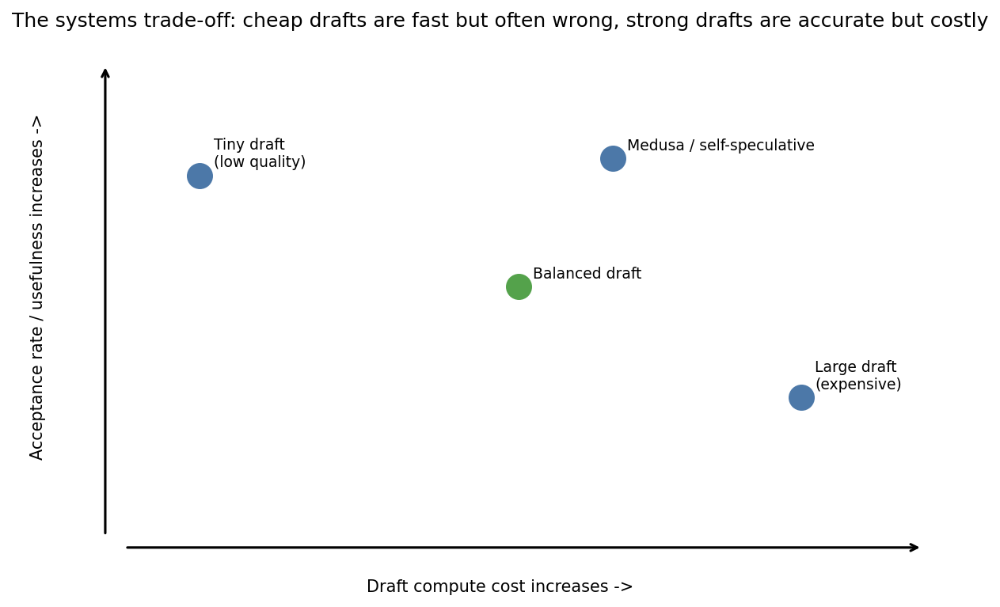

# Day 18: Speculative Decoding

> **Core Question**: How can we generate multiple candidate tokens at once, keep exactly the same output distribution as the target model, and still make LLM inference faster?

---

## Opening

If KV cache is the trick that stops a model from rereading the entire book every time it writes one new word, **speculative decoding** is the trick that asks a faster assistant to draft a few words ahead while the real author checks the work in bulk.

That framing matters because modern LLM inference has an awkward shape. The target model is huge, so each decode step is expensive. Worse, autoregressive decoding is serial: token 2 depends on token 1, token 3 depends on token 2, and so on. GPUs love parallel work, but vanilla decoding gives them a tiny step-by-step loop. This is why even when a model is smart, it can still feel sluggish.

Speculative decoding attacks that serialization bottleneck. Instead of letting the large model produce exactly one token per step, we introduce a **draft model** that is much cheaper. The draft model proposes several tokens, then the target model verifies them in one larger pass. If the draft is often right, the target model can accept a whole prefix of those tokens, which means one expensive verification pass may advance generation by multiple tokens.

Think of it like pair programming. A junior engineer writes the obvious next few lines quickly. The senior engineer then reviews that chunk all at once. If the junior's guess is good, progress jumps ahead. If the guess drifts, the senior corrects the first bad line and takes over from there. The speedup depends on one thing above all: how often the junior is right.

This article explains the mechanism, the math intuition, the acceptance and rejection logic, the systems trade-offs, and why speculative decoding is helpful but not magical.

---

## 1. Why vanilla decoding leaves performance on the table

**One-sentence summary**: Vanilla autoregressive inference uses the strongest model for every single next-token decision, which is exact but frustratingly serial.

A decoder-only language model defines

$$
P(x_{1:T}) = \prod_{t=1}^{T} P(x_t \mid x_{1:t-1}).
$$

At generation time, we repeatedly do:

1. run the target model on the current prefix,
2. sample or choose the next token,
3. append it,
4. repeat.

With KV cache, we avoid recomputing old keys and values, so this is much better than recomputing the whole prefix from scratch. But the process is still fundamentally sequential. The target model must be consulted every time we want one more token.

That means the expensive model becomes the pace car for the entire interaction. If it takes 20 milliseconds to verify one next-token distribution, then producing 100 tokens means roughly 100 such expensive steps. This is the real bottleneck speculative decoding tries to loosen.


*Caption: Vanilla decoding spends one target-model pass per generated token. Speculative decoding tries to amortize that cost by letting a cheap draft model propose several tokens before one target verification pass.*

The idea is not to replace the target model. The target model is still the authority. The idea is to reduce how often we need to wait for that authority token by token.

---

## 2. The core mechanism, draft first, verify second

**One-sentence summary**: A small model proposes a short continuation, and the large model checks that continuation in parallel.

Suppose the current prefix is $x_{1:t}$. Instead of asking the target model for only $x_{t+1}$, we do this:

1. Use a cheap **draft model** $q$ to generate *γ* candidate tokens.
2. Run the **target model** $p$ once on the prefix plus those drafted tokens.
3. Compare the draft proposals with what the target model would allow.
4. Accept a matching prefix of the draft tokens.
5. At the first rejected token, resample using the target model and continue from there.

Why is this promising? Because the target model can score the drafted block in one pass. If the first three drafted tokens are acceptable, then one expensive target pass may move generation forward by three or four positions instead of just one.

The intuition is simple. If the draft model is usually a decent guesser of the target model, then most verification work confirms tokens rather than replacing them. In that regime, speculative decoding converts serial generation into a chunked workflow.

But there is a subtle requirement: the final output must remain faithful to the **target distribution**, not the draft distribution. Otherwise we would merely be using a weaker model and hoping for the best. The clever part of speculative decoding is that it preserves exactness through accept-reject logic.

---

## 3. Acceptance and rejection, why the output can still be exact

**One-sentence summary**: Draft tokens are accepted only under a rejection-sampling rule that ensures the final sequence is distributed as if the target model generated it directly.

Let $p(\cdot)$ be the target distribution for a position and $q(\cdot)$ the draft distribution. When the draft proposes a token $y$, we do **not** blindly accept it. Instead, we accept it with probability

$$
\alpha(y) = \min\left(1, \frac{p(y)}{q(y)}\right).
$$

This rule encodes a powerful idea:

- if the draft **underestimates** the token compared with the target, then $p(y) / q(y) > 1$, so acceptance is clipped to 1,
- if the draft **overestimates** the token, then acceptance drops below 1.

So the system is more tolerant when the draft is conservative and stricter when the draft is too confident about something the target does not like.

After the first rejection, we do not simply continue as if nothing happened. We sample from a **corrected residual distribution**, conceptually proportional to

$$
\bigl(p(x) - q(x)\bigr)_+,
$$

where $(z)_+ = \max(z, 0)$. This is the leftover probability mass that the target assigns but the accepted draft process has not already accounted for. That correction is what keeps the final result exact.

You do not need to memorize the proof, but the mechanism is worth understanding. Imagine two cashiers reconciling the same receipt. The draft cashier pre-fills obvious items. The target cashier checks each line. If an item is plausible under both, keep it. If the draft overclaimed something, the target subtracts that excess and redraws from the remaining valid choices. The goal is not “close enough.” The goal is “exactly the same accounting in distribution.”


*Caption: Verification usually accepts a prefix of the drafted tokens, then stops at the first mismatch. That accepted-prefix structure is the main source of speedup.*

In practice, many explanations simplify this to “accept tokens while the target agrees, reject when it does not.” That intuition is directionally useful, but the real algorithm is more careful because it must preserve the target model's sampling behavior, not just its greedy choices.

---

## 4. Why speculative decoding can be faster

**One-sentence summary**: The speedup comes from replacing many expensive target-model steps with fewer target-model verification passes plus a cheap draft loop.

A rough mental model is:

- vanilla decoding pays for 1 target pass per output token,
- speculative decoding pays for 1 cheap draft pass per proposed token plus 1 target verification pass per block.

If the draft block length is $\gamma$ and the expected accepted prefix length is high, then the average number of accepted tokens per target pass becomes much greater than 1. That is where the win comes from.

A simple approximation is

$$
\text{speedup} \approx \frac{1 + \gamma a}{1 + c\gamma},
$$

where:

- $a$ is the acceptance rate,
- $\gamma$ is draft length,
- $c$ is draft-model cost relative to one target verification pass.

This is not the exact theorem from the paper, but it is a useful engineering heuristic. It tells you three things immediately:

1. higher acceptance helps,
2. longer draft blocks help only if acceptance stays high,
3. a draft model that is too large can eat away the benefit.


*Caption: Approximate speedup curves for different draft lengths. If the draft model is often wrong, the extra proposal work does not pay for itself. If it is often right, speedup can become substantial.*

This is why speculative decoding is not a free lunch. It works best when the draft model is cheap **and** aligned enough with the target model to get a long accepted prefix.

---

## 5. Systems intuition, why GPUs like this pattern

**One-sentence summary**: Speculative decoding creates larger chunks of useful work for the target model, which better matches modern accelerator hardware.

**Graphics Processing Units (GPUs)** are happiest when they run wide parallel kernels, not tiny sequential loops. Vanilla decoding keeps asking for one more token, one more token, one more token. Even with KV cache, the target model is repeatedly invoked for a narrow task.

Speculative decoding changes the shape of the workload. The draft model runs fast, and the target model verifies multiple positions in one shot. That improves hardware utilization in two ways:

1. it reduces the number of expensive synchronization points with the target model,
2. it gives the target model a denser verification workload per invocation.

This is also why the benefit depends on the serving stack. If your target model is already perfectly optimized, the gain may be modest. If your baseline is decode-bound and launch-heavy, speculative decoding can help a lot. Real systems live in that messy middle ground.

Another useful perspective is that speculative decoding is a cousin of branch prediction in CPUs. The processor guesses the next path, executes ahead, and rolls back if the guess was wrong. The analogy is not exact, but it is close enough to build intuition: prediction is cheap, rollback is acceptable, and overall throughput improves if the prediction accuracy is high enough.

---

## 6. Choosing the draft model, the central trade-off

**One-sentence summary**: The best draft model is not the smartest possible one, but the cheapest one that still predicts the target model well enough.

This is the part many first explanations skip. It is tempting to think “better draft model means better speedup.” Not always.

A larger draft model usually raises acceptance because its distribution is closer to the target model. But it also costs more to run. A tiny draft model is extremely cheap, yet it may hallucinate the continuation so badly that the target rejects most of its proposals. Either extreme can lose.


*Caption: A useful draft model lives in the middle of the trade-off map: cheap enough to run ahead, but accurate enough that the target often accepts its proposals.*

In practice, the sweet spot depends on model family, tokenizer compatibility, serving hardware, and workload. Chat completions with repetitive structures may get better acceptance than highly creative generation. Domain-specific prompts may help or hurt depending on whether the draft model was trained on similar data.

This is why speculative decoding is often presented as a systems optimization, not just a sampling trick. The theoretical algorithm is elegant, but deployment success depends on choosing a good draft-target pairing.

---

## 7. Variants, from classic draft-target to self-speculative methods

**One-sentence summary**: Modern variants try to keep the same idea while reducing the cost of maintaining a separate draft model.

### 7.1 Classic speculative decoding

This is the Leviathan et al. 2023 setup. A separate small model drafts, a large model verifies, and the output distribution matches the large model exactly.

### 7.2 Speculative sampling and related formulations

Different papers package the same family of ideas with slightly different acceptance logic, implementation details, or performance analyses. The shared goal is the same: batch verification while preserving target-quality sampling.

### 7.3 Medusa and multi-head drafting

Methods like **Medusa** avoid an entirely separate draft model by attaching extra decoding heads to the main model. The model predicts several future positions in parallel, then verifies them. This can simplify deployment because there is no second model to host, although it may require training modifications.

### 7.4 Self-speculative decoding

Another direction uses early exits or lighter internal pathways from the same model as the draft source. The intuition is appealing: let the large model make a rough guess using a cheaper internal computation path, then confirm with the full path.

These variants all chase the same dream, reduce serial dependence without giving up target-model quality.

---

## 8. Limitations and failure modes

**One-sentence summary**: Speculative decoding helps only when the draft and target cooperate well; otherwise it adds work and complexity.

Here are the main failure modes.

### 8.1 Low acceptance rate

If the draft model is often wrong, the target rejects early and the system gains little. You still paid for the draft model, so speedup may disappear or even become a slowdown.

### 8.2 Draft model overhead

Running a second model means more memory, more engineering, more scheduling logic, and sometimes more tokenizer or cache coordination. The algorithm may be mathematically elegant while the production stack becomes messier.

### 8.3 Verification still uses the expensive model

Speculative decoding reduces how often the target model is consulted, but it does not eliminate the target model. If target verification dominates overall latency, the ceiling on improvement may remain limited.

### 8.4 Workload dependence

Acceptance can vary by task. Deterministic summarization may be easier to draft than open-ended creative writing. Code completion may be bursty, with easy stretches followed by exacting syntax checks.

### 8.5 Interaction with batching and serving

In multi-request serving, keeping two models busy efficiently is not trivial. A clean single-request paper result does not automatically translate into the same win in a production cluster.

---

## 9. Code example, a toy speculative decoding loop

**One-sentence summary**: The implementation has more bookkeeping than vanilla decoding because accepted-prefix logic and fallback sampling must be handled carefully.

```python
import random
from typing import List


def sample_from(dist):
    # dist is a dict: token -> probability
    r = random.random()
    cumulative = 0.0
    for token, prob in dist.items():
        cumulative += prob
        if r <= cumulative:
            return token
    return list(dist.keys())[-1]


def accept_prob(target_dist, draft_token, draft_dist):
    p = target_dist.get(draft_token, 0.0)
    q = draft_dist.get(draft_token, 1e-12)
    return min(1.0, p / q)


def residual_distribution(target_dist, draft_dist):
    # Positive leftover mass from the target after accounting for the draft
    residual = {}
    total = 0.0
    for tok, p in target_dist.items():
        value = max(0.0, p - draft_dist.get(tok, 0.0))
        residual[tok] = value
        total += value
    if total == 0.0:
        return target_dist
    return {tok: value / total for tok, value in residual.items()}


def speculative_step(prefix: List[str], draft_model, target_model, gamma: int = 4):
    # 1) Draft several candidate tokens autoregressively
    draft_tokens = []
    draft_dists = []
    ctx = prefix[:]
    for _ in range(gamma):
        q = draft_model.next_token_distribution(ctx)
        y = sample_from(q)
        draft_tokens.append(y)
        draft_dists.append(q)
        ctx.append(y)

    # 2) Ask the target model to score the drafted block in parallel
    target_dists = target_model.block_distributions(prefix, draft_tokens)

    # 3) Accept drafted tokens until the first rejection
    accepted = []
    for y, q, p in zip(draft_tokens, draft_dists, target_dists):
        if random.random() <= accept_prob(p, y, q):
            accepted.append(y)
        else:
            corrected = residual_distribution(p, q)
            accepted.append(sample_from(corrected))
            return prefix + accepted

    # 4) If all draft tokens were accepted, sample one more from the target
    accepted.append(sample_from(target_model.next_token_distribution(prefix + accepted)))
    return prefix + accepted
```

This toy example omits KV cache details, batching, and tensor-level efficiency, but it captures the important logic: propose, verify, accept a prefix, and fall back to a corrected target distribution after the first rejection.

---

## 10. Common misconceptions

### ❌ “Speculative decoding changes the model's behavior.”

In the classic exact algorithm, no. The final output distribution matches the target model. The point is acceleration, not approximation.

### ❌ “If I draft more tokens, speedup always gets better.”

No. Longer draft blocks help only when the draft model remains accurate enough. Otherwise rejection wipes out the gain.

### ❌ “This replaces KV cache.”

No. They solve different problems. KV cache avoids recomputing past keys and values. Speculative decoding reduces how often the target model must produce the next-token distribution.

### ❌ “Acceptance rate is just a minor tuning detail.”

It is the main economic variable. A speculative system with poor acceptance can be slower than vanilla decoding.

---

## 11. Further reading

### Beginner

1. [Fast Inference from Transformers via Speculative Decoding](https://arxiv.org/abs/2211.17192)  
   The classic Leviathan et al. paper that introduced exact speculative decoding.

2. [Accelerating Large Language Model Decoding with Speculative Sampling](https://arxiv.org/abs/2302.01318)  
   Another influential 2023 treatment with related acceptance-sampling ideas.

3. [An Introduction to Speculative Decoding for Reducing Latency in AI Inference](https://developer.nvidia.com/blog/an-introduction-to-speculative-decoding-for-reducing-latency-in-ai-inference/)  
   A practical systems-oriented overview from NVIDIA.

### Advanced

1. [Medusa: Simple LLM Inference Acceleration Framework with Multiple Decoding Heads](https://arxiv.org/abs/2401.10774)  
   A strong example of self-speculative style acceleration without a separate external draft model.

2. [vLLM documentation](https://docs.vllm.ai/)  
   Useful for understanding how speculative decoding interacts with real serving stacks.

### Papers

1. [Fast Inference from Transformers via Speculative Decoding](https://proceedings.mlr.press/v202/leviathan23a.html)
2. [Accelerating Large Language Model Decoding with Speculative Sampling](https://arxiv.org/abs/2302.01318)
3. [Medusa: Simple Framework for Accelerating LLM Generation with Multiple Decoding Heads](https://arxiv.org/abs/2401.10774)

---

## Reflection questions

1. Why is acceptance rate a better mental model for speculative decoding performance than draft-model perplexity alone?
2. In what workloads would you expect a tiny draft model to beat a medium draft model, even if its token predictions are worse?
3. How would speculative decoding interact with other inference optimizations such as KV cache, quantization, and prefix caching?

---

## Summary

| Concept | One-line explanation |
|---------|----------------------|
| Speculative decoding | Use a cheap draft model to propose multiple tokens, then let the target model verify them in bulk. |
| Acceptance rule | Draft tokens are accepted with a rejection-sampling rule so the final distribution still matches the target model. |
| Speedup source | One expensive target pass can advance generation by several accepted tokens. |
| Main bottleneck | Speedup depends on acceptance rate and draft-model cost. |
| Key trade-off | The ideal draft model is cheap enough to run ahead and accurate enough to be trusted often. |

**Key takeaway**: Speculative decoding is one of the cleanest ideas in modern LLM inference because it attacks the real enemy, serial dependence. It does not make the target model disappear, and it does not make long-context generation free. What it does is more practical and more interesting: it restructures generation so a fast guesser and a slow judge work together. When that partnership is well chosen, the model feels dramatically faster without giving up the target model's distribution.

---

*Day 18 of 60 | LLM Fundamentals*  
*Word count: ~2850 | Reading time: ~17 minutes*
