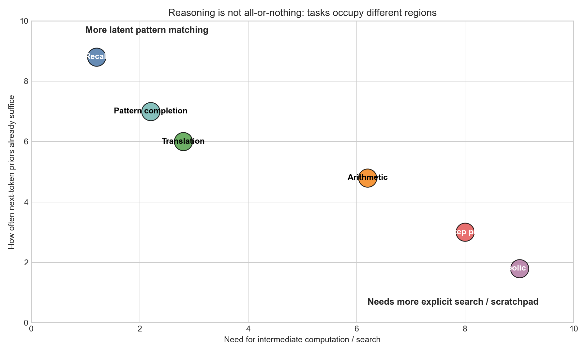
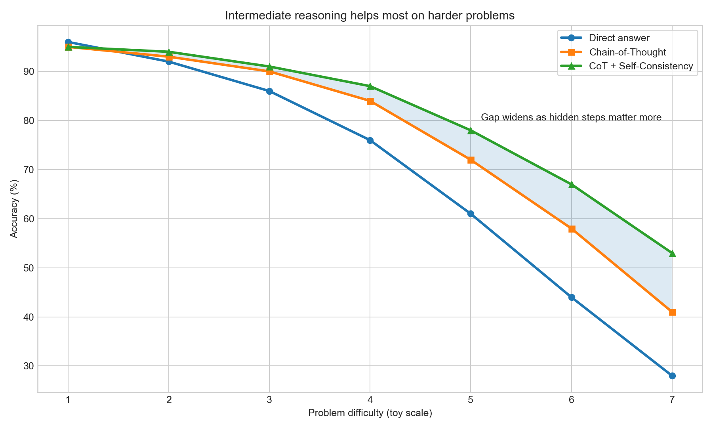
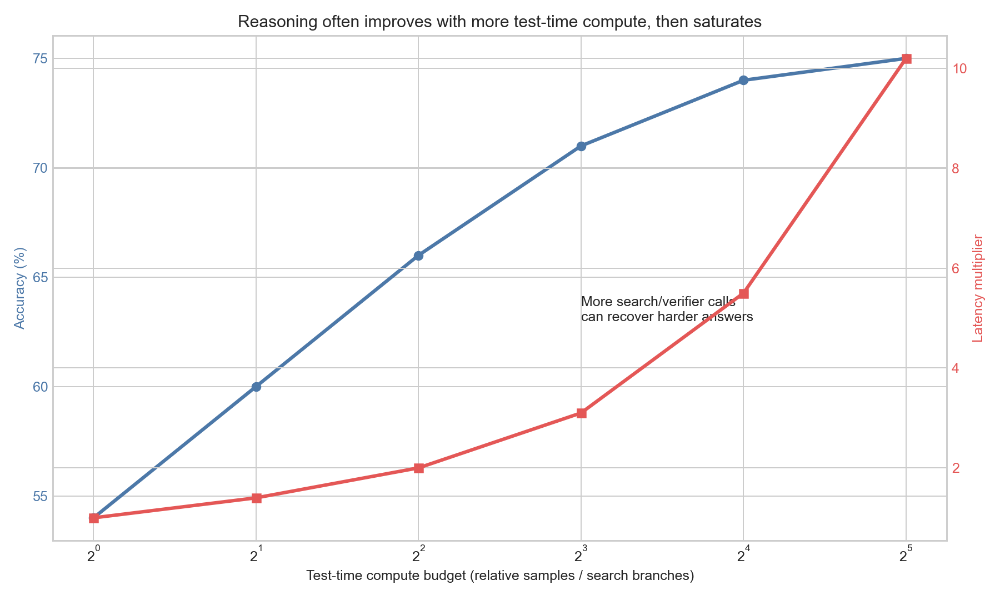
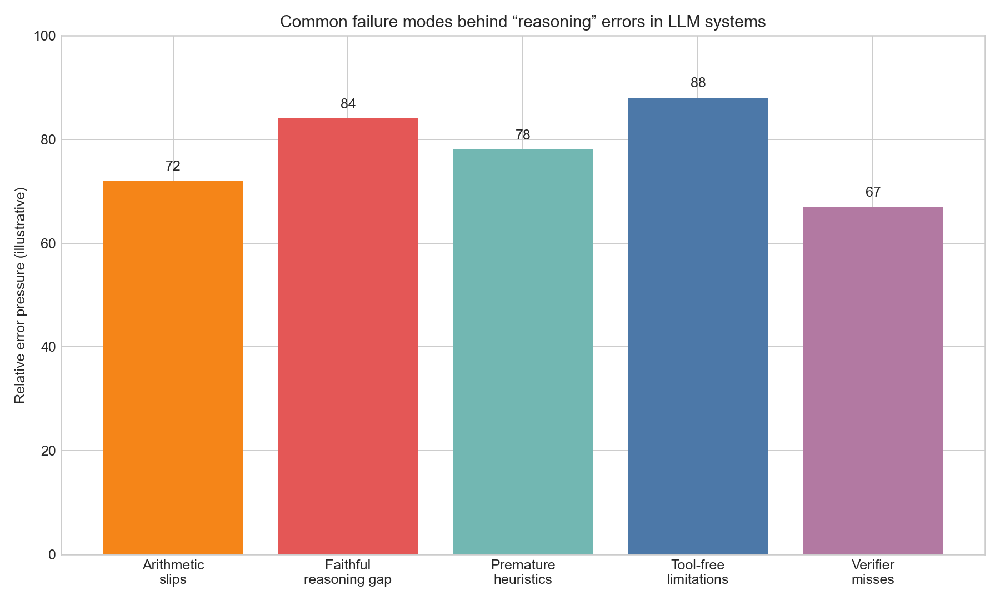

# Day 22: Reasoning Ability

> **Core Question**: Can LLMs really reason, or are they just very good at imitating the surface form of reasoning?

---

## Opening

Few questions in modern AI trigger more heat than this one: *does a language model actually reason*?

One camp says yes. After all, strong models can solve Olympiad-style math problems, write multi-step code patches, and explain their logic in clean natural language. Another camp says no. They argue that the model is only doing next-token prediction over a huge training distribution, and that what looks like reasoning is often just a polished remix of patterns seen before.

Both camps are pointing at something real.

If you ask a model to translate a sentence, summarize a paragraph, or continue a familiar pattern, the answer may come out almost instantly, with no visible deliberation. But if you ask for a tricky word problem, a logic puzzle with distractors, or a planning task where one early mistake poisons the rest, performance often changes a lot when you give the model a scratchpad, a verifier, extra search, or tool access. That tells us something important. "Reasoning" is not one magical switch. It is a bundle of abilities: decomposing a problem, carrying intermediate state, searching over alternatives, checking consistency, and selecting an answer that survives verification.

Think of it like mental arithmetic. A human can answer $7 + 5$ from memory, but may need paper for $847 \times 96$. We would not say the human can only "pattern match" in the first case or only "truly reason" in the second. The same mind uses different modes depending on task difficulty and available external aids. LLMs look increasingly similar. Sometimes the pretrained prior is enough. Sometimes explicit intermediate computation matters a lot.

So the right question is not "reasoning or pattern matching?" The better question is: **what kinds of reasoning can emerge from next-token prediction, where do they break, and what system designs make them more reliable?**

In this article, we will separate surface fluency from real problem solving, examine why Chain-of-Thought (CoT) works, discuss the debate around whether verbalized reasoning is faithful, and connect all of this to test-time compute, tool use, and current limitations.

---

## 1. What people mean by “reasoning”

**One-sentence summary**: In practice, reasoning means producing correct answers on tasks that require intermediate state, constraint tracking, or search, not merely fluent language continuation.

The word *reasoning* is overloaded. In everyday speech it can mean “thinking carefully.” In cognitive science it may refer to rule following, causal inference, abstraction, or planning. In LLM evaluation, it usually means something narrower: can the model solve tasks where the answer is not obvious from local word associations alone?

A useful operational definition is this:

> A model shows reasoning ability when success requires combining multiple pieces of information through intermediate steps, and the model reliably performs those steps rather than only retrieving a memorized pattern.

That definition still leaves gray areas, but it helps us divide tasks into rough categories.

1. **Recognition-heavy tasks**: translation, paraphrase, style transfer, basic factual recall. These lean heavily on pattern matching from pretraining.
2. **Computation-heavy tasks**: arithmetic, symbolic manipulation, constrained planning. These require intermediate state that may not fit in a single intuitive leap.
3. **Search-heavy tasks**: theorem proving, program synthesis with backtracking, puzzle solving. These often benefit from branching, verification, and external tools.

An important subtlety is that every one of these uses pattern matching somehow. Even humans reason using learned priors. The issue is not whether pattern matching exists. The issue is whether learned patterns are enough for the task, or whether the model needs an explicit mechanism to maintain and check multi-step structure.

*Caption: Some tasks are mostly handled by latent priors, while others increasingly need explicit intermediate computation or search.*

This is why debates become confusing. When one researcher says, “LLMs reason,” they may mean “LLMs solve many tasks previously thought to need reasoning.” When another says, “LLMs do not reason,” they may mean “the internal process is brittle, unfaithful, and unlike systematic symbolic reasoning.” Both statements can be partly true.

---

## 2. Why next-token prediction can produce something reasoning-like

**One-sentence summary**: Predicting the next token at scale can implicitly teach models many latent algorithms, because language and code contain traces of human reasoning processes.

At first glance, next-token prediction sounds too weak to produce real reasoning. The training loss is just

$$
\mathcal{L} = -\sum_{t=1}^{T} \log P(x_t \mid x_{<t}).
$$

There is no explicit variable called “belief,” no theorem prover built into the objective, and no hard guarantee that the model is learning correct world models. So why does reasoning-like behavior appear at all?

Because the training signal is richer than it looks.

Human-generated text does not only contain conclusions. It also contains explanations, decompositions, derivations, code, worked examples, math proofs, bug-fixing dialogues, and millions of traces where one sentence constrains what the next sentence should be. To predict later tokens well, the model must compress some of the structure that generated those traces.

A useful analogy is chess commentary. If you train a system only to predict the next word in millions of chess books, game annotations, and move sequences, the model may end up internalizing quite a lot about tactical motifs, openings, and board evaluation, even though nobody explicitly programmed a minimax search into the loss. The training objective is indirect, but the data distribution carries structure.

This explains two important observations:

- LLMs often exhibit **latent competence** before we know how to elicit it.
- Better prompting can unlock abilities that were already partially inside the model.

The famous Chain-of-Thought paper by Wei et al. showed that prompting large models to produce intermediate reasoning steps can sharply improve performance on multi-step tasks. The key lesson was not just that models can talk more. It was that in some regimes, asking for the intermediate trajectory makes hidden computation more accessible.

Still, next-token prediction does not magically guarantee robust reasoning. It gives us a substrate from which reasoning-like behavior can emerge, but not a clean proof engine.

---

## 3. Chain-of-Thought is a window into hidden computation, not a proof of faithful reasoning

**One-sentence summary**: CoT often improves performance because it expands intermediate computation, but the visible chain is not always the true cause of the answer.

Chain-of-Thought prompting asks the model to externalize steps that might otherwise remain implicit. A classic form is: *“Let’s think step by step.”* A more controlled version includes worked examples showing how to decompose problems.

Why does this help?

### 3.1 It creates more room for computation

If the correct answer depends on several intermediate variables, a short direct answer may force the model to jump from problem statement to conclusion in one shot. CoT adds extra tokens, which act like a temporary workspace. In effect, the model gets more opportunities to transform the representation before committing to the final answer.

### 3.2 It linearizes a structured problem

Many hard tasks can be broken into a sequence: identify facts, derive sub-results, combine them, then answer. CoT turns an implicit graph of constraints into an explicit token sequence. That often makes decoding easier.

### 3.3 It improves answer selection under uncertainty

When the model writes steps, some wrong branches become visibly inconsistent. This gives later tokens a chance to correct earlier ambiguity, especially when combined with self-consistency.

*Caption: Direct answers can be enough on easy problems, but explicit reasoning and self-consistency tend to help more when hidden intermediate steps matter.*

But there is a catch. The visible chain is not guaranteed to be a faithful transcript of the internal process.

A model may produce a convincing explanation *after* already being biased toward an answer. It may rationalize. It may include irrelevant steps that sound logical. It may reach the right answer for the wrong reason. This is why researchers distinguish **performance gains from reasoning traces** and **faithfulness of reasoning traces**.

Think of it like a student who got the answer first from intuition, then reverse-engineered a neat derivation to satisfy the teacher. The derivation may look fine, and the answer may even be correct, but the derivation was not actually what generated the answer.

This matters for safety and interpretability. If we treat every natural-language chain as ground truth about model internals, we will overestimate how transparent the system really is.

---

## 4. Self-consistency, search, and test-time compute

**One-sentence summary**: Many reasoning gains come not from one perfect chain, but from sampling multiple chains, comparing them, and spending extra compute at inference time.

The self-consistency idea from Wang et al. is beautifully simple. Instead of greedily accepting the first chain the model produces, sample several diverse reasoning paths and take the final answer that appears most consistently.

Why can that work? Because difficult reasoning problems often have many possible paths to the correct answer, while wrong answers are scattered across more idiosyncratic trajectories. If several distinct chains converge on the same result, that result is often more trustworthy.

Formally, if we think of a hidden reasoning path $r$ leading to answer $y$, then the desired quantity is not just one greedy path but something closer to

$$
P(y \mid x) = \sum_{r} P(y \mid r, x) P(r \mid x).
$$

Self-consistency approximates that marginalization by sampling several paths and aggregating answers.

This opens a broader theme that has become central in modern reasoning systems: **test-time compute**. Instead of training a much larger base model, you can spend more inference compute on the same prompt by doing one or more of the following:

- sample multiple reasoning traces,
- verify candidate answers,
- branch and prune search trees,
- call external tools,
- or run critique-and-revision loops.

*Caption: More search or verification can raise reasoning accuracy, but the latency and cost usually grow faster than the gains.*

This is one of the biggest conceptual shifts in the field. For years, people focused mostly on training-time scaling, meaning bigger models and bigger datasets. Now, for reasoning tasks, inference-time scaling matters too. A model may answer a hard question much better when allowed to explore alternatives, much like a human who pauses, sketches a few possibilities, and checks the work.

Of course, the trade-off is obvious. More test-time compute means more latency and cost. In production systems, you rarely want “maximum reasoning” for every prompt. You want adaptive reasoning: cheap direct answers when the task is easy, more deliberate processing when the prompt looks high stakes or difficult.

---

## 5. Where current LLM reasoning still breaks

**One-sentence summary**: Today’s models often fail when they need exact symbolic state, faithful long-horizon planning, or robust verification of their own intermediate steps.

It is tempting to see reasoning benchmarks improving and conclude that the debate is settled. I think that would be too optimistic.

There are at least five recurring failure modes.

### 5.1 Arithmetic and symbolic brittleness

LLMs can perform surprisingly well on some arithmetic tasks, especially when given scratchpads, but they are still brittle. Exact symbolic manipulation is unforgiving. One incorrect carry digit or variable substitution can corrupt the whole solution.

This happens because neural sequence models are approximate function learners, not exact symbolic machines by default. Sometimes they simulate the algorithm well enough. Sometimes they drift.

### 5.2 Premature heuristic closure

A model may latch onto a familiar template too early. Instead of genuinely exploring the problem, it recognizes a superficial resemblance to something common in training and commits fast. Humans do this too, but LLMs have a particularly strong pressure toward locally plausible continuations.

### 5.3 Faithfulness gaps

The model’s written steps may not be the real causal story behind the answer. This makes debugging hard. If the chain is partly a rationalization, inspecting it tells you less than you hope.

### 5.4 Long-horizon planning problems

Multi-step planning across many constraints is still a weak spot. Even if each local step looks reasonable, the global plan may violate a constraint introduced ten steps earlier. Maintaining a consistent world model over long trajectories remains difficult.

### 5.5 Weak self-verification

People often say, “Just ask the model to check its own work.” Sometimes that helps. Often it does not. If the same biases that produced the mistake are reused during verification, the checker may simply bless the wrong answer in a more formal tone.

*Caption: Reasoning failures can arise from arithmetic slips, unfaithful chains, premature heuristics, lack of tools, or weak verifiers.*

A good mental model is that LLM reasoning today is **impressive but patchy**. It is strong enough to be useful, weak enough to be dangerous if you assume it is systematic.

---

## 6. Why tools often matter more than “thinking harder”

**One-sentence summary**: Reliable reasoning in real systems often comes from combining LLMs with external tools that provide exact computation, search, memory, or grounded evidence.

Suppose you ask a model to multiply two large integers, search a codebase, compare contract clauses, and produce a final recommendation. Should we want the model to do everything internally?

Usually, no.

A calculator is better for arithmetic. A retrieval system is better for evidence lookup. A symbolic solver is better for exact constraints. A compiler and test suite are better for checking code. The LLM’s comparative advantage is often orchestration: decomposing the task, deciding which tool to call, integrating results, and explaining the answer in human language.

This is why modern systems increasingly look like

$$
\text{LLM reasoning system} = \text{base model} + \text{scratchpad} + \text{tools} + \text{verification}.
$$

That equation is informal, but it captures the engineering reality. If you care about robust reasoning, especially in production, you usually want a hybrid system.

Think of an LLM as a smart intern with remarkable breadth but imperfect exactness. You would absolutely let that intern draft a plan, summarize evidence, and suggest hypotheses. But for the final spreadsheet total, legal citation, or production patch, you would want tools, tests, and review.

This perspective also resolves part of the philosophical debate. If by “real reasoning” you mean “the system solves hard tasks reliably,” then tool-augmented LLMs are clearly reasoning systems in practice. If by “real reasoning” you mean “the bare base model performs internally faithful algorithmic reasoning with no external support,” the answer is much more mixed.

---

## 7. Does verbal reasoning reflect internal reasoning?

**One-sentence summary**: Natural-language chains are useful handles for control and debugging, but they are incomplete and sometimes misleading proxies for what the model is internally doing.

This section is where the debate gets subtle.

When a model writes, “First we compute the total cost, then subtract the discount,” it is tempting to imagine a neat little symbolic machine inside the network following those exact steps. Sometimes the internal state may align with the text. Sometimes it may not.

Why might misalignment happen?

1. **Language is a lossy interface**. Internal activations are high-dimensional vectors, not English sentences.
2. **The model can post-hoc rationalize**. Once the answer is likely, the model may generate a plausible explanation for it.
3. **Different internal routes can map to similar verbal traces**. Two hidden computations may produce the same outward chain.

So should we ignore CoT because it is not perfectly faithful? No. That would be too extreme.

CoT is still useful for at least four reasons:

- it often improves accuracy,
- it makes some errors easier to spot,
- it provides a controllable interface for decomposition,
- and it can feed downstream verifiers or tools.

The right attitude is pragmatic. Treat reasoning traces like debug logs written by a smart but not fully reliable component. They are informative, but not sacred.

---

## 8. Common misconceptions

**One-sentence summary**: The biggest misunderstandings come from treating reasoning as either fully solved or completely fake.

### Misconception 1: “If it is next-token prediction, it cannot reason.”

This is too strong. Many sophisticated behaviors can emerge from simple training objectives when the data contains rich structure and the model has enough capacity.

### Misconception 2: “If it writes a chain, that proves it reasoned.”

Also too strong. A readable chain may help, but it is not definitive evidence of faithful internal reasoning.

### Misconception 3: “Reasoning is just memorization.”

Memorization matters for some tasks, but it cannot explain everything. Generalization to novel compositions, especially with search or tools, shows there is more going on than nearest-neighbor recall.

### Misconception 4: “Bigger models automatically solve reasoning.”

Scale helps, but brittle exactness and verification problems remain. Scaling alone does not replace good system design.

### Misconception 5: “A model that reasons well in benchmarks will be reliable in production.”

Benchmarks often isolate narrow tasks. Real systems face noisy input, ambiguous goals, missing evidence, tool errors, latency limits, and changing environments.

---

## 9. Practical lessons for builders

**One-sentence summary**: If you are building with LLMs, assume reasoning is valuable but uneven, and design your system to support, verify, and bound it.

Here are the practical takeaways I would trust in production.

1. **Use direct answers for easy tasks, deliberate modes for hard tasks.** Reasoning should be adaptive, not always-on.
2. **Prefer tool use when exactness matters.** Arithmetic, search, code execution, retrieval, and formal checks should usually leave the model’s head.
3. **Use structured intermediate outputs.** Tables, plans, equation states, and cited evidence are easier to verify than free-form prose.
4. **Do not equate explanation quality with answer quality.** Fluent reasoning traces can still hide wrong answers.
5. **Invest in verifiers.** For many applications, a strong verifier is as important as a strong generator.
6. **Measure the full system, not just the base model.** The useful question is whether your whole pipeline reaches the right answer reliably under real constraints.

A simple rule of thumb is this: if an error would be expensive, design as if the model’s first answer is a draft, not a verdict.

---

## 10. Closing reflection

LLMs have made the old boundary between “pattern matching” and “reasoning” much less clean than people expected. They clearly do more than shallow autocomplete. At the same time, they are not yet dependable symbolic reasoners that can be trusted without scaffolding.

My own view is that modern LLMs possess **partial, probabilistic, and tool-amplifiable reasoning ability**. That sounds less dramatic than either extreme, but I think it is the honest answer. They can decompose, search, and infer surprisingly well in many settings. Yet their reasoning is still fragile, especially where exact state tracking, long-horizon consistency, and faithful self-explanation matter.

The exciting part is that this is not only a model question. It is also a systems question. Better prompting, self-consistency, verifiers, retrieval, and tools can all raise the ceiling. In other words, the future of reasoning may depend as much on *how we wrap models* as on the raw base model itself.

That also connects naturally to the next big topics in the course. Once you care about reasoning under uncertainty, you quickly run into evaluation, tool use, world models, and eventually agents. A good agent is not merely a model that talks. It is a model embedded in a loop that can plan, act, observe, and revise.

So, can LLMs really reason?

A careful answer is: **sometimes, imperfectly, increasingly well, and usually best when given room to think plus something external to check against**.

---

## Further Reading

1. Wei et al., *Chain-of-Thought Prompting Elicits Reasoning in Large Language Models* (2022)  
   https://arxiv.org/abs/2201.11903
2. Wang et al., *Self-Consistency Improves Chain of Thought Reasoning in Language Models* (2022)  
   https://arxiv.org/abs/2203.11171
3. Lightman et al., *Let's Verify Step by Step* (2023)  
   https://arxiv.org/abs/2305.20050
4. Yao et al., *ReAct: Synergizing Reasoning and Acting in Language Models* (2022)  
   https://arxiv.org/abs/2210.03629
5. Mirzadeh et al., *GSM-Symbolic: Understanding the Limitations of Mathematical Reasoning in Large Language Models* (2024)  
   https://arxiv.org/abs/2410.05229

---

## Reflection Question

If a model gets the right answer by using a calculator, retrieval, and a verifier, should we say the *model* reasoned, or that the *system* reasoned? Where do you think that distinction matters in practice?
