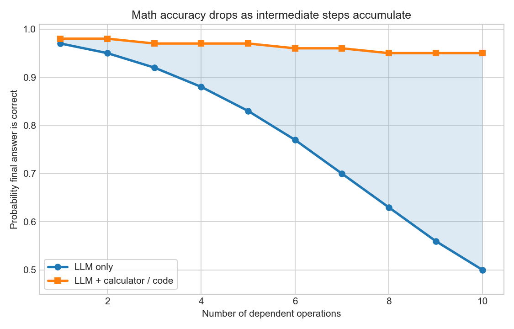
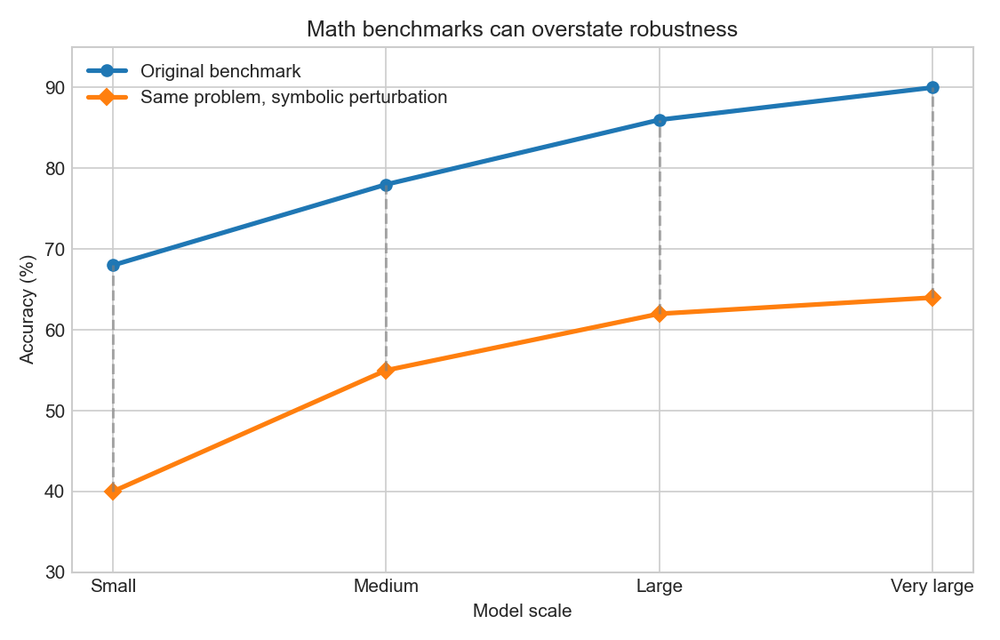
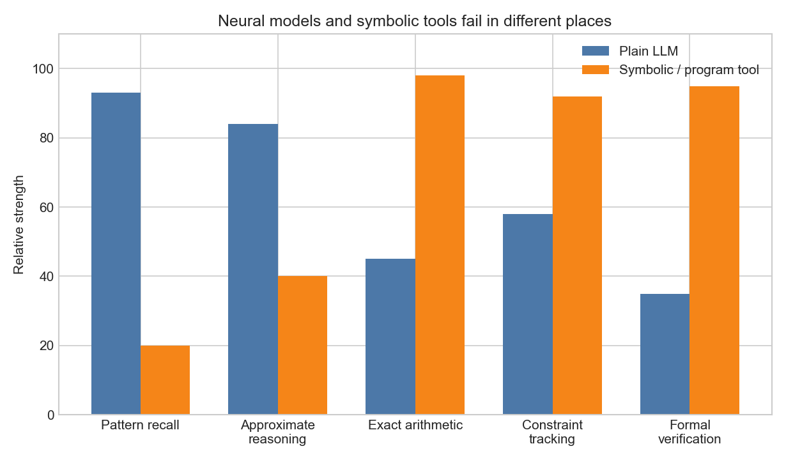
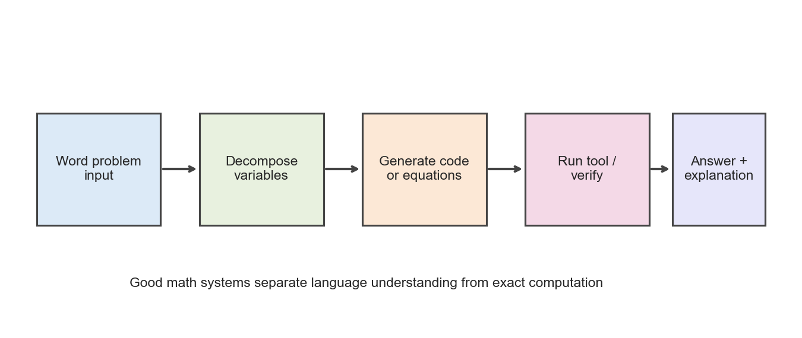

# Day 23: Math and Logic

> **Core Question**: Why do language models that sound smart still make silly mistakes in math and logic, and what actually fixes the problem?

---

## Opening

One of the strangest things about LLMs is that they can explain Bayes' rule, summarize a research paper, and write elegant Python, then immediately fail at a grade-school word problem because they dropped a minus sign.

That feels absurd. If a model can discuss abstract algebra, why can it not reliably count the number of `r` characters in *strawberry*? If it can explain dynamic programming, why does it sometimes collapse on a simple scheduling puzzle?

The short answer is that fluent language and reliable symbolic reasoning are not the same skill. An LLM is trained to continue token sequences that look plausible. Math and logic often demand something harsher: exact state tracking, exact transformations, and exact verification. Natural language is forgiving. Symbolic problems are not. In prose, a slightly vague sentence can still sound fine. In algebra, one wrong intermediate token poisons the final result.

Think of it like the difference between giving a persuasive speech and balancing a spreadsheet. Both involve intelligence, but the second one punishes tiny errors much more aggressively. LLMs are naturally strong at the first kind of task and only partially strong at the second.

This is why the modern story of LLM reasoning is not just “train a bigger model.” It is also about when language modeling is enough, when it is not, and why tools such as code execution, calculators, theorem provers, and verifiers often matter more than yet another clever prompt.

In this article, we will unpack why math and logic are special, where LLMs fail, what benchmark gains do and do not mean, and how practical systems turn a brittle language model into a much more reliable reasoning pipeline.

---

## 1. Why math and logic are a special stress test

**One-sentence summary**: Math and logic expose weaknesses that natural language can hide, because they require exact intermediate states instead of merely plausible continuations.

A language model is optimized to predict the next token:

$$
\mathcal{L} = -\sum_{t=1}^{T} \log P(x_t \mid x_{1:t-1}).
$$

That objective is extremely powerful. It can absorb syntax, facts, style, code idioms, and even many latent algorithms. But the training objective does not explicitly say, “maintain a formally valid proof state” or “never lose track of a carry digit.” The model learns whatever internal machinery most reduces prediction loss on its training distribution.

That works surprisingly well for many tasks because language contains a lot of weak supervision for reasoning. Textbooks show derivations, code repositories show debugging patterns, and math forums show worked solutions. So the model learns that when a problem looks like type A, a certain sequence of steps often follows.

But math and logic are less forgiving than open-ended language generation for three reasons.

### 1.1 Local plausibility is not enough

A sentence can be locally plausible while still being slightly vague. Readers often forgive that. A proof step or arithmetic step cannot be only “kind of right.” If you multiply two numbers and make one carry mistake, the final answer is just wrong.


*Caption: As the number of dependent operations increases, one early mistake can cascade through the entire solution. Tool use keeps the curve much flatter.*

### 1.2 Intermediate state matters more than wording

Many logic tasks depend on hidden bookkeeping: which assumptions are still active, which constraints are binding, which objects refer to which entities. Humans often externalize that bookkeeping on paper. A plain LLM must compress it into activations and generated text. That is possible, but brittle.

### 1.3 Symbolic tasks are adversarial to approximation

Neural networks are excellent approximate learners. Symbolic reasoning is often an exact game. You either preserved the variable binding or you did not. You either respected the quantifier or you did not. This gap between approximate computation and exact symbolic manipulation is one of the central tensions in LLM reasoning.

This is why math and logic are such revealing tests. They are not the only form of intelligence, but they are unusually good at exposing whether the system truly maintained the right structure all the way through.

---

## 2. Why LLMs often look better at reasoning than they really are

**One-sentence summary**: Strong benchmark scores can reflect real progress, but they can also hide fragility because many tasks are solvable through learned templates plus a little scratchpad reasoning.

It would be a mistake to say LLMs are bad at math and logic. They are clearly much better than early models. Chain-of-Thought (CoT), self-consistency, program synthesis, and inference-time search all produce large gains on tasks like GSM8K, MATH, and coding benchmarks.

But it would be another mistake to read those gains as proof that the base model has become a robust symbolic reasoner.

Here is the subtle point: benchmark success can come from a mixture of abilities.

1. **Pattern retrieval**: recognizing that the problem resembles many examples seen during training.
2. **Partial abstraction**: learning reusable templates such as “define variables, form equations, solve.”
3. **Scratchpad execution**: using extra tokens to hold intermediate state.
4. **Answer selection**: sampling several reasoning paths and choosing the most frequent result.

All four are valuable. But only some of them correspond to stable, systematic reasoning under distribution shift.

Recent work on symbolic perturbations makes this especially clear. A model might solve a familiar word-problem template, then fail when the same underlying math is rewritten with different names, altered number ordering, or slightly changed irrelevant details. The surface story changed, but the abstract problem did not. If accuracy drops sharply, that tells us the model relied more on learned patterns than on invariant symbolic structure.


*Caption: Benchmark improvements are real, but robustness often falls more sharply when the same symbolic problem is rephrased or perturbed.*

Think of it like a student who aces the homework because they recognize the chapter pattern, then struggles when the exam asks the same concept in an unfamiliar form. The student did learn something, but not yet the fully portable abstraction.

So when people ask, “Can LLMs do math now?” the honest answer is: **often yes on the benchmark, not always yes in the abstract sense you actually want**.

---

## 3. The core failure modes in math and logic

**One-sentence summary**: The main failures are arithmetic drift, brittle variable binding, heuristic shortcuts, and weak verification.

Let us be concrete. What actually goes wrong?

### 3.1 Arithmetic drift

LLMs can simulate arithmetic procedures, but simulation is not the same as exact execution. Multi-digit arithmetic, modular arithmetic, and chained calculations remain fragile when done purely in natural language.

A useful mental model is that the model often knows **what algorithm should be used** without reliably carrying it out to the last digit. That is why prompting the model to write Python or call a calculator helps so much. The hard part is often not understanding the problem, but executing the exact computation.

### 3.2 Variable binding and reference confusion

Logic problems frequently require keeping track of who did what, which set contains which element, or which condition applies to which object. One pronoun slip or one swapped variable can silently corrupt the rest of the reasoning.

This is especially common in puzzles that look easy in prose but are structurally tight, like seating arrangements or truth-teller puzzles. The model may sound coherent while internally losing a binding.

### 3.3 Premature template matching

LLMs are rewarded for producing high-probability continuations. On hard tasks, that can lead to premature closure: the model spots a familiar pattern and jumps to the likely solution path before checking whether the fit is exact.

This is why “think step by step” helps. It slows the jump. It does not guarantee correctness, but it gives the model more opportunities to notice contradictions.

### 3.4 Weak self-checking

People often assume that if a model can answer a question, it can also verify the answer. Unfortunately, generating and verifying are not symmetric tasks. If the same biases produced the original mistake, the same model may simply bless the error with more confident wording.

A verifier helps most when it has a different inductive bias, different evidence, or access to an exact external tool.


*Caption: Plain LLMs are strong at semantic pattern recognition, while symbolic tools dominate exact arithmetic, formal constraint handling, and verification. Good systems combine both.*

### 3.5 Loss of global consistency

In long proofs or planning tasks, each local step may look sensible while the whole chain drifts away from the original constraints. This is one reason long-horizon logic remains hard. The model is good at producing coherent nearby text, but global symbolic consistency over many steps is more demanding.

---

## 4. Why tools help so much

**One-sentence summary**: Tools work because they let the LLM do what it is good at, language understanding and decomposition, while delegating exact execution to systems built for exactness.

This is the part that matters most for builders.

If you ask whether a plain LLM should internally perform every symbolic computation itself, I think the answer is usually no. That is not a philosophical insult. It is just good engineering.

A calculator is better at arithmetic. A SAT solver is better at formal constraints. SymPy is better at algebraic manipulation. A compiler and test suite are better at code verification.


*Caption: In reliable reasoning systems, the LLM handles interpretation and decomposition, while tools handle exact computation and checking.*

The modern pattern is therefore:

$$
\text{Reliable reasoning system} \approx \text{LLM} + \text{scratchpad} + \text{tool execution} + \text{verification}.
$$

That decomposition matters because it separates two very different problems.

- **Semantic interpretation**: What is the problem asking? Which variables matter? Which formula or algorithm is relevant?
- **Exact execution**: Once the structure is known, what is the exact answer?

Plain prose-based Chain-of-Thought asks the LLM to do both jobs in the same medium. Program-aided approaches such as PAL (Program-Aided Language Models) and PoT (Program of Thoughts) separate them more cleanly. The model translates the problem into code, then Python or a symbolic library executes the computation exactly.

That design often feels almost embarrassingly effective. It is like hiring a brilliant analyst who occasionally makes arithmetic mistakes, then giving them a spreadsheet instead of asking them to do all the sums in their head.

---

## 5. A small code example: use code as the exact calculator

**One-sentence summary**: For many “reasoning” tasks, the winning move is not deeper prose, but turning the problem into executable structure.

Here is a tiny example with SymPy. The LLM's job is to extract the equations correctly. The solver's job is to solve them exactly.

```python
# Solve a simple word-problem system with symbolic math.
import sympy as sp

# Suppose a problem says:
# "Alice bought 3 notebooks and 2 pens for $19.
#   Bob bought 2 notebooks and 5 pens for $21.
#   What is the price of one notebook and one pen?"
notebook, pen = sp.symbols('notebook pen', real=True)

sol = sp.solve(
    [
        sp.Eq(3 * notebook + 2 * pen, 19),
        sp.Eq(2 * notebook + 5 * pen, 21),
    ],
    [notebook, pen],
)

print(sol)
# {notebook: 53/11, pen: 25/11}
```

What should the LLM contribute here?

1. Identify that there are two unknowns.
2. Translate the story into equations.
3. Decide that symbolic solving is safer than free-form prose arithmetic.
4. Explain the result back to the user in natural language.

What should the LLM **not** insist on doing in prose if accuracy matters? The exact algebraic elimination itself.

This is an important shift in mindset. We do not need the model to be the calculator. We need it to know when to use one.

---

## 6. Math derivation [Optional]

This section is for readers who want a more formal picture.

Suppose a reasoning task requires a sequence of intermediate states $s_1, s_2, \ldots, s_n$ before producing answer $y$. A plain direct-answer model tries to learn:

$$
P(y \mid x).
$$

A Chain-of-Thought model instead exposes a textual trajectory $r = (r_1, \ldots, r_m)$ and effectively factors the process as:

$$
\begin{aligned}
P(y \mid x) &= \sum_r P(y, r \mid x) \\
             &= \sum_r P(y \mid r, x) P(r \mid x).
\end{aligned}
$$

Self-consistency approximates this marginalization by sampling multiple $r$ values and aggregating the final answers.

The trouble is that math correctness often behaves multiplicatively across steps. If each intermediate transformation is correct with probability $p$, and the solution requires $n$ dependent exact steps, then a crude approximation gives:

$$
P(\text{all steps correct}) \approx p^n.
$$

Even when $p$ is high, say $p = 0.95$, the full-chain reliability drops with depth:

$$
0.95^{10} \approx 0.60.
$$

That is the deeper reason tool use helps. External computation raises the effective per-step accuracy on the exact parts of the problem, so the end-to-end failure probability grows much more slowly.

---

## 7. Common misconceptions

**One-sentence summary**: The biggest misunderstandings come from treating math failures as proof of stupidity, or benchmark wins as proof that the problem is solved.

### ❌ “If the model fails arithmetic, it has no reasoning ability.”

Too strong. A model can show real decomposition, abstraction, and planning ability while still being bad at exact numeric execution.

### ❌ “Chain-of-Thought solves math reasoning.”

It helps, sometimes a lot, but it is not a magic wand. It provides more workspace and can expose mistakes, yet it does not guarantee faithful or exact reasoning.

### ❌ “Bigger models will eventually make tools unnecessary.”

Maybe for some narrow tasks, but in practical systems tools remain attractive because they are cheap, exact, auditable, and modular.

### ❌ “Benchmarks tell us whether the model truly understands math.”

Benchmarks reveal something useful, but not the whole story. Robustness under paraphrase, symbolic perturbation, and adversarial reformulation matters just as much.

---

## 8. Practical lessons for builders

**One-sentence summary**: Treat math and logic as routing problems, not just prompting problems.

If you are building with LLMs, here is the pragmatic playbook.

1. **Detect when exactness matters.** Tax, finance, scheduling, contracts, proofs, and production code all deserve stricter pipelines.
2. **Decompose first, execute second.** Let the model map language to structure, then call a tool.
3. **Prefer verifiable representations.** Code, equations, tables, JSON constraints, and tests are easier to check than prose.
4. **Use independent verification.** A different model, a symbolic solver, or an executable test is much safer than asking the same model to “double-check.”
5. **Measure robustness, not just average benchmark score.** Rephrase tasks, shuffle irrelevant details, and check whether the answer remains stable.

The deeper lesson is that math and logic are not embarrassing exceptions to the LLM story. They are clarifying cases. They teach us that intelligence in deployed systems is often **compositional**. The language model provides flexible understanding. External tools provide exactness. Verification provides trust.

That hybrid design is not a temporary hack. I suspect it is the long-term shape of reliable AI systems.

---

## 9. Further Reading

### Beginner
1. [Chain-of-Thought Prompting Elicits Reasoning in Large Language Models](https://arxiv.org/abs/2201.11903)  
   The paper that made “let's think step by step” a serious research direction.

2. [Self-Consistency Improves Chain of Thought Reasoning in Language Models](https://arxiv.org/abs/2203.11171)  
   Shows why sampling multiple reasoning paths can beat one greedy chain.

### Advanced
1. [Program-Aided Language Models (PAL)](https://arxiv.org/abs/2211.10435)  
   A clean example of separating natural-language interpretation from code execution.

2. [Program of Thoughts Prompting](https://arxiv.org/abs/2211.12588)  
   Pushes the idea that numerical reasoning becomes more reliable when computation is externalized.

3. [GSM-Symbolic: Understanding the Limitations of Mathematical Reasoning in Large Language Models](https://arxiv.org/abs/2410.05229)  
   A useful reminder that benchmark gains do not automatically imply robust symbolic reasoning.

### Papers
1. [Solving Quantitative Reasoning Problems with Language Models](https://arxiv.org/abs/2206.14858)
2. [Training Verifiers to Solve Math Word Problems](https://arxiv.org/abs/2110.14168)

---

## Reflection Questions

1. If a model gets the right math answer by writing code, should we say the model reasoned, or that the overall system reasoned?
2. Which matters more in production, faithful internal reasoning or reliable externally verified results?
3. How would you design a benchmark that distinguishes template matching from portable symbolic understanding?

---

## Summary

| Concept | One-line Explanation |
|---------|---------------------|
| Arithmetic drift | Small intermediate mistakes compound quickly in symbolic tasks. |
| Chain-of-Thought | Extra reasoning tokens create workspace, but not guaranteed correctness. |
| Tool use | External calculators, code, and solvers provide exact execution. |
| Verification | Reliability improves when answers are checked by independent mechanisms. |
| Robustness | High benchmark scores do not guarantee stable reasoning under reformulation. |

**Key Takeaway**: LLMs are not hopeless at math and logic, but they are not naturally trustworthy symbolic machines either. Their real strength is often problem interpretation, decomposition, and communication. When exactness matters, the winning design is usually hybrid: let the LLM understand the task, let tools execute the exact steps, and let verifiers decide whether the final answer deserves trust.

---

*Day 23 of 60 | LLM Fundamentals*  
*Word count: ~2640 | Reading time: ~17 minutes*