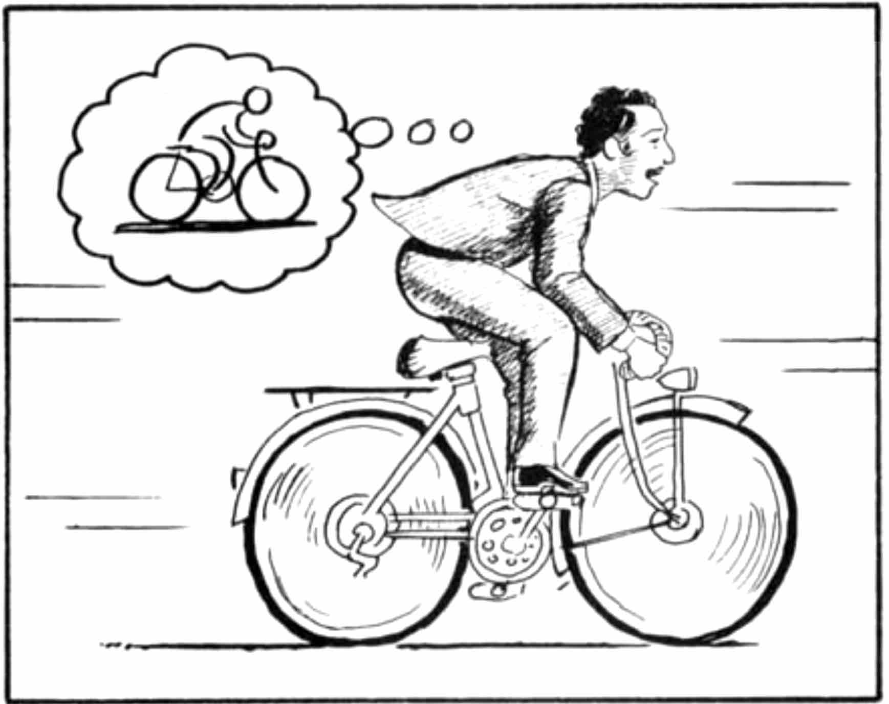
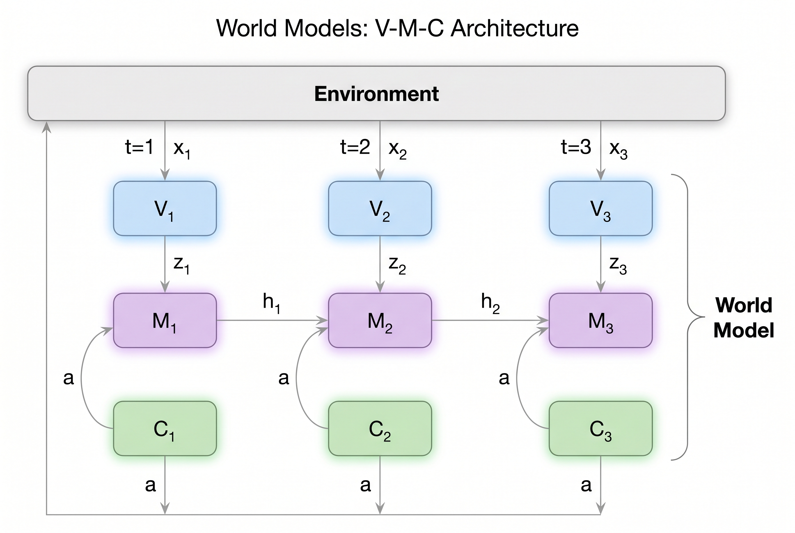

# Day 24: World Models — Learned Simulators of Reality

> **Core Question**: What does it mean for a system to *model* the world rather than merely describe it, and has this become the central architectural question in AI?

---

## Opening

A toddler who has never seen a physics textbook still knows that a ball rolling behind a sofa continues to exist. She can predict, roughly, where it will emerge. She has, in some sense, a *model* of object permanence and physical dynamics — not a symbolic one, not one she can articulate, but one that supports prediction and action.

The question of whether machine learning systems can acquire something analogous — an internal predictive model of how states of the world evolve under actions and time — has become one of the defining questions of the field. Not because it is new (control theorists and roboticists have studied state-space models for decades), but because two major research programs now converge on it from opposite directions. On one side, the reinforcement learning community has spent the last decade building increasingly sophisticated learned simulators — *world models* — that enable planning, imagination, and sample-efficient learning. On the other side, large language models trained on text alone appear, to some researchers, to have implicitly learned rich world structure through the proxy of next-token prediction.

The debate is not merely philosophical. If LLMs already contain latent world models, then scaling language modeling further may be the most direct path to general intelligence. If they do not — if there is a fundamental gap between modeling the distribution of text and modeling the dynamics of the world — then we may need explicit architectural commitments to world modeling, and the question becomes: what form should those commitments take?

This article treats world models as a rigorous research topic, not a buzzword. We trace the intellectual lineage from classical control to modern latent dynamics models, work through the actual mathematics of how they are trained, examine the architectural innovations that make them work, and then confront the hard question: how do learned world models compare to what LLMs implicitly acquire?

---

## 1. Academic Lineage: From State Estimation to Learned Simulators

### 1.1 Classical roots

The idea that an agent should maintain an internal model of its environment predates machine learning entirely. In classical control theory, a *state-space model* consists of:

$$s_{t+1} = f(s_t, a_t) + \epsilon_t, \quad o_t = g(s_t) + \eta_t$$

where $s_t$ is the (possibly partially observed) state, $a_t$ is a control input, $o_t$ is an observation, and $\epsilon_t, \eta_t$ are noise terms. The Kalman filter (Kalman, 1960) provides the optimal recursive estimator for linear-Gaussian instances of this model. The entire framework presumes that someone — an engineer — has specified $f$ and $g$ by hand.

**Understanding the Kalman filter.** The Kalman filter operates in two alternating steps. In the *predict* step, the previous state estimate is propagated forward through the dynamics model to produce a prior. In the *update* step, a new observation is used to correct this prior, producing a posterior. The fusion is controlled by the **Kalman gain**:

$$\hat{s}_{t|t} = \hat{s}_{t|t-1} + K_t\,(o_t - \hat{o}_{t|t-1})$$

Here $\hat{s}_{t|t-1}$ is the predicted state (prior), $\hat{s}_{t|t}$ is the corrected state (posterior), $o_t$ is the observation, and $\hat{o}_{t|t-1}$ is the predicted observation. The term $(o_t - \hat{o}_{t|t-1})$ is the *innovation* or residual — the gap between what the sensor reports and what the model expected. The Kalman gain $K_t$ is computed automatically from the covariance matrices: when the model's uncertainty is large relative to the sensor's, $K_t$ is large (trust the sensor more); when the sensor is noisy, $K_t$ is small (trust the model more). This is not a hyperparameter to tune — it falls out of the math.

**Why the linear-Gaussian assumption matters.** A natural question is: if we already have observations, why bother with predictions at all? There are several reasons. Observations are noisy (a GPS reading might be off by 10 meters), partial (a sensor gives position but not velocity), and sometimes missing entirely (GPS drops in a tunnel). The prediction step provides a principled prior that the update step then refines.

But the linear-Gaussian assumption is what makes the whole thing *tractable*. The key property is **closure under linear transformation**: if $x \sim \mathcal{N}(\mu, \Sigma)$ and $y = Ax + b$, then $y \sim \mathcal{N}(A\mu + b, A\Sigma A^\top)$. A Gaussian stays Gaussian after linear transformation. This means that throughout the entire predict-update cycle — linear transition, add Gaussian noise, observe with a linear sensor, add more Gaussian noise — the posterior distribution over the state remains Gaussian at every timestep. You only need to track two quantities: the mean and the covariance. Once the system is nonlinear or the noise is non-Gaussian, the posterior may become multi-modal or skewed, and no simple recursive formula exists — you must resort to approximations like extended Kalman filters, particle filters, or, in the modern deep learning setting, variational inference with neural networks. This is precisely the trajectory from classical control to modern world models.

### 1.2 Model-based reinforcement learning

The transition to *learned* models began in earnest with Sutton's Dyna architecture (Sutton, 1991). Dyna interleaves real experience with *simulated* experience: the agent learns both a value function and a one-step model $\hat{P}(s_{t+1} | s_t, a_t)$, then uses the model to generate imaginary rollouts for additional policy updates.

The idea is beautifully simple. In ordinary RL, the agent takes one step in the real environment, gets one experience tuple $(s_t, a_t, r_t, s_{t+1})$, and uses it to update the policy. One step, one lesson. Dyna adds a twist: **also learn a model of the environment, then practice against it for free**. Every real step improves the model; the improved model generates hundreds or thousands of simulated steps; the policy trains on all of them. Real experience is expensive (you must act in the world, risk failure, wait for feedback). Simulated experience is nearly free (just a forward pass through the model). The insight was fundamental: a model, even an imperfect one, can massively amplify the value of each real interaction.

Think of it like learning to drive. Each real driving lesson is costly and time-limited. But between lessons, you can close your eyes and mentally rehearse — what if the car in front brakes suddenly? What if the light turns yellow just as you approach? Your internal "driving simulator" is not perfect, but rehearsing against it makes every real lesson far more productive than it would be alone. Dyna formalizes exactly this intuition.

There is a catch, of course: if the model is inaccurate, training against its fantasies can produce a worse policy than doing nothing. This is why subsequent work focused heavily on improving model quality and managing model error.

Subsequent work tightened the loop. PILCO (Deisenroth & Rasmussen, 2011) used Gaussian processes as forward models, propagating uncertainty through predicted trajectories to achieve remarkable sample efficiency on low-dimensional control tasks. PETS (Chua et al., 2018) replaced GPs with ensembles of probabilistic neural networks, scaling to higher dimensions while retaining uncertainty-aware planning via model-predictive control (MPC).

### 1.3 Ha & Schmidhuber (2018): The turning point

The paper simply titled *World Models* (Ha & Schmidhuber, 2018) reframed the conversation for the deep learning era. Their system had three components: a VAE encoder compressing visual observations into latent vectors; an MDN-RNN predicting the next latent state given the current latent state and action; and a small controller mapping latent states to actions. The key result was that the controller could be trained *entirely inside the model's own dreams* — hallucinated trajectories sampled from the learned dynamics — and then transferred to the real environment.

The paper opens with an evocative metaphor:


*Figure: An agent riding a bicycle while imagining itself doing a wheelie — intelligence as mental simulation. The paper's core thesis is that an agent can learn to act not by reacting to raw sensory input, but by building an internal model of the world and practicing inside it.*

Their architecture has three modules, which they call **V**, **M**, and **C**:



**Diagram legend:**
- **x₁, x₂, x₃** — Observations (raw pixel frames from the environment)
- **V₁, V₂, V₃** — Vision module (VAE encoder), compresses high-dimensional pixels into low-dimensional latent vectors
- **z₁, z₂, z₃** — Latent codes (output of V), e.g. a 32-dim vector summarizing a 64×64 image
- **M₁, M₂, M₃** — Memory module (MDN-RNN), predicts future latent states given past latents, hidden states, and actions
- **h₁, h₂** — Hidden states (RNN memory), compress past experience into a vector that flows between timesteps
- **C₁, C₂, C₃** — Controller, decides what action to take based on current z (what you see) and h (what you remember)
- **a** — Action, output of C, sent back to the environment and also fed into M (because M needs to know what action was taken to predict the next state — different actions lead to different futures)
- **World Model** — V + M together form the "world model", handling perception and prediction

**Data flow in one sentence:** Environment produces observation x → V compresses it to z → M combines z, h, and action a to predict the future → C uses z and h to choose action a → action goes back to environment → cycle repeats.

The VAE (**V**) learns to compress high-dimensional game frames into a small latent vector, preserving enough task-relevant structure for control:


*Figure: Original game frames (left), latent representation (center), and VAE reconstruction (right). The reconstructions are blurry but preserve the essential scene structure — road shape, obstacles, vehicle position — which is what the downstream controller actually needs.*

The MDN-RNN (**M**) can then generate entire dream trajectories that look plausible enough to train a controller:


*Figure: Frames generated entirely by the world model's "dream" — the MDN-RNN hallucinates plausible game scenarios from its learned latent dynamics. The controller can be trained inside this dream and then deployed in the real environment.*

This was vivid but architecturally limited. The VAE and RNN were trained separately, the latent space was purely stochastic with no deterministic path, and there was no variational inference over full sequences. But the conceptual impact was enormous: it showed that a learned simulator could replace a hand-engineered one, and that policies trained in imagination could work in reality.

### 1.4 Dreamer: Recurrent State-Space Models

The Dreamer line of work (Hafner et al., 2020; 2023) represents the current state of the art in learned world models for control. The core innovation is the **Recurrent State-Space Model (RSSM)**, which combines a deterministic recurrent path with a stochastic latent path.

#### Intuition: how Dreamer differs from the original World Models

Think of the original Ha & Schmidhuber system as learning to drive by taking three separate classes: first a vision class (train your eyes), then an imagination class (train your mental simulator), then a driving class (train your hands and feet). Each class is independent — you don't improve your imagination based on what helps you steer.

Dreamer says: **train everything together**. The vision, imagination, and control all improve in coordination, because they share a single training objective. There are three key improvements:

**1. End-to-end training.** Instead of training V, M, and C separately, Dreamer optimizes the entire world model jointly via variational inference. The encoder, dynamics model, and reward predictor all learn from the same loss function. This means the components evolve to work well *together*, rather than being individually good but poorly coordinated.

**2. Dual-path state (deterministic + stochastic).** The original World Models had only stochastic imagination — each imagined future was different, which made it unstable. Dreamer adds a deterministic recurrent path (a GRU) alongside the stochastic path. Think of it as having two parts of your brain:
- The **deterministic part** remembers facts: "I've driven 3 km and passed two traffic lights." This is stable, long-term memory.
- The **stochastic part** handles uncertainty: "That blurry shape ahead might be a pedestrian or a trash can." This captures what you're unsure about.

Using both together gives you reliable memory *and* calibrated uncertainty — much like how the Kalman filter combines model prediction with observation.

**3. Gradients through imagination.** The original World Models trained its controller with evolutionary algorithms (essentially random trial-and-error), which is slow. Dreamer instead imagines a trajectory, evaluates it, and **backpropagates gradients directly through the imagined future** to improve the policy. Because the entire imagination pipeline is made of differentiable neural networks, the model can precisely calculate "if I had steered 2 degrees more, the outcome would have been X better" — and adjust accordingly. This is dramatically more efficient than blind trial-and-error.

#### The math behind it

The update rules for the dual-path state are:

$$h_t = \text{GRU}(h_{t-1},\, s_{t-1},\, a_{t-1})$$

This is the deterministic recurrence — propagating memory forward. Then the stochastic state is inferred from the current observation:

$$s_t \sim q_\theta(s_t \,|\, h_t,\, o_t)$$

This is the **posterior** — what the model believes the current state is, after seeing the observation. During imagination (no real observation available), the model uses a **prior** instead:

$$\hat{s}_t \sim p_\theta(s_t \,|\, h_t)$$

The world model is trained to make the prior match the posterior as closely as possible (via a KL divergence loss), so it can imagine realistic futures without needing real observations.


*Figure: The RSSM architecture. Green boxes are deterministic recurrent states (h). Each timestep has a prior and a posterior stochastic state connected by a KL loss. Observations are encoded from below; reconstructed observations and predicted rewards are produced above. The latent state uses 32 categorical variables, each with 32 classes.*

Once the world model is trained, Dreamer learns a policy and value function entirely inside the model's imagination:


*Figure: **Left panel**: World model learning — observations are encoded into stochastic latents, propagated through recurrent dynamics, and reconstructed. **Right panel**: Actor-critic learning in imagination — starting from a real encoded state, the actor proposes actions, the world model predicts future latent states, and the critic evaluates them. Gradients backpropagate through the entire imagined trajectory.*

**In one sentence:** The original World Models was three separately-trained modules bolted together; Dreamer is an end-to-end trained system with dual-path states (deterministic memory + stochastic uncertainty) that trains its policy by backpropagating gradients through imagined futures. Same core idea — learn a world model, then train inside it — but with three engineering innovations that make it actually work well across diverse tasks.

#### From DreamerV2 to DreamerV3

**DreamerV2 (2021)** proved that world models can compete with the best methods.

Its main innovation was replacing continuous Gaussian latent variables with **discrete categorical latents** — 32 categorical variables, each with 32 classes. Think of it like this: DreamerV1 described "what's on the road" using continuous numbers ("obstacle at approximately 23.7°"), while DreamerV2 switched to discrete categories ("obstacle type A / type B / type C..."). Like going from "describe the color with a decimal number" to "pick from 32 color cards."

Why does this matter? Many real-world states are inherently discrete — "the door is open or closed," "the enemy is alive or dead." Using continuous numbers to represent discrete states is like measuring a light switch with a ruler — it works, but awkwardly. With categorical latents, DreamerV2 was the first world model to match or beat the strongest model-free methods on Atari games, proving that world models are not just theoretical toys.

**But DreamerV2 had a practical problem:** every game needed its own hyperparameter tuning. Switch to a different game, and you'd need to re-tune learning rates, KL weights, imagination horizon, etc. — like retuning your car's engine every time you switch to a different racetrack.

**DreamerV3 (2023)** proved that world models can work everywhere without tuning.

Its core contribution: **a single fixed hyperparameter configuration achieves state-of-the-art across 150+ diverse benchmarks** — including continuous control (robot locomotion, robotic arm grasping), discrete control (Atari games), 3D navigation (Minecraft diamond challenge), and competitive games (racing, pinball).

How? Several engineering improvements:
1. **Robust loss normalization**: each loss term is normalized so no single loss dominates the others. Like a choir where no one singer drowns out the rest.
2. **Stable training**: exponential moving average updates for target networks, keeping training smooth.
3. **Smarter imagination starting points**: instead of imagining from random states, DreamerV3 starts from real experience in the replay buffer.

**One-sentence summary:** DreamerV2 proved "world models can be strong"; DreamerV3 proved "world models can work everywhere without tuning." It turned world models from a research method into a ready-to-use tool.

### 1.5 LeCun's JEPA and beyond

Yann LeCun's Joint-Embedding Predictive Architecture (JEPA) proposal (LeCun, 2022) reframes world modeling away from pixel-level reconstruction. A JEPA predicts the *representation* of the next state rather than the next observation itself:

$$z_{t+1} = P_\theta(z_t, a_t)$$

where $z_t = \text{Enc}(o_t)$ and the predictor $P_\theta$ operates in embedding space. A critic network enforces that predicted embeddings lie on the manifold of valid representations, replacing reconstruction with a consistency constraint. The motivation is clear: much of what we perceive is irrelevant to planning, and forcing a model to reconstruct pixels wastes capacity on details that do not matter for decision-making.

#### Intuition: how JEPA differs from Ha & Schmidhuber's M

Both Ha & Schmidhuber's M (MDN-RNN) and JEPA learn and predict in latent space. The key difference is **what they predict and whether they reconstruct observations**.

**Ha & Schmidhuber's M:** Given the current latent state z and action a, predict the next latent state z'. Then **reconstruct the pixel frame** from z' — the model must learn to "paint" what the next frame looks like, including road texture, sky color, grass shading, everything.

**JEPA:** Given the current embedding z and action a, predict the next embedding z'. **Never go back to pixels.** The model only needs to know where the next state sits in abstract representation space — not what it looks like.

The driving analogy: imagine you're driving and need to predict the road ahead.
- **Ha's M** is like closing your eyes and **fully visualizing** the next second — the blue sky, the gray road, a tree on the left, a car on the right. Every frame is a complete "painting" in your mind.
- **JEPA** is like just judging "the road ahead is safe" or "the road ahead is dangerous" — you don't need to visualize the sky color or what the trees look like. Those details are irrelevant to your decision.

LeCun argues JEPA is better for two reasons:
1. **Efficiency**: forcing the model to reconstruct pixels wastes massive computation on details that don't affect decisions. Like forcing a chess player to visualize the wood grain of the board before every move — the grain doesn't matter.
2. **Better abstractions**: when you only require the model to "paint" the next frame, it can take shortcuts — memorizing surface patterns instead of understanding underlying structure. When you require prediction in abstract space, the model is forced to learn representations that actually matter.

**In one sentence:** Ha's M predicts in latent space but must reconstruct pixels ("paint the picture"); JEPA predicts in latent space and never goes back to pixels ("understand, don't paint"). LeCun believes forcing observation reconstruction wastes computation and hinders learning truly useful abstractions.

The trajectory is clear: **hand-crafted simulators → learned dynamics with fixed representations → end-to-end learned latent simulators → prediction in abstract embedding spaces**. Each step trades generality for efficiency, and the current frontier asks whether this progression can merge with the capabilities of large-scale foundation models.

---

## 2. Core Formulation: Variational Inference over Latent Dynamics

This section gets into the math. The equations look intimidating, but every one of them answers a concrete question. Think of a world model as a *recipe that can produce realistic game playthroughs*: given a starting state and a sequence of actions, it can hallucinate what you'd see, what reward you'd get, and how the scene would evolve. The math below is just a precise way of writing down that recipe.

### 2.1 The generative model

#### Intuition: a recipe for simulated experience

Imagine you have a video game engine in your head. At every moment, three things happen:
1. The world changes from one state to the next based on what you did (**transition**)
2. You see a picture of the new state (**observation / decoder**)
3. You get a score telling you how well you're doing (**reward**)

A generative model writes this down as a probability distribution. For a sequence of observations $o_{1:T}$, actions $a_{1:T}$, and rewards $r_{1:T}$, the model factorizes as:

$$p_\theta(o_{1:T}, r_{1:T}, s_{1:T} | a_{1:T}) = \prod_{t=1}^{T} \underbrace{p_\theta(o_t | s_t)}_{\text{decoder}} \, \underbrace{p_\theta(r_t | s_t)}_{\text{reward}} \, \underbrace{p_\theta(s_t | s_{t-1}, a_{t-1})}_{\text{transition}}$$

Each factor answers one question:

| Factor | Question it answers | Plain English |
|--------|---------------------|---------------|
| $p_\theta(s_t \mid s_{t-1}, a_{t-1})$ | Transition | "If I was in this state and took this action, where would I end up?" |
| $p_\theta(o_t \mid s_t)$ | Decoder | "If the state is this, what would I see on screen?" |
| $p_\theta(r_t \mid s_t)$ | Reward | "If the state is this, how many points would I get?" |

For the RSSM (Dreamer's architecture), the transition factor further splits: the deterministic recurrent state $h_t$ is computed first, then the stochastic state $s_t$ is drawn from a prior $p_\theta(s_t \mid h_t)$ conditioned on it.

### 2.2 Training via the ELBO

#### Intuition: why we can't just compute the answer directly

The ideal training objective would be: "find the parameters $\theta$ that maximize the probability of the observed data." That means computing the true posterior $p(s_{1:T} \mid o_{1:T}, a_{1:T})$ — the exact distribution over all possible latent state sequences that could explain what we observed.

**The problem:** this requires integrating over *all possible* latent sequences $s_{1:T}$. The latent space is high-dimensional, the sequence is long, and the integral is intractable. It's like a detective trying to consider every possible explanation of a crime scene simultaneously — infinitely many theories, no way to enumerate them all.

**The solution:** instead of finding the *perfect* explanation, we train a neural network (the encoder) to produce a *good enough* approximation. We call this the **approximate posterior** $q_\theta(s_t \mid h_t, o_t)$ — the encoder's best guess at the latent state, given the observation and the deterministic context.

We then maximize the **Evidence Lower Bound (ELBO)** — a conservative estimate of how well the model explains the data:

$$\mathcal{L} = \underbrace{\mathbb{E}_{q(s_{1:T})} \left[ \sum_{t=1}^{T} \left( \log p_\theta(o_t | s_t) + \log p_\theta(r_t | s_t) \right) \right]}_{\text{"Does my summary explain the evidence?"}} - \underbrace{\sum_{t=1}^{T} \text{KL}\left( q_\theta(s_t | h_t, o_t) \, \| \, p_\theta(s_t | h_t) \right)}_{\text{"Does my summary stay reasonable?"}}$$

Let's unpack the three terms:

- **Reconstruction**: "Given my summary of the current state, can I recreate what I actually saw?" If the summary is good, the reconstructed image should match the original. Mathematically $\log p_\theta(o_t \mid s_t)$.

- **Reward prediction**: "Given my summary, can I predict what reward I got?" This forces the summary to retain task-relevant information — not just visual detail, but *what matters for the game*. Mathematically $\log p_\theta(r_t \mid s_t)$.

- **KL regularization**: "Given my summary after looking at the evidence, is it still close to what I would have guessed *before* looking?" This prevents cheating — the encoder can't just copy the raw observation into the latent state. It has to produce a summary that's consistent with the dynamics the model has learned. Mathematically a KL divergence.

Think of it like writing a book report:
- **Reconstruction** = "Can you describe the scene from your notes?" (accuracy)
- **Reward prediction** = "Can you identify the key plot points?" (relevance)
- **KL** = "Are your notes concise, or did you just photocopy the whole book?" (parsimony)

This is *not* simply "predict the next state." It is approximate Bayesian inference: the model maintains a *belief* over latent states, updated by observations via the encoder and regularized by the learned dynamics. The KL term is what makes this a principled probabilistic model rather than a deterministic autoencoder with a prediction head.

### 2.3 Deterministic vs. stochastic: why RSSM matters

#### Intuition: your diary vs. your guesses

Imagine you're writing two things every day:
- A **diary** (deterministic): "Drove 50 km. Stopped at 3 red lights. Bought groceries." These are facts — stable, reliable, no ambiguity.
- A **prediction journal** (stochastic): "Tomorrow it might rain (60%) or be sunny (40%)." These are guesses — uncertain, probabilistic, might change.

Earlier world models (Ha & Schmidhuber, 2018) kept *only* the prediction journal — pure stochastic state. This caused two problems:

1. **Noisy gradients.** Every time you sample from a stochastic distribution, you get a slightly different result. Backpropagating through these samples is like trying to follow a path that shifts under your feet. Training becomes unstable.
2. **Forgetting over long horizons.** Stochastic state is resampled every step. Over 100 steps, the chain of samples drifts further and further from reality — like playing telephone, where each person whispers something slightly different.

The RSSM's fix: add the diary alongside the prediction journal. The **deterministic path** $h_t = f(h_{t-1}, s_{t-1}, a_{t-1})$ uses a GRU to maintain stable, flowing memory across time. The **stochastic state** $s_t$ only needs to capture *what is uncertain* about the current moment, conditioned on that stable context.

This mirrors the Kalman filter, which maintains two things simultaneously:
- A **mean** (best guess — like the deterministic path)
- A **covariance** (uncertainty — like the stochastic path)

Having both gives you reliable memory *and* calibrated uncertainty. Pure deterministic would miss surprises; pure stochastic would forget the past. Together, they're powerful.

### 2.4 The full Dreamer-style loss

#### Intuition: four volume knobs

In practice, DreamerV3 optimizes:

$$\mathcal{L}_{\text{world}} = \mathbb{E}_q \left[ \sum_t \underbrace{\beta_o \log p(o_t|s_t)}_{\text{reconstruction}} + \underbrace{\beta_r \log p(r_t|s_t)}_{\text{reward}} + \underbrace{\beta_c \log p(\text{cont}_t|s_t)}_{\text{continuation}} \right] - \underbrace{\beta_{\text{kl}} \sum_t \text{KL}(q_t \| p_t)}_{\text{regularization}}$$

Each $\beta$ is a **volume knob** controlling how much that term matters:

| Knob | Controls | Too high → | Too low → |
|------|----------|------------|----------|
| $\beta_o$ | How much the latent state must reconstruct pixels | Wastes capacity on visual detail | Latent might lose scene info |
| $\beta_r$ | How much the latent state must predict reward | Overfits to reward, ignores dynamics | Agent doesn't learn what's good |
| $\beta_c$ | How much the latent state must predict episode continuation | Over-focuses on "am I dead", squeezing out other important info | Agent can't plan episode endings |
| $\beta_{\text{kl}}$ | How much the posterior must stay close to the prior | Posterior is too generic (underfitting) | Posterior copies observations (overfitting) |

**What's new in DreamerV3** compared to earlier versions:

- **Continuation flag** `cont_t` : a small predictor that answers "is the episode still going?" This matters because the agent needs to know when a trajectory ends — dying in a game is very different from surviving.
- **Symlog predictions**: instead of assuming rewards are Gaussian (they're often skewed or have huge outliers), DreamerV3 applies a symmetric log transform. This lets a single network handle both tiny rewards (+0.01) and huge ones (+1000) gracefully.
- **Discrete latents**: instead of continuous Gaussian variables, DreamerV3 uses 32 categorical variables each with 32 classes. This matches the structure of many real-world states ("door is open *or* closed", not "door is 0.73 open") and makes the KL term more stable to compute.

---

## 3. Architecture Deep Dive


*A world model architecture: encoder maps observations to latent states; the RSSM maintains deterministic and stochastic state paths; reward and continuation heads predict task signals; a decoder optionally reconstructs observations.*

### 3.1 Encoder

#### Intuition: your eyes compressing the world

When you walk into a room, you don't memorize every pixel of what you see. Your eyes and visual cortex compress the raw sensory input into a *mental impression* — you notice "there's a table with a laptop on it, near a window." The encoder does exactly this: it takes a high-dimensional observation (a 64×64 RGB image = 12,288 numbers) and compresses it into a compact latent representation.

**What it actually does:** A shallow CNN processes the image through a few convolutional layers, then a linear layer produces *logits* for a categorical distribution. In DreamerV3, the output is a $32 \times 32$ grid — 32 independent categorical variables, each choosing among 32 classes. Think of it as 32 multiple-choice questions, each with 32 possible answers, collectively describing "what's in this frame."

Why condition on the deterministic state $h_t$? Because the encoder shouldn't start from scratch each frame. If your deterministic memory says "you're in a car racing game," the encoder should use that context to interpret ambiguous pixels — the same brown blob could be a rock in a racing game or a tree in an adventure game.

Alternatives include continuous Gaussian latents (DreamerV1), VQ-VAE discretization, or patch-based encoders borrowed from vision transformers.

### 3.2 Transition model (RSSM)

#### Intuition: prior vs. posterior — what you expected vs. what you saw

This is the heart of the system. At each timestep, four things happen in sequence:

**Step 1 — Deterministic update** (update the diary):
$$h_t = \text{GRU}(h_{t-1}, \text{concat}(s_{t-1}, a_{t-1}))$$
The GRU takes the previous deterministic state, the previous stochastic state, and the last action, and produces the new deterministic state. This is the stable memory flowing forward — "I was here, I did that, now I'm here."

**Step 2 — Prior** (guess before looking):
$$p_\theta(s_t \mid h_t)$$
Based solely on the deterministic state, the model makes its best guess about what the stochastic state should be. This is the *prior* — "what I expected before opening my eyes." If the model has learned good dynamics, this guess should be pretty close to reality.

**Step 3 — Posterior** (look and correct):
$$q_\theta(s_t \mid h_t, o_t)$$
Now the encoder looks at the actual observation and produces an updated estimate. This is the *posterior* — "what I think after opening my eyes." If the prior was good, the posterior barely adjusts. If something surprising happened, the posterior shifts noticeably.

**Step 4 — KL divergence** (measure surprise):
$$\text{KL}(q_\theta \| p_\theta)$$
The KL divergence between prior and posterior measures how *surprised* the model was by the observation. Small KL → "I expected this." Large KL → "I didn't see that coming." This signal drives learning: the model trains to make its priors more accurate so surprises shrink.

**During imagination** (no real observation available), Steps 3 and 4 are skipped — the prior *becomes* the state. This is what lets the model roll forward in time without any grounding, dreaming up plausible futures.

### 3.3 Reward and continuation heads

These are simple small MLPs (2-3 layers) that sit on top of the latent state $(h_t, s_t)$ and answer two practical questions:

- **Reward head:** "How good is this state?" — predicts the scalar reward $\hat{r}_t$. This is what tells the agent which imagined futures are worth pursuing.
- **Continuation head:** "Is the episode still going?" — predicts a binary flag (1 = continue, 0 = game over). This matters because reaching a terminal state is qualitatively different from surviving — the agent needs to learn to avoid death, not just chase reward.

Both heads are trained as part of the world model loss (see Section 2.4). They're small but critical: without the reward head, the agent has no direction; without the continuation head, it can't distinguish between "I won" and "I died."

### 3.4 Decoder

#### Intuition: why it exists and why some people hate it

The decoder reconstructs the original observation $o_t$ from the latent state $s_t$. It's essentially running the encoder in reverse — taking the compressed mental impression and painting it back into pixels.

**Why it exists:** The decoder acts as a *regularizer*. Without it, the latent state could collapse to something trivial — just encoding the reward and nothing else. The reconstruction loss forces the latent to retain rich information about the scene. Think of it as a quality check: "If I can reconstruct the image from my summary, my summary must be pretty detailed."

**Why some researchers think it shouldn't exist:** LeCun's JEPA argument (Section 1.5) says forcing the model to reconstruct pixels wastes capacity on irrelevant details. Do you really need to remember the exact shade of the sky to decide whether to brake? The model could be spending those parameters on learning better dynamics instead.

**DreamerV3's compromise:** Keep the decoder, but turn its volume knob down. The weight $\beta_o$ on reconstruction loss is small — enough to prevent collapse, but not so large that the model wastes capacity on pixel-perfect reconstruction. It's a pragmatic middle ground.

### 3.5 Planner / Policy

#### Intuition: learning to act in your dreams

Once the world model is trained, it becomes a *simulator* the agent can practice in. There are two main approaches to using it:

**Approach 1: Learned policy (Dreamer's actor-critic)**

Dreamer trains a separate actor network and critic network that operate *entirely in latent space*:

1. Start from a real encoded state
2. The **actor** proposes an action; the world model imagines forward one step
3. Repeat for $H$ steps to produce an imagined trajectory
4. The **reward head** scores each step; the **critic** estimates long-term value
5. Gradients backpropagate through the entire imagined trajectory to improve the actor and critic

This is like a golf player mentally rehearsing a swing 50 times, each time adjusting slightly based on imagined outcomes, then stepping up to the ball with an optimized motion. The key insight: because the world model is differentiable, the agent can calculate exactly how a small change in action would ripple through the imagined future.

**Approach 2: Online planning (CEM / MPC)**

Instead of a learned policy, you can use **sampling-based planning**: generate many candidate action sequences, simulate each one through the world model, pick the best, execute the first action, then replan. This is Cross-Entropy Method (CEM) or Model-Predictive Control (MPC).

Imagine throwing 100 darts at a board, seeing where they land, then aiming at the cluster closest to the bullseye. You don't need a pre-trained throwing policy — just evaluate many options and pick the winner.

**The tradeoff:**

| | Learned policy (Dreamer) | Online planning (CEM/MPC) |
|---|---|---|
| **Speed** | Fast at inference (one forward pass) | Slow (must simulate many trajectories) |
| **Adaptability** | Needs training; fixed after training | Adapts online to new situations |
| **Quality** | Limited by training | Can find better solutions given enough compute |
| **Use case** | Real-time control (robotics, games) | Offline or slow decision-making |

Dreamer uses the learned policy approach for efficiency — once trained, the actor can choose actions in a single forward pass, making it fast enough for real-time control.

---

## 4. What World Models Buy You That LLMs Don't


*Comparing the training objectives: next-token cross-entropy vs state-transition ELBO.*

The "word model vs world model" framing is catchy but shallow. The real differences are structural and run far deeper than a pun. Here is a systematic comparison across six dimensions:

| Dimension | World Model | LLM | Why it matters |
|---|---|---|---|
| **Training objective** | Generative: ELBO over latent states, reconstructing observations and predicting rewards | Discriminative: next-token cross-entropy | World models learn *what the state IS*; LLMs learn *what word comes NEXT*. Different targets → different capabilities. |
| **Information source** | Raw sensorimotor data (pixels, joint angles, point clouds) | Compressed language (text) | Language is a lossy bottleneck — "the cat knocked the vase off the table" discards trajectories, masses, friction. World models see the full signal. |
| **Action conditioning** | Core of architecture: transition takes $(s_t, a_t)$ as input, predicts "what happens IF I do this" | Incidental via text ("I moved the knight to e4") | Planning requires answering "what if?" — world models are built for counterfactuals; LLMs have no architectural mechanism for it. |
| **State persistence** | Explicit latent state via RSSM: h_t is a sufficient statistic for history | No explicit state — history reconstructed from context window | Works within context window but degrades catastrophically beyond it. World models maintain belief indefinitely. |
| **Compounding error** | KL regularization + deterministic paths + short imagination horizons | No analogous mechanism — conditions on own outputs, errors and all | World models have built-in error correction; LLM chain-of-thought accumulates errors with no regularization. |
| **Uncertainty** | Stochastic latent captures epistemic uncertainty (broad posterior = "I don't know") | Token probabilities reflect text distribution, not world-state uncertainty | World models can signal "I'm unsure" in novel situations; LLM confidence is poorly calibrated for state estimation. |

### Training objective in detail

An LLM minimizes cross-entropy on next-token prediction:

$$\mathcal{L}_{\text{LM}} = -\sum_{t=1}^{T} \log p_\theta(x_t \mid x_{<t})$$

A world model maximizes the ELBO over latent state sequences:

$$\mathcal{L}_{\text{WM}} = \mathbb{E}_q \left[ \sum_t \log p(o_t \mid s_t) + \log p(r_t \mid s_t) \right] - \text{KL}(q \parallel p)$$

The LLM loss asks: "which token follows?" The world model loss asks: "what is the latent state, and does it coherently explain observations, rewards, and dynamics?" The ELBO enforces that the latent space has consistent geometry — states close in latent space produce similar futures. No token-level objective guarantees this.

### Information bottleneck: why text is not enough

Language is a *lossy, observational channel* for world state. When a text describes "the cat knocked the vase off the table," it compresses a high-dimensional physical event — trajectories, masses, friction, glass fragments — into a handful of tokens. Training on text means your signal about world dynamics passes through this bottleneck. A world model trains on raw sensorimotor data that preserves the full information content of the interaction.

### Action conditioning: the "what if" question

World models are built around counterfactuals. The transition function *must* predict what happens *if* the agent takes action $a_t$. This is the core of planning. LLMs receive action information only incidentally through text — there is no architectural mechanism that forces an LLM to maintain counterfactual state estimates under different action sequences.

### Why the other dimensions matter

- **State persistence**: the RSSM's $h_t$ is a deterministic function of the entire history. LLMs have no explicit state variable — the KV cache is a surrogate, not a principled belief state.
- **Compounding error**: world models use KL regularization, deterministic paths, and short imagination horizons to control error accumulation. LLMs have no analogous mechanism.
- **Uncertainty**: the stochastic latent provides epistemic uncertainty — when the model is in a novel situation, the posterior is broad and the KL is large. This signal drives exploration and risk-aware planning. LLM token probabilities reflect text distribution, not world-state uncertainty.

---

## 5. Where LLMs Genuinely Compete

Despite these structural advantages, dismissing LLMs as "merely word models" would be a mistake. Several lines of evidence suggest that LLMs acquire something like world structure through scale.

### 5.1 Emergent world modeling from scale

Probing studies have shown that LLM internal representations encode surprisingly rich structure. OthelloGPT (Li et al., 2023) demonstrated that a GPT-2 model trained only on Othello game transcripts develops internal representations that linearly encode the board state — despite never seeing the board. The model learned to maintain a world state because predicting the next move *requires* it, and the training distribution is clean enough that the signal is recoverable.

Similar findings have emerged for spatial reasoning (reading comprehension tasks that implicitly require spatial maps), temporal reasoning (tracking event sequences), and causal reasoning (identifying causal direction from correlational text).

### 5.2 Text as a surprisingly rich training signal

Text is not just a lossy compression of the world — it is a *highly curated* compression produced by intelligent agents who highlight causal, temporal, and spatial structure. A physics textbook, a news report, and a novel all encode world dynamics, just at different levels of abstraction. At sufficient scale, the statistical structure of text may be rich enough that a model trained to predict it *must* learn world structure as an intermediate representation — because doing so is the most efficient way to compress the training distribution.

### 5.3 The "latent world model" argument

The argument, stated formally: if $P(x_t | x_{<t})$ depends on some latent world state $s_t$, and the text distribution is rich enough that $s_t$ is (approximately) identifiable from $x_{<t}$, then the LLM's internal representation at layer $l$, position $t$, must encode something functionally similar to $s_t$ — because that is the most parameter-efficient way to implement the conditional distribution.

This is a plausible but unproven argument. The key question is *identifiability*: is the world state sufficiently determined by the text? In many domains (games, formal reasoning, simple physical scenarios), yes. In open-ended, partially observed, embodied settings — almost certainly not, or at least not without massive redundancy.

### 5.4 Limitations

The strongest counterarguments:

- **Coverage**: Text does not cover all states the agent may encounter, especially novel physical configurations.
- **Granularity**: Text describes the world at the level of objects, events, and relations, not at the level of continuous dynamics needed for control.
- **Action grounding**: Text describes actions after the fact; it does not provide the counterfactual experience of trying actions and observing outcomes.
- **Distribution shift**: LLMs are trained on human-written text. When an agent acts in the world and generates novel situations, the text distribution no longer covers the relevant state space.

---

## 6. Current Frontier: Convergence and Open Problems


*Agents plan by imagining trajectories through learned latent dynamics before committing to actions in the real world.*

The field is converging. Three major research threads are pushing world models from single-environment tools toward general-purpose intelligence:

### 6.1 Video generation as world modeling

**Intuition:** If you can generate a realistic video of what happens next, you must understand something about physics.

Sora (OpenAI, 2024) demonstrated that large-scale video generation models learn implicit physics — object persistence, occlusion, gravity, collision. Sora 2 (September 2025) added synchronized audio, better physical accuracy, and an iOS/Android app. These are world models trained on passive data, with the decoder being a video generator.

Think of it this way: a child who can draw a convincing animation of a ball bouncing has implicitly learned gravity, elasticity, and friction. These video models are doing the same thing, just at pixel level.

**What's missing:**

| Capability | Current video models | What planning needs |
|---|---|---|
| Action conditioning | Optional or coarse-grained | Fine-grained, per-step control |
| Reward/value signals | None | Must know which futures are desirable |
| Interactive use | Generate and observe | Must plan, act, observe, replan |
| Latent state structure | Implicit (inside the model) | Explicit (for planning and reasoning) |

The convergence direction is clear: video generators are learning world dynamics. The gap is making those dynamics *action-controllable* and *planning-ready*.

### 6.2 Spatial intelligence: World Labs and the 3D world model frontier

**Intuition:** Before you can predict what happens next, you need to understand the 3D structure of the scene.

Fei-Fei Li's company **World Labs** released **Marble** (November 2025), a world model that generates explorable 3D environments from text, images, or video. Marble doesn't just generate pixels — it builds a full spatial structure with persistent geometry, lighting, and object relationships. Filmmakers, game designers, and architects can walk through the generated worlds in real time.

This is a fundamentally different approach from 2D video generation: instead of predicting pixel sequences, Marble builds an explicit 3D representation — closer to how humans understand space. It's world modeling at the *geometric level*.

Meanwhile, Google DeepMind released **Genie 3** (January 2026), their most capable world model to date. Genie 1 (March 2024) generated 2D interactive environments; Genie 2 (December 2024) expanded to 3D; Genie 3 offers real-time interaction, environmental consistency, and dynamic scene modification — users can move through AI-generated scenes and regenerate variations on the fly.

**The emerging landscape:**

| System | What it generates | Key innovation | Planning-ready? |
|---|---|---|---|
| Sora 2 (OpenAI) | 2D video with audio | Photorealistic physics, social integration | Not yet — no action control or rewards |
| Marble (World Labs) | Explorable 3D worlds | Spatial intelligence, persistent geometry | Partially — 3D structure enables planning |
| Genie 3 (DeepMind) | Interactive 3D environments | Real-time interaction, dynamic modification | Closest — supports user interaction |
| Cosmos (NVIDIA) | Physics-aware video for robotics | Open platform for physical AI training | Yes — designed for robot/AV training |

NVIDIA's **Cosmos** platform (January 2025, updated September 2025) takes yet another approach: open-source world foundation models specifically designed for physical AI — robots and autonomous vehicles. Cosmos generates physics-aware synthetic video for training, with post-training scripts for customizing the models. It's the most "planning-ready" of the current generation.

### 6.3 LLM agents as (linguistic) world models

**Intuition:** An LLM playing Minecraft by writing plans in English is doing world modeling — just in language instead of pixels.

Early systems like Voyager (Wang et al., 2023) used LLMs as planners in game environments. The LLM writes a plan ("craft wooden pickaxe → mine stone → build furnace"), executes it, and receives text feedback. It maintains explicit skill and state libraries — essentially a world model at the linguistic level.

**Since then, LLM agents have moved far beyond Minecraft.** In 2025, the focus shifted from game worlds to the real digital world:

- **OpenAI's Operator** (January 2025) and **ChatGPT Agent** (July 2025) can browse the web, click buttons, fill forms, and complete real-world tasks. The agent observes a webpage screenshot, decides what to click, and iterates — treating the browser as its "environment." On WebArena, it achieved 58.1% success; on WebVoyager, 87%.
- **Anthropic's Computer Use** (Claude) takes a similar approach for desktop applications.
- **Google DeepMind's Mariner** (Gemini 2.0) operates as a web-browsing agent.

These agents maintain an implicit world model of the digital environment — understanding that "clicking this button submits the form" or "scrolling reveals more results." They plan, act, observe feedback, and replan, just like Voyager did in Minecraft but now in real web/desktop interfaces.

**The tradeoff:**

| Aspect | Linguistic world model (LLM agent) | Latent world model (Dreamer) |
|---|---|---|
| **Planning granularity** | High-level ("book a flight") | Low-level (joint angles, pixel movements) |
| **Robustness** | Brittle — language plans can be vague or wrong | Precise — learned from actual interaction data |
| **Generalization** | Broad — works across many tasks via language | Narrow — trained per-environment |
| **Speed** | Slow — requires multiple LLM calls per step | Fast — single forward pass |
| **Domain** | Digital (web, apps, code) | Physical (robots, games) |

The emerging vision: combine both. An LLM handles high-level planning ("go to the village"), and a latent world model handles low-level control (move joints, avoid obstacles). In the digital domain, LLM agents are *already* the dominant approach — they don't need pixel-level dynamics because websites are structured text. In the physical domain, latent world models still reign.

### 6.4 Multimodal foundation models + dynamics heads

**Intuition:** Take the best language model you have, give it eyes (vision), and then teach it to predict what happens next.

An emerging architecture combines a large pretrained vision-language model (VLM) with a dynamics prediction head. The VLM provides rich semantic understanding ("this is a kitchen, that's a stove"); the dynamics head learns to predict future states conditioned on actions ("if I turn the knob, the flame will grow").

This hybrid sidesteps the "is text enough?" debate by simply giving the model access to richer modalities. Danijar Hafner (Dreamer's creator) and Wilson Yan's latest work on **scalable world models** (September 2025) explores training agents inside large-scale world models — moving beyond single-environment DreamerV3 toward internet-scale generalization.

### 6.5 Open problems

The four big unsolved questions:

| Problem | What it means | Why it's hard |
|---|---|---|
| **Scaling** | Can Dreamer-style models scale from single games to internet-scale diverse data? | Single-environment training is precise but narrow; internet data is broad but noisy. Hafner & Yan's 2025 work is the first serious attempt at this. |
| **Grounding** | Can a world model trained on passive YouTube videos be used for planning? | Video has no action labels. You see what happened, not *why* or *what else could have happened*. |
| **Long-horizon reliability** | Can world models stay coherent over thousands of imagined steps? | Compounding error is the fundamental bottleneck. Hierarchical or compositional models may help, but no current solution works reliably. |
| **Unified architecture** | Can one Transformer serve as both language model and world model? | Language modeling optimizes for text distribution; dynamics modeling optimizes for physical consistency. These may conflict — or they may be two sides of the same coin. We don't know yet. |


*Radar chart of current world model limitations across key dimensions.*


*Radar chart of current world model limitations across key dimensions.*

---

## 7. Code Sketch: Dreamer-Style Planning in Latent Space

```python
import torch
import torch.nn as nn

class RSSM(nn.Module):
    """Simplified Recurrent State-Space Model."""
    def __init__(self, det_dim=200, stoch_dim=30, stoch_classes=32, action_dim=7):
        super().__init__()
        self.det_dim = det_dim
        self.stoch_dim = stoch_dim
        self.stoch_classes = stoch_classes
        # Deterministic path: GRU
        self.gru = nn.GRUCell(det_dim, det_dim)
        # Prior: predict stochastic state from deterministic state
        self.prior_net = nn.Linear(det_dim, stoch_dim * stoch_classes)
        # Posterior: condition on deterministic state + encoded observation
        self.post_net = nn.Linear(det_dim + 256, stoch_dim * stoch_classes)
        # Action embedding
        self.action_embed = nn.Linear(action_dim, det_dim)

    def get_dist(self, logits):
        """Reshape logits to categorical distribution parameters."""
        return logits.view(-1, self.stoch_dim, self.stoch_classes)

    def forward(self, prev_det, prev_stoch, action, obs_embed=None):
        # Deterministic update
        x = prev_stoch.flatten(-2).mean(-1) if prev_stoch.dim() == 3 else prev_stoch
        gru_input = self.action_embed(action) + x
        det_state = self.gru(gru_input.unsqueeze(0), prev_det.unsqueeze(0)).squeeze(0)
        # Prior
        prior_logits = self.get_dist(self.prior_net(det_state))
        if obs_embed is None:
            # Imagination: use prior
            stoch_state = torch.softmax(prior_logits, -1)
        else:
            # Inference: use posterior
            post_logits = self.get_dist(self.post_net(
                torch.cat([det_state, obs_embed], -1)))
            stoch_state = torch.softmax(post_logits, -1)
        return det_state, stoch_state, prior_logits


class WorldModel(nn.Module):
    """Minimal world model with RSSM, reward head, and decoder."""
    def __init__(self):
        super().__init__()
        self.rssm = RSSM()
        self.encoder = nn.Sequential(
            nn.Linear(64 * 64 * 3, 512), nn.ELU(),
            nn.Linear(512, 256))
        self.reward_head = nn.Sequential(
            nn.Linear(200 + 30 * 32, 256), nn.ELU(),
            nn.Linear(256, 1))
        self.decoder = nn.Sequential(
            nn.Linear(200 + 30 * 32, 512), nn.ELU(),
            nn.Linear(512, 64 * 64 * 3))

    def imagine(self, initial_det, initial_stoch, policy, horizon=15):
        """Imagine a trajectory using the learned dynamics."""
        det, stoch = initial_det, initial_stoch
        rewards = []
        for _ in range(horizon):
            latent = torch.cat([det, stoch.flatten(-2).mean(-1)], -1)
            action = policy(latent)  # learned actor
            det, stoch, _ = self.rssm(det, stoch, action, obs_embed=None)
            reward = self.reward_head(torch.cat([det, stoch.flatten(-2).mean(-1)], -1))
            rewards.append(reward)
        return torch.stack(rewards)
```

This sketch shows the core loop: the RSSM maintains a deterministic state and samples a stochastic state; during imagination, the prior (no observation) is used; the reward head evaluates imagined futures; a policy learns to maximize imagined returns.

---

## 8. Common Misconceptions

**"World models are just simulators."** A simulator (e.g., MuJoCo, Unity) is hand-engineered with known physics. A learned world model discovers dynamics from data, including dynamics that are difficult or impossible to specify by hand (e.g., deformable objects, multi-agent interactions, visual appearance under novel lighting).

**"World models need pixel reconstruction."** The JEPA line of work explicitly argues against this. Prediction in latent space, with a consistency constraint, can be more efficient than reconstruction. The debate over whether reconstruction is necessary or merely convenient is ongoing.

**"LLMs already have world models, so this is moot."** Having representations that *probe* as world-state-like is not the same as having a dynamics model that supports reliable multi-step planning with action conditioning and uncertainty estimation. The gap may close with scale, but it has not closed yet.

**"World models solve the sample efficiency problem."** They help dramatically in domains where interaction is expensive, but they introduce their own failure mode: if the model is wrong, the policy trained in imagination will exploit the model's errors (the classic "model exploitation" problem in model-based RL).

---

## 9. Further Reading

| Paper | Year | Key Contribution |
|-------|------|------------------|
| Sutton, "Dyna, an Integrated Architecture for Learning, Planning, and Reacting" | 1991 | First integration of learned model + planning in RL |
| Deisenroth & Rasmussen, "PILCO" | 2011 | GP-based model for sample-efficient policy search |
| Ha & Schmidhuber, "World Models" | 2018 | VAE + MDN-RNN; training in imagination |
| Hafner et al., "Dream to Control" (Dreamer) | 2020 | RSSM; end-to-end latent actor-critic |
| Hafner et al., "Mastering Diverse Domains" (DreamerV3) | 2023 | Fixed hyperparameters across 150+ benchmarks |
| LeCun, "A Path Towards Autonomous Machine Intelligence" (JEPA) | 2022 | Predict in embedding space, not observation space |
| Li et al., "OthelloGPT" | 2023 | Emergent board state in LLM trained on game transcripts |
| Bruce et al., "Genie" | 2024 | Interactive environment generation from video |
| OpenAI, "Sora" | 2024 | Video generation as implicit world modeling |

---

## Reflection Questions

1. If an LLM's internal representations linearly decode to world state (as in OthelloGPT), does that constitute a world model? What additional capabilities would it need before you would call it one?

2. The JEPA proposal argues against reconstruction. But without reconstruction, how do you prevent the latent space from collapsing? What constraints make prediction-in-latent-space non-trivial?

3. Consider the compounding error problem. If a world model's rollouts diverge from reality after $k$ steps, what are the implications for planning horizon $H$? How does the Dreamer architecture sidestep this?

4. Can a single transformer architecture jointly serve as a language model and a world model? What would the training objective look like? What are the fundamental tradeoffs?

---

## Summary

| Aspect | World Model (Dreamer-style) | LLM (next-token) |
|--------|----------------------------|-------------------|
| Training objective | ELBO: reconstruction + reward + KL | Cross-entropy on tokens |
| State representation | Explicit latent $s_t$ (deterministic + stochastic) | Implicit (context window + KV cache) |
| Action conditioning | Architecturally built-in | Incidental through text |
| Uncertainty | Modeled via stochastic latent | Token probabilities (poorly calibrated for state) |
| Planning | Imagined rollouts in latent space | Chain-of-thought / in-context reasoning |
| Compounding error | Mitigated by KL, deterministic path, short rollouts | No architectural mitigation |
| Data modality | Sensorimotor (pixels, actions, rewards) | Text (optionally multimodal) |
| Sample efficiency | High (reuses model for imagined experience) | High (due to internet-scale pretraining) |
| Generality | Limited per-environment training | Broad but shallow physical reasoning |

World models are not a competing paradigm to LLMs — they are a complementary one. The central question is not "which is better" but "how do we combine the broad knowledge of foundation models with the structured dynamics modeling of learned simulators?" The answer to that question will shape the next generation of AI systems.

---

*Day 24 of 60 | LLM Fundamentals*
