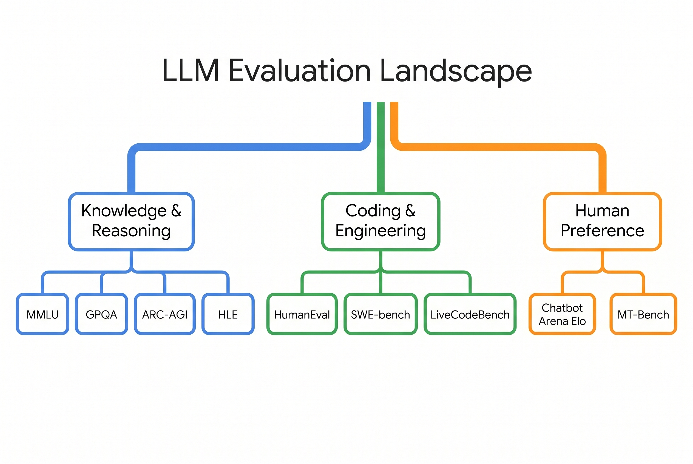
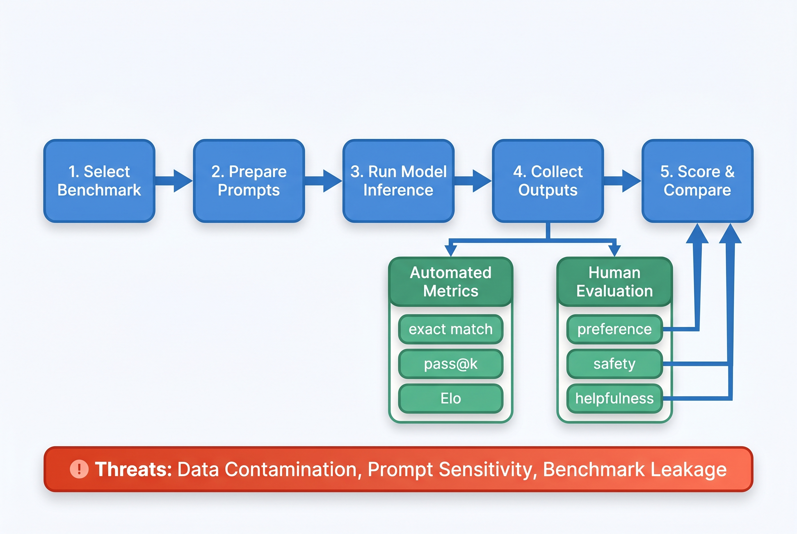
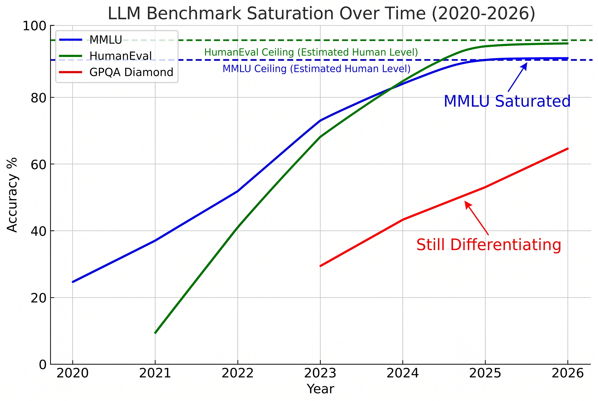
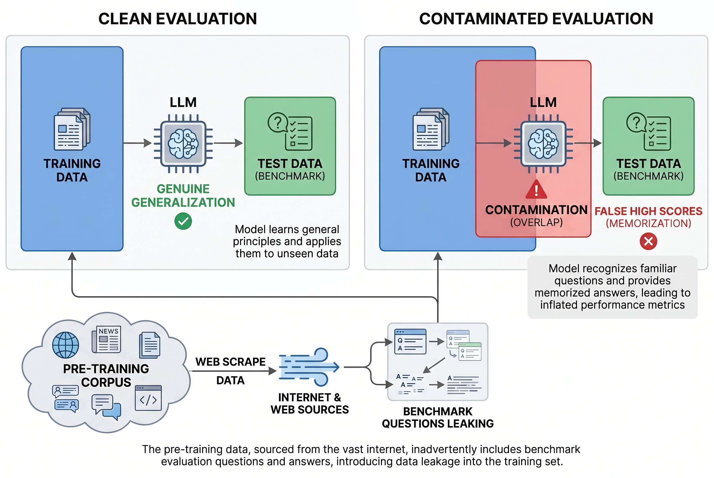
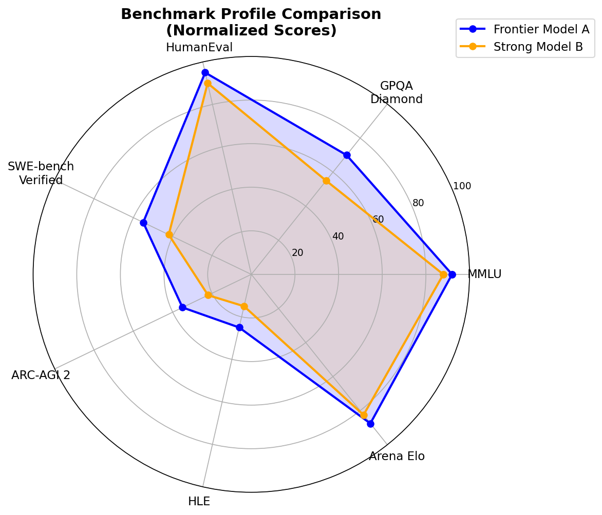

# Day 25: Evaluation & Benchmarks

> **Core Question**: How do we know if an LLM is actually good — and why are the most popular benchmarks becoming unreliable?

---

## Opening

Imagine you're shopping for a phone. You see two models: one scored 98 on "PhoneBench" and another scored 92. Easy choice, right? But what if "PhoneBench" only tests how fast the phone can open its own manufacturer's apps? The 98-score phone might be gaming the test.

That's essentially where LLM evaluation finds itself in 2026. The most famous benchmark, MMLU (Massive Multitask Language Understanding), is saturated — top models all score 90%+. HumanEval, the go-to coding benchmark, sees models hitting 95%+. When everyone aces the test, the test stops being useful.

This article is about how we measure LLMs, why measurement is harder than it looks, and what the evaluation landscape looks like when old benchmarks crumble and new ones rise.


*Figure 1: The major categories of LLM benchmarks — knowledge & reasoning, coding, and human preference — each with distinct evaluation goals.*

---

## 1. Why Evaluation Matters (and Why It's Hard)

#### Intuition: the exam problem

Evaluating LLMs is like evaluating students, except worse.

- A multiple-choice exam tells you whether the student can recognize the right answer.
- A take-home essay tells you whether they can write something convincing, but maybe they got outside help.
- A live interview tells you how they think under pressure, but the interviewer may be biased.
- A real internship tells you whether they can actually do the job, but it's expensive and hard to standardize.

LLMs have exactly the same problem. No single benchmark captures "intelligence". Each benchmark measures one narrow slice.

### 1.1 What are we actually trying to measure?

Before talking about benchmarks, we should ask a simpler question: **what does "good" even mean?**

| If you care about... | What you actually want to measure | Typical benchmark |
|---|---|---|
| Factual knowledge | Can the model recall correct information? | MMLU, TriviaQA |
| Reasoning | Can it chain steps and solve hard problems? | GSM8K, GPQA, AIME |
| Coding | Can it write code that works in real repositories? | HumanEval, SWE-bench |
| Instruction following | Does it do what the user asked, no more and no less? | IFEval |
| Safety / truthfulness | Does it avoid harmful or false outputs? | TruthfulQA, ToxiGen |
| Human preference | Do people actually like using it? | Chatbot Arena |

The catch is that these goals often conflict.

A model can be:
- great at coding, but weak at following vague human instructions,
- very safe, but overly refusal-prone,
- charming in chat, but shallow in reasoning,
- strong on exams, but brittle in real products.

So benchmarking is not really about finding **the** best model. It is about finding the right model **for a specific kind of work**.

### 1.2 The evaluation pipeline

How does evaluation work in practice?


*Figure 2: The standard evaluation pipeline — from selecting a benchmark through running inference to scoring results.*

The basic pipeline looks simple:

1. pick a benchmark,
2. format prompts,
3. run the model,
4. collect outputs,
5. score the results.

But each step hides a trap:

| Step | Looks simple | What can go wrong |
|---|---|---|
| Choose benchmark | "Let's use MMLU" | Maybe MMLU is already saturated |
| Format prompts | "Just ask the question" | Prompt wording can change scores a lot |
| Run inference | "Just use temperature 0" | Decoding settings still matter |
| Score outputs | "Just compare answers" | Ambiguous outputs, formatting mismatches, judge bias |
| Compare models | "Higher number wins" | Different benchmarks reward different skills |

That is why evaluation feels objective on the surface, but is often messy underneath.

---

## 2. The major benchmarks, organized by what they test

Instead of listing benchmarks one by one, it is clearer to group them by **what job they are trying to do**.

### 2.1 Knowledge exams: MMLU and friends

#### Intuition: textbook exams

MMLU is like a giant university final exam. It asks: across many subjects, can the model choose the right answer?

MMLU (Massive Multitask Language Understanding) was introduced by Dan Hendrycks and collaborators in 2021, in work closely associated with the Center for AI Safety ecosystem. It became famous because it covered 57 subjects, from law to biology to math. For years, it was the default benchmark people quoted.

**Why it mattered:** it was broad, easy to run, and gave one clean number.

**Why it is less useful now:** by 2025-2026, frontier models all got very high scores. Once everyone scores around 90%+, small differences stop telling you much.

That is why people moved to stronger variants like **MMLU-Pro** and **MMLU-CF**.

| Benchmark | What it tests | Why people used it | Why it is weakening |
|---|---|---|---|
| MMLU | Broad factual/academic knowledge | Simple, broad, standard | Saturated, contamination concerns |
| MMLU-Pro | Harder expert-style questions | Better differentiation | Still exam-style multiple choice |
| MMLU-CF | Contamination-resistant version (tries to exclude questions the model may have effectively seen during training) | Cleaner signal | Still inherits MMLU's basic limits |

The scoring formula is simple:

$$
\text{Accuracy} = \frac{\text{number of correct answers}}{\text{total number of questions}}
$$

This simplicity is exactly why people loved MMLU, and exactly why it became easy to over-optimize for it.

### 2.2 Deep reasoning: GPQA, AIME, ARC-AGI

#### Intuition: not "did you study", but "can you think?"

Some benchmarks try to test whether the model can actually reason, not just recognize a memorized answer.

- **GPQA**, introduced by David Rein, Betty Li Hou, Samuel Bowman, and collaborators in 2023, asks graduate-level science questions that even domain experts find hard. This one is better thought of as an academic benchmark proposed by a research team, rather than a product launched by a single institution.
- **AIME**, a long-running mathematics competition benchmark adapted from the American Invitational Mathematics Examination, tests olympiad-style mathematical reasoning.
- **ARC-AGI**, derived from François Chollet's ARC benchmark (2019) and strengthened in ARC-AGI 2 (2025), tests pattern abstraction and generalization from tiny examples.

These are closer to asking:

> Can the model think through something genuinely difficult when the answer is not obvious from surface familiarity?

| Benchmark | Best mental model | Why it matters in 2026 |
|---|---|---|
| GPQA Diamond | PhD oral exam | Still differentiates frontier models clearly |
| AIME 2025 | Olympiad math contest | Strong test of multi-step symbolic reasoning |
| ARC-AGI 2 | IQ-style abstraction puzzle | Tests generalization, not textbook recall |

These are much harder to saturate because they reward structured reasoning rather than broad familiarity.

### 2.3 Coding: HumanEval vs SWE-bench

#### Intuition: toy homework vs real job ticket

This distinction matters a lot.

**HumanEval**, introduced by OpenAI in 2021, is like giving a student a small homework problem: here is a function signature, here is a docstring, now write the function.

**SWE-bench**, introduced by researchers at Princeton in 2024, is like giving an engineer a real GitHub issue inside a messy codebase and asking them to actually fix it.

That is why HumanEval was a great early coding benchmark, but is no longer enough.

| Benchmark | What the task feels like | Main weakness |
|---|---|---|
| HumanEval | Write a short standalone function | Too small, too clean, too isolated |
| SWE-bench Verified | Fix a real issue in a real repo | Expensive and harder to run |

HumanEval often uses **pass@k**, the probability that at least one of k generated solutions is correct:

$$
\text{pass@k} = 1 - \frac{\binom{n-c}{k}}{\binom{n}{k}}
$$

Here is the plain-English meaning:
- **pass@k** means the model is allowed to generate **k different attempts**
- if **at least one** of those attempts is correct, we count it as a success
- so this metric answers: "if I let the model try a few times, how likely is it to get one working solution?"

where:
- $n$ = total sampled solutions,
- $c$ = number of correct ones,
- $k$ = how many attempts you are allowed to try.

Big picture: **HumanEval asks "can you write a correct little snippet?" SWE-bench asks "can you function like a software engineer?"**

### 2.4 Human preference: Chatbot Arena

#### Intuition: the restaurant test

A benchmark score is like a food critic rating a restaurant by a checklist.

Chatbot Arena is like asking thousands of real customers, "which restaurant would you actually go back to?"

Instead of fixed exam questions, users compare two anonymous models and vote for the better response. Chatbot Arena was launched by **LMSYS Org** in 2023, and its results are aggregated into an **Elo rating**, borrowed from chess.

So yes: **this is not a static benchmark running on a fixed test set. It requires real users to participate and vote.** That is exactly why it measures human preference better than ordinary multiple-choice benchmarks.

$$
R_{\text{new}} = R_{\text{old}} + K(S - E)
$$

Plain English:
- **Elo** is a relative ranking score, like in chess
- two models are compared side by side, and humans vote for which answer they prefer
- if a weaker-rated model beats a stronger-rated model, it gains more points
- so Elo measures: "when humans compare this model against others, how often do they prefer it?"

Where:
- $R$ is the rating,
- $K$ controls how fast ratings move,
- $S$ is the actual result (win/loss/tie),
- $E$ is the expected result from prior ratings.

Why Arena matters:
- it reflects real human usage,
- it is harder to overfit than a static exam,
- it captures style, helpfulness, and preference, not just correctness.

Why it is still imperfect:
- users may prefer long confident answers,
- preferences vary by task,
- consumer chat quality is not the same thing as scientific reasoning.

### 2.5 Frontier mega-benchmarks: HLE

#### Intuition: the benchmark built to stop leaderboard inflation

Once old benchmarks saturate, the community builds a harder one.

That is what **Humanity's Last Exam (HLE)** tried to be. Released in early 2025 by the **Center for AI Safety** together with **Scale AI**, HLE was designed as a giant, expert-written benchmark that even frontier models would still struggle with.

Its backstory is simple:
- **Before HLE**, the field relied heavily on benchmarks like MMLU and HumanEval.
- **Then those benchmarks started saturating**. Top models were separated by only a few points, so leaderboard movement stopped meaning much.
- **At the same time, contamination worries grew**. If models had already seen benchmark-style questions during training, high scores became harder to trust.
- **So HLE was created as a reset**: a much larger, harder, more expert-driven test meant to restore real separation between frontier systems.

In that sense, HLE is not important because of its dramatic name. It is important because it represents a new phase in benchmarking: from tidy classroom-style tests toward deliberately difficult frontier exams.

What makes HLE different:

| Aspect | Older classic benchmarks | HLE |
|---|---|---|
| Scale | Usually hundreds to a few thousand items | Over 12,000 expert-written questions |
| Difficulty | Many are already near saturation | Intentionally built to remain hard |
| Goal | General comparison | Re-establish frontier differentiation |
| Failure mode it targets | Weak coverage, saturation | Saturation + leaderboard inflation |

So the point of HLE is not that it is literally the "last" exam. The point is that it resets differentiation. It creates a test where score gaps matter again.

---

## 3. The three big problems with modern benchmarks

This is the real heart of the chapter. Benchmarks are useful, but they keep failing in three recurring ways.

### 3.1 Problem 1: saturation

#### Intuition: once everyone gets an A, the exam stops ranking students

When a benchmark is new, score gaps are meaningful.
When the top five models all score between 90 and 94, the benchmark becomes much less informative.

That is what happened to MMLU and, to a large extent, HumanEval.


*Figure 3: Benchmark saturation timeline — MMLU and HumanEval are effectively saturated, while GPQA Diamond still differentiates models.*

The usual lifecycle is:

1. benchmark appears,
2. models perform badly,
3. labs optimize for it,
4. scores climb,
5. the benchmark loses discrimination,
6. the community invents a harder benchmark.

So if a lab advertises "state of the art on MMLU," the right question is:

> Does this still tell me anything important in 2026?

Often the answer is: not much.

### 3.2 Problem 2: contamination

#### Intuition: the student saw the exam in advance

A benchmark is only meaningful if the model did not already memorize the answers from training data.

But LLMs are trained on giant internet corpora, and many benchmarks live on the internet. That creates **data contamination**.


*Figure 4: Data contamination occurs when benchmark questions appear in the training corpus, inflating scores through memorization rather than genuine capability.*

Contamination can happen in several ways:
- exact benchmark questions are in the training set,
- paraphrased versions appear in blogs or forums,
- answer discussions leak into tutorials and repos.

The nasty part is that contamination is hard to prove and hard to fully remove.

| Mitigation strategy | Idea | Limitation |
|---|---|---|
| Private holdout sets | Hide the benchmark | Hard for open research |
| Rephrasing | Rewrite questions | May change difficulty |
| Dynamic benchmarks | Constantly generate new items | Expensive |
| Detection tools | Search for overlap | Misses subtle paraphrases |

So benchmark numbers are never just capability numbers. They are capability **plus** possible exposure effects.

### 3.3 Problem 3: benchmark-task mismatch

#### Intuition: a driving test is not a guarantee of being a good taxi driver

Even a clean, unsaturated benchmark may still fail to predict real-world usefulness.

Why? Because real work is messy.

- Real users give ambiguous instructions.
- Real coding happens in large codebases.
- Real customer support involves long conversations.
- Real scientific work involves uncertainty and missing context.

A model can dominate benchmarks and still disappoint in production.

That is why production teams increasingly rely on **domain-specific evaluation**, not just public leaderboards.

---

## 4. So what should you actually use in 2026?

#### Intuition: pick the exam that matches the job

If you are hiring:
- you do not use a poetry contest to hire an accountant,
- you do not use a spelling bee to hire a physicist.

Same logic here.

### 4.1 Practical benchmark selection guide

| Your real question | Best benchmark to start with | Why |
|---|---|---|
| Which model do users generally like? | Chatbot Arena Elo | Broad human preference signal |
| Which model reasons best about science? | GPQA Diamond | Still hard, still unsaturated |
| Which model handles real coding? | SWE-bench Verified | Real repositories, real issues |
| Which handles hard math? | AIME 2025 | Strong multi-step mathematical reasoning |
| Which generalizes abstractly? | ARC-AGI 2 | Hard to fake with memorization |
| Which follows instructions best? | IFEval | Directly tests instruction fidelity |
| Which is currently the hardest general frontier exam? | HLE | Very low scores, still differentiating |

### 4.2 Use benchmark profiles, not one magic number

One of the biggest mistakes is to treat evaluation as a single scalar ranking problem.

A better mental model is a **profile**.


*Figure 3b: Two hypothetical models compared across seven benchmarks. Model A dominates MMLU and HumanEval (saturated), but the gap on SWE-bench and HLE reveals more meaningful differences.*

Look at the **shape**, not just the headline number.

A model with:
- high Arena Elo but weak GPQA may be great for consumer chat, but weak for expert reasoning,
- high MMLU but weak SWE-bench may know a lot, but fail at actual software work,
- high AIME and GPQA but weak instruction following may be brilliant but hard to use.

### 4.3 For real products, build your own evals

This is the most practical takeaway in the whole chapter.

If you are deploying an LLM system, public benchmarks are only the starting point.

You should also build:

1. **your own task set** from real user queries,
2. **your own grading rubric** based on what success means in your product,
3. **A/B tests with real users**,
4. **drift monitoring over time**.

Public benchmarks tell you how a model behaves in the lab.
Your own evals tell you whether it works in your business.

---

## 5. What changed in 2025-2026?

This is where the story gets more interesting.

### 5.1 The benchmark wars moved from static exams to dynamic evaluation

By 2025-2026, the community realized that static multiple-choice benchmarks are too easy to contaminate and too easy to saturate.

That pushed evaluation toward:
- harder expert-written benchmarks like HLE,
- dynamic and contamination-resistant variants like MMLU-CF,
- real-world engineering tasks like SWE-bench Verified,
- live human preference systems like Arena,
- agent benchmarks such as WebArena and WebVoyager for digital action.

This is a big shift. The field is moving from **"Can the model answer test questions?"** to **"Can the model actually do useful work?"**

### 5.2 Agents changed what "evaluation" means

Once models became agents, evaluation had to change too.

A chatbot benchmark is not enough for a web-browsing agent.
Now you also need to ask:
- can it recover from errors?
- can it navigate multi-step workflows?
- can it act safely in open-ended environments?

That is why benchmarks like **WebArena**, **WebVoyager**, and agentic evaluations matter more in 2026 than they did two years earlier.

### 5.3 LLM-as-judge became mainstream, but still controversial

Labs increasingly use stronger models to evaluate weaker models.

Why?
Because human evaluation is expensive, slow, and inconsistent.

Why is it controversial?
Because now the judge is itself a model, with its own biases and blind spots.

So LLM-as-judge is useful, but it is not the same thing as objective truth.

---

## 6. Common misconceptions

### ❌ "Higher benchmark score means smarter model"

Not always. It may mean:
- the benchmark is saturated,
- the model was optimized for that benchmark,
- the benchmark matches only one skill,
- contamination inflated the score.

### ❌ "We just need harder benchmarks"

Harder helps, but only temporarily. Saturation eventually catches up again.

### ❌ "Chatbot Arena solves everything because humans vote"

Arena is valuable, but human preference is noisy, style-sensitive, and task-dependent.

### ❌ "Benchmarking is objective"

Benchmarking always contains design choices:
- which tasks,
- which prompts,
- which metrics,
- which judges,
- which distribution.

So evaluation is more like measurement engineering than pure truth-finding.

## 7. Code Example: Running a Simple Evaluation

Here's how to run a basic MMLU-style evaluation using Hugging Face datasets:

```python
"""
Simple MMLU-style evaluation using Hugging Face datasets.
Runs multiple-choice questions through a model and computes accuracy.
"""

from datasets import load_dataset
from transformers import AutoModelForCausalLM, AutoTokenizer
import torch

# Load a small subset of MMLU (STEM subjects)
dataset = load_dataset("cais/mmlu", "all", split="test", trust_remote_code=True)
dataset = dataset.filter(lambda x: x["subject"] in ["abstract_algebra", "astronomy"])

# Load model and tokenizer
model_name = "gpt2"  # Replace with your model
tokenizer = AutoTokenizer.from_pretrained(model_name)
model = AutoModelForCausalLM.from_pretrained(model_name)
model.eval()

def format_mmlu_prompt(question, choices):
    """Format a multiple-choice question as a prompt."""
    labels = ["A", "B", "C", "D"]
    options = "\n".join(f"{l}. {c}" for l, c in zip(labels, choices))
    return f"{question}\n{options}\nAnswer:"

def evaluate_one(question, choices, answer_idx):
    """
    Evaluate a single question by comparing log-probabilities
    of each answer choice.
    """
    prompt = format_mmlu_prompt(question, choices)
    inputs = tokenizer(prompt, return_tensors="pt")

    with torch.no_grad():
        outputs = model(**inputs)
        logits = outputs.logits[0, -1, :]  # Last token's logits

    # Compare log-probabilities of A, B, C, D tokens
    label_tokens = [tokenizer.encode(l)[0] for l in ["A", "B", "C", "D"]]
    log_probs = torch.log_softmax(logits, dim=-1)
    scores = [log_probs[t].item() for t in label_tokens]

    predicted = scores.index(max(scores))
    return predicted == answer_idx

# Run evaluation
correct = 0
total = 0
for example in dataset.select(range(min(50, len(dataset)))):
    if evaluate_one(example["question"], example["choices"], example["answer"]):
        correct += 1
    total += 1

accuracy = correct / total
print(f"Accuracy: {accuracy:.2%} ({correct}/{total})")
```

This shows the basic pattern: format questions, get model scores, compare predictions to answers. Production evaluation systems add prompt engineering, few-shot examples, chain-of-thought, and more sophisticated scoring — but the core loop is the same.

---

## 8. Further Reading

### Beginner
1. [LMSYS Chatbot Arena](https://chat.lmsys.org) — Try it yourself, vote on model comparisons
2. [Hugging Face Open LLM Leaderboard](https://huggingface.co/spaces/HuggingFaceH4/open_llm_leaderboard) — Community benchmark tracker
3. [LLM Benchmarks Compared (LXT, 2026)](https://www.lxt.ai/blog/llm-benchmarks/) — Good overview of current landscape

### Advanced
1. ["A Survey on Data Contamination for Large Language Models"](https://arxiv.org/abs/2502.14425) — Comprehensive survey on contamination
2. ["Are We Done with MMLU?"](https://arxiv.org/abs/2406.04127) — Analysis of MMLU's limitations
3. ["When Benchmarks Leak: Inference-Time Decontamination for LLMs"](https://arxiv.org/abs/2601.19334) — January 2026 approach to contamination

### Key Papers
1. ["Measuring Massive Multitask Language Understanding" (MMLU)](https://arxiv.org/abs/2009.03300) — Hendrycks et al., 2021
2. ["Evaluating Large Language Models Trained on Code" (HumanEval)](https://arxiv.org/abs/2107.03374) — Chen et al., 2021
3. ["Google-Proof Question Answering" (GPQA)](https://arxiv.org/abs/2311.12022) — Rein et al., 2023
4. ["Chatbot Arena: An Open Platform for Evaluating LLMs by Human Preference"](https://arxiv.org/abs/2403.04132) — Zheng et al., 2024
5. ["SWE-bench: Can Language Models Resolve Real-World GitHub Issues?"](https://arxiv.org/abs/2310.06770) — Jimenez et al., 2023

---

## Reflection Questions

1. If you were building a customer service chatbot, which benchmarks would you trust to select the right model — and why wouldn't MMLU be enough?
2. Why do you think benchmark saturation happens so quickly? Is it because benchmarks are poorly designed, or because the field moves fast?
3. How would you design an evaluation program for an LLM product that avoids the pitfalls discussed in this article?

---

## Summary

| Concept | One-line Explanation |
|---------|---------------------|
| MMLU | Multi-subject knowledge test, now saturated at 90%+ |
| GPQA Diamond | Hard graduate-level science questions, still differentiates models |
| HumanEval | Function-level coding test, approaching saturation |
| SWE-bench | Real GitHub issue resolution, better for modern coding eval |
| ARC-AGI 2 | Visual pattern reasoning that tests generalization, not memorization |
| HLE (Humanity's Last Exam) | Expert-level questions across 14 domains, very low scores |
| Chatbot Arena | Human preference voting with Elo ratings, 6M+ votes |
| Data Contamination | Benchmark questions leaking into training data, inflating scores |
| Benchmark Saturation | When all top models score similarly, the benchmark stops being useful |

**Key Takeaway**: LLM evaluation is an arms race between benchmark creators and model builders. Old benchmarks saturate, data contamination undermines validity, and no single number captures real-world performance. The best approach in 2026 is to use multiple complementary benchmarks (GPQA, SWE-bench, Arena Elo) and always evaluate on your own specific use case.

---

*Day 25 of 60 | LLM Fundamentals*
*Word count: ~2400 | Reading time: ~12 minutes*
