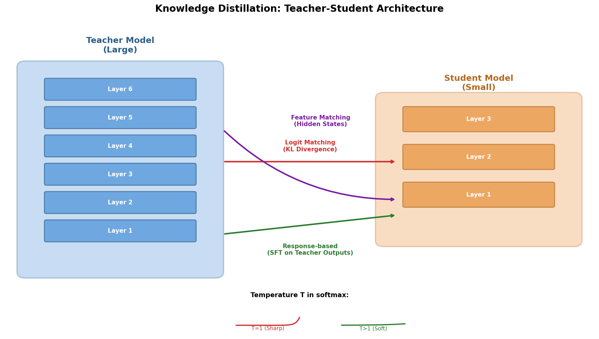
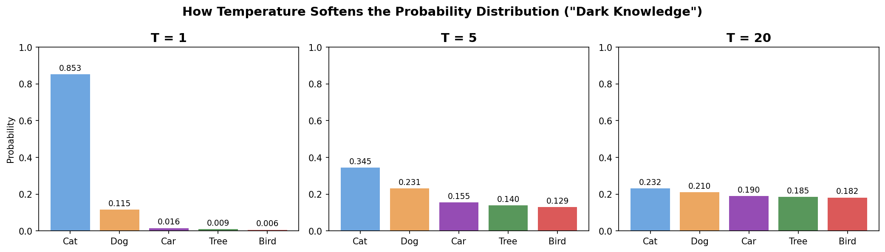
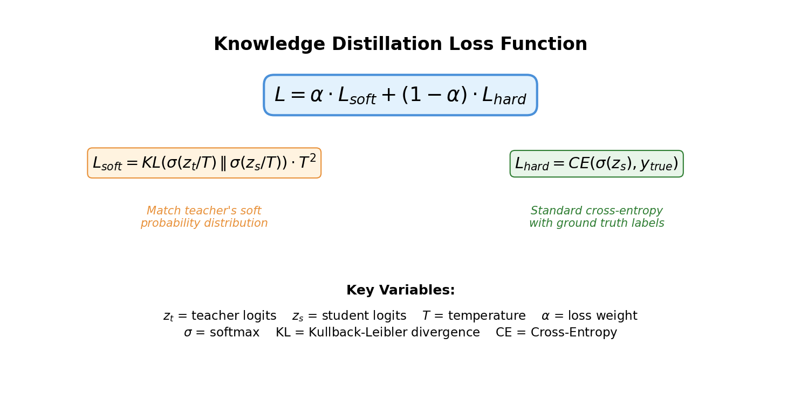
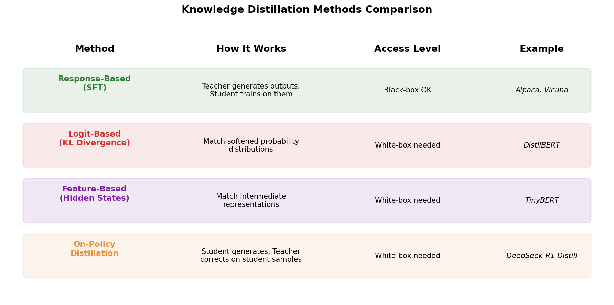
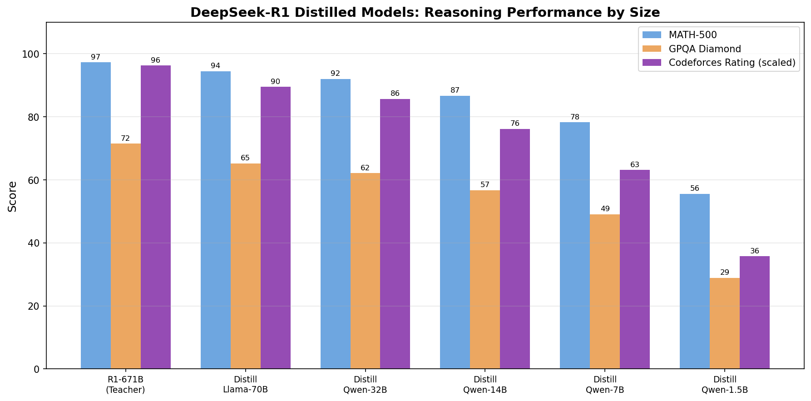

# Day 27: Knowledge Distillation — Compressing Intelligence from Large to Small

> **Core Question**: How can a small model learn the "reasoning" of a large model, instead of just memorizing its answers?

---

## Opening

Imagine you're a senior doctor with 30 years of experience. A medical student shadows you for a year. If the student only copies your prescriptions, they'll learn what you prescribed — but not *why*. The real knowledge is in how you think: which symptoms you weight more heavily, which diagnoses you rule out first, and what subtle patterns you've learned to recognize.

This is exactly the problem **Knowledge Distillation (KD)** solves in machine learning. First proposed by Geoffrey Hinton and colleagues in their 2015 paper ["Distilling the Knowledge in a Neural Network"](https://arxiv.org/abs/1503.02531), the core idea is deceptively simple: instead of training a small model ("student") on the raw data alone, we make it learn from a larger, more capable model ("teacher") — capturing not just the final answer, but the *reasoning process* encoded in the teacher's probability distribution.

In 2025, this went from an academic technique to front-page news. DeepSeek used distillation to train their R1 reasoning models, creating smaller versions (1.5B to 70B parameters) that retained most of the reasoning power of the 671B-parameter teacher. Meta distilled Llama models down to 1B and 3B for on-device use. And the controversy around whether distillation from proprietary models constitutes "theft" became a geopolitical issue.

Let's unpack how this works, why it matters, and what the latest developments look like.

---

## 1. What Is Knowledge Distillation?

### 1.1 The Core Problem

Large models are expensive. GPT-4, Claude, and DeepSeek-R1 cost millions to train and require massive GPU clusters to run. But for many applications — running on phones, edge devices, or in cost-sensitive production — we need small, fast models that are still smart.

Knowledge distillation is one answer: transfer the "knowledge" of a large teacher model into a smaller student model.

#### Intuition: The Master-Apprentice Relationship

Think of the teacher model as a master craftsman and the student as an apprentice. The apprentice doesn't just copy the final product — they watch the master work, learn the techniques, understand the decision-making process. Similarly, in knowledge distillation, the student doesn't just learn the final answers; it learns the teacher's *confidence distribution* across all possible answers.


*Figure 1: Knowledge distillation architecture showing three types of knowledge transfer from teacher to student.*

### 1.2 Why Not Just Train a Small Model Directly?

You might wonder: if we need a small model, why not just train it on the data? Three reasons:

1. **Data efficiency**: The teacher has already learned rich representations. The student can learn from these representations much more efficiently than from raw data alone.
2. **Dark knowledge**: The teacher's probability distribution over *wrong* answers contains useful information. If the teacher thinks answer B is 70% likely, answer C is 20% likely, and answer D is 10% likely, this tells the student that C is "more similar" to the correct answer than D.
3. **Regularization**: Training against a smooth teacher distribution acts as a form of regularization, helping the student generalize better than training against hard labels.

---

## 2. The Mechanics: How Distillation Works

### 2.1 The Key Insight — "Dark Knowledge"

Hinton's brilliant observation was that the softmax output of a neural network contains far more information than just the top prediction. Consider a model classifying an image:

| Class | Raw Logit | Prob (T=1) | Prob (T=5) |
|-------|-----------|-------------|-------------|
| Cat | 5.0 | 0.924 | 0.468 |
| Dog | 3.0 | 0.125 | 0.254 |
| Car | 1.0 | 0.017 | 0.104 |
| Tree | 0.5 | 0.010 | 0.082 |
| Bird | 0.1 | 0.007 | 0.070 |

At temperature T=1, the distribution is dominated by "Cat" — you'd think the model just knows "it's a cat." But at T=5, we see the full picture: the model thinks Dog is much more likely than Car, Tree, or Bird. This relationship between non-target classes is the **"dark knowledge"** — information that's invisible in the hard label but encoded in the soft probabilities.


*Figure 2: How increasing temperature T reveals the "dark knowledge" hidden in the teacher's output distribution.*

### 2.2 The Distillation Loss Function

The student is trained with a combination of two losses:

$$
\begin{aligned}
L_{total} &= \alpha \cdot L_{soft} + (1 - \alpha) \cdot L_{hard} \\
L_{soft} &= T^2 \cdot KL\bigl(\sigma(z_t / T) \;\mid\mid\; \sigma(z_s / T)\bigr) \\
L_{hard} &= CE\bigl(\sigma(z_s), y_{true}\bigr)
\end{aligned}
$$

Where:
- $z_t$ = teacher logits, $z_s$ = student logits
- $T$ = temperature (typically 2-20)
- $\sigma$ = softmax function
- $\alpha$ = weighting factor between soft and hard losses
- KL = Kullback-Leibler divergence
- CE = Cross-entropy loss

#### Intuition: Why Multiply by T²?

When we divide logits by temperature T, the gradients become $1/T$ times smaller. Multiplying the KL loss by $T^2$ ensures the soft loss contributes gradients of the right magnitude, preventing it from being overwhelmed by the hard loss when T is large.


*Figure 3: The knowledge distillation loss function combines soft distillation loss with hard label loss.*

### 2.3 Three Levels of Distillation

Not all distillation is the same. Depending on how much access you have to the teacher model, different approaches are available:

| Method | Access Required | What Is Transferred | Example |
|--------|----------------|--------------------| -------|
| Response-based | Black-box (API only) | Teacher's final outputs/predictions | Alpaca, Vicuna |
| Logit-based | White-box (logits) | Softened probability distributions | DistilBERT |
| Feature-based | White-box (internals) | Hidden states, attention maps | TinyBERT |


*Figure 4: Comparison of four distillation methods, their access requirements, and real-world examples.*

---

## 3. Distillation in the LLM Era

### 3.1 Response-Based Distillation: The Pragmatic Approach

The simplest form of distillation: use the teacher model (via API) to generate responses, then fine-tune the student on those responses. This is **black-box distillation** — you don't need access to the teacher's internal states.

**Notable examples:**
- **Alpaca** (Stanford, March 2023): Fine-tuned Llama 7B on 52K GPT-3.5-generated instructions. Cost ~$600 to train, achieved near-GPT-3.5 quality.
- **Vicuna** (LMSYS, March 2023): Trained on 70K ChatGPT conversations from ShareGPT.
- **OpenHermes**: Distilled from GPT-4 outputs across diverse tasks.

The limitation? The student only learns the teacher's *final answers*, not its reasoning process. It's like copying the master's paintings without watching them paint.

### 3.2 Logit-Based Distillation: Capturing Reasoning

When you have access to the teacher's logits (the raw scores before softmax), you can train the student to match the full probability distribution. This transfers much richer information.

**DistilBERT** (Hugging Face, 2019) was a landmark: a 66M-parameter student distilled from BERT-base (110M parameters), retaining 97% of performance while being 40% faster and 60% smaller.

### 3.3 On-Policy Distillation: The New Frontier

A major evolution in 2025-2026 is **on-policy distillation**, where the student generates its own responses and the teacher provides feedback on those responses — rather than the student simply imitating teacher-generated outputs.

#### Intuition: Learning by Doing vs. Learning by Watching

Traditional (off-policy) distillation is like watching a master chef cook and trying to replicate their dishes. On-policy distillation is like cooking yourself, then having the master taste and critique *your* dish. The feedback is more targeted because it addresses *your specific mistakes*.

DeepSeek-R1 used this approach: their distilled models (based on Qwen2.5 and Llama3) were trained by having the student generate reasoning chains, then using the teacher's feedback to improve. The results were remarkable:


*Figure 5: DeepSeek-R1 distilled models show that even small models (7B-70B) can retain significant reasoning ability when distilled from a 671B teacher.*

### 3.4 The DeepSeek-R1 Distill Family (January 2025)

DeepSeek open-sourced a family of distilled models ranging from 1.5B to 70B parameters, all distilled from the 671B-parameter DeepSeek-R1 teacher. Key results:

| Model | Base | MATH-500 | GPQA Diamond | Key Insight |
|-------|------|----------|--------------|-------------|
| R1 (teacher) | DeepSeek-V3 MoE | 97.3% | 71.5% | Full reasoning power |
| Distill-Llama-70B | Llama-3.3-70B | 94.5% | 65.2% | 97% of teacher's math ability |
| Distill-Qwen-32B | Qwen2.5-32B | 92.0% | 62.1% | Strong mid-range option |
| Distill-Qwen-14B | Qwen2.5-14B | 86.7% | 56.7% | Runs on consumer GPU |
| Distill-Qwen-7B | Qwen2.5-7B | 78.3% | 49.1% | Edge-deployable |
| Distill-Qwen-1.5B | Qwen2.5-1.5B | 55.6% | 28.9% | Phone-deployable |

The 70B distilled model scored 94.5% on MATH-500 — nearly matching the 671B teacher's 97.3%. That's a 10× reduction in parameters with only 3% loss in math performance.

---

## 4. The Controversy: Distillation as "Theft"?

In early 2025, a major controversy erupted. OpenAI and Anthropic accused several Chinese AI companies — including DeepSeek — of using distillation to "steal" capabilities from GPT-4 and Claude. The accusation: these companies used massive amounts of API queries to generate training data, effectively distilling proprietary model capabilities into their own open-source models.

**The technical reality is nuanced:**

- **Black-box distillation from APIs is technically straightforward.** Anyone with API access can generate millions of teacher outputs.
- **Terms of service often prohibit this.** OpenAI and Anthropic explicitly forbid using their outputs to train competing models.
- **It's hard to detect.** Unless the distilled model reproduces distinctive patterns, proving distillation is difficult.
- **The DeepSeek case is complex.** DeepSeek V3/R1 were primarily trained from scratch with innovative techniques (MoE, MLA, GRPO), but some evidence suggested GPT-4 outputs may have been used in data mixing.

This debate continues into 2026. DeepSeek V4 (released April 2026) uses multi-stage on-policy distillation from their own domain-specific expert models, reducing dependence on external teachers.

---

## 5. Code Example: Simple Logit-Based Distillation

Here's a minimal PyTorch implementation of logit-based knowledge distillation:

```python
import torch
import torch.nn as nn
import torch.nn.functional as F

def distillation_loss(student_logits, teacher_logits, labels, 
                      temperature=5.0, alpha=0.7):
    """
    Compute the knowledge distillation loss.
    
    Args:
        student_logits: Raw outputs from student model (batch_size, num_classes)
        teacher_logits: Raw outputs from teacher model (batch_size, num_classes)
        labels: Ground truth labels (batch_size,)
        temperature: Softmax temperature (higher = softer distribution)
        alpha: Weight for soft loss vs hard loss (0 = only hard, 1 = only soft)
    
    Returns:
        Combined distillation loss
    """
    # Soft loss: KL divergence between softened distributions
    # Scale by T^2 to maintain gradient magnitude
    soft_student = F.log_softmax(student_logits / temperature, dim=-1)
    soft_teacher = F.softmax(teacher_logits / temperature, dim=-1)
    soft_loss = F.kl_div(soft_student, soft_teacher, reduction='batchmean') 
    soft_loss = soft_loss * (temperature ** 2)
    
    # Hard loss: Standard cross-entropy with ground truth
    hard_loss = F.cross_entropy(student_logits, labels)
    
    # Combine
    total_loss = alpha * soft_loss + (1 - alpha) * hard_loss
    return total_loss


# Usage example
batch_size, num_classes = 32, 1000
student_logits = torch.randn(batch_size, num_classes)
teacher_logits = torch.randn(batch_size, num_classes)
labels = torch.randint(0, num_classes, (batch_size,))

loss = distillation_loss(student_logits, teacher_logits, labels, 
                         temperature=5.0, alpha=0.7)
print(f"Distillation loss: {loss.item():.4f}")
```

---

## 6. Math Derivation: Why Soft Targets Help

> This section is for readers who want deeper mathematical understanding.

The standard cross-entropy loss with hard labels provides $-\log(p_{true})$ — information only about the correct class. But the soft target distribution $q$ from the teacher provides information about *all* classes.

Consider the gradient of the KL divergence with respect to a student logit $z_s^{(k)}$:

$$
\begin{aligned}
\frac{\partial}{\partial z_s^{(k)}} KL\bigl(\sigma(z_t / T) \;\mid\mid\; \sigma(z_s / T)\bigr) 
&= \frac{1}{T}\bigl(\sigma(z_s / T)^{(k)} - \sigma(z_t / T)^{(k)}\bigr)
\end{aligned}
$$

This means **every class contributes to the gradient proportionally to the difference between student and teacher probabilities**. For hard labels, only the true class contributes. For soft targets, even unlikely classes (where the teacher assigns 1-5% probability) push the student in informative directions.

In the high-temperature limit ($T \to \infty$), the distillation loss becomes equivalent to minimizing the mean squared error between teacher and student logits directly:

$$
\begin{aligned}
L_{distill} \approx \frac{1}{2} \sum_k (z_t^{(k)} - z_s^{(k)})^2
\end{aligned}
$$

This is why temperature is the critical hyperparameter: low T focuses on the most likely classes, high T spreads attention across all classes.

---

## 7. Common Misconceptions

### ❌ "Distillation just copies the teacher's outputs"

No. Logit-based and feature-based distillation transfer the teacher's *uncertainty structure* — how it thinks about all possible answers, not just which one it picks. This is fundamentally richer than copying outputs.

### ❌ "A distilled model is always worse than its teacher"

While a student typically can't exceed its teacher on the exact same distribution, distilled students often generalize *differently*. In some cases, students outperform teachers on specific narrow tasks because the distillation process acts as a form of regularization.

### ❌ "You need the teacher's weights to distill"

Only for logit-based and feature-based distillation. Response-based (black-box) distillation only requires API access to the teacher's outputs, which is why it's become so controversial.

### ❌ "Distillation is only about model compression"

Distillation is also used for:
- **Task transfer**: Distilling a general model into a task-specific one
- **Cross-modal transfer**: Transferring knowledge from text to vision models
- **Ensemble compression**: Compressing an ensemble of models into a single model
- **Reasoning transfer**: Teaching smaller models chain-of-thought reasoning (DeepSeek-R1)

---

## 8. Further Reading

### Beginner
1. [Distilling the Knowledge in a Neural Network](https://arxiv.org/abs/1503.02531) — Hinton et al., 2015. The original paper that started it all.
2. [DistilBERT](https://arxiv.org/abs/1910.01108) — Sanh et al., 2019. A practical case study of distilling BERT.

### Advanced
1. [TinyBERT](https://arxiv.org/abs/1909.10351) — Jiao et al., 2019. Two-stage distillation at both pre-training and task-specific stages.
2. [A Survey of On-Policy Distillation for Large Language Models](https://arxiv.org/abs/2604.00626) — Song et al., April 2026. Comprehensive survey of on-policy methods.
3. [Knowledge Distillation and Dataset Distillation of LLMs](https://arxiv.org/abs/2504.14772) — April 2025 survey covering KD and dataset distillation together.

### Papers
1. [DeepSeek-R1 Technical Report](https://arxiv.org/abs/2501.12948) — January 2025. Details on reasoning distillation.
2. [Re-Distilling Smaller DeepSeek R1 Models](https://dropbox.github.io/r1_redistill_blogpost/) — Dropbox, 2025. Shows that second-stage logit alignment significantly improves distilled R1 models.
3. [Knowledge Distillation for Large Language Models](https://arxiv.org/abs/2603.13765) — La Torre, March 2026. Qwen-based distillation experiments with CoT-guided RL.

---

## Reflection Questions

1. If a student model can match 97% of a teacher's performance at 1/10 the size, what does that tell us about where the "knowledge" actually lives — in the parameters, or in the training data?

2. On-policy distillation (student generates, teacher corrects) seems more effective than off-policy (teacher generates, student imitates). Why might learning from your own mistakes be more efficient than copying someone else's success?

3. If distillation from proprietary models becomes legally restricted, how will this affect the open-source AI ecosystem? Will it create a permanent divide between "original trainers" and everyone else?

---

## Summary

| Concept | One-line Explanation |
|---------|---------------------|
| Knowledge Distillation | Transferring knowledge from a large teacher model to a smaller student model |
| Dark Knowledge | Information hidden in the teacher's probability distribution over wrong answers |
| Temperature (T) | Controls softmax sharpness; higher T reveals more dark knowledge |
| Response-based KD | Black-box approach: train student on teacher's outputs (API-only) |
| Logit-based KD | White-box approach: match teacher's softened probability distribution |
| Feature-based KD | White-box approach: match intermediate representations (hidden states) |
| On-policy KD | Student generates, teacher corrects — more targeted learning signal |
| DeepSeek-R1 Distill | Family of 1.5B-70B models retaining up to 97% of 671B teacher's reasoning |

**Key Takeaway**: Knowledge distillation is not just model compression — it's a fundamental technique for transferring reasoning capabilities across scale. The "dark knowledge" hidden in a teacher's probability distribution over *wrong* answers provides a much richer training signal than hard labels alone. In 2025-2026, distillation has become central to the AI ecosystem, from creating deployable small models to the geopolitics of who has the right to learn from whom.

---

*Day 27 of 60 | LLM Fundamentals*
*Word count: ~2200 | Reading time: ~12 minutes*
