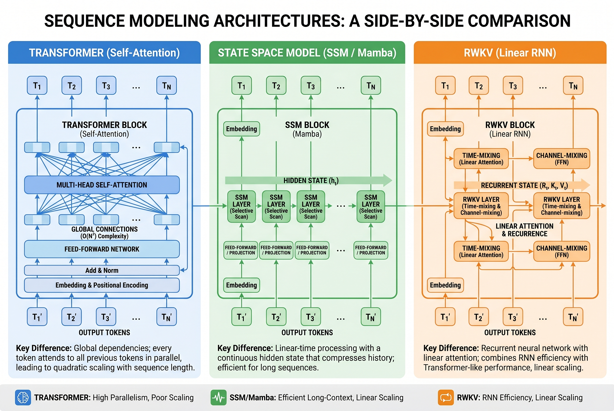
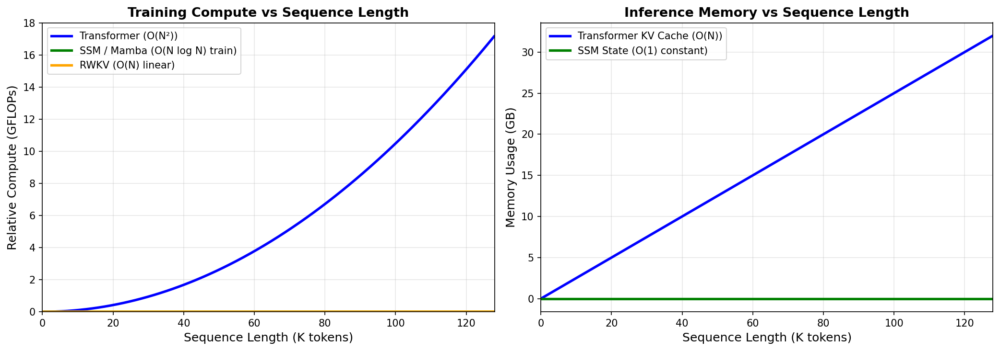
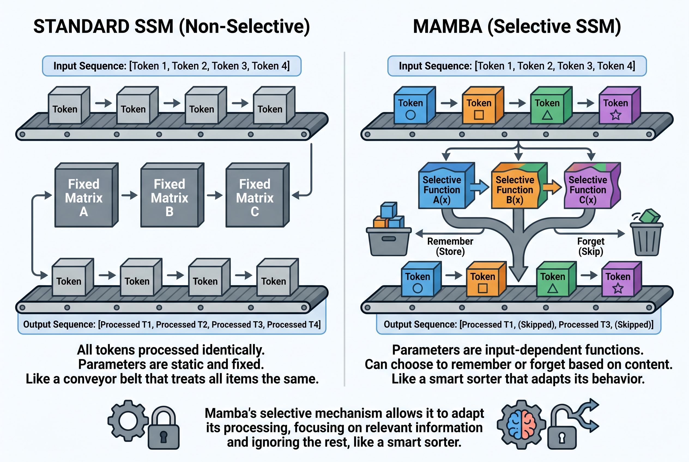
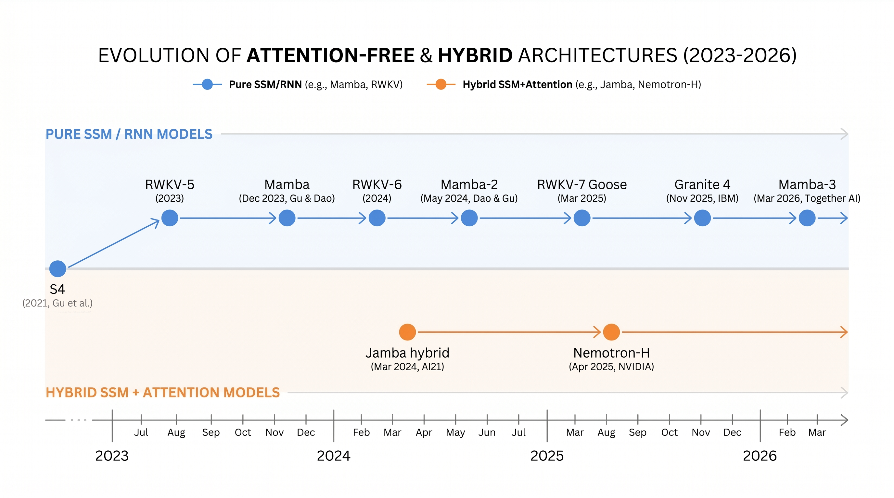

# Day 29: Attention-Free Architectures — Mamba, RWKV, and State Space Models

> **Core Question**: If attention is the "secret sauce" of Transformers, can we build powerful sequence models *without* it — and why would we want to?

---

## Opening

The Transformer's self-attention mechanism is beautiful: every token can look at every other token in a single step. But this beauty has a cost — the quadratic complexity. When your sequence doubles in length, attention computation quadruples. At 100K tokens, you're spending more time computing attention than actually doing useful reasoning and generating meaningful output (let's call this "thinking").

What if we could build models that process sequences in *linear* time, use *constant* memory during inference, and still match Transformer quality? That's exactly the promise of attention-free architectures: State Space Models (SSMs) like Mamba, and linear RNNs like RWKV.

These aren't just academic curiosities anymore. In March 2026, Together AI released [Mamba-3](https://www.together.ai/blog/mamba-3), an SSM that outperforms Mamba-2 while being faster than Transformers at decode. NVIDIA's [Nemotron-H](https://arxiv.org/abs/2504.03624) (April 2025) replaces 92% of attention layers with Mamba-2 blocks, achieving up to 3× throughput over LLaMA-3.1. IBM's [Granite 4.0](https://www.infoq.com/news/2025/11/ibm-granite-mamba2-enterprise/) (November 2025) uses a hybrid Mamba-2 backbone for enterprise AI.

The question is no longer "can attention-free models work?" — it's "when should you use them instead of Transformers?"

---

## 1. The Problem with Attention

### Intuition: The Dinner Party Analogy

Imagine you're at a dinner party. Self-attention is like having a separate conversation with *every single guest* to decide what's important. If there are 10 guests, that's 45 pairwise conversations. With 100 guests, it's 4,950. The conversation count grows quadratically — and at some point, you're spending all your time talking (pairwise communication) and none of it thinking (understanding, digesting, reasoning).

An attention-free architecture is like having a *notepad*: you maintain a running summary of what matters. Each new guest speaks, you update your notes, and you move on. The effort per guest stays constant.


*Figure 1: Three approaches to sequence modeling. Transformers connect every token to every other token (quadratic), SSMs maintain a compressed hidden state, and RWKV uses linear recurrence.*

### 1.1 The Quadratic Bottleneck

Standard self-attention computes a compatibility score between every pair of tokens:

$$
\text{Attention}(Q, K, V) = \text{softmax}\!\left(\frac{QK^\top}{\sqrt{d_k}}\right) V
$$

For a sequence of length $N$, this requires $O(N^2 d)$ operations and $O(N^2)$ memory for the attention matrix. During inference, the KV cache grows linearly with sequence length, consuming $O(N \cdot d \cdot L)$ memory where $L$ is the number of layers.

This is fine for short sequences. At 128K context, it becomes the dominant cost.


*Figure 2: Left — Transformer compute grows quadratically with sequence length, while SSMs and linear RNNs grow linearly. Right — Transformer KV cache grows linearly, while SSM hidden state is constant.*

---

## 2. State Space Models: From Control Theory to Sequence Modeling

### Intuition: The Running Summary

Think of an SSM as a news anchor's teleprompter that evolves in real time. The anchor doesn't re-read the entire script from scratch for each new segment. Instead, they maintain a "running understanding" of the story so far — a compressed state that gets updated with each new piece of information. Some details are emphasized, others fade. The state is much smaller than the full history, but it carries the essential signal.

SSMs were originally developed in control theory (1960s) to model continuous dynamical systems. The core idea: a system evolves through a hidden state that summarizes its history, and produces outputs based on that state.

### 2.1 The Continuous SSM

A continuous-time State Space Model is defined by two linear equations:

$$
\begin{aligned}
h'(t) &= A \, h(t) + B \, x(t) \quad &\text{(state evolution)} \\
y(t) &= C \, h(t) + D \, x(t) \quad &\text{(output)}
\end{aligned}
$$

Where:
- $h(t)$ is the hidden state (the "running summary")
- $x(t)$ is the input signal
- $y(t)$ is the output
- $A$ controls how the state evolves on its own (memory dynamics)
- $B$ controls how input affects the state (write gate)
- $C$ controls how the state produces output (read gate)
- $D$ is a skip connection (often omitted)

#### Intuition: What A, B, C Really Do

Think of $h(t)$ as a notebook. $A$ determines how your notes age — do they stay fresh or fade? $B$ is your pen — how strongly does new information get written down? $C$ is your reading glasses — which parts of your notes do you focus on when generating output?

### 2.1.1 HiPPO Initialization: Why the Starting Point of $A$ Matters

The $A$ matrix controls the "memory dynamics" of the hidden state — how long information persists and how quickly it decays. If $A$ starts from random initialization, the model wastes a lot of training time just learning the basic question of "what to remember and what to forget."

S4 uses the HiPPO (High-order Polynomial Projection Operator) framework to initialize $A$, giving the hidden state a built-in decay property: recent information stays sharp, while older signals gradually blur — much like human memory, where recent events are vivid and distant ones grow hazy. This mathematical prior gives the model a sensible memory structure from the very first training step, rather than having to discover it from scratch.

It's worth noting that HiPPO is only an initialization strategy. During training, $A$ continues to be optimized, and the model can learn memory patterns far more flexible than the HiPPO prior. Mamba goes further by making $B$, $C$, and $\Delta$ all input-dependent functions (detailed in Section 3), making the memory behavior fully data-driven.

### 2.2 Discretization: From Continuous to Discrete

Since we process discrete tokens (not continuous signals), we discretize the system. Using zero-order hold (ZOH) with step size $\Delta$:

$$
\begin{aligned}
\bar{A} &= \exp(\Delta A) \\
\bar{B} &= (\Delta A)^{-1}(\exp(\Delta A) - I) \cdot \Delta B
\end{aligned}
$$

The discretized recurrence becomes:

$$
\begin{aligned}
h_t &= \bar{A} \, h_{t-1} + \bar{B} \, x_t \\
y_t &= C \, h_t
\end{aligned}
$$

This looks exactly like an RNN! But the key difference: these are *linear* recurrences, not the nonlinear recurrences of LSTMs or GRUs. Linearity enables two powerful computational modes.

### 2.3 Two Modes: Recurrent and Convolutional

The beauty of linear recurrences is that they can also be computed as convolutions during training:

**Recurrent mode** (inference): Process one token at a time, updating state. $O(1)$ per token, constant memory.

**Convolutional mode** (training): Compute all outputs simultaneously using a convolution kernel derived from $\bar{A}$ and $\bar{B}$. $O(N \log N)$ via FFT, fully parallelizable on GPUs.

This dual nature is the key insight: you get parallel training *and* efficient sequential inference from the same mathematical object.

---

## 3. Mamba: Selective State Spaces

The original SSM (S4, proposed by [Gu et al., 2021](https://arxiv.org/abs/2111.00396)) used *fixed* parameters $A$, $B$, $C$ — the same matrices for every input. This was efficient but inflexible: the model couldn't adapt its "forgetting" behavior based on content.

[Mamba](https://arxiv.org/abs/2312.00752) (Gu & Dao, December 2023) introduced the key innovation: **selective state spaces**, where $B$, $C$, and $\Delta$ are *input-dependent* functions.


*Figure 3: Standard SSMs use fixed parameters (same for all inputs), while Mamba makes B, C, and Δ input-dependent, allowing the model to selectively remember or forget based on content.*

### 3.1 Why Selection Matters

#### Intuition: The Smart Note-Taker

A standard SSM is like a tape recorder — it treats every moment the same way. Mamba is like a *smart* note-taker who decides moment by moment: "This detail is crucial, write it down carefully" (large $\Delta$, precise $B$) or "This is filler, don't waste ink" (small $\Delta$, fuzzy $B$). This selective gating is what lets Mamba match Transformer quality on language tasks where earlier SSMs fell short.

When you see the word "however" in text, you know something important is about to follow. Mamba can learn to widen its "attention aperture" at such moments — standard SSMs cannot.

### 3.2 The Mamba Block

A Mamba block replaces the Multi-Head Attention + MLP combo in a Transformer with:

1. Input projection → expand dimension by 2×
2. Causal convolution (1D)
3. SiLU activation
4. **Selective SSM** (the core innovation)
5. Output projection

The selective SSM computes $B$, $C$, and $\Delta$ from the input via linear projections:

$$
\begin{aligned}
B_t &= \text{Linear}_B(x_t) \\
C_t &= \text{Linear}_C(x_t) \\
\Delta_t &= \text{softplus}(\text{Linear}_\Delta(x_t))
\end{aligned}
$$

Then discretizes with input-dependent $\Delta_t$ and runs the recurrence. The hardware-aware implementation uses kernel fusion and recomputation to avoid materializing the full state, achieving real-world efficiency close to optimized attention kernels.

### 3.3 Mamba-2 and Mamba-3

[Mamba-2](https://arxiv.org/abs/2405.21060) (Dao & Gu, May 2024) revealed a structural connection between SSMs and attention: the state space dual (SSD) framework shows that structured SSMs are a special case of *semi-separable matrix transformations*, enabling even faster hardware implementations using techniques borrowed from FlashAttention.

[Mamba-3](https://www.together.ai/blog/mamba-3) (Together AI, March 2026) pushes further: stronger than Mamba-2 on benchmarks, faster than Transformers at decode time, and open-source from day one. The architecture refines the selective mechanism and improves training stability for larger scales.

---

## 4. RWKV: The Linear Attention RNN

While Mamba approaches the problem from control theory, [RWKV](https://www.rwkv.com/) (pronounced "RwaKuv") takes a different path: start from attention and make it linear.

### Intuition: Attention as a Filing Cabinet

Standard attention is like having a filing cabinet where you keep *every* document, then search through all of them each time you need something. RWKV is like having a single "current folder" where you continuously file and summarize documents. You don't keep the originals — just a running weighted average. Much less space, and much faster to access.

### 4.1 The WKV Mechanism

RWKV replaces the softmax attention with a linear recurrence called WKV (Weighted Key-Value):

$$
wkv_t = \frac{\sum_{i=1}^{t-1} e^{-(t-1-i) \cdot w + k_i} \cdot v_i}{\sum_{i=1}^{t-1} e^{-(t-1-i) \cdot w + k_i}}
$$

Where $w$ is a learnable decay factor, $k_i$ is the key, and $v_i$ is the value. The key insight: this can be computed as a *recurrence* (constant time per step) rather than a full pairwise attention matrix.

### 4.2 RWKV-7 "Goose"

[RWKV-7 "Goose"](https://openreview.net/forum?id=ayB1PACN5j) (Peng et al., March 2025) is the latest version, introducing "expressive dynamic state evolution." Key claims:

- Constant memory usage and constant inference time per token
- No KV cache needed (unlike Transformers)
- Their 2.9B parameter model achieves new 3B state-of-the-art on multilingual tasks despite being trained on dramatically fewer tokens than competitors
- Fully parallelizable during training (like a Transformer), fully recurrent during inference (like an RNN)

---

## 5. Comparison: When to Use What?

| Feature | Transformer | SSM (Mamba) | RWKV |
|---------|------------|-------------|------|
| Training complexity | O(N²) | O(N log N) | O(N) |
| Inference per token | O(N) for KV cache | O(1) state update | O(1) state update |
| Memory at inference | Grows with context | Constant | Constant |
| Recall precision | Exact (full attention) | Approximate (compressed) | Approximate (compressed) |
| Strong suit | Reasoning, retrieval-heavy tasks | Long-context generation | Balanced efficiency |
| Maturity | Industry standard | Production-ready (hybrids) | Growing ecosystem |

### 5.1 The Hybrid Solution

The most practical approach emerging in 2025-2026 is *hybrid* architectures that combine SSM layers with a small number of attention layers:

| Model | Release | Architecture | Key Result |
|-------|---------|-------------|------------|
| [Jamba](https://www.ai21.com/blog/announcing-jamba/) | AI21, Mar 2024 | Mamba + Attention + MoE | First production hybrid |
| [Nemotron-H](https://arxiv.org/abs/2504.03624) | NVIDIA, Apr 2025 | 92% Mamba-2 + 8% Attention | 3× throughput over LLaMA-3.1 |
| [Nemotron Nano 2](https://arxiv.org/abs/2508.14444) | NVIDIA, Aug 2025 | Hybrid Mamba-Transformer | SOTA accuracy for 9B size |
| [Granite 4.0](https://www.infoq.com/news/2025/11/ibm-granite-mamba2-enterprise/) | IBM, Nov 2025 | Hybrid Mamba-2 | Enterprise-focused efficiency |
| [Mamba-3](https://www.together.ai/blog/mamba-3) | Together AI, Mar 2026 | Pure SSM | Faster decode than Transformers |

#### Intuition: The Best of Both Worlds

A hybrid model is like having both a filing cabinet (attention — for precise recall of specific facts) and a smart assistant's memory (SSM — for efficiently maintaining context). Most of the time, the assistant handles things. When you need to recall a specific detail verbatim, you look it up in the cabinet. The ratio is typically 8:1 or higher SSM-to-attention layers.

---

## 6. Common Misconceptions

### ❌ "Attention-free models are just worse Transformers"

Not anymore. On many benchmarks, hybrid models match or exceed pure Transformers of the same size. NVIDIA's Nemotron-H matches LLaMA-3.1 and Qwen-2.5 on MMLU, GSM8K, HumanEval, and MATH while being 3× faster. Pure SSMs still struggle with precise recall tasks, but the gap is closing rapidly.

### ❌ "SSMs are just RNNs with a new name"

While SSMs share the recurrence structure with RNNs, the key differences are: (1) linearity enables parallel training via convolution, (2) the theory from control systems provides principled initialization and analysis, and (3) Mamba's selective mechanism adds input-dependent gating that classical RNNs didn't have in the same structured way.

### ❌ "You should always use SSMs for long sequences"

It depends on the task. For tasks requiring precise token-level recall (e.g., "what was the 47th word?"), attention's exact lookup is still superior. SSMs excel at maintaining a *compressed understanding* of long context, not at verbatim retrieval. Hybrid models give you both.

---

## 7. Frontier: What's Happening Now (2025-2026)

- **Mamba-3** (Together AI, March 2026): Pure SSM architecture that outperforms Mamba-2 and achieves faster decode than Transformers. Open-source from release. ([blog](https://www.together.ai/blog/mamba-3))
- **NVIDIA Nemotron-H** (April 2025): Hybrid Mamba-2/attention family matching Transformer accuracy at 3× throughput. ([arXiv](https://arxiv.org/abs/2504.03624))
- **NVIDIA Nemotron Nano 2** (August 2025): 9B hybrid Mamba-Transformer reasoning model achieving SOTA for its size class. ([arXiv](https://arxiv.org/abs/2508.14444))
- **RWKV-7 "Goose"** (March 2025): New linear RNN with constant memory and inference time, achieving 3B multilingual SOTA. ([OpenReview](https://openreview.net/forum?id=ayB1PACN5j))
- **IBM Granite 4.0** (November 2025): Enterprise-grade hybrid Mamba-2 models for cost-efficient deployment. ([InfoQ](https://www.infoq.com/news/2025/11/ibm-granite-mamba2-enterprise/))
- **SSM-Transformer Hybrid Analysis** (October 2025): Research systematically studying design axes for hybrids — SSM layer type, layer ratio, mixing patterns. ([arXiv](https://arxiv.org/abs/2510.26912))


*Figure 4: The rapid evolution from pure SSMs (2021-2023) through early hybrids (2024) to production-grade systems (2025-2026).*

---

## 8. Code Example: Minimal SSM Forward Pass

```python
import torch
import torch.nn as nn
import torch.nn.functional as F

class SimpleSSMBlock(nn.Module):
    """A simplified SSM block for educational purposes.
    
    This implements a basic selective state space model similar to Mamba,
    but simplified for clarity. Real Mamba uses fused CUDA kernels.
    """
    def __init__(self, d_model, d_state=16, d_conv=4, expand=2):
        super().__init__()
        self.d_model = d_model
        self.d_state = d_state
        self.d_inner = d_model * expand
        
        # Input projections
        self.in_proj = nn.Linear(d_model, self.d_inner * 2, bias=False)
        
        # Causal convolution
        self.conv1d = nn.Conv1d(
            self.d_inner, self.d_inner,
            kernel_size=d_conv, padding=d_conv - 1,
            groups=self.d_inner
        )
        
        # SSM parameters: A is a diagonal matrix stored as a vector
        # log(A_real) for stability, A_imag for oscillation
        self.A_log = nn.Parameter(
            torch.log(torch.arange(1, d_state + 1).float().repeat(self.d_inner, 1))
        )
        
        # Projects input to B, C, and dt (discretization step)
        self.x_proj = nn.Linear(self.d_inner, d_state * 2 + 1, bias=False)
        self.dt_proj = nn.Linear(1, self.d_inner, bias=True)
        
        # Output projection
        self.out_proj = nn.Linear(self.d_inner, d_model, bias=False)
    
    def forward(self, x):
        """x: (batch, seq_len, d_model)"""
        batch, seq_len, _ = x.shape
        
        # Project and split into two branches
        xz = self.in_proj(x)  # (batch, seq_len, 2 * d_inner)
        x_branch, z = xz.chunk(2, dim=-1)
        
        # Causal convolution
        x_conv = self.conv1d(x_branch.transpose(1, 2))[:, :, :seq_len]
        x_conv = x_conv.transpose(1, 2)
        x_conv = F.silu(x_conv)
        
        # SSM parameters from input (selective mechanism)
        ssm_params = self.x_proj(x_conv)
        B = ssm_params[..., :self.d_state]       # (batch, seq, d_state)
        C = ssm_params[..., self.d_state:2*self.d_state]
        dt = F.softplus(self.dt_proj(
            ssm_params[..., -1:].unsqueeze(-1)
        )).squeeze(-1)  # (batch, seq, d_inner)
        
        # Discretize A
        A = -torch.exp(self.A_log)  # (d_inner, d_state), negative for stability
        
        # Run recurrence (sequential scan)
        A_disc = torch.exp(A * dt.unsqueeze(-1))  # (batch, seq, d_inner, d_state)
        B_disc = B.unsqueeze(2) * dt.unsqueeze(-1).unsqueeze(-1)
        
        h = torch.zeros(batch, self.d_inner, self.d_state, device=x.device)
        outputs = []
        for t in range(seq_len):
            h = A_disc[:, t] * h + B_disc[:, t] * x_conv[:, t].unsqueeze(-1).unsqueeze(-1)
            y = (h * C[:, t].unsqueeze(1).unsqueeze(-1)).sum(-1)
            outputs.append(y)
        
        y = torch.stack(outputs, dim=1)  # (batch, seq, d_inner)
        
        # Gating and output
        y = y * F.silu(z)
        return self.out_proj(y)

# Quick test
model = SimpleSSMBlock(d_model=64)
x = torch.randn(2, 128, 64)
out = model(x)
print(f"Input shape: {x.shape}, Output shape: {out.shape}")
```

---

## 9. Further Reading

### Beginner
1. [Mamba: Linear-Time Sequence Modeling with Selective State Spaces](https://arxiv.org/abs/2312.00752) — The original Mamba paper, surprisingly readable
2. [The Annotated S4](https://srush.github.io/annotated-s4/) — Excellent interactive walkthrough of structured state spaces

### Advanced
1. [Transformers are SSMs: Generalized Models and Efficient Algorithms](https://arxiv.org/abs/2405.21060) — Mamba-2 paper revealing the SSM-attention connection
2. [RWKV-7 "Goose" with Expressive Dynamic State Evolution](https://openreview.net/forum?id=ayB1PACN5j) — Latest RWKV architecture

### Papers
1. ["Efficiently Modeling Long Sequences with Structured State Spaces" (S4)](https://arxiv.org/abs/2111.00396) — Gu et al., 2021. The foundational SSM paper.
2. ["Nemotron-H: A Family of Accurate and Efficient Hybrid Mamba-Transformer Models"](https://arxiv.org/abs/2504.03624) — NVIDIA, 2025. Production hybrid architecture.
3. ["Understanding and Enhancing Mamba-Transformer Hybrids"](https://arxiv.org/abs/2510.26912) — Systematic study of hybrid design axes, 2025.

---

## Reflection Questions

1. Why can linear recurrences be computed as convolutions, but nonlinear recurrences (like LSTMs) cannot? What property of linearity makes this possible?
2. If SSMs are so efficient, why do hybrid models still include attention layers? What specific capability does attention provide that compressed state cannot?
3. Consider a real-world application like code generation with a 100K-token context. How would you decide between a pure Transformer, a pure SSM, and a hybrid? What factors matter most?

---

## Summary

| Concept | One-line Explanation |
|---------|---------------------|
| State Space Model (SSM) | A sequence model that maintains a compressed hidden state, updated via linear recurrence |
| Discretization | Converting continuous-time SSM equations to discrete token-by-token updates |
| Mamba's Selection | Making SSM parameters input-dependent, allowing the model to adaptively remember or forget |
| RWKV | A linear RNN that replaces softmax attention with a recurrent weighted key-value mechanism |
| Hybrid Architecture | Combining mostly SSM/RWKV layers with a few attention layers for both efficiency and precision |
| SSD Framework | Mamba-2's insight that structured SSMs are a special form of semi-separable matrix transformations |

**Key Takeaway**: Attention-free architectures aren't replacing Transformers — they're complementing them. Pure SSMs and linear RNNs offer linear-time training and constant-memory inference, making them ideal for long-context generation. Hybrid models (mostly SSM + a few attention layers) deliver the best of both worlds: Transformer-quality performance at a fraction of the cost. The era of "Transformer or nothing" is over.

---

*Day 29 of 60 | LLM Fundamentals*
*Word count: ~2400 | Reading time: ~12 minutes*
