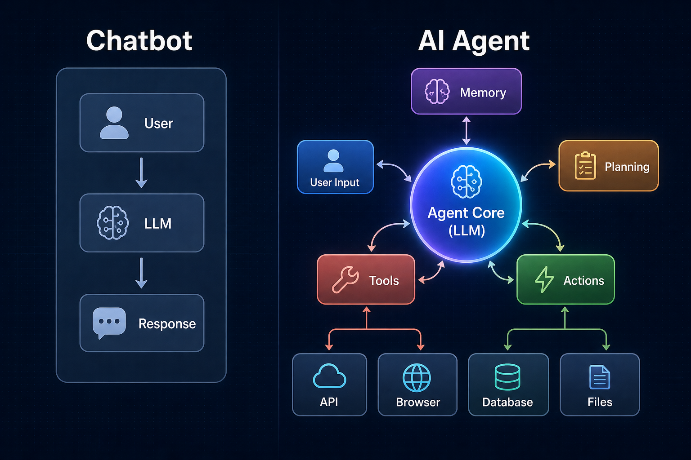
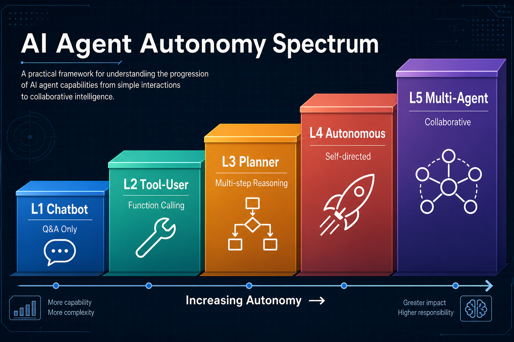
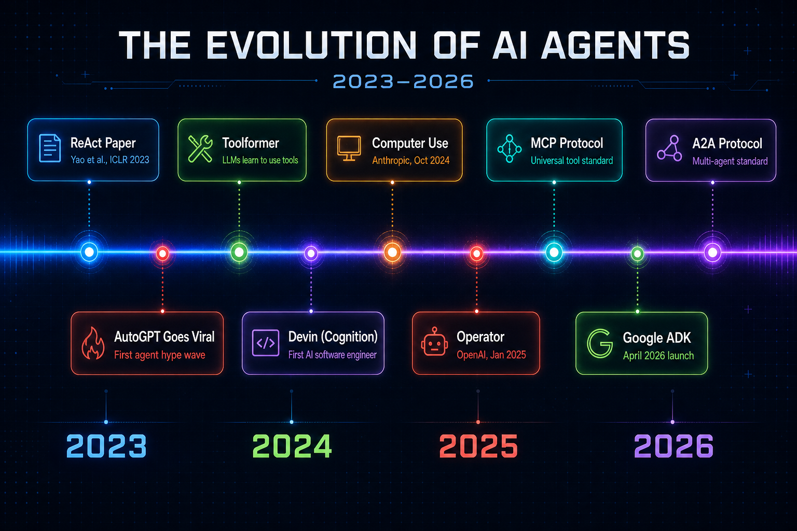

# Day 31: What is an AI Agent? — From Chatbot to Autonomous System

> **Core Question**: What makes an "AI Agent" fundamentally different from a chatbot, and why is everyone in 2026 building agents instead of just prompting LLMs?

---

## Opening

Imagine you ask someone to "plan a weekend trip to Tokyo." A chatbot gives you a nicely formatted itinerary — flights, hotels, restaurants — all from memory. An agent, on the other hand, opens your calendar to check availability, searches for flights within your budget, books the hotel, adds events to your schedule, and texts your travel companion. One generates text. The other *gets things done*.

That distinction — generating answers versus taking actions — is the heart of what makes an AI agent. By early 2026, "AI Agent" has become the dominant buzzword in the industry, with Google Trends showing explosive growth surpassing even "LLM" itself. Google launched its Agent Development Kit (ADK) in April 2026; Anthropic's Computer Use and OpenAI's Operator have been operating for over a year. The question is no longer *whether* agents matter, but *what they actually are*.

This article breaks down the anatomy of an AI agent, explains why chatbots are not agents, and maps the autonomy spectrum from simple tool-use to fully autonomous multi-agent systems.

---

## 1. Chatbot vs. Agent: The Fundamental Difference

#### Intuition: The Intern vs. The Employee

Think of a chatbot as an intern who only answers questions. You ask, they respond. They never leave their desk. An agent is a full employee — they have a desk (LLM), but they also have a phone (tools), a notebook (memory), a project plan (planning), and the authority to execute decisions (actions). When you give them a task, they figure out the steps, use the phone to call people, write notes for next time, and come back with results.


*Figure 1: A chatbot is a request-response loop. An agent wraps an LLM with Memory, Tools, Planning, and Actions — enabling autonomous interaction with the external world.*

The table below captures the key distinctions:

| Dimension | Chatbot | AI Agent |
|-----------|---------|----------|
| Core loop | Single turn: user asks, LLM answers | Multi-turn: observe, plan, act, reflect |
| External interaction | None — text in, text out | Tools, APIs, browsers, file systems |
| Memory | Only within context window | Short-term + long-term + working memory |
| Planning | None — one-shot generation | Task decomposition, multi-step reasoning |
| Autonomy | Zero — waits for user prompt | Variable — can self-initiate actions |
| Error handling | None — outputs whatever it generates | Retry, fallback, ask for clarification |

An agent is **not just an LLM with extra features bolted on**. The architectural shift is deeper: the LLM becomes a *decision-making core* inside a loop that observes the environment, reasons about what to do, executes actions, and evaluates results. This loop — often called the **agent loop** or **ReAct loop** — is what gives agents their power.

---

## 2. The Agent Loop: How Agents Actually Work

#### Intuition: The Detective's Method

A detective doesn't just hear a case and shout "the butler did it!" They observe the crime scene, form a hypothesis, gather evidence (interviews, fingerprints, records), update their theory, and repeat until confident. An AI agent works the same way — it doesn't answer in one shot. It *investigates*.

The ReAct pattern (short for **Re**asoning + **Act**ing), introduced by Yao et al. in late 2023, formalized this into a clear cycle:


*Figure 2: The four phases of the agent loop — Observe, Plan, Act, Reflect — with the LLM as the central reasoning engine.*

The cycle works like this:

1. **Observe**: Receive input from the user or environment. This could be a user message, an API response, or the result of a previous action.
2. **Plan**: The LLM reasons about what to do next — decomposing a complex task into sub-tasks, choosing which tool to use, or deciding the task is complete.
3. **Act**: Execute an action — call an API, search the web, read a file, run code, or send a message.
4. **Reflect**: Evaluate the result of the action. Did it work? Is more information needed? Should we retry with a different approach?

This loop continues until the task is done or the agent determines it cannot proceed and asks for help.

### 2.1 A Concrete Example

Consider the task: "Find the cheapest flight from Singapore to Tokyo next Friday and book it."

A chatbot would generate a paragraph about how to search for flights — completely useless.

An agent would:
1. **Observe**: Parse the request. Identify constraints: Singapore → Tokyo, next Friday, cheapest.
2. **Plan**: "I need to check the calendar for next Friday's date, then search flight comparison APIs, then present options to the user for confirmation."
3. **Act**: Call a calendar API to find the date. Call a flight search API with the parameters.
4. **Reflect**: "Got 5 results. The cheapest is $320 on Scoot. But wait — the user said 'book it,' not 'show me options.' Should I proceed or confirm first?"
5. **Plan**: "Safety policy: always confirm before spending money. Present the best option and ask."
6. **Act**: Display the result and ask for confirmation.

That pause-and-confirm behavior — the *judgment* about when to act autonomously versus when to ask — is a critical design decision in agent architecture.

---

## 3. The Five Components of an Agent

Every serious agent framework in 2026 — whether it's Google ADK, LangChain, CrewAI, or Anthropic's tool-use patterns — converges on five core components:

### 3.1 LLM Core (The Brain)

The LLM is the reasoning engine. It reads observations, decides what to do, and generates action plans. In 2026, most agents use models like GPT-5.5, Claude 4, or Gemini 3.5 as their core. The choice of model matters enormously — better reasoning models produce more reliable agents.

### 3.2 Memory (The Notebook)

Agents need memory that spans beyond a single conversation:

- **Working memory**: The current context window — what's happening right now.
- **Short-term memory**: Recent interactions within a session (often managed via conversation history or summary).
- **Long-term memory**: Persistent knowledge across sessions — stored in vector databases, knowledge graphs, or simple files.

Without memory, an agent starts fresh every time — like an employee who forgets everything overnight.

### 3.3 Tools (The Hands)

Tools are how agents interact with the external world. Common tool categories:

| Category | Examples | What it enables |
|----------|---------|-----------------|
| Web search | Brave API, Google Search | Finding current information |
| Code execution | Python sandbox, shell | Running computations |
| File I/O | Read, write, edit files | Document processing |
| Communication | Email, Slack, SMS | Reaching out to humans |
| Browser automation | Puppeteer, Playwright | Navigating websites |
| APIs | REST, GraphQL | Integrating with services |

The **MCP (Model Context Protocol)**, introduced by Anthropic in late 2024 and widely adopted by 2026, standardized how tools are described and connected to agents. Instead of custom integrations for every tool, MCP provides a universal interface — like USB for AI agents.

### 3.4 Planning (The Strategy)

Complex tasks require decomposition. Planning strategies include:

- **ReAct**: Interleave reasoning and action steps in real-time.
- **Plan-and-Execute**: Generate a full plan upfront, then execute step by step.
- **Tree-of-Thought**: Explore multiple reasoning paths and choose the best one.
- **Reflexion**: After completing a task, reflect on mistakes and retry with improved strategy.

### 3.5 Action Execution (The Legs)

The action layer takes the LLM's plan and actually *does* something. This includes function calling (structured API invocation), computer use (controlling a GUI), and code generation (writing and running scripts).

Anthropic's Computer Use (October 2024) and OpenAI's Operator (January 2025) represent a new paradigm: instead of calling specific APIs, the agent *looks at a screen* and *clicks buttons* like a human would. This is slower but far more flexible — it works with any application, not just those with APIs.

---

## 4. The Autonomy Spectrum

#### Intuition: The Driving Analogy

Not all agents are equally autonomous. Think of it like driving:

- **L1 (Chatbot)**: You're a passenger asking the driver questions. They answer but don't drive.
- **L2 (Tool-User)**: Cruise control — the car maintains speed, but you steer.
- **L3 (Planner)**: Autopilot on a highway — the car navigates, but you supervise.
- **L4 (Autonomous)**: A self-driving taxi — you give a destination, it handles everything.
- **L5 (Multi-Agent)**: A fleet of taxis coordinating to pick up everyone in the city.


*Figure 3: The five levels of AI agent autonomy, from simple Q&A to collaborative multi-agent systems.*

Most production agents in 2026 sit at L2–L3. True L4 autonomy — where you can trust an agent to complete complex tasks without supervision — remains aspirational for most use cases. The industry is actively working on reliability, safety, and evaluation to bridge this gap.

---

## 5. Agent Frameworks in 2026

The agent ecosystem has matured rapidly. Here's a snapshot of the major frameworks:

| Framework | Provider | Key Feature | Status (May 2026) |
|-----------|----------|-------------|-------------------|
| [Google ADK](https://google.github.io/adk-docs/) | Google | Code-first, multi-agent, A2A protocol | Launched April 2026 |
| [MCP](https://modelcontextprotocol.io/) | Anthropic | Universal tool interface standard | Widely adopted |
| [LangGraph](https://github.com/langchain-ai/langgraph) | LangChain | Stateful graph-based agent workflows | Production-ready |
| [CrewAI](https://github.com/crewAIInc/crewAI) | CrewAI | Role-based multi-agent collaboration | Active development |
| [AutoGen](https://github.com/microsoft/autogen) | Microsoft | Multi-agent conversation framework | v0.4 released |
| [OpenAI Agents SDK](https://github.com/openai/openai-agents-python) | OpenAI | Official OpenAI agent toolkit | Launched 2025 |

The **Google ADK** (April 2026) deserves special attention as the newest major entrant. It provides a code-first Python/TypeScript framework that natively supports multi-agent orchestration, managed tool integration, and deployment to Google Cloud's Agent Platform. Crucially, it integrates with the **A2A (Agent-to-Agent) protocol** — a new standard enabling agents built with different frameworks to communicate with each other.

---

## 6. Why Agents Fail (And What's Being Done About It)

Agents are exciting but deeply imperfect. The top failure modes:

1. **Error accumulation**: Each step has a small chance of failure. If each step succeeds with probability $p$, then after $n$ steps, the overall reliability is:

$$
R = p^n
$$

For $p = 0.95$ and $n = 10$ steps, $R = 0.95^{10} \approx 0.60$ — meaning a "95% accurate" agent completes a 10-step task successfully only 60% of the time. This is why agent reliability is so much harder than single-turn chatbot accuracy.
2. **Hallucinated tool calls**: The LLM invents parameters that don't exist or calls tools in wrong order.
3. **Infinite loops**: The agent gets stuck repeating the same action without making progress.
4. **Context window overflow**: Long agent sessions exhaust the context window, causing the agent to "forget" earlier steps.
5. **Safety violations**: Without proper guardrails, agents can take harmful actions (deleting files, sending inappropriate messages, spending money).

Research addressing these issues is active. The survey by Du et al. (2026), ["A Survey on the Optimization of Large Language Model-based Agents"](https://arxiv.org/abs/2503.12434), categorizes optimization approaches into prompt engineering, fine-tuning, and reinforcement learning for agent-specific behaviors.

---

## 7. Code Example: A Minimal Agent Loop

```python
import json

# A minimal ReAct agent loop in Python
# Requires: an LLM API client and a tool registry

def agent_loop(task: str, llm_client, tools: dict, max_steps: int = 10):
    """
    Minimal agent implementing the ReAct pattern.
    
    Args:
        task: The user's task description
        llm_client: A callable that takes a prompt and returns text
        tools: A dict of {tool_name: tool_function}
        max_steps: Safety limit to prevent infinite loops
    """
    messages = [
        {"role": "system", "content": f"""You are an agent. Solve the task step by step.
Available tools: {list(tools.keys())}

Respond in JSON format:
{{"thought": "your reasoning", "action": "tool_name", "action_input": {{...}}, "final_answer": null}}
OR if done:
{{"thought": "...", "action": null, "final_answer": "your answer"}}"""},
        {"role": "user", "content": task}
    ]
    
    for step in range(max_steps):
        response = llm_client(messages)
        decision = json.loads(response)
        
        print(f"Step {step+1} — Thought: {decision['thought']}")
        
        # Task complete?
        if decision.get("final_answer"):
            return decision["final_answer"]
        
        # Execute tool
        tool_name = decision["action"]
        tool_input = decision["action_input"]
        
        if tool_name not in tools:
            observation = f"Error: Tool '{tool_name}' not found."
        else:
            try:
                observation = tools[tool_name](**tool_input)
            except Exception as e:
                observation = f"Error: {e}"
        
        print(f"  -> Called {tool_name}({tool_input})")
        print(f"  -> Observation: {str(observation)[:200]}")
        
        # Feed observation back to the agent
        messages.append({"role": "assistant", "content": response})
        messages.append({"role": "user", "content": f"Observation: {observation}"})
    
    return "Agent reached maximum steps without completing the task."

# Example usage:
# tools = {"search_web": search_web, "read_file": read_file}
# result = agent_loop("Find the population of Singapore", my_llm, tools)
```

This minimal example shows the core loop: the LLM thinks, chooses a tool, executes it, observes the result, and loops. Production frameworks add error recovery, streaming, parallel tool calls, and human-in-the-loop checkpoints.

---

## 8. Historical Timeline


*Figure 4: Key milestones in the evolution of AI agents, from the ReAct paper (2023) to the Google ADK and A2A protocol (2026).*

The concept of "agents" in AI predates LLMs — going back to classic AI research in the 1990s. But the modern LLM-based agent era began in earnest with the ReAct paper (Yao et al., ICLR 2023), which showed that interleaving reasoning and acting dramatically improves task completion. The AutoGPT phenomenon (March 2023) demonstrated massive public interest, even if early versions were unreliable. By 2024-2025, Anthropic's Computer Use and OpenAI's Operator showed that agents could interact with real computer interfaces. And by 2026, standardized protocols (MCP, A2A) and mature frameworks (Google ADK, LangGraph) have made agent development accessible to mainstream developers.

---

## 9. Common Misconceptions

### ❌ "An agent is just a chatbot with function calling"

Function calling is a necessary but not sufficient condition. An agent also needs a *loop* — the ability to observe results, reason about them, and decide on the next action autonomously. A chatbot with function calling executes one tool per user message. An agent can chain multiple tool calls across many steps without human intervention.

### ❌ "Agents will replace all software"

Agents are powerful for open-ended, multi-step tasks. But for well-defined, deterministic workflows (calculate payroll, route network packets, render a webpage), traditional software remains faster, cheaper, and more reliable. Agents excel where flexibility and reasoning matter more than speed and predictability.

### ❌ "More autonomy is always better"

Higher autonomy means higher risk. A fully autonomous agent that books flights, sends emails, and manages your finances sounds great — until it makes a mistake. The industry is converging on **human-in-the-loop** patterns where agents act autonomously for low-risk operations but pause for confirmation before high-stakes decisions.

---

## 10. Frontier: What's New (2025-2026)

The agent field is moving fast. Here are the most significant recent developments:

1. **Google ADK (Agent Development Kit)** — Launched April 2026, Google's code-first framework for building multi-agent systems with native A2A protocol support. ([Official docs](https://google.github.io/adk-docs/))

2. **A2A (Agent-to-Agent) Protocol** — A 2026 standard enabling agents built with different frameworks to communicate and collaborate, similar to how HTTP enabled different web servers to interoperate. ([GitHub](https://github.com/google/adk-python))

3. **MCP Ecosystem Explosion** — By mid-2026, thousands of MCP servers are available, letting agents connect to virtually any SaaS product or data source through a standardized interface. ([MCP docs](https://modelcontextprotocol.io/))

4. **Agent Optimization Survey** — Du et al. (February 2026) published a comprehensive survey on optimizing LLM-based agents through prompt engineering, fine-tuning, and RL, published in ACM Computing Surveys. ([arXiv](https://arxiv.org/abs/2503.12434))

5. **Agentic AI Survey** — Abou Ali et al. (November 2025) provided a thorough taxonomy of agentic AI architectures, covering reasoning-enhanced, tool-augmented, multi-agent, and memory-augmented categories. ([Springer](https://link.springer.com/article/10.1007/s10462-025-11422-4))

---

## 11. Further Reading

### Beginner
1. [ReAct: Synergizing Reasoning and Acting in Language Models](https://arxiv.org/abs/2210.03629) — The foundational paper that started the modern agent paradigm (Yao et al., ICLR 2023)
2. [LangChain Agent Documentation](https://python.langchain.com/docs/concepts/agents/) — Practical guide to building agents with LangChain

### Advanced
1. [A Survey on the Optimization of LLM-based Agents](https://arxiv.org/abs/2503.12434) — Du et al., ACM Computing Surveys 2026
2. [Agentic AI: Architectures, Applications, and Future Directions](https://link.springer.com/article/10.1007/s10462-025-11422-4) — Abou Ali et al., AI Review 2025
3. [Agent Systems: Architectures, Applications, and Evaluation](https://arxiv.org/abs/2601.01743) — Comprehensive 2026 arXiv survey

### Papers
1. ["ReAct: Synergizing Reasoning and Acting in Language Models"](https://arxiv.org/abs/2210.03629) — Yao et al., 2022
2. ["Toolformer: Language Models Can Teach Themselves to Use Tools"](https://arxiv.org/abs/2302.04761) — Schick et al., 2023

---

## Reflection Questions

1. If an LLM's per-step accuracy is 95%, how many steps can an agent take before overall reliability drops below 50%? What does this imply for agent design?
2. Why is the MCP protocol compared to USB? What properties made USB successful as a standard, and does MCP share those properties?
3. When would you choose a Plan-and-Execute architecture over ReAct? What are the trade-offs?

---

## Summary

| Concept | One-line Explanation |
|---------|---------------------|
| AI Agent | An LLM wrapped in a loop that observes, plans, acts, and reflects — capable of autonomous multi-step task completion |
| ReAct Pattern | Interleave reasoning (thought) and action (tool use) in a cycle until task is done |
| Agent Loop | Observe → Plan → Act → Reflect → Repeat |
| MCP | Model Context Protocol — a universal standard for connecting tools to agents |
| Autonomy Spectrum | L1 (chatbot) through L5 (multi-agent), with increasing independence and risk |
| Tool Use | The ability of an agent to call external APIs, run code, browse the web, or manipulate files |
| Memory | Working, short-term, and long-term storage that lets agents maintain context across interactions |
| Planning | Task decomposition strategies (ReAct, Plan-and-Execute, Tree-of-Thought) for complex goals |

**Key Takeaway**: An AI agent is not a chatbot with extra features — it's a fundamentally different architecture where the LLM becomes the reasoning core of an autonomous loop. The agent observes its environment, plans actions, executes them through tools, and reflects on results. As frameworks mature (Google ADK, MCP, A2A) and models improve, agents are moving from research demos to production systems — but reliability, safety, and evaluation remain the critical challenges.

---

*Day 31 of 60 | LLM Fundamentals*
*Word count: ~2600 | Reading time: ~13 minutes*
