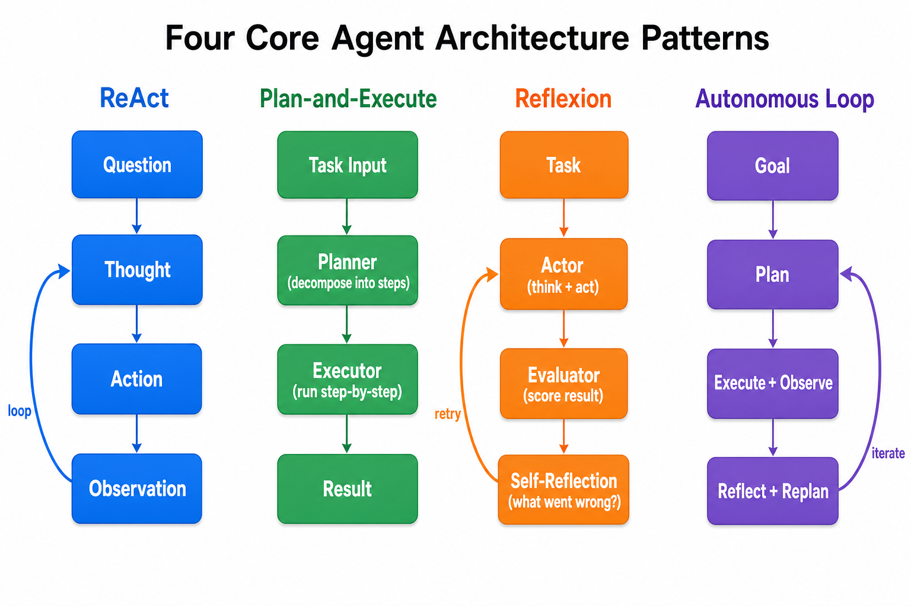
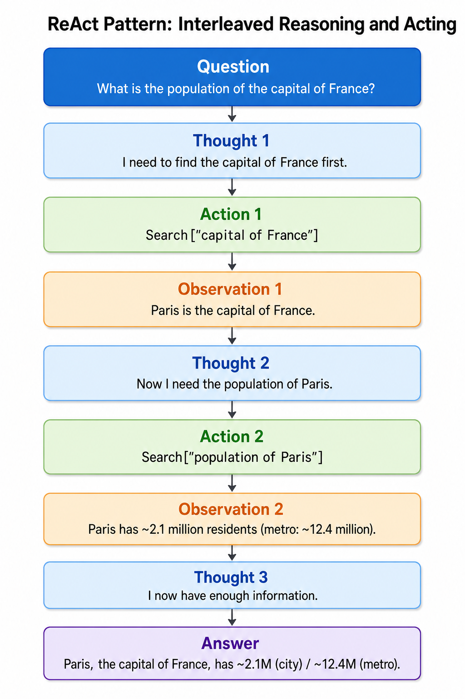
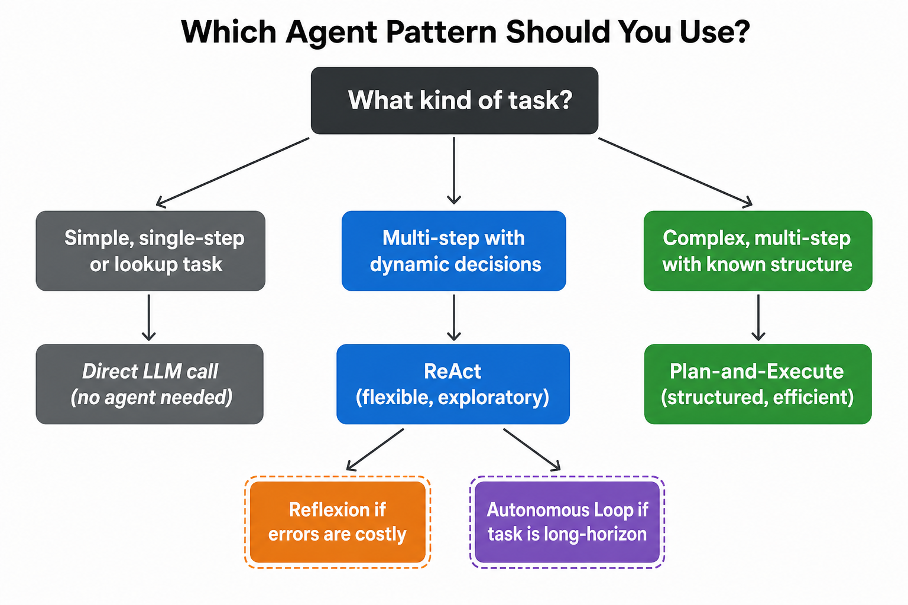
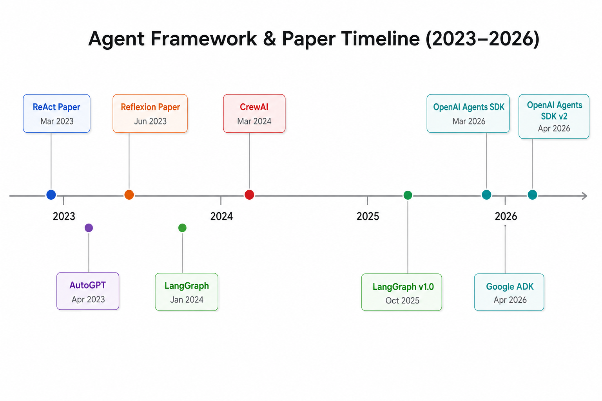

# Day 32: Agent Architecture Patterns — ReAct, Plan-and-Execute, and Beyond

> **Core Question**: How do AI agents actually think and act? What are the fundamental design patterns that make agents work — and when should you use each one?

---

## Opening

Imagine you're a detective solving a case. You could pace around the crime scene thinking deeply, then take one decisive action. Or you could bounce between investigating and thinking, adjusting your theory with every new clue. Both strategies work — but for different kinds of cases.

AI agents face the same choice. The *architecture pattern* — how an agent structures its loop of reasoning, action, and observation — is the single most important design decision you'll make when building an agentic system. Pick the wrong pattern, and your agent will either waste tokens looping endlessly or fail to handle complexity it was supposed to manage.

Today, we'll dissect the four canonical agent architecture patterns: **ReAct**, **Plan-and-Execute**, **Reflexion**, and the **Full Autonomous Loop**. By the end, you'll know not just what each pattern does, but *why* it works, *when* to use it, and *how* real frameworks implement them.

---

## 1. The Agent Loop: A Universal Primitive

Before we compare patterns, let's establish what they all share.

#### Intuition: The Recipe Analogy

Every agent pattern is like cooking from a recipe, but with different levels of rigidity:

- **ReAct** is like taste-as-you-go cooking: you taste, adjust, taste again.
- **Plan-and-Execute** is like meal prep Sunday: plan all meals upfront, then execute.
- **Reflexion** is like writing a restaurant review after eating: you reflect on what went wrong and cook better next time.
- **Full Autonomous** is like running a restaurant kitchen: plan, cook, taste, adjust, re-plan — all day long.

At their core, every agent follows a loop:

$$
\begin{aligned}
\text{observe} &\rightarrow \text{think} \rightarrow \text{act} \rightarrow \text{observe} \rightarrow \cdots
\end{aligned}
$$

The differences lie in *how* each step is structured, *when* planning happens, and *whether* the agent can reflect on its own failures.


*Figure 1: The four canonical agent architecture patterns. Each structures the observe-think-act loop differently.*

---

## 2. Pattern 1: ReAct — Reasoning + Acting Interleaved

### The Core Idea

ReAct (short for **Re**asoning + **Act**ing), introduced by Yao et al. in 2023, interleaves *thoughts* (internal reasoning) with *actions* (tool calls) in a single trace. Instead of thinking everything through first, the agent thinks one step, acts, observes the result, then thinks again.

The original paper: ["ReAct: Synergizing Reasoning and Acting in Language Models"](https://arxiv.org/abs/2210.03629) (Yao et al., ICLR 2023).

#### Intuition: The Explorer

Think of ReAct like exploring a new city without a map. You walk one block, look around, decide which direction looks promising, walk another block, and repeat. You don't plan the entire route upfront — you adapt as you go.

### How It Works

A ReAct trace looks like this:

1. **Thought**: "I need to find the capital of France."
2. **Action**: `Search["capital of France"]`
3. **Observation**: "Paris is the capital of France."
4. **Thought**: "Now I need Paris's population."
5. **Action**: `Search["population of Paris"]`
6. **Observation**: "Paris has ~2.1 million residents."
7. **Thought**: "I have enough information."
8. **Answer**: "Paris, the capital of France, has ~2.1 million residents."


*Figure 2: A complete ReAct trace. Notice how reasoning and action alternate — the agent never plans more than one step ahead.*

> **Deep Dive: How Do Thoughts Arise?**
>
> In the trace above, Thought 2 and Thought 3 are *not* pre-planned — the LLM generates them **on the fly** after seeing the previous Observation.
>
> In each loop iteration, the LLM sees the full history so far (Question + all prior Thoughts/Actions/Observations), then produces a new Thought + Action based on that context. The tool executes and returns an Observation, which gets appended to the history for the next round.
>
> This means:
> - The LLM only thinks **one step ahead** at a time — it doesn't pre-compute future Thoughts
> - Each Thought is a **reaction to the latest Observation** (which is exactly where the name ReAct comes from — Reason + Act interleaved)
> - If Observation 2 had returned "Population data unavailable for Paris," Thought 3 would have become "Try a different data source" instead of "I have enough information"
>
> This is precisely where ReAct's flexibility comes from — each step's reasoning depends on what was actually observed, not on a plan locked in at the start. Contrast this with Plan-and-Execute, which lists all steps upfront and then executes mechanically.

### Strengths and Weaknesses

| Aspect | ReAct |
|--------|-------|
| **Flexibility** | Excellent — adapts to unexpected observations |
| **Token cost** | High — every step requires an LLM call |
| **Planning depth** | Shallow — only thinks one step ahead |
| **Best for** | Open-ended tasks, exploration, debugging |
| **Worst for** | Structured multi-step processes with known steps |

### Pseudocode

```python
def react_agent(question, tools, llm, max_steps=10):
    context = f"Question: {question}\n"
    for step in range(max_steps):
        # LLM generates a Thought + Action
        response = llm.generate(context)
        thought, action = parse_thought_action(response)
        context += f"Thought: {thought}\nAction: {action}\n"
        
        if action.type == "Finish":
            return action.answer
        
        # Execute tool and observe
        observation = tools.execute(action)
        context += f"Observation: {observation}\n"
    
    return "Failed to complete within max steps."
```

---

## 3. Pattern 2: Plan-and-Execute — Structure First, Then Act

### The Core Idea

Plan-and-Execute separates the agent into two distinct phases: a *planner* that decomposes the task into a sequence of steps, and an *executor* that runs each step. The planner runs once (or occasionally re-plans), while the executor handles the grunt work.

This pattern gained prominence through the ["Plan-and-Solve Prompting"](https://arxiv.org/abs/2305.04091) paper (Wang et al., 2023) and became a standard pattern in frameworks like LangGraph.

#### Intuition: The Project Manager

Think of Plan-and-Execute like a project manager who creates a detailed project plan on Monday, then hands tasks to engineers one by one. The PM doesn't micromanage each keystroke — they set the structure and let execution follow.

### How It Works

1. **Plan**: LLM decomposes the goal into ordered subtasks.
2. **Execute**: For each subtask, the agent runs the appropriate tool or LLM call.
3. *(Optional) Re-plan*: If a step fails or new information arrives, re-invoke the planner.

```
Task: "Compare GPU prices across 3 vendors and recommend the best deal"
  ↓
Plan:
  Step 1: Search NVIDIA store for RTX 5080 price
  Step 2: Search Amazon for RTX 5080 price
  Step 3: Search Newegg for RTX 5080 price  
  Step 4: Compare all prices and recommend
  ↓
Execute Step 1 → Execute Step 2 → Execute Step 3 → Execute Step 4 → Answer
```

### Strengths and Weaknesses

| Aspect | Plan-and-Execute |
|--------|-----------------|
| **Efficiency** | Good — fewer LLM calls than ReAct (3-4 vs 5-7 per task) |
| **Predictability** | High — plan is visible before execution |
| **Flexibility** | Lower — locked into the initial plan unless re-planning is triggered |
| **Best for** | Structured tasks with known decomposition |
| **Worst for** | Highly unpredictable environments where plans quickly become stale |

### Why It Saves Tokens

A ReAct agent handling customer support might make 5-7 LLM calls per interaction as it reasons and acts in loops. A Plan-and-Execute agent often cuts this to 3-4 calls — one for planning, then execution. The planning call is more expensive per token, but total calls drop significantly.

### The Re-planning Trigger

A critical design choice in Plan-and-Execute is *when to re-plan*. Three common strategies:

1. **Never re-plan** — simplest, cheapest, but brittle if any step fails
2. **Re-plan on failure** — if a step returns an error or impossible result, invoke the planner again with the partial results as context
3. **Periodic re-planning** — after every N steps, re-evaluate the remaining plan

Strategy 2 is the most common in production systems. It's also why Plan-and-Execute often converges with the Autonomous Loop pattern at higher complexity levels — the boundary blurs when re-planning becomes frequent.

---

## 4. Pattern 3: Reflexion — Learning from Failure

### The Core Idea

Reflexion, introduced by Shinn et al. (NeurIPS 2023), adds a *self-reflection* layer on top of any base agent (typically ReAct). When the agent fails, it doesn't just retry — it generates a verbal explanation of *what went wrong*, stores this in memory, and uses it to avoid the same mistakes.

Paper: ["Reflexion: Language Agents with Verbal Reinforcement Learning"](https://arxiv.org/abs/2303.11366) (Shinn et al., NeurIPS 2023).

#### Intuition: The Student Who Keeps a Mistake Journal

Imagine a student who, after every failed exam, writes down exactly what they misunderstood. Before the next attempt, they review their mistake journal. Reflexion works exactly like this — it's "verbal reinforcement learning" because the agent reinforces itself with *words*, not weight updates.

### How It Works

1. **Attempt**: The agent tries the task using ReAct (or any base pattern).
2. **Evaluate**: An evaluator (can be the LLM itself) scores the result.
3. **Reflect**: If the score is low, the agent generates a self-reflection: *"I failed because I searched for the wrong entity. Next time I should verify the entity type first."*
4. **Store**: The reflection is added to the agent's episodic memory.
5. **Retry**: The agent attempts again, now with reflections as additional context.

$$
\begin{aligned}
\text{Reflection}_k &= \text{LLM}(\text{trace}_k, \text{score}_k, \text{prompt}_{\text{reflect}}) \\
\text{Context}_{k+1} &= \text{Context}_0 \cup \{\text{Reflection}_1, \ldots, \text{Reflection}_k\}
\end{aligned}
$$

### When Reflexion Helps (and When It Doesn't)

Reflexion shines when:
- Tasks have clear success/failure signals (code execution, game scores)
- Failures are *informative* — understanding why you failed helps next time
- You can afford multiple attempts

Reflexion struggles when:
- The task is so hard that even after reflection, the agent makes *different* mistakes each time
- There's no clear evaluation signal
- Single-attempt scenarios (you can't retry a production database migration)

### The Verbal Reinforcement Learning Connection

Reflexion is called "verbal reinforcement learning" because it mirrors traditional RL — but instead of updating model weights via gradient descent, the agent updates a text-based memory buffer. The "reward signal" is the evaluation score, and the "policy update" is the self-reflection text. This is a profound insight: *language itself becomes the medium of learning*, not numerical parameters. The trade-off is that text-based updates are noisier and less systematic than gradient updates — but they're interpretable, composable, and require no model retraining.

---

## 5. Pattern 4: Full Autonomous Loop

### The Core Idea

The Full Autonomous Loop combines planning, execution, *and* reflection into a continuous cycle. Unlike Plan-and-Execute (which plans once), this pattern re-plans after every execution round based on new observations. Unlike Reflexion (which reflects only on failure), this pattern reflects continuously.

#### Intuition: The Startup CEO

A startup CEO doesn't plan the entire year on January 1st. They plan the quarter, execute for a month, review metrics, adjust the plan, execute again, and repeat. The Full Autonomous Loop works the same way — it's a continuous cycle of plan → execute → reflect → re-plan.

### How It Works

```
Goal: "Build a competitor analysis report for the AI coding tools market"
  ↓
[Plan] Decompose into: research market → identify tools → analyze features → write report
  ↓
[Execute] Research market → observe findings
  ↓
[Reflect] "Market is shifting toward agentic tools. I should adjust my analysis framework."
  ↓
[Re-plan] Add subtask: analyze agentic coding capabilities
  ↓
[Execute] Continue with adjusted plan...
  ↓
[Reflect] "Report is getting too long. Focus on top 5 tools only."
  ↓
[Re-plan] Narrow scope...
  ↓
[Complete] Final report delivered
```

### The Danger: Infinite Loops

The biggest risk of full autonomous loops is the agent getting stuck — re-planning forever, chasing its own tail, or spiraling into increasingly niche subtasks. Mitigations include:

- **Maximum iteration limits** (hard cap on loop count)
- **Progress checks** (require measurable progress per iteration)
- **Human-in-the-loop checkpoints** (pause for approval every N steps)
- **Budget constraints** (stop when token cost exceeds threshold)

---

## 6. Comparing the Patterns

| Pattern | Planning | Execution | Reflection | Token Cost | Reliability |
|---------|----------|-----------|------------|------------|-------------|
| **ReAct** | Implicit, one-step | Interleaved | None | High | Medium |
| **Plan-and-Execute** | Explicit, upfront | Sequential | None | Medium | High |
| **Reflexion** | Implicit (base agent) | Interleaved | On failure | Very High | Medium-High |
| **Autonomous Loop** | Continuous re-planning | Iterative | Continuous | Highest | Variable |

### Key Trade-off: Flexibility vs. Efficiency

- **More flexible** (ReAct, Autonomous) → handles surprises better but costs more
- **More structured** (Plan-and-Execute) → efficient but brittle when plans break
- **More reflective** (Reflexion, Autonomous) → learns from failure but burns tokens


*Figure 3: A decision guide for choosing the right agent architecture pattern based on task characteristics.*

---

## 7. Real Framework Implementations

### LangGraph (LangChain)

[LangGraph](https://github.com/langchain-ai/langgraph), released as v1.0 in October 2025 and now the most widely adopted agent orchestration framework, implements all four patterns as graph-based workflows. Its core abstraction is a *state graph* where nodes are agent steps and edges are transitions.

LangGraph provides prebuilt patterns:
- `create_react_agent` — ready-to-use ReAct loop
- Plan-and-Execute graph — planner node + executor node
- Reflexion — built-in evaluation and retry cycles

### OpenAI Agents SDK

[OpenAI's Agents SDK](https://openai.github.io/openai-agents-python/), released in March 2026 and updated to v2 in April 2026 with native sandbox execution, takes a minimal-primitives approach. It provides just three primitives: Agents, Handoffs, and Guardrails. The ReAct loop is the default pattern; more complex architectures are composed through agent handoffs.

### Google ADK

[Google's Agent Development Kit (ADK)](https://github.com/google/adk-python), introduced in April 2026, integrates natively with Google Cloud and Gemini. It favors Plan-and-Execute as the default pattern, reflecting Google's focus on structured enterprise workflows.

### Anthropic's Approach

Anthropic's [Claude Computer Use](https://www.anthropic.com/news/claude-computer-use) (March 2026 GA) implements an Autonomous Loop pattern where Claude directly controls a computer — clicking, typing, and navigating applications. This is the most aggressive form of agent autonomy currently in production.

---

## 8. Frontier: What's New (2025–2026)

The agent architecture landscape is evolving rapidly:

1. **OpenAI Agents SDK v2 (April 2026)** — Added native sandbox execution and a model-native harness, making long-running autonomous agents safer for enterprise use. ([OpenAI blog](https://openai.com/index/the-next-evolution-of-the-agents-sdk/), April 2026)

2. **Google ADK (April 2026)** — Google's answer to the agent SDK race, with deep integration into Gemini and Google Cloud services. Supports multi-agent orchestration out of the box.

3. **LangGraph reaches stable production status (Q1 2026)** — Now running production workloads with built-in checkpointing and subgraph composition. ([LangChain blog](https://blog.langchain.com/langchain-langgraph-1dot0/), October 2025)

4. **Anthropic Claude Computer Use GA (March 2026)** — Claude can now autonomously control desktop applications, representing the most ambitious autonomous loop deployment in production. ([CNBC report](https://www.cnbc.com/2026/03/24/anthropic-claude-ai-agent-use-computer-finish-tasks.html), March 2026)

5. **ReAcTree (November 2025)** — A hierarchical variant of ReAct that organizes agent reasoning into tree structures with control flow, improving performance on long-horizon tasks. ([arXiv:2511.02424](https://arxiv.org/abs/2511.02424))

6. **"Agentic AI: Architectures, Taxonomies, and Evaluation" survey (January 2026)** — A comprehensive taxonomy covering single-agent and multi-agent patterns, formalizing the field. ([arXiv:2601.01743](https://arxiv.org/abs/2601.01743))


*Figure 4: Timeline of key agent frameworks and papers from 2023 to mid-2026.*

---

## 9. Common Misconceptions

### ❌ "ReAct is always better than Plan-and-Execute"

No. ReAct's flexibility comes at a cost — more LLM calls, higher latency, and less predictable behavior. For structured tasks (e.g., "fetch data from these 3 APIs, merge, and summarize"), Plan-and-Execute is both cheaper and more reliable.

### ❌ "Autonomous agents can run forever without supervision"

In theory, yes. In practice, autonomous agents drift, hallucinate goals, and spiral into useless loops. Every production autonomous agent needs guardrails: iteration limits, budget caps, and human checkpoints.

### ❌ "You must pick one pattern for your entire system"

Real systems often *compose* patterns. A common architecture uses Plan-and-Execute for the outer loop, ReAct for individual step execution, and Reflexion for high-stakes steps where errors are costly.

---

## 10. Code Example: ReAct Agent in Python

```python
import json
from typing import List, Dict, Optional

class Tool:
    """A simple tool the agent can call."""
    def __init__(self, name: str, description: str, func):
        self.name = name
        self.description = description
        self.func = func

class ReActAgent:
    """A minimal ReAct agent that interleaves reasoning and acting."""
    
    SYSTEM_PROMPT = """You are a ReAct agent. For each step:
1. Output "Thought: <your reasoning>"
2. Output "Action: <tool_name>(<input>)" 
3. Wait for observation
4. Repeat until you can answer with "Action: Finish(<answer>)"

Available tools:
{tool_descriptions}"""
    
    def __init__(self, llm, tools: List[Tool], max_iterations: int = 8):
        self.llm = llm  # Any LLM client with a .generate() method
        self.tools = {t.name: t for t in tools}
        self.max_iterations = max_iterations
    
    def run(self, question: str) -> str:
        tool_descs = "\n".join(
            f"- {t.name}: {t.description}" for t in self.tools.values()
        )
        messages = [
            {"role": "system", "content": self.SYSTEM_PROMPT.format(
                tool_descriptions=tool_descs
            )},
            {"role": "user", "content": question}
        ]
        
        for _ in range(self.max_iterations):
            response = self.llm.generate(messages)
            messages.append({"role": "assistant", "content": response})
            
            # Parse action from response
            action = self._parse_action(response)
            if action is None:
                continue
            
            if action["tool"] == "Finish":
                return action["input"]
            
            # Execute tool
            if action["tool"] in self.tools:
                observation = self.tools[action["tool"]].func(action["input"])
            else:
                observation = f"Error: Unknown tool '{action['tool']}'"
            
            messages.append({
                "role": "user", 
                "content": f"Observation: {observation}"
            })
        
        return "Agent exceeded maximum iterations without completing."
    
    def _parse_action(self, text: str) -> Optional[Dict]:
        """Extract action from LLM response."""
        for line in text.split("\n"):
            if line.startswith("Action:"):
                # Parse "Action: tool_name(input)"
                content = line[len("Action:"):].strip()
                paren_idx = content.find("(")
                if paren_idx > 0:
                    tool = content[:paren_idx]
                    inp = content[paren_idx+1:-1]  # strip parentheses
                    return {"tool": tool, "input": inp}
        return None


# --- Example usage ---
def fake_search(query: str) -> str:
    """Simulated search tool for demonstration."""
    db = {
        "capital of France": "Paris is the capital and largest city of France.",
        "population of Paris": "Paris city: ~2.1M (2025). Metro area: ~12.4M.",
    }
    return db.get(query.lower(), f"No results found for '{query}'.")

tools = [
    Tool("Search", "Search the web for information", fake_search),
]
# agent = ReActAgent(llm=my_llm_client, tools=tools)
# result = agent.run("What is the population of the capital of France?")
```

---

## 11. Further Reading

### Foundational Papers

| Paper | Year | Contribution |
|-------|------|-------------|
| ["ReAct: Synergizing Reasoning and Acting in Language Models"](https://arxiv.org/abs/2210.03629) | 2023 | The ReAct pattern |
| ["Reflexion: Language Agents with Verbal Reinforcement Learning"](https://arxiv.org/abs/2303.11366) | 2023 | Self-reflection for agents |
| ["Plan-and-Solve Prompting"](https://arxiv.org/abs/2305.04091) | 2023 | Structured planning decomposition |
| ["Tree of Thoughts"](https://arxiv.org/abs/2305.10601) | 2023 | Search-based reasoning over thought trees |

### Surveys and Taxonomies

1. ["Agentic AI: Architectures, Taxonomies, and Evaluation"](https://arxiv.org/abs/2601.01743) — Comprehensive 2026 survey covering single-agent and multi-agent patterns
2. ["AI Agent Systems: Architectures, Applications, and Evaluation"](https://arxiv.org/abs/2601.12560) — Taxonomy of agent components and orchestration patterns (January 2026)

### Frameworks and Tools

1. [LangGraph](https://github.com/langchain-ai/langgraph) — Graph-based agent orchestration (v1.0, October 2025)
2. [OpenAI Agents SDK](https://openai.github.io/openai-agents-python/) — Minimal-primitives agent framework (March 2026)
3. [Google ADK](https://github.com/google/adk-python) — Google's agent development kit (April 2026)
4. [Google Cloud: Choose a Design Pattern for Agentic AI](https://docs.cloud.google.com/architecture/choose-design-pattern-agentic-ai-system) — Google's official architecture guide

---

## Reflection Questions

1. Why does ReAct struggle with tasks that require long-horizon planning? What specific failure mode does this create?
2. If Reflexion's self-reflections are generated by the same LLM that made the error, how can we trust the reflection quality? What could go wrong?
3. When would you compose multiple patterns (e.g., Plan-and-Execute outer loop with ReAct inner steps) instead of using a single pattern? What are the trade-offs?

---

## Summary

| Concept | One-line Explanation |
|---------|---------------------|
| ReAct | Interleave thinking and acting; adapt step-by-step like exploring without a map |
| Plan-and-Execute | Decompose upfront, then execute sequentially; like a project manager's Gantt chart |
| Reflexion | Add self-reflection after failure; like keeping a mistake journal to learn from errors |
| Autonomous Loop | Continuous plan-execute-reflect cycle; like a startup CEO running quarterly reviews |
| Pattern composition | Real systems combine multiple patterns at different levels of the architecture |
| Guardrails | Every autonomous agent needs iteration limits, budget caps, and human checkpoints |

**Key Takeaway**: There is no single "best" agent architecture pattern. The right choice depends on your task's structure, your tolerance for cost and latency, and how predictable your environment is. Most production systems compose multiple patterns — using structure where possible and flexibility where necessary. Start with the simplest pattern that could work, then add complexity only when the task demands it.

---

*Day 32 of 60 | LLM Fundamentals*
*Word count: ~3200 | Reading time: ~16 minutes*
