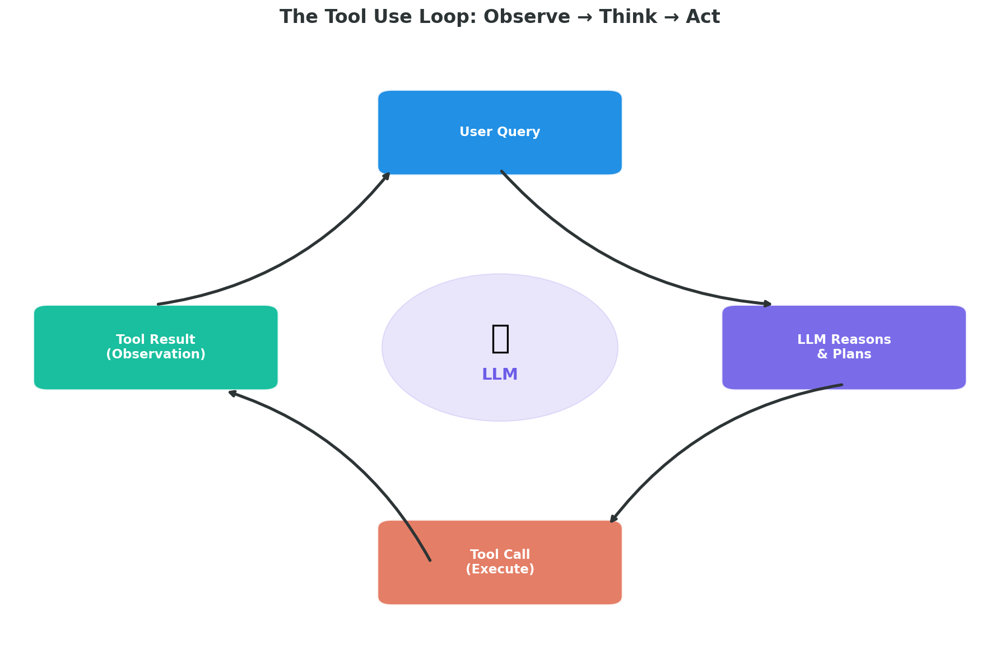
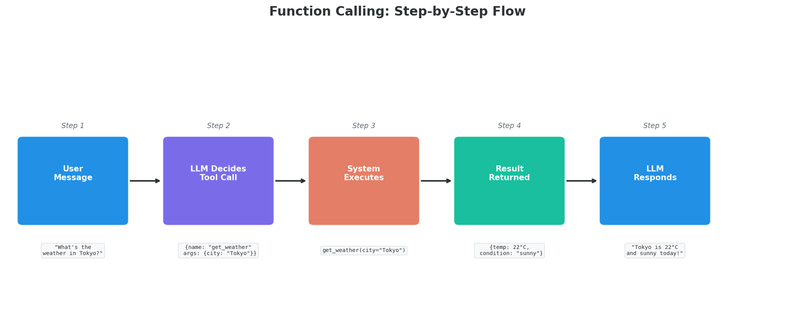
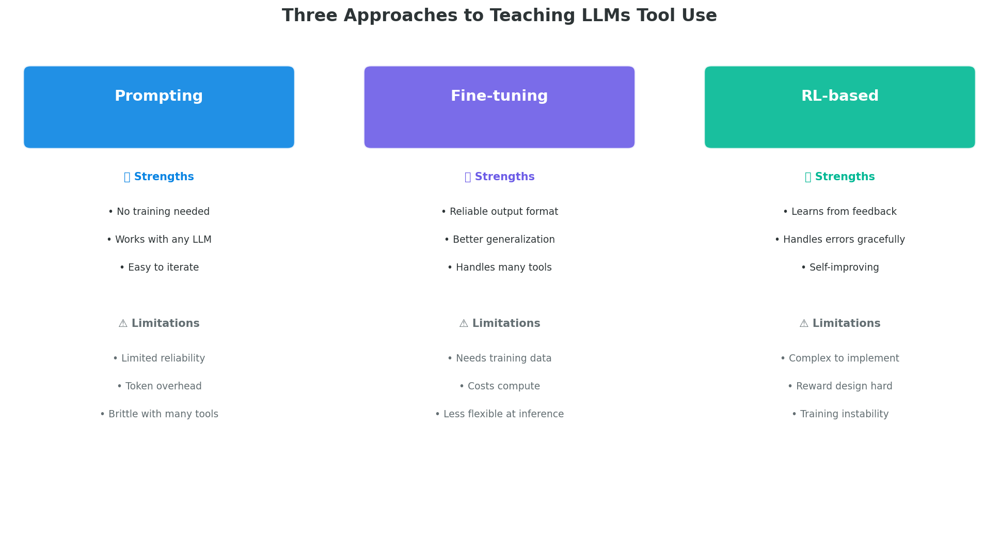
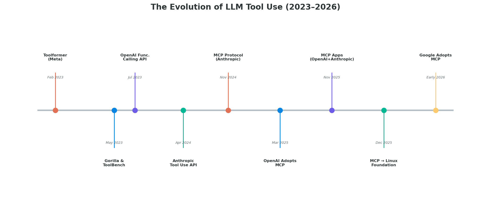

# Day 33: Tool Use — How LLMs Reach Beyond Their Training Data

> **Core Question**: How do LLMs call external functions, APIs, and tools to interact with the real world — and why is this the single capability that turned chatbots into agents?

---

## Opening

Imagine you're a brilliant librarian who has memorized every book ever written. Someone asks you: "What's the weather in Tokyo right now?" You can describe what weather *is*, explain meteorological systems, even recite historical weather patterns. But you cannot tell them the *current* temperature — because you're locked in a room with no windows.

That's exactly the situation an LLM is in. It has absorbed vast knowledge from training data, but it cannot look up live information, run calculations precisely, access databases, or take actions in the world. Tool use is the window we open for it.

Before 2023, LLMs were impressive text generators. After tool use became standard, they became *agents* — systems that can reason about what they need, request it, and act on the results. This shift is arguably more important than any model size increase in the same period.

---

## 1. What Is Tool Use?

#### Intuition: The Chef and Their Kitchen

Think of an LLM as a master chef who has memorized every recipe. The chef can *describe* how to make a perfect soufflé, but to actually make one, they need tools: an oven, a whisk, ingredients from the fridge. Tool use is giving the chef access to the kitchen. The chef decides *what* tool to use and *how*, but the tools do the actual physical work.

Formally, **tool use** (also called **function calling** or **tool calling**) means giving an LLM the ability to:

1. **Decide** when it needs external help (a calculation, a web search, a database query)
2. **Specify** which tool to call and with what arguments
3. **Receive** the tool's output and incorporate it into its response
4. **Repeat** if needed (multi-step tool use)

### The Tool Use Loop


*Figure 1: The core loop — User Query triggers LLM reasoning, which may produce a tool call. The tool executes and returns a result. The LLM then decides whether to respond or call another tool.*

This loop is the fundamental building block of every AI agent. In Day 31 we saw the ReAct pattern; here we zoom into the *mechanism* that makes it work.

---

## 2. Function Calling: The API Mechanism

#### Intuition: Ordering at a Restaurant

Function calling is like ordering at a restaurant. You (the LLM) don't cook the food yourself. You read the menu (the tool schema), decide what you want, and place an order with specific parameters ("steak, medium rare, no sauce"). The kitchen (the external system) prepares it and sends it back. You then serve it to the customer with your own presentation.

### How It Works Step by Step


*Figure 2: The five steps of a function call — from user message to final LLM response.*

Here's what happens in detail:

**Step 1 — User sends a message.** "What's the weather in Tokyo?"

**Step 2 — LLM receives available tools.** Along with the user message, the developer provides a list of tools the model can use, each defined by a JSON schema:

```json
{
  "name": "get_weather",
  "description": "Get current weather for a city",
  "parameters": {
    "type": "object",
    "properties": {
      "city": {"type": "string", "description": "City name"},
      "unit": {"type": "string", "enum": ["celsius", "fahrenheit"]}
    },
    "required": ["city"]
  }
}
```

**Step 3 — LLM decides to call a tool.** Instead of generating a text response, the model outputs a structured tool call:

```json
{
  "name": "get_weather",
  "arguments": {"city": "Tokyo", "unit": "celsius"}
}
```

**Step 4 — Developer executes the function.** The LLM doesn't run the code. The *developer's code* calls the actual weather API and returns the result:

```json
{"temperature": 22, "condition": "sunny", "humidity": 65}
```

**Step 5 — LLM generates final response.** "Tokyo is currently 22°C and sunny with 65% humidity."

### Key Design Decision: The LLM Doesn't Execute

This is worth emphasizing: the LLM **never runs the tool itself**. It outputs a structured request, and the surrounding application code executes it. This is a critical safety boundary — the model can request actions, but the developer controls which requests are actually carried out.

---

## 3. The Major API Providers

### Comparison of Tool Calling APIs

| Feature | OpenAI | Anthropic | Google Gemini |
|---------|--------|-----------|---------------|
| **API name** | Function Calling | Tool Use | Function Calling |
| **Launched** | July 2023 | April 2024 | Late 2023 |
| **Parallel calls** | Yes (default on) | Yes | Yes |
| **Strict mode** | Yes (structured outputs) | Yes (tool_choice) | Yes |
| **Forced tool use** | `tool_choice: required` | `tool_choice: any` | `function_calling_config` |
| **Schema format** | JSON Schema | JSON Schema | JSON Schema |

### OpenAI Function Calling

OpenAI was first to popularize structured function calling in July 2023. Key features:

- **Parallel function calling**: The model can call multiple tools in a single response (e.g., look up weather in three cities simultaneously)
- **Strict mode**: With `strict: true`, the model is guaranteed to produce output conforming to your JSON schema exactly — no missing fields, no wrong types
- **Structured outputs**: Since August 2024, function calling leverages the structured outputs infrastructure for reliability

```python
from openai import OpenAI
client = OpenAI()

tools = [{
    "type": "function",
    "function": {
        "name": "get_weather",
        "description": "Get current weather for a city",
        "parameters": {
            "type": "object",
            "properties": {
                "city": {"type": "string"}
            },
            "required": ["city"]
        },
        "strict": True  # Guaranteed schema compliance
    }
}]

response = client.chat.completions.create(
    model="gpt-4.1",
    messages=[{"role": "user", "content": "Weather in Tokyo?"}],
    tools=tools
)

# Check if model wants to call a tool
if response.choices[0].message.tool_calls:
    tool_call = response.choices[0].message.tool_calls[0]
    print(tool_call.function.name)      # "get_weather"
    print(tool_call.function.arguments)  # '{"city": "Tokyo"}'
```

### Anthropic Tool Use

Anthropic's approach is similar but with some design differences:

- **`tool_choice`**: Can force the model to use a specific tool (`{"type": "tool", "name": "get_weather"}`) or any tool (`{"type": "any"}`)
- **Rich tool results**: Tool results can include images, not just text
- **Thinking integration**: In extended thinking mode, the model reasons about which tool to use before calling

### Google Gemini Function Calling

Google's Gemini models support function calling with:
- **Automatic function resolution**: Can suggest which function to use based on conversation context
- **Function calling config**: Fine-grained control over whether to allow, disallow, or force function calls

---

## 4. How Do Models Learn Tool Use?

#### Intuition: Teaching Someone to Use a Library

Imagine teaching a programmer to use a new API library. You could: (a) just hand them the documentation and hope they figure it out (prompting), (b) walk them through examples and let them practice (fine-tuning), or (c) let them try, give feedback on mistakes, and let them improve through trial and error (reinforcement learning).


*Figure 3: Prompting, fine-tuning, and RL-based approaches each have distinct trade-offs in reliability, flexibility, and implementation complexity.*

### Approach 1: In-Context Learning (Prompting)

The simplest approach: include tool descriptions in the system prompt, and the model figures out how to use them from its pre-training.

- **Pros**: Zero additional training, works immediately with any model
- **Cons**: Reliability drops with many tools (typically degrades above 10-20 tools), consumes context tokens, format compliance isn't guaranteed
- **Best for**: Prototyping, small tool sets, models already fine-tuned for tool use

### Approach 2: Supervised Fine-tuning

Train the model on examples of correct tool use — conversations where the model correctly decides when and how to call tools.

Key work: **Toolformer** (Meta, February 2023, [arXiv:2302.04761](https://arxiv.org/abs/2302.04761)) showed that LLMs could teach themselves to use tools by inserting API calls into their training data. The model learned to predict *where* and *which* tool to use.

Later, **TL-Training** (Ye et al., December 2024, [arXiv:2412.15495](https://arxiv.org/abs/2412.15495)) proposed a task-feature-based framework that improves tool-use training by decomposing tool interactions into task features, achieving better generalization to unseen tools.

- **Pros**: Reliable format compliance, better generalization to new tools
- **Cons**: Requires curated training data, computational cost of fine-tuning
- **Best for**: Production deployments with known tool sets

### Approach 3: Reinforcement Learning

Train the model with feedback: reward successful tool use, penalize failures.

Key work: **"From Exploration to Mastery"** (October 2024, [arXiv:2410.08197](https://arxiv.org/abs/2410.08197)) enabled LLMs to master tools through self-driven interactions — the model explores a tool's capabilities through trial and error, learning from execution feedback.

**"Self-Training for Tool-Use Without Demonstrations"** (February 2025, [arXiv:2502.05867](https://arxiv.org/abs/2502.05867)) showed that LLMs can learn tool use through self-generated trajectories and execution feedback, without any human demonstrations.

- **Pros**: Handles errors gracefully, self-improving, most robust
- **Cons**: Complex training pipeline, reward design is non-trivial
- **Best for**: Complex tool environments where failure recovery matters

### How Modern Frontier Models Do It

In practice, all three approaches are combined. Models like GPT-4.1 and Claude 3.5 are:

1. **Pre-trained** on massive data that includes code, API documentation, and structured data
2. **Fine-tuned** on curated tool-use examples (function calling datasets)
3. **RLHF-trained** to prefer helpful tool use over hallucinated responses

This layered approach is why modern models can reliably call tools they've never seen before — they've internalized the *pattern* of "read a schema, decide whether to call, structure the arguments correctly."

---

## 5. Tool Use in Practice: Design Patterns

### Pattern 1: Single Tool Call

The simplest pattern: user asks a question, model calls one tool, returns the answer.

```
User: "What's 15% tip on $85?"
LLM: [calls calculator(85, 0.15)]
Tool: 12.75
LLM: "A 15% tip on $85 would be $12.75."
```

### Pattern 2: Parallel Tool Calls

The model calls multiple independent tools simultaneously:

```
User: "Compare weather in NYC, London, and Tokyo"
LLM: [calls get_weather("NYC"), get_weather("London"), get_weather("Tokyo")]
Tools: {NYC: 18°C, London: 12°C, Tokyo: 22°C}
LLM: "Tokyo is warmest at 22°C, followed by NYC at 18°C and London at 12°C."
```

### Pattern 3: Sequential Tool Calls (Chaining)

The model calls tools in sequence, where one call's output feeds into the next:

```
User: "Book me a restaurant near my hotel in Paris"
LLM: [calls get_hotel_location(user_id)] → "Le Marais, Paris"
LLM: [calls search_restaurants("Le Marais, Paris", cuisine="any")]
LLM: [calls book_restaurant(top_result, user_id)]
```

### Pattern 4: Error Handling and Retry

Robust tool use requires handling failures:

```
LLM: [calls get_weather("Tkoyo")] → Error: city not found
LLM: "I couldn't find 'Tkoyo'. Did you mean Tokyo?"
LLM: [calls get_weather("Tokyo")] → Success
```

This error recovery pattern is where fine-tuned and RL-trained models significantly outperform prompting-only approaches.

---

## 6. Common Tools in the LLM Ecosystem

| Tool Category | Examples | What It Enables |
|--------------|----------|-----------------|
| **Web search** | Brave API, Google Search, Tavily | Access to current information |
| **Code execution** | Python sandbox, Code Interpreter | Precise calculations, data analysis |
| **File operations** | Read, write, search files | Document processing, data extraction |
| **Database** | SQL queries, vector search | Structured data retrieval |
| **Communication** | Email, Slack, SMS | Taking actions in the world |
| **Browser** | Puppeteer, Playwright | Web navigation, form filling |
| **APIs** | Any REST/GraphQL API | Unlimited extensibility |

---

## 7. The Model Context Protocol (MCP): Standardizing Tool Access

One of the most significant developments in the tool-use ecosystem is **MCP (Model Context Protocol)**, introduced by Anthropic in November 2024. MCP aims to do for AI tools what USB did for peripherals — create a universal standard.

### Why MCP Matters

Before MCP, every AI application had to implement tool integrations differently. Want your LLM to access GitHub? Write a custom function. Want it to use Google Drive? Write another one. Each integration was bespoke.

MCP provides:
- **A standard protocol** for exposing tools to LLMs (using JSON-RPC 2.0)
- **Re-usable tool servers** — write once, use with any MCP-compatible client
- **A growing ecosystem** of pre-built servers for popular services

### Key Milestones


*Figure 4: From Toolformer (Feb 2023) to the Agentic AI Foundation (Dec 2025), the tool-use ecosystem has matured rapidly.*

- **November 2024**: Anthropic launches MCP
- **March 2025**: OpenAI adopts MCP, signaling cross-industry support
- **November 2025**: OpenAI and Anthropic jointly announce **MCP Apps**, adding a UI component to the protocol ([blog.modelcontextprotocol.io](https://blog.modelcontextprotocol.io/posts/2025-11-21-mcp-apps/))
- **December 2025**: Anthropic donates MCP to the **Agentic AI Foundation (AAIF)** under the Linux Foundation, co-founded by Anthropic, Block, and OpenAI, with Google support
- **Early 2026**: Google adopts MCP. By May 2026, MCP hits 97 million installs and 200,000+ MCP servers in the ecosystem

### Security Concerns

The rapid growth hasn't been without issues. In May 2026, researchers disclosed that 200,000 MCP servers exposed a command execution vulnerability (CVE-2026-30623), highlighting the risks of the protocol's permissive defaults. This is a reminder that standardizing tool access amplifies both capability *and* risk.

---

## 8. Frontiers and Latest Developments

### Tool Use with Reasoning Models

The latest frontier models (OpenAI o-series, Claude with extended thinking, DeepSeek-R1) combine chain-of-thought reasoning with tool use. Instead of immediately calling a tool, the model first *thinks through* whether it needs the tool, what arguments to pass, and what to do with the result. This significantly improves accuracy on complex multi-step tasks.

### Tool Learning at Scale

**ToolBench** (Qin et al., 2024, [arXiv:2307.16789](https://arxiv.org/abs/2307.16789)) from the Gorilla project created a benchmark with 16,464 real-world APIs spanning 49 categories, enabling systematic evaluation of tool-use capabilities.

### Agentic Frameworks

The tool-use ecosystem has spawned dozens of agent frameworks:
- **LangChain** ([langchain.com](https://www.langchain.com/)): Popular framework for building tool-using agents
- **CrewAI** ([crewai.com](https://www.crewai.com/)): Multi-agent orchestration with tool sharing
- **Google ADK** ([google.github.io/adk-docs](https://google.github.io/adk-docs/)): Google's Agent Development Kit (covered in Day 39)
- **OpenAI Agents SDK** ([openai.github.io/openai-agents-python](https://openai.github.io/openai-agents-python/)): OpenAI's official agent framework with built-in tool patterns

---

## 9. Code Example: Building a Tool-Using Agent

```python
import json

# Define available tools
tools = [
    {
        "name": "calculator",
        "description": "Evaluate a mathematical expression",
        "parameters": {
            "type": "object",
            "properties": {
                "expression": {
                    "type": "string",
                    "description": "Math expression to evaluate, e.g. '2 + 3 * 4'"
                }
            },
            "required": ["expression"]
        }
    },
    {
        "name": "get_stock_price",
        "description": "Get the current stock price",
        "parameters": {
            "type": "object",
            "properties": {
                "ticker": {
                    "type": "string",
                    "description": "Stock ticker symbol, e.g. 'AAPL'"
                }
            },
            "required": ["ticker"]
        }
    }
]

# Tool implementations
def execute_tool(name, args):
    """Execute a tool call and return the result."""
    if name == "calculator":
        # Safe eval for math expressions
        allowed = set("0123456789+-*/.() ")
        if all(c in allowed for c in args["expression"]):
            return str(eval(args["expression"]))
        return "Error: invalid expression"
    elif name == "get_stock_price":
        # Simulated stock price lookup
        prices = {"AAPL": 198.50, "GOOGL": 175.30, "TSLA": 245.60}
        ticker = args["ticker"].upper()
        if ticker in prices:
            return json.dumps({"ticker": ticker, "price": prices[ticker]})
        return json.dumps({"error": f"Unknown ticker: {ticker}"})
    return json.dumps({"error": f"Unknown tool: {name}"})

# Agent loop
def agent_loop(client, user_message, tools, max_turns=5):
    """Run the tool-use loop until the model gives a final answer."""
    messages = [{"role": "user", "content": user_message}]
    
    for turn in range(max_turns):
        response = client.chat.completions.create(
            model="gpt-4.1",
            messages=messages,
            tools=[{"type": "function", "function": t} for t in tools]
        )
        
        msg = response.choices[0].message
        messages.append(msg)
        
        # If no tool calls, we have the final answer
        if not msg.tool_calls:
            return msg.content
        
        # Execute each tool call and add results
        for tool_call in msg.tool_calls:
            name = tool_call.function.name
            args = json.loads(tool_call.function.arguments)
            result = execute_tool(name, args)
            
            messages.append({
                "role": "tool",
                "tool_call_id": tool_call.id,
                "content": result
            })
    
    return "Agent exceeded maximum tool-use turns."

# Usage example (pseudo-code, requires OpenAI client):
# answer = agent_loop(client,
#     "If I buy 10 shares of AAPL and 5 shares of TSLA, how much does it cost?",
#     tools)
# The model would:
# 1. Call get_stock_price("AAPL") → 198.50
# 2. Call get_stock_price("TSLA") → 245.60
# 3. Call calculator("10 * 198.50 + 5 * 245.60") → 3213
# 4. Return: "That would cost $3,213 total."
```

---

## 10. Common Misconceptions

### Misconception: "The LLM executes the tool itself"

The model *suggests* a tool call in structured JSON. Your application code must execute it and feed the result back. The model never runs code, makes HTTP requests, or accesses databases directly. This is a design choice for safety and control.

### Misconception: "More tools = better agent"

Adding too many tools degrades performance. Research shows accuracy drops when models must choose among 20+ tools, because the selection problem itself becomes harder. Best practice: keep tool sets focused (5-15 tools per agent), or use a two-stage approach where a router model first selects a relevant subset.

### Misconception: "Tool use is just prompt engineering"

While prompting can enable basic tool use with capable models, production-grade tool use requires: (a) robust schema validation, (b) error handling and retry logic, (c) rate limiting and timeout management, (d) security sandboxing. The prompt is just one component of a much larger system.

### Misconception: "Function calling and RAG are the same"

RAG (Retrieval-Augmented Generation, covered in Day 35) retrieves relevant documents to augment the model's context. Function calling lets the model *take actions*. They're complementary: a function call might trigger a RAG retrieval, but they serve different purposes.

---

## 11. Further Reading

### Foundational Papers

1. ["Toolformer: Language Models Can Teach Themselves to Use Tools"](https://arxiv.org/abs/2302.04761) (Meta, Feb 2023) — The paper that showed LLMs can self-learn tool use by inserting API calls into training data
2. ["Gorilla: Large Language Model Connected with Massive APIs"](https://arxiv.org/abs/2305.15334) (UC Berkeley, May 2023) — Demonstrated fine-tuned tool use at scale with 1,645 APIs
3. ["ToolBench: Facilitating Large Language Models to Master 16000+ Real-world APIs"](https://arxiv.org/abs/2307.16789) (Qin et al., 2024) — Large-scale benchmark for evaluating tool-use capabilities

### Recent Research

4. ["TL-Training: A Task-Feature-Based Framework for Training LLMs in Tool Use"](https://arxiv.org/abs/2412.15495) (Ye et al., Dec 2024) — Improves generalization through task-feature decomposition
5. ["From Exploration to Mastery: Enabling LLMs to Master Tools via Self-Driven Interactions"](https://arxiv.org/abs/2410.08197) (Oct 2024) — Self-driven tool learning through exploration
6. ["Self-Training LLMs for Tool-Use Without Demonstrations"](https://arxiv.org/abs/2502.05867) (Feb 2025) — Eliminates the need for human-provided tool-use examples

### Practical Resources

7. [OpenAI Function Calling Guide](https://developers.openai.com/api/docs/guides/function-calling) — Official documentation for OpenAI's function calling API
8. [Anthropic Tool Use Documentation](https://docs.anthropic.com/en/docs/build-with-claude/tool-use) — Official guide for Claude's tool use feature
9. [Model Context Protocol Specification](https://modelcontextprotocol.io/) — The open standard for connecting AI models to tools and data sources

---

## Reflection Questions

1. If an LLM can call *any* tool, what prevents it from calling dangerous ones? Who bears responsibility — the model, the developer, or the user?
2. Why might sequential tool calls be harder than parallel ones for current LLMs? What kind of reasoning does chaining require?
3. MCP standardizes tool access, but does standardization risk creating a monoculture — where one vulnerability affects every system?

---

## Summary

| Concept | One-line Explanation |
|---------|---------------------|
| Tool Use | LLMs calling external functions to access capabilities beyond text generation |
| Function Calling | The API mechanism where LLMs output structured tool requests (JSON) for developer code to execute |
| Tool Schema | JSON Schema definition of a tool's name, description, and expected parameters |
| Parallel Calling | Making multiple independent tool calls in a single model response |
| Tool Chaining | Sequential tool calls where one result feeds into the next |
| MCP | Model Context Protocol — an open standard (JSON-RPC) for connecting LLMs to tools |
| Toolformer | Meta's 2023 paper showing LLMs can self-learn tool use from API-augmented data |

**Key Takeaway**: Tool use is the bridge between language understanding and real-world action. The LLM decides *what* to do, but it never executes — that separation is both a safety feature and a design principle. With MCP standardizing how tools are described and connected, we're moving from bespoke integrations toward a universal tool ecosystem for AI agents.

---

*Day 33 of 60 | LLM Fundamentals*
*Word count: ~2900 | Reading time: ~14 minutes*
