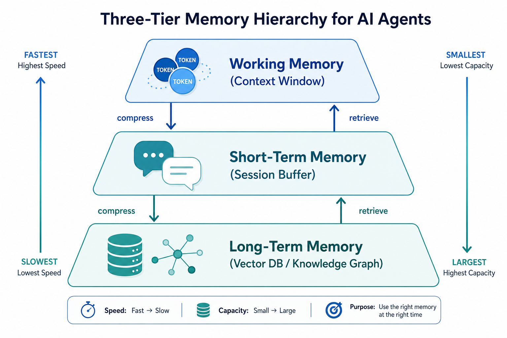
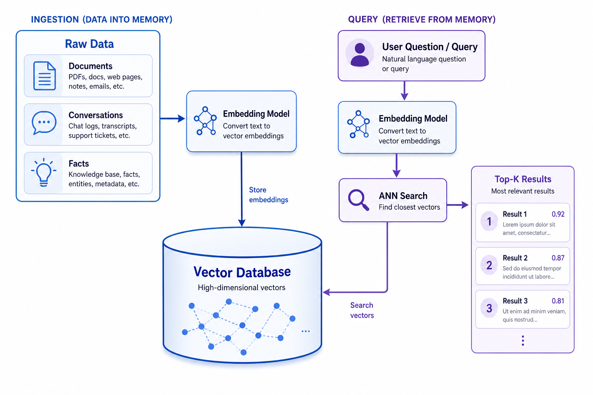
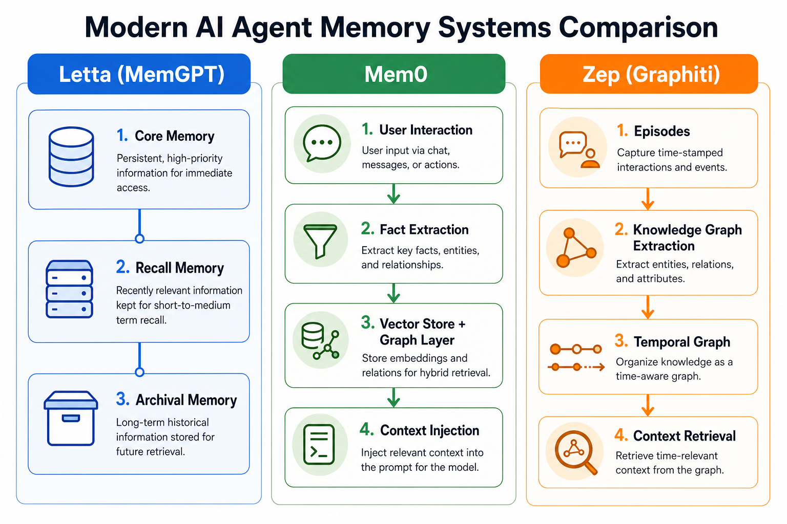
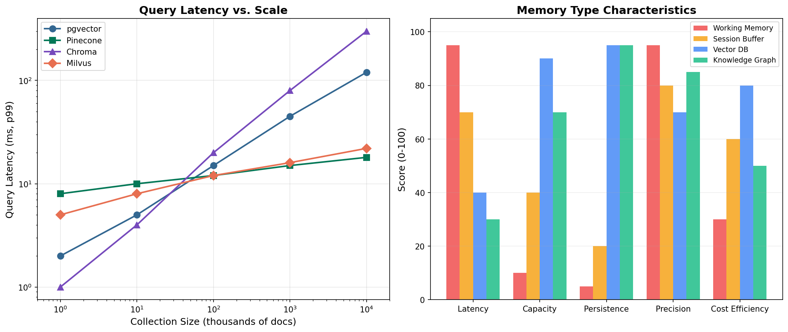

# Day 34: Memory Systems — How Agents Remember, Forget, and Learn Over Time

> **Core Question**: Why can't LLM agents remember what happened yesterday, and how do engineers build memory systems that give agents lasting knowledge across sessions?

---

## Opening

Imagine you meet someone for coffee every week. Each time, they introduce themselves from scratch, ask the same questions about your work, and forget everything you told them by the next meeting. That would be exhausting — and yet, that's exactly how most LLM-powered agents behave out of the box.

An LLM's context window is its "working memory." It holds whatever is currently in the conversation, up to its token limit (128K, 200K, or 1M tokens depending on the model). Once the conversation ends, that memory vanishes completely. The next session starts from zero.

Memory systems are the engineering answer to this fundamental limitation. They give agents the ability to persist information across sessions, retrieve relevant context on demand, and gradually accumulate knowledge — much like how humans build long-term memory from repeated experiences.

This article covers the three layers of agent memory, the infrastructure that powers long-term storage (vector databases, knowledge graphs), and the practical frameworks that have emerged in 2025–2026 to solve this problem at scale.

---

## 1. The Three Tiers of Agent Memory

#### Intuition: Your Brain's Memory System

Think about how your own memory works during a workday. Your **working memory** holds what you're actively thinking about right now — the sentence you're reading, the number you just calculated. Your **short-term memory** keeps track of today's meetings and tasks. Your **long-term memory** stores your colleague's name, your project's history, and lessons you learned months ago.

Agent memory follows a similar three-tier structure:


*Figure 1: The memory pyramid — working memory (fast, small, volatile) at the top, long-term memory (slow, vast, persistent) at the bottom. Information flows down through compression and back up through retrieval.*

### 1.1 Working Memory (The Context Window)

This is the LLM's immediate context — every token currently in the prompt. It's the fastest and most precise form of memory because the model can attend to every token directly. But it's also the most limited and most expensive.

| Property | Details |
|----------|---------|
| Capacity | 4K–1M tokens (model-dependent) |
| Latency | Instant (already in context) |
| Persistence | None — cleared when session ends |
| Cost | Proportional to token count (input pricing) |

The key tension: stuffing everything into the context window is accurate but expensive and eventually hits the limit. This is why we need the other tiers.

### 1.2 Short-Term Memory (Session Buffer)

This is the conversation history within a single session. Most agent frameworks keep a sliding window of recent messages, sometimes with a summary of earlier exchanges.

#### Intuition: A Detective's Notepad

A detective working a case keeps a notepad of today's leads — they don't memorize every detail of the 3-year-old cold case, but they jot down what's relevant *right now*. When the case is closed, the notepad goes into a file cabinet. That's short-term memory: useful within a session, not the final resting place.

Common strategies:
- **Sliding window**: Keep the last N messages verbatim
- **Summary buffer**: Summarize older messages, keep recent ones verbatim
- **Token budget**: Allocate a fixed token budget and fill it with the most relevant recent context

### 1.3 Long-Term Memory (Persistent Storage)

This is where information survives across sessions. It's the largest tier but also the slowest to access, because it requires a retrieval step before information can be injected into working memory.

Long-term memory typically uses one of two storage paradigms:
- **Vector databases**: Store embeddings of facts, documents, and conversations; retrieve via similarity search
- **Knowledge graphs**: Store structured entities and relationships; retrieve via graph traversal

We'll explore both in detail in Sections 3 and 4.

---

## 2. Why Memory Is Hard

Building memory for agents isn't just about storing data — it's about deciding *what* to store, *when* to retrieve it, and *how* to keep it fresh.

### 2.1 The Storage Problem: What Do You Keep?

An agent processing thousands of conversations generates enormous amounts of text. Storing everything is expensive; storing too little means the agent forgets important facts. The key challenge is **extraction**: pulling out the useful facts from raw conversation.

For example, from this exchange:

> User: "I just moved to Berlin last week. The weather is much colder than Singapore."

A good memory system should extract:
- **Fact**: User relocated from Singapore to Berlin (with a timestamp)
- **Preference context**: User has experience with both cities' climates
- **Not worth storing**: The literal words — just the structured information

### 2.2 The Retrieval Problem: What's Relevant Right Now?

Even with perfect storage, retrieval is the bottleneck. When a user asks "What restaurants do you recommend?", the agent needs to remember dietary restrictions, past preferences, and location — but *not* the full text of every previous conversation.

This is the **needle-in-a-haystack** problem at scale. The quality of retrieval directly determines how useful long-term memory is. Poor retrieval means the agent either misses critical context or overwhelms the context window with irrelevant information.

### 2.3 The Freshness Problem: Stale Memories

#### Intuition: The Outdated Address Book

Imagine your phone's contacts app never lets you delete or update entries. Your friend moved three years ago, but the old address is still there. Now you keep sending mail to the wrong place. Agent memory has the same problem — if you store "Alice prefers Python" but she switched to Rust six months ago, the stale memory is worse than no memory at all.

As [Mem0's State of AI Agent Memory 2026 report](https://mem0.ai/blog/state-of-ai-agent-memory-2026) (May 2026) highlighted, long-lived agents will act on outdated data unless memory systems include explicit mechanisms for **temporal reasoning** — understanding that "current preference" and "preference last month" may differ.

### 2.4 The Token Budget Problem

Every piece of retrieved memory consumes tokens from the context window. If an agent has 128K tokens of context and retrieves 50K tokens of "relevant" memories, there's little room left for the actual task. Memory systems must be judicious — they need to return the *most useful* information within a tight token budget.

---

## 3. Vector Databases: The Workhorse of Long-Term Memory

### 3.1 How Vector Storage Works

#### Intuition: A Library Organized by Meaning, Not Alphabet

Imagine a library where books aren't shelved by author name but by *meaning*. Books about cooking are near other cooking books, but also near books about chemistry (shared concepts) and culture (food traditions). If you ask for "something about making bread," the librarian walks to the right neighborhood and pulls out the most relevant titles.

That's essentially what a vector database does. Every piece of stored information (a fact, a document chunk, a conversation snippet) is converted into a high-dimensional vector (typically 256–3072 dimensions) by an embedding model. Vectors that are close together in this space represent semantically similar content.


*Figure 2: The indexing pipeline (left) converts raw data into embeddings and stores them with an HNSW index. The query pipeline (right) embeds the user's question, performs approximate nearest neighbor search, and returns the most similar results.*

### 3.2 The Retrieval Pipeline

The retrieval process has three steps:

**Step 1 — Embed the query.** Convert the user's question into a vector using the same embedding model used during indexing.

**Step 2 — Approximate Nearest Neighbor (ANN) search.** Instead of comparing the query vector against every stored vector (which would be O(n)), ANN algorithms like **HNSW (Hierarchical Navigable Small World)** find approximate nearest neighbors in O(log n) time. This trades a small amount of accuracy for a massive speedup.

**Step 3 — Rank and return top-K results.** The retrieved candidates are scored by cosine similarity (or dot product), and the top-K results are returned as context.

The key formula for similarity scoring:

$$
\begin{aligned}
\text{sim}(q, d) = \frac{q \cdot d}{\|q\| \cdot \|d\|}
\end{aligned}
$$

where **q** is the query vector and **d** is a document vector. The result ranges from -1 to 1, with 1 meaning identical direction.

### 3.3 Vector Database Landscape (2026)

The market has converged on several strong options, each with different trade-offs:

| Database | Type | Best For | Latency (10M vectors) | Scale Limit |
|----------|------|----------|----------------------|-------------|
| **Pinecone** | Managed serverless | Production teams, zero ops | ~16ms p50 | Billions |
| **Weaviate** | Open-source + cloud | Hybrid search (keyword + vector) | ~16ms p99 | Millions |
| **pgvector** | PostgreSQL extension | Existing Postgres users, SQL lovers | ~25-40ms p99 | ~50M/node |
| **Chroma** | Open-source, lightweight | Prototyping, local dev | Fast at small scale | ~10-50M |
| **Milvus** | Open-source, distributed | Billion-scale, GPU-accelerated | ~18ms p99 | Billions |

**Key 2026 developments:**
- **Milvus 2.6** (GA early 2026 on [Zilliz Cloud](https://zilliz.com/blog/milvus-2-6-ga-on-zilliz-cloud)): BM25-optimized full-text + vector hybrid search, up to 7x faster than Elasticsearch on certain datasets; tiered storage (memory, local SSD, object storage)
- **Weaviate Agent Skills** (February 2026): Open-source tools for coding agents to generate Weaviate workflows, reducing RAG pipeline debugging time ([GlobeNewsWire announcement](https://www.globenewswire.com/news-release/2026/2/21/3242244/0/en/weaviate-launches-agent-skills-to-empower-ai-coding-agents.html))
- **pgvector** maturity: `halfvec` quantization stores dimensions as 16-bit floats, halving storage with minimal recall loss; Matryoshka Representation Learning (MRL) support for truncating dimensions dynamically

#### Intuition: Choosing a Vector Database Is Like Choosing a Car

Pinecone is the taxi — you don't drive, you just ride. pgvector is the car you already own — it works, you know it, but it's not winning races. Milvus is the freight truck — overkill for groceries, essential for shipping containers. Chroma is the bicycle — perfect for the neighborhood, not for cross-country. Pick based on your actual journey.

### 3.4 Embedding Models: The Engine Behind Vector Search

The quality of retrieval depends heavily on the embedding model. In 2026, the landscape looks like this:

| Model | Dimensions | Context | Cost (per 1M tokens) | Strength |
|-------|-----------|---------|----------------------|----------|
| OpenAI text-embedding-3-large | 3072 (MRL: 256–3072) | 8,192 | $0.13 | General English, MRL support |
| Voyage AI voyage-4-large | 2048 (MRL: 256–2048) | 32,768 | ~$0.08 | MoE architecture, code retrieval |
| Google Gemini Embedding | 3072 | 8,192 | ~$0.05 | First multimodal (text+image+video) |
| Alibaba text-embedding-v4 | 2048 | 8,192 | ~$0.07 | Multilingual, recommendation tasks |

### MRL: Russian Doll Embeddings

What does "MRL: 256–3072" in the table above actually mean?

**Matryoshka Representation Learning (MRL)** is named after the Russian Matryoshka doll — a large doll containing a smaller doll, which contains an even smaller one. MRL embeddings work the same way:

**In a 3072-dimensional vector, the first 256 dimensions already contain the most important semantic information. The first 512 are more precise. The first 1024 even more so... up to the full 3072.**

#### Why Does This Matter?

Say you have 10 million documents, each storing a 3072-dim float vector:

- **Without MRL**: Each vector = 3072 × 4 bytes ≈ 12 KB; 10M docs ≈ **120 GB**
- **With MRL, truncated to 256 dims**: Each vector = 256 × 4 bytes ≈ 1 KB; 10M docs ≈ **10 GB** — a **92% reduction**

The key insight: retrieval quality at 256 dimensions typically drops less than 5%. In most practical scenarios, that's perfectly acceptable.

#### How Does It Work?

During training, MRL doesn't just optimize the final output (e.g., 3072 dims). Instead, it computes loss at multiple intermediate dimension sizes (e.g., 256, 512, 1024, 2048, 3072). This forces the model to prioritize encoding the most important information in the leading dimensions, with later dimensions only adding detail.

```
Training one batch:
  Generate 3072-dim vector
  Compute loss(first 256 dims)  → ensure coarse semantics are correct
  Compute loss(first 512 dims)  → ensure medium precision
  Compute loss(first 1024 dims) → ensure finer granularity
  ...
  Compute loss(full 3072 dims)  → ensure full precision
  Total loss = sum of losses at each scale
```

#### Practical Usage Patterns

| Scenario | Recommended Dims | Reason |
|----------|-----------------|--------|
| Initial filtering (10M → Top 100) | 256 | Fastest, smallest storage |
| Re-ranking (Top 100 → final results) | 1024–3072 | Higher precision needed |
| Resource-constrained mobile devices | 256–512 | Limited memory and compute |
| High-accuracy requirements | Full dims | No quality sacrifice |

A common production pattern is the "coarse filter + fine re-rank" two-stage strategy: use 256 dims for fast initial retrieval, then full dimensions for precise ranking.

MRL was introduced by OpenAI in late 2023 and has become the de facto standard for embedding models in 2025–2026. All major models (text-embedding-3-large, voyage-4-large, etc.) now support it.

---

## 4. Beyond Vectors: Knowledge Graph Memory

### 4.1 Why Vectors Aren't Enough

Vector databases excel at *semantic similarity* — finding content that "means something close" to the query. But they struggle with:
- **Relational reasoning**: "Who introduced Alice to Bob?" requires understanding entity relationships, not just similarity
- **Temporal queries**: "What did Alice prefer *before* she moved?" requires time-aware storage
- **Multi-hop reasoning**: "What tools did the team that built Project X use?" requires following a chain of relationships

#### Intuition: Contacts App vs. Social Network

A vector database is like a contacts app — it stores information about each person and can find similar people. A knowledge graph is like a social network — it stores *who knows whom* and *how they're connected*. You need both perspectives to fully understand a community.

### 4.2 Graphiti and Temporal Knowledge Graphs

**Graphiti**, developed by [Zep AI](https://www.getzep.com/product/open-source/) and open-sourced in early 2025, is a framework for building temporally-aware knowledge graphs specifically designed for agent memory. Its architecture paper ([arXiv:2501.13956](https://arxiv.org/abs/2501.13956)) introduced a novel approach:

1. **Episode ingestion**: Each conversation or document is stored as an "episode" node
2. **Entity extraction**: An LLM extracts named entities (people, concepts, objects) and creates entity nodes
3. **Relationship edges**: The LLM identifies relationships between entities with temporal validity (start date, end date)
4. **Non-lossy design**: Every fact can be traced back to the source episode, enabling provenance tracking

This means when Alice's preference changes from Python to Rust, the graph stores *both* facts with different time ranges, and queries can specify temporal context.


*Figure 3: Three leading memory architectures — Letta's OS-inspired three-tier model, Mem0's extraction-and-injection pipeline, and Zep's temporal knowledge graph. Each makes different trade-offs between simplicity, structure, and temporal awareness.*

---

## 5. Memory Frameworks in Practice

### 5.1 Letta (formerly MemGPT)

[Letta](https://www.letta.com/blog/agent-memory), originally published as the MemGPT paper at ICLR 2024 by researchers at UC Berkeley, takes an **operating system-inspired** approach to agent memory. The name is a nod to how operating systems manage memory through virtual memory, paging, and caching.

The three-tier architecture:
- **Core Memory**: Always in-context (like RAM). Stores the user profile, current task state, and critical facts. The agent can *edit* this directly — it's essentially a structured scratchpad inside the context window.
- **Recall Memory**: Searchable conversation history (like a disk cache). The agent can query past interactions using search.
- **Archival Memory**: Long-term storage (like a hard drive). The agent can insert and retrieve information, backed by a vector database (PostgreSQL + pgvector or Chroma).

Key 2025–2026 developments:
- **Letta Code App** (March 2026): A memory-first coding agent that runs locally and learns from interactions over time
- **Conversations API** (January 2026): Agents can maintain shared memory across parallel user experiences
- **Sleep-time compute**: Asynchronous memory management that processes and consolidates memories without blocking the main conversation

### 5.2 Mem0

[Mem0](https://mem0.ai/), which raised a $24M Series A in October 2025, positions itself as a **universal memory layer** that any agent can plug into. Its architecture is simpler than Letta's:

1. **Ingest**: Feed in conversations, documents, or any text
2. **Extract**: An LLM extracts structured facts (not raw text)
3. **Store**: Facts are stored as vector embeddings + a lightweight graph layer tracking entity relationships
4. **Retrieve**: At query time, relevant facts are injected into the agent's context

Key 2026 updates:
- **April 2026 algorithm release**: Single-pass hierarchical extraction and multi-signal retrieval, significantly improving token efficiency ([Mem0 blog, May 2026](https://mem0.ai/blog/state-of-ai-agent-memory-2026))
- **Temporal reasoning**: Understanding that facts have time ranges and current vs. historical preferences differ
- **20 vector store backends** supported across open-source and cloud offerings, including integration with OpenClaw via `@mem0/openclaw-mem0`

### 5.3 Zep (Graphiti)

[Zep](https://www.getzep.com/product/open-source/) takes the most structurally ambitious approach. Instead of flat vector storage, it builds a **temporal knowledge graph** using the open-source [Graphiti](https://github.com/getzep/graphiti) library.

| Feature | Letta | Mem0 | Zep |
|---------|-------|------|-----|
| Architecture | OS-inspired 3-tier | Extraction + graph layer | Temporal knowledge graph |
| Storage | pgvector / Chroma | 20+ backends | Neo4j + vector store |
| Temporal awareness | Limited | Added April 2026 | Core design (since 2025) |
| Self-editing memory | Yes (Core Memory) | No | Partial (via graph updates) |
| Best for | Complex agent workflows | Simple plug-in memory | Relationship-heavy domains |
| Open source | Yes | Yes | Yes (Graphiti) |

---

## 6. Building a Simple Memory System

Here's a minimal but functional memory system using Python with Chroma (for local prototyping) or any other vector store:

```python
import chromadb
from datetime import datetime

class AgentMemory:
    """A simple two-tier memory: working (in-context) + long-term (vector DB)."""
    
    def __init__(self, collection_name="agent_memory"):
        self.client = chromadb.PersistentClient(path="./memory_db")
        self.collection = self.client.get_or_create_collection(
            name=collection_name,
            metadata={"hnsw:space": "cosine"}  # Use cosine similarity
        )
        self.working_memory = []  # In-context facts
    
    def store(self, text: str, metadata: dict = None):
        """Store a fact in long-term memory."""
        if metadata is None:
            metadata = {}
        metadata["timestamp"] = datetime.now().isoformat()
        
        self.collection.add(
            documents=[text],
            metadatas=[metadata],
            ids=[f"mem_{datetime.now().timestamp()}"]
        )
    
    def retrieve(self, query: str, top_k: int = 5):
        """Retrieve relevant memories for a given query."""
        results = self.collection.query(
            query_texts=[query],
            n_results=top_k
        )
        return results["documents"][0], results["metadatas"][0]
    
    def get_context(self, query: str, token_budget: int = 2000):
        """Get formatted context for injection into the LLM prompt."""
        docs, metas = self.retrieve(query, top_k=10)
        
        context_parts = []
        current_tokens = 0
        # Rough estimate: 1 token ≈ 4 characters
        for doc, meta in zip(docs, metas):
            est_tokens = len(doc) // 4
            if current_tokens + est_tokens > token_budget:
                break
            timestamp = meta.get("timestamp", "unknown")
            context_parts.append(f"[{timestamp}] {doc}")
            current_tokens += est_tokens
        
        return "\n".join(context_parts)

# Usage example
memory = AgentMemory()

# Store facts extracted from conversations
memory.store("User prefers dark mode in all applications")
memory.store("User's timezone is Asia/Singapore (UTC+8)")
memory.store("User is working on PhD applications in NLP")

# Later, in a new session, retrieve relevant context
context = memory.get_context("What display settings should I use?")
print(context)
# Output: [2026-05-18T08:00:00] User prefers dark mode in all applications
#         [2026-05-17T14:30:00] User's timezone is Asia/Singapore (UTC+8)
```

This is intentionally minimal — production systems add deduplication, fact extraction via LLM, entity resolution, and temporal metadata.

---

## 7. The Retrieval Trade-off Landscape

Not all memory types are created equal. The chart below shows how different memory approaches compare across key dimensions:


*Figure 4: Left — Query latency vs. collection size for popular vector databases. Right — Characteristic profiles of different memory types across latency, capacity, persistence, precision, and cost efficiency. Note: latency numbers are illustrative p99 estimates; real-world performance varies by hardware, index configuration, and query complexity.*

Key observations:
- **Working memory** is fast and precise but tiny and volatile
- **Vector databases** offer excellent capacity and persistence at moderate latency
- **Knowledge graphs** add precision and relational reasoning at the cost of higher latency and complexity
- No single approach dominates all dimensions — real systems combine multiple tiers

---

## 8. Common Misconceptions

### ❌ "Just stuff everything into the context window"

With models supporting 200K–1M tokens, you might think external memory is unnecessary. But:
- **Cost**: At $3/M input tokens, a 1M-token context costs $3 per request
- **Latency**: Processing 1M tokens takes seconds, not milliseconds
- **Needle-in-haystack**: The more context you cram in, the harder it is for the model to find what's relevant. Research on "Lost in the Middle" (Day 19) showed that models struggle to use information in the middle of long contexts.

### ❌ "Vector databases solve everything"

Vector search finds *similar* content, not necessarily *relevant* content. If a user asks "What should I cook tonight?", retrieving their recipe for "chicken adobo" because it's semantically similar to "cooking" misses the point — you should retrieve their *dietary restrictions* and *available ingredients* instead. Hybrid approaches (vector + keyword + metadata filtering + graph relationships) consistently outperform pure vector search.

### ❌ "More memory is always better"

Every retrieved memory costs tokens. Flooding the context window with 50 "relevant" memories leaves little room for reasoning. The art of memory systems is **precision** — returning the 5 most useful facts, not the 50 most similar ones.

---

## 9. Frontier: What's Changing Fast (2025–2026)

The memory systems landscape is evolving rapidly:

1. **Agentic Memory (AgeMem)** — A January 2026 paper ([arXiv:2601.01885](https://arxiv.org/abs/2601.01885)) proposes a unified framework where agents learn *when* to store, retrieve, and forget, rather than following fixed rules. Tested across five long-horizon benchmarks with consistent improvements.

2. **LongMemEval-V2** — A May 2026 benchmark ([arXiv:2605.12493](https://arxiv.org/html/2605.12493)) that evaluates long-term agent memory toward creating "experienced colleagues" — agents that accumulate expertise over time, not just store facts.

3. **Mem0 April 2026 algorithm** — Single-pass hierarchical extraction and multi-signal retrieval with temporal reasoning, significantly reducing token costs while improving retrieval quality ([Mem0 State of Memory 2026 report](https://mem0.ai/blog/state-of-ai-agent-memory-2026)).

4. **Letta Code App (March 2026)** — Memory-first coding agent that operates locally and builds personalized knowledge over time, demonstrating that memory isn't just for chatbots — it's transformative for developer tools.

5. **AgentRunbook-C** — A novel approach from the LongMemEval-V2 team: instead of compressing retrieval into a fixed vector search pipeline, it stores trajectories as files and uses a coding agent to search, inspect, and select evidence at query time.

6. **ReMe (Remember Me, Refine Me)** — An open-source memory management kit ([GitHub](https://github.com/agentscope-ai/ReMe)) supporting multiple vector store backends, LLM providers, and embedding models, emphasizing modular composability.

---

## 10. Further Reading

### Beginner
1. [Letta: Building Stateful LLM Agents](https://www.letta.com/blog/agent-memory) — Clear explanation of the OS-inspired memory model
2. [Mem0: AI Memory Layer for Agents](https://mem0.ai/) — The simplest way to add persistent memory to any agent
3. [Nir Diamant's Agent Memory Techniques](https://github.com/NirDiamant/Agent_Memory_Techniques) — 30 runnable Jupyter notebooks covering every major memory pattern

### Advanced
1. [MemGPT: Towards LLMs as Operating Systems](https://arxiv.org/abs/2310.08560) — The original paper that became Letta
2. [Zep: A Temporal Knowledge Graph Architecture for Agent Memory](https://arxiv.org/abs/2501.13956) — Graphiti's architecture, evaluated against MemGPT
3. [Agentic Memory: Unified Long-Term and Short-Term Management](https://arxiv.org/abs/2601.01885) — Learning when to remember and forget

### Papers
1. ["MemGPT: Towards LLMs as Operating Systems"](https://arxiv.org/abs/2310.08560) — Packer et al., 2023 (Letta's origin)
2. ["Zep: A Temporal Knowledge Graph Architecture"](https://arxiv.org/abs/2501.13956) — Rasmussen et al., January 2025
3. ["Agentic Memory (AgeMem)"](https://arxiv.org/abs/2601.01885) — Unified memory management, January 2026
4. ["LongMemEval-V2"](https://arxiv.org/abs/2605.12493) — Benchmarking experienced agents, May 2026

---

## Reflection Questions

1. If an agent has both a vector database and a knowledge graph for long-term memory, when should it query one versus the other? What types of questions is each better at answering?

2. The "freshness problem" means stale memories can be worse than no memory. How would you design a memory system that gracefully handles facts that change over time — without requiring the user to explicitly correct every outdated detail?

3. Token budgets force hard trade-offs: more retrieved context means less room for reasoning. If you had a 2000-token budget for memory retrieval, how would you allocate it across different types of memory (user preferences, conversation history, factual knowledge, task context)?

---

## Summary

| Concept | One-line Explanation |
|---------|---------------------|
| Working Memory | The context window — fast, precise, but volatile and limited |
| Short-Term Memory | Session conversation buffer — persists within a session, cleared after |
| Long-Term Memory | Vector DB / knowledge graph — persists across sessions, requires retrieval |
| Vector Database | Stores embeddings for semantic similarity search; HNSW index for fast ANN |
| Knowledge Graph | Stores entities and relationships with temporal metadata for relational reasoning |
| Letta (MemGPT) | OS-inspired 3-tier memory with self-editing core memory |
| Mem0 | Universal memory layer with extraction, graph, and injection pipeline |
| Zep (Graphiti) | Temporal knowledge graph with episode-based provenance tracking |
| HNSW | Hierarchical Navigable Small World — the dominant ANN index algorithm |
| MRL | Matryoshka Representation Learning — truncatable embeddings for cost savings |

**Key Takeaway**: Memory systems are what separate a stateless chatbot from a persistent agent. The engineering challenge isn't just storage — it's deciding what to keep, what to forget, and how to find exactly the right context at the right time. The best systems combine vector databases for semantic search with knowledge graphs for relational reasoning, wrapped in intelligent extraction and retrieval logic that respects token budgets and temporal context.

---

*Day 34 of 60 | LLM Fundamentals*
*Word count: ~2800 | Reading time: ~14 minutes*
