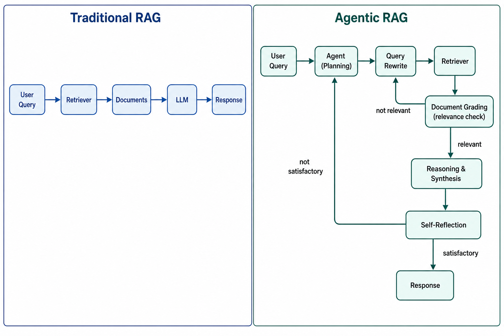
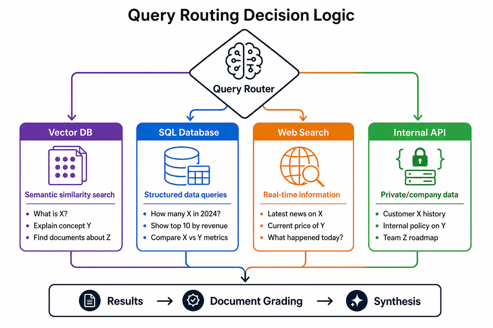
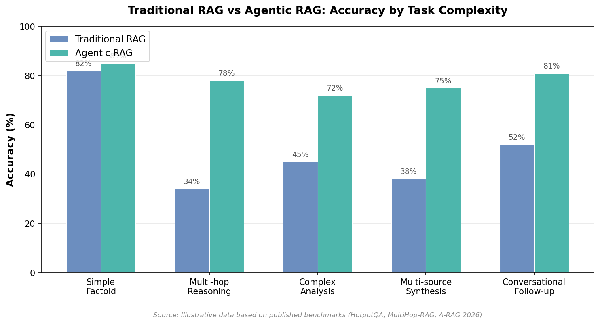
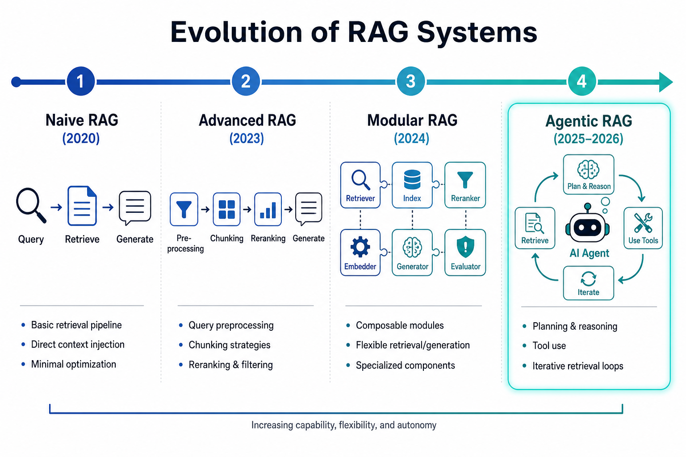

# Day 37: Agentic RAG — When Retrieval Gets a Brain

> **Core Question**: What happens when you give a RAG system the ability to plan, reflect, and iterate — and why does it matter for real-world AI applications?

---

## Opening

Imagine you are a research assistant. Your boss asks: "What's the competitive landscape for solid-state batteries in Southeast Asia?"

A lazy assistant runs one Google search, copies the top three results, and hands back a collage of paragraphs. That is traditional RAG. It retrieves once, generates once, and calls it a day.

A good assistant — a genuinely good one — first breaks the question apart: competitive landscape means who's building what; solid-state batteries narrows the technology; Southeast Asia narrows the geography. Then she searches multiple sources — industry reports, patent databases, news feeds. She cross-checks facts, spots contradictions, re-queries when something is missing, and only then writes a coherent synthesis. That is **Agentic RAG**.

The difference is not incremental. It is the gap between a vending machine and a personal shopper. One dispenses whatever matches the button you pressed. The other understands what you actually need and works until you get it.

In this article, we will unpack why Agentic RAG is one of the fastest-moving areas in AI (Google Trends: +300% and climbing), how it works under the hood, what the latest research says, and when you should — and should not — use it.

---

## 1. From Pipeline to Agent: The Paradigm Shift

### 1.1 Traditional RAG: A One-Shot Pipeline

Traditional RAG, as we covered in [Day 35](day35-rag-explained.md), follows a simple linear pipeline:

$$
\text{Query} \rightarrow \text{Retrieve} \rightarrow \text{Augment} \rightarrow \text{Generate}
$$

The system embeds the user's query, finds the most similar document chunks in a vector database, prepends them to the prompt, and asks the LLM to generate an answer. One retrieval step. One generation step. Done.

This works well for simple factoid questions: "What is the capital of France?" The answer lives in a single document chunk, and a single retrieval gets you there.

#### Intuition: The Librarian vs The Research Fellow

Think of traditional RAG as a helpful librarian. You hand her a question, she walks to the shelf, pulls the book whose title matches best, and reads you the relevant page. Efficient, but limited — she cannot follow up, rephrase, or dig deeper.

### 1.2 The Trouble with One-Shot Retrieval

Real-world questions are rarely single-hop. Consider: "Which company founded by a former Google engineer has the most patents in solid-state batteries?"

Answering this requires at least three steps: (1) identify companies founded by ex-Google engineers in battery tech, (2) look up patent filings for each, (3) compare and select the top one. Traditional RAG tries to handle this with a single query against a single index — and usually fails. Research on [MultiHop-RAG](https://arxiv.org/abs/2401.15391) showed that standard RAG systems achieve only around 34% accuracy on multi-hop queries, compared to 80%+ on simple factoids.

The problem is structural. A single query cannot simultaneously capture all the constraints. The retrieval index might not even contain a chunk that connects all three pieces of evidence.

### 1.3 Enter Agentic RAG

Agentic RAG replaces the fixed pipeline with an **autonomous agent loop**. Instead of retrieve-once-and-pray, the agent:

1. **Plans** how to decompose the question
2. **Routes** sub-queries to the right data sources
3. **Retrieves** and **grades** documents for relevance
4. **Reflects** on whether the gathered evidence is sufficient
5. **Iterates** — rephrasing queries, trying new sources, or refining the answer

This loop continues until the agent is satisfied that it has enough high-quality evidence to produce a reliable answer.


*Figure 1: Traditional RAG follows a linear pipeline (left), while Agentic RAG wraps retrieval inside a planning-reflection loop (right).*

---

## 2. How Agentic RAG Works: The Architecture

### 2.1 The Core Loop

Every Agentic RAG system, regardless of framework, implements some variant of this control loop:


*Figure 2: The Agentic RAG architecture — planning, routing, grading, and reflection form an iterative cycle around retrieval.*

Let's walk through each component:

**Query Analysis & Planning.** The agent examines the user's question and decides: is this a simple lookup or does it need decomposition? For multi-hop questions, it creates a plan — a sequence of sub-queries or a strategy for which sources to consult and in what order.

**Query Routing.** Not all questions should go to the same source. The agent might route to:
- A **vector database** for semantic similarity search
- A **SQL database** for structured data queries
- A **web search API** for real-time information
- An **internal API** for proprietary data

This is where Agentic RAG gets its name — the agent *decides* how to retrieve, rather than following a fixed script.

**Document Grading.** After retrieval, the agent does not blindly trust the results. It evaluates each retrieved document for relevance to the original question. If the documents are irrelevant or insufficient, it can reformulate the query and try again.

**Reasoning & Synthesis.** Once sufficient evidence is gathered, the agent chains the facts together, resolves contradictions, and constructs a coherent answer.

**Self-Critique & Reflection.** Before outputting, the agent asks: is this answer complete? Does it address all parts of the question? Are there unsupported claims? If not satisfactory, it loops back to planning.

### 2.2 The Memory Component

Unlike stateless traditional RAG, Agentic RAG maintains memory across the retrieval loop:

- **Scratchpad memory**: Intermediate reasoning steps, retrieved facts, and partial conclusions within a single query
- **Conversation memory**: Context from previous turns in a multi-turn dialogue
- **Long-term memory**: Persistent knowledge that accumulates over time (e.g., frequently asked questions, corrected errors)

This memory is what allows the agent to avoid repeating failed retrieval strategies and to build on previous interactions.

### 2.3 A Data Flow Diagram

To make the routing and feedback loops concrete, here is a detailed view of how data flows through an Agentic RAG system:


*Figure 3: Query routing decision logic — different question types are routed by the agent to different data sources, each with its use cases and typical query examples.*

---

## 3. Traditional RAG vs Agentic RAG: A Clear Comparison

| Dimension | Traditional RAG | Agentic RAG |
|-----------|----------------|-------------|
| **Retrieval** | Single-shot | Iterative, multi-step |
| **Query handling** | Fixed user query | Agent rewrites, decomposes |
| **Data sources** | Typically one index | Multiple (vector DB, SQL, web, APIs) |
| **Quality control** | None or post-hoc | Inline grading + reflection |
| **Reasoning** | Generation only | Planning + reasoning + synthesis |
| **Memory** | Stateless | Scratchpad + conversation + long-term |
| **Latency** | Low (1 LLM call) | Higher (3-10+ LLM calls) |
| **Cost** | Low | 3-5x higher |
| **Best for** | Simple factoid QA | Multi-hop, multi-source, complex reasoning |

#### Intuition: Fast Food vs Fine Dining

Traditional RAG is fast food: you order, you get what's on the menu, it's quick and cheap. Agentic RAG is fine dining: the chef asks about your preferences, adjusts the recipe, tastes and seasons iteratively, and presents a composed dish. Both have their place — you would not hire a personal chef for a midnight snack, but you would not trust a vending machine for a dinner party either.

---

## 4. Performance: Why The Complexity Is Worth It

The central promise of Agentic RAG is dramatically better accuracy on complex questions. Here is how the two approaches compare across task types:


*Figure 4: Accuracy comparison across task types. Agentic RAG's advantage grows with task complexity.*

Notice the pattern: on simple factoid questions, the difference is negligible (82% vs 85%). But on multi-hop reasoning and multi-source synthesis — the tasks that actually matter in production — Agentic RAG jumps from the 30-40% range to 75-80%. The A-RAG paper ([February 2026](https://arxiv.org/abs/2602.03442)) reported 94.5% on HotpotQA and 89.7% on 2WikiMultiHop, two standard multi-hop benchmarks.

This is not a marginal improvement. It is the difference between a system that is a demo toy and one you can actually ship to users.

---

## 5. Key Design Patterns

Agentic RAG is not a single architecture — it is a family of patterns. Here are the most common ones deployed in production today:

### 5.1 Router Pattern

The simplest form: an agent that routes queries to the right retriever. The agent classifies the question (factual? analytical? real-time?) and sends it to the appropriate tool. This adds minimal latency while gaining multi-source coverage.

```
User Query → Router Agent → [Vector DB | Web Search | SQL] → LLM → Response
```

### 5.2 Corrective RAG (CRAG)

Introduced by the research team at Ohio State University and Amazon in late 2024, [CRAG](https://arxiv.org/abs/2401.15884) adds a **relevance grading** step. If the retrieved documents score below a threshold, the agent triggers web search as a fallback. This catches the most common RAG failure mode: retrieving irrelevant documents and confidently hallucinating from them.

### 5.3 Self-RAG

[Self-RAG](https://arxiv.org/abs/2310.11511) (Self-Reflective Retrieval-Augmented Generation), proposed by Akari Asai and colleagues at the University of Washington in 2023, teaches the LLM itself to decide when to retrieve, when to critique, and when to generate. Instead of always retrieving, the model learns special reflection tokens: `[Retrieve]`, `[NoRetrieve]`, `[Relevant]`, `[Irrelevant]`, `[Supported]`, `[NotSupported]`. This makes the retrieval decision end-to-end trainable.

### 5.4 Multi-Agent RAG

For the most complex tasks, multiple specialized agents collaborate. A **planner agent** decomposes the question, **retriever agents** search different sources in parallel, a **critic agent** evaluates the evidence, and a **writer agent** synthesizes the final answer. Frameworks like [CrewAI](https://www.crewai.com/) and [AutoGen](https://microsoft.github.io/autogen/) are popular for this pattern.

---

## 6. Implementation: A Minimal Agentic RAG with LangGraph

[LangGraph](https://github.com/langchain-ai/langgraph) has emerged as the dominant framework for building Agentic RAG in 2026, because it natively supports cyclic graphs (loops) — something traditional DAG-based frameworks like LangChain could not do.

Here is a simplified but complete implementation:

```python
from langgraph.graph import StateGraph, END
from typing import TypedDict, List, Annotated
import operator

# State: shared memory across all steps
class AgentState(TypedDict):
    question: str
    rewritten_query: str
    documents: List[str]
    relevance_scores: List[float]
    answer: str
    iterations: int
    is_satisfactory: bool

# Node 1: Analyze and plan
def plan_query(state: AgentState) -> AgentState:
    """Decompose the question and create a retrieval plan."""
    question = state["question"]
    # In practice, call an LLM to decompose
    rewritten = f"decomposed: {question}"  # simplified
    return {**state, "rewritten_query": rewritten, "iterations": state.get("iterations", 0) + 1}

# Node 2: Retrieve documents
def retrieve(state: AgentState) -> AgentState:
    """Search the vector database with the rewritten query."""
    query = state["rewritten_query"]
    # In practice, query a vector store
    docs = [f"doc_result_{query}_1", f"doc_result_{query}_2"]
    return {**state, "documents": docs}

# Node 3: Grade documents for relevance
def grade_documents(state: AgentState) -> AgentState:
    """Score each document's relevance to the original question."""
    # In practice, use an LLM to grade each doc
    scores = [0.9, 0.3]  # first doc relevant, second not
    return {**state, "relevance_scores": scores}

# Node 4: Synthesize answer
def synthesize(state: AgentState) -> AgentState:
    """Build an answer from the relevant documents."""
    relevant_docs = [d for d, s in zip(state["documents"], state["relevance_scores"]) if s > 0.5]
    # In practice, call an LLM to synthesize
    answer = f"Based on {len(relevant_docs)} documents: synthesized answer"
    return {**state, "answer": answer}

# Node 5: Self-reflection
def reflect(state: AgentState) -> AgentState:
    """Check if the answer is satisfactory or needs more work."""
    # In practice, use an LLM to evaluate quality
    is_good = len(state["answer"]) > 20 and state["iterations"] < 3
    return {**state, "is_satisfactory": is_good}

# Routing logic
def should_retry(state: AgentState) -> str:
    if state["is_satisfactory"]:
        return "done"
    return "retry"

# Build the graph
graph = StateGraph(AgentState)
graph.add_node("plan", plan_query)
graph.add_node("retrieve", retrieve)
graph.add_node("grade", grade_documents)
graph.add_node("synthesize", synthesize)
graph.add_node("reflect", reflect)

graph.set_entry_point("plan")
graph.add_edge("plan", "retrieve")
graph.add_edge("retrieve", "grade")
graph.add_edge("grade", "synthesize")
graph.add_edge("synthesize", "reflect")

# Conditional edge: retry or finish
graph.add_conditional_edges(
    "reflect",
    should_retry,
    {"done": END, "retry": "plan"}
)

app = graph.compile()
result = app.invoke({"question": "What are the latest advances in solid-state batteries?"})
print(result["answer"])
```

This is a simplified example — production systems add reranking, hybrid search, human-in-the-loop checkpoints, and observability — but it captures the core idea: **retrieval wrapped inside a planning-reflection loop**.

---

## 7. The Evolution of RAG: A Four-Stage Journey


*Figure 5: From Naive RAG (2020) to Agentic RAG (2025-2026) — each stage adds autonomy and intelligence to the retrieval process.*

**Stage 1: Naive RAG (2020).** The original formulation from Facebook AI Research (now Meta FAIR): embed query, retrieve chunks, generate. Simple but brittle. No quality control on retrieval results.

**Stage 2: Advanced RAG (2023).** The community added pre-retrieval processing (query expansion, HyDE), better chunking strategies, and post-retrieval reranking. Still linear, but each step was improved.

**Stage 3: Modular RAG (2024).** RAG pipelines became composable — you could swap in different retrievers, rerankers, and generators. LlamaIndex popularized this approach. The pipeline was still fixed, but each module was interchangeable.

**Stage 4: Agentic RAG (2025-2026).** The pipeline becomes a loop. The agent decides what to retrieve, when, from where, and whether the results are good enough. This is the current frontier.

Each stage did not replace the previous one — simple questions still benefit from Naive RAG's speed. But Agentic RAG is the only approach that handles genuinely complex, multi-hop, multi-source reasoning.

---

## 8. When NOT to Use Agentic RAG

This is important enough to say clearly: Agentic RAG is not always the right choice.

**Use Traditional RAG when:**
- Questions are simple and factual (single-hop)
- Latency matters more than accuracy (chat interfaces, real-time assistants)
- Budget is limited (Agentic RAG costs 3-5x more per query)
- Your data lives in a single well-curated index

**Use Agentic RAG when:**
- Questions require multi-hop reasoning across sources
- Accuracy is critical and errors are costly (medical, legal, financial)
- Data is heterogeneous (documents + databases + APIs + web)
- You need citations and evidence traces
- The question might be ambiguous and needs clarification

The mistake many teams make is reaching for Agentic RAG when a well-tuned traditional RAG pipeline would suffice. More complexity does not always mean better results.

---

## 9. Frontier: What's Happening Right Now

Agentic RAG is one of the fastest-moving areas in AI research and product development. Here are the most significant recent developments:

### 9.1 Research

1. **SoK: Agentic RAG** (March 2026) — A comprehensive systematization-of-knowledge paper from an international research team that formalizes Agentic RAG as finite-horizon partially observable Markov decision processes (POMDPs). The paper provides a unified taxonomy for planning mechanisms, retrieval orchestration, memory paradigms, and tool invocation. ([arXiv:2603.07379](https://arxiv.org/abs/2603.07379))

2. **A-RAG: Hierarchical Retrieval Interfaces** (February 2026) — Introduces three retrieval tools (keyword search, semantic search, chunk read) that let the agent adaptively search at different granularities. Achieves 94.5% on HotpotQA, significantly outperforming static retrieval. ([arXiv:2602.03442](https://arxiv.org/abs/2602.03442))

3. **LatentRAG** (May 2026) — A novel framework that moves both reasoning and retrieval into a continuous latent space, generating subqueries directly from hidden states in a single forward pass. Achieves comparable accuracy to explicit Agentic RAG while dramatically reducing latency — potentially solving the "slow agent" problem. ([arXiv:2605.06285](https://arxiv.org/abs/2605.06285))

4. **AgenticRAGTracer** (February 2026) — A hop-aware benchmark that diagnoses *where* in the multi-step reasoning chain an Agentic RAG system fails. Key finding: failures are primarily driven by distorted reasoning chains that either collapse prematurely or wander into over-extension. ([arXiv:2602.19127](https://arxiv.org/abs/2602.19127))

### 9.2 Products and Platforms

1. **Progress Agentic RAG** (launched Q1 2026) — Progress Software launched an Agentic RAG-as-a-Service platform following their acquisition of Nuclia (July 2025). It ingests and reasons across documents, video, and audio with built-in AI agents. ([Progress Agentic RAG](https://www.progress.com/agentic-rag))

2. **NVIDIA AI-Q Blueprint** (2025-2026) — NVIDIA combined Nemotron reasoning models, Nemotron RAG, and the NeMo Agent toolkit into a full Agentic RAG stack for enterprise deployment. ([NVIDIA AI-Q](https://build.nvidia.com/nvidia/aiq))

3. **LangGraph** has become the de facto standard framework for Agentic RAG in 2026, with native support for cyclic graphs, persistent checkpoints, and human-in-the-loop — features essential for agentic loops that traditional DAG frameworks could not handle. ([LangGraph Docs](https://docs.langchain.com/oss/python/langgraph/agentic-rag))

### 9.3 The Big Picture

A notable shift is underway: Jerry Liu, founder of LlamaIndex, [publicly acknowledged](https://www.mindstudio.ai/blog/llm-frameworks-replaced-by-agent-sdks) that the "framework era" is ending. The future belongs to agent SDKs and agentic architectures, where RAG is not a standalone pipeline but a *tool* that agents call when they need information. This aligns with the trajectory we have traced: from pipeline → modular pipeline → agent tool.

---

## 10. Common Misconceptions

### ❌ "Agentic RAG is just RAG with more retrieval steps"

No. The key difference is **autonomy**. Traditional RAG follows a fixed script: retrieve, augment, generate. Agentic RAG makes *decisions*: should I retrieve? From where? Is this result good enough? Do I need to try a different approach? The agent is in control, not the pipeline.

### ❌ "Agentic RAG replaces traditional RAG entirely"

Also wrong. For simple factoid questions, traditional RAG is faster, cheaper, and often equally accurate. Agentic RAG is for complex, multi-hop, multi-source scenarios where one-shot retrieval fails. Use the right tool for the job.

### ❌ "More iterations always means better results"

Not necessarily. Research from AgenticRAGTracer showed that agents often fail not because they iterate too little, but because their reasoning chains become *distorted* — either collapsing prematurely (giving up too soon) or wandering into over-extension (chasing irrelevant tangents). Quality of iteration matters more than quantity.

---

## 11. Further Reading

### Foundational Papers

1. ["Retrieval-Augmented Generation for Knowledge-Intensive NLP Tasks"](https://arxiv.org/abs/2005.11401) (Lewis et al., 2020) — The original RAG paper from Meta FAIR
2. ["Self-RAG: Learning to Retrieve, Generate, and Critique through Self-Reflection"](https://arxiv.org/abs/2310.11511) (Asai et al., 2023) — End-to-end trainable retrieval decisions
3. ["Corrective RAG (CRAG)"](https://arxiv.org/abs/2401.15884) (Yan et al., 2024) — Adding relevance grading and web search fallback

### Recent Agentic RAG Papers

4. ["SoK: Agentic Retrieval-Augmented Generation"](https://arxiv.org/abs/2603.07379) (March 2026) — Comprehensive taxonomy and formal framework
5. ["A-RAG: Scaling Agentic RAG via Hierarchical Retrieval Interfaces"](https://arxiv.org/abs/2602.03442) (February 2026) — Multi-granularity adaptive retrieval
6. ["LatentRAG: Latent Reasoning and Retrieval for Efficient Agentic RAG"](https://arxiv.org/abs/2605.06285) (May 2026) — Latent-space reasoning to reduce latency
7. ["AgenticRAGTracer: A Hop-Aware Benchmark"](https://arxiv.org/abs/2602.19127) (February 2026) — Diagnosing multi-step reasoning failures
8. ["Agentic RAG: A Survey"](https://arxiv.org/abs/2501.09136) (revised April 2026) — Broad survey of architectures and design trade-offs

### Frameworks and Tools

9. [LangGraph Agentic RAG Documentation](https://docs.langchain.com/oss/python/langgraph/agentic-rag) — Official guide for building agentic RAG with LangGraph
10. [LlamaIndex Agentic RAG](https://www.llamaindex.ai/blog/agentic-rag-with-llamaindex-2721b8a49ff6) — Multi-document agentic retrieval
11. [NVIDIA AI-Q Blueprint](https://build.nvidia.com/nvidia/aiq) — Enterprise agentic RAG stack

---

## Reflection Questions

1. If you were building a customer support bot, at what point would you switch from traditional RAG to Agentic RAG? What specific question patterns would trigger the upgrade?
2. Agentic RAG trades latency and cost for accuracy. In your domain, what is the acceptable latency threshold before users abandon the system? How does that constrain your architecture choices?
3. The AgenticRAGTracer paper found that reasoning chains often "collapse prematurely" or "wander into over-extension." What mechanisms could you add to an agent to detect and correct both failure modes?

---

## Summary

| Concept | One-line Explanation |
|---------|---------------------|
| **Agentic RAG** | RAG where an autonomous agent controls retrieval decisions in an iterative loop |
| **Query Routing** | Agent decides which data source (vector DB, SQL, web) to query based on question type |
| **Document Grading** | Agent evaluates retrieved documents for relevance before using them |
| **Self-Reflection** | Agent critiques its own answer and decides whether to iterate or output |
| **Corrective RAG (CRAG)** | Pattern where irrelevant results trigger fallback to alternative sources |
| **Self-RAG** | End-to-end trainable model that learns when to retrieve and when to critique |
| **Multi-Agent RAG** | Multiple specialized agents collaborate: planner, retriever, critic, writer |
| **LangGraph** | Framework that supports cyclic agent loops (unlike DAG-based predecessors) |

**Key Takeaway**: Agentic RAG replaces the one-shot retrieve-then-generate pipeline with an autonomous agent that plans, routes, grades, reflects, and iterates. This adds cost and latency but transforms accuracy on complex, multi-hop questions from ~35% to ~80%+. The key is knowing when the complexity is justified — simple questions still deserve simple answers.

---

*Day 37 of 60 | LLM Fundamentals*
*Word count: ~2800 | Reading time: ~14 minutes*
