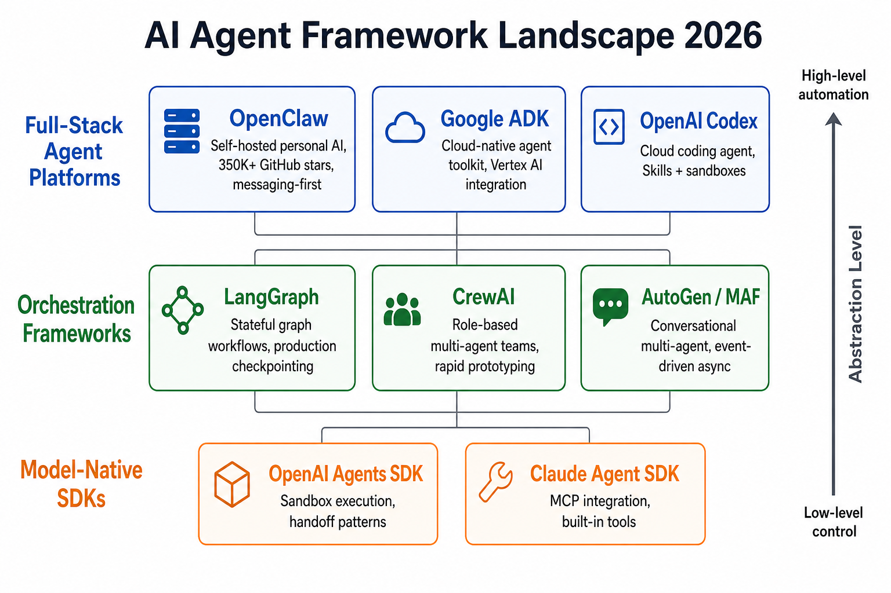
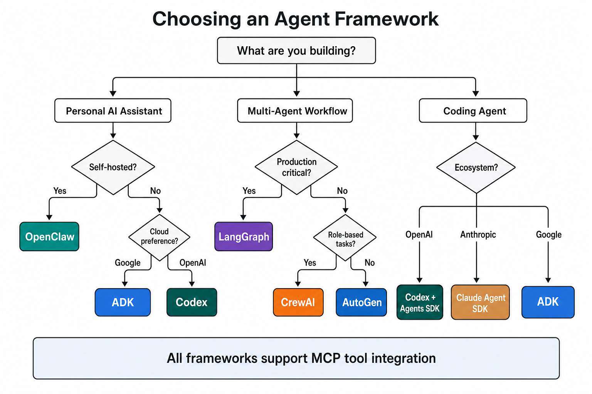
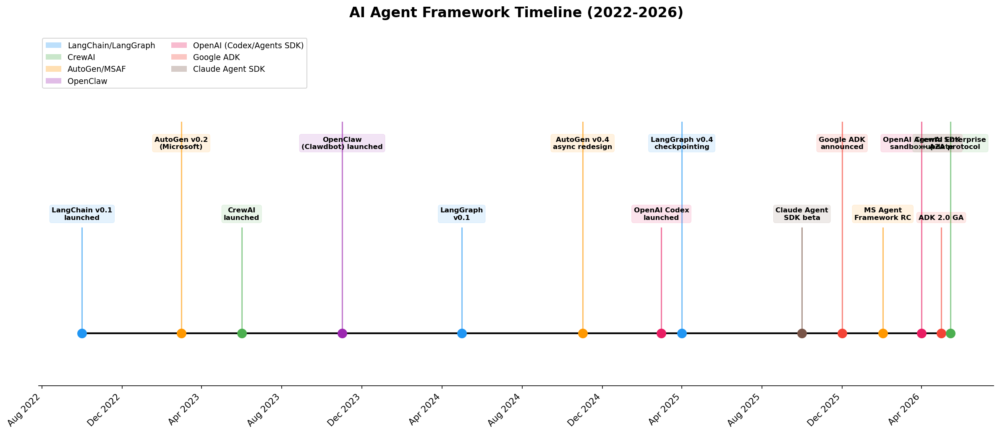
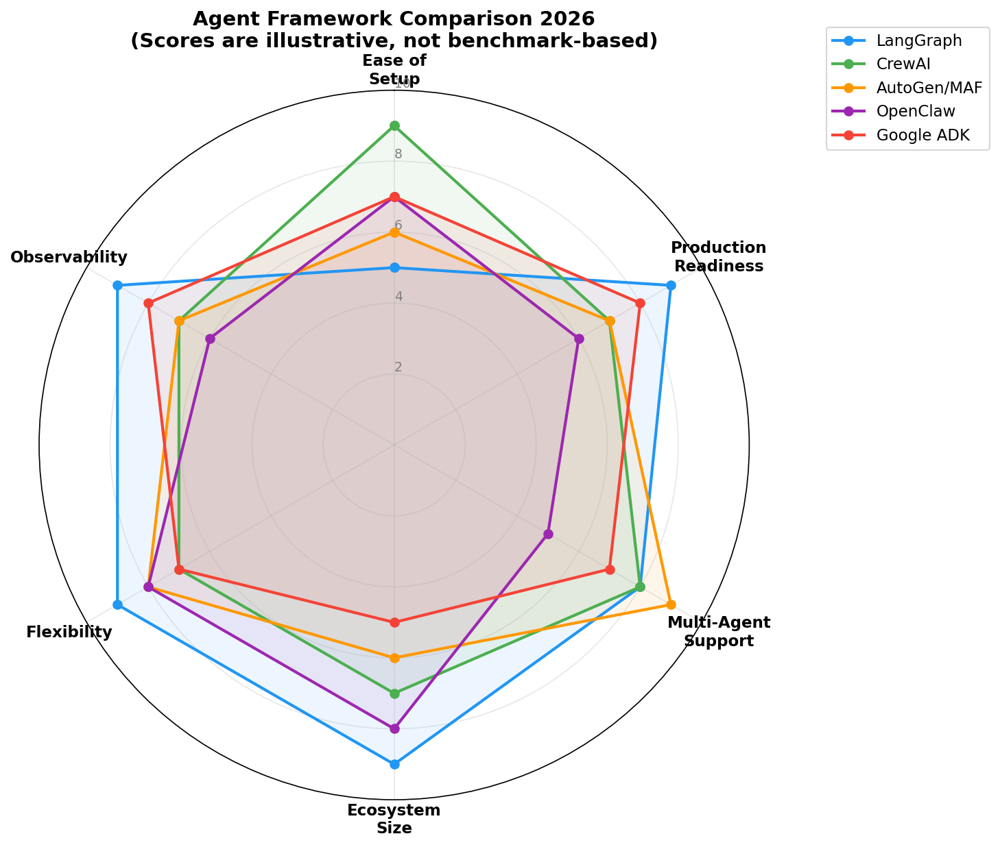

# Day 40: Agent Tool Comparison — Navigating the Crowded Framework Landscape

> **Core Question**: With dozens of agent frameworks available in 2026, how do you pick the right one for your project — or understand why they all exist?

---

## Opening

You're a developer who wants to build an AI agent. You type "best AI agent framework 2026" into a search engine and immediately regret it. LangGraph, CrewAI, AutoGen, OpenClaw, Google ADK, OpenAI Agents SDK, Claude Agent SDK, Semantic Kernel — the list keeps growing. Each claims to be the best. Each has a different architecture. None of them seem to do exactly the same thing.

#### Intuition: The Power Tool Aisle

Imagine walking into a hardware store looking for "something that cuts." You find handsaws, circular saws, jigsaws, chainsaws, and laser cutters. They all cut, but nobody would compare a chainsaw to a laser cutter and declare one "better." Each is engineered for a specific material, precision level, and scale.

Agent frameworks are like that. They all help you build agents, but they're optimized for fundamentally different use cases — personal automation, production workflows, coding assistance, or enterprise deployment. The right question isn't "which is best?" but "which is built for what I'm doing?"

This article maps the landscape, compares the major players across meaningful dimensions, and gives you a decision framework — not a winner.

---

## 1. The Taxonomy: Three Layers of Agent Tooling

Before comparing individual frameworks, we need to understand that "agent framework" is an overloaded term. The tools in this space operate at three distinct abstraction layers.

### 1.1 Full-Stack Agent Platforms

These are complete systems that run agents end-to-end — they handle model selection, tool execution, memory, user interaction, and deployment as an integrated experience.

| Platform | Origin | Primary Use Case | Deployment Model |
|----------|--------|------------------|-----------------|
| **OpenClaw** | Open-source (Peter Steinberger, 2025) | Personal AI assistant, self-hosted | Local machine, self-hosted |
| **Google ADK** | Google (2025) | Cloud-native agent development | Google Cloud / Vertex AI |
| **OpenAI Codex** | OpenAI (2025) | Cloud-based coding agent | OpenAI cloud |

#### Intuition: Full-Stack vs. DIY

Think of these like buying a car versus building one from parts. Full-stack platforms give you a working vehicle out of the box — engine, steering, and GPS included. You sacrifice some customization, but you're driving in minutes instead of weeks.

### 1.2 Orchestration Frameworks

These provide the wiring — state management, agent coordination, workflow logic — but expect you to bring your own model, tools, and deployment infrastructure.

| Framework | Origin | Core Abstraction | Best For |
|-----------|--------|-----------------|----------|
| **LangGraph** | LangChain (2024) | Directed graph with state | Complex stateful workflows |
| **CrewAI** | CrewAI Inc. (2023) | Role-based agent teams | Rapid multi-agent prototyping |
| **AutoGen / MAF** | Microsoft Research (2023) | Conversational group chat | Research and code execution |

#### Intuition: The Skeleton

If full-stack platforms are cars, orchestration frameworks are chassis kits — they give you the structural framework and suspension, but you choose the engine, body panels, and paint. More work, but infinitely more customizable.

### 1.3 Model-Native SDKs

These are thin, official SDKs from model providers. They handle the agent loop (model call → tool use → model call) with minimal abstraction, optimized for their provider's models.

| SDK | Provider | Key Feature |
|-----|----------|-------------|
| **OpenAI Agents SDK** | OpenAI | Native sandbox execution, handoff patterns |
| **Claude Agent SDK** | Anthropic | MCP integration, built-in filesystem tools |

#### Intuition: The Engine

These are like buying a specific engine. They're excellent at what they do — running their provider's models with first-class tool support — but they don't come with a chassis. You'll need to build your own workflow logic or combine them with an orchestration framework.

> **Why this taxonomy matters**: Comparing OpenClaw (a full-stack platform) directly against LangGraph (an orchestration framework) is like comparing a Tesla to a transmission. They're different product categories serving different needs. The rest of this article will compare *within* categories and explain when to reach for each.


*Figure 1: The three layers of agent tooling in 2026, from high-level platforms (top) to low-level SDKs (bottom).*

---

## 2. Full-Stack Platforms: Deep Dive

### 2.1 OpenClaw — The Self-Hosted Personal Agent

OpenClaw ([github.com/openclaw/openclaw](https://github.com/openclaw/openclaw)) emerged in late 2025 as "Clawdbot" and was renamed in January 2026. By mid-2026, it has over 355,000 GitHub stars and 3.2 million active users — making it arguably the most popular open-source AI agent platform.

**What makes it unique:**
- **Messaging-first architecture**: Runs as a Node.js gateway connecting to Telegram, Discord, Slack, Signal, iMessage, and WhatsApp. You talk to your agent like texting a friend.
- **Self-hosted by default**: Everything runs on your local machine. Your files, your data, your rules. No cloud dependency.
- **Model-agnostic**: Bring your own API keys for OpenAI, Anthropic, Gemini, DeepSeek — or run local models via Ollama.
- **Skill marketplace**: Over 44,000 community-built skills on "ClawHub" as of April 2026.

**Architecture**: OpenClaw operates as a long-running gateway service. When a message arrives from any connected channel, the gateway routes it to an agent session that has persistent memory (stored as Markdown files on disk), access to shell commands, and a library of configurable skills.

**Trade-offs:**
- ✅ Privacy-first, runs locally, massive ecosystem
- ❌ Requires comfort with command-line setup; security considerations around shell access

### 2.2 Google ADK — The Cloud-Native Toolkit

Google's Agent Development Kit ([adk.dev](https://adk.dev)) launched in late 2025 and reached version 2.0 GA in May 2026. It's the native framework for building agents on Google Cloud.

**What makes it unique:**
- **First-class multimodal**: Built for Gemini's multimodal capabilities from day one — text, images, audio, video.
- **Cloud-native deployment**: One-click deployment to Vertex AI Agent Runtime, Cloud Run, or GKE with managed authentication, tracing, and security.
- **A2A + MCP dual protocol support**: Native support for both Google's Agent-to-Agent (A2A) protocol and Anthropic's Model Context Protocol (MCP).
- **ADK Go**: A Go-language version reached 1.0 in March 2026, expanding beyond Python.

**Architecture**: ADK provides workflow primitives — `SequentialAgent`, `ParallelAgent`, `LoopAgent` — for composing multi-agent systems. The Task API supports structured agent-to-agent delegation with human-in-the-loop checkpoints.

**Trade-offs:**
- ✅ Deep Google Cloud integration, multimodal, enterprise-grade infrastructure
- ❌ Lock-in to Google ecosystem; less useful outside GCP

### 2.3 OpenAI Codex — The Coding Agent

OpenAI Codex ([openai.com/codex](https://openai.com/codex/)) is a cloud-based coding agent that launched in mid-2025 and has rapidly evolved. By May 2026, it's integrated into ChatGPT, available as a CLI, desktop app, and IDE extension.

**What makes it unique:**
- **Parallel worktrees**: Agents work in isolated Git worktrees with cloud sandbox environments, completing tasks in parallel.
- **Skills system**: Extensible with task-specific skills that package instructions, resources, and scripts.
- **MultiAgentV2**: Configuration for multi-agent collaboration within the Codex environment (May 2026 update).
- **Codex Security**: A specialized security-scanning agent introduced in March 2026.

**Architecture**: Codex runs in OpenAI's cloud with sandboxed environments. Users submit tasks through ChatGPT, CLI, or IDE, and Codex creates isolated execution environments with file access and tool use.

**Trade-offs:**
- ✅ Zero setup, powerful coding agent, parallel execution
- ❌ OpenAI ecosystem lock-in; primarily focused on software development

---

## 3. Orchestration Frameworks: Deep Dive

### 3.1 LangGraph — The Production Workhorse

LangGraph ([github.com/langchain-ai/langgraph](https://github.com/langchain-ai/langgraph)) is LangChain's agent-specific library, built around a graph-based execution model. As of 2026, it's considered the gold standard for production agent deployments.

**What makes it unique:**
- **Directed graph with explicit state**: Every workflow is a state machine. Nodes are functions, edges are transitions, and the entire state is checkpointed at every step.
- **Durable execution**: Agents survive crashes and resume from checkpoints. Production deployments use PostgreSQL, MongoDB, or DynamoDB backends for state persistence.
- **Human-in-the-loop**: Built-in interrupt and resume at any graph node, enabling approval gates and manual overrides.
- **Time-travel debugging**: Replay agent execution from any checkpoint to diagnose issues.

**Architecture**:

```
[Start] → [Router] → [Research Agent] → [Synthesize] → [Human Review] → [End]
                ↓                              ↑
          [Web Search]              [Draft Writer Agent]
```

Each node receives the full state, modifies it, and passes it along. Checkpointing happens automatically.

**Trade-offs:**
- ✅ Maximum control, production-grade reliability, excellent observability via LangSmith
- ❌ Steeper learning curve, more boilerplate than alternatives

**Production users**: Uber, LinkedIn, Replit, and Elastic all use LangGraph in production as of 2026.

### 3.2 CrewAI — The Rapid Prototyper

CrewAI ([crewai.com](https://crewai.com/)) is a role-based multi-agent framework that models agent collaboration after human team dynamics.

**What makes it unique:**
- **Role-based design**: Define agents with roles, goals, and backstories. "You are a senior researcher who excels at finding academic papers."
- **Crews + Flows dual architecture**: Crews for autonomous agent teams, Flows for deterministic event-driven orchestration using Python decorators.
- **Checkpointing and replay**: Capture runtime state at every step, replay from specific points, fork workflows.
- **A2A protocol support**: Connect different crews for asynchronous execution across systems.

**Architecture**:

```python
from crewai import Agent, Task, Crew

researcher = Agent(
    role="Senior Researcher",
    goal="Find comprehensive information about the topic",
    backstory="Expert at academic research and data synthesis",
    tools=[search_tool, web_scraper]
)

writer = Agent(
    role="Technical Writer",
    goal="Write clear, engaging content",
    backstory="Former tech journalist with deep LLM knowledge",
)

crew = Crew(
    agents=[researcher, writer],
    tasks=[research_task, writing_task],
    process=Process.sequential  # or hierarchical
)
```

**Trade-offs:**
- ✅ Fastest path from idea to working multi-agent prototype
- ❌ Less granular control than LangGraph; abstraction can be limiting for complex workflows

### 3.3 AutoGen / Microsoft Agent Framework — The Research Powerhouse

AutoGen ([github.com/microsoft/autogen](https://github.com/microsoft/autogen)) was introduced by Microsoft Research in 2023. As of early 2026, it's transitioning into the **Microsoft Agent Framework (MAF)**, which merges AutoGen's orchestration with Semantic Kernel's enterprise stability. MAF reached Release Candidate status in February 2026.

**What makes it unique:**
- **Conversational paradigm**: Agents interact through message passing in group chats. Orchestration emerges from their responses rather than being pre-defined.
- **Code execution sandbox**: Agents can write code, execute it in Docker containers, observe results, and iterate.
- **Event-driven async architecture**: AutoGen v0.4 introduced a complete async redesign for concurrent agent execution.
- **Azure ecosystem integration**: Deep integration with Azure AI services for enterprise deployments.

**Trade-offs:**
- ✅ Powerful for research, excellent code execution, strong Microsoft ecosystem integration
- ❌ Architecture transition (AutoGen → MAF) creates migration uncertainty; steeper learning curve for non-Microsoft environments

---

## 4. Model-Native SDKs: Deep Dive

### 4.1 OpenAI Agents SDK

The OpenAI Agents SDK ([github.com/openai/openai-agents-python](https://github.com/openai/openai-agents-python)) received a major update in April 2026 adding native sandbox execution.

**Key features:**
- **Sandbox environments**: Agents run in isolated compute environments (E2B, Modal, or Daytona), accessing only the files and code needed for specific tasks.
- **Handoff patterns**: Built-in agent-to-agent handoff with clean context transfer.
- **MCP integration**: First-class support for Model Context Protocol tool servers.

**When to use it**: You're building agents specifically on OpenAI models and want the most streamlined path with minimal abstraction overhead.

### 4.2 Claude Agent SDK

Anthropic's Claude Agent SDK ([github.com/anthropics/claude-agent-sdk-python](https://github.com/anthropics/claude-agent-sdk-python)), formerly the Claude Code SDK, was renamed in early 2026 to reflect broader ambitions beyond coding.

**Key features:**
- **Built-in tools**: File system access and shell execution come out of the box — less boilerplate.
- **Deep MCP integration**: Connect to MCP servers like Playwright, Slack, and GitHub with minimal configuration.
- **Hook event streaming**: Observe agent decisions (tool use, stop events) in real-time.
- **1M context window**: Support for extended context via API beta features.

**When to use it**: You're building Anthropic-native agents and want safety-first tool use with MCP as the primary integration layer.

---

## 5. Architecture Patterns Compared


*Figure 2: Four fundamental architecture patterns used by agent frameworks — graph-based, role-based, conversational, and gateway.*

The table below summarizes how each architecture pattern maps to framework choices:

| Pattern | Framework | Strength | Weakness |
|---------|-----------|----------|----------|
| **Graph-based state machine** | LangGraph | Precise control, checkpointing | More setup, steeper curve |
| **Role-based team** | CrewAI | Intuitive, fast prototyping | Less control over edge cases |
| **Conversational group chat** | AutoGen / MAF | Emergent collaboration, code exec | Unpredictable, harder to debug |
| **Messaging gateway** | OpenClaw | Always-on, multi-channel | Not designed for batch workflows |
| **Cloud-native services** | ADK, Codex | Zero infra management | Vendor lock-in |

---

## 6. How to Choose: A Decision Framework


*Figure 3: A decision tree for navigating framework choices based on your project's primary constraints.*

### Step 1: Identify Your Dominant Constraint

Every project has one constraint that matters most. Rank these in order of importance:

1. **Speed of prototyping** → CrewAI
2. **Production reliability** → LangGraph
3. **Ecosystem integration** (Google, Microsoft, OpenAI) → ADK / MAF / Codex
4. **Privacy and self-hosting** → OpenClaw
5. **Model-native simplicity** → OpenAI Agents SDK or Claude Agent SDK

### Step 2: Consider the Combination Strategy

Many production systems combine frameworks:

| Pattern | Example |
|---------|---------|
| OpenClaw + LangGraph | OpenClaw handles messaging, LangGraph handles complex workflows |
| CrewAI + LangGraph | CrewAI for research agents, LangGraph for production orchestration |
| Claude Agent SDK + MCP | Build with Claude SDK, integrate tools via MCP protocol |
| ADK + A2A | Build specialized agents with ADK, coordinate via A2A |

### Step 3: Evaluate the Protocol Layer

In 2026, two protocols are reshaping agent interoperability:

- **MCP (Model Context Protocol)**: Anthropic's standard for tool integration. Supported by OpenClaw, Claude Agent SDK, OpenAI Agents SDK, ADK, and increasingly by all frameworks.
- **A2A (Agent-to-Agent Protocol)**: Google's standard for inter-agent communication. Native in ADK, supported by CrewAI.

If your architecture needs agents from different providers to collaborate, protocol support is a first-class selection criterion.

---

## 7. The Convergence Trend

One of the most notable trends in 2026 is convergence. Frameworks are increasingly adopting each other's best ideas:

| Trend | Example |
|-------|---------|
| Everyone supports MCP | OpenClaw, ADK, OpenAI Agents SDK, Claude Agent SDK all support MCP tool integration |
| Graph-based orchestration spreading | LangGraph pioneered it; CrewAI and ADK now offer similar checkpointing |
| Sandbox execution standardizing | OpenAI Agents SDK (April 2026), Claude Agent SDK, and ADK all offer sandboxed tool execution |
| Skill/marketplace ecosystems | OpenClaw's ClawHub (44K+ skills), Codex Skills, Claude Agent Skills |

This convergence means the framework you pick today matters less than it did a year ago. The protocol layer (MCP, A2A) is becoming the real differentiator.

---

## 8. Frontier: What's New (2026)

| Date | Event | Significance |
|------|-------|--------------|
| **May 19, 2026** | [Google ADK 2.0 GA released](https://adk.dev/2.0/) with breaking API changes and Task API for agent-to-agent delegation | ADK matures as a production platform |
| **May 2026** | [OpenAI Codex MultiAgentV2](https://developers.openai.com/codex/changelog) configuration and Goal mode graduated from experimental | Codex becomes a multi-agent coding environment |
| **April 15, 2026** | [OpenAI Agents SDK sandbox update](https://openai.com/index/the-next-evolution-of-the-agents-sdk/) with native sandbox execution and harness architecture | Enterprise-grade isolation for agent tasks |
| **February 2026** | [Microsoft Agent Framework RC](https://devblogs.microsoft.com/agent-framework/migrate-your-semantic-kernel-and-autogen-projects-to-microsoft-agent-framework-release-candidate/) merges AutoGen + Semantic Kernel | Microsoft consolidates its agent story |
| **March 2026** | [OpenClaw surpasses 355K GitHub stars](https://medium.com/data-science-collective/355k-github-stars-in-5-months-17-defense-rate-the-complete-honest-guide-to-openclaw-28d2f59598e1), 3.2M active users | Open-source personal agents go mainstream |
| **June 2026** | [Anthropic separates Agent SDK billing](https://www.anthropic.com/engineering/equipping-agents-for-the-real-world-with-agent-skills) from Claude subscription | Signals Agent SDK as a distinct product line |


*Figure 4: Timeline of major agent framework milestones from 2022 to 2026.*

---

## 9. Common Misconceptions

### ❌ "LangChain and LangGraph are the same thing"
LangChain is a general-purpose LLM application framework with 600+ integrations. LangGraph is its agent-specific library focused on stateful graph workflows. You can use LangGraph without using LangChain's broader abstractions.

### ❌ "You must pick one framework and commit"
Production systems increasingly combine frameworks. A common pattern: use OpenClaw for user interaction, LangGraph for complex workflows, and Claude Agent SDK for tool execution. MCP and A2A protocols make this interoperable.

### ❌ "AutoGen was discontinued"
AutoGen is transitioning into Microsoft Agent Framework (MAF), which merges AutoGen's orchestration with Semantic Kernel's enterprise stability. The AutoGen name is being retired, but the technology lives on.

### ❌ "Framework X is objectively best"
Frameworks optimize for different constraints. LangGraph optimizes for production reliability. CrewAI optimizes for prototyping speed. OpenClaw optimizes for personal autonomy. There is no single best — only best *for your use case*.

---

## 10. Code Example: Same Task, Three Frameworks

Let's build a simple "research and summarize" agent using three different frameworks to see how the abstraction levels differ.

### LangGraph (Explicit State Machine)

```python
from langgraph.graph import StateGraph, END
from typing import TypedDict

class AgentState(TypedDict):
    topic: str
    research_notes: str
    summary: str

def research_node(state: AgentState) -> AgentState:
    """Search for information on the topic."""
    topic = state["topic"]
    notes = search_tool(topic)  # your search tool
    return {"research_notes": notes}

def summarize_node(state: AgentState) -> AgentState:
    """Summarize the research notes."""
    notes = state["research_notes"]
    summary = llm.invoke(f"Summarize these notes: {notes}")
    return {"summary": summary}

# Build the graph
graph = StateGraph(AgentState)
graph.add_node("research", research_node)
graph.add_node("summarize", summarize_node)
graph.add_edge("research", "summarize")
graph.add_edge("summarize", END)
graph.set_entry_point("research")

app = graph.compile()
result = app.invoke({"topic": "Mixture of Experts in LLMs"})
```

### CrewAI (Role-Based Team)

```python
from crewai import Agent, Task, Crew, Process

researcher = Agent(
    role="Research Analyst",
    goal="Find key information about the given topic",
    backstory="Expert researcher with 10 years of experience",
    tools=[search_tool]
)

writer = Agent(
    role="Technical Writer",
    goal="Create a clear, concise summary",
    backstory="Former tech journalist specializing in AI",
)

research_task = Task(
    description="Research {topic} and compile key findings",
    agent=researcher
)

write_task = Task(
    description="Write a 200-word summary based on the research",
    agent=writer
)

crew = Crew(
    agents=[researcher, writer],
    tasks=[research_task, write_task],
    process=Process.sequential
)

result = crew.kickoff(inputs={"topic": "Mixture of Experts in LLMs"})
```

### OpenAI Agents SDK (Model-Native)

```python
from openai import Agent, Runner
from openai.tools import web_search

research_agent = Agent(
    name="Research Agent",
    instructions="Research the given topic and provide key findings.",
    tools=[web_search],
)

summary_agent = Agent(
    name="Summary Agent",
    instructions="Create a concise 200-word summary of the provided research.",
)

# Handoff pattern: research → summarize
research_agent.handoffs = [summary_agent]

result = await Runner.run(
    research_agent,
    input="Research and summarize: Mixture of Experts in LLMs"
)
```

Notice how each framework expresses the same workflow differently:
- **LangGraph**: You define the state schema and control flow explicitly.
- **CrewAI**: You define roles and let the framework figure out coordination.
- **OpenAI Agents SDK**: You define agents and handoff rules with minimal ceremony.

---

## 11. Summary

| Framework | Type | Best For | Abstraction Level |
|-----------|------|----------|------------------|
| **OpenClaw** | Full-stack platform | Personal AI, self-hosted | High |
| **Google ADK** | Full-stack platform | Cloud-native, multimodal agents | High |
| **OpenAI Codex** | Full-stack platform | Cloud coding agents | High |
| **LangGraph** | Orchestration | Production stateful workflows | Medium |
| **CrewAI** | Orchestration | Rapid multi-agent prototyping | Medium |
| **AutoGen / MAF** | Orchestration | Research, code execution | Medium |
| **OpenAI Agents SDK** | Model-native SDK | OpenAI-native agents | Low |
| **Claude Agent SDK** | Model-native SDK | Anthropic-native agents, MCP | Low |

**Key Takeaway**: The agent framework landscape in 2026 has matured into distinct categories. Don't compare across categories — compare within them. Your dominant constraint (speed, reliability, privacy, or ecosystem) determines the category; your specific requirements determine the framework. And thanks to MCP and A2A protocols, combining frameworks is increasingly practical.


*Figure 5: Illustrative comparison across six dimensions. These scores represent general characterization, not benchmark results. Each framework excels in its target domain.*

---

## Reflection Questions

1. If MCP becomes a universal standard for tool integration, how does that change the value proposition of framework-specific tool ecosystems?
2. What are the risks of combining multiple frameworks in production? How would you handle observability and debugging across framework boundaries?
3. As model-native SDKs add more orchestration features (sandboxes, handoffs), at what point do they become equivalent to orchestration frameworks?

---

## Further Reading

### Documentation
1. [LangGraph Documentation](https://langchain-ai.github.io/langgraph/) — Graph-based agent orchestration
2. [CrewAI Documentation](https://docs.crewai.com/) — Role-based multi-agent framework
3. [Google ADK Documentation](https://adk.dev/) — Agent Development Kit
4. [OpenAI Codex Documentation](https://developers.openai.com/codex/) — Cloud coding agent
5. [OpenClaw Documentation](https://docs.openclaw.ai/) — Self-hosted personal AI

### Papers & Articles
1. ["AutoGen v0.4: Reimagining the Foundation of Agentic AI"](https://www.microsoft.com/en-us/research/blog/autogen-v0-4-reimagining-the-foundation-of-agentic-ai-for-scale-extensibility-and-robustness/) — Microsoft Research, Nov 2025
2. ["The Next Evolution of the Agents SDK"](https://openai.com/index/the-next-evolution-of-the-agents-sdk/) — OpenAI, April 2026
3. ["Equipping Agents for the Real World with Agent Skills"](https://www.anthropic.com/engineering/equipping-agents-for-the-real-world-with-agent-skills) — Anthropic Engineering Blog

---

*Day 40 of 60 | LLM Fundamentals*
*Word count: ~3100 | Reading time: ~16 minutes*
