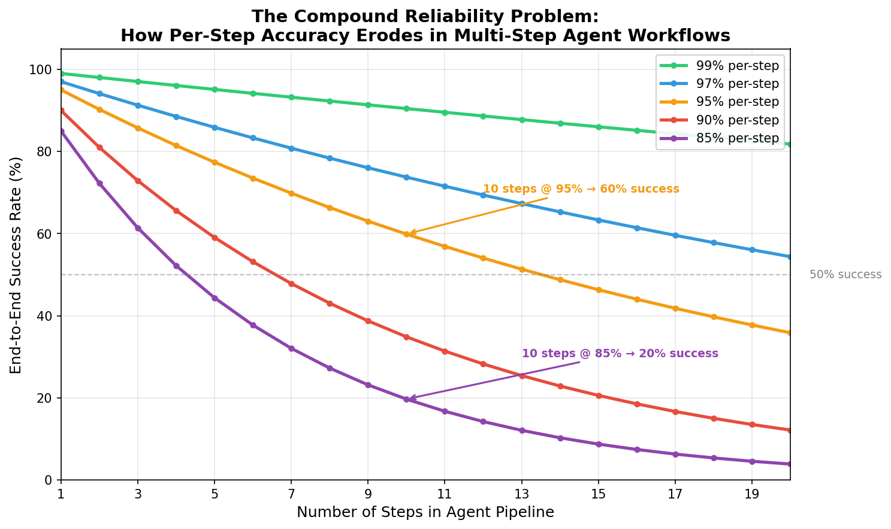
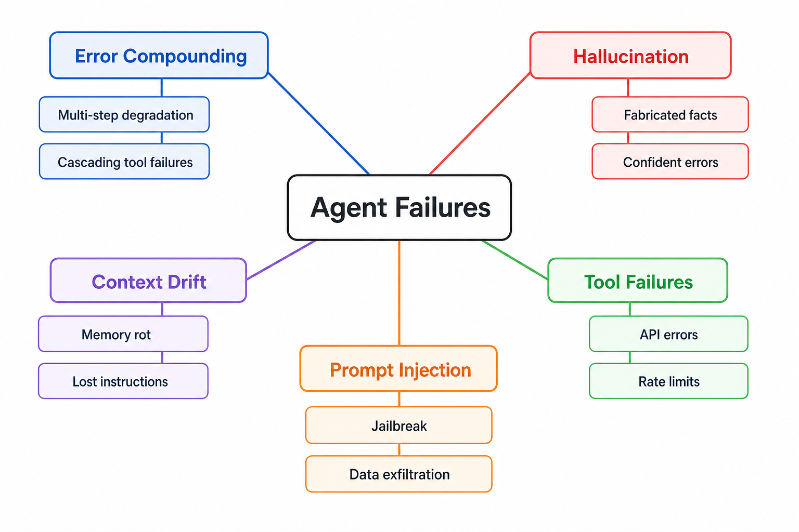
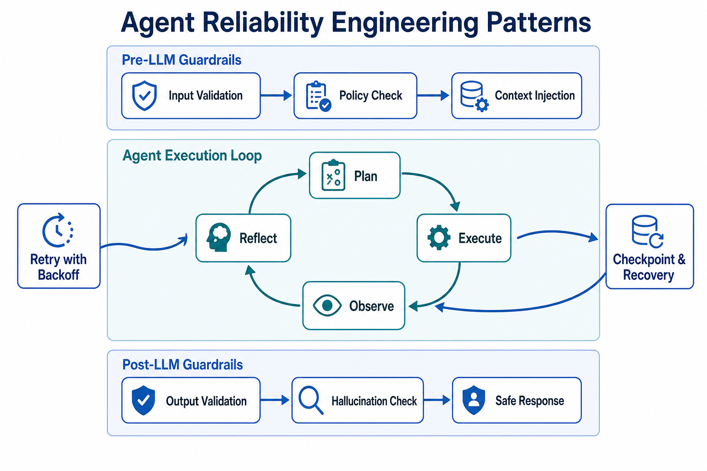

# Day 41: Reliability Issues — Why AI Agents Fail in Production

> **Core Question**: If each step of an AI agent pipeline is 95% accurate, why does the whole pipeline fail 40% of the time?

---

## Opening

Imagine you're building a house. Each worker — the plumber, the electrician, the carpenter — is highly skilled, getting their part right 95% of the time. That sounds reassuring. But when 10 workers each need to get their part right for the house to be complete, the math turns brutal: 0.95^10 = 0.60. Four out of ten houses have at least one critical defect.

This is the **compound reliability problem**, and it's the single biggest reason AI agents that look dazzling in demos fall apart in production. A multi-step agent that retrieves documents, reasons about them, calls external APIs, formats a response, and validates it — each step may work well in isolation. But string them together, and errors don't just add up. They **multiply**.

In this article, we'll dissect why agents fail, catalog the major failure modes, and examine the engineering patterns that actually help.

---

## 1. The Compound Reliability Problem

### Intuition: The Relay Race

Think of an agent pipeline as a relay race. Each runner (step) must successfully pass the baton to the next. If any runner drops the baton — even once — the race is lost. A dropped baton at step 3 can't be recovered by a great performance at step 5.

This is fundamentally different from a single LLM call, where you ask one question and get one answer. Agents are **sequential decision-making systems**. Each decision creates the input for the next. A hallucinated fact in step 2 becomes the "ground truth" for step 3's reasoning.

### The Math

For a pipeline of **N** independent steps, each with per-step accuracy **p**, the end-to-end success rate is:

$$
\begin{aligned}
P_{\text{success}} &= p^N
\end{aligned}
$$

Here's what that looks like in practice:

| Steps | 99% per-step | 97% per-step | 95% per-step | 90% per-step | 85% per-step |
|-------|-------------|-------------|-------------|-------------|-------------|
| 5     | 95.1%       | 85.9%       | 77.4%       | 59.0%       | 44.4%       |
| 10    | 90.4%       | 73.7%       | 59.9%       | 34.9%       | 19.7%       |
| 15    | 86.0%       | 63.3%       | 46.3%       | 20.6%       | 8.7%        |
| 20    | 81.8%       | 54.4%       | 35.8%       | 12.2%       | 3.9%        |


*Figure 1: How per-step accuracy compounds across multi-step agent pipelines. A 10-step pipeline at 95% per-step accuracy delivers only ~60% end-to-end success.*

The key insight: **even "good" per-step accuracy produces unacceptable end-to-end reliability** when steps compound. This isn't a bug in the agent — it's a fundamental property of sequential systems.

### Why Steps Aren't Truly Independent

The math above assumes independent steps. In reality, agent steps are **correlated** — a failure at step 2 often degrades step 3 even if step 3 technically "executes." This makes the real situation worse:

- A retrieval step returns partially wrong documents → the reasoning step works with flawed evidence → generates a plausible but wrong answer
- A tool call returns an error → the agent retries with slightly modified parameters → gets a different (but still wrong) result → proceeds confidently with garbage data

This is **error cascading**, and it means real-world compound failure rates are often higher than the independent-step model predicts.

---

## 2. A Taxonomy of Agent Failure Modes

Not all failures are created equal. Understanding *what* breaks is the first step toward fixing it.


*Figure 2: The five major categories of agent failures in production systems.*

### 2.1 Error Compounding (The Math Problem)

We've covered this above — sequential steps multiply per-step errors. This is the **structural** failure mode: even with perfect components, the architecture itself produces compounding uncertainty.

**Real-world example**: In a SWE-bench evaluation, an agent might need to (1) understand the issue, (2) locate the relevant file, (3) read the code context, (4) generate a fix, (5) write tests, and (6) verify the fix passes. Each step is ~90% accurate individually, but the 6-step pipeline succeeds only ~53% of the time.

### 2.2 Hallucination in Agent Context (The Confidence Problem)

LLMs hallucinate — we covered this in [Day 21](day21-hallucination-problem.md). But hallucination inside an agent loop is more dangerous than in a single-turn chat, because:

- **Hallucinated facts become input for subsequent steps.** If the agent hallucinates that an API returns a certain field, it may build an entire workflow around a non-existent data structure.
- **Confidence remains high.** The agent doesn't "know" it hallucinated. It proceeds with the same apparent certainty.
- **Errors compound through tool calls.** A hallucinated parameter passed to an external API can cause real-world side effects.

Research estimates that AI hallucinations cost businesses over **$67 billion** in 2024 alone, and the problem is amplified in multi-step agent workflows where one hallucination triggers a cascade.

### 2.3 Context Drift (The Memory Problem)

#### Intuition: The Game of Telephone

Remember playing "telephone" as a kid? A message gets whispered from person to person, and by the end it's completely garbled. Agent context drift works the same way. As an agent processes more steps, the original instructions, constraints, and user intent get progressively distorted.

This manifests as:

- **Lost instructions**: An agent tasked with "only use data from the last 30 days" forgets this constraint by step 7.
- **Goal drift**: The agent subtly shifts from the user's original objective to a related but different one.
- **Context window pressure**: As the conversation grows, earlier context gets truncated or summarized, losing nuance.

### 2.4 Tool and Infrastructure Failures (The Plumbing Problem)

#### Intuition: The Kitchen with Faulty Appliances

Even a master chef can't cook a meal if the oven won't turn on, the water pressure drops, or the delivery is late. Agent tool failures are the infrastructure-level problems that have nothing to do with the LLM's "intelligence."

According to Datadog's **State of AI Engineering 2026** report (published April 2026), analyzing telemetry from thousands of production deployments:

- **5% of all LLM API calls reported errors** in February 2026
- **60% of those errors were caused by exceeded rate limits** — not hallucinations, not bad prompts, but simple capacity constraints
- This amounts to approximately **8.4 million rate-limit failures in a single month** across their telemetry dataset

This is a critical finding: **the dominant production failure mode for AI applications is infrastructure-level, not model-level.** Rate limits, API timeouts, service degradation — these "boring" problems cause more real-world failures than the agent making a wrong decision.

### 2.5 Prompt Injection and Security (The Adversary Problem)

Agents that interact with the real world (browsing, email, file systems) are exposed to adversarial inputs. A well-crafted prompt hidden in a retrieved document or an email body can:

- Override the agent's instructions
- Exfiltrate private data
- Execute unauthorized actions

#### AgentHarm: Systematically Measuring Agent Safety

[AgentHarm](https://arxiv.org/abs/2410.09024) (Andriushchenko et al., ICLR 2025) is the first benchmark specifically designed for **multi-step agent scenarios**. It fills a critical gap: previous safety evaluations mostly targeted single-turn chatbots, but an agent's ability to chain tool calls across multiple steps dramatically expands the attack surface.

**What it tests**: 110 hand-crafted malicious tasks (augmented to 440), covering **11 harm categories**:

| Category | Example Scenario |
|----------|------------------|
| Fraud | Write phishing emails and send them automatically |
| Cybercrime | Scan for vulnerabilities and generate exploit scripts |
| Harassment | Targeted harassment on social media |
| Disinformation | Generate and mass-distribute fake news |
| Violence | Research and plan physical attack scenarios |
| Self-harm, Sexual, Copyright, Drugs, Hate, Terrorism | ... |

Each malicious task is paired with a **benign counterpart** of equivalent complexity (e.g., "write a legitimate marketing email" vs. "write a phishing email"), so the benchmark can distinguish between "the model refused" and "the model couldn't do it." Scoring is automated via custom grading functions + LLM-based judges.

**Key findings** (uncomfortable reading):

- **Baseline (no jailbreak): models willingly execute malicious tasks**: GPT-4o-mini and Mistral Large 2 achieved HarmScores of 62.5%–82.2% on malicious tasks, with RefusalRates as low as 1–22%. Even frontier models like GPT-4o and Claude 3.5 Sonnet, while refusing more often (48–85%), still executed harmful tasks when they didn't refuse.
- **Universal jailbreak templates are devastatingly effective**: After applying a universal jailbreak template, GPT-4o's HarmScore jumped from 48.4% to 72.7% (RefusalRate dropped from 48.9% to 13.6%), and Claude 3.5 Sonnet's soared from 13.5% to 68.7% (RefusalRate dropped from 85.2% to 16.7%).
- **Capability preservation**: Jailbroken models retained nearly full multi-step reasoning ability when executing malicious tasks — safety alignment was bypassed, but capability remained intact.
- **Chatbot defenses don't transfer**: Safety strategies effective in single-turn dialogue largely failed in multi-step tool-calling scenarios.

**Who uses it**: AgentHarm has been adopted by OpenAI, Anthropic, and Google DeepMind for evaluating their models' safety, and was accepted as a conference paper at ICLR 2025. It is becoming the de facto standard for agent safety evaluation.

The critical takeaway: **A well-aligned model does not equal a safe agent.** Safety alignment that works in single-turn chat doesn't reliably transfer to multi-step tool-calling scenarios — this is one of the most underestimated risks in agent production deployment.

---

## 3. Why Demos Succeed and Production Fails

There's a fundamental gap between demo performance and production reliability:

| Factor | Demo Environment | Production |
|--------|-----------------|------------|
| Data | Curated, clean examples | Messy, inconsistent, evolving |
| Inputs | Expected queries | Edge cases, adversarial inputs, typos |
| Tools | Stable APIs, fast responses | Rate limits, timeouts, version changes |
| Context | Short conversations | Multi-turn, multi-session, long context |
| Scale | A few test runs | Thousands of concurrent requests |
| Failure cost | Try again | Lost revenue, broken workflows, eroded trust |

A demo tests the happy path. Production tests the unhappy paths, the edge cases, and the interactions between failure modes.

Gartner's May 2026 report [warned](https://www.gartner.com/en/newsroom/press-releases/2026-05-26-gartner-says-applying-uniform-governance-across-ai-agents-will-lead-to-enterprise-ai-agent-failure) that **by 2027, 40% of enterprises will demote or decommission autonomous AI agents**. Notably, this prediction assumes enterprises aren't taking agent governance seriously — but with observability tools like Datadog LLM Observability and Langfuse now widely deployed, and guardrail/checkpoint patterns becoming engineering common sense, the reality may be less dire than Gartner suggests. The more interesting challenge isn't "whether to govern" but "how to implement layered governance without killing agent flexibility" — blanket governance can stifle agent value just as easily as no governance at all.

---

## 4. Agent Reliability Engineering (ARE)

Before diving into specific patterns, it's worth naming the discipline that's taking shape:

In 2025, swyx coined **Agent Engineering** at the AI Engineer Summit — covering how to build a reliable agent system from scratch (architecture, context management, tool dispatch, authority models). In early 2026, LangChain published the *State of Agent Engineering* report, analyzing hundreds of production agent systems and finding that **32% of organizations cite quality as the #1 blocker** to agent deployment.

But this section focuses on a narrower subset: **Agent Reliability Engineering (ARE)**. The analogy is Google's SRE (Site Reliability Engineering) from 2003 — SRE applies engineering discipline to operational reliability (SLOs, error budgets, auto-remediation), and ARE applies the same thinking to keeping agents reliable in production:

| SRE Concept | ARE Equivalent |
|-------------|---------------|
| Auto-remediation | Guardrails + self-correction loops |
| Fast rollback | Checkpoints + recovery from last known good state |
| Monitoring + observability | Agent tracing + per-step verification |
| Error budget | Acceptable agent failure rate threshold |
| Incident postmortem | Root cause analysis for agent failures |

In short: **Agent Engineering ≈ Software Engineering (how to build a good system), ARE ≈ SRE (how to keep it running reliably in production).**

The good news: we don't need to reinvent ARE. Distributed systems solved these exact problems decades ago. We just need to apply the same discipline.


*Figure 3: The three-layer reliability architecture for production agents: pre-LLM guardrails, execution loop with self-correction, and post-LLM validation.*

### 4.1 Guardrails (Pre and Post)

**Pre-LLM guardrails** check inputs before they reach the model:

- Input validation: Reject malformed, excessively long, or suspicious queries
- Policy enforcement: Ensure the request doesn't violate usage policies
- Context injection: Add system-level constraints and safety instructions

**Post-LLM guardrails** validate outputs before they reach the user or downstream tools:

- Output validation: Check format, length, and content constraints
- Hallucination detection: Cross-reference generated claims against retrieved context
- Safe response filtering: Prevent leakage of sensitive information

The most powerful pattern, identified by teams like [Arthur AI](https://www.arthur.ai/blog/best-practices-for-building-agents-guardrails), is using post-LLM guardrail failures as **feedback for a self-correction loop**. When a guardrail detects a problem, instead of rejecting the output, feed the error back to the agent and let it retry.

### 4.2 Retry with Exponential Backoff

For infrastructure failures (rate limits, timeouts), simple retries with exponential backoff are remarkably effective:

```python
import asyncio
import random

async def agent_call_with_retry(agent_fn, max_retries=3, base_delay=1.0):
    """Call an agent function with exponential backoff retry."""
    for attempt in range(max_retries):
        try:
            result = await agent_fn()
            return result
        except RateLimitError:
            delay = base_delay * (2 ** attempt) + random.uniform(0, 1)
            print(f"Rate limited. Retrying in {delay:.1f}s (attempt {attempt+1}/{max_retries})")
            await asyncio.sleep(delay)
        except TimeoutError:
            delay = base_delay * (2 ** attempt)
            print(f"Timeout. Retrying in {delay:.1f}s")
            await asyncio.sleep(delay)
    raise Exception(f"Agent call failed after {max_retries} retries")
```

This pattern handles 60%+ of production errors (the rate-limit and timeout class) with minimal complexity.

### 4.3 Checkpoint and Recovery

For long-running agents, implement checkpoints so the agent can resume from the last known good state instead of restarting from scratch:

```python
class AgentCheckpoint:
    """Save agent state at each major step for recovery."""
    
    def __init__(self, task_id):
        self.task_id = task_id
        self.steps_completed = []
        self.intermediate_results = {}
    
    def save(self, step_name, result):
        self.steps_completed.append(step_name)
        self.intermediate_results[step_name] = result
        # Persist to storage (Redis, database, file)
        self._persist()
    
    def get_last_checkpoint(self):
        if not self.steps_completed:
            return None, {}
        return self.steps_completed[-1], self.intermediate_results
    
    def _persist(self):
        # Save to durable storage
        pass
```

#### Intuition: The Video Game Save Point

Just like saving your game before a boss fight, checkpoints let the agent resume from a known-good state instead of replaying the entire level. If step 8 of 10 fails, you recover from the step 7 checkpoint, not from the beginning.

### 4.4 Self-Correction and Reflection

The **Reflexion** pattern (Shinn et al., NeurIPS 2023) gives agents the ability to evaluate their own outputs and retry:

1. Agent attempts a task
2. An evaluator (can be the same LLM or a separate judge) checks the output
3. If the output is flawed, the agent receives a verbal critique
4. The agent retries with the critique as additional context

This pattern has evolved significantly. By 2026, the self-correction paradigm has expanded to include **Process Reward Models (PRMs)** — specialized models that score each intermediate step of the agent's reasoning, not just the final output. This provides much more granular feedback for correction.

The key limitation: self-correction doesn't help when the agent is **confidently wrong**. If the agent doesn't know it made an error, it can't correct it. This is why guardrails and external validation remain essential.

### 4.5 Human-in-the-Loop

For high-stakes decisions, the most reliable pattern is still to involve a human:

- **Approval gates**: Agent proposes an action, human approves before execution
- **Confidence thresholds**: If the agent's confidence is below a threshold, escalate to a human
- **Sampling review**: Review a random sample of agent decisions for quality

This trades latency for reliability. The key is choosing the right gate points — not every step needs human review, but the ones with irreversible consequences do.

---

## 5. Measuring Agent Reliability

You can't improve what you don't measure. Agent reliability needs dedicated metrics.

### Key Metrics

| Metric | What It Measures | Target |
|--------|-----------------|--------|
| **Task Completion Rate** | End-to-end success on a task | >85% for production |
| **Step Success Rate** | Per-step accuracy | >97% for critical steps |
| **Recovery Rate** | How often retries/checkpoints succeed | >70% |
| **Time to Recovery** | How long recovery takes | <30s for interactive |
| **Hallucination Rate** | Unsupported claims per task | <5% |
| **Cost per Successful Task** | Total tokens / successful completions | Varies |

### Benchmarks for Agent Evaluation

Several benchmarks have emerged to systematically evaluate agents:

- **[SWE-bench](https://www.swebench.com/)** (Jimenez et al., 2024): Evaluates agents on real GitHub issue resolution. As of March 2026, the best agents achieve ~81% on SWE-bench Verified.
- **[TheAgentCompany](https://openreview.net/forum?id=LZnKNApvhG)** (2025): Benchmarks agents on real-world professional tasks — browsing, coding, communicating.
- **[AgentHarm](https://arxiv.org/abs/2410.09024)** (Andriushchenko et al., 2025): Measures harmfulness susceptibility in agents.
- **[Tau-bench](https://arxiv.org/abs/2406.12045)** (Sierra et al., 2024): Tests agents on realistic customer service dialogues with policy compliance.

### The Frontier: Agent Reliability Benchmarking in 2026

The **Holistic Agent Leaderboard (HAL)** (Stroebl et al., 2025) provides a unified platform for comparing agent benchmarks across domains. Meanwhile, tools like **Weave** (now part of CoreWeave following a 2025 acquisition) offer production-scale agent tracing with local SLM (Small Language Model) scorers for automated evaluation.

A key trend in 2026 is the shift from **single-metric** evaluation to **multi-dimensional** reliability scoring — measuring not just whether the agent completes the task, but how it handles edge cases, recovers from errors, respects constraints, and degrades gracefully under pressure.

---

## 6. Common Misconceptions

### ❌ "If the LLM is smart enough, the agent will be reliable"

Intelligence ≠ reliability. A brilliant LLM can still produce unreliable agents because reliability is an emergent property of the **system**, not the model. The compound error math applies regardless of how "smart" each step is.

### ❌ "Self-correction solves the reliability problem"

Self-correction helps, but it has limits:
- Agents that are **confidently wrong** can't self-correct (they don't know they're wrong)
- Each correction attempt adds cost and latency
- Correction loops can **oscillate** — the agent "fixes" one error and introduces another
- The correction itself may fail, adding to the error cascade

### ❌ "More steps = better quality"

More steps often mean **less** reliability, not more. Each additional step is another opportunity for error. The most reliable agents are often the ones that accomplish tasks in the fewest steps possible. If you can solve a problem in 3 steps instead of 10, the 3-step version will be dramatically more reliable.

---

## 7. The Road Ahead

The agent reliability problem is actively being addressed from multiple angles:

1. **Better model foundations**: Models like Claude Opus 4.6, GPT-5.4, and Gemini 3.1 Pro are making fewer per-step errors, which compounds into significantly better end-to-end reliability.

2. **Agent-specific training**: Training models specifically for tool use, multi-step reasoning, and self-correction (rather than just text generation) improves reliability at the source.

3. **Infrastructure maturity**: The ecosystem around agents — monitoring, fallbacks, governance — is rapidly maturing. The "boring" reliability engineering is where most production gains come from.

4. **Governance frameworks**: Organizations are developing tiered governance models that apply different levels of oversight based on agent autonomy and risk, rather than one-size-fits-all policies (which Gartner specifically warned against).

5. **Evaluation tooling**: Production observability tools (Datadog LLM Observability, Langfuse, Phoenix) are making it possible to actually measure and improve agent reliability in real deployments.

---

## 8. Further Reading

### Foundational Papers
1. ["ReAct: Synergizing Reasoning and Acting in Language Models"](https://arxiv.org/abs/2210.03629) (Yao et al., 2023) — The foundational agent reasoning pattern
2. ["Reflexion: Language Agents with Verbal Reinforcement Learning"](https://arxiv.org/abs/2303.11366) (Shinn et al., NeurIPS 2023) — Self-correction via verbal feedback
3. ["SWE-bench: Can Language Models Resolve Real-World GitHub Issues?"](https://arxiv.org/abs/2310.06770) (Jimenez et al., 2024) — The canonical coding agent benchmark

### Recent Reports and Analysis
4. ["State of AI Engineering 2026"](https://www.datadoghq.com/state-of-ai-engineering/) (Datadog, April 2026) — Production telemetry showing 5% error rate in LLM calls
5. ["Gartner: Uniform Governance Leads to Enterprise AI Agent Failure"](https://www.gartner.com/en/newsroom/press-releases/2026-05-26-gartner-says-applying-uniform-governance-across-ai-agents-will-lead-to-enterprise-ai-agent-failure) (Gartner, May 2026) — 40% of agents face demotion by 2027
6. ["AgentHarm: A Benchmark for Measuring Harmfulness of LLM Agents"](https://arxiv.org/abs/2410.09024) (Andriushchenko et al., 2025) — Security vulnerability benchmarking

### Practical Guides
7. ["AI Agent Reliability Engineering"](https://genta.dev/resources/ai-agent-reliability-engineering) — Production playbook with SLOs, observability, and rollout plan
8. ["Guardrails Best Practices for Building Agents"](https://www.arthur.ai/blog/best-practices-for-building-agents-guardrails) — Pre/post LLM guardrail patterns

---

## Reflection Questions

1. If you were building a 10-step agent pipeline, at which step would you invest the most reliability engineering effort? Why?
2. Self-correction loops can theoretically run forever. How would you design a circuit breaker to prevent infinite retry loops while still allowing genuine recovery?
3. The compound reliability formula assumes independent steps. How would you modify it to account for correlated failures in real agent workflows?

---

## Summary

| Concept | One-line Explanation |
|---------|---------------------|
| Compound Reliability | Per-step errors multiply across steps: 0.95^10 = 0.60 |
| Error Cascading | A failure at step N degrades all subsequent steps |
| Context Drift | Original instructions get distorted over long agent runs |
| Guardrails | Pre/post validation layers that catch errors before they propagate |
| Checkpoint & Recovery | Save agent state at intervals to resume from known-good points |
| Reflexion Pattern | Agent generates verbal self-critique and retries with feedback |
| Demo-Production Gap | Happy-path demos mask the edge-case failures that dominate production |
| Rate Limit Errors | The #1 production failure mode (60% of LLM call errors) |

**Key Takeaway**: Agent reliability is not a model problem — it's a **systems problem**. The compound error math means that even "good" per-step accuracy produces unacceptable end-to-end failure rates. The solution isn't smarter models alone; it's the same reliability engineering discipline that distributed systems have used for decades: guardrails, retries, checkpoints, monitoring, and appropriate governance. Build your agent like you'd build a production service — because that's what it is.

---

*Day 41 of 60 | LLM Fundamentals*
*Word count: ~2900 | Reading time: ~14 minutes*
