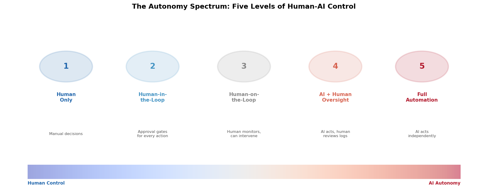
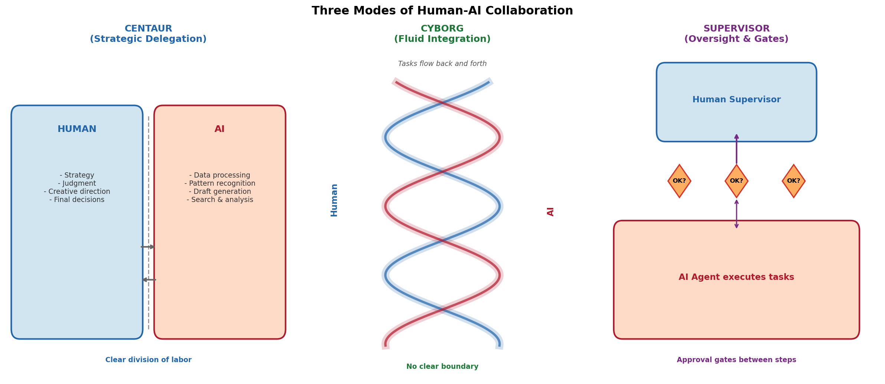
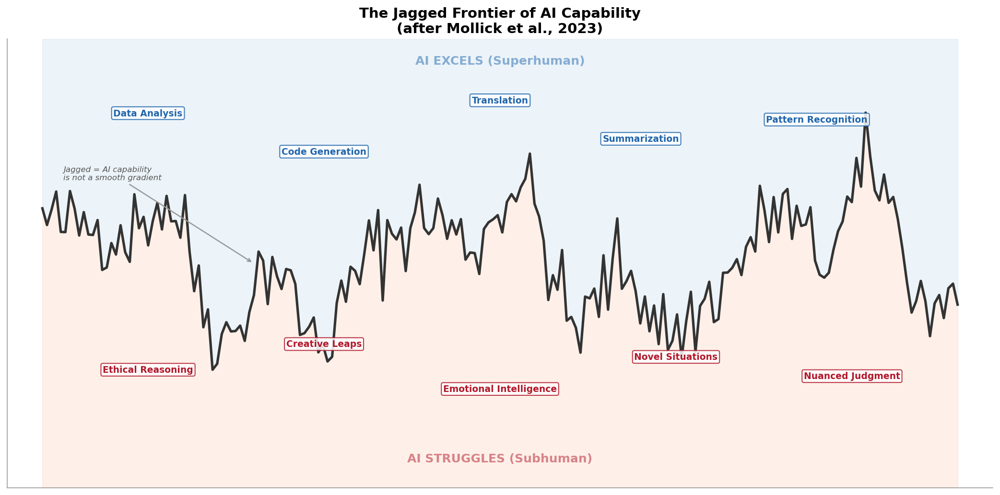
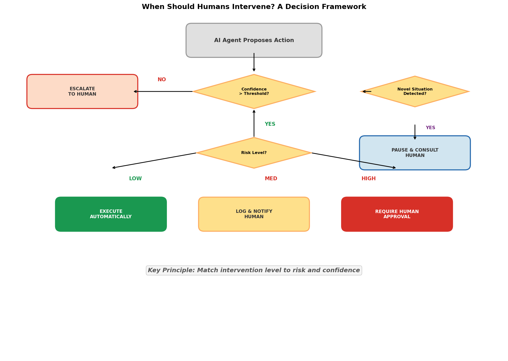
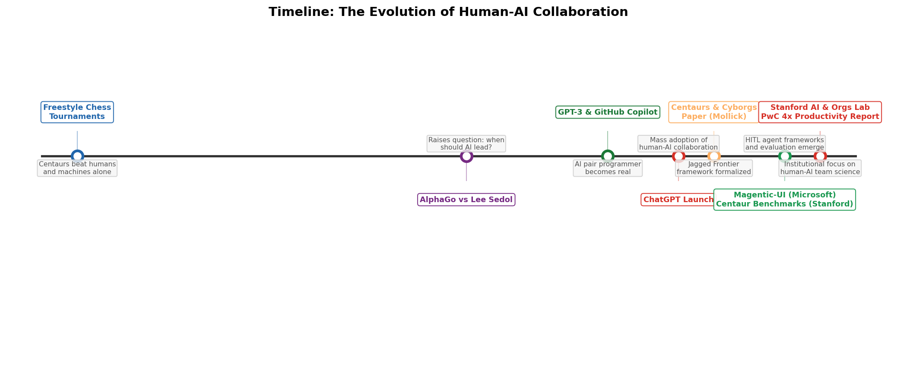

# Day 44: Human-AI Collaboration — When to Trust the Machine and When to Step In

> **Core Question**: How do you design work so that humans and AI agents genuinely amplify each other, rather than getting in each other's way?

---

## Opening: The Centaur Lesson from Chess

Between 2005 and 2008, a series of "freestyle" chess tournaments produced one of the most counterintuitive results in AI history. Teams of humans paired with chess programs — called "centaurs" — consistently beat the best solo humans **and** the best solo computers. Not because the humans were grandmasters or the machines were supercomputers. The centaurs won because they figured out the right *division of labor*: the computer crunched tactics, the human steered strategy, and together they covered each other's blind spots.

Two decades later, we're reliving that lesson at scale. LLM-based agents can write code, draft reports, search databases, and manage workflows. But they also hallucinate, overfit to patterns, and confidently stumble into traps that any attentive human would avoid. The core design challenge for 2026 isn't building more capable AI — it's building the right *interface* between human judgment and machine capability.

This article covers the frameworks, design patterns, and empirical evidence for effective human-AI collaboration — when to delegate, when to intervene, and how to avoid the "falling asleep at the wheel" trap.

---

## 1. The Autonomy Spectrum: Five Levels of Control

#### Intuition: Think of it like driving

Imagine a car with five settings: (1) you drive manually, (2) the car suggests routes but you approve every turn, (3) the car drives but you can grab the wheel, (4) the car drives and tells you what it did afterward, (5) the car drives itself and you're not even in it. Human-AI collaboration works the same way — the question is always "who holds the steering wheel at this moment?"

Not every task needs the same level of human oversight. Reading and summarizing a document? Let the AI handle it. Approving a financial transfer? That needs human eyes. The art is matching the right level of autonomy to the right task.


*Figure 1: Five levels of human control over AI agents, from fully manual to fully autonomous. The right level depends on risk, novelty, and confidence.*

The spectrum in practice:

| Level | Name | When to Use | Example |
|-------|------|-------------|---------|
| 1 | Human Only | High-stakes, novel, or ethical decisions | Medical diagnosis review, legal sentencing |
| 2 | Human-in-the-Loop | Risky but structured tasks | Financial approvals, code deployment to production |
| 3 | Human-on-the-Loop | Moderate risk, AI is mostly capable | Customer service routing, content moderation |
| 4 | AI + Human Oversight | Low risk, high volume | Log analysis, draft generation, data entry |
| 5 | Full Automation | Well-understood, low-risk, reversible | Spell checking, file compression, calendar scheduling |

The key insight: **most real-world systems need to shift between levels dynamically** depending on what's happening. A customer service agent might operate at Level 4 normally, drop to Level 2 when it detects a complaint about a legal issue, and escalate to Level 1 for a potential PR crisis.

---

## 2. Three Collaboration Modes: Centaur, Cyborg, and Supervisor

Ethan Mollick and colleagues at Harvard Business School, in their study of consultants using AI at BCG (Boston Consulting Group), identified distinct patterns in how people work with AI — which they famously labeled "Centaurs and Cyborgs" (Dell'Acqua et al., 2023). A third pattern, the Supervisor mode, has emerged as agents become more capable.


*Figure 2: Three distinct modes of human-AI collaboration. Centaur: clear division of labor. Cyborg: fluid, intertwined work. Supervisor: human oversees with approval gates.*

### 2.1 Centaur Mode — Strategic Delegation

The Centaur (named after the freestyle chess teams) splits work into clear human and AI domains. You define the strategy, the AI executes the tactics. The boundary is explicit.

**How it works in practice:**
- A researcher outlines the argument structure and key claims for a paper
- The AI fills in literature review, data analysis, and formatting
- The researcher reviews and revises the final draft

**Strengths:** Clear accountability, easy to audit, works well for complex tasks where the human provides direction and the AI provides throughput.

**Weaknesses:** Can miss synergies — sometimes the AI spots something during execution that changes the strategy, but the rigid handoff prevents this feedback from flowing.

### 2.2 Cyborg Mode — Fluid Integration

In Cyborg mode, the boundary between human and AI dissolves. They work on the same task simultaneously, passing pieces back and forth in a continuous stream. Think of it as pair programming where neither partner has a fixed role.

**How it works in practice:**
- A developer starts typing a function signature, the AI completes the implementation
- The developer modifies the output, the AI adjusts surrounding code to match
- They iterate sentence-by-sentence on a document, each building on the other's contribution

**Strengths:** Maximum throughput, captures emergent insights, feels like working with a fast colleague.

**Weaknesses:** Harder to audit who did what, risk of "falling asleep at the wheel" (the human stops critically evaluating because the AI seems competent), potential for groupthink-style errors.

### 2.3 Supervisor Mode — Oversight with Gates

The Supervisor delegates most execution to the AI but inserts approval checkpoints at critical moments. The AI proposes, the human disposes — but only at specific gates.

**How it works in practice:**
- An AI agent processes customer support tickets automatically
- When it encounters a ticket it can't classify confidently, it pauses and flags for human review
- High-value refunds require human approval; small refunds are automatic

**Strengths:** Scales well (human attention is scarce, so it's focused on the highest-value interventions), clear escalation paths.

**Weaknesses:** If the gates are poorly designed, the AI can do a lot of damage between checkpoints. The human can become a rubber stamp if the AI is right 99% of the time.

### Comparison

| Aspect | Centaur | Cyborg | Supervisor |
|--------|---------|--------|------------|
| Boundary | Clear split | Fluid, continuous | Periodic checkpoints |
| Human role | Strategist | Collaborator | Approver |
| AI role | Executor | Co-creator | Agent |
| Best for | Complex creative work | Knowledge work, coding | High-volume operations |
| Audit trail | Clear | Messy | Clear at gates |
| Risk | Missed synergies | Over-reliance, rubber-stamping | Damage between gates |

---

## 3. The Jagged Frontier: Why Collaboration Is Hard

#### Intuition: Imagine a mountain range, not a smooth hill

AI capability doesn't improve gradually across all tasks. It's more like a jagged mountain range: at one moment, the AI is superhuman (beating world champions at Go), and at the next task over — something a child could do, like understanding whether a photo was taken upside-down — the AI fails completely. This irregular boundary is what Mollick calls the **Jagged Frontier**.

This jaggedness is precisely why human-AI collaboration is hard. If AI were uniformly good or uniformly bad, the design would be simple. But because the frontier is jagged, you can't just set a global "trust level" — you need to understand *which specific tasks* the AI excels at and *which it doesn't*, and the boundary shifts as models improve.


*Figure 3: The Jagged Frontier of AI capability. AI can be superhuman at pattern recognition and code generation while simultaneously struggling with tasks that require emotional intelligence or ethical reasoning. The boundary is irregular — adjacent tasks can have vastly different AI performance.*

The practical consequence: **you can't just "trust AI more" over time.** Each new task or domain requires fresh calibration. The consultant in the BCG study who used AI to brainstorm creative ideas performed 40% better than those who didn't — but the consultant who used AI for tasks just beyond its competence performed *worse* than someone who didn't use AI at all, because they trusted wrong answers confidently delivered.

---

## 4. Designing Intervention: When Should Humans Step In?

If you're building an AI agent system, the question isn't "should humans be involved?" — it's "at exactly which moments should they intervene, and how?"

### 4.1 The Decision Framework


*Figure 4: A decision framework for human intervention in AI agent workflows. Three factors determine the intervention level: confidence, risk, and novelty.*

The framework rests on three signals:

1. **Confidence**: How sure is the AI about this specific action? If the model's confidence score is below a threshold, escalate to a human regardless of risk level.

2. **Risk**: What's the worst-case outcome if the AI is wrong? A typo in an internal memo is low risk; an irreversible financial transaction is high risk.

3. **Novelty**: Is this situation something the AI has seen before? If the input is out of distribution — a novel type of request, an unusual combination of conditions — the AI is more likely to fail, even if it reports high confidence.

These three signals combine to determine the intervention level:

$$
\begin{aligned}
\text{Intervention Level} = f(\text{confidence}, \text{risk}, \text{novelty})
\end{aligned}
$$

Where **f** maps to one of: execute automatically, log and notify, require human approval, or escalate to human. The exact thresholds are domain-specific, but the structure is universal.

### 4.2 Practical Implementation Patterns

Different frameworks implement intervention differently:

| Pattern | How It Works | Example Implementation |
|---------|-------------|----------------------|
| Approval Gates | AI pauses at predefined steps for human sign-off | Microsoft Magentic-UI's Action Guards |
| Confidence Escalation | AI self-assesses certainty; low confidence triggers human review | Custom agent pipelines with logprob thresholds |
| Sampling Review | Randomly audit a percentage of AI decisions | Quality assurance in automated content moderation |
| Anomaly Detection | Monitor for out-of-distribution inputs, trigger human review | Fraud detection systems with human escalation |
| Progressive Autonomy | AI starts with full oversight; trust increases over time as accuracy is validated | Onboarding new AI agents into production workflows |

### 4.3 The Approval Fatigue Problem

There's a catch: **if you ask humans to approve everything, they stop paying attention.** Research on alarm fatigue in healthcare shows that when nurses receive too many alerts, they start ignoring critical ones. The same pattern applies to AI oversight.

The solution is to be selective about *what* requires approval:

- **Approve actions, not plans**: Instead of approving the AI's entire plan, approve the critical steps and let the rest auto-execute.
- **Batch approvals**: Group similar low-risk decisions into a single review batch rather than interrupting the human one at a time.
- **Adaptive thresholds**: As the AI proves reliable in a specific domain, gradually reduce human oversight. If error rates spike, tighten oversight again.

---

## 5. What the Evidence Says: Empirical Findings

Theory is useful, but what does the data actually show about human-AI collaboration?

### 5.1 The Productivity Effect Is Real — but Uneven

Erik Brynjolfsson, Danielle Li, and Lindsey Raymond studied customer support agents at a Fortune 500 company and found that generative AI tools increased productivity by **14% on average** — but the gains were dramatically larger for **newer, less experienced workers** (up to 35%), while experienced workers saw minimal improvement. AI essentially compressed the learning curve, helping novices perform closer to the expert level.

This is the **leveling effect**: AI disproportionately helps those who need it most, which has profound implications for training and team composition.

PwC's 2025 Global AI Jobs Barometer found that in industries most exposed to AI (like financial services and software publishing), **revenue per employee growth nearly quadrupled** from 7% (2018–2022) to 27% (2018–2024) after generative AI adoption. Crucially, jobs grew even in the most "automatable" roles — AI was augmenting workers, not replacing them.

### 5.2 Hybrid Teams Outperform Both Pure Humans and Pure AI

A November 2025 study from Stanford and Carnegie Mellon tested 48 human professionals against four leading AI agent frameworks on 16 realistic multi-step tasks. The result: autonomous AI agents were faster and cheaper but had significantly lower success rates than humans working alone. The best performance came from **hybrid human-AI teams** — confirming the centaur pattern from chess 20 years earlier.

### 5.3 The "Falling Asleep at the Wheel" Risk

The same BCG study that identified Centaurs and Cyborgs also found a darker pattern: consultants who relied on AI for tasks just beyond its competence performed **worse** than consultants who didn't use AI at all. The AI's confident delivery of wrong answers created a false sense of security. Humans stopped double-checking because "the AI seems so sure."

This is the central paradox of human-AI collaboration: **the better AI gets, the more dangerous its failures become**, because humans are less likely to catch them.

---

## 6. Building Effective Human-AI Workflows: Practical Guidelines

Based on the research and frameworks discussed above, here are concrete design principles:

### Principle 1: Match Autonomy to Risk, Not to Capability

Don't ask "can the AI do this?" — ask "what happens if the AI gets this wrong?" If the worst case is a typo, let it run. If the worst case is a $10M wire transfer to the wrong account, require human confirmation regardless of how confident the AI is.

### Principle 2: Design for the Jagged Frontier

Don't assume AI capability is uniform. For each new task type, start with human oversight (Level 2 or 3), measure accuracy, and only then consider reducing oversight. Re-calibrate when the model changes.

### Principle 3: Make AI Reasoning Visible

Humans can't effectively supervise what they can't understand. AI agents should expose their reasoning chain — not just the final answer, but the steps that led to it. This enables humans to spot errors in the process, not just in the output. Frameworks like ReAct (Day 32) and chain-of-thought prompting (Day 20) help here.

### Principle 4: Avoid Approval Fatigue

If you require human approval for more than ~20% of decisions, humans start rubber-stamping. Be selective. Use confidence thresholds and risk scoring to surface only the decisions that genuinely need human judgment.

### Principle 5: Measure the Team, Not Just the AI

Traditional benchmarks evaluate AI in isolation. Stanford's Centaur Evaluation framework proposes a different approach: evaluate the human-AI team as a unit. The metric isn't "how accurate is the AI?" but "how much better does the human perform with this AI than without it?" This is the metric that actually matters in production.

---


*Figure 5: From freestyle chess centaurs in 2005 to institutional research labs in 2026 — the 20-year arc of human-AI collaboration.*

## 7. Frontier: What's Changing in 2025–2026

The field is moving fast. Here are the most significant recent developments:

1. **Microsoft Magentic-UI (July 2025)**: An open-source human-in-the-loop web agent built on AutoGen. It implements six HITL mechanisms including co-planning, action guards, and plan learning. The key innovation: the agent doesn't just ask for approval — it collaborates on the plan itself before execution begins. ([Microsoft Research Blog](https://www.microsoft.com/en-us/research/blog/magentic-ui-an-experimental-human-centered-web-agent/), [paper](https://arxiv.org/abs/2507.22358))

2. **Stanford Centaur Evaluations (NeurIPS 2025)**: A formal benchmark for evaluating human-AI teams jointly, rather than AI in isolation. The framework defines three components: human participants, interface design, and scoring rules. Presented at ICML 2025 and NeurIPS 2025. ([Stanford Digital Economy Lab](https://digitaleconomy.stanford.edu/project/ai-centaur-benchmarks/))

3. **LLM-Based Human-Agent Collaboration Survey (Zou et al., May 2025)**: The first comprehensive survey of LLM-based human-agent systems, accepted at ACL 2026 Findings. It systematizes the field into five core components: environment/profiling, human feedback, interaction types, orchestration, and communication. ([arXiv:2505.00753](https://arxiv.org/abs/2505.00753))

4. **Stanford AI & Organizations Lab (May 2026)**: A new research center at Stanford HAI dedicated to the empirical science of how AI transforms workplace coordination. Launched alongside the "AI for Organizations Grand Challenge" with Google DeepMind. ([Stanford HAI](https://healthpolicy.fsi.stanford.edu/news/stanford-hai-launches-ai-and-organizations-lab-study-science-ai-workplace))

5. **Agentic AI Field Experiment at Alibaba (May 2026)**: One of the first large-scale field experiments testing human-in-the-loop interventions for agentic AI in customer service. Provides real-world evidence on when human intervention improves outcomes versus when it adds latency without benefit. ([arXiv:2605.14830](https://arxiv.org/abs/2605.14830))

---

## 8. Common Misconceptions

### "More human oversight is always better"

**Wrong.** Every human approval step adds latency, cost, and cognitive load. Over-supervision leads to approval fatigue — humans stop paying attention. The goal is *proportionate* oversight: enough to catch the errors that matter, not so much that humans become rubber stamps.

### "AI will eventually replace the need for human oversight"

**Unlikely for high-stakes domains.** As AI becomes more capable, its failures become *more* dangerous precisely because humans trust it more. The jagged frontier means there will always be tasks where AI fails unexpectedly, adjacent to tasks where it's superhuman. Human judgment is the safety net for that jaggedness.

### "Centaur mode is always the best approach"

**Not always.** The right mode depends on the task. Centaur works well for complex, decomposable work. Cyborg works better for creative, exploratory work where the boundary between strategy and execution is blurry. Supervisor works better for high-volume operational tasks. Most real systems need all three modes, switching between them dynamically.

---

## 9. Code Example: Building a Confidence-Based Intervention System

```python
"""
A minimal confidence-based intervention system.
Demonstrates how to route AI actions to different 
intervention levels based on confidence, risk, and novelty.
"""
from dataclasses import dataclass
from enum import Enum
from typing import Optional

class RiskLevel(Enum):
    LOW = "low"
    MEDIUM = "medium"
    HIGH = "high"

class Action(Enum):
    EXECUTE = "execute_automatically"
    LOG_NOTIFY = "log_and_notify"
    REQUIRE_APPROVAL = "require_human_approval"
    ESCALATE = "escalate_to_human"

@dataclass
class AIProposal:
    """An action proposed by an AI agent."""
    description: str
    confidence: float        # 0.0 to 1.0
    risk: RiskLevel
    is_novel: bool           # Is this a new type of situation?
    predicted_impact: float  # Estimated cost if wrong

def decide_intervention(proposal: AIProposal) -> Action:
    """
    Decide how much human involvement this action needs.
    Three-factor decision: confidence, risk, novelty.
    """
    # Rule 1: Novel situations always escalate
    if proposal.is_novel:
        return Action.ESCALATE
    
    # Rule 2: Low confidence always escalates
    if proposal.confidence < 0.7:
        return Action.ESCALATE
    
    # Rule 3: Risk determines intervention level
    if proposal.risk == RiskLevel.HIGH:
        return Action.REQUIRE_APPROVAL
    elif proposal.risk == RiskLevel.MEDIUM:
        if proposal.confidence < 0.9:
            return Action.REQUIRE_APPROVAL
        return Action.LOG_NOTIFY
    else:  # LOW risk
        if proposal.confidence < 0.85:
            return Action.LOG_NOTIFY
        return Action.EXECUTE

# Example usage
proposal = AIProposal(
    description="Refund $5.00 to customer #12345",
    confidence=0.95,
    risk=RiskLevel.LOW,
    is_novel=False,
    predicted_impact=5.0
)
print(decide_intervention(proposal))  # EXECUTE

proposal2 = AIProposal(
    description="Transfer $500,000 to account XYZ",
    confidence=0.92,
    risk=RiskLevel.HIGH,
    is_novel=False,
    predicted_impact=500000.0
)
print(decide_intervention(proposal2))  # REQUIRE_APPROVAL
```

---

## 10. Further Reading

### Foundational Papers
1. ["Navigating the Jagged Technological Frontier"](https://papers.ssrn.com/sol3/papers.cfm?abstract_id=4573321) — Dell'Acqua et al. (2023). The BCG consultant study that introduced Centaurs vs. Cyborgs.
2. ["Generative AI at Work"](https://economics.mit.edu/sites/default/files/inline-files/draft_copilot_experiments.pdf) — Brynjolfsson, Li, Raymond (2025). Field experiment showing 14% productivity gains, concentrated among novice workers.
3. ["Modeling the Centaur: Human-Machine Synergy in Sequential Decision Making"](https://arxiv.org/abs/2412.18593) — Shoresh (2024). Formal study of human-machine synergy in chess using Mixture of Experts.

### Recent Surveys
4. ["LLM-Based Human-Agent Collaboration and Interaction Systems: A Survey"](https://arxiv.org/abs/2505.00753) — Zou et al. (2025, ACL 2026 Findings). First comprehensive survey of the field.
5. ["Cyborgs, Centaurs and Self-Automators: The Three Modes of Human-GenAI Knowledge Work"](https://papers.ssrn.com/sol3/papers.cfm?abstract_id=4921696) — Randazzo, Lifshitz-Assaf, Kellogg, Mollick et al. (2024).

### Tools and Frameworks
6. [Microsoft Magentic-UI](https://microsoft.github.io/magentic-ui/) — Open-source human-in-the-loop web agent.
7. [Stanford Centaur Evaluations](https://digitaleconomy.stanford.edu/project/ai-centaur-benchmarks/) — Benchmark framework for evaluating human-AI teams.
8. [PwC 2025 Global AI Jobs Barometer](https://www.pwc.com/gx/en/services/ai/ai-jobs-barometer.html) — Industry data on AI's impact on productivity and jobs.

---

## Reflection Questions

1. Think about your own workflow. Which tasks do you currently do manually that a Centaur or Cyborg approach could improve? What would you need to trust the AI on those tasks?
2. If you were designing an approval system for an AI agent, how would you set the confidence threshold? What would you measure to know if you'd set it too high or too low?
3. The "falling asleep at the wheel" problem gets worse as AI gets better. What design patterns could keep humans engaged and critical without creating approval fatigue?

---

## Summary

| Concept | One-line Explanation |
|---------|---------------------|
| Autonomy Spectrum | Five levels from full human control to full AI automation |
| Centaur Mode | Clear division: human strategizes, AI executes |
| Cyborg Mode | Fluid: human and AI intertwine on the same task |
| Supervisor Mode | AI executes, human approves at gates |
| Jagged Frontier | AI capability is irregular — superhuman at some tasks, failing at adjacent ones |
| Confidence-Risk-Novelty | Three signals that determine when humans should intervene |
| Approval Fatigue | Too many approval requests makes humans stop paying attention |
| Centaur Evaluation | Evaluating human-AI teams jointly, not AI alone |

**Key Takeaway**: The future isn't human *or* AI — it's human *and* AI. But effective collaboration requires deliberate design: matching autonomy to risk, making AI reasoning visible, avoiding approval fatigue, and measuring the team's performance, not just the AI's. The best systems let humans and AI play to their respective strengths while maintaining the human judgment that catches the failures AI can't predict.

---

*Day 44 of 60 | LLM Fundamentals*
*Word count: ~3100 | Reading time: ~15 minutes*
