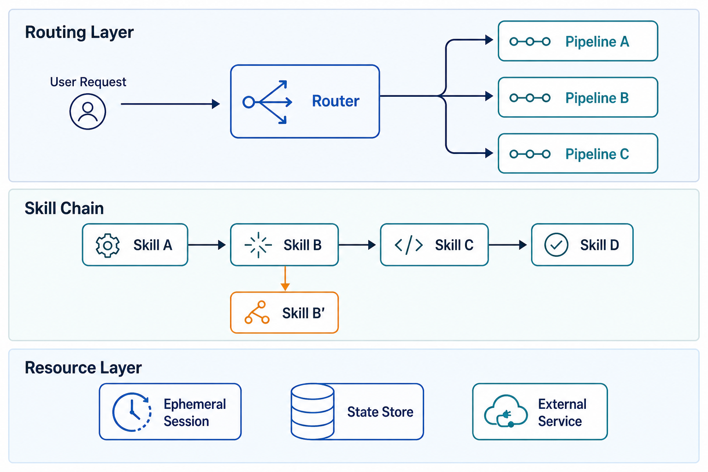

# Day 45: Agent-Native Workflows — From Ad-Hoc Tools to Orchestrated Skill Pipelines

> **Core Question**: When your team has 20 skills and 10 recurring workflows, how do you turn them into a reliable system where agents execute work on demand — instead of a chaotic toolbox nobody can navigate?

---

## Opening: The Tool Crib Problem

Every carpenter's workshop has a pegboard. Hammers here, saws there, measuring tapes in the drawer. When you know where everything is and which tool to grab, work flows. When tools pile up unorganized — duplicates, broken ones mixed with good ones, no labels — you spend more time looking for the right tool than doing the actual work.

AI agent teams hit this wall fast. In [Day 40](day40-agent-skills.md), we learned how to design a single skill: wrap a tool with instructions, knowledge, and constraints. That works great when you have five skills. At twenty? You've got a different problem entirely. Skills overlap. Agents pick the wrong one. Nobody remembers which skill handles which edge case. And the "just let the agent figure it out" approach — where you dump all skill descriptions into the context window and hope the agent chooses correctly — starts breaking down in production.

The real question shifts from "how do I write a good skill?" to **"how do I architect a system of skills that agents can navigate reliably?"**

This is the gap between having tools and having a workshop. Between an agent that *can* do things and an agent that *reliably does the right things in the right order*. This article is about building that workshop: organizing skills into pipelines, giving agents a CLI to navigate them, running them in ephemeral cloud sessions, and making the whole system reliable enough for daily team use.

---

## 1. Three Generations of Agent Workflows

#### Intuition: From Recipe Cards to a Kitchen Brigade

A home cook has recipe cards — one dish at a time, pulled out when needed. A restaurant kitchen has a brigade system: stations, prep lists, timing, and a head chef coordinating the flow. The recipes haven't changed, but the *system* around them is what makes 200 covers a night possible.

Agent workflows have gone through a similar evolution.

> **How does this relate to loop engineering?** In June 2026, Peter Steinberger's tweet about "designing loops that prompt your agents" (6.5M views) sparked the loop engineering movement — the idea that you should stop typing prompts manually and instead build an outer loop that triggers agents on a schedule, checks results, and iterates automatically.
>
> Loop engineering and skill pipelines solve different problems. **Loop engineering is about *when* and *how often* agents run** — the temporal control structure that replaces manual prompting with automated cycles. **Skill pipelines are about *what happens inside* a single execution** — how multiple skills are organized, connected, and orchestrated to complete a task.
>
> They're complementary: a well-designed loop often triggers a skill pipeline as its body. You need both — loops for the outer automation, pipelines for the inner execution. This article focuses on the pipeline layer.

### Generation 1: Ad-Hoc Prompting (2023–2024)

Every interaction starts from scratch. You write a prompt, the LLM responds, you iterate. Tools are called manually via function calling ([Day 33](day33-tool-use.md)). No persistence, no reuse, no system.

- **Strength**: Maximum flexibility
- **Weakness**: Zero consistency — same task, different prompt, different result every time
- **When it fits**: Prototyping, exploration, one-off tasks

### Generation 2: Skill Libraries (2025)

[Day 40](day40-agent-skills.md) marked the arrival of standardized skills. You write a `SKILL.md`, the agent loads it on demand, and the skill brings instructions + tools + knowledge in one package. Skill registries like ClawHub make sharing possible.

The agent sees all available skill descriptions and picks the right one. This is where most teams are right now — they have a skill library and the agent navigates it autonomously.

- **Strength**: Reusable, composable, shareable
- **Weakness**: The agent makes routing decisions every single time. With 20 skills, it sometimes picks the wrong one. With multi-step workflows, it loses the thread halfway through
- **When it fits**: Individual capability building, small-scale agent deployments

### Generation 3: Orchestrated Skill Pipelines (2025–2026)

This is where production teams are heading. Instead of the agent freely navigating 20 skills every time, you define **pipelines**: pre-orchestrated sequences of skills for known workflows. The agent's job shifts from "figure out which skills to use" to "execute this pipeline, making smart decisions at each step."

Think of it as the difference between handing a new hire a toolbox and saying "go fix things" (Gen 2) versus giving them a runbook that says "for this type of issue, use these three tools in this order" (Gen 3). They still need judgment — but the structure eliminates most of the routing errors.

| Generation | Agent's Job | Failure Mode | Best For |
|------------|------------|--------------|----------|
| Gen 1: Ad-Hoc | Everything from scratch | Inconsistency | Prototyping |
| Gen 2: Skill Library | Pick the right skill each time | Routing errors at scale | Single-task agents |
| Gen 3: Pipelines | Execute known flows, decide at branches | Pipeline rigidity vs. flexibility tradeoff | Team workflows in production |

**The key insight**: Gen 3 doesn't replace Gen 2. It layers *on top* of it. You still need well-designed skills (Gen 2). But you add a pipeline orchestration layer that handles the 80% of work that's predictable, leaving the agent's full autonomy for the 20% that genuinely requires adaptive reasoning.

---

## 2. The Skill Sprawl Problem

Before we build pipelines, let's understand why they're needed. A team going from 5 to 20 skills hits several walls:

### 2.1 The Discovery Problem

With 20 skill descriptions loaded into the context window, the agent has to play a matching game every time: "which of these 20 skills fits this request?" Sometimes two skills seem equally relevant. Sometimes none feel exactly right, and the agent picks the closest one — which is wrong.

This is the **skill description collision** problem. When `deploy-app` and `deploy-service` both have similar descriptions, the agent guesses. Sometimes it guesses right. Sometimes it deploys your user-facing app when you meant to deploy a backend microservice.

### 2.2 The Sequencing Problem

Many real tasks require multiple skills in sequence: investigate → diagnose → fix → verify. In a Gen 2 skill library, the agent has to figure out this sequence every time. It might investigate, then verify, then try to fix — wrong order. Or it might skip diagnosis entirely and jump to a fix based on incomplete information.

Humans solve this with runbooks and SOPs. Agents need the equivalent.

### 2.3 The State Problem

Skill A produces a result. Skill B needs that result as input. In a Gen 2 system, this state handoff happens through the agent's context window — Skill A's output stays in the conversation, and the agent passes relevant parts to Skill B. This works for simple two-step flows. It breaks down when:

- The pipeline has 6+ steps and the context window gets cluttered
- A step produces large output (logs, reports) that shouldn't sit in context
- The agent needs to retry from step 4 without redoing steps 1–3

These three problems — discovery, sequencing, and state — are what pipelines solve.

---

## 3. Anatomy of a Skill Pipeline

A pipeline is a pre-defined orchestration of skills with explicit input/output contracts, state handoff mechanisms, and failure handling. Let's break down the architecture.

### 3.1 Three Layers


*Figure 1: Three layers of a skill pipeline system. The routing layer matches intent to pipeline. The skill chain executes the sequence. The resource layer manages sessions, state, and external resources.*

**Layer 1 — Routing**: When a request comes in, the routing layer determines which pipeline (if any) matches the user's intent. This can be agent-driven (the agent reads the request and selects a pipeline) or rule-based (keyword matching, explicit CLI commands). In practice, most systems use a hybrid: explicit commands for known workflows, agent reasoning for ambiguous cases.

**Layer 2 — Skill Chain**: The heart of the pipeline. Each node is a skill execution with defined inputs, outputs, and transition conditions. The chain can be linear (A → B → C), branching (A → B or C based on condition), or parallel (A → [B and C simultaneously] → D).

**Layer 3 — Resource Management**: The infrastructure that makes the pipeline work: ephemeral agent sessions, state stores for inter-skill data passing, external service connections, and lifecycle management (spin up, execute, clean up).

### 3.2 A Concrete Example: Deploy-and-Verify Pipeline

Let's make this tangible. A DevOps team has a recurring workflow: deploy a service, run health checks, verify the deployment, and notify the team. Here's how it looks as a pipeline:

```
┌─────────┐    ┌───────────┐    ┌──────────┐    ┌─────────┐
│  Deploy  │───▶│ Health     │───▶│ Verify   │───▶│ Notify  │
│  Service │    │ Check      │    │ Endpoints│    │ Team    │
└─────────┘    └───────────┘    └──────────┘    └─────────┘
                      │
                      ▼ (if unhealthy)
               ┌───────────┐
               │ Rollback  │
               │ & Alert   │
               └───────────┘
```

Each box is a skill. The arrows define the execution order and branching conditions. The pipeline encodes team knowledge: "always run health checks after deploy," "roll back automatically if health check fails," "notify the team when done."

Without this pipeline, the agent would have to figure out this sequence every time. It might skip the health check. It might notify before verifying. It might not know that rollback is an option. The pipeline eliminates these failure modes.

### 3.3 Pipeline Definition Format

How do you actually write a pipeline definition? At its core, a pipeline is a declaration of skills, their order, and their interconnections:

```yaml
# pipeline: deploy-and-verify
name: deploy-and-verify
description: Deploy a service, verify health, and notify the team
trigger:
  command: "deploy"          # CLI command that invokes this pipeline
  intent_keywords: ["deploy", "ship", "release"]

steps:
  - id: deploy
    skill: service-deploy
    inputs:
      service_name: "${user.service_name}"
      environment: "${user.environment | default: staging}"
    outputs:
      deployment_id: "${result.deployment_id}"
      version: "${result.version}"

  - id: health_check
    skill: health-check
    depends_on: deploy
    inputs:
      service_name: "${user.service_name}"
      environment: "${user.environment}"
    outputs:
      healthy: "${result.healthy}"
      issues: "${result.issues}"
    on_failure:
      action: goto
      target: rollback

  - id: verify
    skill: endpoint-verify
    depends_on: health_check
    condition: "${health_check.healthy == true}"
    inputs:
      endpoints: "${deploy.endpoints}"
    outputs:
      verified: "${result.all_passed}"

  - id: rollback
    skill: service-rollback
    inputs:
      deployment_id: "${deploy.deployment_id}"
    outputs: {}

  - id: notify
    skill: team-notify
    depends_on: [verify, rollback]
    inputs:
      message: "${pipeline.summary}"
      channel: "${user.channel | default: ops}"
```

This definition captures what a senior engineer knows intuitively — but makes it reproducible, auditable, and executable by any agent session.

---

## 4. Skills in Pipeline Context: The Contract Layer

In [Day 40](day40-agent-skills.md), a skill was defined as `SKILL.md` + scripts + resources. In a pipeline, skills need something more: **explicit input/output contracts**.

### 4.1 Why Contracts Matter

Free-form skills work when a human or agent directly reads the instructions and improvises. In a pipeline, skills are chained mechanically. Skill B doesn't read Skill A's instructions — it expects a specific input format. If Skill A outputs `{"status": "ok"}` and Skill B expects `{"healthy": true}`, the pipeline breaks.

A contract makes this explicit:

```markdown
# Skill: health-check

## Input Contract
| Field | Type | Required | Description |
|-------|------|----------|-------------|
| service_name | string | yes | Name of the service to check |
| environment | string | yes | One of: staging, production |
| timeout | int | no | Check timeout in seconds (default: 30) |

## Output Contract
| Field | Type | Description |
|-------|------|-------------|
| healthy | boolean | Overall health status |
| issues | array[object] | List of specific issues found |
| latency_ms | int | Response latency in milliseconds |
```

With contracts, the pipeline orchestrator can validate inputs before execution, catch mismatches at definition time (not runtime), and transform outputs between steps when needed.

### 4.2 State Handoff Strategies

How does data flow from one skill to the next? Three approaches, each with trade-offs:

**Approach 1 — Context Window Passing**

Skill A's output stays in the agent's context window. Skill B reads it from there.

- *Pro*: Simple, no external infrastructure
- *Con*: Context window pollution; large outputs crowd out instructions; retries are messy
- *When to use*: Short pipelines (2–3 steps), small outputs

**Approach 2 — External State Store (Skills self-coordinate via shared storage)**

Each skill writes its output to a shared store (file, database, key-value store). The pipeline passes references (IDs, paths) between steps, not the data itself. **Crucially, each skill is responsible for knowing where to read from and where to write to** — the orchestrator just triggers skills in order.

```
Orchestrator: "Run deploy, then run health_check"

Skill deploy:
  → reads input from pipeline context
  → executes
  → writes /state/pipeline-123/deploy.json  (skill decides the path)

Skill health_check:
  → reads /state/pipeline-123/deploy.json   (skill knows where to look)
  → executes
  → writes /state/pipeline-123/health.json
```

- *Pro*: Clean context window, supports retries (step 2 can re-read step 1's output without re-running step 1), handles large data
- *Con*: Skills must agree on storage conventions — Skill B needs to know Skill A's output path and format. This is implicit coupling that doesn't show up in any contract
- *When to use*: Production pipelines where skills are written by the same team and storage conventions are stable

**Approach 3 — Orchestrator-Managed Handoff (The pipeline handles data transfer)**

The key difference from Approach 2: **skills don't know about each other at all.** Each skill only declares its input/output contract. The orchestrator reads Skill A's output, applies any field mapping defined in the pipeline, and injects the result as Skill B's typed input. Skills never touch shared storage directly.

```python
# The orchestrator handles handoff — skills are pure functions
deploy_result = await execute_skill("service-deploy", inputs)

# Orchestrator maps fields based on pipeline definition:
#   pipeline says: health_check.service_name = deploy.service_name
#   pipeline says: health_check.environment = deploy.environment
health_result = await execute_skill("health-check", {
    "service_name": deploy_result.service_name,
    "environment": deploy_result.environment
})
```

The distinction matters when skills come from different teams or when you need to adapt field names between steps. In Approach 2, if Skill A outputs `app_version` and Skill B expects `version`, you'd have to modify one of the skills. In Approach 3, the orchestrator handles the mapping — neither skill changes.

- *Pro*: Skills are fully decoupled — each only knows its own contract; field mapping at the orchestrator level handles mismatches; contract violations caught at pipeline-definition time
- *Con*: Requires an orchestration layer that understands skill contracts and performs the mapping
- *When to use*: Skills from different teams, cross-framework pipelines, or any system where you want strict contract enforcement

**How to choose between 2 and 3**: If you're writing all skills yourself and they share a consistent data format, Approach 2 is simpler. If skills come from different teams, use different field naming, or need to be swapped independently, Approach 3's decoupling is worth the orchestration overhead.

### 4.3 Failure Contracts

What happens when a skill fails? Without a plan, the agent either retries blindly, gives up entirely, or — worst case — continues to the next step with garbage input. A failure contract defines this upfront:

| Strategy | When to Use | Example |
|----------|------------|---------|
| **Retry** | Transient failures (network, rate limit) | API timeout → retry with backoff |
| **Fallback** | When an alternative skill exists | Primary deployment tool fails → use legacy deployment |
| **Skip** | Non-critical step | Notification fails → log warning, continue |
| **Abort + Alert** | Critical step, can't proceed | Deploy fails → stop pipeline, alert on-call |
| **Human Escalation** | Ambiguous failure requiring judgment | Health check inconclusive → pause, ask human |

The failure contract lives in the pipeline definition, not in the skill:

```yaml
on_failure:
  action: retry          # retry | fallback | skip | abort | escalate
  max_retries: 3
  backoff_seconds: 5
  fallback_skill: legacy-deploy
  escalate_to: "#ops-oncall"
```

This separation is important: the skill doesn't need to know what happens when it fails. The pipeline orchestrator makes that decision based on the step's role in the larger workflow.

---

## 5. CLI as Agent Interface

In a production setup, the agent needs a reliable way to discover and invoke skills. A **CLI designed for agent use** — not human use — is one of the most effective patterns for this.

### 5.1 Skills Don't Dictate Their Interface

A skill defines *what to do and how to do it* — but it doesn't dictate *how it gets called*. The same skill can be exposed to agents through multiple interfaces:

| Interface | How the Agent Calls It | Best For |
|-----------|----------------------|----------|
| **CLI command** | Shell execution: `mycli deploy --service api` | Self-contained pipelines, ephemeral sessions |
| **MCP server** ([Day 38](day38-mcp-model-context-protocol.md)) | Standardized tool protocol | Cross-platform tool sharing |
| **Function call** | Native tool calling within the agent runtime | Simple skills used inside a single agent session |
| **Context injection** | Agent reads `SKILL.md` directly and follows instructions | Pure reasoning skills with no scripts |

A CLI is just one of these options — but it's the one that fits skill pipelines best. Here's why.

### 5.2 Why a CLI, Not an API?

This sounds counterintuitive. Why build a CLI when a REST API is the standard service interface? Because agents are tool-callers by nature ([Day 33](day33-tool-use.md)), and in 2026, agents interact with the world primarily through:

1. **Function/tool calling** — structured API calls via the model's native tool interface
2. **Shell commands** — executing CLI tools and reading stdout
3. **MCP servers** ([Day 38](day38-mcp-model-context-protocol.md)) — standardized tool protocol

A CLI hits all three: it can be wrapped as a function call, executed directly in a shell, or exposed via an MCP server. It's the most universal interface layer.

But more importantly, a CLI designed for agent use has specific properties that a generic API doesn't:

| Property | Why It Matters for Agents |
|----------|--------------------------|
| **Self-documenting** | `--help` output serves as inline documentation; agent discovers available commands without external docs |
| **Composable** | Unix pipes (`|`), redirects (`>`), and chaining (`&&`) let agents combine commands naturally |
| **Stateless** | Each invocation is independent — perfect for ephemeral sessions |
| **Scriptable** | Skills can ship as CLI subcommands, and complex skills can bundle scripts that the CLI dispatches |
| **Structured output** | `--json` or `--format=json` gives the agent machine-readable results |

### 5.3 Design Principles for Agent-Facing CLIs

A CLI built for humans optimizes for readability and interactivity. A CLI built for agents optimizes for predictability and machine parsability. The design principles differ:

**Principle 1: Commands Map to Skills (or Pipelines)**

```
mycli deploy --service api --env staging     # → deploy-and-verify pipeline
mycli investigate --service api --symptom high-latency  # → investigate skill
mycli report --range 7d --format json        # → weekly-report pipeline
```

Each command is a direct entry point to a skill or pipeline. The agent doesn't need to browse a skill catalog — the CLI's command structure *is* the catalog.

**Principle 2: Structured Output by Default**

```bash
$ mycli deploy --service api --env staging --format json
{
  "status": "success",
  "deployment_id": "dep_abc123",
  "version": "v2.4.1",
  "endpoints": ["https://api-staging.example.com"],
  "duration_seconds": 47
}
```

The agent reads structured JSON, not free-text. This eliminates parsing errors — the most common source of agent failure when interacting with CLI tools.

**Principle 3: Explicit Exit Codes**

```
0  → success
1  → generic failure
2  → invalid input
3  → dependency missing
4  → partial success (pipeline completed with warnings)
10 → skill not found
```

The agent checks `$?` to decide next steps. Exit code 2 means "fix your arguments," not "retry the same thing."

**Principle 4: Skill Scripts Bundled, Not External**

The CLI packages skill scripts internally. When a pipeline step calls the `health-check` skill, the CLI executes the bundled `health_check.sh` or `health_check.py` — not an external URL. This eliminates a class of network failures and makes the CLI self-contained for deployment to any cloud agent environment.

```
mycli/
├── mycli                    # Entry point
├── skills/
│   ├── service-deploy/
│   │   ├── SKILL.md         # Instructions for agent
│   │   ├── deploy.sh        # Script
│   │   └── README.md        # Reference material
│   ├── health-check/
│   │   ├── SKILL.md
│   │   ├── check.py
│   │   └── references/
│   │       └── check-spec.md
│   └── team-notify/
│       ├── SKILL.md
│       └── notify.py
└── pipelines/
    ├── deploy-and-verify.yaml
    └── investigate.yaml
```

This structure mirrors the skill format from Day 40 (`SKILL.md` + scripts + resources) but adds the pipeline definitions and a unified CLI entry point.

---

## 6. Cloud Agent Sessions: Ephemeral by Design

The pipelines we've described need a place to run. For teams building workflow systems in 2026, the dominant pattern is **ephemeral cloud agent sessions** — sessions that spin up on demand, execute a pipeline, and get released.

### 6.1 Why Not Persistent Sessions?

A persistent agent session — one that stays alive 24/7, accumulating context — sounds appealing. The agent "remembers" everything. But in practice, persistent sessions create problems:

| Problem | Why It Matters |
|---------|---------------|
| **Context bloat** | Over days/weeks, the context window fills with old conversations, stale state, and irrelevant history — degrading the agent's decision quality |
| **State corruption** | A transient error in one pipeline execution contaminates the session state for the next one |
| **Security surface** | A long-lived session accumulates credentials, tokens, and access — one compromise exposes everything |
| **Cost** | Idle agent sessions still incur infrastructure costs (model warm-up, state storage, monitoring) |
| **Debugging difficulty** | When something goes wrong, the session's long history makes it hard to isolate what triggered the failure |

Ephemeral sessions solve all of these. Each pipeline execution (or group of related executions) gets a fresh session. Clean context. Isolated state. Bounded lifetime. When the pipeline completes (or fails), the session is released.

### 6.2 The Session Lifecycle

A typical ephemeral session lifecycle for pipeline execution:

```
1. Request arrives → Router selects pipeline
2. Agent provider provisions a new session
3. Session loads relevant skills (based on pipeline definition)
4. Pipeline executes: skill by skill, state passing between steps
5. Session captures results, logs, traces
6. Session releases → resources freed
```

The **agent provider** — the platform that manages session lifecycles — handles steps 2, 5, and 6. The team's responsibility is steps 1, 3, and 4: defining pipelines, skills, and routing logic.

### 6.3 State Across Sessions

If sessions are ephemeral, how does the system remember anything between executions? Three patterns:

**Pattern 1 — Stateless (Pure Functions)**

Each pipeline execution is completely independent. No memory of past runs. This is the simplest and most reliable pattern, suitable for workflows where each invocation is truly self-contained: deployments, health checks, report generation.

**Pattern 2 — External Checkpoints**

The pipeline writes durable state to an external store (database, file system, object storage). The next execution reads from this store. The session itself is ephemeral, but the *work product* persists.

```
Pipeline Run 1 → writes deployment_log.json → session released
Pipeline Run 2 → reads deployment_log.json → session released
```

**Pattern 3 — Session Affinity (Soft State)**

For pipelines that need short-term continuity (e.g., a multi-step investigation that might span a few hours), the agent provider can offer session affinity: route related requests to the same session for a bounded period, then release. This gives the benefits of session continuity without the long-term costs.

| Pattern | Complexity | When to Use |
|---------|-----------|------------|
| Stateless | Low | Standalone tasks (deploy, check, report) |
| External Checkpoints | Medium | Multi-step workflows needing history |
| Session Affinity | High | Interactive multi-turn workflows |

Most team workflows fit Pattern 1 or 2. Pattern 3 is reserved for investigative or exploratory tasks that genuinely need conversation continuity.

---

## 7. Pipeline Orchestration Patterns

Not all pipelines are structured the same way. Depending on the nature of the workflow, different orchestration patterns fit better.

### 7.1 Fixed DAG (Directed Acyclic Graph)

The pipeline is a fixed sequence of steps with defined branching conditions. The agent executes each step in order, following the branches. This is the most predictable pattern — you know exactly which skills will run and in what order.

```
Deploy → Health Check → [Healthy? → Verify → Notify]
                      → [Unhealthy? → Rollback → Alert]
```

- **Best for**: Standardized, repeatable workflows (deployments, CI/CD, report generation)
- **Strength**: Predictability, auditability, easy to test
- **Weakness**: Inflexible — can't adapt to unexpected situations not covered by the branch conditions

### 7.2 Agent-Routed (Autonomous Navigation)

The agent sees all available skills and decides the execution path dynamically based on the situation. There's no fixed sequence — the agent assesses the state after each step and chooses the next action.

```
Agent receives: "The API is returning 500 errors"
Agent decides: 
  1. Check recent deployments (skill: deploy-history)
  2. Inspect error logs (skill: log-analyzer)  
  3. Find related commit (skill: git-bisect)
  4. Roll back (skill: service-rollback)
  5. Verify fix (skill: endpoint-verify)
```

- **Best for**: Investigative tasks, novel problems, exploratory work
- **Strength**: Adapts to any situation, handles edge cases and novelty
- **Weakness**: Non-deterministic — same input might produce different execution paths; harder to audit; requires stronger model reasoning

### 7.3 Hybrid (Structured Skeleton + Agent Autonomy)

This is the pattern that most production teams converge on. The pipeline defines a **skeleton** of required steps and decision points, but at each step, the agent has autonomy to decide *how* to execute that step, and can inject additional steps if needed.

```
Pipeline skeleton:
  1. Investigate (agent chooses how: logs? metrics? recent changes?)
  2. Diagnose (agent chooses how: compare with known issues? ask a DB? reasoning?)
  3. Fix (agent chooses how: rollback? patch? config change?)
  4. Verify (mandatory: must confirm fix worked)
  5. Document (mandatory: write incident summary)
```

The skeleton ensures critical steps aren't skipped (verify, document). The agent's autonomy at each step handles the variability of real-world situations.

- **Best for**: Most team workflows that are "mostly predictable with occasional surprises"
- **Strength**: Balances reliability with adaptability
- **Weakness**: More complex to design — you need to identify which steps to fix and which to leave open

### 7.4 Comparison

| Dimension | Fixed DAG | Agent-Routed | Hybrid |
|-----------|-----------|-------------|--------|
| Predictability | High | Low | Medium |
| Flexibility | Low | High | Medium-High |
| Design effort | Low (define once) | Low (let agent figure it out) | High (balance structure and autonomy) |
| Auditability | High | Low | Medium |
| Model requirements | Any model | Strong reasoning model | Moderate-to-strong model |
| Failure mode | Rigidity | Unpredictability | Complexity in design |

**The practical recommendation**: Start with Fixed DAG for your most common workflows. As you encounter edge cases the DAG can't handle, evolve toward Hybrid. Reserve Agent-Routed for genuinely novel tasks where you can't predict the workflow in advance.

---

## 8. Reliability of Skill Pipelines

In [Day 41](day41-reliability-issues.md), we learned that multi-step agent pipelines suffer from compounding errors: if each step has 95% reliability, a 10-step pipeline succeeds only 60% of the time. Pipelines don't eliminate this math — but they give you structural tools to manage it.

### 8.1 Idempotent Skill Design

An idempotent skill produces the same result whether you run it once or ten times. `deploy --version v2.4.1` either deploys that version (if not already deployed) or reports it's already running. Running it five times doesn't deploy five copies.

Idempotency is the foundation of reliable pipelines because it makes retries safe:

```python
# Idempotent deployment skill
def deploy(service, version, environment):
    current = get_current_version(service, environment)
    if current == version:
        return {"status": "already_deployed", "version": version}
    # ... perform deployment
    return {"status": "deployed", "version": version}
```

Without idempotency, retrying a failed step might cause double-execution side effects — double charges, duplicate records, conflicting deployments. With idempotency, retry is free.

### 8.2 Checkpoint Per Skill

Each skill execution writes its result to a durable checkpoint before the next skill begins. If step 4 fails, you restart from step 4's checkpoint — not from scratch.

```python
class PipelineExecutor:
    def __init__(self, pipeline_def, state_store):
        self.pipeline_def = pipeline_def
        self.state_store = state_store
    
    async def execute(self, pipeline_id, inputs):
        # Load checkpoints from previous runs
        completed = self.state_store.get_completed_steps(pipeline_id)
        
        for step in self.pipeline_def.steps:
            if step.id in completed:
                # Skip already-completed steps, load their results
                result = self.state_store.get_result(pipeline_id, step.id)
            else:
                result = await self.run_step(step, inputs)
                self.state_store.save_checkpoint(
                    pipeline_id, step.id, result
                )
            inputs = {**inputs, **result}
        
        return self.state_store.get_all_results(pipeline_id)
```

This pattern is borrowed directly from data pipeline orchestration tools (Airflow, Prefect, Dagster) — proven at scale for years. Agent pipelines face the same reliability challenges and benefit from the same solutions.

### 8.3 Dry-Run Mode

Before executing a pipeline for real, the agent (or a human reviewer) can trigger a dry run: walk through each step, validate inputs, check dependencies, but don't actually execute side-effectful operations.

```bash
$ mycli deploy --service api --env production --dry-run
[DRY RUN] Step 1: deploy service 'api' version 'v2.4.1' to 'production'
[DRY RUN] Step 2: health check 'api' in 'production' (would check 5 endpoints)
[DRY RUN] Step 3: verify endpoints ['https://api.example.com/health', ...]
[DRY RUN] Step 4: notify '#ops' channel
[DRY RUN] Pipeline would complete in ~4 steps. No changes made.
```

Dry-run is cheap insurance. It catches contract mismatches, missing dependencies, and logic errors before they hit production.

### 8.4 Pipeline-Level Observability

Each skill execution should emit structured trace data: input, output, duration, token usage, success/failure. This data serves two purposes:

1. **Debugging**: When a pipeline fails, you can trace exactly which step failed and why
2. **Optimization**: Identify which steps are consistently slow or expensive

[Day 41](day41-reliability-issues.md) introduced tracing tools (Langfuse, Phoenix, Datadog LLM Observability). In a pipeline context, the key addition is **trace correlation**: all steps in a single pipeline execution share a `pipeline_run_id`, so you can view the entire execution as one trace tree.

```
Pipeline Run #abc123 (deploy-and-verify)
├── deploy        [✓ 47s]  service=api, version=v2.4.1
├── health_check  [✓ 12s]  healthy=true
├── verify        [✓ 8s]   endpoints=3/3 passed
└── notify        [✓ 1s]   channel=#ops
```

This view gives immediate visibility into what happened, without digging through individual skill logs.

---

## 9. Lessons from Practice

Teams that have built skill pipeline systems report consistent lessons:

1. **Start with the boring stuff**. The highest-value pipelines are the most repetitive, least interesting tasks — deployments, checks, reports. Not the fancy AI-powered analysis.
2. **Fixed pipelines beat autonomous agents for known workflows**. The agent's freedom to "figure it out" is a liability when the workflow is well-understood. Structure wins.
3. **Contracts are everything**. The moment you relax input/output contracts, pipelines become flaky. Enforce contracts early, even when it feels over-engineered for a 3-person team.
4. **Dry-run mode saves careers**. The first time someone accidentally triggers a production deployment pipeline, you'll be grateful for `--dry-run`.
5. **Observability from day one**. Don't add tracing after the first incident. Add it before. When (not if) a pipeline fails, you need the trace to debug it.

---

## 10. The Bigger Picture: Where This Is Heading

The shift from Gen 2 (skill libraries) to Gen 3 (orchestrated pipelines) mirrors a pattern we've seen repeatedly in software engineering:

- **Functions → Libraries → Frameworks**: Code starts as individual functions, gets organized into libraries, then frameworks emerge that encode best-practice patterns for using those libraries.
- **Microservices → Service Meshes → Platform Engineering**: Individual services get organized into managed meshes, then platform teams build self-service systems on top.
- **Skills → Skill Libraries → Skill Pipelines**: Individual skills get organized into catalogs, then pipeline systems emerge that encode team workflows.

We're at the stage where skill pipelines are becoming the default way teams run agent-powered workflows in production. The tooling is still young — most teams build their pipeline orchestration in-house — but the patterns are converging.

The next frontier, already visible in 2026, is **cross-team skill marketplaces**: teams publish their pipelines and skills to an internal registry, other teams discover and adapt them. The CLI becomes not just a tool for one team, but an interface to organizational capability — agent-callable, pipeline-orchestrated, and standardized across the company.

---

## Further Reading

### Related Lessons
1. [Day 31: What Is an AI Agent?](day31-what-is-an-ai-agent.md) — The fundamentals of agent architecture
2. [Day 33: Tool Use](day33-tool-use.md) — How agents invoke external functions
3. [Day 38: MCP](day38-mcp-model-context-protocol.md) — The standardized protocol for tool connectivity
4. [Day 40: Agent Skills](day40-agent-skills.md) — How to design a single skill
5. [Day 41: Reliability Issues](day41-reliability-issues.md) — Compound errors and how to engineer against them
6. [Day 44: Human-AI Collaboration](day44-human-ai-collaboration.md) — When to involve humans in agent workflows

### Tools and Frameworks
7. [OpenClaw Skills Documentation](https://docs.openclaw.ai/tools/skills) — Skill format, loading, and pipeline configuration
8. [AgentSkills.io Specification](https://agentskills.io) — Cross-framework skill standard
9. [Prefect](https://prefect.io) / [Dagster](https://dagster.io) / [Airflow](https://airflow.apache.org) — Data pipeline orchestration tools whose patterns inspired agent pipeline design

---

## Reflection Questions

1. Think about your team's three most frequent recurring tasks. Could they be expressed as Fixed DAG pipelines? What are the steps, and where would branching conditions be needed?

2. When should you let the agent choose which skill to use (agent-routed) vs. pre-define the sequence (fixed pipeline)? What signals tell you a workflow is too unpredictable to pipeline?

3. If your team had to design a CLI for agent use tomorrow, what would the command structure look like? Which principles from Section 5.2 would be hardest to implement in your current setup, and why?

---

## Summary

| Concept | One-line Explanation |
|---------|---------------------|
| Skill Pipeline | Pre-orchestrated sequence of skills for a known workflow |
| Three Generations | Ad-hoc prompting → Skill libraries → Orchestrated pipelines |
| Skill Sprawl | What happens when you have 20 skills and no organization |
| Input/Output Contract | Explicit schema for what a skill accepts and returns |
| State Handoff | How data flows between pipeline steps (context, external store, structured objects) |
| Failure Contract | Pre-defined behavior when a skill fails (retry, fallback, skip, abort, escalate) |
| Agent-Facing CLI | A CLI designed for agent invocation: structured output, explicit exit codes, bundled scripts |
| Ephemeral Sessions | Cloud agent sessions that spin up per-pipeline and release when done |
| Fixed DAG vs Agent-Routed vs Hybrid | Three orchestration patterns trading off predictability and flexibility |
| Idempotent Skills | Skills that produce the same result on repeat execution — the foundation of safe retries |

**Key Takeaway**: Individual skills give agents capability. Pipelines give agents reliability. The journey from Gen 2 to Gen 3 — from a skill library to an orchestrated system — is the journey from "the agent can do things" to "the agent reliably does the right things in the right order, every time." Start with your most boring, most repetitive workflows, wrap them in fixed pipelines, give the agent a CLI to navigate them, and iterate from there.

---

*Day 45 of 60 | LLM Fundamentals*
*Word count: ~3400 | Reading time: ~16 minutes*
