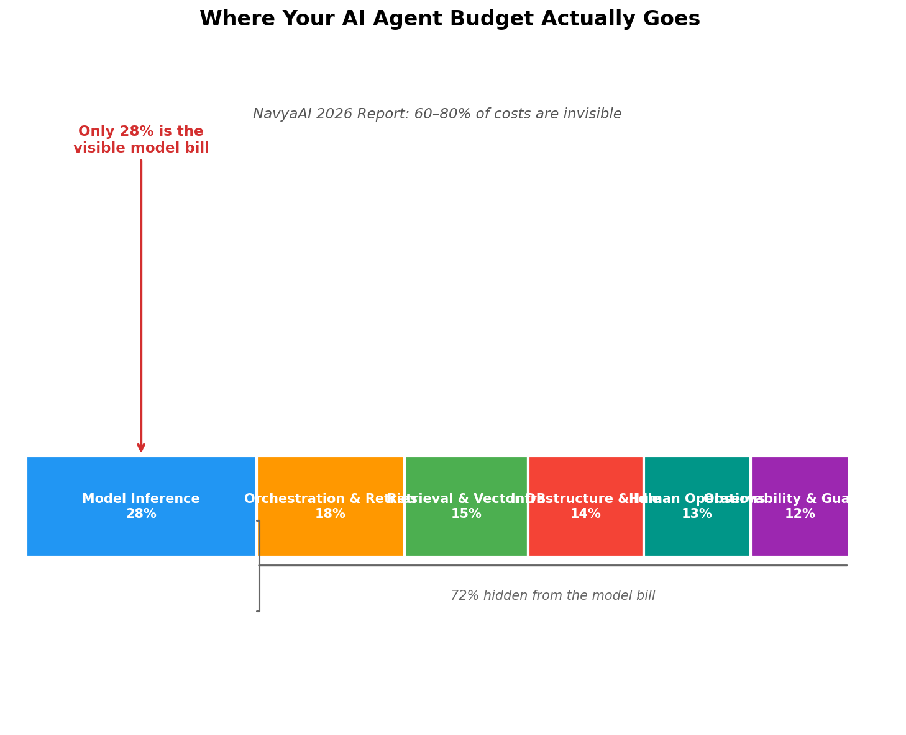
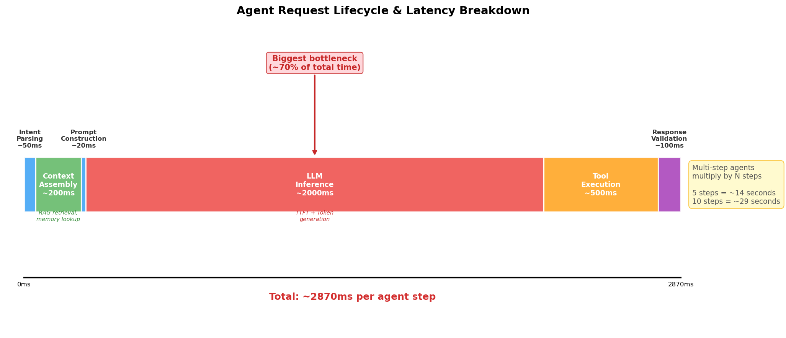
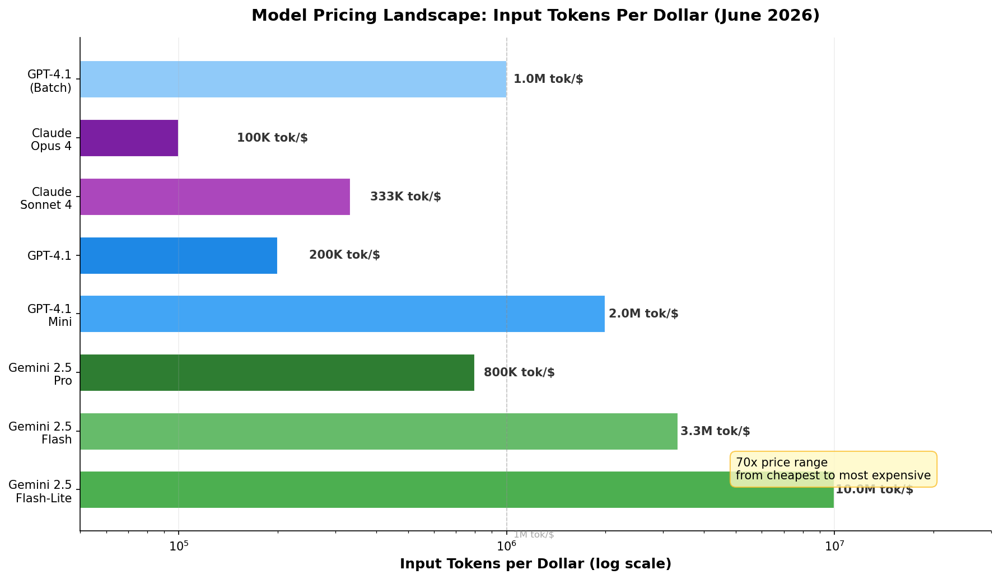
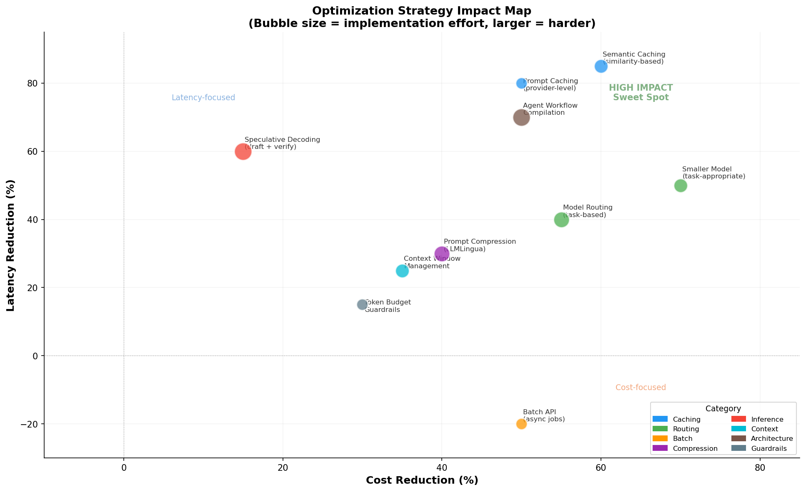

# Day 45: Cost and Latency — Why Your AI Agent Bill Keeps Growing

> **Core Question**: Token prices dropped 99.7% since 2023, so why did your AI bill triple — and what can you actually do about it?

---

You just shipped your first AI agent. It reads emails, drafts responses, and even books meetings. Users love it. Then the monthly invoice arrives: $12,000. For a tool that processes maybe 500 requests a day.

You check the token pricing. GPT-4.1 charges $5 per million input tokens — a fraction of what GPT-4 cost in 2023. Gemini 2.5 Flash is under $0.30 per million. Tokens got *cheaper*. So where did the money go?

This is the central paradox of AI agents in 2026: **cheaper tokens, bigger bills**. The answer lives in the gap between "cost per token" and "cost per task." Agents don't make one call. They loop, retry, retrieve, orchestrate, and — most importantly — spend heavily on infrastructure that surrounds the model, not the model itself.

This article breaks down where agent costs actually come from, why latency compounds in multi-step workflows, and the concrete optimization strategies that production teams use to cut bills by 60–80%.

---

## 1. The Hidden Cost Stack

#### Intuition: The Restaurant Bill

Think of an AI agent like a restaurant meal. The raw ingredients (model tokens) might be cheap, but the bill includes the chef's time, the kitchen rent, the waitstaff, the reservation system, and the decor. You don't just pay for flour — you pay for the entire operation that turns flour into bread. Similarly, your agent doesn't just pay for tokens — it pays for the retrieval system, the retry loops, the monitoring, the idle compute waiting for the next request.

The NavyaAI 2026 Token Cost Report quantifies this precisely: **model inference accounts for only 28% of total agent spend**. The remaining 72% hides in infrastructure, orchestration, and operations that most teams don't track.


*Figure 1: The hidden cost stack of AI agents. Only 28% of total spend goes to model inference — the rest disappears into orchestration, retrieval, observability, and infrastructure.*

Here's the breakdown:

| Cost Category | Share | What's Included |
|---------------|-------|-----------------|
| Model Inference | 28% | Input + output tokens, embedding generation |
| Orchestration & Retries | 18% | Agent loop control, retry logic, fallback chains |
| Retrieval & Vector DB | 15% | Embedding queries, chunking, vector store operations |
| Infrastructure & Idle | 14% | Overprovisioned GPU capacity, cold starts |
| Human Operations | 13% | Incident response, prompt maintenance, evaluations |
| Observability & Guardrails | 12% | Logging, content filtering, output validation |

The critical insight: optimizing only the model bill (choosing a cheaper model, reducing token count) addresses at most 28% of total cost. Real savings come from optimizing the full stack.

---

## 2. Why Agent Costs Explode

### 2.1 The Agentic Multiplier

A single chatbot call might consume 500 input tokens and 200 output tokens. An agent performing the same task? It might make 15 LLM calls:

1. Parse user intent (1 call)
2. Retrieve relevant documents (1 embedding call + 1 generation call)
3. Decide which tool to use (1 call)
4. Execute tool and interpret results (1 call)
5. Verify the output (1 call)
6. Handle a retry after a formatting error (2 calls)
7. Summarize and format for user (1 call)

Each step carries its own context — often including the full conversation history. By step 7, the input might be 4,000 tokens even though the user only typed 50 words.

#### Intuition: The Conference Call

Imagine asking a colleague a simple question: "What's our Q3 revenue?" In a chatbot world, you get one answer. In an agent world, your colleague first checks their email, then opens the financial system, then verifies with accounting, then formats a nice summary. Each step adds time and cost. The simple question became a multi-hour process.

### 2.2 Context Window Inflation

Agents accumulate context. A 5-step agent workflow with tool results easily reaches 10,000+ tokens of input per step. With GPT-4.1 at $5/M input tokens, that's $0.05 per step — times 5 steps = $0.25 per request. At 10,000 requests/day, that's $2,500/day or **$75,000/month** for a single agent.

And this is before retries, which can double the effective cost. Production agents typically see 10–30% retry rates due to format errors, tool failures, or hallucination catches.

### 2.3 Latency Compounds


*Figure 2: Where time goes in a single agent step. LLM inference dominates at ~70% of total latency. Multi-step agents multiply this by the number of reasoning loops.*

A single agent step takes roughly 2.5–3 seconds:

| Stage | Typical Latency | Notes |
|-------|----------------|-------|
| Intent parsing | ~50ms | Fast but adds up |
| Context assembly | ~200ms | RAG retrieval, memory lookup |
| Prompt construction | ~20ms | Template rendering |
| **LLM inference** | **~2,000ms** | TTFT + token generation |
| Tool execution | ~500ms | API calls, code execution |
| Response validation | ~100ms | Guardrails, format checks |

A 5-step agent takes 12–15 seconds. A 10-step agent takes 25–30 seconds. Users notice anything above 5 seconds. This creates pressure to use faster (and often more expensive) models, creating a cost-latency tension.

---

## 3. The Model Pricing Landscape

Understanding model pricing is the foundation of cost optimization. The price range across models is enormous — roughly **70x from cheapest to most expensive**.


*Figure 3: Input tokens per dollar across major models (June 2026). The 70x range means model selection is the single biggest cost lever.*

Key observations from current pricing (June 2026):

| Model | Input Price ($/M tokens) | Output Price ($/M tokens) | Best For |
|-------|--------------------------|---------------------------|----------|
| Gemini 2.5 Flash-Lite | $0.10 | $0.40 | Classification, extraction |
| Gemini 2.5 Flash | $0.30 | $2.50 | General-purpose agents |
| GPT-4.1 Mini | $0.40 | $1.60 | Routing, summarization |
| GPT-4.1 | $5.00 | $15.00 | Complex reasoning |
| Claude Sonnet 4 | $3.00 | $15.00 | Balanced performance |
| Claude Opus 4 | $15.00 | $75.00 | Hardest tasks |

The practical takeaway: **most agent steps don't need the most expensive model.** Intent parsing, tool selection, and response formatting can use a model that costs 10–50x less than the one you'd use for complex reasoning. This observation drives the most impactful optimization strategy: model routing.

---

## 4. Optimization Strategies

Not all optimizations are equal. Some are easy wins with minimal effort; others require significant engineering. The chart below maps each strategy by its cost impact, latency impact, and implementation effort.


*Figure 4: Each strategy plotted by cost reduction (x-axis) and latency reduction (y-axis). Bubble size indicates implementation effort. The upper-right quadrant is the sweet spot.*

### 4.1 Caching (Highest ROI, Lowest Effort)

#### Prompt Caching (Provider-Level)

When multiple requests share the same prompt prefix — system instructions, few-shot examples, tool definitions — providers like OpenAI and Anthropic cache those tokens automatically. OpenAI's prompt caching saves **50% on cached input tokens**. Anthropic's prefix caching delivers up to **90% cost reduction** for long prompts.

For agents, this is huge. Every agent request typically includes the same system prompt (defining the agent's role, available tools, and behavioral rules) which might be 1,000–3,000 tokens. With caching, you only pay for those once per cache window (typically 5–10 minutes).

**Implementation**: Structure prompts with static content at the beginning and dynamic content at the end. Most providers handle caching automatically when you do this.

#### Semantic Caching

Prompt caching only works for *exact* prefix matches. Semantic caching goes further: it embeds the incoming query, checks if a similar query was answered before, and returns the cached response if the similarity exceeds a threshold.

A 2025 paper from researchers at the University of Wisconsin-Madison, ["Semantic Caching for Low-Cost LLM Serving"](https://arxiv.org/abs/2508.07675) (August 2025), formalized this approach and showed that adaptive semantic caching can reduce inference costs by 60% with minimal quality degradation for repetitive workloads.

Tools like [GPTCache](https://github.com/zilliztech/GPTCache) and Redis-based semantic caches make this accessible without custom ML infrastructure.

### 4.2 Model Routing (Highest Cost Savings)

#### Intuition: The Hospital Triage

In an emergency room, not every patient sees the senior surgeon. A triage nurse assesses severity — minor cuts go to a junior doctor, complex trauma escalates to the specialist. Model routing works the same way: a lightweight classifier (or even a small LLM) assesses task complexity and routes to the appropriate model.

The key insight from the April 2026 survey paper ["Dynamic Model Routing and Cascading for Efficient LLM Inference"](https://arxiv.org/abs/2603.04445) is that **27–55% cost reduction** is achievable in production RAG systems through intelligent routing alone.

Three routing patterns dominate:

| Pattern | How It Works | Cost Savings | Quality Risk |
|---------|-------------|--------------|--------------|
| Static rules | Regex/keyword-based task classification | 30–40% | Low |
| Semantic routing | Embed query, classify by similarity to known categories | 40–55% | Low–Medium |
| LLM-as-router | Small model decides which model handles the request | 50–65% | Medium |

A practical pattern used by GitHub Copilot (described in their [May 2026 blog post on token efficiency](https://github.blog/ai-and-ml/github-copilot/improving-token-efficiency-in-github-agentic-workflows/)) routes file-navigation tasks to Haiku, implementation tasks to Sonnet, and coordination tasks to Opus — each step using the cheapest model that suffices.

### 4.3 Prompt Compression

[LLMLingua](https://arxiv.org/abs/2310.05736) (Microsoft Research, 2023) and its successor [LongLLMLingua](https://arxiv.org/abs/2310.06839) compress prompts by removing tokens that contribute little to the output. A small model calculates perplexity for each token and removes low-information ones.

Compression ratios of 2–6x are common with minimal quality loss. For an agent passing 5,000 tokens of retrieved context, compressing to 1,500 tokens saves both cost and latency.

The 2025 NAACL survey ["Prompt Compression for Large Language Models: A Survey"](https://aclanthology.org/2025.naacl-long.368.pdf) provides a comprehensive overview of compression techniques and their trade-offs.

### 4.4 Batch Processing

OpenAI's [Batch API](https://platform.openai.com/docs/guides/batch) offers a **50% discount** for asynchronous requests with 24-hour turnaround. For any agent task that doesn't need real-time responses — nightly report generation, batch document processing, offline evaluation — this is free money.

**Rule of thumb**: If a task can wait 24 hours, use batch. This alone can cut 20–40% off your bill for workloads that have a batch component.

### 4.5 Speculative Decoding and Cascades

[Speculative decoding](https://research.google/blog/looking-back-at-speculative-decoding/) (covered in Day 18) uses a small draft model to predict tokens that a larger model then verifies in parallel. Google Research's September 2025 breakthrough, [**Speculative Cascades**](https://research.google/blog/speculative-cascades-a-hybrid-approach-for-smarter-faster-llm-inference/), combines this with model cascading — instead of rigidly verifying every token against the large model, a flexible deferral rule decides when the small model's output is good enough.

This is particularly relevant for agents: many agent steps (formatting, simple tool calls) don't need frontier-model quality. Speculative cascades let you use a cheap model for the easy 70% of tokens and escalate to the expensive model only for the hard 30%.

### 4.6 Context Window Management

Agents that stuff 10,000 tokens of context into every call are burning money. Strategies include:

- **Sliding window**: Keep only the last N turns of conversation
- **Relevance filtering**: Use embedding similarity to include only retrieved chunks above a threshold
- **Summary compression**: Have a small model summarize long context before passing to the main model
- **Token budgets**: Set hard limits on context size per step

The Mem0 team demonstrated in their [2026 Token Optimization Playbook](https://mem0.ai/blog/the-2026-token-optimization-playbook-cut-ai-agent-memory-costs-3%E2%80%934x) that structured memory architectures can reduce agent token costs by 3–4x compared to stuffing full conversation history.

---

## 5. Building a Cost-Aware Agent Architecture

#### Intuition: The Manufacturing Assembly Line

A well-run factory doesn't use the same machine for every step. Stamping uses one tool, welding another, painting a third. Each machine is sized appropriately for its task. Cost-aware agent architecture follows the same principle: match the model, context size, and processing depth to what each step actually requires.

Here's a practical architecture pattern:

```
User Request
    │
    ▼
┌─────────────┐     ┌──────────────────┐
│  Classifier  │────▶│  Route Decision  │
│  (Haiku/$0.25)│     │                  │
└─────────────┘     └────┬────────┬────┘
                         │        │
                    Simple      Complex
                         │        │
                         ▼        ▼
                   ┌─────────┐  ┌──────────┐
                   │  Flash  │  │  Sonnet  │
                   │  ($0.30) │  │  ($3.00)  │
                   └────┬────┘  └────┬─────┘
                        │            │
                        ▼            ▼
                   ┌──────────────────────┐
                   │  Semantic Cache      │
                   │  (check before call) │
                   └──────────┬───────────┘
                              │
                         Cache Miss?
                              │
                              ▼
                   ┌──────────────────────┐
                   │  Compress Prompt     │
                   │  (LLMLingua, 2-3x)   │
                   └──────────┬───────────┘
                              │
                              ▼
                   ┌──────────────────────┐
                   │  LLM Inference       │
                   │  (cached prefix)     │
                   └──────────┬───────────┘
                              │
                              ▼
                   ┌──────────────────────┐
                   │  Validate + Cache    │
                   │  (store for reuse)   │
                   └──────────────────────┘
```

This architecture applies optimizations in order of ROI: cache first (free if hit), then route to cheapest sufficient model, then compress only if you're actually making the call.

---

## 6. Code Example: Model Router with Caching

```python
import hashlib
from dataclasses import dataclass
from typing import Optional

@dataclass
class ModelConfig:
    name: str
    input_price_per_m: float  # price per million input tokens
    output_price_per_m: float
    max_context: int
    speed_tps: float  # tokens per second

# Define available models
MODELS = {
    "flash": ModelConfig("gemini-2.5-flash", 0.30, 2.50, 1_000_000, 150),
    "sonnet": ModelConfig("claude-sonnet-4", 3.00, 15.00, 200_000, 80),
    "gpt41": ModelConfig("gpt-4.1", 5.00, 15.00, 1_000_000, 60),
}

# Task complexity to model mapping
TASK_MODEL_MAP = {
    "classify": "flash",      # Simple classification
    "extract": "flash",       # Information extraction
    "summarize": "flash",     # Summarization
    "route": "flash",         # Intent routing
    "reason": "sonnet",       # Multi-step reasoning
    "code": "gpt41",          # Code generation
    "verify": "sonnet",       # Output verification
}

class CostAwareRouter:
    """Routes requests to cheapest sufficient model with caching."""
    
    def __init__(self, cache_ttl_seconds: int = 300):
        self.cache: dict[str, str] = {}
        self.cache_ttl = cache_ttl_seconds
        self.stats = {"cache_hits": 0, "total_calls": 0, "cost_saved": 0.0}
    
    def _cache_key(self, prompt: str, task: str) -> str:
        """Create a deterministic cache key from prompt + task."""
        content = f"{task}:{prompt}"
        return hashlib.sha256(content.encode()).hexdigest()[:16]
    
    def route(self, prompt: str, task: str, 
              force_model: Optional[str] = None) -> dict:
        """Route a request to the appropriate model.
        
        Args:
            prompt: The input text
            task: Task type (classify, extract, reason, etc.)
            force_model: Override routing, force specific model
            
        Returns:
            Dict with model choice, estimated cost, and cache status
        """
        self.stats["total_calls"] += 1
        
        # Step 1: Check cache
        key = self._cache_key(prompt, task)
        if key in self.cache:
            self.stats["cache_hits"] += 1
            return {
                "model": "cache",
                "cached_response": self.cache[key],
                "cost": 0.0,
                "cache_hit": True,
            }
        
        # Step 2: Select model
        model_name = force_model or TASK_MODEL_MAP.get(task, "sonnet")
        model = MODELS[model_name]
        
        # Step 3: Estimate cost
        input_tokens = len(prompt.split()) * 1.3  # rough estimate
        estimated_cost = (input_tokens / 1_000_000) * model.input_price_per_m
        
        # Step 4: Check if a cheaper model could handle this
        if task in ("classify", "extract", "summarize", "route"):
            # These tasks almost never need expensive models
            if model_name not in ("flash",):
                cheaper = MODELS["flash"]
                savings = estimated_cost - (input_tokens / 1_000_000 * cheaper.input_price_per_m)
                self.stats["cost_saved"] += savings
        
        return {
            "model": model.name,
            "model_key": model_name,
            "estimated_cost": estimated_cost,
            "cache_hit": False,
            "input_tokens_est": int(input_tokens),
        }
    
    def store_response(self, prompt: str, task: str, response: str):
        """Cache a response for future reuse."""
        key = self._cache_key(prompt, task)
        self.cache[key] = response
    
    def get_stats(self) -> dict:
        """Return routing statistics."""
        hit_rate = (self.stats["cache_hits"] / max(self.stats["total_calls"], 1)) * 100
        return {
            **self.stats,
            "cache_hit_rate": f"{hit_rate:.1f}%",
        }


# Usage example
router = CostAwareRouter()

# Simple classification — routed to cheapest model
result = router.route("Is this email urgent? 'Server is down, all users affected'", "classify")
print(f"Model: {result['model']}, Est. cost: ${result['estimated_cost']:.6f}")

# Complex reasoning — gets the better model
result = router.route("Design a database schema for a multi-tenant SaaS platform", "reason")
print(f"Model: {result['model']}, Est. cost: ${result['estimated_cost']:.6f}")

# Same query again — cache hit
router.store_response("Is this email urgent? 'Server is down'", "classify", "Yes, critical")
result = router.route("Is this email urgent? 'Server is down'", "classify")
print(f"Cache hit: {result['cache_hit']}, Cost: ${result['cost']:.6f}")

print(f"\nStats: {router.get_stats()}")
```

---

## 7. Common Misconceptions

### ❌ "Just use the cheapest model for everything"

The cheapest model (Gemini 2.5 Flash-Lite at $0.10/M input) saves money per token but may fail on complex reasoning tasks, causing retries that *increase* total cost. One failed attempt + one successful attempt on a cheap model can cost more than a single successful attempt on a better model.

**The fix**: Route based on task complexity, not a blanket policy.

### ❌ "Token prices keep dropping, so cost isn't a real problem"

The NavyaAI 2026 report documents the paradox: **token prices fell 99.7%, but average AI bills tripled**. Cheaper tokens encourage teams to build larger, more complex agent workflows. The total number of tokens consumed grows faster than the per-token price declines. Additionally, 60–80% of real costs sit outside the model bill entirely.

### ❌ "Latency and cost are independent problems"

They're deeply coupled. A slow agent prompts developers to use larger/faster models (increasing cost), or to parallelize steps (increasing total token consumption). Conversely, cost-saving measures like model routing often improve latency too — routing to a smaller model is both cheaper and faster.

---

## 8. Measuring and Monitoring

You can't optimize what you don't measure. Production agent systems need instrumentation at every level:

| Metric | What to Track | Target |
|--------|---------------|--------|
| Tokens per task | Total input + output tokens per completed agent task | Decrease over time |
| Cost per task | Dollar cost per completed task (including retries) | < $0.10 for simple tasks |
| Cache hit rate | % of requests served from cache | > 40% for repetitive workloads |
| Retry rate | % of LLM calls that fail and need retrying | < 15% |
| Time to completion | Wall-clock time from user request to final response | < 5s for simple tasks |
| Model distribution | % of calls routed to each model tier | Mostly cheap models |

Gartner's 2026 AI Cost Management Research found that **teams implementing real-time token monitoring reduce AI operational costs by 43% within 60 days** — not through technical optimization, but through awareness that drives better design decisions.

---

## 9. Frontier: What's Coming Next

The cost and latency optimization space is evolving rapidly:

1. **Compiled Agent Workflows** (2026): [Requesty.ai's May 2026 analysis](https://www.requesty.ai/blog/ai-agent-techniques-may-2026-self-evolving-managed-compiled) describes "workflow compilation" — converting stable agent patterns into fine-tuned smaller models. A 5-step agent workflow that costs $0.05 per run on GPT-4.1 can be compiled into a single fine-tuned Flash call for $0.001, reducing both cost and latency by 50x.

2. **Self-Optimizing Routers** (2026): Routing is moving from static rules to reinforcement-learning-based systems that continuously adjust routing decisions based on observed quality and cost. The [April 2026 routing survey](https://arxiv.org/abs/2603.04445) documents this shift across major deployments.

3. **Speculative Cascades** (September 2025): [Google Research's hybrid approach](https://research.google/blog/speculative-cascades-a-hybrid-approach-for-smarter-faster-llm-inference/) combines speculative decoding with model cascading, achieving better cost-quality trade-offs than either technique alone by using flexible deferral rules instead of strict token matching.

4. **Agentic Token Budget Enforcement** (2026): Production systems increasingly implement hard token budgets per agent step, forcing the agent to work within constraints rather than consuming unlimited context. This is emerging as a core practice in platforms like [AI.cc](https://natlawreview.com/press-releases/how-cut-ai-api-costs-80-aicc-publishes-step-step-token-optimization-guide), which reports 80% cost reduction through combined routing + compression + output length control.

5. **Multimodal Routing** (2026): As agents handle text, images, audio, and video, routing decisions must consider modality — sending image tasks to vision-optimized models, audio to speech models, etc. This adds a new dimension to the routing problem and new opportunities for cost savings.

---

## 10. Further Reading

### Practical Guides
1. ["Techniques to Reduce AI Token Usage: The 2026 Playbook"](https://www.programstrategyhq.com/post/techniques-to-reduce-ai-token-usage-the-2026-playbook-for-cutting-costs-without-losing-quality) — 10 techniques with real-world benchmarks, May 2026
2. ["AI Agent Cost Optimization in 2026"](https://niteagent.com/blog/ai-agent-cost-optimization-2026/) — Working templates for multi-model routing and caching, May 2026
3. ["LLM Token Optimization: Cut Costs & Latency"](https://redis.io/blog/llm-token-optimization-speed-up-apps/) — Redis-backed caching strategies, June 2026
4. ["Improving Token Efficiency in GitHub Agentic Workflows"](https://github.blog/ai-and-ml/github-copilot/improving-token-efficiency-in-github-agentic-workflows/) — Real production data from GitHub Copilot, May 2026

### Research Papers
1. ["Dynamic Model Routing and Cascading for Efficient LLM Inference: A Survey"](https://arxiv.org/abs/2603.04445) — Comprehensive survey of routing and cascading methods, April 2026
2. ["Semantic Caching for Low-Cost LLM Serving"](https://arxiv.org/abs/2508.07675) — Adaptive semantic caching with online learning, August 2025
3. ["Faster Cascades via Speculative Decoding"](https://arxiv.org/abs/2405.19261) — Google Research's speculative cascades paper
4. ["LLMLingua: Compressing Prompts for Accelerated Inference"](https://arxiv.org/abs/2310.05736) — Microsoft's prompt compression method
5. ["Prompt Compression for Large Language Models: A Survey"](https://aclanthology.org/2025.naacl-long.368.pdf) — NAACL 2025 comprehensive survey

### Reports
1. [NavyaAI AI Token Cost Report 2026](https://www.navyaai.com/reports/ai-cost-report-token-prices-vs-ai-bill) — Why token price collapse didn't reduce AI bills
2. [Mem0 Token Optimization Playbook 2026](https://mem0.ai/blog/the-2026-token-optimization-playbook-cut-ai-agent-memory-costs-3%E2%80%934x) — Memory-specific cost optimization

---

## Reflection Questions

1. If you were building an agent that handles 10,000 requests/day with an average of 5 LLM calls per request, which single optimization would you implement first — and why?

2. Token prices drop roughly 80% year-over-year, yet total AI spend keeps rising. What does this imply about the relationship between cost per unit and total system cost? When might this trend reverse?

3. How would you design a routing system that handles the case where the "cheap model" produces a subtly wrong answer 5% of the time — and how would you detect it?

---

## Summary

| Concept | One-line Explanation |
|---------|---------------------|
| Hidden Cost Stack | Only 28% of agent cost is model inference; the rest is orchestration, retrieval, and infrastructure |
| Agentic Multiplier | Agents make 5–15 LLM calls per user request, each with growing context |
| Model Routing | Route tasks to the cheapest model that suffices — 27–55% cost reduction |
| Prompt Caching | Provider-level caching saves 50–90% on repeated prompt prefixes |
| Semantic Caching | Cache similar queries, not just identical ones — up to 60% savings |
| Prompt Compression | Remove low-information tokens — 2–6x compression with minimal quality loss |
| Batch API | 50% discount for non-urgent async requests |
| Speculative Cascades | Hybrid of cascading + speculative decoding for cost-efficient inference |
| Token Budgets | Hard limits on context size per agent step |
| Cost Monitoring | Real-time tracking reduces costs 43% through awareness alone |

**Key Takeaway**: Token prices collapsed 99.7%, but AI bills tripled because agents consume tokens in multiplying loops. The fix isn't cheaper tokens — it's smarter architecture. Cache first, route to the cheapest sufficient model, compress what you send, and measure everything. The teams that master this can run agents at 60–80% lower cost without sacrificing quality.

---

*Day 45 of 60 | LLM Fundamentals*
*Word count: ~3200 | Reading time: ~16 minutes*
