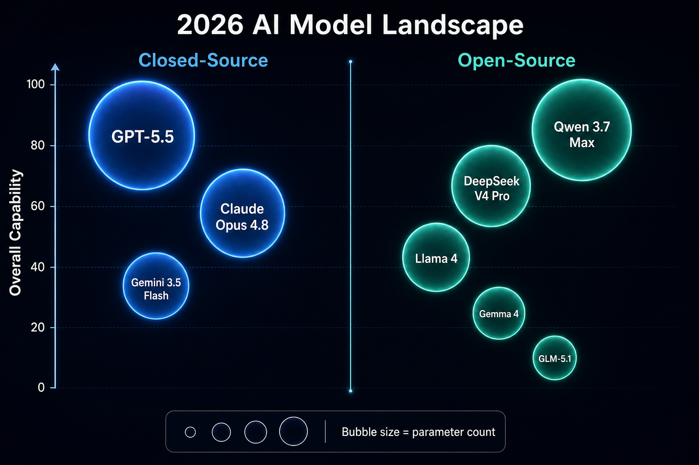
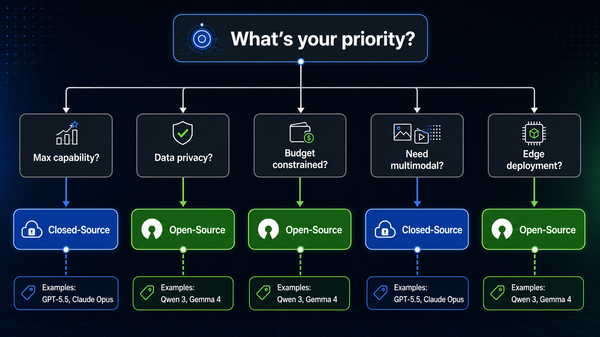

# Day 46: Open vs Closed Models — The 2026 Great Divide

> **Core Question**: When open-source models match or surpass closed-source models on more and more benchmarks, which side should you actually choose?

---

## Opening

In 2024, this question was easy: want the strongest capability, use GPT-4; want controllable and cheap, use Llama. Open-source models were "downgraded versions" of closed-source ones — less capable, but free and self-deployable.

In 2026, the landscape is fundamentally different.

DeepSeek V4 Pro scores 80.6% on SWE-bench Verified; Claude Opus 4.6 scores 80.8% — less than 1 percentage point apart. Qwen 3.7 Max scores 92.4% on GPQA Diamond, beating Claude Opus 4.6. GLM-5.1 outperforms GPT-5.4 on SWE-Bench Pro.

But this doesn't mean "open-source has won." Closed-source models still hold significant advantages in agent workflows, multimodal integration, and ecosystem tooling. And open-source models offer something closed-source fundamentally cannot: data privacy, deployment flexibility, and long-term cost control.

This article is not a price comparison table. We're going to break down the real differences from an engineering perspective: **where the capability boundaries lie, what the trade-offs are, and which approach fits which scenario**.

---

## 1. The 2026 Lineup

#### Intuition: Closed-source sells "service"; open-source gives you "weights"

Closed-source models (GPT, Claude, Gemini) are delivered as APIs — you never get the model weights, only access through the provider's interface. You pay for: cutting-edge capability + managed operations + continuous updates.

Open-source models (Llama, Qwen, DeepSeek, GLM, Gemma) publish model weights — you can download, self-deploy, modify, and fine-tune them. Some use permissive licenses (MIT, Apache 2.0), others have commercial use restrictions.


*Figure 1: Major models by camp and capability positioning, June 2026. Y-axis: overall capability. Bubble size: parameter count.*

### 1.1 Closed-Source Camp: Three-Way Standoff

| Provider | Flagship Model | Core Strength | Weakness |
|----------|---------------|---------------|----------|
| OpenAI | GPT-5.5 / GPT-5.4 | Most mature ecosystem, most reliable structured output, voice models | Most expensive, vendor lock-in risk |
| Anthropic | Claude Opus 4.8 / Fable 5 | Best at coding and agent tasks, no long-context surcharge | No embeddings, no fine-tuning |
| Google | Gemini 3.5 Flash / 3.1 Pro | Best price-performance, native multimodal (video/audio), free tier | Function calling maturity slightly lower |

Common trait of closed-source: **you pay for capability, but you don't have control**. The provider decides when models update, when they're deprecated, how pricing changes. API limits, content moderation policies, and rate limits are all outside your control.

### 1.2 Open-Source Camp: A Blooming Ecosystem

| Model Family | Origin | Representative Models | License | Core Strength |
|-------------|--------|----------------------|---------|---------------|
| Qwen | Alibaba | Qwen 3.7 Max / Qwen 3-Coder | Apache 2.0 | Strongest overall, broad language coverage |
| DeepSeek | DeepSeek AI | V4 Pro / R1 | MIT | Top math reasoning, extremely low API pricing |
| GLM | Zhipu AI | GLM-5.1 | MIT | Strong coding, OpenAI-API-compatible |
| Llama | Meta | Llama 4 Scout/Maverick | Llama Community License | 10M context, single-GPU inference |
| Gemma | Google | Gemma 4 | Gemma License | Commercial-friendly, great local deployment ecosystem |

Common trait of open-source: **you get the weights, you have control**. You can quantize, distill, fine-tune, and customize safety alignment. But this also means you handle deployment, operations, monitoring, and security updates yourself.

---

## 2. Capability Comparison: How Big Is the Gap?

#### Intuition: Read benchmark scores, but don't only read benchmark scores

Benchmarks are a signal, not the whole picture. Let's break it down by dimension.

### 2.1 Reasoning & Knowledge

GPQA Diamond (graduate-level scientific reasoning) is the widely accepted hard reasoning benchmark in 2026:

| Model | Type | GPQA Diamond |
|-------|------|-------------|
| GPT-5.4 Pro | Closed | **94.5%** |
| Gemini 3.1 Pro | Closed | **94.1%** |
| Claude Opus 4.7 | Closed | **94.2%** |
| Qwen 3.7 Max | Open | **92.4%** |
| Qwen 3.5-397B | Open | **88.4%** |
| DeepSeek V4 Pro | Open | ~87% |

**Interpretation**: The gap between top open-source (Qwen 3.7 Max) and closed-source flagships is about 2 percentage points. In practice, this difference is often masked by prompt engineering, few-shot examples, and tool use.

### 2.2 Coding Ability

SWE-bench Verified (real GitHub issue fixing) is the gold standard for coding:

| Model | Type | SWE-bench Verified |
|-------|------|-------------------|
| GPT-5.4 Pro | Closed | **91.1%** |
| Claude Opus 4.6 | Closed | **80.8%** |
| DeepSeek V4 Pro | Open | **80.6%** |
| Qwen 3.6-27B | Open | **77.2%** |
| Llama 4 Maverick | Open | ~24% |

**Interpretation**: DeepSeek V4 Pro has caught up to Claude Opus tier. But note — DeepSeek V4 Pro is a 1.6 trillion parameter MoE model, while Claude Opus's parameter count is undisclosed but likely much smaller. **At equal parameter efficiency, closed-source still leads**.

Llama 4 Maverick significantly lags in coding, suggesting Meta's training strategy favors general-purpose over coding specialization.

### 2.3 Agents & Tool Use

This is where **closed-source still has a substantive lead** in 2026. Agent tasks require: long-horizon planning, multi-step tool use, error recovery, context management.

| Capability | Closed (Claude/GPT/Gemini) | Open (Qwen/DeepSeek/Llama) |
|-----------|---------------------------|---------------------------|
| Function Calling accuracy | High (native strict mode) | Moderate (OpenAI-compatible, but lower accuracy) |
| Multi-step agent workflows | Mature (Claude Code, GPT Computer Use) | Early (requires heavy custom orchestration) |
| Parallel tool calls | Natively supported | Partial, depends on framework patches |
| Error recovery & retry | Model handles well | Requires external orchestration logic |

**Interpretation**: Benchmarks measure single-turn capability. Agents are multi-turn and stateful — in this dimension, closed-source tooling depth (MCP, Computer Use, Claude Code) creates an ecosystem moat. Open-source has caught up on "the model itself" but trails on "model + tool ecosystem."

### 2.4 Multimodality

| Capability | Closed | Open |
|-----------|--------|------|
| Image understanding | All support | Qwen 3.7 Plus, Gemma 4 support; DeepSeek does not |
| Video understanding | Gemini natively leads | Limited (Qwen-VL series) |
| Audio understanding | GPT-Realtime, Gemini | Essentially unsupported (need external Whisper, etc.) |

**Interpretation**: Multimodality is the open-source camp's biggest weakness. DeepSeek V4 is text-only. Llama 4 added image support but with limited capability. If your application needs native video/audio processing, closed-source (especially Gemini) remains the practical choice.

---

## 3. Engineering Perspective: Real-World Trade-offs

#### Intuition: Model selection isn't just about scores — it's about your engineering constraints

### 3.1 Cost Structure

**Closed-source**: Pay per token, scales linearly. Simple and straightforward, but very expensive at high volume.

**Open-source**: High upfront investment (GPUs, deployment, operations), but marginal cost approaches zero. At high volume, can be an order of magnitude cheaper.

A rough break-even estimate (June 2026):

| Scenario | Closed API Monthly | Self-hosted Monthly | Break-even |
|----------|-------------------|---------------------|------------|
| 1K calls/day (GPT-5.4 tier) | ~$3,000 | ~$2,500 (1× A100) | ~3 months |
| 10K calls/day | ~$30,000 | ~$5,000 (2× A100) | ~2 weeks |
| 100K calls/day | ~$300,000 | ~$15,000 (4× H100) | ~4 days |

Note: Self-hosted costs include GPU rental (~$2-4/hr A100, ~$8-12/hr H100), ops engineering, monitoring, and redundancy. These are very rough estimates — actual numbers depend on your prompt length, output length, and concurrency requirements.

### 3.2 Data Privacy & Compliance

This is the open-source camp's **killer advantage**.

- **Finance, healthcare, legal**: Data cannot be sent to third-party APIs. Self-deployment is the only compliant option.
- **EU/China data sovereignty**: GDPR and data export regulations require inference to happen locally.
- **Military/government**: Fully air-gapped environments — open-source is the only option.

Conversely, closed-source providers are catching up: OpenAI and Anthropic both offer enterprise data-not-used-for-training promises, and Google provides enterprise compliance through Vertex AI. But "promising not to train" and "physically impossible to leak" are two different things.

### 3.3 Customization

| Dimension | Closed | Open |
|-----------|--------|------|
| Fine-tuning | OpenAI/Google support it, Anthropic doesn't | All support it (LoRA, QLoRA, full) |
| Architecture modification | Impossible | Full freedom (pruning, distillation, quantization) |
| Safety alignment customization | Limited to provider policies | Fully customizable (adjust RLHF preferences) |
| Inference optimization | Limited to API | Speculative decoding, KV cache quantization, custom batching |

**Key insight**: When you need to deploy models to edge devices (phones, IoT), open-source is the only choice. Gemma 4 1B can run on a phone — no closed-source API can do that.

### 3.4 Reliability & Vendor Risk

Closed-source model reliability = provider reliability. If OpenAI goes down for 4 hours, your application goes down for 4 hours (unless you've designed multi-provider fallback).

Open-source model reliability = your own engineering capability. You control redundancy, load balancing, and failure recovery.

The 2026 reality: **major closed-source providers' SLAs are typically higher than what self-built teams can achieve**. But open-source's advantage is — you can be satisfied with 99.5% uptime without waiting for OpenAI to recover from a global outage.

---

## 4. Decision Framework

#### Intuition: It's not "pick a side" — it's "which tool for which job"


*Figure 2: Decision flow for choosing open or closed models based on application scenario.*

### 4.1 When to Choose Closed-Source?

- **Need maximum single-turn inference power**: Complex reasoning, high-stakes decisions (medical diagnosis assistance, legal analysis)
- **Agent workflows are core**: Need reliable multi-step tool use, computer operation
- **Need multimodal (especially video/audio)**: Gemini still dominates this space
- **Team lacks ML engineering capacity**: API calls are far simpler than maintaining inference infrastructure
- **Need to validate an MVP quickly**: Don't spend two weeks building a GPU cluster to test an idea

### 4.2 When to Choose Open-Source?

- **Data privacy is a hard constraint**: Finance, healthcare, government, military scenarios
- **Massive call volume**: >10K calls/day, self-deployment's marginal cost advantage starts dominating
- **Need deep customization**: Domain-specific fine-tuning, quantized deployment to edge devices
- **Long-term project, want to avoid vendor lock-in**: Providers can raise prices, deprecate models, change APIs — self-deployed models are forever stable
- **Research and education**: Need access to model weights, attention patterns, internal representations

### 4.3 Hybrid Strategy: Best for Most Teams

The smartest teams in 2026 don't pick sides — they **route by task**:

```
User request → Router → Closed API (complex reasoning, agent tasks)
                      → Self-hosted open model (data-sensitive, high-volume classification)
                      → Local small model (real-time, low-latency, edge scenarios)
```

This architecture requires an abstraction layer (like LiteLLM) to unify interfaces, so your business logic doesn't know which model it's talking to. Provider choice becomes an **operational decision**, not an architectural one.

---

## 5. Key Trends in 2026

### 5.1 Accelerating Capability Convergence

From the huge gap between GPT-4 and Llama 2 in 2024, to DeepSeek V4 Pro trailing Claude Opus by just 0.2 points on SWE-bench in 2026 — open-source is catching up far faster than expected.

Key drivers:
- **Democratization of training methodology**: DeepSeek R1 proved that frontier reasoning can be achieved at relatively low cost
- **Synthetic data**: Closed-source model outputs become high-quality training data for open-source models
- **MoE architecture proliferation**: Lets open-source models achieve more with fewer active parameters

### 5.2 Shifting Differentiation

Model capability is converging, but **ecosystem-level differentiation is widening**:

| Differentiation Dimension | Closed Advantage | Open Advantage |
|--------------------------|-----------------|----------------|
| Agent toolchain | MCP, Claude Code, Computer Use | More room for custom orchestration |
| Deployment flexibility | Zero ops | Full control |
| Compliance & audit | Comprehensive enterprise certs | Physical data isolation |
| Model iteration speed | Provider decides | You decide |
| Long-term cost | Linear growth | Fixed + low marginal |

### 5.3 The Spectrum of "Open"

"Open source" in 2026 is no longer black and white:

- **Fully open**: MIT/Apache license, weights fully public (DeepSeek, GLM, Gemma)
- **Conditionally open**: Commercial use restrictions or reporting requirements (Llama Community License)
- **API-only but paper published**: Some labs release detailed technical reports but not weights

When selecting a model, **read the license details** — not everything labeled "open" can be used commercially.

---

## 6. Common Pitfalls

### ❌ "Open-source has fully caught up with closed-source"

Benchmark scores are indeed close. But in agent workflows, multimodality, and inference reliability (hallucination reduction), closed-source still holds substantive advantages. Benchmarks measure single-turn ceilings; production systems need multi-turn stability.

### ❌ "Closed-source APIs are too expensive, must be a bad deal"

For small-to-medium usage (<1K API calls/day), closed-source API total cost (including labor) is almost always lower than self-deployment. GPU rental + ML engineer salaries represent high fixed costs that don't amortize without sufficient volume.

### ❌ "Open-source = more secure"

Self-deployment does eliminate data exfiltration risk, but it also means you're responsible for security updates, vulnerability patching, and adversarial attack defense. Closed-source providers have dedicated security teams — can your team match that level?

### ❌ "Pick one model and stick with it"

The market changes fast in 2026. Today's optimal choice may not be optimal in six months. **Architectural switchability is more important than the model choice itself**.

---

## 7. Further Reading

### Papers & Technical Reports
1. [DeepSeek V4 Technical Report](https://arxiv.org/abs/2502.04872) — Engineering details of a trillion-parameter MoE
2. [Qwen 3 Technical Report](https://arxiv.org/abs/2503.09965) — Training methodology for top open-source MoE
3. [Llama 4: Open Foundation and Fine-Tuned Chat Models](https://arxiv.org/abs/2502.01176) — Meta's multimodal open models

### Comparisons & Analysis
1. [Artificial Analysis — Live Model Leaderboard](https://artificialanalysis.ai/) — Real-time model capability comparison
2. [Hugging Face Open LLM Leaderboard](https://huggingface.co/spaces/open-llm-leaderboard/open_llm_leaderboard) — Open-source model rankings
3. ["Open Source vs Closed LLMs in 2026" (Let's Data Science)](https://letsdatascience.com/blog/open-source-vs-closed-llms-choosing-the-right-model-in-2026)

### Tools
1. [LiteLLM](https://github.com/BerriAI/litellm) — Unified interface supporting both closed and open model routing
2. [vLLM](https://github.com/vllm-project/vllm) — High-performance inference engine for open-source models
3. [Ollama](https://ollama.com/) — One-click local deployment of open-source models

---

## Reflection Questions

1. If your product needed to migrate from a closed-source API to open-source self-deployment tomorrow, what would be the biggest architectural obstacle? How long would it take?
2. In your specific scenario, how much money is the quality gap between a "good enough" open-source model and a "better" closed-source model worth?
3. How do you evaluate whether an open-source model's license is suitable for your commercial use case?

---

## Summary

| Concept | One-liner |
|---------|-----------|
| Capability convergence | Top open-source models are within 1-3 points of closed-source flagships on benchmarks |
| Ecosystem moat | Agent toolchains, multimodality, and inference reliability are where closed-source still leads |
| Cost crossover | At high volume (>10K calls/day), self-hosted open-source becomes more economical |
| Data sovereignty | Finance, healthcare, and government scenarios require self-deployment for compliance |
| Hybrid routing | 2026's best strategy: dynamically route between open and closed based on task type |

**Key takeaway**: In 2026, "open vs closed" is no longer a question of capability — it's a question of engineering trade-offs. Capabilities are converging, but ecosystems, control, cost structures, and risk profiles each have distinct advantages. The smartest teams don't make ideological choices — they pick the right tool for each task and maintain the ability to switch at any time.

---

*Day 46 of 60 | LLM Fundamentals*
*Word count: ~3000 | Reading time: ~15 minutes*
