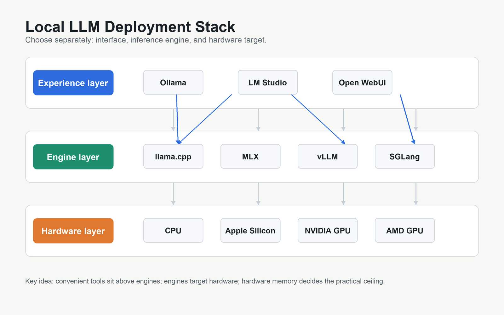
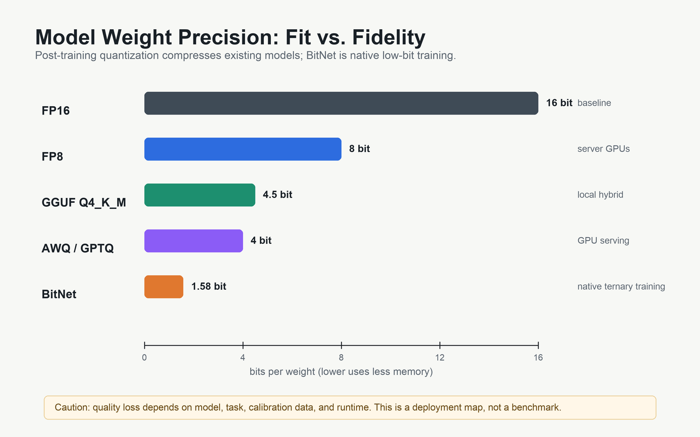

# Day 48: Local Deployment — Running LLMs on Your Own Hardware

> **Core Question**: How do you run large language models on your own machine — from a laptop to a GPU server — without depending on cloud APIs?

---

## Opening

Imagine you're building an AI-powered feature for your product. You've prototyped everything with the OpenAI API, and it works great. Then the bill arrives. For a production workload handling thousands of requests per hour, cloud API costs can easily hit thousands of dollars per month. Worse, every user prompt leaves your infrastructure and travels to someone else's data center.

Local deployment flips that equation: you run the model on hardware you control, pay only for electricity, and your data never leaves your network. In 2026, this isn't just for hobbyists anymore — it's a legitimate engineering decision backed by mature tooling, high-quality open models, and quantization techniques that let you run capable LLMs on a MacBook.

This article covers the full stack: quantization (how to shrink models to fit your hardware), the major frameworks (Ollama, vLLM, llama.cpp, MLX, SGLang), and a decision framework for choosing the right setup.

---

## 1. The Three-Layer Stack

#### Intuition: The Restaurant Kitchen

Think of local LLM deployment like setting up a restaurant kitchen. The **hardware** is the kitchen itself — ovens, stoves, counter space. The **engine** is the cooking technique — how efficiently you use those tools. The **experience layer** is the menu and service — what the customer (your application) actually interacts with. You can have a great kitchen (GPU) with poor technique (inefficient inference), or a basic kitchen (CPU) with smart recipes (quantization) that still produces great food.


*Figure 1: The three-layer local LLM ecosystem. Each experience-layer tool wraps one or more engines, which target specific hardware platforms.*

The ecosystem has crystallized into a clear three-layer architecture:

| Layer | Tools | Role |
|-------|-------|------|
| **Experience** | Ollama, LM Studio, Open WebUI | User-facing interface: CLI, GUI, or web |
| **Engine** | llama.cpp, MLX, vLLM, SGLang | Inference backend: actually computes tokens |
| **Hardware** | CPU, Apple Silicon, NVIDIA GPU, AMD GPU | Physical compute: memory bandwidth is king |

A key insight: **most experience-layer tools are thin wrappers around engines**. Ollama wraps llama.cpp (and since March 2026, also MLX on Apple Silicon). LM Studio wraps llama.cpp. When you choose Ollama, you're mostly choosing a convenient API over llama.cpp's raw power.

---

## 2. Quantization: Making Models Fit

#### Intuition: The Compressed Photo

A 12-megapixel photo saved as RAW takes ~36 MB. The same photo saved as a high-quality JPEG takes ~3 MB — a 12x reduction. Can you tell the difference? Most people can't. LLM quantization works the same way: by reducing the precision of model weights from 16-bit floating point to 4-bit integers, you shrink the model by ~4x with minimal quality loss.

### 2.1 Why Quantization Matters

An unquantized 8B-parameter model in FP16 needs ~16 GB of memory just to load the weights. A 70B model needs ~140 GB. That's more than most consumer GPUs have. Quantization compresses weights to fewer bits, reducing memory requirements and often improving inference speed because smaller numbers mean faster memory transfers (memory bandwidth, not compute, is usually the bottleneck for LLM inference).

### 2.2 The Quantization Landscape


*Figure 2: Memory vs. quality trade-off across quantization methods. Lower bits/weight means less memory but potentially more quality degradation.*

| Method | Bits/Weight | Quality Loss | Best For | Format |
|--------|-------------|--------------|----------|--------|
| **FP16** | 16 | Baseline | Development, max quality | Native |
| **FP8** | 8 | ~1% | GPU servers (H100, MI300X) | Native |
| **AWQ** | 4 | ~1% | GPU serving (vLLM, SGLang) | .pt / safetensors |
| **GPTQ** | 4 | ~2% | GPU inference, wide model support | .pt / safetensors |
| **GGUF Q4_K_M** | ~4.5 | ~2% | CPU + GPU hybrid, laptops | .gguf |
| **BitNet** | 1.58 | Varies | CPU-only edge, native training | Custom |

### 2.3 How Each Method Works

**GGUF (GPT-Generated Unified Format)**, developed by the [llama.cpp](https://github.com/ggerganov/llama.cpp) community, is the de facto standard for local deployment. It packages model weights, tokenizer, and metadata into a single file. The K-quant variants (Q4_K_M, Q5_K_S, etc.) use importance-based grouping: weights that matter more get higher precision, less important weights get compressed further. GGUF uniquely supports **CPU-GPU hybrid inference** — if your GPU has 8 GB VRAM but the model needs 12 GB, the excess layers run on CPU RAM.

**AWQ (Activation-aware Weight Quantization)** ([paper](https://arxiv.org/abs/2306.00978), introduced by MIT HAN Lab in June 2023) identifies that a small fraction (~1%) of weight channels are disproportionately important — they produce large activations. AWQ protects these critical channels during quantization, which is why it achieves only ~1% quality loss at 4-bit. It's the recommended quantization format for vLLM and SGLang deployments in 2026.

**GPTQ (Generative Pre-trained Transformer Quantization)** ([paper](https://arxiv.org/abs/2210.17323), introduced by researchers at ETH Zurich and UW-Madison in October 2022) uses approximate second-order information (the Hessian) to quantize weights layer-by-layer while minimizing reconstruction error. In 2026, **MatGPTQ** ([paper](https://arxiv.org/abs/2602.03537), February 2026) improved upon it with 1.34% better accuracy at 3-bit and support for per-layer heterogeneous bit-widths.

**BitNet** ([paper](https://arxiv.org/abs/2310.11453), introduced by Microsoft Research in October 2023) represents a **paradigm shift**, not just another quantization method. Understanding the distinction is critical:

- **Quantization methods** (GGUF, AWQ, GPTQ) take an existing FP16 model and compress it after training. The model was trained with full precision; compression is an afterthought.
- **BitNet trains natively in 1.58-bit.** The weights never existed in full precision. During training, the model learns with ternary constraints — each weight is constrained to {-1, 0, +1}, which requires only log₂(3) ≈ 1.58 bits to represent. This means the model's entire knowledge is encoded in a vastly smaller parameter space from the start.

Why does this matter? When you quantize a trained model to 4-bit, you lose information that was originally there. BitNet avoids this loss because the model was never trained with that information — it learned to be effective within ternary constraints from the beginning. The result is a fundamentally different quality-efficiency frontier.

The efficiency gains are dramatic. Standard LLM inference spends most of its compute on floating-point matrix multiplications (multiply-accumulate operations). With ternary weights, multiplications become simple additions and subtractions — there's nothing to multiply when weights are just -1, 0, or +1. The [BitNet.cpp](https://github.com/microsoft/BitNet) framework (with its January 2026 optimization update) exploits this to run 100B-parameter models on a single CPU at human reading speed (5-7 tokens/sec), a feat impossible with any post-training quantization method.

**The trade-off**: BitNet models must be trained from scratch — you cannot convert an existing LLaMA or Qwen model to BitNet format. As of 2026, the BitNet model ecosystem is still small compared to the mainstream, and most available models are research prototypes rather than production-ready. But if native low-bit training matures, it could fundamentally change the deployment landscape.

### 2.4 Choosing a Quantization Level

A practical guide:

| Your Hardware | Model Size | Recommended Quant | Memory Needed |
|---------------|-----------|-------------------|---------------|
| Laptop (16 GB RAM) | 8B | GGUF Q4_K_M | ~5 GB |
| Laptop (32 GB RAM) | 14B | GGUF Q5_K_M | ~10 GB |
| MacBook M-series (16 GB) | 8B | GGUF Q4_K_M via Ollama | ~5 GB |
| MacBook M-series (64 GB) | 70B | GGUF Q3_K_M | ~35 GB |
| NVIDIA RTX 4090 (24 GB) | 8B | AWQ 4-bit | ~5 GB |
| NVIDIA H100 (80 GB) | 70B | FP8 or AWQ 4-bit | ~40 GB |

---

## 3. The Frameworks

### 3.1 Ollama: The Developer's Gateway

[Ollama](https://ollama.com) is the easiest way to get started with local LLMs. One command to install, one command to run a model:

```bash
# Install (macOS/Linux)
curl -fsSL https://ollama.com/install.sh | sh

# Run a model (downloads automatically)
ollama run qwen3:8b

# Use the OpenAI-compatible API
curl http://localhost:11434/v1/chat/completions \
  -d '{"model":"qwen3:8b","messages":[{"role":"user","content":"Hello"}]}'
```

**What makes Ollama special**: it automatically selects the best quantization for your hardware. You don't need to understand GGUF variants or memory calculations — just `ollama run` and it works.

In March 2026, Ollama switched its default engine on Apple Silicon from llama.cpp to **Apple's MLX framework**, resulting in a 57% prefill speedup and 93% decode speedup on M5 chips (from 58 to 112 tokens/sec on Qwen3.5-35B-A3B).

**Limitations**: Ollama is optimized for single-user scenarios. For production serving with concurrent requests, you need a proper serving engine like vLLM or SGLang.

### 3.2 llama.cpp: The Foundation

[llama.cpp](https://github.com/ggerganov/llama.cpp) is the C/C++ inference engine that started the local LLM revolution. Created by Georgi Gerganov in March 2023, it proved that transformer inference doesn't require a GPU — a well-optimized CPU implementation with AVX/NEON instructions can run capable models.

**Why it matters**: llama.cpp is the engine beneath Ollama, LM Studio, and many other tools. Understanding it helps you understand the entire ecosystem. It supports the broadest hardware range: x86 CPU (AVX, AVX2, AVX512), ARM CPU (NEON), Apple Metal, NVIDIA CUDA, AMD HIP/ROCm, and Vulkan.

Key features in 2026:
- **GPU token sampling** — moved sampling to GPU for reduced latency
- **RPC sharding** — split a large model across multiple networked machines
- **Speculative decoding** — use a small draft model to speed up generation

### 3.3 vLLM: Production GPU Serving

[vLLM](https://github.com/vllm-project/vllm) is a high-throughput inference engine designed for production GPU serving. Its core innovation is **PagedAttention** (introduced in the [vLLM paper](https://arxiv.org/abs/2309.06180), October 2023), which manages the KV cache like a virtual memory system, eliminating memory fragmentation and enabling 14-24x higher throughput than naive implementations.

```bash
# Start vLLM server with an AWQ-quantized model
python -m vllm.entrypoints.openai.api_server \
  --model TheBloke/Llama-2-7B-Chat-AWQ \
  --quantization awq \
  --tensor-parallel-size 2 \
  --max-model-len 8192
```

**2026 developments**:
- **Model Runner V2 (MRV2)**: Up to 56% throughput improvement on NVIDIA GB200 hardware
- **FP8 inference**: Native support on H100 and Blackwell GPUs, doubling effective context capacity with FP8 KV cache
- **Speculative decoding**: Built-in support for EAGLE, n-gram, and DFlash draft models
- **Multi-platform**: Expanding beyond CUDA to AMD ROCm, Google TPU, and Apple Silicon

### 3.4 SGLang: The Performance Challenger

[SGLang](https://github.com/sgl-project/sglang) has emerged as vLLM's main competitor in 2026. Benchmarks from PremAI show SGLang achieving ~16,200 tokens/sec versus vLLM's ~12,500 tokens/sec on smaller models — a 29% throughput advantage. SGLang achieves this through **RadixAttention**, which caches and reuses KV cache prefixes across requests (similar to how a radix tree shares common prefixes).

SGLang and LMDeploy (another high-performance engine from InternLM) are now the throughput leaders, with vLLM closing the gap through its MRV2 updates.

### 3.5 Apple MLX: Silicon-Optimized Inference

[MLX](https://github.com/ml-explore/mlx) is Apple's open-source array framework for machine learning on Apple Silicon, designed to leverage the unified memory architecture where CPU and GPU share the same memory pool. At [WWDC 2025](https://developer.apple.com/videos/play/wwdc2025/), Apple officially positioned MLX as the preferred LLM inference framework for Apple Silicon.

Key results from [Apple's January 2026 research](https://arxiv.org/abs/2601.19139):
- **4.06x faster** time-to-first-token on M5 vs. M4 (using Neural Accelerators)
- **1.19x faster** token generation on M5 vs. M4
- A quantized 14B model achieves TTFT under 10 seconds on M5

The `mlx-lm` package provides easy access:

```python
from mlx_lm import load, generate

model, tokenizer = load("mlx-community/Qwen3-8B-4bit")
response = generate(model, tokenizer, prompt="Explain quantum computing", verbose=True)
```

---

## 4. Choosing Your Setup


*Figure 3: A practical decision tree. Start with your use case, narrow by hardware, and choose quantization based on available memory.*

### 4.1 The Hybrid Pattern

A pattern that works well in practice: **prototype locally with Ollama, deploy to production with vLLM or SGLang**. Since both expose OpenAI-compatible APIs, your application code doesn't change between environments — only the base URL does.

```python
# Works with Ollama (local) or vLLM (production)
from openai import OpenAI

client = OpenAI(
    base_url="http://localhost:11434/v1",  # Ollama locally
    # base_url="http://gpu-server:8000/v1",  # vLLM in production
    api_key="not-needed"
)
```

### 4.2 Framework Comparison

| Framework | Best For | Hardware | Quantization | Throughput |
|-----------|----------|----------|--------------|------------|
| **Ollama** | Personal use, dev testing | All (CPU/GPU/Apple) | GGUF auto-select | Low-moderate |
| **llama.cpp** | Max control, CPU-first | All | GGUF (1.5-8 bit) | Moderate |
| **vLLM** | Production GPU serving | NVIDIA, AMD | AWQ, GPTQ, FP8 | Very high |
| **SGLang** | High-throughput serving | NVIDIA | AWQ, GPTQ, FP8, GGUF | Highest |
| **MLX** | Apple Silicon optimized | Apple M-series | MLX quantization | High (on Apple) |
| **LM Studio** | Non-technical users, GUI | All (via llama.cpp) | GGUF auto-select | Low-moderate |


*Figure 4: Representative throughput for an 8B model across frameworks and hardware. The ~100x gap between laptop and GPU server is why serving engines matter for production.*

### 4.3 Memory Is the Real Constraint

The most common question in local deployment is "what can I run on my hardware?" The answer depends almost entirely on **memory** (VRAM for GPUs, unified memory for Apple Silicon, RAM for CPU):

$$
\text{Memory (GB)} \approx \frac{\text{Parameters} \times \text{Bits per Weight}}{8 \times 10^9} + \text{KV Cache} + \text{Overhead}
$$

For a practical estimate: an 8B model at Q4_K_M needs ~5 GB for weights, plus ~1-2 GB for KV cache (depending on context length), plus ~0.5 GB overhead. Total: ~7 GB. That fits comfortably on a laptop with 16 GB RAM.

A 70B model at Q4_K_M needs ~40 GB for weights alone. That requires either a high-end GPU (A100 80GB, H100 80GB), multiple GPUs with tensor parallelism, or an Apple Mac Studio with 128+ GB unified memory.

---

## 5. Common Misconceptions

### ❌ "Local LLMs are too slow to be useful"

Reality: On an M4 MacBook Pro, an 8B model generates at 40-60 tokens/sec — faster than most people read. On a GPU server, throughput reaches thousands of tokens/sec. The "too slow" reputation comes from running models that are too large for the available hardware.

### ❌ "You need an expensive GPU for local inference"

Reality: A MacBook with 16 GB unified memory can run capable 8B models. BitNet.cpp runs 100B-parameter models on a CPU. The real question isn't "do you have a GPU?" but "do you have enough memory?"

### ❌ "Quantization destroys model quality"

Reality: Modern 4-bit quantization (AWQ, GPTQ) preserves 98-99% of the original model's quality on most benchmarks. The quality loss is measurable but rarely noticeable in practice. Only at extreme compression (2-bit) does quality degrade significantly.

---

## 6. Frontier: What's New in 2026

1. **Ollama + MLX integration** (March 2026) — Ollama adopted Apple's MLX as its default engine on Apple Silicon, delivering 57% faster prefill and 93% faster decode on M5. This made MacBooks arguably the best local inference platform for the price. ([Ollama blog](https://ollama.com/blog/mlx))

2. **MatGPTQ** (February 2026) — An evolution of GPTQ that improves 3-bit quantization accuracy by 1.34% and supports per-layer heterogeneous bit-widths. This means you can allocate more bits to attention layers and fewer to FFN layers, optimizing the quality-memory trade-off. ([arXiv:2602.03537](https://arxiv.org/abs/2602.03537))

3. **Sparse-BitNet** (March 2026) — Microsoft combined 1.58-bit ternary weights with dynamic N:M semi-structured sparsity, achieving further speedups in both training and inference. ([Microsoft Research](https://www.microsoft.com/en-us/research/publication/sparse-bitnet-1-58-bit-llms-are-naturally-friendly-to-semi-structured-sparsity/))

4. **vLLM Model Runner V2** (April 2026) — Up to 56% throughput improvement on GB200 hardware through optimized kernel generation with torch.compile and graph-level transformations. ([vLLM docs](https://docs.vllm.ai/))

5. **SGLang throughput leadership** (2026) — SGLang has emerged as the throughput leader among open-source serving engines, with benchmarks showing 16,200 tok/s vs. vLLM's 12,500 tok/s on 8B models with H100 GPUs. ([PremAI benchmarks via techsy.io](https://techsy.io/en/blog/vllm-vs-sglang))

---

## 7. Further Reading

### Beginner
1. [Ollama Documentation](https://github.com/ollama/ollama) — Getting started with local LLMs in 5 minutes
2. [llama.cpp Examples](https://github.com/ggerganov/llama.cpp/tree/master/examples) — From basic chat to speculative decoding
3. [MLX Examples](https://github.com/ml-explore/mlx-examples) — Apple Silicon inference tutorials

### Advanced
1. [vLLM Documentation](https://docs.vllm.ai/) — Production serving configuration, multi-GPU setup
2. [SGLang Documentation](https://github.com/sgl-project/sglang) — RadixAttention, structured generation
3. [Apple MLX Research](https://arxiv.org/abs/2601.19139) — LLM inference optimization on Apple Silicon (January 2026)

### Papers
1. ["Efficient Memory Management for Large Language Model Serving with PagedAttention"](https://arxiv.org/abs/2309.06180) — The vLLM paper (Kwon et al., 2023)
2. ["AWQ: Activation-aware Weight Quantization for LLM Compression and Acceleration"](https://arxiv.org/abs/2306.00978) — The AWQ paper (Lin et al., 2023)
3. ["GPTQ: Accurate Post-Training Quantization for Generative Pre-trained Transformers"](https://arxiv.org/abs/2210.17323) — The GPTQ paper (Frantar et al., 2022)
4. ["BitNet: Scaling 1-bit Transformers for Large Language Models"](https://arxiv.org/abs/2310.11453) — Native 1.58-bit training (Wang et al., 2023)
5. ["MatGPTQ: Generalizable Matrix-wise Pre-conditioning for Quantized LLM Inference"](https://arxiv.org/abs/2602.03537) — MatGPTQ (February 2026)

---

## Reflection Questions

1. If you were deploying an LLM for a privacy-sensitive medical application, how would you weigh the trade-offs between local deployment and cloud APIs beyond just cost?
2. Why does memory bandwidth (not raw compute) matter more for LLM inference? What does this imply for hardware purchasing decisions?
3. The hybrid pattern (Ollama for dev, vLLM for production) relies on API compatibility. What could break this abstraction, and how would you handle it?

---

## Summary

| Concept | One-line Explanation |
|---------|---------------------|
| Quantization | Reducing weight precision (16-bit → 4-bit) to shrink models with minimal quality loss |
| GGUF | The universal format for local deployment; supports CPU-GPU hybrid inference |
| AWQ | Activation-aware 4-bit quantization; best for GPU serving with ~1% quality loss |
| BitNet | Native 1.58-bit training; runs 100B models on CPU via BitNet.cpp |
| Ollama | Easiest way to run local LLMs; wraps llama.cpp/MLX with a clean API |
| vLLM | Production GPU serving with PagedAttention; highest throughput for concurrent requests |
| SGLang | Throughput leader in 2026; RadixAttention for prefix caching |
| MLX | Apple's framework for Apple Silicon; 4x TTFT improvement on M5 |
| Hybrid pattern | Prototype with Ollama, deploy with vLLM/SGLang; same API, different hardware |

**Key Takeaway**: Local LLM deployment in 2026 is no longer a hobbyist pursuit — it's a practical engineering choice. Quantization (especially GGUF and AWQ) makes models fit on consumer hardware, frameworks like Ollama make it easy, and serving engines like vLLM and SGLang make it production-ready. The constraint is almost always memory, not compute — so choose your quantization level based on available RAM/VRAM, and your framework based on whether you need single-user convenience or multi-user throughput.

---

*Day 48 of 60 | LLM Fundamentals*
*Word count: ~2900 | Reading time: ~14 minutes*
