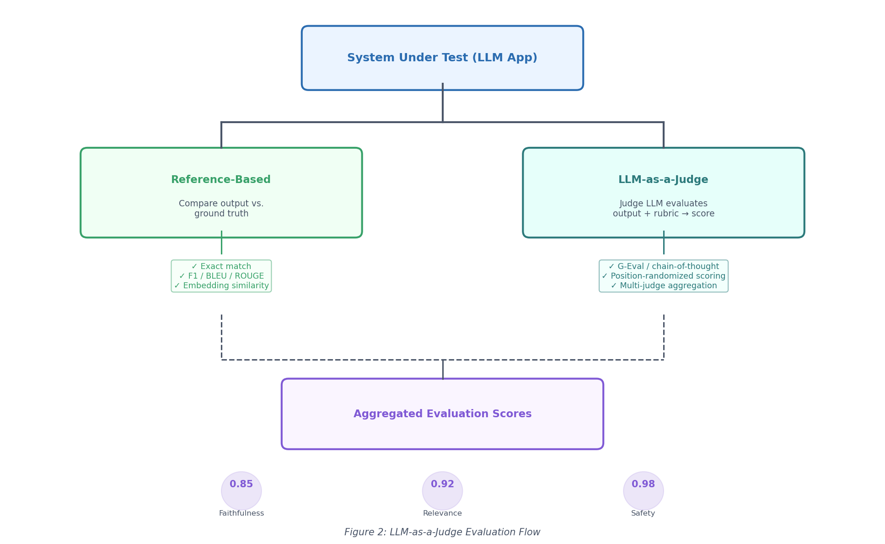
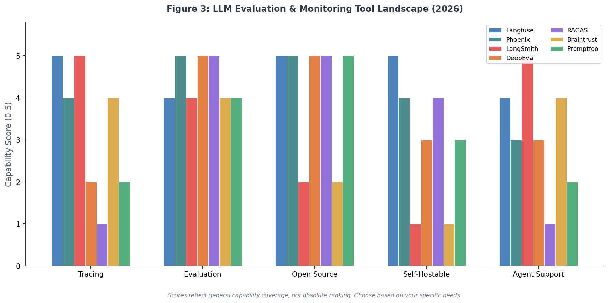

# Day 49: Evaluation and Monitoring — How to Know If Your LLM Application Actually Works

> **Core Question**: You built an LLM application. How do you prove it works before deploying — and catch it when it breaks in production?

---

## Opening

Imagine you just shipped a customer-support chatbot. In testing, it answered every question beautifully. Two weeks later, a model update silently degrades its ability to handle refund requests. Nobody notices until your support team reports angry customers.

This scenario plays out constantly. LLM outputs are probabilistic, open-ended, and sensitive to tiny prompt changes. Unlike traditional software where a unit test either passes or fails, evaluating an LLM application means judging *quality* — fluency, accuracy, safety, relevance — on a spectrum.

The good news: a maturing ecosystem of evaluation frameworks, LLM-as-judge techniques, and observability platforms now makes this tractable. This article covers the full evaluation lifecycle, from pre-deploy testing to production monitoring.

---

## 1. Why LLM Evaluation Is Different

#### Intuition: The Restaurant Inspector

Traditional software testing is like a building inspector checking a kitchen — the stove works or it doesn't, the fire extinguisher is present or it's not. Binary, deterministic.

Evaluating an LLM application is like being a *restaurant critic*. The food isn't "working" or "broken" — it's a matter of taste, consistency, safety, and meeting expectations. You need a rubric, trained judges, and repeat visits to form a reliable opinion.

Three properties make LLM evaluation fundamentally harder:

| Property | Traditional Software | LLM Applications |
|----------|---------------------|------------------|
| Output space | Finite, enumerable | Infinite, open-ended |
| Correctness | Binary (pass/fail) | Spectrum (good ↔ bad) |
| Stability | Deterministic | Stochastic, prompt-sensitive |

This means you cannot test your way to confidence the way you would with conventional software. You need *structured evaluation* — metrics, datasets, and automated judges — plus *continuous monitoring* to catch drift.

---

## 2. The Evaluation Lifecycle

A mature LLM evaluation practice spans five stages, forming a closed loop:


*Caption: The five-stage evaluation lifecycle — from golden dataset creation through production monitoring and back again.*

### 2.1 The Golden Dataset

A **golden dataset** (also called an eval set or benchmark set) is a curated collection of input-output pairs that represent the problems your application should solve well. Think of it as the answer key for your LLM's exam.

Characteristics of a good golden dataset:
- **Representative**: Covers the distribution of real user queries, including edge cases
- **Labeled**: Each input has an expected output or quality rubric
- **Versioned**: Changes are tracked so you can compare evaluations over time
- **Growing**: Production failures are added back as new test cases

A common starting point is 100-500 examples, but teams at scale maintain thousands — updated weekly with production traffic.

### 2.2 Pre-Deploy Evaluation

Before any change reaches production — whether it's a prompt tweak, a model swap, or a retrieval pipeline update — you run your golden dataset through the system and score the results.

This is where frameworks like **DeepEval** (open-source, pytest-style eval runner, [github.com/confident-ai/deepeval](https://github.com/confident-ai/deepeval)) and **RAGAS** (RAG-specific metrics: faithfulness, context recall, answer relevancy, [github.com/explodinggradients/ragas](https://github.com/explodinggradients/ragas)) come in. They automate the scoring using a combination of reference-based metrics (compare against ground truth) and reference-free metrics (use an LLM judge).

### 2.3 CI/CD Gate

The eval results feed into your deployment pipeline. If the aggregate score drops below a threshold — say, faithfulness falls below 0.85 — the deployment is blocked. This transforms evaluation from a manual review step into an automated quality gate, just like a failing unit test blocks a merge.

### 2.4 Production Monitoring

Once deployed, you need real-time visibility into output quality. This is **LLM observability** — the ability to trace every request, score every response, and surface anomalies before users complain.

### 2.5 The Feedback Loop

When monitoring detects drift or a production incident reveals a failure mode, the offending inputs are added to the golden dataset. The loop closes: the next pre-deploy eval will catch regressions on those exact cases.

---

## 3. LLM-as-a-Judge: The Core Technique

#### Intuition: The Essay Grader

If you've ever had a teacher grade an essay, you understand LLM-as-a-judge. The teacher (judge LLM) reads the student's work (system output), compares it against a rubric (evaluation criteria), and gives a score. The teacher doesn't need to have written the essay themselves — they just need to recognize quality.

**LLM-as-a-judge** uses a capable LLM to evaluate the outputs of another LLM system. This idea, formalized by Zheng et al. (2023) in ["Judging LLM-as-a-Judge with MT-Bench and Chatbot Arena"](https://arxiv.org/abs/2306.05685), has become the dominant evaluation technique for open-ended generation tasks.


*Caption: Two evaluation paths — reference-based comparison against ground truth, and reference-free LLM-as-judge scoring using a rubric.*

### 3.1 How It Works

There are two main formats:

1. **Single-output scoring**: The judge LLM receives one output and a rubric, then produces a score (e.g., 1-5 on faithfulness).
2. **Pairwise comparison**: The judge LLM receives two outputs for the same input and decides which is better. This is how Chatbot Arena works — except with human voters instead of LLM judges.

### 3.2 Scoring Techniques

Several techniques improve judge reliability:

| Technique | What It Does | Benefit |
|-----------|-------------|---------|
| **Chain-of-thought** | Judge reasons before scoring | Reduces random scoring |
| **G-Eval** (Liu et al., 2023) | Generates evaluation steps, then scores using probability-weighted output | More calibrated scores |
| **Few-shot rubric** | Provides scored examples in the prompt | Anchors the judge's scale |
| **Multi-judge** | Runs 3-5 judges and aggregates | Reduces variance |

### 3.3 The Bias Problem

LLM judges are biased. A 2026 survey published in *Data & Knowledge Engineering* ([Bavaresco et al., 2026](https://www.sciencedirect.com/science/article/pii/S2666675825004564)) documented systematic biases:

- **Position bias**: GPT-4 shows ~40% position bias in pairwise comparisons — it favors whichever answer appears first. The fix: always randomize answer order or evaluate both (A,B) and (B,A).
- **Verbosity bias**: Longer responses are rated higher, regardless of quality.
- **Self-preference**: Models tend to prefer outputs from the same model family.


*Caption: Position bias rates across models (left) and effectiveness of mitigation strategies (right). Data synthesized from Adaline AI (2026) and Li et al. (2025).*

A May 2026 analysis from Adaline AI found that while LLM judges achieve ~80% agreement with humans in controlled settings, frontier models can exceed 50% error rates on bias tests in production-like conditions ([Adaline AI, 2026](https://www.adaline.ai/blog/llm-as-a-judge-reliability-bias)).

**Practical rule**: Use LLM-as-judge for high-volume scoring where human annotation is impractical, but always calibrate against a human-labeled subset and apply position randomization.

---

## 4. Key Metrics by Application Type

Different LLM applications need different metrics. There is no universal "quality score."

### 4.1 RAG Applications

RAG evaluation uses the **RAG triad** — three metrics that cover the retrieval-generation pipeline:

| Metric | What It Measures | Method |
|--------|-----------------|--------|
| **Faithfulness** | Is the answer grounded in retrieved context? | Check if claims in the answer are supported by context passages |
| **Context Relevance** | Was the retrieved context actually useful? | Score retrieved passages against the query |
| **Answer Relevance** | Does the answer address the question? | Compare answer semantics against the question intent |

RAGAS ([Es et al., 2024](https://arxiv.org/abs/2309.15217)) provides standardized implementations of these metrics. Faithfulness is the most critical — it catches hallucination where the model fabricates information not present in the retrieved context.

### 4.2 Chatbots and Assistants

Multi-turn conversation evaluation needs to capture coherence across turns:

- **Conversation coherence**: Does the response follow the conversation history?
- **Intent resolution**: Did the system correctly identify and address the user's intent?
- **Safety**: Does the response avoid toxic, harmful, or biased content?

DeepEval ([github.com/confident-ai/deepeval](https://github.com/confident-ai/deepeval)) offers 50+ metrics covering these dimensions, with pytest-style test harnesses that integrate into CI/CD pipelines.

### 4.3 Agent Systems

Agents are the hardest to evaluate because they take multi-step actions with tool calls. The key metrics:

- **Tool correctness**: Did the agent call the right tool with the right parameters?
- **Task completion**: Did the agent actually solve the user's problem?
- **Efficiency**: How many steps did it take compared to the optimal path?
- **Pass@k**: Running the task k times and checking if it succeeds at least once — the standard metric from the coding evaluation literature ([Chen et al., 2021](https://arxiv.org/abs/2107.03374)). Formally:

$$
\text{pass@k} = 1 - \frac{\binom{n-c}{k}}{\binom{n}{k}}
$$

where **n** is the total number of samples, **c** is the number of correct solutions, and **k** is the number of samples drawn. This accounts for the combinatorial probability of seeing at least one success.

SWE-bench ([Jimenez et al., 2024](https://arxiv.org/abs/2310.06770)) is the de facto benchmark for evaluating coding agents: given a GitHub issue, can the agent produce a patch that passes the test suite?

---

## 5. Production Monitoring and Observability

Evaluation gets you to launch. Monitoring keeps you alive.

#### Intuition: The Car Dashboard

Pre-deploy evaluation is the vehicle inspection before a road trip. Production monitoring is the dashboard while driving — speedometer, fuel gauge, check-engine light. You need both, and they serve different purposes.

### 5.1 What to Monitor

| Signal | Category | Alert Threshold Example |
|--------|----------|------------------------|
| Faithfulness score | Quality | Drops below 0.80 |
| Latency (p99) | Performance | Exceeds 5 seconds |
| Cost per 1K tokens | Cost | Increases >20% week-over-week |
| Error rate | Reliability | Exceeds 1% of requests |
| Toxicity score | Safety | Any score >0.5 on user-facing outputs |
| Retrieval relevance | RAG-specific | Mean relevance <0.70 |

### 5.2 The Observability Stack

Modern LLM observability platforms trace every request through your application — from the user's input, through retrieval, prompt construction, LLM calls, tool invocations, and the final response. This is conceptually similar to distributed tracing in microservices, but focused on LLM-specific semantics.

The 2026 landscape has consolidated around a few key players:


*Caption: Capability comparison across evaluation and monitoring tools. Scores reflect general coverage, not absolute ranking — choose based on your specific requirements.*

| Platform | Best For | License | Key Differentiator |
|----------|----------|---------|-------------------|
| [Langfuse](https://langfuse.com) | Self-hosted tracing, full data ownership | MIT (open source) | Framework-agnostic, OpenTelemetry support |
| [Arize Phoenix](https://github.com/arize-ai/phoenix) | Offline evaluation, ML-native rigor | Apache 2.0 (open source) | OpenTelemetry-native, notebook-friendly |
| [LangSmith](https://smith.langchain.com) | LangChain/LangGraph ecosystem teams | Closed source | Tight LangGraph Studio integration |
| [DeepEval](https://github.com/confident-ai/deepeval) | CI/CD-integrated eval testing | Apache 2.0 (open source) | Pytest-style, 50+ metrics |
| [Braintrust](https://braintrust.dev) | Enterprise eval pipelines with SDK integrations | Closed source | Sophisticated span filtering, cost tracking |

A practical 2026 stack, recommended by multiple sources ([MachineLearningMastery, 2026](https://machinelearningmastery.com/the-roadmap-for-mastering-llmops-in-2026/); [DigitalApplied, 2026](https://www.digitalapplied.com/blog/agent-observability-platforms-langsmith-langfuse-arize-2026)):

- **Tracing**: Langfuse (self-hosted) or LangSmith (if using LangChain)
- **Evaluation**: RAGAS for RAG quality + DeepEval for general eval
- **APM integration**: Datadog LLM Observability for teams already on Datadog

### 5.3 OpenTelemetry and the Convergence Trend

A significant 2025-2026 trend is the convergence of evaluation and observability through **OpenTelemetry (OTel)**. Langfuse now accepts standard OTLP traces ([Langfuse OTel docs](https://langfuse.com/integrations/native/opentelemetry)), and Arize Phoenix uses the **OpenInference** semantic convention built on OTel. This means you can instrument your LLM application once and send traces to any compatible platform — avoiding vendor lock-in.

This convergence is blurring the line between "evaluation" (pre-deploy scoring) and "monitoring" (production scoring). The emerging model: every production trace is automatically scored, quality drops trigger alerts, and traces auto-curate back into your eval dataset. Confident AI calls this **"evaluation-as-observability"** ([Confident AI, 2026](https://www.confident-ai.com/knowledge-base/compare/10-llm-observability-tools-to-evaluate-and-monitor-ai-2026)).

---

## 6. Building an Evaluation Pipeline: Practical Guide

Here's a concrete implementation using DeepEval for evaluation and Langfuse for tracing:

```python
# eval_pipeline.py — A minimal evaluation pipeline
# Install: pip install deepeval langfuse openai

from deepeval import evaluate
from deepeval.test_case import LLMTestCase
from deepeval.metrics import (
    FaithfulnessMetric,
    AnswerRelevancyMetric,
    HallucinationMetric,
)
from langfuse import Langfuse

# 1. Initialize Langfuse for tracing
langfuse = Langfuse()

# 2. Define test cases from your golden dataset
test_cases = [
    LLMTestCase(
        input="What is the return policy for electronics?",
        actual_output=your_llm_app("What is the return policy for electronics?"),
        context=retrieved_documents_for_this_query,
        expected_output="Electronics can be returned within 30 days with receipt.",
    ),
    # ... more test cases from golden dataset
]

# 3. Configure metrics
faithfulness = FaithfulnessMetric(
    threshold=0.8,  # Fail if below 0.8
    model="gpt-4o",  # Judge model
)

relevance = AnswerRelevancyMetric(
    threshold=0.7,
    model="gpt-4o",
)

hallucination = HallucinationMetric(threshold=0.5)

# 4. Run evaluation (pytest-style)
results = evaluate(
    test_cases=test_cases,
    metrics=[faithfulness, relevance, hallucination],
)

# 5. Log results to Langfuse for monitoring
# Langfuse automatically captures traces if you've
# instrumented your LLM calls with the Langfuse SDK

# 6. CI/CD gate: exit with error if any metric fails
all_passed = all(
    result.success for metric_result in results.test_results
    for result in metric_result.metrics_data
)
if not all_passed:
    print("❌ Evaluation failed — deployment blocked")
    exit(1)
else:
    print("✅ All metrics passed — safe to deploy")
```

### 6.1 Wiring Into CI/CD

The key insight: treat evaluation like testing. Your CI pipeline should:

1. Run your golden dataset through the current build
2. Score every output with your chosen metrics
3. Block deployment if any aggregate metric falls below threshold
4. Log results to your observability platform for historical tracking

This is identical to how you'd gate a deployment on unit test pass rates — but the "tests" now measure semantic quality instead of functional correctness.

### 6.2 The Feedback Loop in Practice

```python
# When monitoring detects a regression:
# 1. The failing trace is identified in Langfuse/Phoenix
# 2. A human reviews and confirms it's a genuine failure
# 3. It's added to the golden dataset

new_test_case = LLMTestCase(
    input=failing_user_query,
    actual_output=failing_llm_output,
    expected_output=corrected_output,  # Human-provided
    context=retrieved_context,
)

# Next CI run will catch regressions on this case
golden_dataset.append(new_test_case)
```

---

## 7. Common Misconceptions

### ❌ "If the model scores well on MMLU/GPQA, my app will work"

General benchmarks measure capability, not application fitness. Your RAG system might use a model that aces MMLU but still hallucinate on your specific domain data. You need *task-specific* evaluation.

### ❌ "LLM-as-judge is unreliable, so I should only use human evaluators"

Human evaluation is the gold standard for calibration but doesn't scale. The right approach: use LLM judges for high-volume scoring, calibrated against a human-labeled subset (typically 100-200 examples reviewed periodically).

### ❌ "Monitoring is just checking latency and error rates"

Traditional APM metrics are necessary but insufficient. LLM applications can return well-formed, fast, error-free responses that are completely wrong. You need *semantic* monitoring — scoring output quality in production, not just uptime.

### ❌ "I can evaluate once at launch and be done"

LLM applications drift continuously. The model provider updates their weights, your retrieval corpus grows, user behavior shifts. Without ongoing monitoring, quality degrades silently.

---

## 8. Frontier: What's New in 2026

| Development | Date | Significance |
|-------------|------|-------------|
| **Evaluation-as-observability convergence** | 2026 | Langfuse, Confident AI merge eval scoring into production tracing — every trace is auto-scored |
| **Agent evaluation maturity (pass@k, SWE-bench)** | 2025-2026 | Standardized agent benchmarks move from research to production CI/CD gates |
| **Bias mitigation via calibration** | April 2026 | ["Judging the Judges"](https://arxiv.org/abs/2604.23178) demonstrates calibration-based bias correction with confidence intervals |
| **OpenTelemetry for LLM traces** | 2025-2026 | Langfuse and Phoenix adopt OTLP, enabling vendor-neutral instrumentation |
| **Rubric-based evaluation frameworks** | April 2026 | Structured rubrics with IRT (Item Response Theory) for more reliable judge calibration ([Medium, April 2026](https://medium.com/@adnanmasood/rubric-based-evals-llm-as-a-judge-methodologies-and-empirical-validation-in-domain-context-71936b989e80)) |

The overarching trend: evaluation is moving from a research concern to an engineering discipline — with the same rigor, automation, and tooling maturity that traditional software testing achieved over the past decade.

---

## 9. Further Reading

### Beginner
1. [DeepEval Documentation](https://docs.confident-ai.com/) — Practical guide to LLM evaluation with code examples
2. [RAGAS Documentation](https://docs.ragas.io/) — RAG-specific evaluation metrics explained
3. [Langfuse Quickstart](https://langfuse.com/docs) — Get started with LLM observability in 5 minutes

### Advanced
1. ["A Survey on LLM-as-a-Judge"](https://www.sciencedirect.com/science/article/pii/S2666675825004564) (Bavaresco et al., January 2026) — Comprehensive survey of judge-based evaluation
2. ["Judging LLM-as-a-Judge with MT-Bench and Chatbot Arena"](https://arxiv.org/abs/2306.05685) (Zheng et al., 2023) — The foundational paper
3. ["Judging the Judges: Bias Mitigation Strategies"](https://arxiv.org/abs/2604.23178) (April 2026) — Systematic evaluation of bias correction methods

### Papers
1. ["RAGAS: Automated Evaluation of Retrieval Augmented Generation"](https://arxiv.org/abs/2309.15217) (Es et al., 2024)
2. ["G-Eval: NLG Evaluation using GPT-4 with Better Human Alignment"](https://arxiv.org/abs/2303.16634) (Liu et al., 2023)
3. ["Evaluating Large Language Models Trained on Code"](https://arxiv.org/abs/2107.03374) (Chen et al., 2021) — Original pass@k metric
4. ["SWE-bench: Can Language Models Resolve Real-World GitHub Issues?"](https://arxiv.org/abs/2310.06770) (Jimenez et al., 2024)

---

## Reflection Questions

1. If you could only monitor one metric for your LLM application in production, which would it be and why? What does that choice reveal about your application's biggest risk?
2. How would you design a golden dataset for a multi-turn customer service chatbot? What edge cases would you prioritize?
3. LLM-as-judge introduces a dependency on another LLM. What happens when the judge model itself is updated? How do you maintain evaluation stability?

---

## Summary

| Concept | One-line Explanation |
|---------|---------------------|
| Golden Dataset | Curated input-output pairs that serve as the benchmark for your LLM app |
| LLM-as-a-Judge | Using an LLM to score the outputs of another LLM system |
| RAG Triad | Faithfulness, context relevance, answer relevance — the core RAG metrics |
| Evaluation-as-Observability | Merging pre-deploy evaluation with production monitoring into one pipeline |
| Pass@k | Running a task k times; success if at least one run succeeds |
| Position Bias | Judge LLM's tendency to favor whichever answer appears first |
| OpenTelemetry for LLMs | Vendor-neutral instrumentation standard for LLM traces |

**Key Takeaway**: LLM application quality is not a one-time check — it is a continuous lifecycle. Build a golden dataset, automate evaluation in CI/CD, monitor semantic quality in production, and feed failures back into your test suite. The tools exist; the discipline is what matters.

---

*Day 49 of 60 | LLM Fundamentals*
*Word count: ~2600 | Reading time: ~13 minutes*
