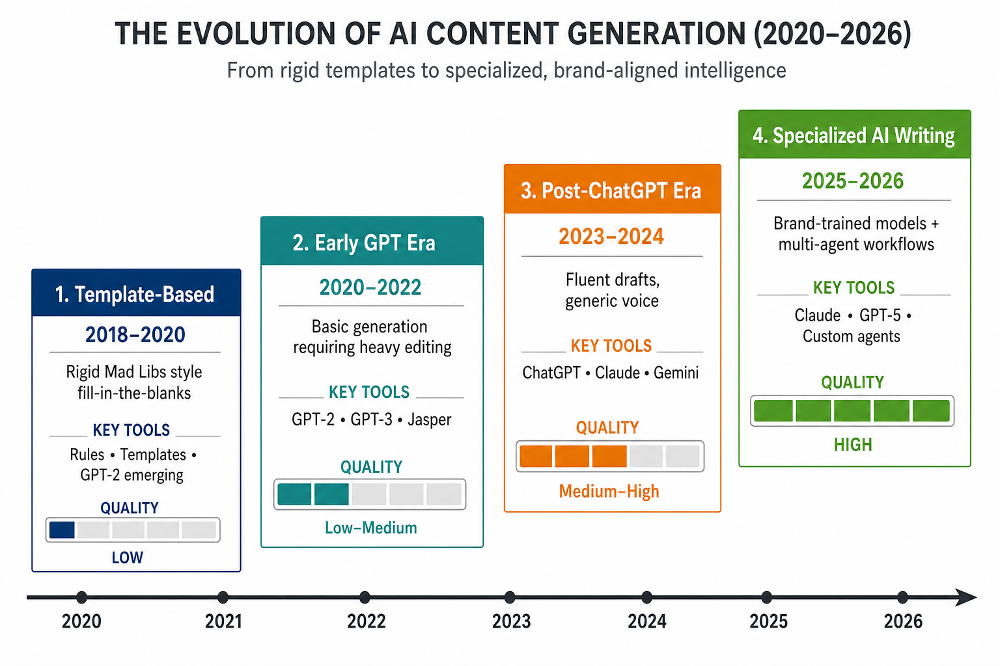
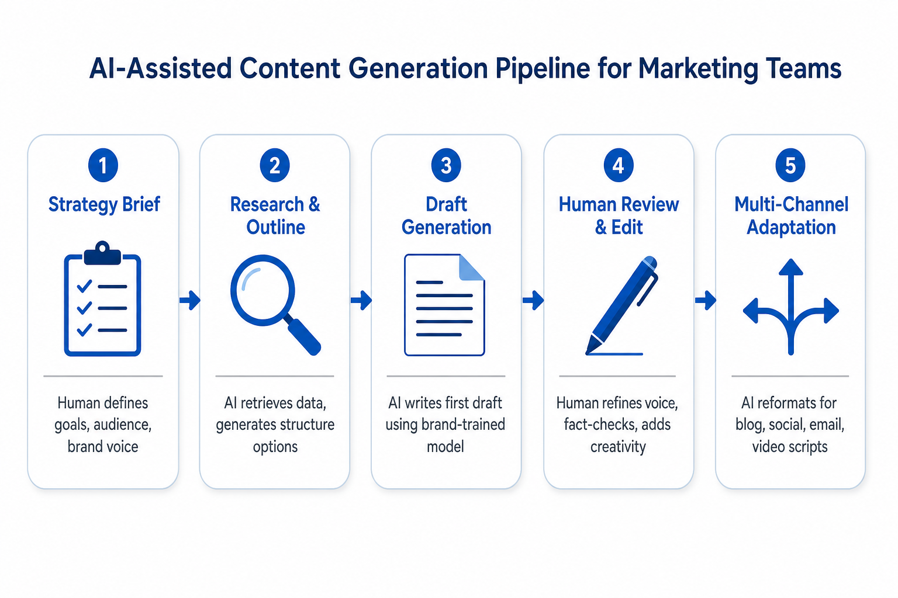
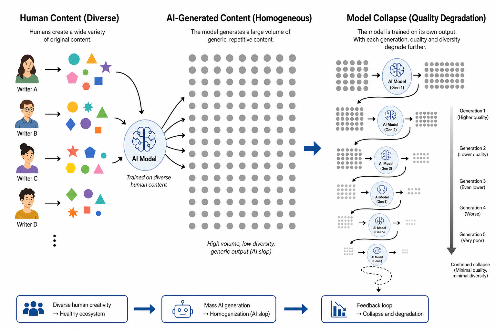
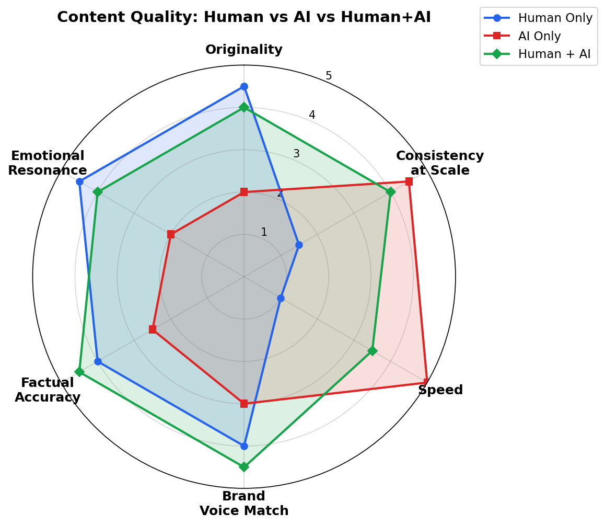
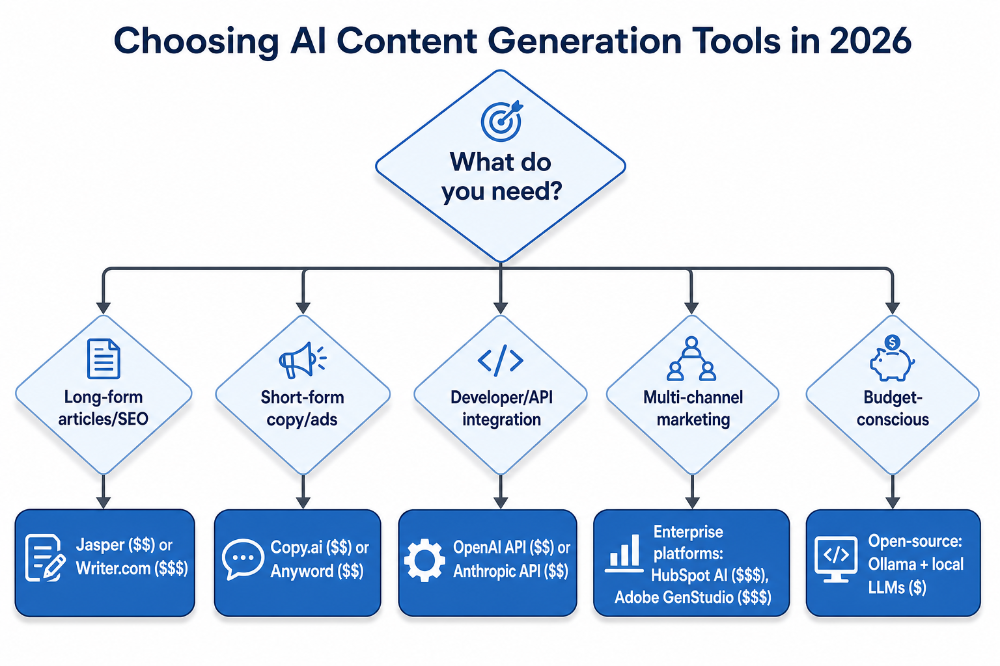

# Day 52: Content Generation — Can AI Replace Human Writers?

> **Core Question**: How do LLMs transform professional content creation, and where is the line between augmentation and replacement?

---

## Opening

Imagine you run a marketing team that needs to produce 50 product descriptions, 10 blog posts, 30 social media posts, and 5 email newsletters every week. A decade ago, this required a small army of copywriters. Today, a single content strategist equipped with the right LLM tools can handle this volume — and often with better brand consistency.

But here's the catch: the internet is also filling up with what the industry calls "AI slop" — endless streams of generic, lifeless text that technically reads well but says nothing. A [2026 analysis of web content](https://sellershorts.com/resources/blog/what-is-ai-slop-and-why-low-quality-ai-content-is-destroying-trust-and-seo-in-2026) found that AI-generated content now accounts for a significant fraction of newly published pages, and search engines have begun actively penalizing sites that publish templated, low-value AI output.

So the real question isn't whether AI *can* generate content. It can. The question is: where does AI genuinely augment human creativity, where does it fall flat, and how do professional teams build workflows that produce content people actually want to read?

---

## 1. The Four Eras of AI Content Generation

#### Intuition: From Mad Libs to Co-Authors

Think of AI content generation like the evolution of cooking technology. First came microwave dinners (template-based systems) — fast but tasteless. Then came meal kits with pre-measured ingredients (early GPT models) — better, but you still had to know what you were doing. Now we have smart ovens that can cook complex recipes but still need a human chef to pick the menu and adjust the seasoning.

| Era | Timeframe | Key Technology | Output Quality | Human Effort |
|-----|-----------|---------------|----------------|-------------|
| Template-Based | 2018-2020 | Mail merge, NLG templates | Rigid, robotic | Heavy setup |
| Early GPT | 2020-2022 | GPT-2, GPT-3 | Fluent but unfocused | Heavy editing |
| Post-ChatGPT | 2023-2024 | ChatGPT, GPT-4, Claude 2/3 | Fluent, structured, generic | Moderate editing |
| Specialized AI | 2025-2026 | Brand-trained models, multi-agent workflows | High quality, brand-consistent | Strategic oversight |


*Figure 1: The four eras of AI content generation, from rigid templates to specialized brand-aware systems.*

The critical shift happened between Era 3 and Era 4. In 2023-2024, everyone discovered that ChatGPT could write a blog post. But by 2025, the market matured: enterprises realized that generic LLM output wasn't good enough for professional use. The frontier moved to **brand-trained models** — LLMs fine-tuned or prompted with a company's specific voice, terminology, and style guidelines.

---

## 2. How LLMs Actually Generate Content

#### Intuition: Autocomplete on Steroids

At its core, every LLM generates content the same way your phone suggests the next word — by predicting the most likely next token given the context. The difference is scale, training data, and the attention mechanism that lets the model track long-range dependencies.

When you prompt an LLM to "write a product description for a wireless headphone," the process looks like:

1. **Tokenization**: Your prompt is split into tokens
2. **Context encoding**: Each token is embedded and processed through transformer layers
3. **Next-token prediction**: The model predicts a probability distribution over the vocabulary
4. **Sampling**: A token is selected (temperature, top-p, or greedy)
5. **Decoding loop**: The predicted token is appended to the context, and the process repeats

The math behind this is autoregressive generation:

$$
\begin{aligned}
P(x) &= \prod_{t=1}^{T} P(x_t \mid x_{1:t-1}) \\
L &= -\sum_{t=1}^{T} \log P(x_t \mid x_{1:t-1})
\end{aligned}
$$

This is the same next-token prediction objective we covered in [Day 6](./day06-what-is-an-llm.md). The key insight for content generation: **the prompt is the single biggest lever for output quality**. A vague prompt produces generic output; a rich prompt with examples, constraints, and brand guidelines produces targeted, useful content.

---

## 3. The Modern Content Generation Pipeline

Professional content teams don't just "ask ChatGPT to write an article." They build structured pipelines.


*Figure 2: A five-stage AI-assisted content pipeline used by professional marketing teams.*

### Stage 1: Strategy Brief (Human)

The human defines: What are we writing? For whom? What's the goal? What brand voice do we use? This is where strategic thinking happens — AI can't decide what your audience cares about.

### Stage 2: Research & Outline (AI + Human)

LLMs excel at rapidly synthesizing information from multiple sources. Tools like [Perplexity](https://www.perplexity.ai/) can research topics, while the LLM generates outline options. The human picks the strongest angle.

### Stage 3: Draft Generation (AI)

Using a brand-trained model or a carefully engineered system prompt, the AI generates a complete first draft. This is where platforms like [Jasper](https://www.jasper.ai/), [Writer](https://writer.com/), and [Copy.ai](https://www.copy.ai/) add value — they provide brand voice training, template libraries, and workflow automation that raw ChatGPT doesn't offer.

### Stage 4: Human Review & Edit (Human)

The human editor refines voice, fact-checks claims, adds original insights and examples, and ensures the content says something worth reading. This stage is non-negotiable for quality content.

### Stage 5: Multi-Channel Adaptation (AI)

The AI reformats the approved content for different channels: blog post, LinkedIn carousel, Twitter thread, email newsletter, video script. Each format has different conventions that the LLM can handle well.

---

## 4. The AI Slop Problem

#### Intuition: The Photocopier Effect

Imagine taking a document, photocopying it, then photocopying the copy, and repeating. Each generation loses fidelity. AI slop is the digital equivalent: when AI generates content that gets published, scraped, fed back into training data, and regenerated, quality degrades recursively.


*Figure 3: How AI-generated content flooding creates a model collapse feedback loop.*

The [model collapse phenomenon](https://arxiv.org/abs/2305.17493) — first described by Shumailov et al. (2023) and widely confirmed since — shows that models trained on synthetic data produced by previous models progressively lose quality, diversity, and accuracy. In content marketing terms: if everyone publishes AI-generated articles, and future AI models train on that output, the entire content ecosystem degrades.

This is not just a model-training problem; it is also a search ecosystem problem. Large volumes of templated pages crowd search results, reduce user trust, and create the wrong incentive: whoever can publish AI content fastest may get short-term visibility.

**What causes AI slop:**

- **Generic structure**: Predictable heading patterns ("In today's fast-paced world...")
- **Vague information**: No specific data, examples, or original insights
- **Repetitive phrasing**: Corporate-speak and hollow transitions
- **No unique perspective**: Content that could apply to any company in any industry

That is why search platforms increasingly distinguish between "AI content" and "content abuse." Google's [scaled content abuse policy](https://developers.google.com/search/docs/essentials/spam-policies#scaled-content-abuse) does not target AI-assisted writing itself; it targets pages generated at scale for the purpose of manipulating search rankings while providing little original value. Violating sites may be demoted, and severe cases can be removed from search results. This means the economic incentive to spam AI content is shrinking fast.

---

## 5. Where AI Excels vs. Where Humans Still Win


*Figure 4: Content quality across six dimensions. Human+AI collaboration combines the strengths of both.*

The radar chart tells a clear story: AI alone is fast and consistent but weak on originality and emotional resonance. Humans alone are creative and emotionally resonant but can't match AI's speed or consistency. **The sweet spot is human+AI collaboration** — which scores well across all dimensions.

### Where AI genuinely excels:

- **First drafts at scale**: Generating 50 product descriptions or 100 ad variations
- **Format adaptation**: Converting a blog post into an email, social posts, and a script
- **Consistency maintenance**: Applying the same tone across hundreds of pieces
- **Research synthesis**: Summarizing 20 sources into a coherent overview
- **SEO optimization**: Suggesting keywords, meta descriptions, and structural improvements

### Where humans remain essential:

- **Original insights and opinions**: Having something to say that hasn't been said
- **Emotional resonance**: Writing that makes readers feel understood
- **Cultural sensitivity**: Understanding context, timing, and audience nuance
- **Fact verification**: AI hallucinates; humans must verify claims
- **Strategic decisions**: Choosing what to write about and why

---

## 6. Tool Landscape in 2026


*Figure 5: Decision tree for selecting the right AI content generation tool.*

| Tool Category | Examples | Best For | Price Range |
|--------------|----------|----------|-------------|
| Enterprise Marketing | [Jasper](https://www.jasper.ai/), [Writer](https://writer.com/) | Brand-trained long-form content | $49-500/mo |
| Short-Form & Social | [Copy.ai](https://www.copy.ai/), [Anyword](https://anyword.com/) | Ads, social posts, email copy | $36-100/mo |
| API / Developer | [OpenAI](https://openai.com/api/), [Anthropic](https://anthropic.com/) | Custom pipelines | Pay-per-token |
| All-in-One Marketing | [HubSpot AI](https://www.hubspot.com/), [Adobe GenStudio](https://www.adobe.com/) | Multi-channel campaigns | Enterprise |
| Open-Source / Local | [Ollama](https://ollama.ai/) + Llama/Qwen | Privacy-sensitive, budget | Free |

A key trend in 2026: the rise of "Brand LLMs" — generative AI systems configured to produce content matching a company's specific voice. There are two main approaches, each with trade-offs:

| Approach | How It Works | Pros | Cons |
|----------|-------------|------|------|
| Fine-tuning | Train model weights on brand content | Deep voice internalization | Expensive to update; needs training data |
| RAG + System Prompt | Retrieve brand examples at inference | Easy to update; no training needed | Less consistent; depends on retrieval quality |

Most enterprise platforms (Jasper, Writer) use a hybrid: a base system prompt with brand guidelines, augmented by RAG retrieval of approved examples, and optionally fine-tuned for high-volume use cases. The key principle: **garbage in, garbage out** — the quality of your brand training data matters more than which approach you choose.

---

## 7. Regulatory Landscape: The Labeling Deadline

Content generated by AI now faces regulatory scrutiny. The [EU AI Act](https://artificialintelligenceact.eu/)'s Article 50 transparency obligations become enforceable on **August 2, 2026**, requiring:

- **Machine-readable marking** of AI-generated content (text, images, audio, video)
- **Visible disclosure** for deepfakes and AI-generated content on matters of public interest
- **Multi-layer approach**: visible labels + embedded metadata + invisible watermarks

Two technologies dominate compliance:

- [C2PA (Coalition for Content Provenance and Authenticity)](https://c2pa.org/): An open standard for embedding cryptographically signed metadata about content origin and edit history. Think of it as a "nutrition label" for digital content.

- [Google SynthID](https://deepmind.google/technologies/synthid/): An invisible watermark embedded directly into AI-generated content, designed to survive cropping, compression, and other transformations.

For content teams, this means: if you publish AI-generated content in the EU market, you need a labeling and provenance strategy. The "AI or human?" question is no longer just philosophical — it's legally mandated.

---

## 8. Frontier: What's New in 2026

### WritingBench: The First Comprehensive Writing Benchmark (March 2025, updated November 2025)

[WritingBench](https://arxiv.org/abs/2503.05244), introduced by researchers at the Shanghai Jiao Tong University and Shanghai AI Lab, evaluates LLMs across 6 core writing domains and 100 subdomains. As of mid-2026, [Claude 3.7 Thinking leads the benchmark](https://llm-stats.com/benchmarks/writingbench), followed by Claude 3.7 (non-reasoning) and GPT-5.5, showing that reasoning capability directly translates to better writing quality.

### Expert-Level AI Writing via Fine-Tuning (January 2026)

A [paper from arXiv (2601.18353)](https://arxiv.org/abs/2601.18353) demonstrated that fine-tuning LLMs on high-quality literary books produces expert-level writing — coherent voice, narrative structure, and stylistic sophistication. This validates the "Brand LLM" approach: training on your best content produces better results than generic models.

### Automated Creativity Evaluation (June 2026)

[ArXiv paper 2606.11762](https://arxiv.org/abs/2606.11762) established a reproducible standard for automated LLM creativity evaluation across open-ended tasks, enabling scalable benchmarking of creative AI — a crucial step for measuring progress beyond just fluency.

### EQ-Bench Creative Writing v3 (2025-2026)

The [EQ-Bench Creative Writing Benchmark v3](https://github.com/EQ-bench/creative-writing-bench) uses LLM-judged evaluation of long-form creative writing. As of June 2026, [Claude Opus 4.7 leads with an Elo of 2206](https://evy.so/compare/best-llms-for-writing/), followed by GPT-5.5 at 2035 — showing the gap between top models in creative writing remains significant.

---

## 9. Common Misconceptions

### ❌ "AI will replace all writers"

AI replaces *tasks*, not *roles*. The writer who uses AI will replace the writer who doesn't. Content that requires original thinking, emotional intelligence, and strategic judgment still needs humans — but humans who leverage AI produce 5-10x more output.

### ❌ "More AI content = better SEO"

The opposite is true. Google's [scaled content abuse policy](https://developers.google.com/search/docs/essentials/spam-policies#scaled-content-abuse) targets large-scale, low-value content production meant to manipulate rankings, not AI tools themselves. Quality, originality, and human value are what rank — not volume.

### ❌ "If it reads well, it's good content"

Fluent ≠ valuable. LLMs produce grammatically perfect text that can be completely generic. Good writing isn't just about sentence-level quality; it's about having something worth saying. AI is excellent at the "how" of writing but cannot provide the "why."

---

## 10. Code Example: A Brand-Voice Content Generation Pipeline

```python
import openai

class BrandContentGenerator:
    """Generate brand-consistent content using few-shot voice examples."""
    
    def __init__(self, brand_name, voice_examples, style_guidelines):
        self.brand_name = brand_name
        self.voice_examples = voice_examples  # 3-5 samples of brand content
        self.style_guidelines = style_guidelines
        
    def build_system_prompt(self):
        examples_text = "\n\n---\n\n".join(self.voice_examples)
        return f"""You are the content team for {self.brand_name}.
        
STYLE GUIDELINES:
{self.style_guidelines}

REFERENCE EXAMPLES (match this voice):
{examples_text}

RULES:
- Never use generic phrases like "in today's fast-paced world"
- Include specific data or examples when making claims  
- Maintain the voice from the reference examples
- If you don't know a fact, say so rather than fabricating"""
    
    def generate(self, content_type, topic, audience, length="medium"):
        system_prompt = self.build_system_prompt()
        user_prompt = f"""Write a {content_type} about "{topic}" for {audience}.
Length: {length}
Include: a compelling hook, 2-3 specific examples, and a clear call-to-action."""
        
        response = openai.chat.completions.create(
            model="gpt-4o",
            messages=[
                {"role": "system", "content": system_prompt},
                {"role": "user", "content": user_prompt}
            ],
            temperature=0.7  # balanced creativity and consistency
        )
        return response.choices[0].message.content

# Usage
generator = BrandContentGenerator(
    brand_name="TechCo",
    voice_examples=[
        "We believe great software disappears. The best tools feel like extensions of your thinking...",
        "Stop managing tasks. Start managing outcomes. Here's how our dashboard changes the equation...",
        # 2-3 more examples for best results
    ],
    style_guidelines="""- Conversational but precise
- Use short paragraphs (2-3 sentences max)
- Bold key terms for scannability
- Always include concrete numbers"""
)

draft = generator.generate(
    content_type="blog post intro",
    topic="API rate limiting best practices",
    audience="backend developers"
)
print(draft)
```

This pattern — few-shot voice examples + explicit style constraints + specific content request — produces dramatically better results than raw "write me a blog post" prompts.

---

## Further Reading

### Beginner
1. [The Best AI Writing Tools in 2026](https://www.eesel.ai/blog/ai-writing-tools-comparison) — A hands-on comparison of Jasper, Copy.ai, Writer, and more
2. [Google Search guidance on generative AI content](https://developers.google.com/search/docs/fundamentals/using-gen-ai-content) — How Google distinguishes useful AI-assisted content from scaled content abuse

### Advanced
1. [WritingBench: A Comprehensive Benchmark for Generative Writing](https://arxiv.org/abs/2503.05244) — The most thorough evaluation of LLM writing quality to date
2. [EQ-Bench Creative Writing v3](https://github.com/EQ-bench/creative-writing-bench) — Community-driven creative writing leaderboard

### Papers
1. ["Can Good Writing Be Generative?" (Jan 2026)](https://arxiv.org/abs/2601.18353) — Fine-tuning on high-quality books for expert-level AI writing
2. ["Automated Creativity Evaluation of Language Models" (Jun 2026)](https://arxiv.org/abs/2606.11762) — Establishing reproducible creativity benchmarks
3. ["The Curse of Recursion: Training on Generated Data Makes Models Forget" (Shumailov et al.)](https://arxiv.org/abs/2305.17493) — The foundational paper on model collapse

### Regulations
1. [EU AI Act Article 50 — Transparency Requirements](https://artificialintelligenceact.eu/transparency-rules-article-50/)
2. [C2PA Standard](https://c2pa.org/) — Content provenance specification
3. [Google SynthID](https://deepmind.google/technologies/synthid/) — AI content watermarking

---

## Reflection Questions

1. If you were building a content team today, how would you divide work between humans and AI? Which tasks would you never delegate to AI, and why?
2. The article mentions "model collapse" from AI training on AI output. How might this affect the long-term quality of search results and online information?
3. The EU now requires labeling of AI-generated content. What are the trade-offs between transparency and creative freedom? Could labeling requirements advantage large companies over independent creators?

---

## Summary

| Concept | Key Takeaway |
|---------|-------------|
| Four Eras | AI content generation evolved from templates → raw GPT → ChatGPT → specialized brand-trained models |
| Human + AI | The best results come from collaboration: AI handles scale and speed, humans handle strategy and originality |
| AI Slop | Low-quality AI content is flooding the web; search engines now penalize it |
| Brand LLMs | Fine-tuning on brand-specific content is the key differentiator for professional use |
| Regulation | EU AI Act requires AI content labeling as of August 2026 |

**Key Takeaway**: AI doesn't replace writers — it replaces the writing *tasks* that humans shouldn't have been doing manually in the first place. The future of content generation is human-AI collaboration, where AI handles scale, speed, and consistency while humans provide strategy, originality, and emotional intelligence. The teams that build the best collaboration workflows will produce more, better, and more authentic content than either humans or AI could alone.

---

*Day 52 of 60 | LLM Fundamentals*
*Word count: ~2,600 | Reading time: ~13 minutes*
