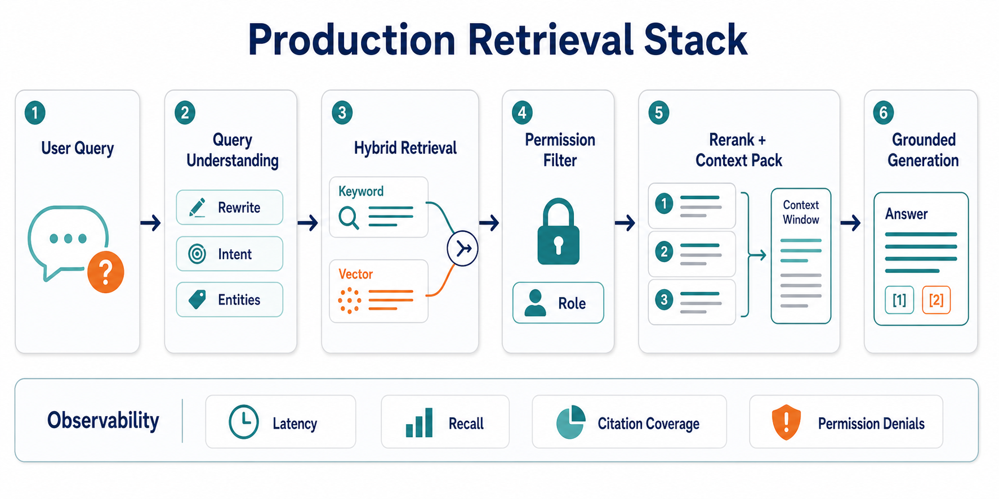
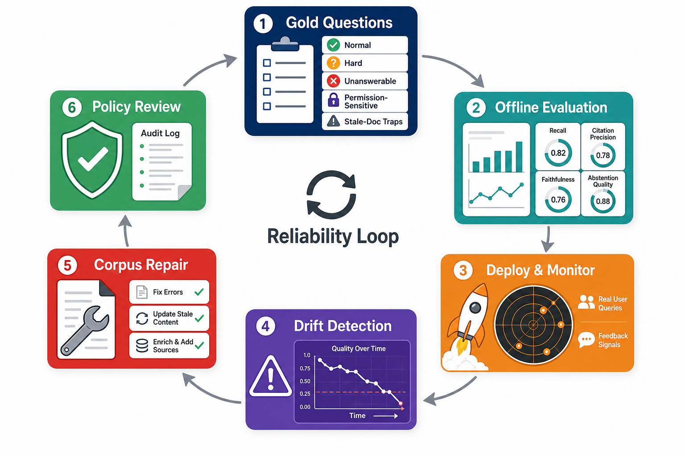
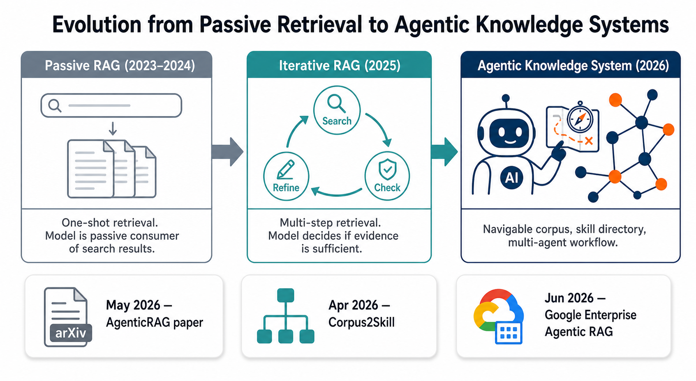

# Day 53: Knowledge Management — Enterprise Knowledge Bases and Document Q&A

> **Core Question**: How do you turn a messy pile of company documents into a reliable LLM system that answers questions with evidence, permissions, and accountability?

---

## Opening

Imagine joining a company on Monday and being asked to answer a customer escalation by Friday. The answer exists somewhere: a support ticket from last year, a pricing exception in Salesforce, a Confluence page that was last edited by someone who has left, a PDF contract, and a Slack thread that explains why the policy changed. Traditional knowledge management says, "organize the documents better." LLM-era knowledge management says, "make the knowledge usable at the moment of work."

That shift sounds small, but it changes the whole system. A search box returns links. A document Q&A assistant returns an answer, cites sources, respects access control, and admits when the corpus is insufficient. The difference is like the difference between a library catalog and a research assistant: both use the same library, but only one can connect scattered evidence into a decision.

The hard part is not chatting with PDFs. The hard part is building a trustworthy knowledge runtime: ingestion, chunking, metadata, retrieval, reranking, permission filtering, answer generation, citation, evaluation, and continuous repair. This article explains that stack from first principles.

---

## 1. Why Enterprise Knowledge Is Hard

#### Intuition: A Company Is a House with Many Junk Drawers

Think of enterprise knowledge like a house where every room has a junk drawer. Engineering has design docs. Sales has CRM notes. Support has tickets. Legal has contracts. HR has policy PDFs. Each drawer makes sense to the person who uses it every day, but a newcomer cannot know where to look.

Traditional search assumes the user already knows the right words. That fails in companies because the same idea has many names: "customer churn," "logo loss," "renewal risk," and "retention issue" may describe related events. Dense embeddings help because they match meaning, not only exact words, but meaning alone is not enough. Enterprise systems also need freshness, permissions, provenance, and operational ownership.


*Figure 1: The knowledge pipeline turns scattered sources into governed, testable document Q&A.*

| Problem | Why It Appears | What Breaks If Ignored |
|---------|----------------|------------------------|
| Fragmented sources | Knowledge lives in many tools | The assistant answers from a partial view |
| Stale documents | Policies and product behavior change | Old answers sound confident but are wrong |
| Access control | Employees have different permissions | The model may leak restricted information |
| Ambiguous language | Teams use different terms | Keyword search misses relevant evidence |
| Missing evaluation | Real questions evolve over time | Quality silently drifts after launch |

This is why enterprise knowledge management is not simply "put all PDFs in a vector database." A vector database is one useful component. The product people actually need is a system that can answer: What evidence did you use? Is it still current? Was the user allowed to see it? How do we know the answer is good?

---

## 2. The Core Architecture: RAG as a Knowledge Runtime

#### Intuition: Open-Book Exam with a Strict Librarian

Retrieval-Augmented Generation (RAG) is like an open-book exam. The model is allowed to consult notes before answering. But enterprise RAG needs a strict librarian standing beside it: the librarian checks which books the student may read, finds the most relevant pages, removes outdated editions, and records the citations.

The basic RAG equation is simple:

$$
\begin{aligned}
q &= \text{user question} \\
D_q &= \text{TopK}(\text{retrieve}(q, D)) \\
a &= \text{LLM}(q, D_q)
\end{aligned}
$$

The formula says: retrieve a small evidence set from the document corpus, then generate an answer conditioned on that evidence. The simplicity is useful, but it hides most production complexity. In a real enterprise system, `retrieve` usually includes query rewriting, sparse search, dense vector search, metadata filters, access-control filters, reranking, deduplication, and context packing.


*Figure 2: A production retrieval stack combines query understanding, hybrid retrieval, permission filtering, and context packing before generation.*

The retrieval stack usually has four layers:

| Layer | Main Job | Common Tools |
|-------|----------|--------------|
| Source layer | Connect to docs, tickets, wiki, CRM, databases | [Confluence](https://www.atlassian.com/software/confluence), [SharePoint](https://www.microsoft.com/microsoft-365/sharepoint/collaboration), [Notion](https://www.notion.com/), [Salesforce](https://www.salesforce.com/) |
| Index layer | Parse, chunk, embed, store metadata | [Pinecone](https://www.pinecone.io/), [Weaviate](https://weaviate.io/), [Elasticsearch](https://www.elastic.co/elasticsearch) |
| Retrieval layer | Search, rerank, filter, assemble evidence | BM25, vector search, cross-encoder rerankers |
| Answer layer | Generate grounded answer with citations | [OpenAI API](https://openai.com/api/), [Anthropic Claude](https://www.anthropic.com/claude), [Google Gemini](https://gemini.google/) |

Notice that this table compares layers, not "which product is best." A source system, a vector database, and a model API are fundamentally different product types. Putting them in one leaderboard would be misleading. The right question is not "Is Pinecone better than Confluence?" The right question is "Which layer does each tool occupy, and what contract must it satisfy?"

---

## 3. Chunking, Metadata, and Hybrid Retrieval

#### Intuition: Cutting a Book into Index Cards

If you cut a book into one-page index cards, each card is easy to retrieve but may lose context. If you keep the whole book as one chunk, retrieval becomes too broad and the LLM wastes context. Chunking is the art of choosing useful cards: large enough to preserve meaning, small enough to retrieve precisely.

Most document Q&A failures start before the LLM sees anything. Bad parsing loses tables. Bad chunking splits an answer from its definition. Missing metadata prevents filtering by product version, customer segment, date, owner, or jurisdiction. Weak retrieval sends irrelevant text into the prompt, and the model obediently writes a polished answer from weak evidence.

Three retrieval patterns matter most:

| Pattern | What It Is | Best Use |
|---------|------------|----------|
| Sparse retrieval | Keyword search such as BM25 | Exact names, error codes, policy IDs |
| Dense retrieval | Embedding similarity | Paraphrases and semantic matches |
| Hybrid retrieval | Sparse plus dense plus reranking | Most enterprise document Q&A |

Hybrid retrieval is strong because company questions often mix exact and semantic signals. A user might ask, "Can EU trial accounts use SSO?" The tokens "EU," "trial," and "SSO" are exact filters, while "use" may mean enable, configure, purchase, or access. Sparse search catches the abbreviations. Dense search catches meaning. A reranker then decides which passages actually answer the question.

The newest work increasingly treats metadata as a first-class object. The December 2025 paper [Leveraging LLM-Generated Metadata to Enhance RAG Systems](https://arxiv.org/html/2512.05411v1) describes a pipeline where LLMs enrich document chunks with structured metadata to improve retrieval in enterprise settings. The idea is practical: many companies already have useful documents, but the metadata is incomplete, inconsistent, or absent. LLMs can help generate titles, topics, entities, time ranges, and intended audiences, then humans or automated checks can validate the high-risk fields.

---

## 4. Access Control and Governance

#### Intuition: The Assistant Needs a Badge Reader

An enterprise assistant should behave like an employee entering rooms with a badge. It should not say, "I found the answer in a restricted legal folder, but I will summarize it anyway." If a user cannot access the underlying document, the assistant must not use that document as evidence.

The most important governance rule is simple: permission filtering must happen before generation, not after. If restricted text enters the model context, the leak has already happened. Post-hoc redaction is weaker because the model may paraphrase the sensitive content.

Practical systems usually enforce four controls:

1. **Identity propagation**: the retrieval service receives the actual user identity or a scoped service token.
2. **Document-level permissions**: the search index stores access-control lists (ACLs) or references to them.
3. **Field-level sensitivity**: some fields, such as salary, legal strategy, or health data, require stricter handling.
4. **Audit logs**: every answer should record user, query, retrieved source IDs, model version, and timestamp.

For regulated domains, governance also includes retention, deletion, and data residency. A RAG system that indexes a deleted employee document forever is not compliant just because it gives useful answers. Knowledge management is therefore partly an AI problem and partly an information governance problem.

---

## 5. Strategy Choices: Fine-Tuning, Vector RAG, Graph RAG, and Agentic RAG

#### Intuition: Memorize, Search, Map, or Investigate

There are four common strategies for enterprise knowledge systems. They solve different problems, so they should not be treated as interchangeable products.


*Figure 3: An illustrative comparison of freshness, complexity, and governance fit across knowledge strategies.*

| Strategy | Best When | Main Risk |
|----------|-----------|-----------|
| Fine-tuning | You need stable style or task behavior | Facts go stale inside weights |
| Vector RAG | You need fresh answers over many documents | Retrieval misses multi-hop evidence |
| Graph RAG | Relationships and entities matter | Graph construction and maintenance cost |
| Agentic RAG | Queries require investigation | More latency, cost, and evaluation burden |

Fine-tuning is often the wrong tool for factual knowledge. It can teach a model how to write in your support tone, classify tickets, or follow a format. It is weak for frequently changing product facts because updating weights is slower than updating an index.

Vector RAG is the default for document Q&A. It is fast, understandable, and easy to update. Its weakness is multi-hop reasoning: if the answer requires combining a pricing page, a regional policy, and a contract clause, single-pass retrieval may not collect all evidence.

Graph RAG adds structure. It represents entities and relationships, which helps with questions like "Which customers are affected by this dependency?" or "What policy changed after this acquisition?" It is powerful when relationships are central, but the graph must be built and maintained.

Agentic RAG lets an LLM decide when to search again, inspect a document more deeply, or reformulate the query. This is closer to how a human analyst works. It is also harder to test because the path varies by query.

---

## 6. Evaluation: How to Know If It Works

#### Intuition: A Knowledge Assistant Needs a Report Card

A demo can look good with ten friendly questions. A production knowledge assistant needs a report card built from real user tasks. The report card should grade both retrieval and generation because a beautiful answer from the wrong evidence is still wrong.

Useful metrics include:

| Metric | What It Checks | Failure It Catches |
|--------|----------------|-------------------|
| Retrieval recall | Did we retrieve evidence containing the answer? | The right document was missed |
| Citation precision | Do cited passages support the claim? | Decorative citations |
| Answer faithfulness | Does the answer stay within the evidence? | Hallucination |
| Abstention quality | Does it say "not enough evidence" when needed? | Overconfident guessing |
| Permission safety | Did retrieval respect user access? | Data leakage |


*Figure 4: Reliable document Q&A requires a loop of gold questions, offline evaluation, deployment monitoring, drift detection, corpus repair, and policy review.*

A good evaluation set should include ordinary questions, hard questions, unanswerable questions, permission-sensitive questions, and stale-document traps. For example:

- "What is the refund policy for enterprise annual contracts in Germany?"
- "Can trial users enable SAML SSO?"
- "Summarize the escalation history for customer X." The expected behavior depends on whether the user has account access.
- "What changed in the March pricing update?" This tests temporal freshness.
- "Who approved the exception?" This tests citation and auditability.

The system should also log failures. When users click "wrong answer," rewrite the question, or open a cited document immediately after reading the answer, those are useful signals. Evaluation is not a one-time benchmark. It is an operating loop.

---

## 7. Code Example: A Minimal Document Q&A Skeleton

The following code is intentionally small. It shows the control flow, not a full production implementation. In real systems, replace the toy retriever with hybrid retrieval, metadata filters, permission checks, and a model API call.

```python
from dataclasses import dataclass
from typing import Iterable
import math

@dataclass
class Chunk:
    doc_id: str
    text: str
    allowed_users: set[str]

def tokenize(text: str) -> set[str]:
    return {w.lower().strip(".,?!:;()") for w in text.split()}

def score(query: str, chunk: Chunk) -> float:
    # Toy sparse score: Jaccard overlap between query words and chunk words.
    # Production systems usually combine BM25, vector search, and reranking.
    q = tokenize(query)
    c = tokenize(chunk.text)
    if not q or not c:
        return 0.0
    return len(q & c) / len(q | c)

def retrieve(query: str, user_id: str, chunks: Iterable[Chunk], k: int = 3) -> list[Chunk]:
    visible = [chunk for chunk in chunks if user_id in chunk.allowed_users]
    ranked = sorted(visible, key=lambda chunk: score(query, chunk), reverse=True)
    return ranked[:k]

def answer(query: str, evidence: list[Chunk]) -> str:
    if not evidence or max(score(query, chunk) for chunk in evidence) < 0.08:
        return "I do not have enough evidence in the accessible corpus to answer."
    citations = ", ".join(chunk.doc_id for chunk in evidence)
    context = "\n".join(f"[{chunk.doc_id}] {chunk.text}" for chunk in evidence)
    return (
        "Draft answer should be generated from this evidence only.\n\n"
        f"Question: {query}\n\nEvidence:\n{context}\n\nCitations: {citations}"
    )

chunks = [
    Chunk("policy-2026-eu", "EU annual contracts allow refund review within 30 days.", {"alice", "bob"}),
    Chunk("trial-sso", "Trial workspaces cannot enable SAML SSO unless approved by sales engineering.", {"alice"}),
    Chunk("legal-private", "Restricted acquisition clause for customer X.", {"legal"}),
]

query = "Can trial users enable SSO?"
evidence = retrieve(query, user_id="alice", chunks=chunks)
print(answer(query, evidence))
```

The key line is the permission filter inside `retrieve`. Even in a toy system, access control happens before evidence enters the answer stage.

---

## 8. Frontier: What Changed in 2026


*Figure 5: The frontier is moving from passive one-shot retrieval toward agentic and navigable knowledge systems.*

### May 2026: AgenticRAG for Enterprise Knowledge Bases

The May 2026 paper [AgenticRAG: Agentic Retrieval for Enterprise Knowledge Bases](https://arxiv.org/html/2605.05538v1) presents an agentic RAG system for enterprise document search and question answering over large file systems. Its key move is to replace one-shot retrieval with an iterative loop: the LLM can search, inspect passages, retrieve full content, and decide whether it has enough evidence before answering.

This matters because many enterprise questions are investigative. A user may ask, "Why did customer X churn?" The answer may require support tickets, contract history, product incidents, and account notes. One retrieval pass often finds the obvious document, not the causal chain.

### April 2026: Corpus2Skill and Navigable Knowledge

The April 2026 paper [Distilling Enterprise Knowledge into Navigable Agent Skills for QA](https://arxiv.org/html/2604.14572v1) proposes Corpus2Skill, which distills a document corpus into a hierarchical skill directory offline and lets an LLM agent navigate that structure at serving time. The motivation is that ordinary RAG treats the model as a passive consumer of search results. A navigable corpus gives the agent a map of what exists, what is missing, and where to look next.

This connects directly to the "skills" idea covered earlier in the course: a skill is not just a tool call; it is a reusable capability with instructions, scope, and structure. Corpus2Skill applies that idea to enterprise knowledge.

### June 5, 2026: Google Enterprise Agentic RAG

On June 5, 2026, Google Research and Google Cloud published [Unlocking dependable responses with Gemini Enterprise Agent Platform's Agentic RAG](https://research.google/blog/unlocking-dependable-responses-with-gemini-enterprise-agent-platforms-agentic-rag/). The post describes a multi-agent workflow that decomposes complex enterprise queries and iteratively searches for sufficient context before generating responses.

The important signal is productization. Agentic RAG is no longer only a research pattern; major cloud providers are packaging it into enterprise platforms where security, data connectors, and monitoring matter as much as model quality.

### 2026 Product Direction: Knowledge Moves into Workflows

Enterprise search vendors such as [Glean](https://www.glean.com/) and platform vendors such as [Microsoft Copilot](https://www.microsoft.com/microsoft-copilot/) are pushing knowledge assistants into daily workflows, not just standalone search portals. The direction is clear: knowledge systems are becoming embedded assistants that can answer, cite, and act in context.

The risk is also clear. When a knowledge assistant moves from "answer this" to "do this," stale or unauthorized knowledge becomes operational risk. That is why retrieval, governance, and evaluation must be designed together.

---

## 9. Common Misconceptions

### "We already have enterprise search, so we have knowledge management"

Search is a retrieval interface. Knowledge management is the full lifecycle: capture, organize, retrieve, validate, govern, update, and retire knowledge. LLMs make weak knowledge hygiene more visible because they turn messy evidence into fluent answers.

### "A bigger context window removes the need for retrieval"

Long context helps, but it does not solve source selection, access control, freshness, or citation quality. Stuffing everything into the prompt is like bringing the whole filing cabinet into a meeting. You still need to know which folder matters.

### "Fine-tuning is how we teach the model our company facts"

Fine-tuning is better for behavior than for changing facts. If the facts change often, keep them outside the weights and retrieve them at inference time. Use fine-tuning for style, format, classification, or specialized task behavior.

### "If the answer has citations, it is grounded"

Citations can be decorative. A grounded answer must make claims that are actually supported by the cited passages. Evaluation should check citation precision, not just citation presence.

---

## 10. Practical Design Checklist

Before launching a document Q&A assistant, ask these questions:

| Area | Question | Good Answer |
|------|----------|-------------|
| Sources | Which systems are indexed? | Owner, connector, refresh schedule documented |
| Parsing | Are tables, PDFs, and slides preserved? | Tests cover common document formats |
| Metadata | Can we filter by date, owner, product, region? | Metadata schema is explicit |
| Permissions | Are ACLs enforced before generation? | Yes, with audit logs |
| Evaluation | Do we have real gold questions? | Yes, including unanswerable and permission cases |
| Operations | Who fixes bad answers? | Clear owner and repair workflow |

This checklist is boring in the best way. Most enterprise AI failures are not caused by exotic model errors. They come from unclear ownership, stale data, missing permissions, and no feedback loop.

---

## Further Reading

### Beginner

1. [What is Retrieval-Augmented Generation?](https://www.elastic.co/what-is/retrieval-augmented-generation) — A practical introduction to RAG from the search infrastructure perspective.
2. [Pinecone: What is RAG?](https://www.pinecone.io/learn/retrieval-augmented-generation/) — A readable explanation of retrieval, embeddings, and grounding.

### Advanced

1. [AgenticRAG: Agentic Retrieval for Enterprise Knowledge Bases](https://arxiv.org/html/2605.05538v1) — May 2026 paper on iterative agentic retrieval for enterprise document search.
2. [Distilling Enterprise Knowledge into Navigable Agent Skills for QA](https://arxiv.org/html/2604.14572v1) — April 2026 paper introducing Corpus2Skill.
3. [Leveraging LLM-Generated Metadata to Enhance RAG Systems](https://arxiv.org/html/2512.05411v1) — December 2025 paper on metadata enrichment for enterprise RAG.
4. [Google Research: Gemini Enterprise Agent Platform's Agentic RAG](https://research.google/blog/unlocking-dependable-responses-with-gemini-enterprise-agent-platforms-agentic-rag/) — June 5, 2026 product-research write-up.

---

## Reflection Questions

1. If your company had to answer only from documents that are provably accessible to the user, which current knowledge sources would become unusable?
2. Which is more dangerous in your domain: a system that refuses too often, or a system that answers confidently from weak evidence?
3. What would a useful gold-question set look like for your team's knowledge base?

---

## Summary

| Concept | One-line Explanation |
|---------|---------------------|
| RAG | Retrieve evidence first, then generate an answer grounded in that evidence |
| Hybrid retrieval | Combine keyword search, vector search, and reranking |
| Metadata | Structured context that makes retrieval filterable and auditable |
| Agentic RAG | Let the model iteratively search, inspect, and refine before answering |
| Governance | Permissions, audit logs, freshness, retention, and ownership |

**Key Takeaway**: Enterprise knowledge management is no longer just a documentation problem. In the LLM era, it is a production AI system: retrieval, governance, evaluation, and repair must work together. The best document Q&A systems feel simple to users because the messy parts are handled underneath.

---

*Day 53 of 60 | LLM Fundamentals*  
*Word count: ~3100 | Reading time: ~16 minutes*
