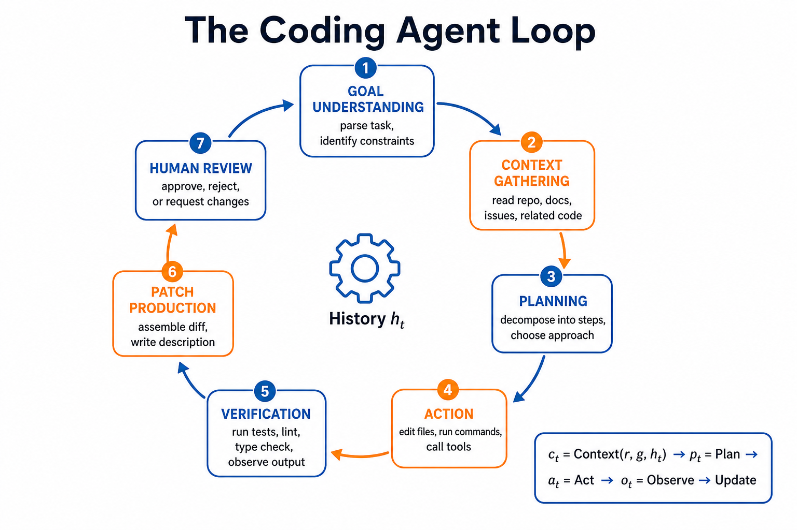
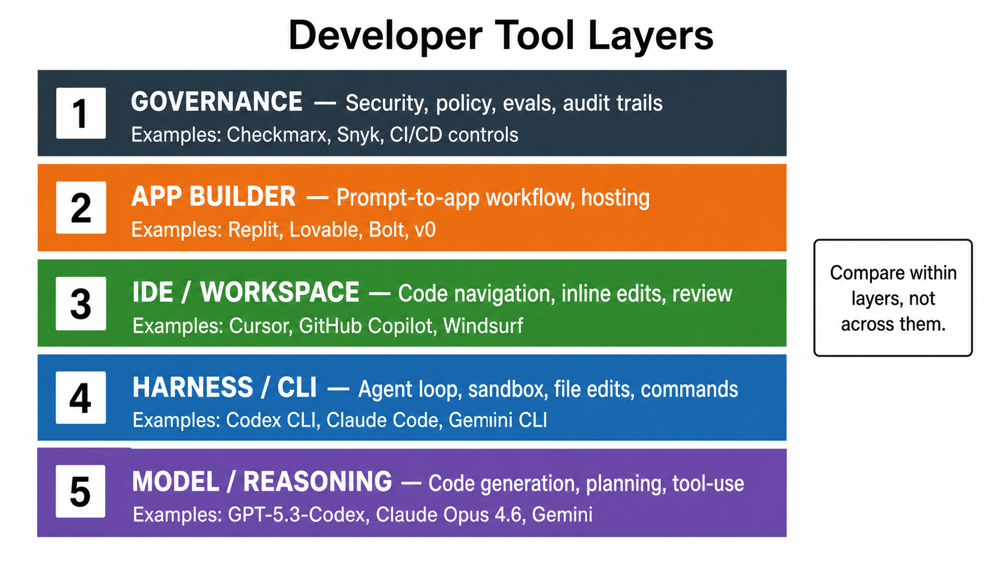

# Day 54: Developer Tools & Vibe Coding — How AI Is Changing Programming

> **Core Question**: How did AI coding tools move from autocomplete to background agents and "vibe coding," and how should developers use them without confusing speed with reliability?

---

## Opening

Imagine cooking with a very fast assistant. In the old workflow, you chopped every onion yourself. With autocomplete, the assistant handed you the next slice. With chat-based coding, you could ask, "Why does this sauce taste wrong?" and get an explanation. With agentic coding, the assistant can read the recipe, inspect the pantry, cook a first version, taste it against a checklist, and ask whether you want more salt. That is a real shift. But it does not remove the need for taste, food safety, or knowing what dinner is supposed to be.

AI developer tools are going through the same transition. Early tools completed lines. Modern tools such as [GitHub Copilot](https://github.com/features/copilot), [Cursor](https://cursor.com/), [Claude Code](https://www.anthropic.com/product/claude-code), [OpenAI Codex](https://openai.com/index/unrolling-the-codex-agent-loop/), [Replit Agent](https://replit.com/agent4), and [Lovable](https://lovable.dev/) can plan, edit many files, run commands, produce pull requests, and in some cases deploy a full application from a natural-language prompt. The popular phrase **vibe coding**, coined by [Andrej Karpathy in February 2025](https://x.com/karpathy/status/1886192184808149383), captured the feeling of describing intent and letting the code appear.

The deeper lesson is not "developers are obsolete." It is that programming effort is moving upward: from typing syntax to specifying behavior, creating feedback signals, reviewing diffs, and operating systems that other people depend on.

---

## 1. From Autocomplete to Agentic Development

#### Intuition: From Calculator to Junior Teammate

Think of the evolution like office tools. A calculator helps you do arithmetic faster, but it does not decide which budget to build. A spreadsheet can recompute many scenarios, but you still design the model. A junior teammate can take a ticket, ask questions, make a draft, and come back with something reviewable. Modern coding agents are moving from calculator-like assistance toward junior-teammate-like assistance.


*Figure 1: AI coding tools evolved from line completion to agentic systems that can act across files, tools, and deployment workflows.*

The shift happened because three capabilities improved together:

| Capability | Earlier Form | Agentic Form |
|------------|--------------|--------------|
| Context | Current file or selected snippet | Whole repository, docs, terminal output, issue history |
| Action | Suggest text | Edit files, run tests, open pull requests, call tools |
| Feedback | Human accepts or rejects completion | Tests, lint, runtime logs, code review, deployment signals |

The important word is **together**. A model that writes good code but cannot run tests is still a suggestion engine. A tool that can run commands but has weak context will make confident local edits that break global assumptions. A polished user interface without verification can make bad code feel safe.

This is why developer tools are no longer only "AI models." They are systems: model plus harness, editor integration, sandbox, package manager, test runner, permission boundary, and review flow.

---

## 2. What "Vibe Coding" Actually Means

#### Intuition: Sketching Before Blueprints

Vibe coding is like sketching a house on a napkin before hiring an architect. The sketch is valuable because it makes an idea concrete quickly. You can see the kitchen, move the stairs, and decide whether the concept is worth pursuing. But nobody should approve a load-bearing wall from the napkin alone.

In practice, vibe coding means using natural language as the primary interface for creating software. A user describes a product, feature, bug, or visual change; the AI tool writes code; the user runs, inspects, and redirects. Tools such as [Replit Agent 4](https://replit.com/blog/introducing-agent-4-built-for-creativity), [Lovable](https://lovable.dev/guides/best-vibe-coding-tools-2026-build-apps-chatting), [Bolt](https://bolt.new/), and [v0 by Vercel](https://v0.dev/) make this accessible to people who may not think of themselves as programmers. Tools such as [Cursor](https://cursor.com/blog/cursor-3), [Claude Code](https://docs.anthropic.com/en/docs/claude-code/overview), and [Codex](https://openai.com/index/gartner-2026-agentic-coding-leader/) target developers who still work close to repositories, terminals, and reviews.

The phrase is culturally useful, but technically imprecise. There are at least three different workflows hiding under it:

| Workflow | Primary User | Best Fit |
|----------|--------------|----------|
| Prompt-to-prototype | Founder, designer, student, operator | Landing pages, internal tools, demos |
| Agent-assisted engineering | Software developer | Feature work, refactors, tests, bug fixes |
| Background delegation | Engineering team | Tickets, pull requests, code review, maintenance |

These workflows should not be judged by the same standard. A prototype builder optimizes for speed to first working demo. A repository agent optimizes for correctness under existing constraints. A background agent optimizes for trustworthy delegation and reviewability. Confusing those goals creates disappointment: the tool that is magical for a weekend demo may be risky in a regulated production codebase.

---

## 3. The Coding Agent Loop

#### Intuition: Detective Work with a Lab Notebook

A coding agent is not just a chat window that emits files. It is closer to a detective with a lab notebook. It receives a case, gathers evidence from the codebase, forms a hypothesis, changes something, runs experiments, records results, and revises the hypothesis. The notebook matters because without a trace of what it did, the human reviewer cannot tell whether the conclusion is trustworthy.


*Figure 2: A coding agent loops through goal understanding, context gathering, planning, action, verification, patch production, and human review.*

A simplified agent loop can be written as:

$$
\begin{aligned}
c_t &= \text{Context}(r, g, h_t) \\
p_t &= \text{Plan}(g, c_t) \\
a_t &= \text{Act}(p_t, c_t) \\
o_t &= \text{Observe}(\text{tools}(a_t)) \\
h_{t+1} &= \text{Update}(h_t, a_t, o_t)
\end{aligned}
$$

Here, **r** is the repository, **g** is the goal, **h_t** is the agent's working history, **a_t** is the action, and **o_t** is the observation from tools such as tests or terminal commands. The formula is not decorative. It explains why agent quality depends on the whole loop. Better models help, but so do better context selection, safer tools, clearer observations, and stronger update rules.

OpenAI's February 2026 technical post, [Unrolling the Codex agent loop](https://openai.com/index/unrolling-the-codex-agent-loop/), makes this point explicitly by describing Codex as a harness that orchestrates model calls, prompts, tools, and context. [Anthropic's Claude Code documentation](https://docs.anthropic.com/en/docs/claude-code/overview) similarly frames Claude Code as an agentic coding tool that reads the codebase, edits files, runs commands, and integrates with development tools. The industry is converging on the same architecture: the model is the reasoning engine, but the harness determines how reasoning becomes reliable work.

---

## 4. Product Layers: Do Not Put Everything in One Leaderboard

#### Intuition: Comparing Engines, Cars, Roads, and Driving Schools

Asking "Which AI coding tool is best?" can be like asking whether an engine is better than a car, a road, or a driving school. They are related, but they occupy different layers. A model may be excellent at code reasoning. A command-line harness may be excellent at safe repository edits. An IDE may be excellent at local navigation. A prompt-to-app platform may be excellent at deployment for beginners.


*Figure 3: Developer tools should be compared within layers, not flattened into one misleading product ranking.*

| Layer | What It Provides | Examples |
|-------|------------------|----------|
| Model / reasoning | Code generation, planning, tool-use reasoning | [OpenAI GPT-5.5-Codex](https://openai.com/index/introducing-gpt-5-5-codex/), [Claude Opus 4.8](https://www.anthropic.com/news/claude-opus-4-8), Gemini models |
| Harness / CLI | Agent loop, sandbox, file edits, command execution | [Codex CLI](https://github.com/openai/codex), [Claude Code](https://www.anthropic.com/product/claude-code), Gemini CLI |
| IDE / workspace | Code navigation, inline changes, review interface | [Cursor](https://cursor.com/), [GitHub Copilot](https://github.com/features/copilot), Windsurf |
| App builder | Prompt-to-app workflow, hosting, integrations | [Replit](https://replit.com/), [Lovable](https://lovable.dev/), [Bolt](https://bolt.new/), [v0](https://v0.dev/) |
| Governance layer | Security, policy, evals, audit trails | [Checkmarx](https://checkmarx.com/), [Snyk](https://snyk.io/), CI/CD controls |

This table deliberately avoids saying that one row is "better" than another. They are different product types. The useful question is: What layer am I choosing? What contract does that layer need to satisfy? What failure would be unacceptable?

For example, a solo founder building a throwaway demo may care about app-builder speed, visual iteration, and one-click deployment. A bank engineering team may care more about repository permissions, audit logs, dependency policy, test coverage, and whether code ever leaves a controlled environment. Both are valid, but they are not the same problem.

---

## 5. Reliable Vibe Coding: Turn Vibes into Contracts

#### Intuition: Give the Agent a Report Card

An agent cannot improve a task it cannot grade. Imagine asking a student to "write something good" versus giving a rubric: target audience, required sections, examples, word limit, forbidden sources, and grading criteria. The second request is not less creative; it is more inspectable. Coding agents need the same kind of report card.


*Figure 4: A reliable workflow converts vague intent into acceptance criteria, small vertical slices, tests, telemetry, and review.*

A practical workflow looks like this:

1. **Intent**: Describe the user, the job to be done, and the constraints.
2. **Spec**: Write acceptance criteria, non-goals, data assumptions, and failure cases.
3. **Scaffold**: Ask for the smallest vertical slice that can run end to end.
4. **Instrument**: Add tests, type checks, linting, logging, and simple telemetry.
5. **Iterate**: Let the agent patch, run, observe, and explain changes.
6. **Harden**: Review security, permissions, dependency risk, deployment, and rollback.

The key equation is a reliability one:

$$
\begin{aligned}
P(\text{ship}) &= P(\text{correct intent}) \times P(\text{valid code}) \times P(\text{verified behavior}) \times P(\text{safe operation})
\end{aligned}
$$

If any factor is weak, the final result is weak. This is why "it compiled" is not enough. Compilation checks syntax. It does not prove the feature matches user intent, handles edge cases, preserves privacy, or can be rolled back.

Cursor's January 2026 guide, [Best practices for coding with agents](https://cursor.com/blog/agent-best-practices), emphasizes verifiable goals: typed languages, linters, tests, and clear signals. That advice generalizes beyond Cursor. Agents are strongest when the environment gives them fast, objective feedback. They are weakest when the only feedback is a vague human feeling after a large unreviewed patch.

---

## 6. Evaluation: Why Benchmarks Matter and Mislead

#### Intuition: Driving Test vs. Rush-Hour Delivery

A driving test is useful. It checks mirrors, turns, parking, and traffic rules. But passing a driving test does not prove someone can deliver medicine across a crowded city during a storm. Coding benchmarks are similar. They are necessary, but each benchmark captures only part of software engineering.


*Figure 5: As tasks become more realistic and long-horizon, benchmark confidence usually falls because there are more hidden dependencies and operational constraints.*

[SWE-bench](https://www.swebench.com/) was introduced to evaluate whether models can resolve real GitHub issues. It remains important because it moved coding evaluation beyond toy functions. But real engineering also includes ambiguous requirements, multi-week evolution, product judgment, dependency upgrades, flaky tests, migrations, observability, security, and human coordination.

That is why newer benchmark work is moving beyond single-issue repair. The December 2025 paper [SWE-EVO: Benchmarking Coding Agents in Long-Horizon Software Evolution](https://arxiv.org/html/2512.18470v5) argues that real software engineering is a long-horizon process: agents must interpret high-level requirements, coordinate many-file changes, preserve functionality, and evolve a codebase over multiple iterations. In November 2025, the SWE-bench site also announced [CodeClash](https://www.swebench.com/) as a goal-oriented developer evaluation, another sign that the field is trying to measure more than isolated patch generation.

The practical rule is simple: use public benchmarks to understand the frontier, but build private evaluations for your own codebase. A payment company should evaluate payment edge cases. A healthcare company should evaluate privacy and clinical safety workflows. A game studio should evaluate asset pipelines, performance, and player experience. General benchmarks are the weather report; your production evals are the instruments in the cockpit.

---

## 7. Frontier Updates in 2026

#### Intuition: The Frontier Is Moving from "Can It Code?" to "Can It Work?"

The most important recent updates are not merely bigger models. They are about longer tasks, better supervision, and broader software-lifecycle work.

| Date | Update | Why It Matters |
|------|--------|----------------|
| Feb 5, 2026 | [Anthropic introduced Claude Opus 4.6](https://www.anthropic.com/news/claude-opus-4-6) with stronger coding, longer agentic tasks, and a 1M-token context window in beta | Larger working memory makes repository-scale reasoning more practical, though not automatically correct |
| May 28, 2026 | [Anthropic released Claude Opus 4.8](https://www.anthropic.com/news/claude-opus-4-8), introducing dynamic workflows, parallel subagents, and significant gains in coding and agentic benchmarks | Agents move from single-threaded to parallel orchestration, but orchestration complexity brings new debugging challenges |
| Jun 2026 | GPT-5.5 became the default ChatGPT model, with [Codex Remote GA](https://help.openai.com/en/articles/6825453-chatgpt-release-notes) for cloud-based remote execution | OpenAI extends coding agents from CLI to cloud-native remote workflows |
| Feb 2026 | [OpenAI published the Codex agent-loop deep dive](https://openai.com/index/unrolling-the-codex-agent-loop/) | It shifted discussion from "model writes code" to "harness orchestrates context, tools, and observations" |
| Mar 2026 | [Replit Agent 4](https://replit.com/agent4) emphasized design canvas, team collaboration, parallel tasks, and shipping workflows | Vibe coding moved from solo prompting toward collaborative app-building |
| Apr 2026 | [Cursor 3](https://cursor.com/blog/cursor-3) introduced a unified workspace for local and cloud agents | IDEs are becoming agent-management surfaces, not just text editors |
| May 2026 | [OpenAI was named a Leader in Gartner's 2026 Magic Quadrant for Enterprise AI Coding Agents](https://openai.com/index/gartner-2026-agentic-coding-leader/) | Enterprise adoption is now about governance, scale, and workflow fit, not only benchmark scores |
| Jun 10, 2026 | [Cursor reported Bugbot improvements](https://cursor.com/changelog): over 3x faster, 22% cheaper, and finding 10% more bugs per review | Code review agents are becoming measurable operational products |

Two takeaways stand out. First, agentic coding is becoming infrastructure. Tools are competing on speed, review quality, context handling, enterprise controls, and background execution. Second, the human role is changing from author of every line to manager of intent, feedback, and risk.

---

## 8. Code Example: A Tiny Agent Evaluation Harness

The following example is not a full coding agent. It is a minimal evaluation harness that shows the habit teams need: define tasks, run checks, and treat tool output as evidence rather than vibes.

```python
from dataclasses import dataclass
from typing import Callable, List


@dataclass
class CodingTask:
    name: str
    prompt: str
    check: Callable[[str], bool]


def fake_agent(prompt: str) -> str:
    """
    Replace this with a real model or coding-agent call.
    The point of the harness is that every task has an objective check.
    """
    if "slugify" in prompt:
        return """
def slugify(text):
    return text.strip().lower().replace(" ", "-")
"""
    return "# no solution"


def run_eval(tasks: List[CodingTask]) -> None:
    passed = 0
    for task in tasks:
        patch = fake_agent(task.prompt)
        ok = task.check(patch)
        passed += int(ok)
        print(f"{task.name}: {'PASS' if ok else 'FAIL'}")

    print(f"Score: {passed}/{len(tasks)}")


tasks = [
    CodingTask(
        name="slugify basics",
        prompt="Write a Python function slugify(text).",
        check=lambda patch: "def slugify" in patch and ".lower()" in patch,
    ),
    CodingTask(
        name="handles spaces",
        prompt="Ensure slugify turns spaces into hyphens.",
        check=lambda patch: ".replace(\" \", \"-\")" in patch,
    ),
]

run_eval(tasks)
```

The lesson is not that this toy check is sufficient. It is that every agent workflow needs a path from intention to measurement. In real teams, checks include unit tests, integration tests, static analysis, security scanning, benchmark suites, human review, and production telemetry.

---

## 9. Common Misconceptions

### "Vibe coding means nobody needs to understand code."

Wrong. Vibe coding lowers the cost of creating software, but it raises the importance of reviewing behavior. If the user cannot inspect code, they still need some inspection surface: tests, preview environments, logs, permissions, and rollback. Otherwise the tool creates confidence without accountability.

### "The best benchmark score means the best tool for my team."

Wrong. Benchmarks are useful signals, not procurement decisions. A tool with a slightly lower public score may be better if it integrates with your repository permissions, supports your language stack, runs in your environment, and produces reviewable diffs.

### "Agents replace software engineering process."

Wrong. Agents amplify process. Good specs, tests, type systems, CI/CD, observability, and code review become more valuable because they give agents feedback. Weak process becomes more dangerous because agents can produce large changes quickly.

### "No-code app builders and repository agents are the same category."

Wrong. A prompt-to-app builder is optimized for fast creation and deployment. A repository agent is optimized for working inside an existing codebase with constraints. They can overlap, but comparing them as one product class hides the real trade-offs.

---

## 10. Further Reading

### Beginner

1. [GitHub Copilot](https://github.com/features/copilot)  
   Official product page for Copilot, including pair-programming and agentic task workflows.
2. [Lovable: Best Vibe Coding Tools in 2026](https://lovable.dev/guides/best-vibe-coding-tools-2026-build-apps-chatting)  
   A beginner-friendly overview of app-building tools by user type.
3. [Replit Agent 4](https://replit.com/agent4)  
   Official overview of Replit's prompt-to-app and collaborative agent workflow.

### Advanced

1. [Unrolling the Codex Agent Loop](https://openai.com/index/unrolling-the-codex-agent-loop/)  
   OpenAI's technical explanation of Codex as an agent harness.
2. [Claude Code Overview](https://docs.anthropic.com/en/docs/claude-code/overview)  
   Anthropic's documentation for Claude Code's repository-level workflow.
3. [Cursor: Best Practices for Coding with Agents](https://cursor.com/blog/agent-best-practices)  
   Practical guidance on context, verification, and agent collaboration.

### Papers and Benchmarks

1. [SWE-bench](https://www.swebench.com/)  
   Benchmark and leaderboard for resolving real GitHub issues.
2. [SWE-EVO: Benchmarking Coding Agents in Long-Horizon Software Evolution](https://arxiv.org/html/2512.18470v5)  
   December 2025 benchmark proposal focused on long-horizon codebase evolution.

---

## Reflection Questions

1. Which parts of your current programming workflow are syntax work, and which parts are specification, verification, and risk management?
2. If you delegated a real ticket to a coding agent, what tests or checks would tell you whether the result is correct?
3. Where would your team draw the line between fast vibe-coded prototypes and production code that requires engineering review?

---

## Summary

| Concept | One-line Explanation |
|---------|---------------------|
| Vibe coding | Natural-language-driven software creation, useful for rapid prototyping but unsafe without verification |
| Coding agent | A model plus harness that gathers context, edits files, runs tools, observes results, and iterates |
| Agent loop | The repeated cycle of context, plan, action, observation, and update |
| Product layer | The part of the stack a tool occupies: model, CLI harness, IDE, app builder, or governance |
| Private eval | A team-specific benchmark that checks whether agents work on your actual codebase and risks |

**Key Takeaway**: AI developer tools are not just faster autocomplete. They are changing programming into a supervisory discipline where humans specify intent, create feedback signals, review work, and manage risk. Vibe coding is powerful when treated as sketching and iteration. It becomes dangerous when treated as proof.

---

*Day 54 of 60 | LLM Fundamentals*  
*Word count: ~3,200 | Reading time: ~16 minutes*
