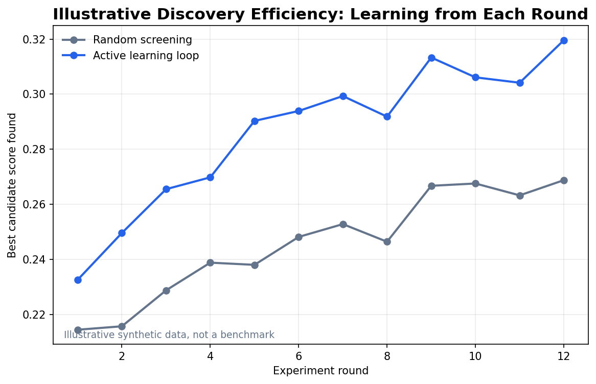

# Day 55: Research and Science

> **Core Question**: Why is AI for science different from ordinary LLM applications, and what did AlphaFold teach us about building systems that accelerate real discovery?

---

## Opening

Imagine a scientist in a large laboratory. One assistant reads papers, another runs simulations, another prepares samples, another keeps the lab notebook, and a senior researcher decides which experiment is worth tomorrow's scarce microscope time. A chatbot can imitate the first assistant for a few minutes. AI for science asks for the whole laboratory to become partially programmable.

That is why the field feels both exciting and easy to overstate. [AlphaFold](https://deepmind.google/technologies/alphafold/) changed structural biology because it attacked a real bottleneck: predicting protein structure from sequence. But even AlphaFold did not "finish biology." It moved one expensive step from wet-lab work into computation, which changed which experiments humans choose to run. The next wave extends that idea: models generate molecules, plan experiments, operate robotic labs, critique research ideas, and decide what to measure next.

This article gives the mental model. AI for science is not "LLMs writing papers." It is the design of feedback loops where data, models, domain constraints, and reality checks keep correcting each other.

---

## 1. What Makes Science Different from Normal Software Tasks?

#### Intuition: science is cooking with an expensive oven

If you are cooking at home, you can taste the soup every minute. If each taste costs $10,000 and a week of waiting, you become very careful about which spoonful to test. Many scientific fields look like that. A candidate molecule, material, catalyst, genome edit, or telescope observation can be generated cheaply on a computer, but verifying it in the real world is slow, noisy, and expensive.

That cost structure changes the job of AI. In customer support, a model mostly needs to answer correctly now. In science, the model often needs to choose the next measurement that will teach the most.


*Figure 1: AI for science spans prediction, generation, optimization, and agentic workflow control. The hard part is closing the loop with evidence.*

| Role | What it does | Typical failure |
|------|--------------|-----------------|
| Predictor | Estimate structure, property, risk, or outcome | Confident extrapolation outside the training distribution |
| Generator | Propose molecules, proteins, hypotheses, or experiments | Produces novelty without feasibility |
| Optimizer | Select the next candidate under budget constraints | Overfits a proxy metric |
| Agent | Plans, codes, searches literature, writes reports, and remembers | Hallucinates citations or mistakes execution for evidence |

The table matters because these are not interchangeable product types. A protein structure model, a lab robot, a literature-review agent, and a benchmark for scientific judgment should not be ranked in one leaderboard. They touch different control surfaces in the discovery process.

Historically, AI for science also predates LLMs. Symbolic regression, Bayesian optimization, expert systems, and self-driving laboratories were all part of automated discovery. What changed after foundation models is breadth: one model family can now read methods sections, write code, inspect plots, call tools, and communicate results in natural language. That makes the workflow itself modelable.

---

## 2. AlphaFold: The Anchor Example

#### Intuition: from guessing a crumpled wire to reading its folding history

A protein sequence is like a long wire made from amino-acid beads. The scientific question is not just where each bead sits, but how the wire folds into a three-dimensional machine. Before AlphaFold, researchers combined physical simulation, evolutionary signals, templates from known structures, and expensive experiments. The breakthrough was not a magic lookup table; it was a way to let deep learning combine evolutionary history with geometric constraints.

[AlphaFold 2](https://www.nature.com/articles/s41586-021-03819-2), published in Nature on 15 July 2021, showed near-experimental accuracy for many protein structures in CASP14. Its practical impact came from the fact that structure is an upstream variable: once you can predict a plausible structure, you can prioritize mutations, binding sites, and follow-up experiments.

[AlphaFold 3](https://www.nature.com/articles/s41586-024-07487-w), published in 2024, broadened the target from single proteins to biomolecular interactions involving proteins, DNA, RNA, ligands, ions, and chemical modifications. The [AlphaFold Server](https://alphafoldserver.com/) and [AlphaFold Protein Structure Database](https://alphafold.ebi.ac.uk/) made the interface accessible to many researchers, while the model itself remained a reminder that scientific AI often sits between open science, safety, and commercial drug discovery.


*Figure 2: AlphaFold moved the field from single-structure prediction toward interaction modeling and downstream discovery loops.*

The deeper lesson is transfer of bottleneck. AlphaFold did not remove the need for biologists. It changed their queue. Instead of spending months asking "what might this fold be?", a team can ask "which predicted mechanism is worth validating?" That is the pattern to watch across AI for science: models compress one stage of uncertainty, then the bottleneck moves to experimental validation, data quality, or causal interpretation.

---

## 3. The Core Loop: Generate, Predict, Select, Test, Learn

#### Intuition: a detective who buys clues carefully

A detective can interview everyone in town, but time is limited. A good detective asks the next question that will eliminate the most uncertainty. Closed-loop scientific discovery works similarly. The system proposes candidates, predicts outcomes, chooses the next experiment, observes results, and updates its model.


*Figure 3: The active-learning loop turns experimental results into better next choices instead of treating each experiment as an isolated guess.*

One common mathematical abstraction is active learning or Bayesian optimization. At each round, choose the next candidate that maximizes an acquisition function:

$$
\begin{aligned}
x_{\text{next}} &= \arg\max_x a(x) \\
a(x) &= \text{predicted value}(x) + \lambda \cdot \text{uncertainty}(x) - \gamma \cdot \text{cost}(x)
\end{aligned}
$$

The exact acquisition function varies by field, but the idea is stable. A candidate is attractive when it looks valuable, teaches something uncertain, and is feasible to test. This formula materially belongs here because it explains why scientific AI cannot be judged only by "best predicted score." A system that always chooses the predicted best candidate may get stuck exploiting a biased model. A system that explores uncertainty without cost discipline may waste the lab.

The control-flow diagram above is as important as the equation. Without the loop, the formula is just a ranking rule. With the loop, every failed experiment becomes information.

---

## 4. Different Scientific Domains Need Different AI Shapes

#### Intuition: same toolbox, different kitchen

A chef's knife, thermometer, and oven are useful in many kitchens, but baking bread and making sushi still require different constraints. AI for science has the same issue. Biology, chemistry, materials science, climate, astronomy, and mathematics all use models, but the verification channel differs.

| Domain | AI helps with | Reality check |
|--------|---------------|---------------|
| Biology | Structure, interaction, phenotype, perturbation design | Wet-lab assays, clinical data, replication |
| Chemistry | Retrosynthesis, binding, reaction optimization | Yield, selectivity, toxicity, manufacturability |
| Materials | Candidate structures, phase stability, property prediction | Synthesis, characterization, device performance |
| Physics and astronomy | Simulation surrogates, anomaly detection, equation discovery | Instruments, simulations, statistical significance |

This is why "AI scientist" is a family name, not one system. A computational ML research agent can run experiments entirely in code. A drug-discovery agent must confront biological assays. A quantum-materials agent needs instruments. A math agent needs proof verification. The architecture has to match the verification channel.


*Figure 4: Recent frontier work operates at different layers: foundation models, research agents, experiment stacks, and governance.*

The practical design question is: where is the closed loop? If the loop ends in a Python benchmark, the agent needs strong coding, evaluation, and reproducibility. If it ends in a wet lab, the agent needs protocol grounding, sample tracking, safety constraints, and uncertainty-aware experiment selection.

---

## 5. Frontier Updates from 2026

#### Intuition: the field is moving from smart notebooks to junior lab partners

The last six months show a clear shift. Researchers are no longer only asking whether AI can predict a property. They are asking whether AI can manage parts of the scientific method.

| Date | Item | What it contributes |
|------|------|---------------------|
| 25 Mar 2026 | [The AI Scientist](https://www.nature.com/articles/s41586-026-10265-5) in Nature | End-to-end ML research pipeline: idea generation, coding, experiments, paper writing, and automated review |
| 8 Feb 2026 | [TerraBind](https://arxiv.org/abs/2602.07735) | Protein-ligand binding and affinity prediction with faster coarse structural representations and uncertainty-aware selection |
| 6 May 2026 | [Experiment-as-Code Labs](https://arxiv.org/abs/2605.04375) | A declarative stack for connecting AI agents to programmable scientific instruments |
| 9 May 2026 | [Agentic AI Scientists Are Not Built For Autonomous Scientific Discovery](https://arxiv.org/abs/2605.08956) | A position paper arguing that current agents lack tacit lab knowledge, diversity, and physical feedback loops |
| 18 May 2026 | [Qumus](https://arxiv.org/abs/2605.18407) | An embodied AI experimentalist for quantum materials with robotic measurement and iterative learning |
| 28 May 2026 | [SoundnessBench](https://arxiv.org/abs/2605.30329) | A benchmark for whether models can tell methodologically sound research ideas from weak ones |

Two frontier items are especially important. First, The AI Scientist shows that a computational research workflow can be automated far enough to pass a workshop-level peer-review process, but its own paper emphasizes limitations: weak ideas, implementation mistakes, hallucinated citations, and ethical risks. Second, SoundnessBench directly attacks the evaluation gap: if an AI research agent cannot reliably reject unsound ideas, it may accelerate noise rather than discovery.

The strongest near-term systems will likely be co-scientists, not autonomous Nobel machines. They will draft hypotheses, search literature, write code, propose protocols, and maintain experiment logs, while humans keep responsibility for problem choice, safety, interpretation, and high-stakes validation.

---

## 6. A Minimal Active-Learning Example

#### Intuition: test the most informative candidates, not the prettiest guesses

The toy code below simulates candidate selection. Each candidate has a predicted value, uncertainty, and cost. The acquisition rule balances exploitation, exploration, and budget.

```python
import numpy as np

rng = np.random.default_rng(7)

# Imagine 20 candidate molecules or materials.
predicted_value = rng.normal(loc=0.5, scale=0.15, size=20)
uncertainty = rng.uniform(0.02, 0.30, size=20)
cost = rng.uniform(0.1, 1.0, size=20)

exploration_weight = 0.8
cost_penalty = 0.25

acquisition = (
    predicted_value
    + exploration_weight * uncertainty
    - cost_penalty * cost
)

chosen = np.argsort(acquisition)[-5:][::-1]

for rank, idx in enumerate(chosen, start=1):
    print(
        f"#{rank}: candidate={idx:02d} "
        f"value={predicted_value[idx]:.3f} "
        f"uncertainty={uncertainty[idx]:.3f} "
        f"cost={cost[idx]:.3f} "
        f"acquisition={acquisition[idx]:.3f}"
    )
```

In a real system, the predicted value might come from a graph neural network, diffusion model, protein language model, or physics simulator. Uncertainty might come from ensembles, Bayesian models, conformal prediction, or disagreement across tools. Cost might include reagent price, instrument time, toxicity risk, synthesis difficulty, or opportunity cost.


*Figure 5: An illustrative curve showing why closed-loop selection can find better candidates with fewer experimental rounds. This is synthetic teaching data, not a benchmark.*

The lesson is not that this simple formula solves drug discovery. The lesson is that scientific AI should be evaluated by how it spends scarce evidence.

---

## 7. Common Misconceptions

### Misconception 1: "AlphaFold solved biology."

AlphaFold solved a major structure-prediction bottleneck for many cases. Biology still requires dynamics, cell context, disease mechanisms, perturbation effects, toxicity, causality, and experimental validation. Structure is a powerful clue, not the whole investigation.

### Misconception 2: "An AI scientist is just an LLM with tools."

Tools are necessary but not sufficient. Scientific agents need provenance, reproducibility, uncertainty estimates, safety constraints, access to domain data, and a feedback loop from the world. A tool-calling demo can look impressive while still being scientifically brittle.

### Misconception 3: "The best model is the one with the highest benchmark score."

Science often cares about the best next experiment, not the best static prediction. A calibrated, uncertainty-aware model can be more useful than a higher-scoring model that is overconfident outside its training distribution.

### Misconception 4: "Autonomy is always the goal."

In high-stakes science, autonomy without accountability is dangerous. The more a system can act on the world, the more it needs human oversight, audit trails, preregistration, and containment. Human-AI collaboration is not a temporary weakness; it is often the right design.

---

## 8. Further Reading

### Beginner

1. [AlphaFold overview](https://deepmind.google/technologies/alphafold/) — Google DeepMind's product and research overview.
2. [AlphaFold Protein Structure Database](https://alphafold.ebi.ac.uk/) — Public access to predicted protein structures.
3. [Stanford AI Index 2026: Science](https://hai.stanford.edu/ai-index/2026-ai-index-report/science) — Broad data-driven view of AI's role in science.

### Advanced

1. [Accurate structure prediction of biomolecular interactions with AlphaFold 3](https://www.nature.com/articles/s41586-024-07487-w) — The AlphaFold 3 Nature paper.
2. [Towards end-to-end automation of AI research](https://www.nature.com/articles/s41586-026-10265-5) — The AI Scientist Nature paper.
3. [Experiment-as-Code Labs](https://arxiv.org/abs/2605.04375) — A systems view of AI-driven scientific labs.

### Papers

1. [Highly accurate protein structure prediction with AlphaFold](https://www.nature.com/articles/s41586-021-03819-2)
2. [TerraBind: Fast and Accurate Binding Affinity Prediction through Coarse Structural Representations](https://arxiv.org/abs/2602.07735)
3. [Qumus: Realization of An Embodied AI Quantum Material Experimentalist](https://arxiv.org/abs/2605.18407)
4. [SoundnessBench: Can Your AI Scientist Really Tell Good Research Ideas from Bad Ones?](https://arxiv.org/abs/2605.30329)
5. [Agentic AI Scientists Are Not Built For Autonomous Scientific Discovery](https://arxiv.org/abs/2605.08956)

---

## Reflection Questions

1. If experiments are expensive, when should an AI system choose uncertainty over predicted value?
2. Which parts of your field have a clean feedback loop, and which parts depend on tacit human judgment?
3. How would you audit an AI research agent so that failed experiments remain useful evidence instead of disappearing into logs?

---

## Summary

| Concept | One-line Explanation |
|---------|----------------------|
| AI for Science | AI systems that accelerate discovery by modeling data, hypotheses, experiments, and feedback loops |
| AlphaFold | A landmark structure-prediction system that shifted a major biology bottleneck into computation |
| Closed-loop discovery | Generate candidates, predict outcomes, select experiments, test, and update the model |
| Active learning | Choosing the next experiment for information value, not just predicted success |
| AI scientist | An agentic system that automates parts of the scientific workflow, but still needs verification and governance |

**Key Takeaway**: AI for science becomes powerful when it respects science's central constraint: reality is the judge, and reality is expensive to query. The best systems are not just fluent or high-scoring; they help researchers spend scarce evidence wisely.

---

*Day 55 of 60 | LLM Fundamentals*  
*Word count: ~2,350 | Reading time: ~17 minutes*
