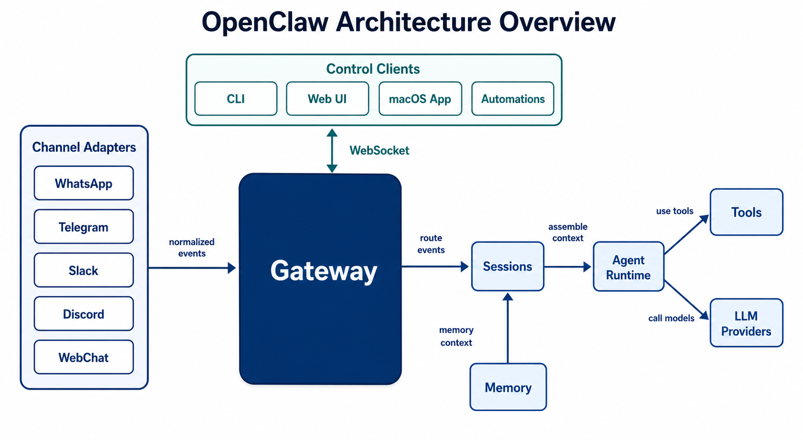
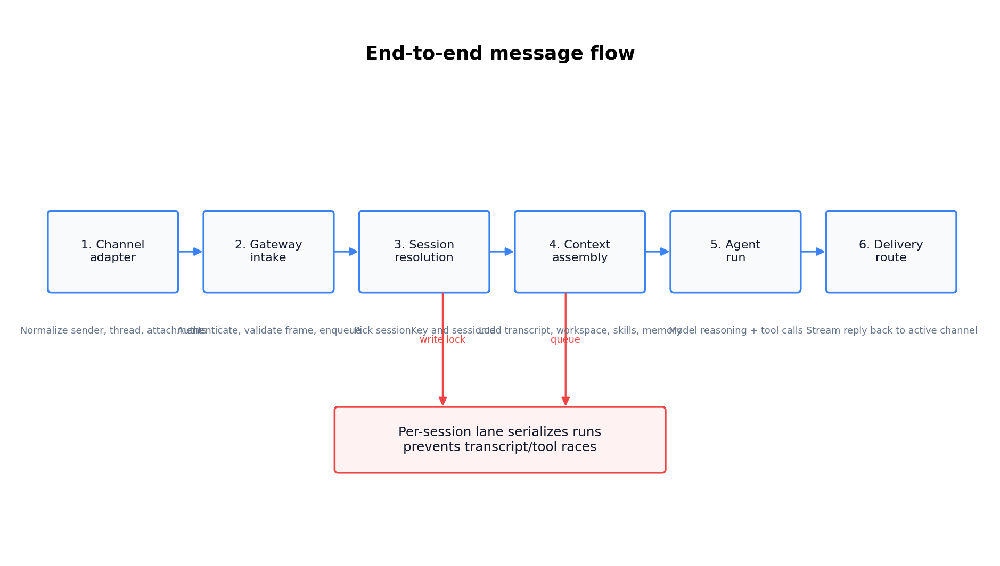
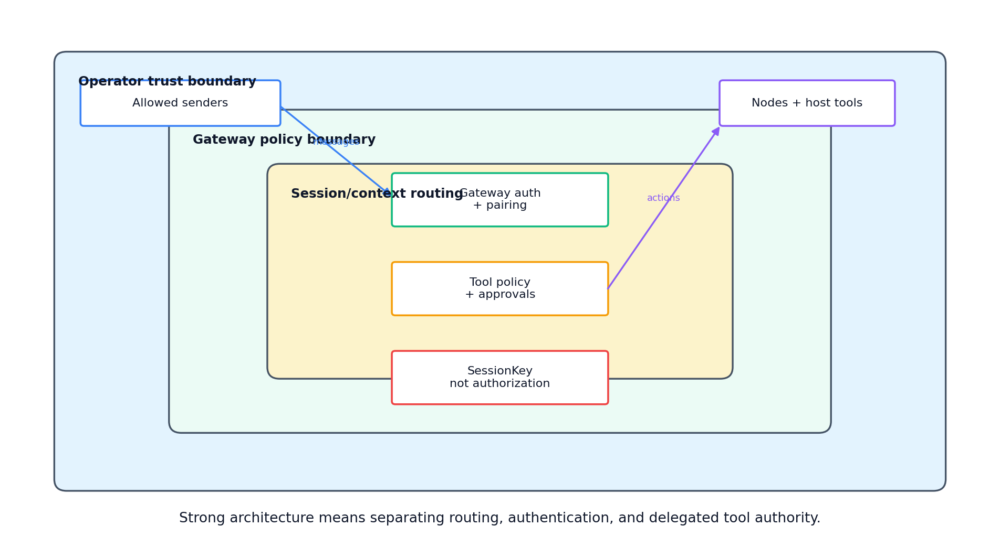
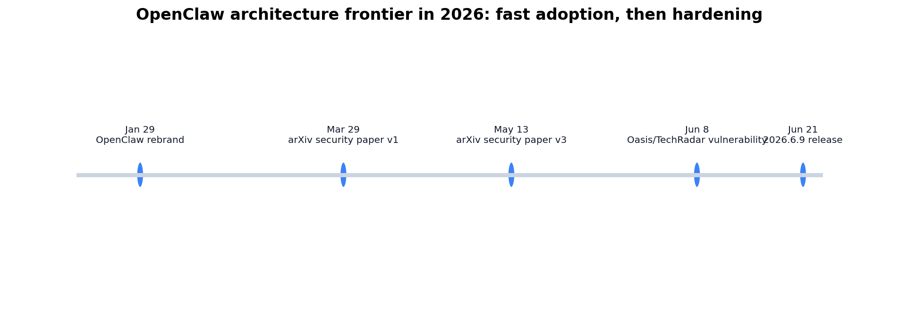

# Day 56: OpenClaw Architecture Overview

> **Core Question**: Why does OpenClaw center everything on a Gateway, and how do channels and sessions turn everyday chat messages into controlled agent actions?

---

## Opening

Most LLM tools begin as a chat box. OpenClaw begins as a switchboard.

Imagine a small hotel at night. Guests call from different rooms, the front desk knows who is calling, which room they belong to, whether the request is urgent, and which staff member can safely handle it. If a guest asks for extra towels, the front desk routes the request to housekeeping. If someone asks to open a locked storage room, the front desk checks whether that person is allowed to ask. The important part is not the phone itself. The important part is the routing desk that remembers context, applies policy, and sends the right work to the right place.

OpenClaw uses the same idea for AI agents. A message may arrive from WhatsApp, Telegram, Slack, Discord, WebChat, the CLI, a cron job, or a mobile node. The system should not create a different "brain" for every surface. It should normalize the event, decide which conversation it belongs to, assemble the right context, run an agent loop, and send the reply back through the active delivery route. That is why the architecture is built around three ideas: **Gateway**, **Channel**, and **Session**.

This article is not a product tutorial. It is a systems lesson: OpenClaw is a concrete example of a broader pattern in modern agent infrastructure, where the hard problem is no longer only "call an LLM." The hard problem is controlling identity, memory, tools, delivery, and trust across many interfaces.

---

## 1. The Big Picture: One Gateway, Many Surfaces

#### Intuition: Airport Control Tower

Think of the Gateway as an airport control tower. Planes arrive from many directions, but they do not each negotiate separately with the runway, fuel truck, and baggage system. The tower receives signals, assigns lanes, prevents collisions, and keeps a shared picture of the airport. In OpenClaw, channels are the planes, sessions are the assigned routes, and tools are the ground operations that can touch the real world.


*Figure 1: The Gateway sits between channel adapters, control clients, sessions, tools, memory, and model providers. The point is central coordination, not a bigger chat UI.*

According to the [official OpenClaw overview](https://docs.openclaw.ai/), OpenClaw is a self-hosted gateway that connects chat apps and channel surfaces to AI coding agents. The [Gateway architecture documentation](https://docs.openclaw.ai/concepts/architecture) describes a single long-lived Gateway that owns messaging surfaces, exposes a WebSocket API, and serves as the source of truth for sessions, routing, and channel connections.

That "single long-lived Gateway" design is the first major architectural choice. It gives the system one place to answer questions such as:

| Question | Gateway responsibility | Why it matters |
|---|---|---|
| Who sent this? | Authenticate clients, pair nodes, validate channel identity | Prevents random inputs from becoming trusted actions |
| Where should it go? | Resolve channel events into session keys | Keeps context attached to the right conversation |
| What can it do? | Apply tool policy, approvals, and runtime configuration | Limits the damage of mistaken or hostile instructions |
| How should output return? | Track delivery route and stream response events | Lets one task move across interfaces without losing state |

The table matters because people often describe agent systems as "LLM plus tools." That is too small. A useful personal agent is closer to "LLM plus tools plus routing plus memory plus delivery plus policy." OpenClaw puts those responsibilities behind one Gateway so every surface speaks through the same control plane.

### 1.1 What the Gateway Owns

The Gateway is not merely a reverse proxy. It owns several categories of work:

1. **Connection management**: channel adapters, Control UI, CLI, automations, and nodes connect through the Gateway, typically over WebSocket for control-plane clients.
2. **Protocol validation**: inbound frames are checked against typed schemas before becoming system events.
3. **Event emission**: clients subscribe to events such as health, presence, chat, agent lifecycle, stream updates, and cron-related events.
4. **Session routing**: each inbound message is mapped to a session, not just to a model call.
5. **Agent execution**: the Gateway accepts an agent run, queues it, streams output, and persists state.
6. **Trust policy**: authentication, device pairing, allowlists, tool policy, and security audit checks are coordinated around the Gateway.

This centralization has a trade-off. It simplifies operational reasoning because there is one authority per host. It also means the Gateway becomes a valuable security boundary. If you expose it carelessly, you have exposed the system that can route messages, inspect sessions, and delegate tool use. That is why OpenClaw's [security documentation](https://docs.openclaw.ai/gateway/security) repeatedly frames the Gateway as a personal-assistant trust boundary, not a hostile multi-tenant isolation layer.

---

## 2. Channels: Normalize Messy Human Interfaces

#### Intuition: Translators at a Conference

Imagine an international conference where every attendee asks questions in a different language and format. One person speaks into a microphone, another writes on a card, another sends a message through an app. The speaker should not handle every format directly. Translators convert each question into a common structure before it reaches the stage.

Channels do that for OpenClaw. A Telegram message, a Slack thread, a WhatsApp DM, and a WebChat input all carry different metadata. The agent runtime should not care about each platform's native quirks. A channel adapter turns platform-specific input into a normalized event: sender, account, channel, thread or room, attachments, text, command markers, and delivery information.


*Figure 2: A message becomes an agent action through normalization, Gateway intake, session resolution, context assembly, agent execution, and reply delivery.*

OpenClaw's [channel docking documentation](https://docs.openclaw.ai/concepts/channel-docking) gives a useful example of why channels are more than input pipes. Docking lets a user keep the same session context while changing where future replies are delivered. A task can start on Telegram and continue on Discord without recreating the session. The session remains the same; only the delivery fields change.

That distinction is central:

| Layer | What changes | What should stay stable |
|---|---|---|
| Channel | Delivery surface, account, thread, formatting | The user's intent and message content |
| Session | Conversation identity, transcript, active route | The continuity of the task |
| Agent runtime | Model, tools, context, output stream | The system's policy and state invariants |

This is why comparing channels as if they were models would be a category mistake. Telegram, Slack, WebChat, and cron are different surfaces with different constraints. The right question is not "which one is smarter?" The right question is "what metadata and delivery behavior does this surface need so the Gateway can route it safely?"

### 2.1 Channel Design Requirements

A channel adapter in an agent system must usually handle five jobs:

1. **Inbound parsing**: read native platform payloads and extract message text, sender identity, thread context, attachments, and command syntax.
2. **Authorization hints**: check allowlists, group mention rules, account bindings, and platform-specific identity data.
3. **Canonical routing fields**: produce stable fields that the Gateway can use to resolve sessions.
4. **Outbound rendering**: convert agent replies into the target platform's message format, including chunking, attachments, edits, and retries.
5. **Backpressure behavior**: decide how to treat rapid follow-ups, long-running jobs, and interruption commands.

These jobs are not glamorous, but they are the difference between a demo and a reliable agent. If a platform adapter loses thread identity, replies land in the wrong room. If it treats all DMs as the same sender, private context can leak. If it sends duplicate confirmations after a tool already messaged the user, the agent feels confused. Architecture is visible in the small failures.

---

## 3. Sessions: The Unit of Memory, Routing, and Concurrency

#### Intuition: A Case File

Think of a detective's case file. The file contains interviews, evidence, notes, and open tasks. A phone call, email, or in-person conversation can all add to the same case file, but only if the detective knows they belong together. If two unrelated cases share one folder, evidence leaks. If one case is split across five folders, the detective forgets what already happened.

OpenClaw sessions are those case files. The official [session management documentation](https://docs.openclaw.ai/concepts/session) says OpenClaw routes messages into sessions based on where they come from: direct messages, group chats, rooms, cron jobs, and webhooks. It also warns that if multiple people can message the agent, direct-message isolation should be enabled, because shared DMs can otherwise share conversation context.


*Figure 3: Session routing policy decides whether context is shared, isolated, reused, or reset. This is a product and safety decision, not just a storage detail.*

The default routing behavior can be summarized this way:

| Source | Typical session behavior | Main risk if wrong |
|---|---|---|
| Direct message | Shared by default for single-user continuity | Multi-user privacy leakage |
| Group chat | Isolated per group | Cross-group context confusion |
| Room or channel | Isolated per room | Replies appear in the wrong collaboration space |
| Cron job | Fresh session per run | Scheduled tasks inherit stale context |
| Webhook | Isolated per hook | External triggers pollute each other |

### 3.1 Why Session Keys Are Not Authorization

A session key selects context. It should not be treated as proof that a caller is allowed to do something.

This is a subtle but important architecture lesson. In many web apps, developers accidentally turn identifiers into security boundaries: "if you know this URL, you can access this data." Agent systems are even riskier because a session may contain credentials, tool outputs, files, browser state, and private messages. OpenClaw's security docs explicitly state that `sessionKey` is a routing or context selector, not a per-user authorization token.

The clean design is to keep three concepts separate:

| Concept | Purpose | Example failure when confused |
|---|---|---|
| Identity | Who is calling? | A website or stranger impersonates a trusted device |
| Authorization | What may this caller do? | A chat sender can trigger host-level tools |
| Session routing | Which context should this message use? | Alice's transcript is reused for Bob |

When these are separated, the architecture becomes easier to reason about. A session can be docked to another channel without granting a new person access. A user can be authorized to chat without being authorized to run shell commands. A node can be paired for device actions without making every channel sender a trusted operator.

### 3.2 Concurrency: One Lane Per Case File

#### Intuition: One Cook at One Cutting Board

If two cooks chop vegetables on the same small cutting board at the same time, the problem is not just mess. They may overwrite each other's work, mix ingredients, or misunderstand which dish is being prepared. A session transcript is similar. If two agent runs write to the same session at once, tool results and assistant replies can interleave in confusing ways.

OpenClaw's [agent loop documentation](https://docs.openclaw.ai/concepts/agent-loop) describes serialized runs per session key and session write locks to keep session history consistent. This is a classic systems pattern: protect the unit of shared mutable state.

A useful simplified formula is:

$$
\begin{aligned}
\text{expected wait} &\approx \frac{\text{queued work for this session}}{\text{completion rate of this session lane}} \\
\text{collision risk} &\uparrow \quad \text{when independent runs write the same transcript concurrently}
\end{aligned}
$$

The formula is not meant to predict exact latency. It gives the intuition: if one session is the shared state boundary, then long-running tasks in that session can delay later work, but serialization prevents worse failures such as conflicting tool calls and corrupted transcript order. For agent infrastructure, consistency often beats raw parallelism.

---

## 4. The Agent Loop: From Message to Action

#### Intuition: Restaurant Order Ticket

In a restaurant, the waiter does not simply yell "make food" into the kitchen. The order becomes a ticket: table number, dish, modifications, timing, and delivery destination. The kitchen prepares the food, the waiter tracks progress, and the final plate goes back to the right table.

OpenClaw's agent loop does the same for a message. The Gateway accepts a request, resolves the session, returns an accepted run identifier, prepares context, runs the model and tools, streams partial output, and records the result. The loop described in the official docs includes context assembly, model inference, tool execution, streaming replies, and persistence.

The important part is the separation between **accepting** work and **finishing** work. A long-running agent may browse, write files, call tools, ask for approval, or wait for a model response. The Gateway must be able to say "your request has been accepted" before the final answer exists. That is why lifecycle events matter.

Typical event streams include:

| Stream | What it represents | Why readers should care |
|---|---|---|
| lifecycle | Start, end, error, timeout | Lets clients show reliable status |
| assistant | Text or reasoning deltas | Enables streaming replies |
| tool | Tool start, update, result | Makes actions observable |
| chat final | Rendered final message | Keeps channel delivery predictable |

This structure is one reason an agent platform feels different from a simple chatbot API wrapper. A chatbot can return one answer. An agent must expose progress, tool activity, cancellation, timeout, and partial delivery. The architecture must make those states first-class.

### 4.1 Context Assembly

Before the model sees the prompt, the runtime assembles several layers:

1. Base system prompt and runtime rules.
2. Workspace instructions such as `AGENTS.md`, `SOUL.md`, and local tool notes.
3. Loaded skills and tool descriptions.
4. Recent session transcript.
5. Retrieved memory or contextual documents.
6. Per-run overrides such as model choice, verbosity, or thinking settings.

This is why OpenClaw is better understood as a **context operating layer** than as a chat client. The model is important, but the user experience depends heavily on what context reaches the model and what actions the runtime exposes afterward.

---

## 5. Trust Boundaries: The Architecture Is the Security Model

#### Intuition: House Keys, Room Keys, and Sticky Notes

A sticky note saying "use the guest room" is not a house key. A room key is not permission to open the safe. A house key is not permission to wire money. In agent systems, session keys, gateway auth, node pairing, tool approvals, and prompt instructions are often confused in the same way.


*Figure 4: Routing, authentication, and delegated tool authority should be separate layers. Treating a routing key as an authorization boundary is a common design mistake.*

OpenClaw's security documentation is refreshingly direct: the system assumes a personal-assistant deployment with one trusted operator boundary per Gateway. It is not designed as a hostile multi-tenant boundary where mutually adversarial users safely share one powerful agent and host. For mixed-trust teams, the docs recommend splitting trust boundaries with separate gateways, credentials, OS users, or hosts.

That is not a weakness unique to OpenClaw. It is a general rule for tool-using agents. Once an agent can execute commands, read files, control a browser, or send messages, the security question changes from "can it answer correctly?" to "who is allowed to cause this action, on which machine, with which credentials, under what audit trail?"

### 5.1 Frontier Update: 2026 Made Agent Security Concrete


*Figure 5: The 2026 OpenClaw story moved quickly from adoption to architecture hardening and security analysis.*

Two recent items from the last six months matter for this architecture lesson:

1. **March 29, 2026 / May 13, 2026**: The arXiv paper ["A Security Analysis of the OpenClaw AI Agent Framework"](https://arxiv.org/abs/2603.27517) was submitted on March 29 and revised on May 13. It frames OpenClaw as an agent framework connecting LLM reasoning to execution surfaces such as shell, filesystem, containers, browser automation, and messaging. The paper organizes the system around interacting layers including channels, Gateway, plugins and skills, agent runtime, memory, LLM provider, and local execution. Its main lesson is architectural: vulnerabilities can compose across layers when policy boundaries are local rather than unified.
2. **June 8, 2026**: A [TechRadar Pro article by Elad Luz of Oasis Security](https://www.techradar.com/pro/what-the-openclaw-vulnerability-reveals-about-the-future-of-agentic-ai-security) argued that AI agents are operational actors, not simple productivity tools. It described a local WebSocket Gateway attack scenario and noted that OpenClaw maintainers issued a fix within 24 hours. Whether you use OpenClaw or another agent framework, the lesson is the same: a local agent with credentials and host tools must be governed like an identity with operational authority.

Also note the public project cadence. The [OpenClaw GitHub repository](https://github.com/openclaw/openclaw) showed a latest release tagged `2026.6.9` on June 21, 2026 at the time of research, reflecting how quickly the project is moving. Fast-moving agent infrastructure demands frequent patching, explicit threat modeling, and conservative defaults.

---

## 6. What This Architecture Teaches Beyond OpenClaw

#### Intuition: City Infrastructure, Not a Single App

A city does not run on one road. It needs roads, traffic lights, addresses, emergency rules, maintenance crews, and identity documents. A personal agent platform is similar. The model is only one engine inside a larger civic system.

OpenClaw highlights five architecture principles that apply to many agent frameworks:

| Principle | OpenClaw example | General lesson |
|---|---|---|
| Centralize control-plane authority | One Gateway owns routing and sessions | Avoid scattered policy decisions across adapters |
| Normalize surfaces early | Channels convert native messages to common events | Keep model/runtime code independent of platform quirks |
| Treat sessions as state boundaries | Session store, transcripts, reset policy, write locks | Protect memory and concurrency at the right granularity |
| Separate routing from authorization | `sessionKey` is not an auth token | Do not confuse identifiers with permission |
| Make actions observable | Lifecycle, assistant, tool, and final streams | Agents need auditability, not just answers |

These principles also help compare OpenClaw with other systems without mixing product types. Claude Code, OpenAI Codex, and similar coding agents focus heavily on code execution within development workspaces. Google ADK and LangGraph-style systems emphasize application-level agent construction and orchestration. OpenClaw emphasizes a self-hosted, multi-channel personal assistant Gateway. These are overlapping but not identical product forms. The fair comparison is by domain and control surface, not by asking which is universally "best."

---

## 7. A Minimal Routing Model in Code

The code below is not OpenClaw's implementation. It is a small runnable sketch that captures the key idea: normalize channel events, resolve a session, serialize work per session, and keep delivery separate from context.

```python
from dataclasses import dataclass
from collections import defaultdict, deque
from typing import Deque, Dict, Optional


@dataclass(frozen=True)
class ChannelEvent:
    channel: str
    account_id: str
    sender_id: str
    room_id: Optional[str]
    text: str


@dataclass
class Session:
    session_id: str
    transcript: list[str]
    last_channel: str
    last_to: str


class MiniGateway:
    def __init__(self, dm_scope: str = "per-channel-peer"):
        self.dm_scope = dm_scope
        self.sessions: Dict[str, Session] = {}
        self.lanes: Dict[str, Deque[ChannelEvent]] = defaultdict(deque)

    def session_key(self, event: ChannelEvent) -> str:
        if event.room_id:
            return f"room:{event.channel}:{event.account_id}:{event.room_id}"
        if self.dm_scope == "main":
            return "dm:main"
        return f"dm:{event.channel}:{event.account_id}:{event.sender_id}"

    def accept(self, event: ChannelEvent) -> str:
        key = self.session_key(event)
        session = self.sessions.setdefault(
            key,
            Session(
                session_id=key,
                transcript=[],
                last_channel=event.channel,
                last_to=event.sender_id,
            ),
        )
        session.last_channel = event.channel
        session.last_to = event.sender_id
        self.lanes[key].append(event)
        return key

    def run_next(self, key: str) -> Optional[str]:
        if not self.lanes[key]:
            return None
        event = self.lanes[key].popleft()
        session = self.sessions[key]
        session.transcript.append(f"user({event.sender_id}): {event.text}")

        # A real system would assemble context, call the model, run tools,
        # stream events, and persist tool results. This sketch only records
        # the state boundary and delivery route.
        reply = f"assistant -> {session.last_channel}/{session.last_to}: acknowledged"
        session.transcript.append(reply)
        return reply


gateway = MiniGateway()
event = ChannelEvent("telegram", "default", "alice", None, "summarize my notes")
key = gateway.accept(event)
print(key)
print(gateway.run_next(key))
```

The most important line is not the fake reply. It is the `session_key` function. That one decision defines context sharing, privacy, concurrency, and delivery behavior. In a real agent system, routing policy is product design, security design, and data architecture all at once.

---

## 8. Common Misconceptions

### Misconception 1: "The Gateway is just a network proxy."

No. A proxy forwards traffic. The Gateway coordinates identity, sessions, events, agent runs, tools, nodes, and delivery. It is closer to a control plane than a dumb pipe.

### Misconception 2: "If sessions are isolated, the system is secure."

Session isolation protects context. It does not automatically protect host tools, credentials, browser state, or node actions. Security also needs authentication, authorization, least privilege, sandboxing, audit logs, and careful deployment boundaries.

### Misconception 3: "Multi-channel support is just convenience."

It is convenience, but not only convenience. Multi-channel support forces the architecture to separate message content, sender identity, session continuity, and delivery route. That separation is what makes docking, mobile use, cron triggers, and multi-agent routing possible.

### Misconception 4: "OpenClaw should be compared directly with every agent product."

Only with care. OpenClaw is a self-hosted Gateway for multi-channel personal agents. A code IDE agent, a cloud customer-service agent, an RL robot controller, and a workflow automation tool may all use LLMs, but they have different trust boundaries, latency needs, action spaces, and user interfaces.

---

## 9. Further Reading

### Official OpenClaw Docs

1. [OpenClaw overview](https://docs.openclaw.ai/) — the official starting point for the self-hosted Gateway model.
2. [Gateway architecture](https://docs.openclaw.ai/concepts/architecture) — Gateway, WebSocket protocol, clients, nodes, and invariants.
3. [Session management](https://docs.openclaw.ai/concepts/session) — routing behavior, DM isolation, lifecycle, and storage.
4. [Agent loop](https://docs.openclaw.ai/concepts/agent-loop) — how accepted agent runs become streamed model/tool events.
5. [Security](https://docs.openclaw.ai/gateway/security) — trust boundaries, audit checks, and deployment guidance.

### Recent Frontier Items

1. [A Security Analysis of the OpenClaw AI Agent Framework](https://arxiv.org/abs/2603.27517) — arXiv paper submitted March 29, 2026 and revised May 13, 2026.
2. [What the OpenClaw vulnerability reveals about the future of agentic AI security](https://www.techradar.com/pro/what-the-openclaw-vulnerability-reveals-about-the-future-of-agentic-ai-security) — June 8, 2026 TechRadar Pro analysis by Elad Luz.
3. [OpenClaw GitHub repository](https://github.com/openclaw/openclaw) — public source, releases, and development cadence.

---

## Reflection Questions

1. If you were deploying a personal agent for two family members, would you use one Gateway, two agents, two gateways, or two OS users? What trust boundary are you assuming?
2. Which is more dangerous in a tool-using agent: wrong model output, wrong session routing, or over-broad tool authority? Why?
3. How would you design a channel adapter so that a Slack thread, a Telegram DM, and a cron job can all use the same agent runtime without leaking context?

---

## Summary

| Concept | One-line Explanation |
|---|---|
| Gateway | The long-lived control plane that owns routing, sessions, connections, and agent run coordination |
| Channel | A platform adapter that normalizes messy human interfaces into common events and delivery routes |
| Session | The state boundary for transcript, context, routing, lifecycle, and concurrency |
| Agent loop | The execution path from accepted message to context assembly, model/tool work, streaming, and persistence |
| Trust boundary | The separation between identity, authorization, routing, and delegated tool authority |

**Key Takeaway**: OpenClaw's architecture is interesting because it treats agents as always-available operational systems, not isolated chat completions. The Gateway gives the system one control plane; channels translate the outside world into normalized events; sessions preserve context and concurrency; and trust boundaries decide who may cause real actions. If you understand those four pieces, you understand the core architecture pattern behind many practical agent platforms.

---

*Day 56 of 60 | LLM Fundamentals*  
*Word count: ~3,900 | Reading time: ~18 minutes*
