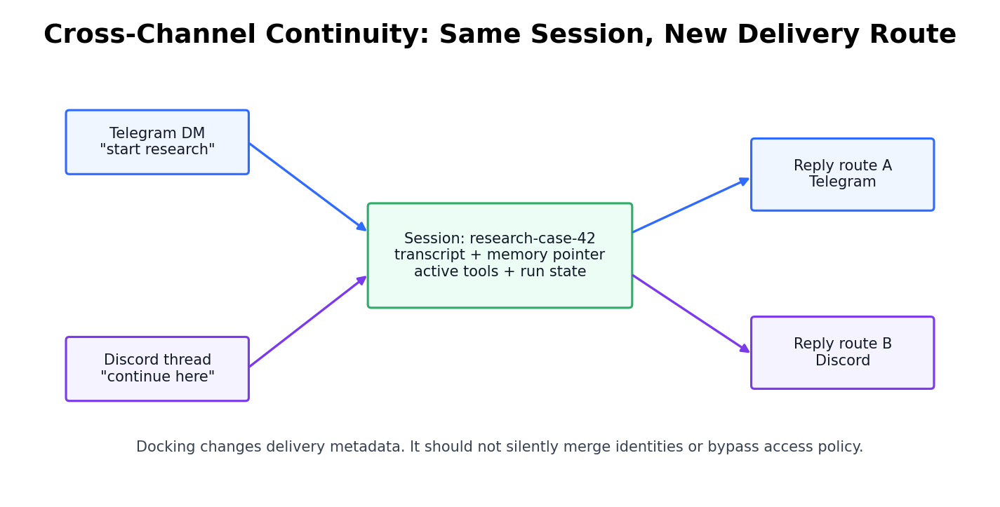

# Day 57: Message Routing and Multi-Channel

> **Core Question**: How does a personal AI agent safely receive messages from Telegram, Discord, Signal, and other channels without turning every app into a separate assistant?

---

## Opening

Most people first notice multi-channel agents as a convenience feature: "I can message the same assistant from Telegram, Discord, Signal, Slack, or WebChat." That sounds like a UI trick. It is not. The hard part is not sending text to many apps. The hard part is deciding **who** sent the message, **which conversation** it belongs to, **what permissions** apply, **where the answer should return**, and **whether this message should interrupt, join, or wait behind an existing run**.

Imagine a hospital reception desk. Patients may arrive by phone, web form, ambulance radio, or in person. The hospital should not create a separate medical record just because a patient used a different door. It also must not merge two patients because their requests sound similar. The reception desk turns messy arrivals into structured records, checks identity, sends each case to the right department, and keeps a safe audit trail.

Multi-channel agent routing is that reception desk for LLM systems. The model is only one worker inside the hospital. The routing layer decides whether the worker sees the right case file, whether the caller is allowed to ask, and whether the final response goes back to the right room.

---

## 1. What Multi-Channel Routing Is Actually Solving

#### Intuition: Many Doors, One Building Map

Think of Telegram, Discord, Signal, Slack, and WebChat as different doors into the same building. A visitor's door matters because each entrance has different locks, cameras, and signage. But once the visitor is inside, the building should use one map: rooms, staff, permissions, and case files. Multi-channel routing is the system that converts door-specific signals into one internal map.


*Figure 1: Channel adapters translate platform-specific events into a canonical event before the Gateway resolves sessions and starts an agent run.*

The [OpenClaw repository](https://github.com/openclaw/openclaw) describes OpenClaw as a personal assistant that answers on many channels, including WhatsApp, Telegram, Slack, Discord, Signal, iMessage, Matrix, Microsoft Teams, WebChat, and more. Its [channel configuration docs](https://docs.openclaw.ai/gateway/config-channels) expose the real system-design problem: channels need direct-message policies, group policies, allowlists, mention gating, per-channel keys, and multi-account routing.

That means a channel adapter is not a thin webhook. It has at least five jobs:

| Job | What it handles | Failure if ignored |
|---|---|---|
| Parse | Native payload, text, attachments, sender, room, thread | The agent loses context or misses files |
| Authenticate | Bot token, platform identity, pairing status | Unknown users can talk to the agent |
| Normalize | Convert app-specific fields into canonical fields | Runtime code becomes full of platform branches |
| Render | Chunk, edit, quote, attach, and retry replies | Output looks broken or arrives twice |
| Backpressure | Rate limits, follow-ups, cancellation, long jobs | Users can flood or race the agent |

The design goal is simple to say but hard to implement: after normalization, the agent runtime should not care whether the message came from Telegram or Discord. It should receive a canonical event with text, sender identity, room or thread identity, attachments, and a reply route.

### 1.1 Why "Just Add Another Bot" Does Not Scale

The naive design creates one bot per platform and lets each bot call the model directly. It works for demos. It fails once the assistant needs memory, tools, approvals, or long-running tasks.

| Design | Best for | Breaks when |
|---|---|---|
| One independent bot per app | Toy demos, narrow customer support bots | The same user moves across apps |
| Shared model API, separate app logic | Small production chatbot | Permissions and memory diverge |
| Unified gateway plus channel adapters | Personal agents, multi-surface agents, tool-using systems | Gateway becomes a critical trust boundary |

The last row is the pattern used by systems like [OpenClaw](https://openclaw.ai/): a Gateway sits between channels and the agent runtime. The Gateway is not "smarter" than Telegram or Discord. It is the place where routing, policy, state, and delivery become consistent.

---

## 2. The Router: A Decision Tree, Not a Pipe

#### Intuition: Security Desk Before Elevator

Imagine an office building. A visitor cannot simply walk from the front door into any meeting room. The security desk checks identity, confirms the appointment, prints a visitor badge, and sends the person to the right floor. The elevator is the transport mechanism, but the security desk is the policy mechanism.

An agent router works the same way. It is tempting to describe routing as "message in, agent out." In a real system, routing is a decision tree:


*Figure 2: Identity, authorization, session selection, and execution queueing are separate decisions. Combining them creates privacy and reliability bugs.*

The router should answer four questions in order:

| Question | Routing layer answer | Why it must be separate |
|---|---|---|
| Who sent this? | Platform sender, account binding, pairing result | Identity is not the same as conversation state |
| Is it allowed? | DM policy, group allowlist, mention gate, tool policy | Authorization changes by channel and action |
| Which session? | Stable session key from channel, sender, room, thread, or explicit docking | Memory must not leak across cases |
| How should it run? | Queue, interrupt, resume, fork, or reject | Concurrency changes correctness |

This separation matters because a session key is not authorization. A session key selects context. It should not prove that the sender is allowed to use that context. If an attacker can guess or inject a session key, the system should still require identity and policy checks before revealing memory or running tools.

### 2.1 A Useful Routing Formula

Routing is often implemented with rules and schemas, not deep math. But one compact formula helps make the design precise:

$$
\begin{aligned}
E &= N(P_c) \\
R &= f(E.\text{channel}, E.\text{account}, E.\text{sender}, E.\text{room}, E.\text{thread}, E.\text{intent}) \\
S &= g(R, A(E), Q_R)
\end{aligned}
$$

Where:

- **P_c** is the native platform payload from channel **c**.
- **N** is the normalization function that creates a canonical event **E**.
- **R** is the routing decision: session key, delivery route, and candidate agent.
- **A(E)** is the authorization result for the event.
- **Q_R** is the current queue state for that route or session.
- **S** is the scheduling decision: run now, queue, interrupt, ask for approval, or reject.

The important lesson is that routing is not a pure string-matching problem. It combines platform metadata, user identity, session policy, and runtime state.

### 2.2 Idempotency: The Quiet Reliability Requirement

#### Intuition: Restaurant Order Numbers

If a restaurant payment terminal retries after bad Wi-Fi, the kitchen should not cook the same order twice. It needs an order number. Multi-channel agents need the same idea because messaging platforms retry webhooks, users double-send messages, and long-running jobs may reconnect after a network break.

A robust router attaches an idempotency key to inbound events. A simple key might combine channel, account, native message id, and edited timestamp. The system can then say: "I have already accepted this event; do not start a second agent run."

Without idempotency, a tool-using agent can accidentally send two emails, create two calendar events, or run the same shell command twice. That is why routing belongs near policy and action control, not in a casual UI wrapper.

---

## 3. Sessions: The Unit of Continuity

#### Intuition: Same Case File, Different Phone

A lawyer may discuss one case by phone in the morning, email in the afternoon, and a secure portal at night. The medium changes, but the case file should remain one coherent record. At the same time, two clients must never share one file just because they both ask about "the contract."

Sessions are the case files of agent systems. They hold transcript, memory pointers, active runs, tool results, and often the current delivery route. Multi-channel support becomes powerful only when a session can move across channels without collapsing identity boundaries.


*Figure 3: A session can preserve task continuity while the delivery route changes. Docking must change reply metadata, not silently grant new authority.*

The key design distinction is:

| Layer | Stable across channels | Allowed to change |
|---|---|---|
| Identity | The verified human or approved account | Platform-specific sender id |
| Session | Transcript, task state, memory pointer | Active reply route |
| Channel | Platform formatting and delivery metadata | App, account, room, thread |
| Agent runtime | Tool policy and system instructions | Model choice or run settings, if permitted |

This is why comparing Telegram, Discord, and Signal as if they were competing "agent brains" is a category error. They are delivery surfaces. Their differences matter, but mostly because they shape metadata, identity, group behavior, attachment handling, and delivery guarantees.

### 3.1 Channel Differences That Matter

| Surface | Typical strength | Routing caution |
|---|---|---|
| Telegram | Bot APIs, groups, fast mobile workflows | Bot privacy settings and group mention rules can hide messages |
| Discord | Rich servers, channels, threads, developer communities | Server, channel, thread, and user identity must be separated |
| Signal | Private messaging expectations, phone-centric identity | Automation relies on account setup and careful sender approval |
| Slack / Teams | Enterprise workspace context | Workspace identity and channel membership affect authorization |
| WebChat / CLI | Controlled local or web surface | Must avoid treating localhost as automatically trusted |

This table deliberately compares surfaces only as surfaces. It does not rank them against [OpenAI Agents SDK](https://openai.github.io/openai-agents-python/handoffs/), [Google Agent Development Kit](https://docs.cloud.google.com/gemini-enterprise-agent-platform/build/adk), or [Model Context Protocol](https://modelcontextprotocol.io/docs/getting-started/intro), because those are different product types: agent frameworks, tool protocols, and app channels solve different layers of the stack.

---

## 4. Policy Layers: Routing Is Part of Security

#### Intuition: House Door, Room Door, Safe Door

Having a key to the front door does not mean you can open the medicine cabinet, the safe, or every bedroom. A multi-channel agent needs the same layered permissions. Being allowed to send a DM should not automatically mean being allowed to read files, run shell commands, send external messages, or dock a session into a group chat.


*Figure 4: The deeper the action goes, the larger the blast radius. Each layer should check only the authority it can actually validate.*

The OpenClaw docs make this concrete through DM policies such as pairing, allowlist, open, and disabled, plus group policies and multi-account routing. The safe default is not "anyone who can message the bot can operate the assistant." The safe default is explicit pairing or allowlisting, especially for direct messages.

A practical policy stack looks like this:

| Layer | Example control | What it prevents |
|---|---|---|
| Platform adapter | Verify bot token, native sender id, platform message id | Forged or malformed platform events |
| Gateway intake | Schema validation, pairing, allowlists, group policy | Unknown senders entering the system |
| Routing layer | Session isolation, docking rules, idempotency | Context leaks and duplicate runs |
| Runtime layer | Tool approvals, sandbox, model policy, memory scope | Over-powered agent actions |
| External action layer | Email confirmation, file permissions, API scopes | Irreversible real-world side effects |

### 4.1 Why Group Chats Are Special

#### Intuition: Speaking in a Meeting Room

In a one-on-one conversation, a reply naturally belongs to the person who asked. In a meeting room, a reply is public to everyone in the room. The same sentence can be harmless in a DM and a privacy breach in a group chat.

Group chat routing needs extra rules:

1. **Mention gating**: should the agent respond only when mentioned?
2. **Room allowlist**: which rooms may activate the agent?
3. **Participant identity**: can the system tell who asked inside the group?
4. **Session scope**: should one room share one session, or should each human get separate private sessions?
5. **Delivery control**: should sensitive answers move to DM instead of staying in the group?

There is no universal answer. A study group bot may intentionally share context with everyone in a Discord thread. A personal assistant connected to Signal should probably not reveal private memory in a group. The architecture must make this policy explicit.

---

## 5. Frameworks and Protocols: Do Not Flatten the Stack

#### Intuition: Roads, Cars, Traffic Laws, and Maps

A road, a car, a traffic law, and a map all help transportation. But comparing them as "which one is better?" is nonsense. Agent infrastructure has the same stack problem. Channels, gateways, agent frameworks, tool protocols, and agent-to-agent protocols are adjacent, not interchangeable.

| Layer | Examples | Main question |
|---|---|---|
| Channel surfaces | Telegram, Discord, Signal, Slack, WebChat | Where do humans talk to the system? |
| Gateway / router | OpenClaw Gateway, custom webhook router | How are identity, session, policy, and delivery unified? |
| Agent framework | OpenAI Agents SDK, Google ADK, LangGraph, AutoGen | How are tools, handoffs, state, and runs orchestrated? |
| Tool protocol | MCP | How does an agent connect to external tools and data? |
| Agent interoperability | A2A, ACP, ANP | How do different agents discover and coordinate with each other? |

[MCP](https://modelcontextprotocol.io/docs/getting-started/intro), introduced by Anthropic in 2024 and now maintained through the broader ecosystem, standardizes how AI applications connect to tools and data sources. [Google's A2A announcement](https://developers.googleblog.com/en/a2a-a-new-era-of-agent-interoperability/) in April 2025 targeted agent-to-agent interoperability. The 2025 survey ["A survey of agent interoperability protocols"](https://arxiv.org/abs/2505.02279) compares MCP, Agent Communication Protocol (ACP), Agent-to-Agent Protocol (A2A), and Agent Network Protocol (ANP), and frames the shared motivation clearly: ad-hoc integrations are hard to scale, secure, and generalize.

For today's topic, the lesson is: use these protocols at the right layer. MCP can standardize tool access after a message has been routed. A2A can help agents communicate after the system decides which agent should participate. Neither replaces channel identity, group policy, or session routing.

---

## 6. Frontier Update: Routing Is Becoming Observable Infrastructure

#### Intuition: From Walkie-Talkies to Air-Traffic Logs

Early agent demos felt like walkie-talkies: send a message, get a response. Production agents look more like air-traffic systems: every handoff, tool call, pause, resume, and routing decision needs a trace. If something goes wrong, you need to reconstruct the path.


*Figure 5: Recent frontier work is moving routing from hidden glue code into observable, resumable, and policy-aware infrastructure.*

Two recent items from the last six months are especially relevant:

1. **March 16, 2026**: ["TrinityGuard: A Unified Framework for Safeguarding Multi-Agent Systems"](https://arxiv.org/abs/2603.15408) proposed a safety evaluation and monitoring framework for LLM-based multi-agent systems. It matters here because multi-channel routing increases the number of entry points into an agent system. Monitoring must understand not only model outputs, but also which agent, channel, and interaction path produced them.
2. **May 4, 2026**: ["Reinforcement Learning for LLM-based Multi-Agent Systems through Orchestration Traces"](https://arxiv.org/abs/2605.02801) argued that reinforcement learning for agent systems should optimize orchestration events: spawning, delegation, communication, tool use, aggregation, and stopping. That is directly connected to routing because the trace of "who handed what to whom, when, and why" becomes training data and evaluation data.

A product-side frontier signal also matters. On **April 15, 2026**, an OpenAI Developer Community announcement about the evolved [Agents SDK](https://community.openai.com/t/the-next-evolution-of-the-agents-sdk/1379072) emphasized instructions, tools, approvals, tracing, handoffs, resume bookkeeping, workspaces, sandboxing, and snapshotting. Those are not channel features, but they show the same direction: agent runs must be resumable, inspectable, and governed across time.

[Google ADK](https://docs.cloud.google.com/gemini-enterprise-agent-platform/build/adk) describes flexible orchestration, dynamic routing, multi-agent delegation, evaluation tools, and scalable deployment. Again, that is not the same layer as Telegram or Signal. But it reinforces the larger trend: routing and orchestration are becoming first-class infrastructure, not incidental glue.

---

## 7. Code Example: A Minimal Router Skeleton

#### Intuition: Sort Mail Before Opening It

Before a mailroom worker reads the contents of every letter, they sort envelopes by recipient, sender, department, and urgency. A router should do the same. It should decide the safe path using metadata first, then let the agent reason over content only after policy has passed.

```python
from dataclasses import dataclass
from enum import Enum
from typing import Optional


class Decision(str, Enum):
    RUN = "run"
    QUEUE = "queue"
    PAIR = "pair"
    BLOCK = "block"


@dataclass(frozen=True)
class NativeMessage:
    channel: str          # "telegram", "discord", "signal"
    account_id: str       # which bot/account received the message
    native_message_id: str
    sender_id: str
    room_id: Optional[str]
    thread_id: Optional[str]
    text: str


@dataclass(frozen=True)
class CanonicalEvent:
    channel: str
    account_id: str
    event_id: str
    sender_key: str
    conversation_key: str
    text: str
    reply_route: dict


def normalize(msg: NativeMessage) -> CanonicalEvent:
    """Convert app-specific metadata into stable routing fields."""
    room = msg.room_id or f"dm:{msg.sender_id}"
    thread = msg.thread_id or "main"
    conversation_key = f"{msg.channel}:{msg.account_id}:{room}:{thread}"
    event_id = f"{msg.channel}:{msg.account_id}:{msg.native_message_id}"

    return CanonicalEvent(
        channel=msg.channel,
        account_id=msg.account_id,
        event_id=event_id,
        sender_key=f"{msg.channel}:{msg.sender_id}",
        conversation_key=conversation_key,
        text=msg.text,
        reply_route={"channel": msg.channel, "room": room, "thread": thread},
    )


def route(event: CanonicalEvent, paired_senders: set[str],
          processed_events: set[str], busy_sessions: set[str]) -> tuple[Decision, str]:
    """Return a routing decision and the session key it applies to."""
    if event.event_id in processed_events:
        return Decision.BLOCK, event.conversation_key  # duplicate delivery

    if event.sender_key not in paired_senders:
        return Decision.PAIR, event.conversation_key

    session_key = event.conversation_key
    if session_key in busy_sessions:
        return Decision.QUEUE, session_key

    return Decision.RUN, session_key
```

This code is intentionally small, but the boundaries are the right ones:

- `normalize` handles platform-specific metadata.
- `route` checks idempotency before doing work.
- Pairing is separate from session selection.
- Busy sessions are queued instead of starting conflicting runs.

In production, the same structure would add group allowlists, mention gating, tool policy, docked delivery routes, audit logs, and cancellation handling.

---

## 8. Common Misconceptions

### "Multi-channel means one bot token per platform."

That is only connection setup. Multi-channel architecture is about consistent identity, session routing, delivery, retries, and policy across platforms.

### "If a user can message the bot, they can use the agent."

No. Message delivery is not authorization. A sender may be allowed to chat but not allowed to run tools, access a session, dock a route, or trigger external actions.

### "The model can infer the right channel behavior from the text."

The model can help interpret intent, but it should not be responsible for platform security. Routing should use structured metadata and explicit policy before the prompt is assembled.

### "Telegram, Discord, Signal, OpenAI Agents SDK, and MCP are competing alternatives."

They live at different layers. Telegram, Discord, and Signal are channels. OpenAI Agents SDK and Google ADK are agent frameworks. MCP is a tool/data protocol. A well-designed system may use several of them together.

---

## 9. Further Reading

### Beginner

1. [OpenClaw official site](https://openclaw.ai/)  
   A concrete example of a personal assistant exposed through many channels.
2. [OpenClaw channel configuration](https://docs.openclaw.ai/gateway/config-channels)  
   Useful for seeing real channel policy knobs: pairing, allowlists, group policy, and multi-account routing.
3. [OpenAI Agents SDK: Handoffs](https://openai.github.io/openai-agents-python/handoffs/)  
   Explains one common agent-framework pattern for transferring control between specialized agents.

### Advanced

1. [Model Context Protocol introduction](https://modelcontextprotocol.io/docs/getting-started/intro)  
   A standard for connecting AI applications to external tools and data.
2. [Google Agent Development Kit documentation](https://docs.cloud.google.com/gemini-enterprise-agent-platform/build/adk)  
   Shows how enterprise agent frameworks think about orchestration, evaluation, deployment, and dynamic routing.
3. [Google A2A announcement](https://developers.googleblog.com/en/a2a-a-new-era-of-agent-interoperability/)  
   Introduces an agent-to-agent interoperability protocol at a different layer from channel routing.

### Papers

1. ["A survey of agent interoperability protocols: MCP, ACP, A2A, and ANP"](https://arxiv.org/abs/2505.02279)
2. ["TrinityGuard: A Unified Framework for Safeguarding Multi-Agent Systems"](https://arxiv.org/abs/2603.15408)
3. ["Reinforcement Learning for LLM-based Multi-Agent Systems through Orchestration Traces"](https://arxiv.org/abs/2605.02801)

---

## Reflection Questions

1. If a message starts in a private Signal DM and later docks to a Discord thread, which parts of the session should move and which permissions should be rechecked?
2. Where would you place idempotency keys in your own agent stack: channel adapter, gateway, queue, or runtime?
3. How would your routing policy differ for a single-user personal assistant versus a team assistant in a shared workspace?

---

## Summary

| Concept | One-line Explanation |
|---|---|
| Channel adapter | Converts platform-specific messages into canonical events |
| Gateway router | Decides identity, policy, session, delivery, and execution behavior |
| Session | The continuity unit for transcript, memory, tool results, and active runs |
| Docking | Changing the delivery route while preserving a session, under policy checks |
| Idempotency | Preventing duplicate platform deliveries from starting duplicate agent actions |
| Interoperability protocols | Standards such as MCP and A2A that operate at tool or agent layers, not channel identity layers |

**Key Takeaway**: Multi-channel routing is not a messaging convenience. It is a core safety and reliability layer. A serious agent system must normalize channel events, separate identity from session routing, enforce policy before model execution, preserve continuity without leaking context, and keep orchestration observable enough to debug and govern.

---

*Day 57 of 60 | LLM Fundamentals*  
*Word count: ~3,100 | Reading time: ~16 minutes*
