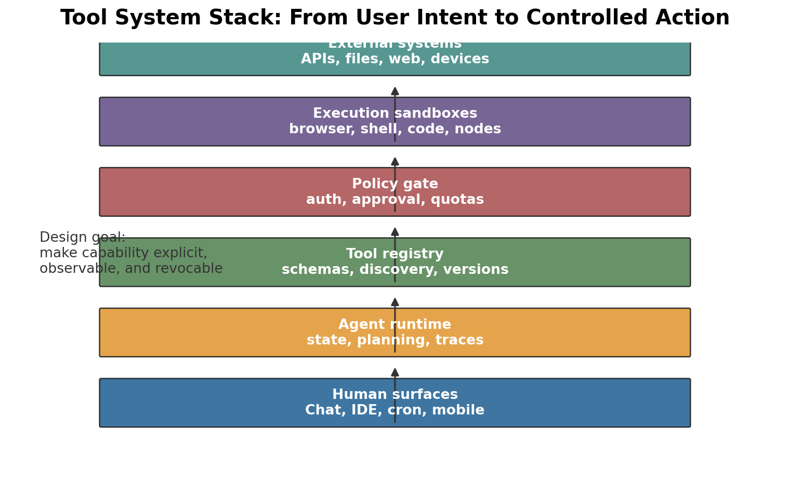
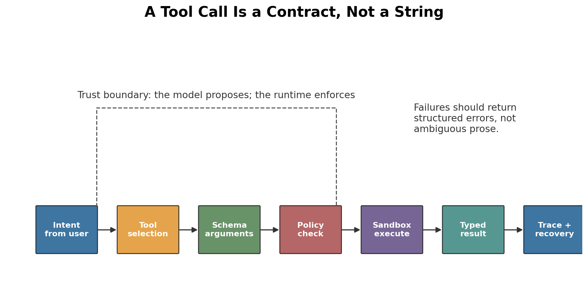
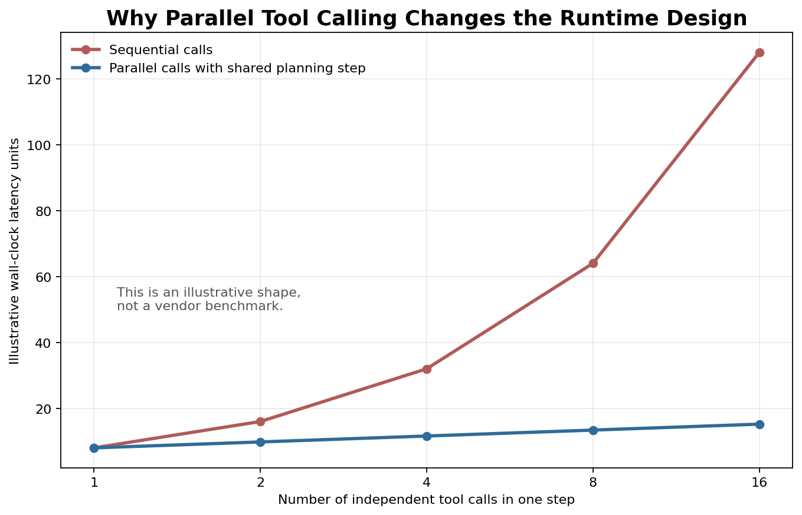
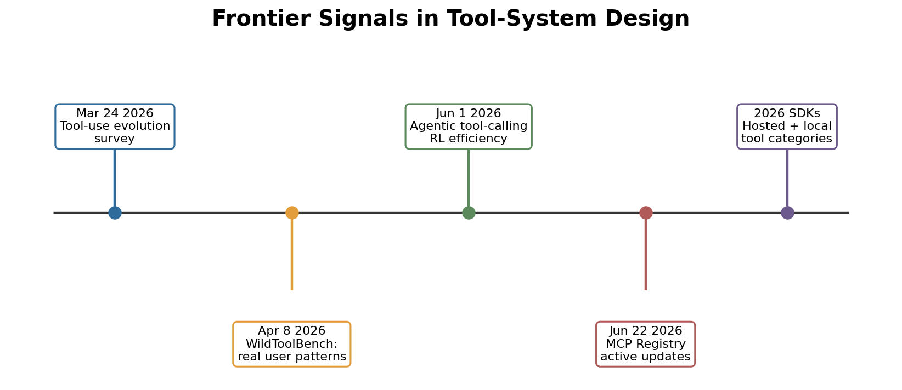

# Day 58: Tool System Design

> **Core Question**: How should an AI agent expose powerful capabilities such as browser control, shell execution, file editing, APIs, and local nodes without turning every tool call into an unsafe free-for-all?

---

## Opening

A model without tools is like a smart analyst locked in a library with no phone, no calculator, and no ability to open new books. It can reason from what it already knows, but it cannot check today's weather, inspect your repository, query a database, or click through a web form. A model with tools is closer to a junior operator sitting at a workstation. Now it can act. That is useful, but it also changes the engineering problem completely.

Tool system design is the layer that decides **what the agent may do**, **how it describes the action**, **where the action runs**, **what evidence comes back**, and **who is responsible when the action has side effects**. Function calling is only the visible tip. Underneath it are schemas, registries, sandboxes, approval gates, traces, retries, quotas, and security boundaries.

Imagine giving a new employee access to your office. You do not start by handing over the master key, company credit card, production database password, and social media account. You give a badge, a desk, a few approved systems, a manager, and an audit trail. Agent tools need the same discipline. The better the model becomes, the more important the tool boundary becomes, because capable agents fail by doing plausible things too confidently.

---

## 1. What a Tool System Actually Is

#### Intuition: A Workshop, Not a Magic Wand

Think of an agent as a skilled craftsperson and tools as a shared workshop. A hammer, saw, laser cutter, and delivery truck are not interchangeable. Each tool has a handle, an allowed use, a safety rule, and a cleanup step. A tool system is the workshop manager: it labels tools, checks who may use them, records usage, and keeps dangerous machines behind extra controls.


*Figure 1: A production tool system is a stack: user surfaces, agent runtime, tool registry, policy gate, execution sandboxes, and external systems. The model should not jump directly from text to unrestricted action.*

A tool system has five responsibilities:

| Responsibility | What it means | Common failure when missing |
|---|---|---|
| Discovery | The agent can see available capabilities and descriptions | The model invents unavailable actions |
| Schema | Inputs and outputs are typed and validated | Invalid arguments reach real systems |
| Policy | Permission, approval, quota, and risk checks happen outside the model | The model becomes its own security authority |
| Execution | Browser, shell, code, API, and node actions run in controlled environments | Tool calls leak credentials or mutate the wrong state |
| Trace | Every call, result, error, and approval is observable | Failures cannot be debugged or audited |

This is why the word "tool" is a little misleading. In agent engineering, a tool is closer to a **capability contract**. The contract says: here is the name, here is what it does, here are the arguments, here is where it runs, here are the permissions, here is the result shape, and here is how errors are reported.

The [OpenAI Agents SDK tools documentation](https://openai.github.io/openai-agents-python/tools/) makes this layering explicit by separating hosted OpenAI tools, local/runtime execution tools, function tools, agents-as-tools, and MCP servers. [Google ADK](https://adk.dev/) similarly treats tools as one part of a larger path from simple prompt-and-tool agents to multi-agent orchestration, evaluation, and deployment. [MCP](https://developers.openai.com/apps-sdk/concepts/mcp-server), originally introduced by Anthropic in 2024 and now used across many clients, standardizes how external servers expose tools and resources to AI applications.

### 1.1 Why Function Calling Was Only the First Step

Early tool use mostly asked: can the model choose the right function and fill the right JSON? That remains important. But a real agent soon needs more:

| Stage | Main question | Example |
|---|---|---|
| Single function call | Can the model call the right function once? | `get_weather(city="Singapore")` |
| Multi-step tool use | Can it use results to decide the next call? | Search, read pages, summarize evidence |
| Multi-tool orchestration | Can it coordinate several tools over a long task? | Browser + shell + file edit + tests |
| Governed tool system | Can it act safely with approvals and traces? | Draft email, ask before sending, log evidence |

The March 24, 2026 survey ["The Evolution of Tool Use in LLM Agents: From Single-Tool Call to Multi-Tool Orchestration"](https://arxiv.org/abs/2603.22862) captures this shift. It argues that the frontier has moved from isolated invocation toward long-horizon orchestration with state, feedback, safety, efficiency, and evaluation. That is exactly the design problem for systems such as `exec`, browser automation, app connectors, MCP servers, and node controls.

---

## 2. The Tool Call Lifecycle

#### Intuition: A Purchase Order, Not a Casual Request

In a company, "buy laptops" is not enough. A purchase order needs item, quantity, budget, vendor, approver, delivery address, and receipt. The request may start as natural language, but it becomes a structured contract before money moves. A tool call should follow the same path.


*Figure 2: The model proposes a tool call, but the runtime validates schema, checks policy, executes in a controlled environment, returns a typed result, and records the trace.*

A robust lifecycle looks like this:

1. **Intent formation**: the model decides that text alone is insufficient.
2. **Tool selection**: it chooses a tool from the registry, not from imagination.
3. **Argument construction**: it fills a typed schema.
4. **Validation**: the runtime checks required fields, types, ranges, and allowed values.
5. **Policy check**: identity, permissions, risk level, approval, and quota are enforced.
6. **Execution**: the tool runs in the right environment.
7. **Result interpretation**: the model receives structured output or structured error.
8. **Trace and recovery**: logs make retries, debugging, and audit possible.

A compact way to model this is:

$$
\begin{aligned}
T &= \operatorname{select}(u, C, R) \\
A &= \operatorname{validate}(\operatorname{args}(u, C), S_T) \\
P &= \operatorname{authorize}(I, T, A, \rho) \\
Y &= \operatorname{execute}(T, A, E_T) \quad \text{only if } P = \text{allow}
\end{aligned}
$$

Here **u** is the user request, **C** is context, **R** is the tool registry, **S_T** is the schema for tool **T**, **I** is identity, **rho** is the risk policy, **E_T** is the execution environment, and **Y** is the typed result. The formula matters because it separates model choice from runtime enforcement. If the model can bypass validation or policy, the system is not really governed.

### 2.1 Schemas Are Small Security Boundaries

#### Intuition: Customs Forms at the Border

A customs form does not guarantee that every traveler is honest, but it forces declarations into inspectable fields: name, passport, goods, value, destination. A tool schema does the same for agent actions. It turns vague intent into inspectable arguments.

A good tool schema should say:

| Schema field | Why it matters |
|---|---|
| Name and description | Helps the model choose the right capability |
| Required arguments | Prevents incomplete calls from reaching execution |
| Types and enums | Limits ambiguity, especially for modes and units |
| Risk metadata | Helps policy decide whether approval is needed |
| Output shape | Helps downstream reasoning and trace inspection |
| Error shape | Lets the model recover without guessing |

The dangerous anti-pattern is a generic `run(command: string)` tool exposed too early. That is equivalent to giving the model a blank check. Prefer narrower tools first: `list_files`, `read_file`, `apply_patch`, `run_tests`, `open_url`, `extract_table`, `send_draft_for_approval`. The narrower the tool, the easier it is to validate, authorize, and explain.

---

## 3. Browser, Shell, APIs, and Nodes Are Different Risk Classes

#### Intuition: Kitchen Knife, Stove, and Delivery Truck

A kitchen knife, a stove, and a delivery truck all help make dinner, but they have different failure modes. A knife can cut the wrong ingredient. A stove can start a fire. A delivery truck can leave the house and affect other people. Agent tools have the same distinction. A browser click, a shell command, an API call, and a node action should not share one permission bucket.


*Figure 3: Capability control should rise with blast radius. Read-only context, local computation, workspace mutation, external side effects, and privileged environments need different approval and audit thresholds.*

| Tool family | Typical use | Main risk | Safer design pattern |
|---|---|---|---|
| Search / retrieval | Gather evidence | Stale or poisoned context | Cite sources, separate data from instructions |
| Browser control | Navigate web apps | Clicking wrong button, prompt injection in pages | Isolated browser, user confirmation for side effects |
| Shell / code execution | Inspect repo, run tests, transform data | Data loss, credential exposure, arbitrary execution | Sandboxed working directory, command allowlists, logs |
| File editing | Modify code or documents | Silent corruption or overwriting user work | Diff-first edits, patch review, tests |
| External APIs | Send email, create tickets, purchase, publish | Irreversible side effects | Draft mode, scoped tokens, explicit approval |
| Nodes / local devices | Control local services or hardware | Physical or privacy impact | Least privilege, local confirmation, revocation |

This table deliberately compares tool families, not products. [OpenAI Agents SDK](https://openai.github.io/openai-agents-python/tools/), [Google ADK](https://docs.cloud.google.com/gemini-enterprise-agent-platform/build/adk), [MCP](https://modelcontextprotocol.io/docs/getting-started/intro), OpenClaw tools, and browser-agent infrastructure operate at different layers. A framework can orchestrate tools; MCP can standardize tool exposure; a gateway can route messages; a sandbox can execute local actions. Flattening them into one "best agent tool" ranking creates bad architecture.

### 3.1 The Permission Rule: Start Narrow, Then Earn Scope

#### Intuition: Learning to Drive

A learner driver does not start with a fuel tanker on a mountain road. They start in a parking lot, then quiet streets, then highways. Agent capabilities should graduate the same way: read-only, then reversible local actions, then externally visible actions, then privileged automation.

A practical permission ladder:

1. **Observe**: search, read, list, inspect.
2. **Compute**: parse, summarize, classify, generate a local artifact.
3. **Propose edits**: produce diffs or drafts without applying them.
4. **Apply reversible local changes**: patch files, run tests, update local state.
5. **Request external side effects**: send messages, publish, buy, delete, deploy.
6. **Operate privileged surfaces**: logged-in browser, shell with secrets, local devices.

The key is that the model may decide what it wants, but the runtime decides what is allowed. For high-risk actions, approval should be attached to the exact action: sender, recipient, body, file path, command, URL, or API payload. A vague approval such as "go ahead" is weaker than "send this exact message to this exact address."

---

## 4. Registries, MCP, and Capability Discovery

#### Intuition: An App Store With Safety Labels

When you install an app, you expect a name, description, version, publisher, permissions, and reviews. Tool registries should provide a similar discovery layer. The agent should not receive a giant unstructured list of mysterious functions. It needs a curated capability menu with enough metadata for both the model and the policy layer.

[MCP](https://www.anthropic.com/news/model-context-protocol) emerged in November 2024 to reduce one-off integrations between AI applications and external systems. Its core idea is simple: external servers can expose tools, resources, and prompts through a common protocol. The [OpenAI Apps SDK documentation](https://developers.openai.com/apps-sdk/concepts/mcp-server) describes MCP as an open specification for connecting LLM clients to tools and resources, with MCP servers exposing tools that can be called during a conversation. The [official MCP Registry](https://registry.modelcontextprotocol.io/) is now a concrete ecosystem signal: it was showing live server updates as recently as **June 22, 2026**.

A registry should help answer:

| Registry question | Why it matters |
|---|---|
| Who published this tool? | Supply-chain trust |
| What version is running? | Reproducibility and rollback |
| What scopes does it need? | Least-privilege design |
| What data does it read or write? | Privacy and compliance |
| Is it local, remote, hosted, or browser-based? | Execution risk |
| What structured errors can it return? | Recovery and observability |

### 4.1 Dynamic Discovery Is Powerful and Dangerous

#### Intuition: Letting a Tourist Read Street Signs

Street signs help a tourist navigate a city, but signs do not grant permission to enter every building. Dynamic tool discovery works the same way. It lets the agent discover available capabilities at runtime, but discovery should not equal authorization.

Dynamic discovery helps when different users have different connectors, apps, files, or devices. It becomes dangerous when the model treats a discovered tool as automatically trusted. A malicious or poorly described tool can exploit the model through its own metadata: names, descriptions, examples, or returned content. Tool descriptions are not system instructions. They are untrusted metadata that should be curated, signed, filtered, or scoped.

For production, separate three ideas:

| Concept | Meaning |
|---|---|
| Available | The runtime knows the tool exists |
| Visible | The current agent is allowed to consider it |
| Callable | The current request, identity, and risk policy allow execution |

This distinction prevents a common failure: the agent sees a powerful tool in the environment and assumes it may use it for any user.

---

## 5. Parallel Tool Calling and Runtime Scheduling

#### Intuition: Research Assistants at the Same Table

If you ask five assistants to research five independent facts, you do not need them to work one after another. They can split the work, then compare notes. Parallel tool calling lets an agent do this inside one reasoning step: search several sources, inspect several files, or call several APIs before synthesizing.


*Figure 4: This illustrative curve shows why independent tool calls benefit from parallel execution. It is not a vendor benchmark; it teaches the scheduling shape.*

Parallel calls are not just a speed trick. They change the runtime contract:

| Runtime issue | Sequential calls | Parallel calls |
|---|---|---|
| Planning | Decide next call after each result | Decide a batch of independent calls together |
| Cost control | Easier to stop early | Need budget allocation before results arrive |
| Deduplication | Natural through step-by-step feedback | Must avoid redundant calls in the same batch |
| Error handling | One failure at a time | Partial success and aggregation become normal |
| Policy | One approval per action | Batch approvals may need grouping and limits |

A February 2026 paper, ["Scaling Parallel Tool Calling for Efficient Deep Research Agents"](https://arxiv.org/abs/2602.07359), studied the idea that agentic search can scale along the width dimension: many coordinated tool calls in one step instead of one long chain. Whether or not a specific system adopts that exact method, the engineering implication is clear. Tool runtimes need concurrency limits, cancellation, deduplication, partial-result handling, and trace views that show a batch as a coherent unit.

### 5.1 Idempotency and Retry Discipline

#### Intuition: Pressing an Elevator Button Twice

Pressing an elevator button twice should not summon two elevators for the same passenger. Retrying a tool call should not send two emails, create two calendar events, or run two purchases. Every side-effecting tool needs idempotency.

A safe tool system attaches an idempotency key to high-risk actions. The key may combine user id, session id, tool name, normalized arguments, and a request id. For external APIs that support idempotency keys, pass them through. For APIs that do not, store local execution records and refuse suspicious duplicates. Retry is good engineering only when the repeated attempt cannot multiply the side effect.

---

## 6. Frontier Update: What Changed in 2026

#### Intuition: From Hand Tools to Factory Floor

The frontier is moving from "can the model call a function?" to "can an organization operate a factory floor of tools safely?" A factory needs stations, supervisors, logs, emergency stops, maintenance, and quality checks. Agent tools are heading in the same direction.


*Figure 5: Recent frontier work emphasizes orchestration, real-world tool-use evaluation, live registries, and runtime categories rather than isolated function calls.*

Important recent signals:

| Date | Item | Why it matters |
|---|---|---|
| **March 24, 2026** | [The Evolution of Tool Use in LLM Agents](https://arxiv.org/abs/2603.22862) | Summarizes the shift from single calls to multi-tool orchestration |
| **April 8, 2026** | [WildToolBench](https://arxiv.org/html/2604.06185) | Evaluates tool use grounded in real user behavior patterns; reported that no tested model exceeded 15% accuracy, showing a large robustness gap |
| **June 1, 2026** | [On Effectiveness and Efficiency of Agentic Tool-calling and RL Training](https://arxiv.org/abs/2606.00135) | Studies agentic tool-calling and reinforcement learning efficiency, a sign that tool use is becoming a training target, not only a prompting trick |
| **June 22, 2026** | [Official MCP Registry](https://registry.modelcontextprotocol.io/) live updates | Shows the ecosystem moving toward discoverable, versioned tool servers |
| **2026 SDK direction** | [OpenAI Agents SDK tools](https://openai.github.io/openai-agents-python/tools/) and [Google ADK](https://adk.dev/) | Tool categories, orchestration, evaluation, and deployment are becoming first-class SDK concepts |

WildToolBench is especially sobering. Many demos succeed because the task is clean, the tool list is small, and the expected behavior is obvious. Real users ask messy things, mix constraints, change their mind, and use ambiguous names. A tool system designed only for demos will not survive that distribution shift.

---

## 7. Code Example: A Minimal Governed Tool Runtime

#### Intuition: A Receptionist With a Rulebook

A good receptionist does not solve every problem personally. They check the visitor, look up the allowed department, ask for approval when needed, and record what happened. The runtime below is intentionally small, but it shows the same separation: model proposal, schema validation, policy, execution, and trace.

```python
from dataclasses import dataclass
from typing import Any, Callable, Dict, Literal

Risk = Literal["read", "local_write", "external_side_effect"]

@dataclass(frozen=True)
class ToolSpec:
    name: str
    description: str
    required: set[str]
    risk: Risk
    handler: Callable[[dict[str, Any]], dict[str, Any]]

@dataclass(frozen=True)
class Identity:
    user_id: str
    approved_risks: set[Risk]

class ToolRuntime:
    def __init__(self, tools: Dict[str, ToolSpec]):
        self.tools = tools
        self.trace: list[dict[str, Any]] = []

    def call(self, identity: Identity, tool_name: str, args: dict[str, Any]) -> dict[str, Any]:
        if tool_name not in self.tools:
            return {"ok": False, "error": "unknown_tool"}

        spec = self.tools[tool_name]
        missing = spec.required - args.keys()
        if missing:
            return {"ok": False, "error": "missing_args", "fields": sorted(missing)}

        if spec.risk not in identity.approved_risks:
            return {
                "ok": False,
                "error": "approval_required",
                "risk": spec.risk,
                "tool": tool_name,
                "args": args,
            }

        try:
            result = spec.handler(args)
            event = {"user": identity.user_id, "tool": tool_name, "args": args, "result": result}
            self.trace.append(event)
            return {"ok": True, "result": result}
        except Exception as exc:
            return {"ok": False, "error": "tool_failed", "message": str(exc)}


def word_count(args: dict[str, Any]) -> dict[str, Any]:
    text = args["text"]
    return {"words": len(text.split())}

runtime = ToolRuntime({
    "word_count": ToolSpec(
        name="word_count",
        description="Count words in provided text.",
        required={"text"},
        risk="read",
        handler=word_count,
    )
})

identity = Identity(user_id="elar", approved_risks={"read"})
print(runtime.call(identity, "word_count", {"text": "tools need boundaries"}))
```

This toy runtime is not production-ready, but it demonstrates the essential shape. The tool handler does not decide whether the user is allowed. The model does not decide whether the schema is valid. The trace is stored by the runtime, not left to the model's memory. Production systems add typed schemas, sandboxing, secret management, human approvals, idempotency keys, and structured observability.

---

## 8. Common Misconceptions

### Misconception 1: "Tool use is just function calling"

Function calling is the interface between model and runtime. Tool system design includes registry, policy, execution environment, approval, observability, retries, and security. A production tool system can use function calling, MCP, hosted tools, local tools, or browser tools, but the governance problem remains.

### Misconception 2: "If the model is smart enough, fewer guardrails are needed"

Smarter models make more convincing plans. That increases the need for explicit boundaries. A weak model may fail before doing anything. A strong model can chain actions across browser, shell, files, and APIs. Capability should raise the standard for validation and approvals, not lower it.

### Misconception 3: "All tools should be exposed all the time"

More tools can make the model worse. A huge menu increases selection error, prompt injection surface, latency, and policy complexity. Good systems curate the visible tool set for the current user, task, channel, and risk level.

### Misconception 4: "A sandbox solves everything"

Sandboxes reduce damage inside an environment. They do not solve wrong-recipient emails, bad purchases, private data leakage through tool outputs, or user confusion. Sandboxing must be combined with schemas, approvals, least privilege, and traces.

---

## 9. Further Reading

### Beginner

1. [OpenAI Agents SDK: Tools](https://openai.github.io/openai-agents-python/tools/) - practical categories of hosted, local, function, agent, and MCP tools.
2. [Google Agent Development Kit](https://adk.dev/) - overview of building agents with tool calls, orchestration, evaluation, and deployment.
3. [OpenAI Apps SDK: MCP Server](https://developers.openai.com/apps-sdk/concepts/mcp-server) - concise explanation of how MCP servers expose tools and resources.

### Advanced

1. [Model Context Protocol official introduction](https://modelcontextprotocol.io/docs/getting-started/intro) - the protocol layer for external tools and context.
2. [Official MCP Registry](https://registry.modelcontextprotocol.io/) - live registry of MCP servers and an example of ecosystem-level discovery.
3. [Anthropic: Introducing the Model Context Protocol](https://www.anthropic.com/news/model-context-protocol) - historical origin and motivation for MCP.

### Papers

1. [The Evolution of Tool Use in LLM Agents: From Single-Tool Call to Multi-Tool Orchestration](https://arxiv.org/abs/2603.22862)
2. [Benchmarking LLM Tool-Use in the Wild](https://arxiv.org/html/2604.06185)
3. [On Effectiveness and Efficiency of Agentic Tool-calling and RL Training](https://arxiv.org/abs/2606.00135)
4. [Scaling Parallel Tool Calling for Efficient Deep Research Agents](https://arxiv.org/abs/2602.07359)

---

## Reflection Questions

1. Which tools in your current workflow should be read-only, which should be local-write, and which should require explicit external-action approval?
2. If an agent uses a browser and a shell in the same task, where should the trust boundary sit: model, runtime, sandbox, or user approval?
3. What metadata should a tool registry expose so that a model can choose tools well without being allowed to call everything it can see?

---

## Summary

| Concept | One-line explanation |
|---|---|
| Tool system | The full governance layer around agent capabilities: discovery, schema, policy, execution, and trace |
| Tool schema | A typed contract that turns model intent into inspectable arguments and structured results |
| Capability control | Matching approval and sandbox strength to the blast radius of each tool family |
| MCP | A protocol for exposing external tools and resources to AI applications through a common interface |
| Parallel tool calling | Coordinated batches of independent tool calls that require scheduling, budgets, and partial-result handling |
| Idempotency | The property that retries do not multiply side effects |

**Key Takeaway**: Tool use is where LLMs stop being only text generators and become operators. The central design question is not "can the model call a function?" It is "can the system expose capability as a governed contract?" Good tool systems make actions explicit, typed, permissioned, sandboxed, observable, and revocable. That is what lets browser, shell, APIs, and local nodes become useful infrastructure instead of uncontrolled power.

---

*Day 58 of 60 | LLM Fundamentals*  
*Word count: ~3,300 | Reading time: ~17 minutes*
