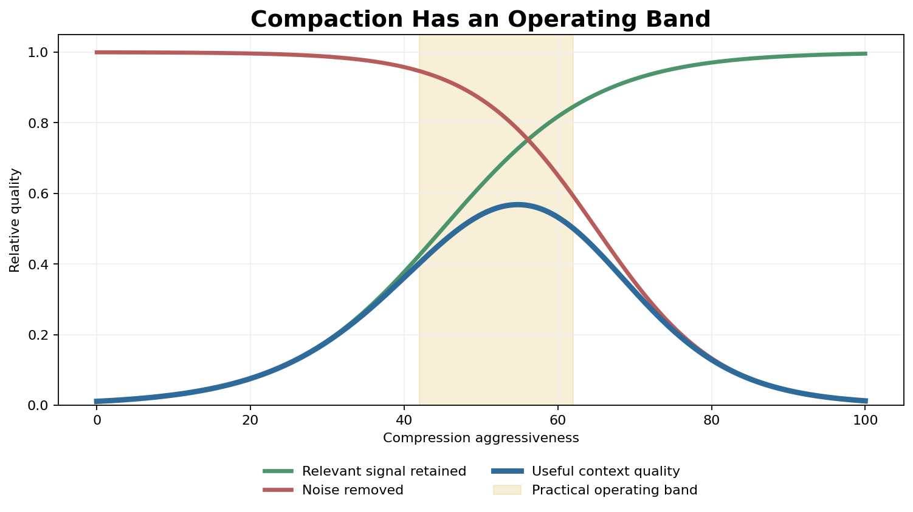

# Day 59: Memory and Context Management

> **Core Question**: How do long-running LLM agents decide what to remember, what to forget, and what to place in the model's limited context window right now?

---

## Opening

Imagine hiring a brilliant intern who has a perfect short-term focus but no desk, no notebook, and no filing cabinet. During a meeting, they can reason sharply about whatever is on the whiteboard. The moment the board fills up, they must erase something. The next morning, unless someone rewrites the right facts, they may forget the project convention, the customer's preference, or the bug they already debugged yesterday.

That is the basic problem behind memory and context management for LLM agents. The model itself sees only the current prompt, current tool outputs, and whatever history or memory the system injects. A longer context window helps, but it does not solve the problem. It is like buying a larger desk: you can spread out more papers, but the desk still gets cluttered, important documents still hide under stale ones, and sensitive notes still need access control.

Today's lesson separates two ideas that are often blurred together. **Memory management** decides what durable state exists across turns and sessions. **Context management** decides which pieces of that state deserve scarce prompt space for the next inference. A useful agent needs both: a library that preserves knowledge, and an editor that prepares the small briefing packet the model should read now.

---

## 1. Why Memory Is Not Just "Long Context"

#### Intuition: a bigger backpack is not a filing system

Think of context length as the size of a backpack. If you are hiking for one afternoon, a bigger backpack feels enough. If you are running a research lab for a year, throwing every notebook, receipt, map, and lab result into one huge backpack becomes a mess. You need shelves, labels, summaries, retention rules, and a habit of packing only today's essentials.

Memory systems appeared because LLM applications moved from single-turn chat to ongoing work: coding agents, customer-support agents, research assistants, workflow agents, and personal copilots. In those settings, the agent must remember stable facts, previous decisions, unresolved tasks, and user preferences without re-reading every past token.


*Figure 1: Agent memory is layered by volatility and purpose. The live context window is only the top layer, not the whole system.*

The first design mistake is to treat the transcript as memory. A transcript is evidence, not necessarily useful state. It contains corrections, dead ends, repeated logs, tool outputs, and half-finished plans. If the agent blindly stuffs it into the prompt, three bad things happen:

1. **Cost rises** because every repeated token is paid for again.
2. **Latency rises** because long prompts take longer to process.
3. **Reasoning quality drops** because stale or irrelevant content distracts the model.

The [LangChain memory overview](https://docs.langchain.com/oss/python/concepts/memory) makes the same practical point: conversation history is common short-term memory, but full history may exceed the context window, and even when it fits, long contexts can make models slower, more expensive, and more distracted.

So the modern view is: memory is an external state system, while context is the carefully selected view of that state for one model call.

---

## 2. The Memory Layers: What Should Be Remembered?

#### Intuition: diary, encyclopedia, and operating manual

A human does not store every memory in the same mental drawer. "I met Alice yesterday" feels different from "Alice prefers concise emails" and different again from "when writing release notes, always include migration steps." Agent memory needs the same separation. A diary records events, an encyclopedia records stable facts, and an operating manual records procedures.

| Layer | What it stores | Best for |
|---|---|---|
| Short-term / working memory | Current task state, active plan, unresolved questions | Keeping a multi-step task coherent |
| Episodic memory | Time-stamped events, decisions, outcomes, source traces | Auditing what happened and learning from experience |
| Semantic memory | Stable facts, preferences, project knowledge | Personalization and repeated domain knowledge |
| Procedural memory | Skills, policies, workflows, codebase rules | Repeatable behavior and team conventions |

This distinction also explains why different products appear to solve "memory" differently. [Claude Code memory](https://code.claude.com/docs/en/memory) uses `CLAUDE.md` files for persistent instructions and auto memory for learned notes. [OpenAI Codex AGENTS.md](https://developers.openai.com/codex/guides/agents-md) gives coding agents project-specific guidance before work starts, while [Codex Memories](https://developers.openai.com/codex/memories) carry useful context from earlier threads into future work and explicitly separate local recall from required team rules. [LangGraph long-term memory](https://docs.langchain.com/oss/python/concepts/memory) stores information across conversations in namespaces. [Zep](https://www.getzep.com/) emphasizes temporal context graphs, provenance, and governed retrieval at enterprise scale.

These are not identical product types, so they should not be ranked in one "best memory tool" table. A checked-in instruction file, an application memory API, and an enterprise context graph solve related but different problems. A better question is: which layer of memory are you trying to control?

---

## 3. Context Management: The Editor Before the Model

#### Intuition: briefing a doctor before surgery

Before surgery, a doctor does not read the patient's entire medical archive from birth. The team prepares a focused briefing: current diagnosis, allergies, recent labs, relevant history, and the operation plan. Too little context is dangerous; too much irrelevant context is also dangerous because it hides the signal.

Context management plays that briefing role for an LLM call. It decides what enters the live context window:

| Context ingredient | Why include it | Common failure if unmanaged |
|---|---|---|
| Task instruction | Defines the current objective | Agent optimizes the wrong goal |
| System and policy constraints | Sets boundaries and style | Agent violates rules or user preferences |
| Active working state | Preserves progress across steps | Agent repeats work or loses the thread |
| Retrieved memories | Brings durable facts into focus | Agent forgets stable preferences or decisions |
| Tool outputs | Grounds action in current evidence | Agent fabricates or uses stale data |


*Figure 2: A naive transcript wastes context on old chat noise. Compaction and retrieval shift the budget toward current task state and relevant memory.*

At a systems level, context management is token budgeting under uncertainty. A simple scoring formula can clarify the control problem:

$$
\begin{aligned}
\text{score}(m, q) &= \alpha \cdot \text{relevance}(m, q) + \beta \cdot \text{recency}(m) \\
&\quad + \gamma \cdot \text{authority}(m) - \lambda \cdot \text{token_cost}(m)
\end{aligned}
$$

Here `m` is a memory item and `q` is the current task. The formula is not a universal law; it is a design checklist. Good context is relevant, recent when recency matters, backed by an authoritative source, and cheap enough to fit. Bad context may be true but irrelevant, relevant but stale, cheap but untrusted, or important but too verbose.

The important part is the trade-off. If the system always chooses high-relevance snippets, it may overfit to lexical similarity and miss procedural rules. If it always chooses recent snippets, it may forget stable facts. If it always chooses short snippets, it may omit necessary evidence. Context engineering is the practical art of balancing those forces.

---

## 4. The Write-Manage-Read Loop

#### Intuition: notes are useful only if someone reviews the notebook

Writing everything down is not the same as having useful memory. A messy notebook can become worse than no notebook: it stores contradictions, duplicates, outdated plans, and private information in the wrong place. A serious memory system needs a loop: write candidates, manage the store, then read selectively.


*Figure 3: Production memory is a write-manage-read control loop tied to action. Each step can fail independently.*

The loop has three control points.

**Write** asks whether the current event should become memory. Useful candidates include durable preferences, decisions, project conventions, lessons from errors, and source-backed facts. Temporary scratch thoughts usually should not become long-term memory.

**Manage** asks how stored memory should evolve. Duplicates should merge. Contradictions should preserve provenance instead of silently overwriting truth. Old facts should expire when they are time-sensitive. Sensitive facts should have access policy and deletion paths.

**Read** asks what to retrieve for the current task. Retrieval can use vector similarity, keyword search, graph traversal, time filters, or explicit IDs. The best systems combine several signals because memory recall is not just semantic search. If a user says, "use the same format as last Friday," the timestamp matters. If a support agent handles a billing dispute, provenance matters. If a coding agent applies a team rule, procedural authority matters.

This is why memory security became a frontier topic. The April 2026 survey ["A Survey on Long-Term Memory Security in LLM Agents"](https://arxiv.org/abs/2604.16548) argues that writable cross-session memory creates threats with persistence, statefulness, and propagation. A poisoned memory can survive the original prompt, affect later sessions, and spread through downstream actions. Memory therefore needs validation, provenance, retention, and user-visible editing, not just better embeddings.

---

## 5. Compaction: Keeping the Thread Without Keeping Every Token

#### Intuition: making meeting minutes

Good meeting minutes do not copy every sentence. They keep decisions, owners, deadlines, open questions, and useful context. Bad minutes lose the reason behind a decision; worse minutes keep every joke and side comment until the important action item disappears.

Compaction is the process of turning a long interaction into a smaller state representation. Coding agents use it when a session grows too long. Research agents use it when moving through many documents. Personal assistants use it when preserving continuity without replaying every prior conversation.


*Figure 4: Too little compaction leaves noise; too much compaction erases useful constraints. The practical zone keeps signal while removing distraction.*

The hard part is that compaction changes the agent's state. A summary is not neutral. It chooses what counts as important. If the summary drops a constraint like "do not modify earlier articles," later reasoning may be worse even if the summary sounds fluent. If it removes uncertainty, it may turn a hypothesis into a fake fact.

Three habits make compaction safer:

1. **Separate facts from plans**. Facts describe the world; plans describe intended action.
2. **Keep unresolved questions explicit**. A compacted state should not pretend that unknowns are solved.
3. **Attach provenance to important claims**. If a future step depends on a claim, the agent should know where it came from.

The June 2026 paper ["Learning Agent-Compatible Context Management for Long-Horizon Tasks"](https://arxiv.org/abs/2605.30785) pushes this idea further. It introduces Adaptive Context Management (AdaCoM), an external LLM trained to manage a frozen agent's context through modification actions and reinforcement learning. The key shift is from hand-written compaction heuristics toward learned context editing policies that preserve constraints and progress while pruning stale content.

---

## 6. Implementation Sketch: A Minimal Memory Manager

#### Intuition: a librarian with a trash policy

A useful librarian does not only search shelves. They decide what gets cataloged, which edition supersedes another, when a note is too vague to keep, and which books are allowed into a restricted reading room. The following toy implementation is intentionally small, but it captures the shape of production systems: store structured memories, score them for a query, and build a bounded context packet.

```python
from dataclasses import dataclass
from time import time
from typing import Iterable


@dataclass
class Memory:
    text: str
    kind: str              # "semantic", "episodic", or "procedural"
    source: str            # where the memory came from
    created_at: float
    authority: float = 1.0 # higher for checked-in docs or explicit user rules


def keyword_overlap(a: str, b: str) -> float:
    """Tiny stand-in for embedding similarity."""
    aw = {w.lower().strip(".,:;()") for w in a.split()}
    bw = {w.lower().strip(".,:;()") for w in b.split()}
    if not aw or not bw:
        return 0.0
    return len(aw & bw) / len(aw | bw)


def select_context(
    query: str,
    memories: Iterable[Memory],
    token_budget: int = 120,
) -> list[Memory]:
    now = time()
    scored = []

    for mem in memories:
        relevance = keyword_overlap(query, mem.text)
        age_days = max((now - mem.created_at) / 86400, 0)
        recency = 1 / (1 + age_days / 30)
        token_cost = max(len(mem.text.split()), 1)

        score = (
            0.55 * relevance
            + 0.25 * recency
            + 0.30 * mem.authority
            - 0.01 * token_cost
        )
        scored.append((score, mem, token_cost))

    chosen, used = [], 0
    for _, mem, cost in sorted(scored, reverse=True, key=lambda x: x[0]):
        if used + cost <= token_budget:
            chosen.append(mem)
            used += cost
    return chosen
```

Real systems replace the toy overlap score with embeddings, hybrid search, graph queries, reranking, access control, and evaluation logs. But the shape remains: every memory item competes for limited prompt space, and each item should carry enough metadata to decide whether it belongs.

---

## 7. Frontier: Memory Is Becoming a Policy, Not a Store

#### Intuition: from warehouse to air-traffic control

Early memory systems looked like warehouses: put facts in, search them later. The frontier looks more like air-traffic control. The system coordinates live context, long-term memory, tool outputs, safety policy, and user control while the agent is already moving.


*Figure 5: Recent work moves from external stores toward learned policies for memory and context control.*

Two recent updates are especially important:

| Date | Item | Why it matters |
|---|---|---|
| 2026-01-05 | ["Agentic Memory: Learning Unified Long-Term and Short-Term Memory Management for Large Language Model Agents"](https://arxiv.org/abs/2601.01885) | Treats memory operations as actions inside the agent policy, unifying short-term and long-term memory decisions. |
| 2026-06-01 | ["Learning Agent-Compatible Context Management for Long-Horizon Tasks"](https://arxiv.org/abs/2605.30785) | Trains an external context manager to edit a frozen agent's context, showing that context management itself can be optimized. |

Other 2026 work fills in the landscape. ["SimpleMem"](https://arxiv.org/abs/2601.02553), posted on 2026-01-06, explores semantic lossless compression for lifelong agent memory. ["Memory for Autonomous LLM Agents"](https://arxiv.org/html/2603.07670v1), posted in March 2026, frames agent memory as a write-manage-read loop and surveys mechanisms through early 2026. The April 2026 memory-security survey linked above argues that persistent writable memory changes the threat model.

The product frontier is also splitting into layers. Coding tools expose persistent instruction files and learned memory: Claude Code uses `CLAUDE.md` plus auto memory, while Codex uses `AGENTS.md` plus optional local memories. Application frameworks such as LangGraph expose memory stores and namespaces. Memory infrastructure companies such as Zep build temporal context graphs with provenance and governance. These are complementary layers, not mutually exclusive winners.

---

## 8. Common Misconceptions

### Misconception 1: "A million-token context window eliminates memory."

No. A large context window reduces one bottleneck, but it does not decide which facts are durable, which facts are private, which facts are stale, or which facts are relevant now. Bigger context also increases cost and can make attention more diffuse.

### Misconception 2: "Vector search equals memory."

Vector search is a retrieval method. Memory is the larger lifecycle: write, update, merge, delete, authorize, retrieve, compact, audit, and evaluate. A vector database can be part of memory, but it is not the whole memory system.

### Misconception 3: "Summaries are always safe compression."

Summaries are lossy state transformations. They can drop constraints, invent coherence, or erase uncertainty. For high-stakes tasks, summaries should preserve decisions, open questions, source links, and policy constraints.

### Misconception 4: "The agent should remember everything."

Remembering everything creates privacy risk, retrieval noise, and operational cost. Good memory systems are selective. They also give users and organizations ways to inspect, correct, and delete durable state.

---

## 9. Practical Design Rules

#### Intuition: pack the suitcase for the trip you are actually taking

You do not pack winter boots for a one-hour meeting, and you do not bring only a toothbrush for a two-week trip. Context should be packed for the task at hand.

1. **Keep durable rules in explicit files or policy stores.** Use `AGENTS.md`, `CLAUDE.md`, checked-in docs, or policy engines for rules that must be stable and reviewable.
2. **Treat learned memory as helpful recall, not law.** Learned memories can be wrong or outdated; give them provenance and editing paths.
3. **Separate working state from long-term memory.** Plans and scratchpads should not automatically become permanent facts.
4. **Use compaction checkpoints.** Preserve objective, constraints, completed work, open questions, and next actions.
5. **Evaluate memory with long-horizon tasks.** Single-turn accuracy hides failures that only appear after many turns.
6. **Design deletion early.** If users cannot inspect and delete memory, the system will eventually violate trust.

---

## Further Reading

### Foundations and Systems

1. [LangChain Memory Overview](https://docs.langchain.com/oss/python/concepts/memory)  
   Clear conceptual split between short-term conversation state and long-term memory namespaces.
2. [Claude Code: How Claude remembers your project](https://code.claude.com/docs/en/memory)  
   Official documentation for `CLAUDE.md`, auto memory, scope, and troubleshooting.
3. [OpenAI Codex: AGENTS.md](https://developers.openai.com/codex/guides/agents-md)  
   Official guide for checked-in project instructions for coding agents.
4. [OpenAI Codex Memories](https://developers.openai.com/codex/memories)  
   Official description of local memories and how they differ from required project guidance.

### Papers

1. ["Agentic Memory: Learning Unified Long-Term and Short-Term Memory Management for Large Language Model Agents"](https://arxiv.org/abs/2601.01885)
2. ["SimpleMem: Efficient Lifelong Memory for LLM Agents"](https://arxiv.org/abs/2601.02553)
3. ["Memory for Autonomous LLM Agents: Mechanisms, Evaluation, and Emerging Frontiers"](https://arxiv.org/html/2603.07670v1)
4. ["A Survey on Long-Term Memory Security in LLM Agents"](https://arxiv.org/abs/2604.16548)
5. ["Learning Agent-Compatible Context Management for Long-Horizon Tasks"](https://arxiv.org/abs/2605.30785)

---

## Reflection Questions

1. In your own workflow, what information should be procedural memory rather than conversational history?
2. When should an agent forget something even if it is true?
3. How would you evaluate whether a memory system improves long-horizon task performance rather than just making the agent sound more personalized?

---

## Summary

| Concept | One-line Explanation |
|---|---|
| Memory management | Decides what durable state exists across turns, sessions, and tasks. |
| Context management | Decides what subset of state enters the model's limited prompt right now. |
| Compaction | Compresses long interaction history into a smaller task state, with risk of losing constraints. |
| Episodic memory | Stores time-stamped experiences and outcomes. |
| Semantic memory | Stores stable facts and preferences. |
| Procedural memory | Stores rules, skills, policies, and workflows. |
| Provenance | Keeps track of where a memory came from so it can be audited or corrected. |

**Key Takeaway**: A capable agent does not remember by carrying every past token into every future prompt. It remembers by maintaining structured durable state, managing that state over time, and assembling a focused context packet for each model call. Long context is useful, but memory and context management are the control systems that make long-running agents reliable.

---

*Day 59 of 60 | LLM Fundamentals*  
*Word count: ~2,650 | Reading time: ~13 minutes*
