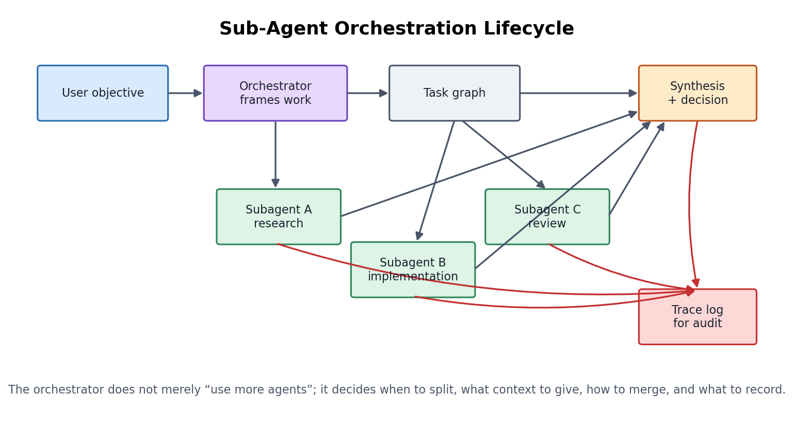
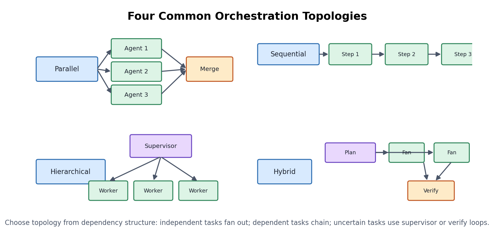
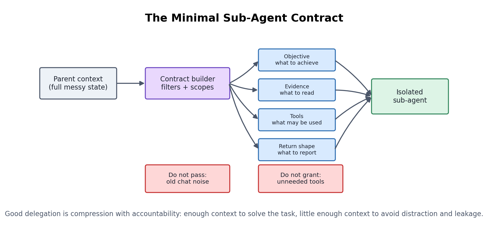
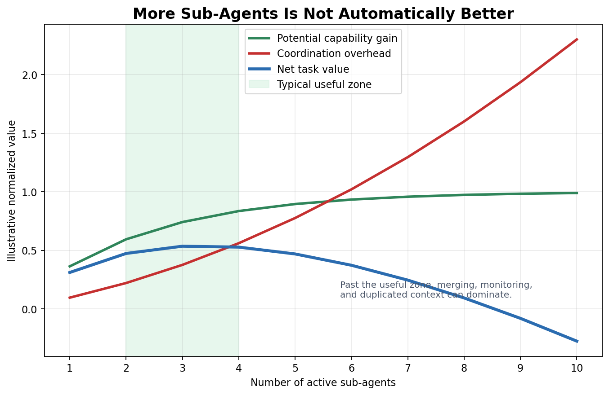
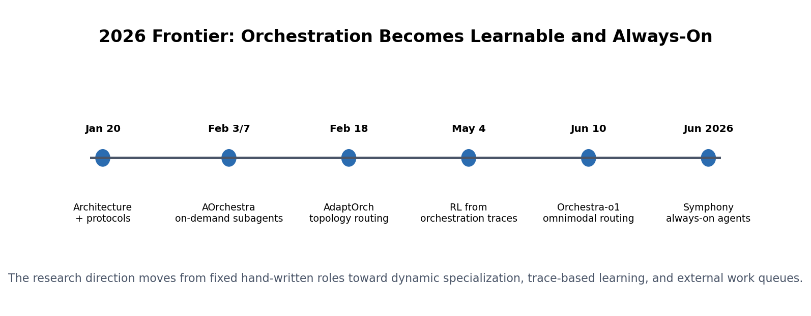

# Day 60: Sub-Agent Orchestration

> **Core Question**: When should an AI system split work across sub-agents, and how does the orchestrator keep the team useful instead of chaotic?

---

## Opening

Imagine a senior engineer managing a small incident room. One person reads logs, another checks the recent deployment, another talks to customer support, and the senior engineer keeps the whole room pointed at the same goal. The work is faster than one person doing everything, but only if the manager does real management: assign bounded tasks, prevent duplicate effort, ask for evidence, merge findings, and stop the room before everyone keeps investigating forever.

Sub-agent orchestration is the same idea for LLM systems. A main agent, often called the **orchestrator**, delegates bounded subtasks to specialized sub-agents. Each sub-agent may have its own context window, tools, model, sandbox, instructions, and timeout. The orchestrator decides what to spawn, what context to pass, which tools to allow, how to merge results, and when the extra coordination is no longer worth it.

This final lesson closes the course by connecting many earlier ideas: agents, tools, memory, context management, evaluation, safety, cost, and human-AI collaboration. Sub-agents are not magic "more intelligence." They are an engineering pattern for controlling attention, capability, and risk.

---

## 1. Why Sub-Agents Exist

#### Intuition: a restaurant kitchen, not a louder chef

If a restaurant is slow, shouting at the head chef does not scale. A real kitchen separates stations: grill, pastry, prep, plating, and quality check. The head chef does not cook every dish. They decide the order of work, route tickets, inspect plates, and keep the kitchen from blocking itself.

Early LLM agents often behaved like a single chef trying to do everything inside one context window. That works for short tasks. It becomes fragile when the task requires multiple kinds of attention: reading a codebase, testing behavior, searching recent papers, producing diagrams, translating, and reviewing quality. The context window fills with unrelated evidence. Tools granted for one step remain available for another step where they are dangerous. The agent gets slower and easier to distract.

Sub-agents appeared because long tasks need **bounded working rooms**. A research sub-agent can read widely without polluting the main context. A test sub-agent can run commands without editing files. A reviewer sub-agent can criticize a draft without carrying the writer's assumptions. A background sub-agent can wait on slow I/O while the orchestrator keeps working.


*Figure 1: The orchestrator frames the objective, decomposes the task, spawns bounded workers, merges their outputs, and records an orchestration trace for audit and learning.*

In [OpenAI Codex subagents](https://developers.openai.com/codex/subagents), Codex handles agent orchestration details such as spawning workers, routing follow-up instructions, waiting for results, and consolidating responses. [Spring AI's January 2026 subagent orchestration pattern](https://spring.io/blog/2026/01/27/spring-ai-agentic-patterns-4-task-subagents/) describes the same core pattern: a main agent delegates through a Task tool, and each sub-agent runs in its own isolated context window. The product surfaces differ, but the architectural idea is stable: **sub-agents are delegated execution contexts**.

The important word is "delegated." A sub-agent is not just another API call. It receives a local mission, local context, local permissions, and a return contract. If those are vague, you have not orchestrated a team. You have created parallel confusion.

---

## 2. The Orchestrator's Real Job

#### Intuition: a film director with a shot list

A film director does not merely hire more cameras. They decide which scene is being shot, what each camera should capture, which takes are usable, and how the footage will be edited. Without that shot list, more cameras create more footage but not necessarily a better film.

The orchestrator has five responsibilities:

| Responsibility | Question it answers | Failure if ignored |
|---|---|---|
| Decompose | What subtasks actually exist? | Workers solve overlapping or irrelevant problems |
| Scope context | What does each sub-agent need to know? | Context leakage, distraction, missing constraints |
| Allocate capability | Which model, tools, sandbox, and timeout fit this task? | Overpowered agents, unsafe tools, wasted cost |
| Aggregate | How should results be merged and conflicts resolved? | Contradictory outputs become a fluent but wrong answer |
| Stop | When is further delegation no longer useful? | Infinite loops, rising cost, late answers |

This table is deliberately about responsibilities, not products. [Google ADK](https://adk.dev/), [LangGraph](https://www.langchain.com/langgraph), [AutoGen](https://microsoft.github.io/autogen/), [CrewAI](https://www.crewai.com/), OpenAI Codex subagents, Claude Code-style task agents, and OpenClaw sessions all expose different control surfaces. Some are application frameworks, some are coding-agent products, and some are personal-agent runtimes. They should not be flattened into one "best sub-agent tool" ranking.

In OpenClaw-style systems, a primitive such as `sessions_spawn` is best understood as a delegation boundary, not as the whole orchestration system. The call can create a separate working session, but the parent still owns the contract: what task to delegate, which prior context is safe to include, how to wait for the result, how to handle failure, and whether the returned answer is sufficient. That distinction matters because spawning is an action; orchestration is the policy around the action.

A good orchestrator often does less than beginners expect. It should not micromanage every token. It should not paste the entire parent conversation into every worker. It should not spawn a worker simply because concurrency is available. Its job is to make delegation cheaper, cleaner, and more reliable than doing the work in one crowded context.

---

## 3. Four Topologies: Parallel, Sequential, Hierarchical, Hybrid

#### Intuition: different errands need different routes

If you need groceries, dry cleaning, and a package pickup, three people can run in parallel. If you need a passport, you cannot take the photo after submitting the application. If you are unsure what problem you are solving, you may need a supervisor to investigate before assigning work. The dependency structure determines the route.


*Figure 2: Parallel, sequential, hierarchical, and hybrid topologies fit different dependency structures. The orchestrator's first design choice is the shape of the work graph.*

| Topology | Best when | Watch out for |
|---|---|---|
| Parallel fan-out | Subtasks are independent and results can be merged | Duplicate work, inconsistent assumptions |
| Sequential pipeline | Each step depends on the previous step's output | Slow critical path, error propagation |
| Hierarchical supervisor-worker | Work is complex and needs central routing | Supervisor bottleneck, over-delegation |
| Hybrid plan-execute-verify | Work needs both speed and quality gates | More state to track, harder debugging |

The February 2026 paper [AdaptOrch](https://arxiv.org/abs/2602.16873) formalizes this intuition. It argues that as frontier model benchmark performance converges, choosing the right orchestration topology can matter more than choosing one "best" model. The paper proposes routing task decomposition graphs to parallel, sequential, hierarchical, or hybrid patterns, and reports 12-23% gains over static topology baselines across coding, reasoning, and retrieval-augmented generation tasks.

The March 2026 paper [Benchmarking Multi-Agent LLM Architectures for Financial Document Processing](https://arxiv.org/abs/2603.22651) makes the same issue concrete in one domain. It compares sequential pipeline, parallel fan-out with merge, hierarchical supervisor-worker, and reflexive self-correcting loop architectures for structured extraction from financial documents. The lesson is not that finance has a universal winner. The lesson is that orchestration is now an architectural choice with measurable cost-accuracy trade-offs.

---

## 4. The Minimal Sub-Agent Contract

#### Intuition: sending a colleague a clean ticket

When you ask a colleague for help, "look into this" is a bad ticket. A good ticket says what outcome you need, what files or facts matter, what they are allowed to change, when you need the answer, and what format to return. Sub-agents need the same local contract.


*Figure 3: A sub-agent should receive a scoped contract: objective, evidence, tools, and return shape. Passing the full parent context is usually worse than passing a precise briefing.*

A useful sub-agent contract has four parts:

1. **Objective**: the narrow task, written as an outcome, not a vague role.
2. **Evidence**: the specific files, search results, logs, or constraints it should use.
3. **Capability**: the tools, model strength, network access, write access, and timeout it may use.
4. **Return shape**: the exact summary, patch, JSON object, score, or decision expected by the orchestrator.

The February 2026 paper [AOrchestra](https://arxiv.org/abs/2602.03786) pushes this idea further. It models each agent as a tuple: **Instruction, Context, Tools, Model**. That tuple becomes a recipe for on-demand specialization. Instead of maintaining a fixed list of static roles, the orchestrator can create a tailored executor for the current subtask. The paper reports a 16.28% relative improvement against its strongest baseline across GAIA, SWE-Bench, and Terminal-Bench when paired with Gemini-3-Flash.

This is also where sub-agent orchestration connects directly to Day 59's memory and context management. The parent agent may know a lot, but the sub-agent should receive only what it needs. Too little context causes blind work. Too much context causes distraction, leakage, and hidden coupling.

---

## 5. The Coordination Tax

#### Intuition: adding people to a meeting has a cost

Two people can solve a problem faster than one if the work divides cleanly. Ten people in the same meeting can make the problem slower: more updates, more disagreement, more merging, and more time spent keeping everyone aligned. Sub-agents have the same coordination tax.


*Figure 4: Additional sub-agents can increase capability, but coordination overhead also rises. The useful zone is usually a small number of clearly scoped workers.*

We can express the basic trade-off with a simple design formula:

$$
\begin{aligned}
\text{task value} &= \text{capability gain} + \text{parallelism gain} \\
&\quad - \text{coordination cost} - \text{merge risk} - \text{safety risk}
\end{aligned}
$$

This is not a scientific law. It is a reminder that "spawn more agents" is not free. Every worker consumes tokens, tool calls, memory, logs, review time, and sometimes human attention. If two workers inspect the same code path with different assumptions, the orchestrator now has a conflict-resolution problem. If a worker uses a broad tool sandbox, the orchestrator now owns the blast radius.

The safe default is: spawn sub-agents when the task has **separable uncertainty**. Examples:

- Read-only exploration while the main agent plans implementation.
- Independent benchmark runs with a common return schema.
- Translation and terminology review after the source text is stable.
- Security review with no write access.
- Slow external research while another worker inspects local code.

Weak cases include tasks where all steps require one delicate evolving context, tasks where the merge is harder than the work, and tasks where a single high-quality model call can solve the problem cheaply.

---

## 6. Implementation Sketch: A Tiny Orchestrator

#### Intuition: a dispatcher with envelopes

Think of each subtask as an envelope. The dispatcher writes the address, inserts only the relevant papers, stamps the allowed tools on the outside, and asks for a specific return form. The envelope should not contain the whole office.

The following code is intentionally small. It does not run real LLM calls. It shows the control structure that production systems build around model calls.

```python
from dataclasses import dataclass
from enum import Enum
from typing import Callable


class ToolAccess(Enum):
    READ_ONLY = "read_only"
    SHELL = "shell"
    WRITE = "write"


@dataclass
class SubTask:
    name: str
    objective: str
    context: list[str]
    tools: set[ToolAccess]
    return_schema: str
    timeout_seconds: int = 900


@dataclass
class SubResult:
    name: str
    summary: str
    evidence: list[str]
    confidence: float


def run_subagent(task: SubTask, model_call: Callable[[str], str]) -> SubResult:
    """Build the local prompt and parse a structured result."""
    prompt = f"""
You are a bounded sub-agent.

Objective:
{task.objective}

Allowed tools:
{sorted(t.value for t in task.tools)}

Relevant context:
{chr(10).join('- ' + item for item in task.context)}

Return exactly:
{task.return_schema}
"""
    raw = model_call(prompt)
    return SubResult(
        name=task.name,
        summary=raw[:500],
        evidence=[],
        confidence=0.7,
    )


def orchestrate(tasks: list[SubTask], model_call: Callable[[str], str]) -> str:
    results = [run_subagent(task, model_call) for task in tasks]

    low_confidence = [r.name for r in results if r.confidence < 0.6]
    if low_confidence:
        return f"Need verification before final answer: {low_confidence}"

    merged = "\n\n".join(
        f"## {r.name}\n{r.summary}" for r in results
    )
    return f"Final synthesis:\n\n{merged}"
```

Real orchestrators add concurrency, retries, budgets, cancellation, tool mediation, trace storage, and human approval gates. But the core shape is visible: the orchestrator creates contracts, runs workers, checks confidence, and synthesizes.

---

## 7. Frontier: From Manual Delegation to Learnable Orchestration

#### Intuition: from traffic lights to traffic control

A fixed traffic light is useful at a simple intersection. A citywide traffic control system watches congestion, accidents, events, weather, and road closures. Agent orchestration is moving in the same direction: from fixed role prompts toward adaptive policies that decide when to spawn, who should work, what to share, and when to stop.


*Figure 5: Recent 2026 work shifts orchestration from fixed roles to dynamic specialization, trace-based learning, and always-on external work queues.*

Recent frontier items:

| Date | Item | What changed |
|---|---|---|
| 2026-02-03 / 2026-02-07 | [AOrchestra](https://arxiv.org/abs/2602.03786) | Treats sub-agents as on-demand compositions of instruction, context, tools, and model |
| 2026-05-04 | [Reinforcement Learning for LLM-based Multi-Agent Systems through Orchestration Traces](https://arxiv.org/abs/2605.02801) | Frames spawning, delegation, communication, aggregation, and stopping as learnable events in temporal traces |
| 2026-06-10 | [Orchestra-o1](https://arxiv.org/abs/2606.13707) | Extends orchestration to omnimodal tasks with modality-aware decomposition and online sub-agent specialization |
| 2026-06 | [OpenAI Symphony](https://openai.com/index/open-source-codex-orchestration-symphony/) | Turns a project-management board into an always-on control plane where each open task gets an agent workspace |

The May 2026 orchestration-traces paper is especially important because it identifies the hidden learning problem. A multi-agent system does not only choose tokens. It chooses **when to spawn**, **whom to delegate to**, **how to communicate**, **how to aggregate**, and **when to stop**. The authors note that explicit reinforcement-learning methods for the stopping decision remain sparse in their curated pool as of May 4, 2026. That gap matches what practitioners feel: starting agents is easy; knowing when enough work has been done is harder.

Symphony shows the product-side version of the same shift. Instead of humans manually juggling many Codex sessions, the task tracker becomes the control plane. OpenAI's post says Symphony maps open tasks to dedicated agent workspaces and helped some teams increase landed pull requests by 500%. That does not prove the number generalizes to every team, but it shows where the architecture is going: from interactive sessions to durable work queues, traces, restarts, and review loops.

---

## 8. Common Misconceptions

### "More agents means better answers"

Not automatically. More agents help when the task decomposes cleanly and the merge is manageable. They hurt when workers duplicate effort, inherit poor instructions, or produce outputs that cannot be verified.

### "A sub-agent is just a prompt template"

A prompt is only one part. A real sub-agent has scoped context, tool permissions, model choice, timeout, sandbox, return schema, and trace identity. Without those controls, it is just another chat turn.

### "The orchestrator should pass all context to be safe"

Usually false. Full context can leak private information, distract the worker, and hide the actual objective. The better pattern is a minimal briefing plus references to evidence the worker may inspect.

### "Sub-agent orchestration is only for coding"

Coding agents made the pattern visible because repositories offer tools, tests, and review loops. But the same pattern applies to customer support, research workflows, compliance review, scientific literature triage, enterprise document processing, and multimodal analysis.

---

## 9. Further Reading

### Beginner

1. [OpenAI Codex Subagents](https://developers.openai.com/codex/subagents)  
   Practical documentation for using subagents in Codex and understanding how orchestration is surfaced to users.

2. [Spring AI Agentic Patterns: Subagent Orchestration](https://spring.io/blog/2026/01/27/spring-ai-agentic-patterns-4-task-subagents/)  
   A clear explanation of hierarchical subagents, isolated context windows, tool access, and concurrent execution.

3. [Google Agent Development Kit](https://adk.dev/)  
   A framework view of agents, tools, workflow agents, and multi-agent orchestration.

### Advanced

1. [The Orchestration of Multi-Agent Systems](https://arxiv.org/abs/2601.13671)  
   January 2026 survey-style architecture paper covering orchestration layers, protocols, governance, and observability.

2. [AdaptOrch](https://arxiv.org/abs/2602.16873)  
   February 2026 paper arguing that topology selection is a first-class optimization target.

3. [AOrchestra](https://arxiv.org/abs/2602.03786)  
   February 2026 paper on dynamic, on-demand sub-agent creation using the Instruction-Context-Tools-Model tuple.

4. [Reinforcement Learning for LLM-based Multi-Agent Systems through Orchestration Traces](https://arxiv.org/abs/2605.02801)  
   May 2026 paper that treats orchestration events as the object of learning.

5. [Orchestra-o1](https://arxiv.org/abs/2606.13707)  
   June 2026 paper on omnimodal agent orchestration and modality-aware sub-agent specialization.

---

## Reflection Questions

1. In a long coding task, which parts should remain in the main agent's context and which parts are better delegated to read-only sub-agents?
2. What return schema would make a reviewer sub-agent more useful: a free-form paragraph, a score table, or a patch list with file references?
3. When does a sub-agent's isolated context protect quality, and when does it cause the worker to miss important global constraints?
4. If orchestration traces become training data, what privacy and governance rules should surround them?

---

## Summary

| Concept | One-line Explanation |
|---|---|
| Orchestrator | The agent or runtime that decomposes work, delegates subtasks, merges results, and decides when to stop |
| Sub-agent | A bounded execution context with its own objective, context, tools, model, and return contract |
| Topology | The shape of coordination: parallel, sequential, hierarchical, or hybrid |
| Minimal contract | The scoped briefing that tells a sub-agent what to do, what to read, what tools it may use, and what to return |
| Coordination tax | The extra cost, latency, merge risk, and safety risk introduced by using multiple agents |
| Orchestration trace | A record of spawning, delegation, communication, tool use, aggregation, and stopping decisions |

**Key Takeaway**: Sub-agent orchestration is not about making the agent swarm louder. It is about making long work governable. The orchestrator must split only when the task structure justifies it, pass minimal but sufficient context, restrict tools by role, merge evidence explicitly, and record traces that make the system auditable. This is where the whole course converges: model capability matters, but reliable AI work depends on the surrounding system that turns capability into controlled action.

---

*Day 60 of 60 | LLM Fundamentals*  
*Word count: ~3,000 | Reading time: ~15 minutes*
