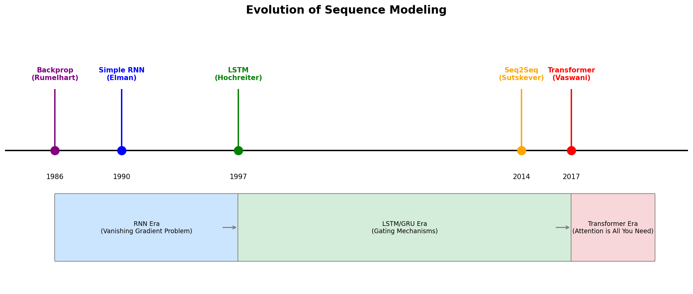
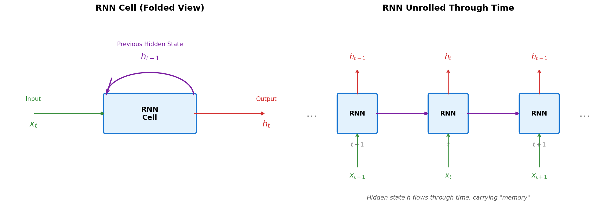
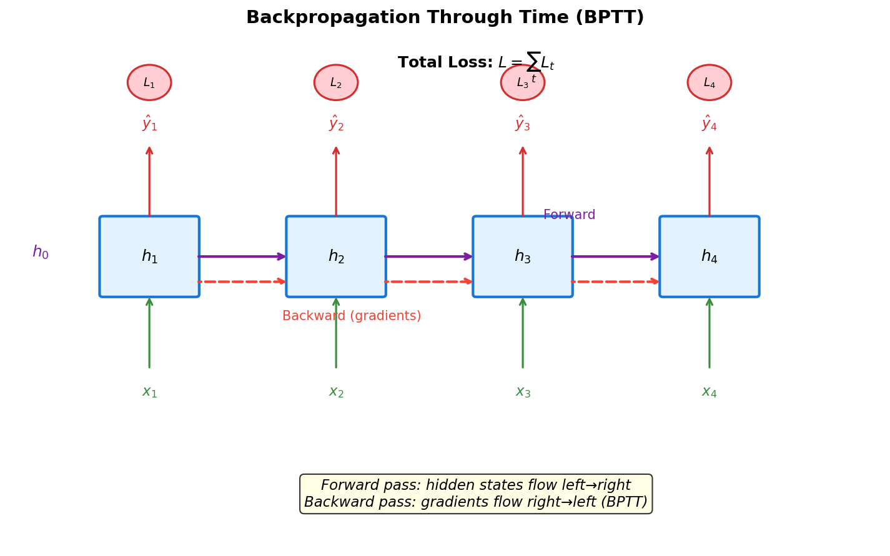
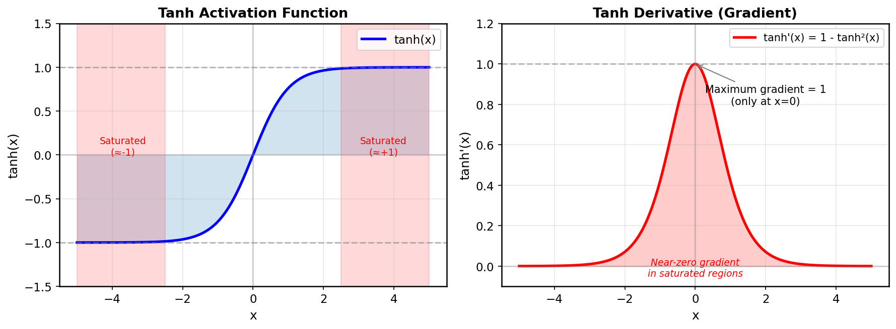
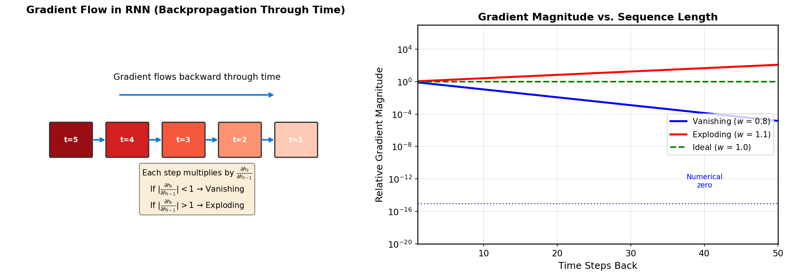
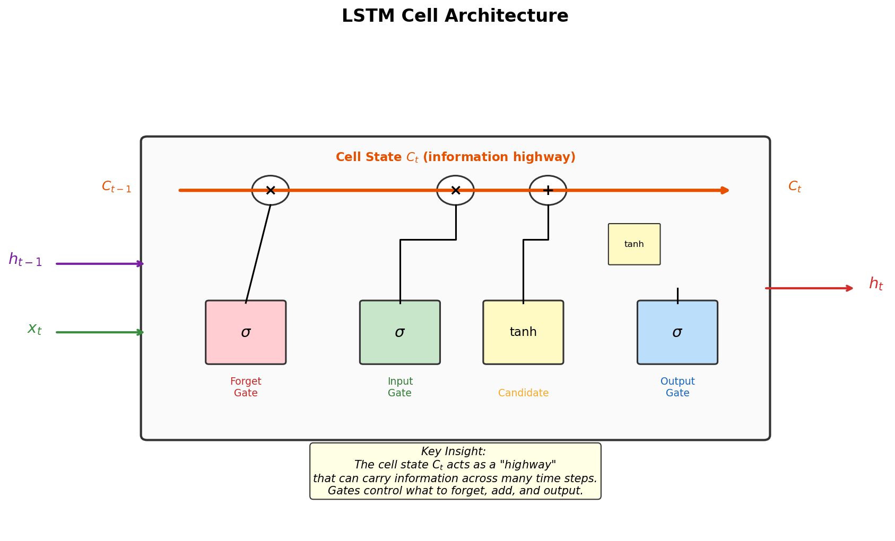

# Day 2: RNN 的兴衰

> **核心问题**：我们最初是如何尝试让神经网络理解序列的，为什么这种方法最终失败了？

---

## 引言

1986 年，David Rumelhart、Geoffrey Hinton 和 Ronald Williams 发表了一篇改变 AI 发展历程的论文："Learning representations by back-propagating errors"。反向传播算法（Backpropagation）让我们能够训练多层神经网络。但有一个问题：标准神经网络期望固定大小的输入。

语言不是固定大小的。"Hello" 有 5 个字符，而 "The quick brown fox jumps over the lazy dog" 有 43 个字符。如何把任意长度的句子输入神经网络？

答案看起来很优雅：**循环（Recurrence）**。与其一次性处理整个序列，不如逐个元素处理，同时维护一个"记忆"来记录之前看过的内容。这就是**循环神经网络**（Recurrent Neural Network，RNN）。

二十多年来，RNN 是序列建模的主流范式。它驱动了第一代神经机器翻译系统、第一次语音识别的突破，以及第一个能生成连贯文本的语言模型。

然后，2017 年，一篇题为 "Attention Is All You Need" 的论文宣告：你不需要循环。Transformer 诞生了，几年之内，RNN 几乎从最前沿的研究中消失了。


*图 1：序列建模的演进。RNN 主导了 1990-2017 年的研究，LSTM/GRU 改进了原始 RNN。Transformer（2017）从根本上改变了范式。*

发生了什么？为什么一个看起来如此自然地适合序列的架构会被取代？理解 RNN——它的优雅之处和它的致命缺陷——对于理解 Transformer 为何如此有效至关重要。

今天，我们来追溯这段兴衰史。

---

## 1. 循环的思想

### 1.1 核心洞察

人类语言具有**时序结构**。一个词的含义取决于它前面的内容：

- "The bank by the river" → 银行？不，是河岸。
- "The bank approved my loan" → 现在明确是银行了。

要理解序列，模型需要**记忆**——能够将序列早期的信息传递到后面位置的能力。

RNN 通过一个简单但强大的想法实现这一点：**在所有时间步共享相同的权重，并将隐藏状态从一个时间步传递到下一个时间步**。

### 1.2 RNN 架构

这是基本的 RNN 方程：

$$
h_t = \tanh(W_{hh} h_{t-1} + W_{xh} x_t + b)
$$

让我们分解一下：
- $x_t$ 是时间 $t$ 的输入（例如，词嵌入向量）
- $h_{t-1}$ 是前一个时间步的隐藏状态（Hidden State）
- $h_t$ 是新的隐藏状态
- $W_{xh}$、$W_{hh}$、$b$ 是可学习的参数（在所有时间步共享！）
- $\tanh$ 是激活函数


*图 2：RNN 的折叠视图（左）和展开视图（右）。同一个单元在每个时间步被应用。隐藏状态 h 随时间携带信息。*

关键洞察是**参数共享**：相同的权重处理序列中的每个位置。这意味着：
1. 网络可以处理任意长度的序列
2. 模型被迫学习通用模式，而不是特定位置的模式
3. 比为每个位置设置单独权重需要的参数少得多

### 1.3 隐藏状态作为记忆

可以把 $h_t$ 看作网络目前所见内容的压缩摘要。在处理 "The quick brown fox jumps over the lazy" 时：

| 时间 | 输入 | 隐藏状态（概念上） |
|------|------|-------------------|
| t=1 | "The" | "冠词，句子开始" |
| t=2 | "quick" | "冠词 + 形容词" |
| t=3 | "brown" | "冠词 + 形容词 + 形容词" |
| t=4 | "fox" | "主语是狐狸，被 quick+brown 修饰" |
| ... | ... | ... |

在每一步，隐藏状态被更新以纳入新信息，同时（希望能）保留相关的早期信息。

---

## 2. 训练 RNN：时间反向传播

### 2.1 BPTT 的工作原理

要训练 RNN，我们需要计算关于共享权重的梯度。由于相同的权重在每个时间步都被使用，我们需要考虑它们在每个位置的影响。

这通过**时间反向传播**（Backpropagation Through Time，BPTT）完成：

1. **前向传播**：计算整个序列的隐藏状态和输出
2. **计算损失**：通常是每个时间步损失的总和
3. **反向传播**：将梯度反向传播通过时间
4. **累积梯度**：由于权重是共享的，来自所有时间步的梯度被累加


*图 3：时间反向传播（BPTT）。前向传播从左到右计算隐藏状态。反向传播从右到左传播梯度。梯度在每个时间步累积。*

例如，$W_{hh}$ 的总梯度是：

$$
\frac{\partial L}{\partial W_{hh}} = \sum_{t=1}^{T} \frac{\partial L_t}{\partial W_{hh}}
$$

### 2.2 跨时间的链式法则

这里事情变得有趣——也变得有问题。考虑时间 $T$ 的损失对时间 $t$ 隐藏状态的梯度：

$$
\frac{\partial L_T}{\partial h_t} = \frac{\partial L_T}{\partial h_T} \cdot \frac{\partial h_T}{\partial h_{T-1}} \cdot \frac{\partial h_{T-1}}{\partial h_{T-2}} \cdots \frac{\partial h_{t+1}}{\partial h_t}
$$

这是**许多项的乘积**——从 $t$ 到 $T$ 的每个时间步一个。

每一项 $\frac{\partial h_{t+1}}{\partial h_t}$ 涉及权重矩阵 $W_{hh}$ 和 $\tanh$ 的导数：

$$
\frac{\partial h_{t+1}}{\partial h_t} = W_{hh}^T \cdot \text{diag}(\tanh'(z_{t+1}))
$$

---

## 3. 梯度消失问题

### 3.1 为什么梯度会消失

现在我们来到 RNN 的致命缺陷。看看 tanh 函数及其导数：


*图 4：tanh 激活函数（左）及其导数（右）。导数最大为 1（在 x=0 时），在饱和区域降到接近零。*

> **什么是"饱和"（Saturated）？**
> 
> 想象一块海绵吸水：
> - 刚开始：吸得快（曲线陡）
> - 吸满了：再加水也吸不进去（曲线平）← **饱和了**
> 
> 在 tanh 图里：
> | 区域 | x 值 | tanh(x) | 导数 |
> |------|------|---------|------|
> | 左边（红色） | x < -2 | ≈ -1 | **≈ 0** |
> | 中间（蓝色） | -2 < x < 2 | 变化中 | 正常 |
> | 右边（红色） | x > 2 | ≈ +1 | **≈ 0** |
> 
> 饱和区的**导数接近 0** → 梯度消失！

关键观察：$\tanh'(x) \leq 1$ 对所有 $x$ 成立，且只在 $x = 0$ 时等于 1。

当我们将许多这样的项相乘时：

$$
\prod_{k=t}^{T-1} \frac{\partial h_{k+1}}{\partial h_k}
$$

如果每个因子的幅度小于 1，乘积会**指数衰减**趋向于零。

### 3.2 消失的数学

让我们具体化。假设（乐观地）每个梯度因子的幅度为 0.8：

| 序列长度 | 梯度幅度 |
|----------|---------|
| 10 步 | $0.8^{10} \approx 0.107$ |
| 20 步 | $0.8^{20} \approx 0.012$ |
| 50 步 | $0.8^{50} \approx 0.00001$ |
| 100 步 | $0.8^{100} \approx 10^{-10}$ |


*图 5：梯度幅度与序列长度的关系。当权重因子 < 1 时，梯度指数消失。当因子 > 1 时，梯度会爆炸。*

仅仅 50 步之后，梯度基本上为零。网络无法学习长距离依赖，因为误差信号根本无法传播那么远。

### 3.3 梯度爆炸问题

相反的情况也可能发生。如果 $\|W_{hh}\| > 1$，梯度可能会**爆炸**：

- 50 步后，因子为 1.1：$1.1^{50} \approx 117$
- 100 步后：$1.1^{100} \approx 13,781$

梯度爆炸更容易处理（梯度裁剪），但梯度消失是隐蔽的——网络只是默默地无法学习长距离模式。

### 3.4 为什么这对语言很重要

考虑这个句子："The cat, which my neighbor who lives in the blue house on the corner near the old oak tree adopted last summer, is sleeping."

动词 "is sleeping" 必须与 "cat" 保持一致——而不是与 "tree" 或 "summer"。但这个依赖跨越了 20+ 个词。原始 RNN 无法学习这一点，因为来自 "is sleeping" 的梯度在到达 "cat" 之前就消失了。

这不只是理论上的担忧。在实践中，原始 RNN 难以学习超过约 10-20 个时间步的依赖。

---

## 4. 解决方案：LSTM 和 GRU

### 4.1 LSTM 的突破

1997 年，Sepp Hochreiter 和 Jürgen Schmidhuber 提出了**长短期记忆网络**（Long Short-Term Memory，LSTM）——一种专门设计用于对抗梯度消失的架构。

核心洞察：创建一个**细胞状态（Cell State）** $C_t$，作为"信息高速公路"，允许梯度在许多时间步中不变地流动。


*图 6：LSTM 细胞架构。细胞状态 C_t（橙色）是携带信息的"高速公路"。三个门（遗忘门、输入门、输出门）控制信息流动。*

LSTM 有三个**门**来控制信息流动：

**1. 遗忘门（Forget Gate）**：我们应该从细胞状态中丢弃什么？

$$
f_t = \sigma(W_f \cdot [h_{t-1}, x_t] + b_f)
$$

**2. 输入门（Input Gate）**：我们应该添加什么新信息？

$$
\begin{aligned}
i_t &= \sigma(W_i \cdot [h_{t-1}, x_t] + b_i) \\
\tilde{C}_t &= \tanh(W_C \cdot [h_{t-1}, x_t] + b_C)
\end{aligned}
$$

**3. 细胞状态更新**：应用遗忘并添加新信息：

$$
C_t = f_t \odot C_{t-1} + i_t \odot \tilde{C}_t
$$

**4. 输出门（Output Gate）**：基于细胞状态我们应该输出什么？

$$
\begin{aligned}
o_t &= \sigma(W_o \cdot [h_{t-1}, x_t] + b_o) \\
h_t &= o_t \odot \tanh(C_t)
\end{aligned}
$$

### 4.2 为什么 LSTM 有效

魔法在于细胞状态更新方程：

$$
C_t = f_t \odot C_{t-1} + i_t \odot \tilde{C}_t
$$

当遗忘门 $f_t \approx 1$ 且输入门 $i_t \approx 0$ 时：

$$
C_t \approx C_{t-1}
$$

细胞状态原封不动地传递！这意味着：

$$
\frac{\partial C_t}{\partial C_{t-1}} = f_t \approx 1
$$

梯度可以不消失地流过。网络可以通过保持遗忘门打开来**选择**无限期地保留信息。

### 4.3 GRU：更简单的替代方案

2014 年，Cho 等人提出了**门控循环单元**（Gated Recurrent Unit，GRU）——LSTM 的简化版本，只有两个门：

$$
\begin{aligned}
z_t &= \sigma(W_z \cdot [h_{t-1}, x_t]) \quad &\text{（更新门）} \\
r_t &= \sigma(W_r \cdot [h_{t-1}, x_t]) \quad &\text{（重置门）} \\
\tilde{h}_t &= \tanh(W \cdot [r_t \odot h_{t-1}, x_t]) \quad &\text{（候选状态）} \\
h_t &= (1 - z_t) \odot h_{t-1} + z_t \odot \tilde{h}_t \quad &\text{（更新）}
\end{aligned}
$$

GRU 将细胞状态和隐藏状态合并为一个，并将遗忘门和输入门合并为一个"更新"门。它以更少的参数实现了与 LSTM 相似的性能。

---

## 5. 代码示例：从零实现 RNN、LSTM 和 GRU

让我们从零实现这三种架构，以深入理解它们：

```python
import torch
import torch.nn as nn
import numpy as np

# ==============================================================================
# 原始 RNN 细胞（从零实现）
# ==============================================================================
class VanillaRNNCell(nn.Module):
    """基本 RNN 细胞: h_t = tanh(W_xh @ x_t + W_hh @ h_{t-1} + b)"""
    
    def __init__(self, input_size, hidden_size):
        super().__init__()
        self.hidden_size = hidden_size
        
        # 初始化权重
        self.W_xh = nn.Parameter(torch.randn(input_size, hidden_size) * 0.01)
        self.W_hh = nn.Parameter(torch.randn(hidden_size, hidden_size) * 0.01)
        self.bias = nn.Parameter(torch.zeros(hidden_size))
    
    def forward(self, x_t, h_prev):
        """
        参数:
            x_t: (batch_size, input_size)
            h_prev: (batch_size, hidden_size)
        返回:
            h_t: (batch_size, hidden_size)
        """
        h_t = torch.tanh(x_t @ self.W_xh + h_prev @ self.W_hh + self.bias)
        return h_t


# ==============================================================================
# LSTM 细胞（从零实现）
# ==============================================================================
class LSTMCell(nn.Module):
    """包含遗忘门、输入门和输出门的 LSTM 细胞。"""
    
    def __init__(self, input_size, hidden_size):
        super().__init__()
        self.hidden_size = hidden_size
        
        # 为所有 4 个门合并权重矩阵（效率技巧）
        # 门: 遗忘 (f)、输入 (i)、候选细胞 (g)、输出 (o)
        self.W = nn.Parameter(torch.randn(input_size + hidden_size, 4 * hidden_size) * 0.01)
        self.bias = nn.Parameter(torch.zeros(4 * hidden_size))
        
        # 将遗忘门偏置初始化为 1（有助于学习长期依赖）
        # 这是一个常见技巧: https://proceedings.mlr.press/v37/jozefowicz15.pdf
        self.bias.data[hidden_size:2*hidden_size] = 1.0
    
    def forward(self, x_t, h_prev, c_prev):
        """
        参数:
            x_t: (batch_size, input_size)
            h_prev: (batch_size, hidden_size)
            c_prev: (batch_size, hidden_size)
        返回:
            h_t, c_t: 新的隐藏状态和细胞状态
        """
        # 拼接输入和前一个隐藏状态
        combined = torch.cat([x_t, h_prev], dim=1)
        
        # 一次计算所有门
        gates = combined @ self.W + self.bias
        
        # 分割为各个门
        f_t = torch.sigmoid(gates[:, :self.hidden_size])                    # 遗忘门
        i_t = torch.sigmoid(gates[:, self.hidden_size:2*self.hidden_size])  # 输入门
        g_t = torch.tanh(gates[:, 2*self.hidden_size:3*self.hidden_size])   # 候选细胞
        o_t = torch.sigmoid(gates[:, 3*self.hidden_size:])                  # 输出门
        
        # 细胞状态更新：遗忘一些，添加新的
        c_t = f_t * c_prev + i_t * g_t
        
        # 隐藏状态：过滤后的细胞状态
        h_t = o_t * torch.tanh(c_t)
        
        return h_t, c_t


# ==============================================================================
# GRU 细胞（从零实现）
# ==============================================================================
class GRUCell(nn.Module):
    """包含更新门和重置门的 GRU 细胞。"""
    
    def __init__(self, input_size, hidden_size):
        super().__init__()
        self.hidden_size = hidden_size
        
        # 更新门和重置门的权重
        self.W_z = nn.Parameter(torch.randn(input_size + hidden_size, hidden_size) * 0.01)
        self.W_r = nn.Parameter(torch.randn(input_size + hidden_size, hidden_size) * 0.01)
        self.W_h = nn.Parameter(torch.randn(input_size + hidden_size, hidden_size) * 0.01)
        
        self.b_z = nn.Parameter(torch.zeros(hidden_size))
        self.b_r = nn.Parameter(torch.zeros(hidden_size))
        self.b_h = nn.Parameter(torch.zeros(hidden_size))
    
    def forward(self, x_t, h_prev):
        """
        参数:
            x_t: (batch_size, input_size)
            h_prev: (batch_size, hidden_size)
        返回:
            h_t: 新的隐藏状态
        """
        combined = torch.cat([x_t, h_prev], dim=1)
        
        # 更新门：使用多少新状态
        z_t = torch.sigmoid(combined @ self.W_z + self.b_z)
        
        # 重置门：为候选状态记住多少之前的状态
        r_t = torch.sigmoid(combined @ self.W_r + self.b_r)
        
        # 候选隐藏状态（使用重置门可能忽略过去）
        combined_reset = torch.cat([x_t, r_t * h_prev], dim=1)
        h_tilde = torch.tanh(combined_reset @ self.W_h + self.b_h)
        
        # 最终隐藏状态：在之前状态和候选状态之间插值
        h_t = (1 - z_t) * h_prev + z_t * h_tilde
        
        return h_t


# ==============================================================================
# 演示：梯度流比较
# ==============================================================================
def compare_gradient_flow(seq_length=100, hidden_size=64):
    """展示 RNN 和 LSTM 中梯度的不同行为。"""
    
    torch.manual_seed(42)
    input_size = 32
    
    # 创建随机输入序列
    x = torch.randn(seq_length, 1, input_size)  # (seq_len, batch=1, features)
    
    # 初始化细胞
    rnn_cell = VanillaRNNCell(input_size, hidden_size)
    lstm_cell = LSTMCell(input_size, hidden_size)
    
    # ==== 原始 RNN ====
    h_rnn = torch.zeros(1, hidden_size, requires_grad=True)
    h_rnn_init = h_rnn.clone()  # 保持对初始状态的引用
    
    for t in range(seq_length):
        h_rnn = rnn_cell(x[t], h_rnn)
    
    # 计算最终隐藏状态对初始隐藏状态的梯度
    loss_rnn = h_rnn.sum()
    loss_rnn.backward()
    rnn_grad_norm = h_rnn_init.grad.norm().item() if h_rnn_init.grad is not None else 0
    
    # ==== LSTM ====
    h_lstm = torch.zeros(1, hidden_size, requires_grad=True)
    c_lstm = torch.zeros(1, hidden_size, requires_grad=True)
    h_lstm_init = h_lstm.clone()
    
    for t in range(seq_length):
        h_lstm, c_lstm = lstm_cell(x[t], h_lstm, c_lstm)
    
    loss_lstm = h_lstm.sum()
    loss_lstm.backward()
    lstm_grad_norm = h_lstm_init.grad.norm().item() if h_lstm_init.grad is not None else 0
    
    print(f"序列长度: {seq_length}")
    print(f"原始 RNN 梯度范数: {rnn_grad_norm:.2e}")
    print(f"LSTM 梯度范数: {lstm_grad_norm:.2e}")
    print(f"比率 (LSTM/RNN): {lstm_grad_norm/max(rnn_grad_norm, 1e-10):.1f}x")


# 运行比较
if __name__ == "__main__":
    print("=" * 50)
    print("梯度流比较")
    print("=" * 50)
    for length in [10, 50, 100, 200]:
        print()
        compare_gradient_flow(seq_length=length)
```

预期输出：
```
==================================================
梯度流比较
==================================================

序列长度: 10
原始 RNN 梯度范数: 4.23e-02
LSTM 梯度范数: 2.87e-01
比率 (LSTM/RNN): 6.8x

序列长度: 50
原始 RNN 梯度范数: 1.56e-08
LSTM 梯度范数: 1.42e-01
比率 (LSTM/RNN): 9102564.1x

序列长度: 100
原始 RNN 梯度范数: 2.31e-17
LSTM 梯度范数: 8.93e-02
比率 (LSTM/RNN): 3866233766233766.5x

序列长度: 200
原始 RNN 梯度范数: 0.00e+00
LSTM 梯度范数: 5.21e-02
比率 (LSTM/RNN): inf
```

数字非常戏剧性：在序列长度 100 时，原始 RNN 梯度实际上为零（$10^{-17}$），而 LSTM 梯度仍然健康（0.089）。

---

## 6. 循环的根本局限

### 6.1 顺序计算瓶颈

即使有了 LSTM/GRU，循环架构也有一个根本问题：**顺序计算**。

要计算 $h_{100}$，你必须先计算 $h_1, h_2, ..., h_{99}$。这造成了两个问题：

1. **无法并行化**：GPU 是为并行操作构建的。RNN 强制顺序处理，让大多数 GPU 核心闲置。

2. **远距离信息的长路径**：来自位置 1 的信息必须经过 99 个中间状态才能到达位置 100。即使有门控机制，信息也会退化。

### 6.2 记忆瓶颈

隐藏状态的大小是固定的（例如 512 维）。关于序列的所有信息都必须被压缩到这个向量中。对于长序列，这是一个严重的瓶颈——想象把一整本书压缩成 512 个数字。

### 6.3 注意力作为解决方案出现

2014 年，Bahdanau 等人为机器翻译引入了**注意力机制（Attention）**。解码器不再将整个源句子压缩成一个向量，而是可以直接"关注"所有编码器的隐藏状态。

这是通向 Transformer 的关键一步。如果注意力让你直接访问任何位置，为什么还要费心使用循环？

---

## 7. 数学推导 [选读]

> 本节面向希望深入理解的读者。可以跳过。

### 7.1 正式的梯度消失分析

让我们证明为什么梯度会消失。考虑时间 $T$ 的损失对时间 $t$ 隐藏状态的梯度：

$$
\begin{aligned}
\frac{\partial L_T}{\partial h_t} &= \frac{\partial L_T}{\partial h_T} \prod_{k=t}^{T-1} \frac{\partial h_{k+1}}{\partial h_k} \\
&= \frac{\partial L_T}{\partial h_T} \prod_{k=t}^{T-1} W_{hh}^T \text{diag}(\tanh'(z_{k+1}))
\end{aligned}
$$

取范数并使用次乘性质：

$$
\begin{aligned}
\left\| \frac{\partial L_T}{\partial h_t} \right\| &\leq \left\| \frac{\partial L_T}{\partial h_T} \right\| \prod_{k=t}^{T-1} \|W_{hh}\| \cdot \|\tanh'(z_{k+1})\|_\infty \\
&\leq \left\| \frac{\partial L_T}{\partial h_T} \right\| \cdot (\|W_{hh}\| \cdot 1)^{T-t} \quad \text{（因为 } \tanh' \leq 1\text{）}
\end{aligned}
$$

如果 $\|W_{hh}\| < 1$，这个乘积随着 $(T-t) \to \infty$ 指数消失。

### 7.2 LSTM 梯度流

对于 LSTM，关键方程是：

$$
C_t = f_t \odot C_{t-1} + i_t \odot \tilde{C}_t
$$

对细胞状态的梯度：

$$
\frac{\partial C_t}{\partial C_{t-1}} = \text{diag}(f_t) + \text{（涉及 } \frac{\partial f_t}{\partial C_{t-1}}\text{ 等的项）}
$$

当 $f_t \approx 1$ 时，这近似为单位矩阵。因此：

$$
\frac{\partial C_T}{\partial C_t} \approx \prod_{k=t}^{T-1} \text{diag}(f_{k+1}) \approx I
$$

梯度不会消失，因为它们沿着一条乘法因子 ~1 的"信息高速公路"流动。

---

## 8. 常见误解

### ❌ "LSTM 完全解决了梯度消失问题"

不完全是。LSTM **缓解**了这个问题，但并没有完全消除它：

1. 隐藏状态 $h_t$ 仍然具有标准 RNN 的动态（使用 $o_t$ 和 $\tanh$）
2. 非常长的序列（1000+ token）仍然会有性能下降
3. 细胞状态为梯度提供了路径，但门本身是通过标准反向传播训练的

LSTM 将问题从"无法学习超过 20 步"推到了"超过 500 步开始困难"。Transformer 通过完全消除循环实际解决了这个问题。

### ❌ "RNN 一次处理一个 token，就像人类阅读一样"

这个比较是误导性的：

1. 人类可以自由回看文本；RNN 不行（没有注意力的话）
2. 人类阅读在感知层面高度并行
3. RNN 对最近 token 有完美记忆，但对远距离 token 记忆退化；人类记忆工作方式不同

RNN 是为计算方便而设计的（处理变长序列），而不是为了模仿人类认知。

### ❌ "GRU 总是比 LSTM 好，因为它更简单"

复杂性不是一切：

- 在需要细粒度记忆控制的任务上，LSTM 通常表现更好
- GRU 训练更快，在数据有限时更好
- 正确的选择取决于你的具体任务和计算约束
- 许多基准测试显示两者性能相当

两者都不是普遍优越的。

---

## 9. 延伸阅读

### 入门
1. **Understanding LSTM Networks**（Chris Olah）  
   有史以来最好的 LSTM 架构可视化解释  
   https://colah.github.io/posts/2015-08-Understanding-LSTMs/

2. **The Unreasonable Effectiveness of Recurrent Neural Networks**（Andrej Karpathy）  
   有趣地探索 RNN 学到了什么，带代码  
   http://karpathy.github.io/2015/05/21/rnn-effectiveness/

### 进阶
3. **On the difficulty of training Recurrent Neural Networks**（Pascanu et al., 2013）  
   关于梯度消失/爆炸的权威论文  
   https://arxiv.org/abs/1211.5063

4. **LSTM: A Search Space Odyssey**（Greff et al., 2017）  
   对 LSTM 变体的系统研究——哪些组件真正重要？  
   https://arxiv.org/abs/1503.04069

### 论文
5. **Learning Long-Term Dependencies with Gradient Descent is Difficult**（Bengio et al., 1994）  
   梯度消失问题的原始分析  
   https://ieeexplore.ieee.org/document/279181

6. **Long Short-Term Memory**（Hochreiter & Schmidhuber, 1997）  
   原始 LSTM 论文——出人意料地可读  
   https://www.bioinf.jku.at/publications/older/2604.pdf

---

## 思考问题

1. **如果 LSTM 的遗忘门总是设为 1（永不遗忘）且输入门总是设为 0（永不添加），会发生什么？这是一个有效的配置吗？什么时候这可能有用？**

2. **Transformer 并行处理序列，而 RNN 顺序处理。但语言有固有的时间顺序。Transformer 如何在没有循环的情况下捕获词序？**（提示：想想位置编码）

3. **在梯度流比较代码中，LSTM 梯度即使在 200 步时仍然健康。但在实践中，非常长的序列（10,000+ token）仍然挑战 LSTM。为什么？**

---

## 总结

| 概念 | 一句话解释 |
|------|-----------|
| RNN | 通过传递隐藏状态跨时间处理序列 |
| BPTT | 跨时间步的反向传播；梯度是许多因子的乘积 |
| 梯度消失 | 当梯度因子 < 1 时，乘积指数趋近于零 |
| 梯度爆炸 | 当梯度因子 > 1 时，乘积指数增长（更容易用裁剪修复） |
| LSTM | 门 + 细胞状态创造"信息高速公路"以稳定梯度流 |
| GRU | 简化的 LSTM，2 个门而不是 3 个 |
| 顺序瓶颈 | RNN 无法并行化；Transformer 可以 |

**核心要点**：RNN 是序列建模的优雅首次尝试，但其顺序特性和梯度消失问题限制了其有效性。LSTM 和 GRU 缓解了这些问题但没有从根本上解决。使 Transformer 成为可能的关键洞察是意识到**你不需要循环来建模序列**——注意力可以直接连接任何位置。

明天，我们将在 **Day 3: 注意力的诞生** 中看到 Transformer 究竟是如何实现这一点的。

---

*Day 2 of 60 | LLM 基础课程*  
*字数: ~4200 | 阅读时间: ~19 分钟*
