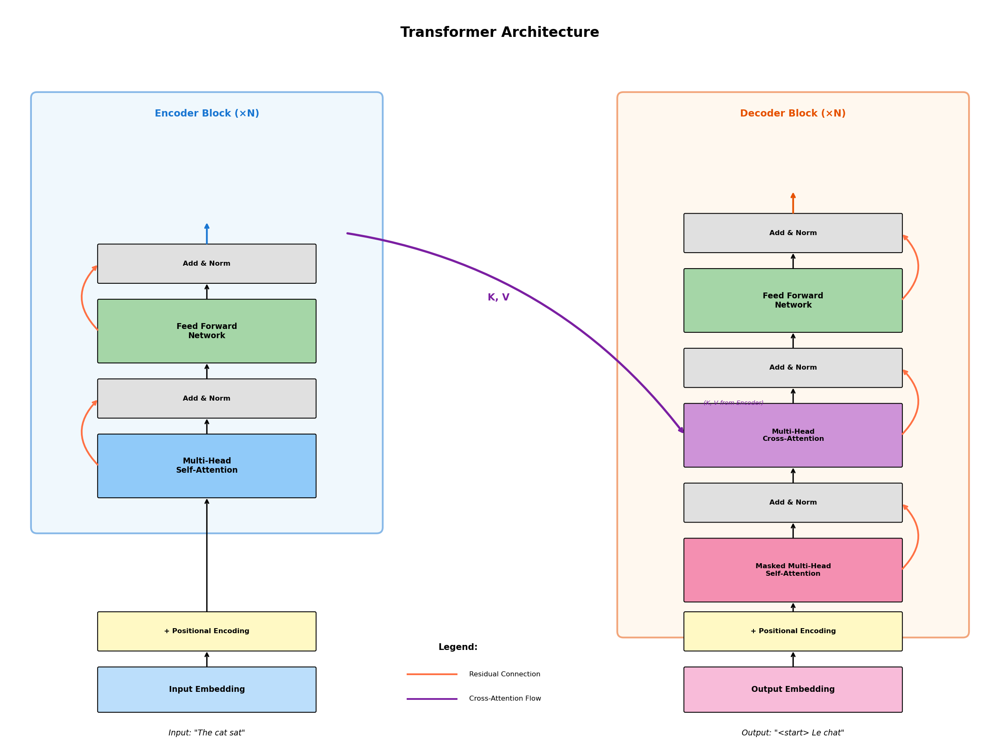
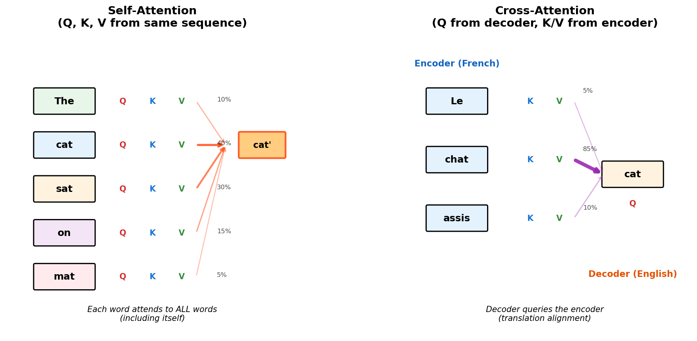
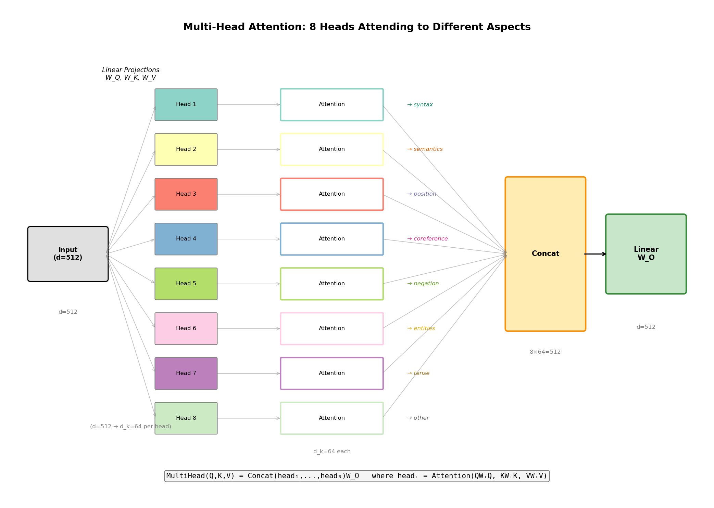
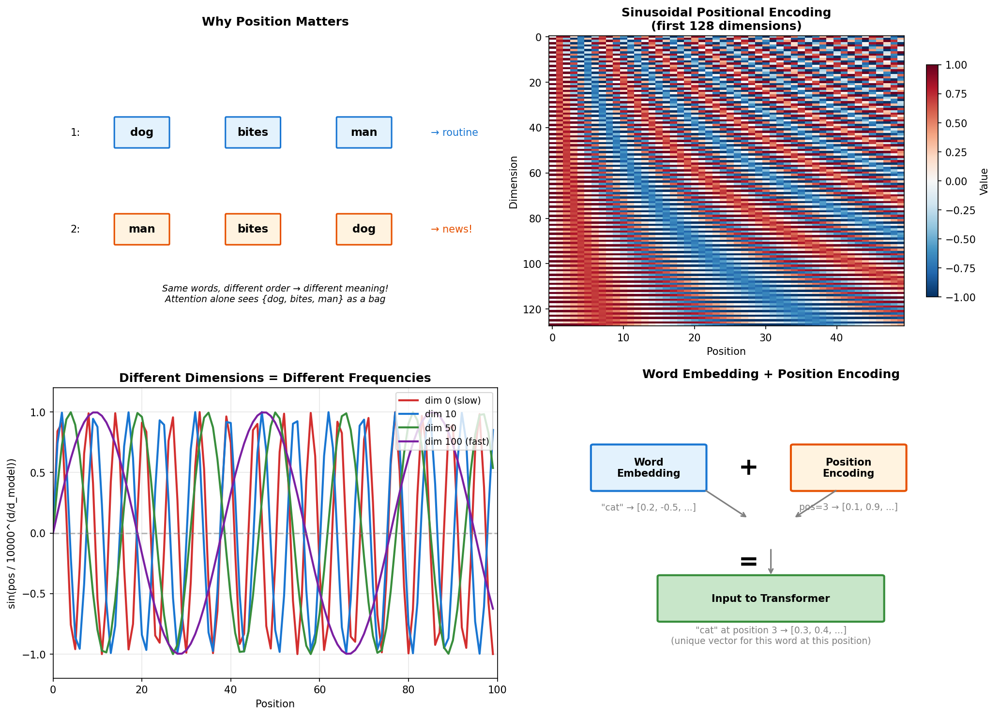
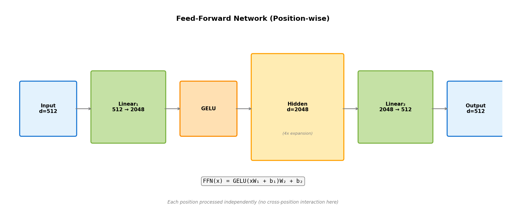
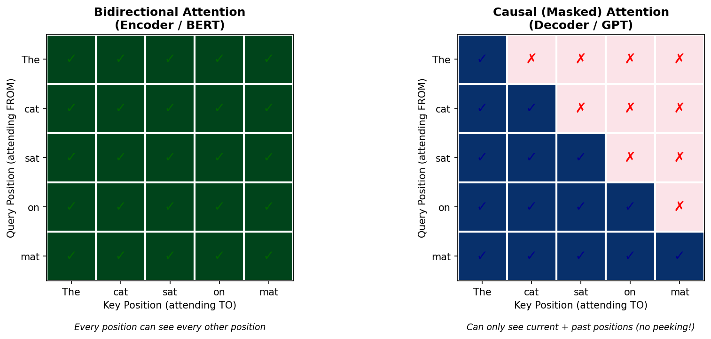

# Day 4: Transformer 架构深度解析

> **核心问题**：自注意力、多头注意力和位置编码如何协同工作构建 Transformer？

---

## 引言

2017 年 6 月 12 日，一篇论文出现在 arXiv 上，标题令人瞠目结舌："Attention Is All You Need"（注意力就是全部）。这种说法看起来几乎很天真——除了注意力，肯定还需要*别的东西*吧？卷积？循环？*总得有点什么吧？*

但作者们并非在虚张声势。他们仅使用注意力机制就构建了一个架构，在机器翻译任务上粉碎了当时的最先进水平。这个模型叫做 **Transformer**。


*图 1：完整的 Transformer 架构。编码器（左）处理输入序列；解码器（右）生成输出序列。交叉注意力连接它们，允许解码器"查看"编码器输出。残差连接（橙色线）帮助梯度流动。*

是什么让这个架构如此具有革命性？为什么从那以后的每一个主要语言模型——BERT、GPT、T5、LLaMA、Claude——都建立在 Transformer 上？

昨天我们学习了注意力：让模型动态关注输入相关部分的机制。今天我们深入探究。我们将理解：

1. **自注意力 vs. 交叉注意力**：有什么区别，什么时候使用各自？
2. **多头注意力**：为什么使用多个注意力"头"，它们学到什么？
3. **位置编码**：Transformer 如何在没有循环的情况下知道词序？
4. **完整架构**：这些组件如何结合成编码器-解码器结构

最终，你不仅会理解 Transformer *做什么*，还会明白*为什么*存在每个组件。

---

## 1. 自注意力：词语之间的对话

### 1.1 关键洞察

在 Day 3 中，我们在翻译语境中看到了注意力：解码器关注编码器输出以决定哪些源词对当前目标词重要。那是**交叉注意力**——查询来自一个序列，键/值来自另一个序列。

但 Transformer 引入了更强大的东西：**自注意力**，即序列关注自身。

考虑句子："The dog chased the cat because **it** was hungry."

"it" 指什么？人类知道是 "the dog"，而不是 "the cat"。但模型如何理解这一点？

通过自注意力，当处理 "it" 时，模型计算对所有之前词的注意力权重。如果训练得当，它学会给 "dog" 分配高权重——因为从语义上讲，狗会饿，猫在这个语境中不太可能是主语。


*图 2：自注意力（左）：每个词关注同一序列中的所有词，包括自身。交叉注意力（右）：解码器词关注编码器词，实现翻译对齐。*

### 1.2 机制原理

自注意力是与 Day 3 相同的注意力机制，但 Q、K 和 V 都来自**同一序列**：

```
输入: X = [x₁, x₂, ..., xₙ]  (每个 xᵢ 是一个嵌入向量)

Q = XW_Q    # 查询："我在寻找什么？"
K = XW_K    # 键："我包含什么？"  
V = XW_V    # 值："我提供什么？"

Attention(Q, K, V) = softmax(QK^T / √d_k) V
```

结果是每个位置的新表示，用来自所有其他位置的信息丰富。

> **图书馆比喻再访**
> 
> 在自注意力中，你不是在搜索图书馆——你在小组讨论中：
> - **查询（Query）**：你的问题（"'it' 指什么？"）
> - **键（Keys）**：每个人的专长标签（"我懂狗"、"我懂猫"）
> - **值（Values）**：每个人被问及时实际贡献的内容
> 
> 你提出问题，检查每个人的标签，根据相关性加权他们的贡献。

### 1.3 为什么自注意力重要

自注意力赋予 Transformer 两个 RNN 缺乏的超能力：

**1. 一步获得全局上下文**

RNN 顺序处理——来自词 1 的信息必须通过词 2、3、... 才能到达词 100。到那时，信息已经稀释了。

自注意力直接连接每个词与每个其他词。词 100 可以"看到"词 1，无需任何中间步骤。路径长度是 O(1)，不是 O(n)。

**2. 并行化**

RNN 本质上是顺序的——在计算 h₁ 到 h₉₉ 之前，你无法计算 h₁₀₀。

自注意力同时计算所有位置。在 GPU 上，这快得多。

| 特性 | RNN | 自注意力 |
|------|-----|----------|
| 路径长度（词 1 → 词 100） | O(n) | O(1) |
| 可并行化 | 否 | 是 |
| 训练速度 | 慢 | 快 |
| 长距离依赖 | 困难 | 处理良好 |

---

## 2. 多头注意力：以不同方式关注

### 2.1 为什么要多个头？

单头注意力计算一组注意力权重。但语言有多种类型的关系：

- **句法关系**："dog" 与 "chased" 相关（主语-动词）
- **语义关系**："dog" 与 "it" 相关（同指）
- **位置关系**："chased" 与 "the" 相关（动词后跟冠词）
- **否定关系**："not" 修饰 "happy"

一个注意力模式无法捕获所有这些。如果我们并行运行多次注意力，使用不同的学习投影呢？

这就是多头注意力。

### 2.2 工作原理

我们不使用一个大注意力，而是使用 `h` 个较小的注意力（头），每个维度为 `d_k = d_model / h`：


*图 3：8 头多头注意力。输入（d=512）投影到 8 个并行注意力计算（每个 d_k=64）。输出连接并投影回 d=512。每个头可以专门处理不同的关系类型。*

```python
# 典型配置：d_model=512, h=8, d_k=64
d_model = 512
h = 8
d_k = d_model // h  # = 64

# 每个头有自己的 W_Q, W_K, W_V，形状为 (d_model, d_k)
# 头 i 计算：head_i = Attention(Q @ W_Q_i, K @ W_K_i, V @ W_V_i)
# 最终输出：Concat(head_1, ..., head_h) @ W_O
```

数学表达：

$$
\begin{aligned}
\text{head}_i &= \text{Attention}(QW_i^Q, KW_i^K, VW_i^V) \\
\text{MultiHead}(Q, K, V) &= \text{Concat}(\text{head}_1, ..., \text{head}_h)W^O
\end{aligned}
$$

### 2.3 不同头学到什么？

研究分析了不同注意力头学到的内容：

| 头类型 | 关注内容 | 示例 |
|--------|----------|------|
| 句法 | 主谓宾关系 | "dog" → "chased" |
| 位置 | 相邻或附近词元 | 位置 i → 位置 i±1 |
| 分隔符 | 标点符号、句子边界 | 词 → [SEP] 标记 |
| 同指 | 代词与其指代对象 | "it" → "dog" |
| 稀有词元 | 不常见词（高信息量） | 任何 → "unprecedented" |

不同头通过训练自动专门化——没有人硬编码这些模式。

### 2.4 权衡：深度 vs. 头数

为什么不使用 512 个头，d_k=1？或 1 个头，d_k=512？

**太多头**（小 d_k）：每个头维度太少，无法学习有意义的模式。1 维注意力只能表示平凡关系。

**太少头**（大 d_k）：注意力模式多样性不够。你失去了并行透视的好处。

**实践中的最佳点**：
- GPT-2：12 头，d_k=64
- BERT：12 头，d_k=64
- GPT-3：96 头，d_k=128

比率 d_model/h 通常在 64 到 128 之间。

---

## 3. 位置编码：教袋子模型理解顺序

### 3.1 问题所在

自注意力有一个致命缺陷：**它不知道位置**。

考虑："dog bites man" vs. "man bites dog"

对于没有位置信息的自注意力，两者是相同的——都是 {dog, bites, man} 的袋子。注意力机制是**置换不变的**：打乱输入顺序不会改变输出。

但词序很重要！这两个句子意思相反。


*图 4：左上：相同词，不同顺序，不同含义。右上：正弦编码热力图——不同位置有独特模式。左下：不同维度捕获位置的不同"频率"。右下：词嵌入 + 位置编码 = 位置感知输入。*

### 3.2 解决方案：添加位置信息

Transformer 的解决方案很优雅：将位置编码**添加**到每个词嵌入。

```
transformer_input = word_embedding + positional_encoding
```

每个位置 p 获得独特的 d_model 维向量。添加到词嵌入后，结果唯一地标识了*什么*词元和*在哪里*。

### 3.3 正弦位置编码

原始 Transformer 使用正弦函数：

$$
\begin{aligned}
PE_{(pos, 2i)} &= \sin\left(\frac{pos}{10000^{2i/d_{model}}}\right) \\
PE_{(pos, 2i+1)} &= \cos\left(\frac{pos}{10000^{2i/d_{model}}}\right)
\end{aligned}
$$

其中：
- `pos` = 序列中的位置（0, 1, 2, ...）
- `i` = 维度索引（0, 1, 2, ..., d_model/2 - 1）
- 偶数维度使用正弦，奇数维度使用余弦

**为什么是正弦和余弦？**

1. **有界值**：总是在 -1 和 1 之间，与嵌入同一尺度
2. **独特模式**：每个位置有不同的正弦值组合
3. **相对位置**：对于任何固定的 k，PE(pos+k) 可以表示为 PE(pos) 的线性函数——这帮助模型学习相对关系
4. **泛化**：理论上可以外推到比训练时更长的序列

**频率直觉：**

不同维度以不同频率振荡：
- 维度 0：非常慢的振荡（在位置间逐渐变化）
- 维度 256：快速振荡（快速变化）

这就像在混合基数系统中表示位置。想想我们如何表示时间：小时变化慢，分钟变化更快，秒变化最快。位置编码类似地工作——不同维度捕获位置的不同"尺度"。

### 3.4 学习 vs. 固定位置编码

原始 Transformer 使用固定正弦编码。但你也可以**学习**位置嵌入作为参数：

```python
# 学习位置编码
position_embedding = nn.Embedding(max_seq_len, d_model)
# 每个位置 0, 1, 2, ... 有一个学习的 d_model 维向量
```

**比较：**

| 方法 | 优点 | 缺点 |
|------|------|------|
| 正弦（固定） | 外推到更长序列；参数更少 | 可能无法捕获特定任务的位置模式 |
| 学习 | 可以学习特定任务模式 | 无法外推超出 max_seq_len；参数更多 |

实践中：
- **GPT-2, BERT**：学习位置嵌入
- **原始 Transformer**：正弦
- **现代 LLM（GPT-4, LLaMA）**：RoPE（旋转位置嵌入）——一个巧妙的混合，我们稍后会介绍

---

## 4. 完整架构

### 4.1 编码器：理解输入

编码器的工作是构建输入序列的丰富表示。

**结构（重复 N 次）：**

```
输入嵌入 + 位置编码
        ↓
┌─────────────────────────┐
│   多头                  │ ← 输入上的自注意力
│   自注意力              │
├─────────────────────────┤
│   加法 & 归一化         │ ← 残差 + LayerNorm
├─────────────────────────┤
│   前馈                  │ ← 位置级变换
│   网络                  │
├─────────────────────────┤
│   加法 & 归一化         │ ← 残差 + LayerNorm
└─────────────────────────┘
        ↓
    (重复 N 次)
        ↓
    编码器输出
```

**要点：**

1. **残差连接**：将输入添加到每个子层的输出。这有助于梯度流动并实现训练非常深的网络。

2. **层归一化**：归一化激活以稳定训练。在每个残差连接后应用。

3. **前馈网络**：独立应用于每个位置的两层 MLP：


*图 5：位置级前馈网络。输入从 d=512 扩展到 d=2048，通过 GELU 激活，然后投影回 d=512。每个位置独立处理——这里没有跨位置信息。*

```
FFN(x) = GELU(xW₁ + b₁)W₂ + b₂
```

FFN 扩展到模型维度的 4 倍（512 → 2048），应用非线性，然后投影回去。这种扩展使模型能够学习复杂的位置级变换。

### 4.2 解码器：生成输出

解码器一次生成一个输出词元，同时关注自身（过去输出）和编码器（输入）。

**结构（重复 N 次）：**

```
输出嵌入 + 位置编码
        ↓
┌─────────────────────────┐
│   掩码多头              │ ← 自注意力（看不到未来！）
│   自注意力              │
├─────────────────────────┤
│   加法 & 归一化         │
├─────────────────────────┤
│   多头                  │ ← 对编码器的交叉注意力
│   交叉注意力            │
│   (Q 来自解码器,        │
│    K,V 来自编码器)      │
├─────────────────────────┤
│   加法 & 归一化         │
├─────────────────────────┤
│   前馈                  │
│   网络                  │
├─────────────────────────┤
│   加法 & 归一化         │
└─────────────────────────┘
        ↓
    (重复 N 次)
        ↓
    线性 + Softmax
        ↓
    P(下一个词元)
```

### 4.3 因果掩码：禁止偷看！

训练期间，我们将整个目标序列喂给解码器。但它不应该能够"偷看"未来词元——那是作弊！

**因果掩码**（也称"前瞻掩码"）阻止对未来位置的注意力：


*图 6：双向注意力（左）允许每个位置看到所有其他位置——用于编码器。因果注意力（右）只允许看到过去和现在——用于解码器。掩码在 softmax 前将未来位置设为 -∞，使其注意力权重为 0。*

数学上，我们在 softmax 前对位置 j > i 的注意力分数加 -∞：

```python
# 创建因果掩码
mask = torch.triu(torch.ones(seq_len, seq_len), diagonal=1) * float('-inf')
# [0, -inf, -inf, -inf]
# [0,  0,   -inf, -inf]
# [0,  0,    0,   -inf]
# [0,  0,    0,    0  ]

# 应用掩码到注意力分数
scores = (Q @ K.T) / sqrt(d_k)
scores = scores + mask  # 未来位置变成 -inf
weights = softmax(scores)  # -inf → 0 权重
```

softmax 后，具有 -∞ 分数的位置获得 0 注意力权重——它们实际上不可见。

### 4.4 交叉注意力：桥梁

交叉注意力连接编码器和解码器。解码器的表示成为查询，而编码器的输出提供键和值：

```
Q = decoder_hidden @ W_Q  # "我需要什么？"
K = encoder_output @ W_K  # "有什么可用的？"
V = encoder_output @ W_V  # "要检索什么？"
```

这正是 Day 3 翻译示例中的注意力机制——解码器"询问"编码器哪些输入词与生成当前输出词相关。

---

## 5. 为什么这个架构有效

### 5.1 分工

| 组件 | 职责 |
|------|------|
| 自注意力 | 建模词元间关系 |
| 多头 | 并行捕获不同类型关系 |
| 位置编码 | 注入序列顺序信息 |
| FFN | 添加非线性和位置级处理 |
| 残差 + LayerNorm | 实现深度堆叠，稳定训练 |
| 交叉注意力 | 桥接编码器和解码器 |

### 5.2 计算和内存

主导成本是自注意力，其复杂度为 O(n²)，其中 n 是序列长度：

- 每个词元关注每个其他词元：n × n 注意力矩阵
- 序列长度 1000：每头 100 万注意力分数
- 序列长度 100,000：每头 100 亿注意力分数

这种二次缩放是 Transformer 的致命弱点。在第 6 周，我们将学习 FlashAttention 和稀疏注意力方法来缓解这一问题。

### 5.3 为什么编码器-解码器用于翻译？

编码器-解码器结构自然映射到序列到序列任务：

1. **编码器**：处理整个输入，构建理解
2. **交叉注意力**：将输入对齐到输出
3. **解码器**：生成输出，以输入理解为条件

对于像文本生成（GPT）这样的任务，只需要解码器——没有单独的输入序列。

对于像分类（BERT）这样的任务，只需要编码器——没有生成的输出序列。

这种模块化是为什么 Transformer 成为几乎每个 NLP 架构骨干的原因。

---

## 6. 代码示例

简化的多头自注意力实现：

```python
import torch
import torch.nn as nn
import torch.nn.functional as F
import math

class MultiHeadAttention(nn.Module):
    def __init__(self, d_model=512, n_heads=8):
        super().__init__()
        self.d_model = d_model
        self.n_heads = n_heads
        self.d_k = d_model // n_heads
        
        # Q, K, V 的线性投影
        self.W_Q = nn.Linear(d_model, d_model)
        self.W_K = nn.Linear(d_model, d_model)
        self.W_V = nn.Linear(d_model, d_model)
        
        # 输出投影
        self.W_O = nn.Linear(d_model, d_model)
        
    def forward(self, query, key, value, mask=None):
        batch_size = query.size(0)
        
        # 1. 线性投影：(batch, seq_len, d_model)
        Q = self.W_Q(query)
        K = self.W_K(key)
        V = self.W_V(value)
        
        # 2. 重塑为 (batch, n_heads, seq_len, d_k)
        Q = Q.view(batch_size, -1, self.n_heads, self.d_k).transpose(1, 2)
        K = K.view(batch_size, -1, self.n_heads, self.d_k).transpose(1, 2)
        V = V.view(batch_size, -1, self.n_heads, self.d_k).transpose(1, 2)
        
        # 3. 缩放点积注意力
        # scores: (batch, n_heads, seq_len, seq_len)
        scores = torch.matmul(Q, K.transpose(-2, -1)) / math.sqrt(self.d_k)
        
        # 如果提供掩码则应用（用于因果注意力）
        if mask is not None:
            scores = scores.masked_fill(mask == 0, float('-inf'))
        
        # 在最后维度（键）上 Softmax
        attention_weights = F.softmax(scores, dim=-1)
        
        # 4. 将注意力应用到值
        # output: (batch, n_heads, seq_len, d_k)
        output = torch.matmul(attention_weights, V)
        
        # 5. 连接头：(batch, seq_len, d_model)
        output = output.transpose(1, 2).contiguous().view(batch_size, -1, self.d_model)
        
        # 6. 最终线性投影
        output = self.W_O(output)
        
        return output, attention_weights


class TransformerEncoderLayer(nn.Module):
    def __init__(self, d_model=512, n_heads=8, d_ff=2048, dropout=0.1):
        super().__init__()
        
        self.self_attention = MultiHeadAttention(d_model, n_heads)
        self.ffn = nn.Sequential(
            nn.Linear(d_model, d_ff),
            nn.GELU(),
            nn.Dropout(dropout),
            nn.Linear(d_ff, d_model),
            nn.Dropout(dropout)
        )
        
        self.norm1 = nn.LayerNorm(d_model)
        self.norm2 = nn.LayerNorm(d_model)
        self.dropout = nn.Dropout(dropout)
        
    def forward(self, x, mask=None):
        # 带残差的自注意力
        attn_output, _ = self.self_attention(x, x, x, mask)
        x = self.norm1(x + self.dropout(attn_output))
        
        # 带残差的 FFN
        ffn_output = self.ffn(x)
        x = self.norm2(x + ffn_output)
        
        return x


# 演示
if __name__ == "__main__":
    # 创建简单测试
    batch_size, seq_len, d_model = 2, 10, 512
    
    # 随机输入嵌入
    x = torch.randn(batch_size, seq_len, d_model)
    
    # 位置编码（简化 - 只是学习嵌入）
    position_enc = nn.Embedding(seq_len, d_model)
    positions = torch.arange(seq_len).unsqueeze(0).expand(batch_size, -1)
    x = x + position_enc(positions)
    
    # 编码器层
    encoder = TransformerEncoderLayer(d_model=512, n_heads=8)
    output = encoder(x)
    
    print(f"输入形状:  {x.shape}")       # [2, 10, 512]
    print(f"输出形状: {output.shape}")  # [2, 10, 512]
    print("✓ 自注意力保持序列维度")
```

关键实现要点：

1. **视图和转置**用于多头：我们将 `(batch, seq, d_model)` 重塑为 `(batch, n_heads, seq, d_k)` 以并行处理所有头
2. **掩码填充**：使用 `-inf` 在 softmax 后将禁止位置归零
3. **连接头**：在最终投影前重塑回 `(batch, seq, d_model)`
4. **残差连接**：将输入添加到每个子层的输出

---

## 7. 数学推导 [可选]

> 本节面向希望更深入理解的读者。可随意跳过。

### 7.1 注意力作为软字典查找

将注意力想象成可微字典查找：

$$
\begin{aligned}
\text{硬查找: } &\text{输出} = \text{字典}[\text{查询}] \quad &\text{(精确匹配)} \\
\text{软查找: } &\text{输出} = \sum_i \alpha_i \cdot \text{值}_i \quad &\text{(加权组合)}
\end{aligned}
$$

其中 α_i = similarity(query, key_i) 经 softmax 归一化后。

### 7.2 为什么缩放点积？

注意力函数是：

$$
\text{Attention}(Q, K, V) = \text{softmax}\left(\frac{QK^T}{\sqrt{d_k}}\right)V
$$

**为什么除以 √d_k？**

没有缩放，点积随维度增长：

$$
\begin{aligned}
q \cdot k &= \sum_{i=1}^{d_k} q_i k_i \\
\text{Var}(q \cdot k) &= d_k \cdot \text{Var}(q_i) \cdot \text{Var}(k_i) = d_k \quad &\text{(假设单位方差)}
\end{aligned}
$$

对于 d_k = 64，点积方差为 64，意味着标准差 ≈ 8。一些分数可能是 20+，其他可能是 -20+。

softmax 后，exp(20) ≈ 4.85 亿而 exp(-20) ≈ 0。结果几乎是独热：几乎所有权重在一个键上。

独热注意力意味着：
- 没有梯度流向其他键（0 权重位置的梯度为 0）
- 模型无法学习考虑多个位置
- 实际上违背了软注意力的目的

除以 √d_k 将方差重新缩放回 1，保持 softmax 在合理范围内。

### 7.3 多头作为集成

多头注意力可以视为注意力函数的集成：

$$
\begin{aligned}
\text{head}_i &= \text{Attention}(QW_i^Q, KW_i^K, VW_i^V) \in \mathbb{R}^{n \times d_k} \\
\text{MultiHead} &= \text{Concat}(\text{head}_1, \ldots, \text{head}_h)W^O \in \mathbb{R}^{n \times d_{model}}
\end{aligned}
$$

每个头在不同的 d_k 维子空间中操作。W^O 将这些子空间组合回 d_model。

参数数量比较（假设 d_model = h × d_k）：
- 单头：3 × d_model² + d_model² = 4d_model² 参数
- 多头：3 × h × d_model × d_k + d_model² = 3d_model² + d_model² = 4d_model² 参数

相同参数数量，但多头提供多个注意力模式！

### 7.4 为什么位置编码是加法的

位置信息可以添加或连接：

**连接**：[word_embedding; position_encoding] → 维度翻倍

**加法**：word_embedding + position_encoding → 相同维度

Transformer 使用加法因为：
1. 维持原始模型维度（高效）
2. 实践中效果良好
3. 位置和内容信息可以通过后续层交互

有趣的是，学习嵌入可以部分分离这些：模型可以学习为位置"保留"一些维度，为内容保留其他维度。

---

## 8. 常见误解

### ❌ "Transformer 就是注意力"

不！Transformer 是一个*架构*，有许多组件：

| 组件 | 目的 |
|------|------|
| 多头注意力 | 建模关系 |
| 前馈网络 | 位置级变换 |
| 残差连接 | 实现深度网络 |
| 层归一化 | 稳定训练 |
| 位置编码 | 注入位置信息 |

仅仅注意力不会有效——你需要 FFN 提供非线性，残差实现深度，归一化保证稳定性。

### ❌ "更多头 = 更好"

不一定。研究表明：

- **一些头是冗余的**：许多头可以被剪枝而精度损失最小
- **头多样性很重要**：学习相同模式的头是浪费的
- **最佳头数取决于任务**：更多不总是更好

GPT-2 的 12 头效果良好；添加更多头不会按比例提高性能。

### ❌ "位置编码限制序列长度"

对于**学习**位置嵌入：是的，你无法外推超出 max_seq_len。

对于**正弦**编码：理论上，它们泛化到任何长度。实践中，模型仍然在远超训练分布的长度上困难。

像 **RoPE**（旋转位置嵌入）和 **ALiBi**（带线性偏置的注意力）这样的现代解决方案更好地处理长度外推——我们将在后续文章中介绍。

### ❌ "自注意力平等地看到所有位置"

自注意力*可以*看到所有位置，但不会平等地加权它们。注意力权重学习哪些位置重要：

- 代词可能大量关注其指代对象
- 动词可能关注其主语和宾语
- 一些位置获得接近零的注意力

模型学习选择性，而不是均匀性。

---

## 9. 延伸阅读

### 初学者
1. **The Illustrated Transformer** (Jay Alammar)
   Transformer 架构的最佳视觉解释
   https://jalammar.github.io/illustrated-transformer/

2. **Attention? Attention!** (Lilian Weng)
   注意力机制的综合概述
   https://lilianweng.github.io/posts/2018-06-24-attention/

### 进阶
3. **The Annotated Transformer** (Harvard NLP)
   逐行解释的 PyTorch 实现
   http://nlp.seas.harvard.edu/annotated-transformer/

4. **A Mathematical Introduction to Transformers** (Phuong & Hutter)
   严谨的数学处理
   https://arxiv.org/abs/2312.10794

### 论文
5. **Attention Is All You Need** (Vaswani et al., 2017)
   原始 Transformer 论文
   https://arxiv.org/abs/1706.03762

6. **What Do Attention Heads Learn?** (Clark et al., 2019)
   分析 BERT 中不同头学到什么
   https://arxiv.org/abs/1906.04341

---

## 反思问题

1. **自注意力在序列长度上是 O(n²)。对于 10 万词元上下文（如现代 LLM），每个头必须计算多少注意力分数？什么策略可能有帮助？**

2. **如果位置编码添加到词嵌入，信息可能"干扰"。模型如何学习保持它们分离？如果使用连接而不是加法会怎样？**

3. **解码器使用自注意力和交叉注意力。你能构建仅使用自注意力的翻译模型吗？如何？**（提示：思考现代仅解码器模型如何处理翻译。）

---

## 总结

| 概念 | 一句话解释 |
|------|------------|
| 自注意力 | 序列关注自身，建模内部关系 |
| 交叉注意力 | 一个序列（解码器）关注另一个序列（编码器） |
| 多头注意力 | 多个并行注意力模式，每个学习不同关系 |
| 位置编码 | 向位置无关架构注入位置信息 |
| 因果掩码 | 防止解码器在训练时看到未来词元 |
| 残差 + LayerNorm | 实现深度堆叠和稳定训练 |
| 前馈网络 | 位置级非线性变换 |

**关键要点**：Transformer 结合多个组件，每个都有明确目的。自注意力提供全局上下文和并行化。多头注意力捕获多样化关系。位置编码解决顺序问题。它们共同创造了一个非常好地缩放和泛化的架构。

明天我们将探索这个编码器-解码器设计如何演化：为什么 GPT 丢弃了编码器？为什么 BERT 丢弃了解码器？为什么仅解码器模型在语言生成方面获胜？

---

*60 天中的第 4 天 | LLM 基础*
*字数：~4200 | 阅读时间：~18 分钟*