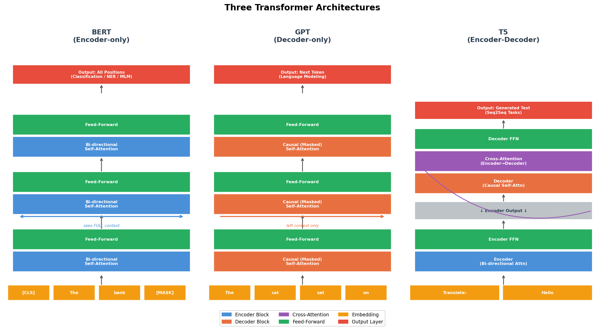

# 第 5 天：从编码器-解码器到仅解码器——BERT vs GPT，为什么 GPT 赢了

> **核心问题**：为什么仅解码器（Decoder-only）架构（GPT）最终主导了现代 AI，尽管 BERT 起初看起来是明显的赢家？

---

## 开篇：考试类比

想象两个学生参加填空题考试。

**BERT** 先通读整份试卷——扫描每道题、每个上下文句子——然后再填写空格。它像一个编辑，先吸收整篇文档，再进行精准修改。这种双向（Bidirectional）方式让 BERT 在*理解*文本方面极为出色。

**GPT** 则从头开始写一篇文章，一次一个词。它从不向前看——每个词都只根据已经写下的内容来选择。就像一个文思泉涌的作者，自然地生成内容，从不回头修改。

2018 年，这两种方法看起来同样有前途。然而到了 2022 年，GPT 风格的模型已经彻底重塑了 AI 格局，催生了 ChatGPT，引发了当前的 LLM 爆发。BERT 尽管最初占据主导地位，却沦为了专用工具，而非未来的基础。

为什么？答案藏在四个具体机制里——理解它们将彻底改变你对深度学习架构选择的思考方式。


*图 1：三种 Transformer 架构——仅编码器（BERT）、仅解码器（GPT）和编码器-解码器（T5）。每种架构在理解能力和生成能力之间做出了不同的权衡。*

---

## 1. 三种架构

2017 年的 Transformer 论文（[Vaswani et al.](https://arxiv.org/abs/1706.03762)）为机器翻译引入了编码器-解码器模型。但研究人员很快意识到，这个架构可以被拆分、专门化，并以不同方式扩展。到 2018–2020 年，三种截然不同的范式相继涌现。

### 1.1 仅编码器：BERT（2018）

BERT（[Devlin et al., 2018](https://arxiv.org/abs/1810.04805)）将 Transformer 精简为仅剩编码器部分。每一层都应用**双向自注意力**——序列中每个 token 同时双向关注其他所有 token。

这就像在参与一场对话时，你已经读过了完整的对话记录。"I walked to the bank by the river" 中的 "bank" 一词在完整语境下被理解——BERT 在编码这个歧义词时，同时看到了"river"（右侧）和"walked to"（左侧）。

训练目标是**掩码语言模型（Masked Language Model，MLM）**：随机遮盖 15% 的输入 token，训练模型去预测它们。为什么是 15%？太低太容易（上下文太充足）；太高太难（信号不足）。原始论文通过实验确认 15% 是最优值。

```python
# BERT in action: masked token prediction
from transformers import BertTokenizer, BertForMaskedLM
import torch

tokenizer = BertTokenizer.from_pretrained('bert-base-uncased')
model = BertForMaskedLM.from_pretrained('bert-base-uncased')

# Mask "sat" in "The cat sat on the mat"
text = "The cat [MASK] on the mat."
inputs = tokenizer(text, return_tensors='pt')

with torch.no_grad():
    outputs = model(**inputs)

# Get predicted token for the [MASK] position
mask_idx = (inputs['input_ids'] == tokenizer.mask_token_id).nonzero()[0][1]
logits = outputs.logits[0, mask_idx]
predicted_token = tokenizer.decode([logits.argmax()])
print(f"Predicted: {predicted_token}")  # → "sat"
```

BERT 的双向注意力在**理解**方面极为强大——但它为**生成**制造了一个根本性的问题：要预测下一个 token，你需要先将其遮盖再重跑整个模型。这慢得无法接受。

### 1.2 仅解码器：GPT（2018 至今）

GPT（[Radford et al., 2018](https://openai.com/research/language-unsupervised)）只使用 Transformer 解码器的自注意力层，并做了一个关键改动：加入**因果掩码**（下三角掩码），阻止每个位置关注后续位置。

这是"移动墙"心智模型：在位置 *t* 处，你可以看到 token 1 到 *t*，但位置 *t+1* 之后的内容不可见。这个约束让 GPT 天然具备自回归（Autoregressive）性——它一次一个 token 地生成文本，每次预测仅依赖已有内容。

训练目标是**因果语言模型（Causal Language Model，CLM）**：在每个位置同时预测下一个 token。这样做的妙处？训练信号来自序列中*每一个位置*，而非像 BERT 那样只来自被遮盖的 15%。

```python
# GPT in action: text generation
from transformers import GPT2LMHeadModel, GPT2Tokenizer

tokenizer = GPT2Tokenizer.from_pretrained('gpt2')
model = GPT2LMHeadModel.from_pretrained('gpt2')

prompt = "The transformer architecture"
inputs = tokenizer(prompt, return_tensors='pt')

# Autoregressively generate 30 more tokens
# Each token is predicted from all previous tokens
outputs = model.generate(
    inputs['input_ids'],
    max_new_tokens=30,
    do_sample=True,        # Sampling for diversity
    temperature=0.8,       # Controls randomness
    pad_token_id=tokenizer.eos_token_id
)
print(tokenizer.decode(outputs[0], skip_special_tokens=True))
```

### 1.3 编码器-解码器：T5（2020）

T5（[Raffel et al., 2020](https://arxiv.org/abs/1910.10683)）保留了完整的 Transformer——编码器以双向注意力读取输入，解码器以因果注意力生成输出，**交叉注意力（Cross-attention）**让解码器在每一步都能查询编码器的表示。

T5 的洞见在于将一切都框架化为"文本到文本"：翻译、摘要、分类、问答——全都变成了"给定这段文本，生成那段文本"。这很优雅，也很强大，但同样复杂：两个独立的模块堆栈、需要管理的交叉注意力，以及在任何解码开始前就必须完成整个编码器前向传播的推理流程。

---

## 2. 注意力掩码：核心差异

BERT 与 GPT 之间最重要的结构差异，就是注意力掩码。


*图 2：左——BERT 的完整注意力矩阵：每个 token 关注所有其他 token（全部 ✓）。右——GPT 的因果掩码：下三角形，未来位置被屏蔽（✗）。这一个差异决定了一切。*

对于长度为 *n* 的序列：

- **BERT**：注意力矩阵完全稠密——O(n²) 次运算，所有位置互相关注
- **GPT**：注意力矩阵为下三角——同样 O(n²) 次运算，但屏蔽了未来位置

数学推论：BERT 无法高效生成文本，因为生成 token *t+1* 需要该 token 已经出现在输入中（被遮盖），这与生成的目的相悖。GPT 可以高效生成，因为预测位置 *t+1* 只需要已经计算好的位置 1 到 *t* 的表示。

---

## 3. 训练目标：MLM vs CLM

### 3.1 数学形式

以下是两种训练范式的正式目标函数：

$$
\begin{aligned}
\mathcal{L}_{\text{MLM}} &= -\sum_{i \in \mathcal{M}} \log P(x_i \mid x_{\backslash \mathcal{M}}) \quad &\text{（BERT：预测被遮盖的 token）} \\[8pt]
\mathcal{L}_{\text{CLM}} &= -\sum_{t=1}^{T} \log P(x_t \mid x_1, x_2, \ldots, x_{t-1}) \quad &\text{（GPT：预测下一个 token）} \\[8pt]
P(x_1, \ldots, x_T) &= \prod_{t=1}^{T} P(x_t \mid x_{<t}) \quad &\text{（链式法则分解）}
\end{aligned}
$$

其中：
- $\mathcal{M}$ = 被遮盖 token 的索引集合（用于 MLM）
- $x_{\backslash \mathcal{M}}$ = 所有未被遮盖的 token（BERT 的可见上下文）
- $x_{<t}$ = 位置 *t* 之前的所有 token（GPT 的左侧上下文）

**从数学中得出的关键洞见**：MLM 每个序列只训练约 15% 的 token（被遮盖的那些）。CLM 训练*每一个 token 位置*——训练信号效率达到 100%。这意味着 GPT 从同等数据中提取的训练信号是 BERT 的 6–7 倍。


*图 3：MLM vs CLM 训练目标对比。BERT 利用完整的双向上下文并行预测被遮盖的 token。GPT 仅利用左侧上下文顺序预测每个下一个 token——但在每个位置都进行训练。*

### 3.2 为什么 CLM 获得更多信号

考虑一个包含 1000 个 token 的序列：
- BERT 遮盖约 150 个 token → 训练 150 个预测任务
- GPT 训练 1000 个预测任务（每个位置预测下一个）

这不仅仅是效率问题——还关乎模型学到了什么。GPT 必须内化语言的完整分布结构才能最小化 CLM 损失。它无法通过简单复制可见上下文来"作弊"；它必须真正建模语言。

---

## 4. 为什么 GPT 赢了：四个具体机制

这是本文的核心。问题不只是"哪个更好"——而是*为什么*仅解码器架构的机制在规模扩大时被证明具有决定性意义。


*图 4：仅解码器架构得以主导的四个具体原因。每个原因都会叠加其他原因的效果——合在一起，在规模上形成了决定性优势。*

### 4.1 KV 缓存：推理效率的杀手锏

当 GPT 生成 token *t+1* 时，它需要对位置 1 到 *t* 进行注意力计算。在标准注意力机制中，每次生成新 token 都重新计算所有之前位置的 Key（K）和 Value（V）矩阵，代价是每个 token O(n²)——慢得令人窒息。

解决方案：**KV 缓存（KV-cache）**。由于过去的位置永远不会改变（因果掩码——位置 *t* 只看 *t* 及之前），我们可以缓存所有之前位置的 K 和 V 矩阵。添加 token *t+1* 只需要为*那一个新位置*计算 K 和 V，而不是所有之前的位置。

```python
# Pseudocode: KV-cache in action
class GPTWithKVCache:
    def __init__(self):
        self.kv_cache = []  # Cache of (K, V) for each layer
    
    def generate_one_token(self, new_token_embedding):
        # For each transformer layer:
        for layer in self.layers:
            # Compute K, V for NEW token only
            new_k = layer.W_k(new_token_embedding)
            new_v = layer.W_v(new_token_embedding)
            
            # Extend cache with new K, V
            self.kv_cache[layer].append((new_k, new_v))
            
            # Compute Q for new token, attend to ALL cached K, V
            new_q = layer.W_q(new_token_embedding)
            all_k = torch.cat([c[0] for c in self.kv_cache[layer]])
            all_v = torch.cat([c[1] for c in self.kv_cache[layer]])
            
            attn_output = attention(new_q, all_k, all_v)
            new_token_embedding = layer.ffn(attn_output)
        
        return new_token_embedding
```

**BERT 为什么没有这个？** BERT 的双向注意力意味着每个位置都可以看到其他所有位置。如果你修改一个 token（例如追加一个新 token），你可能改变所有地方的注意力分数——缓存就失效了。双向模型不存在简单的 KV 缓存。

这个单一优势让 GPT 风格的生成在推理时快得多。GPT 每个 token 的生成代价是 O(n)（关注缓存的 K、V），而非每步 O(n²)。

### 4.2 训练并行性：充分利用完整序列

训练时，GPT 通过因果掩码在一次前向传播中处理整个序列。所有位置（1 到 T）同时被训练：

- 位置 1 预测位置 2
- 位置 2 预测位置 3
- ……
- 位置 T-1 预测位置 T

这是高度 GPU 并行的。每个训练文档中的每一个 token 都同时贡献梯度。对于一个包含万亿 token 的训练语料库，GPT 训练万亿个预测任务。BERT 大约训练 1500 亿个（15% × 1T）。

对规模扩展的影响：GPT 可以在更大的数据集上以更高的计算效率训练。当你突破 1000 亿参数量级时，这个效率差距变得至关重要。

### 4.3 统一范式：一个架构，所有任务

BERT 的双向性非常适合分类——但 BERT 需要为每个任务准备不同的头：
- 文本分类：[CLS] token → 线性分类器
- 命名实体识别：每个 token → 线性分类器
- 问答：两个指针用于答案起止位置
- 机器翻译：需要完全独立的解码器架构

GPT 说：*每个任务都是文本生成*。每个任务的接口完全相同：

```python
# Everything is text generation with GPT
tasks = {
    "translation":    "Translate to French: The cat is sleeping. →",
    "classification": "Sentiment of 'I loved this movie': positive or negative? →",
    "summarization":  "Summarize: [long article]... Summary:",
    "qa":             "Q: What is the capital of France? A:",
    "code":           "Write a Python function to reverse a string:\ndef reverse_string(",
}

for task, prompt in tasks.items():
    result = gpt.generate(prompt)
    print(f"{task}: {result}")
```

这种统一范式意味着：
1. 无需微调，一个模型即可处理无限种任务类型
2. 新能力仅通过提示（prompting）就能涌现
3. 新任务无需修改架构
4. 跨任务迁移自然发生

### 4.4 上下文学习：规模扩展带来的涌现奖励

这也许是最令人惊讶的机制。在足够大的规模下（GPT-3 的 1750 亿参数），仅解码器模型发展出了**直接从输入中提供的示例进行学习**的能力，即上下文学习（In-context learning）：

```
# 零样本
Translate to French: The cat is sleeping.
Translation:

# 少样本（上下文学习）
Translate to French: The dog runs. → Le chien court.
Translate to French: Birds fly. → Les oiseaux volent.
Translate to French: The cat is sleeping.
Translation:
```

少样本的 GPT-3 在相同任务上往往能匹敌或超越经过微调的 BERT 大小的模型——*无需任何梯度更新*。模型似乎能在单次前向传播中完成任务识别和适应。

为什么这种能力在仅解码器模型中涌现，而非仅编码器模型？主流假说：自回归训练迫使模型解决一个隐式的元学习问题。为了预测每个下一个 token，它必须追踪上下文中描述的任务是什么，调整自己的"策略"，并将该策略应用到新输入上。这种元学习能力在规模扩展时被 CLM 训练烘焙进去了。

BERT 这样的双向模型无法发展出这种能力——在掩码 token 预测过程中，没有任何激励促使它学会读取任务规格并加以应用。

---

## 5. 架构演进时间线


*图 5：2017 年至 2023 年架构演进。BERT 最初主导 NLP 基准测试，但仅解码器模型（GPT-2、GPT-3、ChatGPT）在规模扩展时展现出越来越强大的能力，最终赢得主流。*

时间线清晰地讲述了这个故事：

| 年份 | 模型 | 架构 | 意义 |
|------|------|------|------|
| 2017 | Transformer | 编码器-解码器 | 基础："Attention Is All You Need" |
| 2018 | BERT | 仅编码器 | 11 项 NLP 基准 SOTA——BERT 热潮 |
| 2018 | GPT-1 | 仅解码器 | 1.17 亿参数，有前途但尚未爆红 |
| 2019 | GPT-2 | 仅解码器 | 15 亿参数——"危险到不敢发布" |
| 2020 | T5 | 编码器-解码器 | 文本到文本统一范式，110 亿参数 |
| 2020 | GPT-3 | 仅解码器 | 1750 亿参数——上下文学习涌现 |
| 2022 | ChatGPT | 仅解码器 + RLHF | 2 个月内 1 亿用户 |
| 2023 | LLaMA/Gemini/Claude | 仅解码器 | 整个行业收敛于仅解码器 |

转折点是 GPT-3（2020）。其上下文学习能力，加上 KV 缓存带来的推理效率优势，使扩展仅解码器模型成为显而易见的前进方向。ChatGPT（2022）只是让这一切变得大众可见。

---

## 6. BERT 没有死

一个常见误解："GPT 赢了，所以 BERT 过时了。"这是错的。

BERT 的双向编码在若干关键应用中仍是最佳工具：

**语义搜索与检索**：BERT 风格的模型（及其后代，如 [Sentence-BERT](https://arxiv.org/abs/1908.10084)）能生成丰富的上下文嵌入，在固定大小的向量中捕捉语义。现代搜索系统正是以此为基础：

```python
from sentence_transformers import SentenceTransformer
import numpy as np

# Encode documents and queries for semantic search
model = SentenceTransformer('all-MiniLM-L6-v2')

documents = [
    "Neural networks learn from data",
    "Transformers use attention mechanisms",
    "BERT is bidirectional",
]
query = "How does BERT process text?"

# Encode everything at once (batch processing)
doc_embeddings = model.encode(documents)
query_embedding = model.encode(query)

# Cosine similarity search
similarities = np.dot(doc_embeddings, query_embedding) / (
    np.linalg.norm(doc_embeddings, axis=1) * np.linalg.norm(query_embedding)
)
best_match = documents[np.argmax(similarities)]
print(f"Most relevant: {best_match}")
```

**大规模文本分类**：对于生产级分类系统（垃圾邮件检测、情感分析、意图分类），在标注数据上微调的 BERT 大小模型通常比提示大型 GPT 模型更快、更便宜、更准确。

**检索增强生成（RAG）**：在现代 RAG 系统中，*检索*步骤通常使用 BERT 风格的编码器来找到相关文档，而 GPT 风格的解码器则生成最终答案。BERT 和 GPT 协同工作。

**BERT 为何存续**：它的双向编码为*理解*任务创造了更好的 token/句子嵌入。GPT 嵌入的语义紧密性较弱，因为模型是为生成而优化的，而非相似度匹配。

---

## 7. 常见误解

### ❌ "BERT 也可以用于文本生成，只是慢一点"

并非如此。BERT 的填空（MLM）每次前向传播只能填入一个被遮盖的 token，但这无法扩展到连贯的多句子生成。模型从未被训练为在自回归生成的文本中保持叙事连贯性。真正的生成需要 GPT 的因果结构。

### ❌ "T5 应该赢，因为它结合了两者的优点"

T5 很强大，至今仍被广泛使用（尤其是特定的序列到序列任务）。但编码器-解码器的分离带来了推理复杂性：你需要在开始解码之前运行完整的编码器，而且交叉注意力机制也没有简单的 KV 缓存。在推理时，这种开销会累积叠加。对于规模化的对话式 AI，GPT 更简单的架构在部署经济性上胜出。

### ❌ "仅解码器模型不理解文本，它们只是在预测 token"

这混淆了机制与能力。GPT-3 及后续模型展现出了复杂的语言理解能力（阅读理解、逻辑推理、代码分析），尽管它们"只是"在预测下一个 token。CLM 目标在足够大的规模下应用，迫使模型构建深度的世界模型来最小化预测损失。理解能力从生成训练中涌现。

### ❌ "更大总是胜过架构选择"

架构至关重要。一个 70 亿参数的仅解码器模型（例如 LLaMA-2-7B）在基准测试中超越了许多早期的 130 亿参数模型。仅解码器架构的训练效率意味着每个参数都被更充分地利用。

---

## 8. 代码示例：架构的实际应用

```python
# Side-by-side comparison: BERT vs GPT for the same task
from transformers import (
    BertTokenizer, BertForSequenceClassification,
    GPT2LMHeadModel, GPT2Tokenizer,
    pipeline
)

# ---- BERT: Classification (its strength) ----
bert_classifier = pipeline(
    'sentiment-analysis',
    model='distilbert-base-uncased-finetuned-sst-2-english'
)
text = "The transformer architecture changed everything about NLP"

# BERT processes the full text bidirectionally
result = bert_classifier(text)
print(f"BERT sentiment: {result[0]['label']} ({result[0]['score']:.3f})")

# ---- GPT: Generation (its strength) ----
gpt_generator = pipeline('text-generation', model='gpt2')

# GPT generates the next tokens autoregressively
generated = gpt_generator(
    "The transformer architecture changed everything about",
    max_new_tokens=20,
    do_sample=True,
    temperature=0.7,
    pad_token_id=50256  # GPT-2's EOS token
)
print(f"GPT completion: {generated[0]['generated_text']}")

# Key insight: these models excel at fundamentally different tasks
# Use BERT-family for: classification, NER, embeddings, retrieval
# Use GPT-family for: generation, conversation, in-context learning
```

---

## 9. 延伸阅读

### 入门

1. [The Illustrated BERT, ELMo, and co.](https://jalammar.github.io/illustrated-bert/)，Jay Alammar 著——BERT 设计的可视化讲解
2. [The Illustrated GPT-2](https://jalammar.github.io/illustrated-gpt2/)，Jay Alammar 著——GPT 如何逐步生成文本

### 进阶

1. [Understanding Large Language Models](https://www.cs.princeton.edu/courses/archive/fall22/cos597G/lectures/lec01.pdf)——普林斯顿大学 COS 597G 课程讲义
2. [Efficient Transformers: A Survey](https://arxiv.org/abs/2009.06732)——注意力效率改进综述，包括 KV 缓存

### 论文

1. [BERT: Pre-training of Deep Bidirectional Transformers](https://arxiv.org/abs/1810.04805)——Devlin et al.，Google（2018）
2. [Language Models are Unsupervised Multitask Learners (GPT-2)](https://cdn.openai.com/better-language-models/language_models_are_unsupervised_multitask_learners.pdf)——Radford et al.，OpenAI（2019）
3. [Language Models are Few-Shot Learners (GPT-3)](https://arxiv.org/abs/2005.14165)——Brown et al.，OpenAI（2020）
4. [Exploring the Limits of Transfer Learning with T5](https://arxiv.org/abs/1910.10683)——Raffel et al.，Google（2020）
5. [Sentence-BERT: Sentence Embeddings using Siamese BERT-Networks](https://arxiv.org/abs/1908.10084)——Reimers & Gurevych（2019）

---

## 思考题

1. **KV 缓存优势**：为什么因果掩码能够支持 KV 缓存，而双向注意力却不行？双向注意力中，追加新 token 后究竟是什么使缓存的 Key-Value 矩阵失效？

2. **训练效率的权衡**：CLM 在 100% 的 token 位置上训练，而 MLM 只有约 15%。这是否意味着 CLM 总是收敛更快？是否存在某些任务，MLM 的双向训练信号每个 token 实际上更*优*？想想那些上下文具有对称性的任务。

3. **统一范式的假设**：GPT 声称"所有任务 = 文本生成"。但某些任务本质上并非文本生成——例如结构化预测（输出解析树、表格、蛋白质序列）。你会如何用仅解码器模型处理这些任务？文本生成范式的边界在哪里？

4. **BERT 的未来**：在 RAG 系统中 BERT 负责检索、GPT 负责生成的世界里，是否存在一种单一架构能同时做好两件事？它会是什么样子？

---

## 小结

| 概念 | 一句话解释 |
|------|-----------|
| **BERT** | 仅编码器；双向注意力；擅长理解，不擅长生成 |
| **GPT** | 仅解码器；因果掩码；擅长生成，可扩展至万亿 token 训练 |
| **T5** | 编码器-解码器；强大的序列到序列模型，但推理复杂 |
| **MLM** | 通过预测约 15% 被遮盖的 token 来训练——双向但数据效率低 |
| **CLM** | 通过在每个位置预测下一个 token 来训练——100% 数据效率 |
| **KV 缓存** | 缓存过去 token 的 K、V；由因果掩码实现；使 GPT 推理更快 |
| **上下文学习** | 在仅解码器模型规模扩展时涌现；通过提示中的示例适应新任务 |
| **BERT 为何存续** | 更好的搜索/检索/分类嵌入；用于 RAG 检索步骤 |

**核心结论**：GPT 战胜 BERT，不是因为某个架构"更聪明"——而是四个具体的机械优势在规模扩展时相互叠加：KV 缓存实现快速推理，CLM 提供更多训练信号，统一的文本生成范式消除了任务特定的工程工作，上下文学习从自回归训练中自然涌现。BERT 没有死，但其领地现在已经清晰划定：稠密检索、分类，以及双向理解真正重要的嵌入任务。其他一切都已经收敛到仅解码器架构。

---

*第 5 天，共 60 天 | LLM 基础*
*字数：约 3200 | 阅读时间：约 16 分钟*
