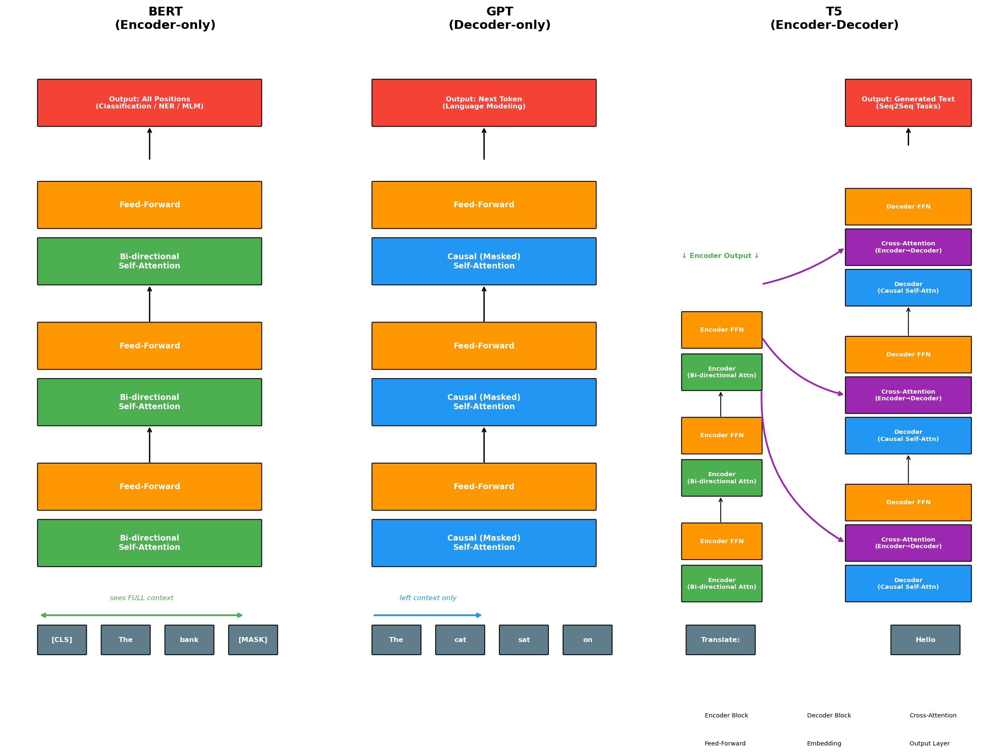
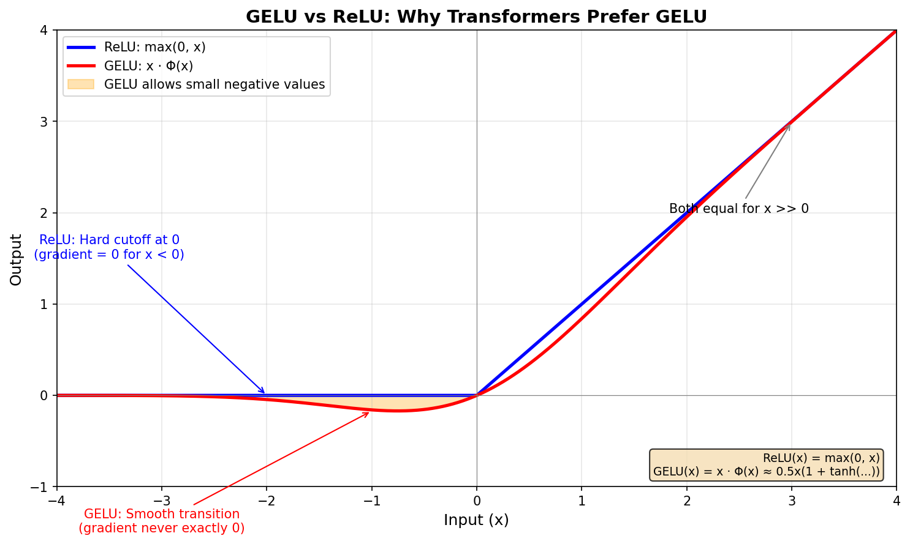
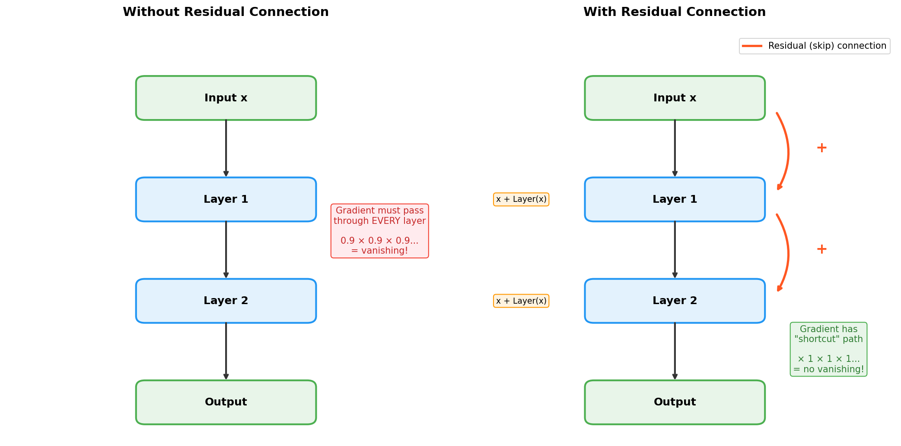
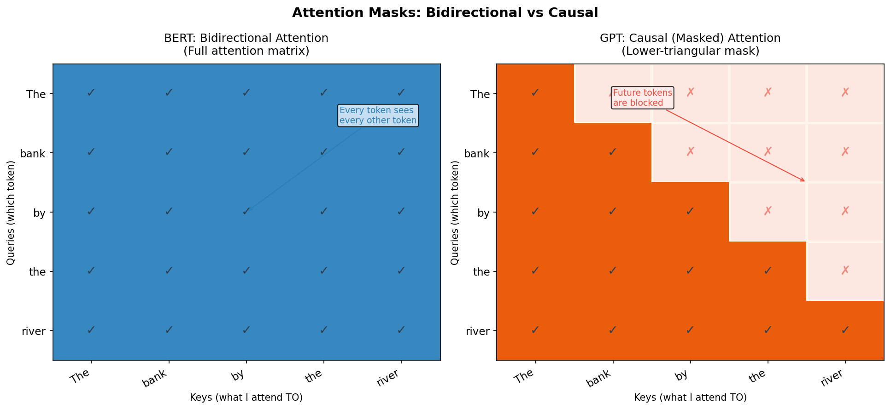
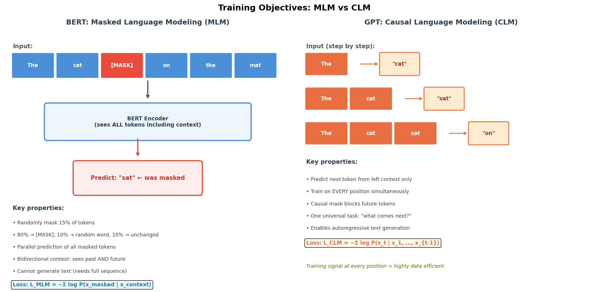
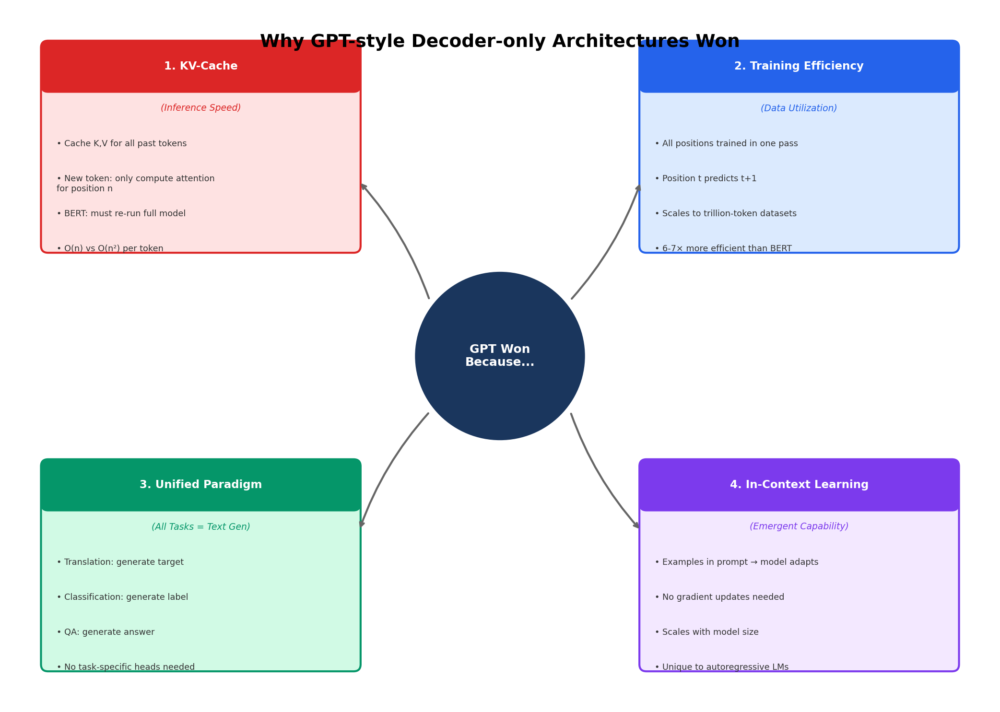
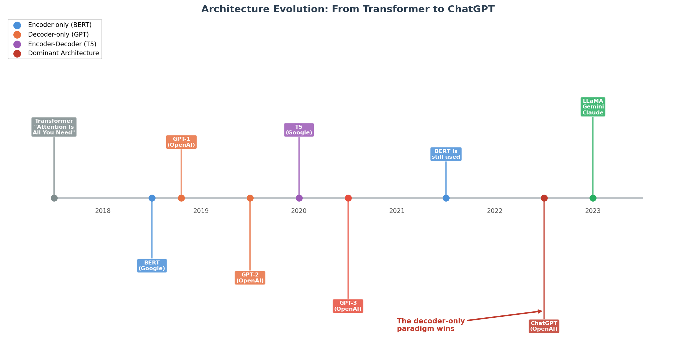
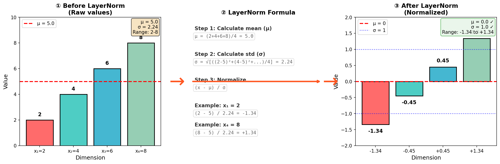

# 第五天：从编码器-解码器到纯解码器——BERT vs GPT，GPT 为何胜出

> **核心问题**：为什么纯解码器架构（GPT）最终主导了现代 AI，尽管 BERT 最初看起来才是明显的赢家？

---

## 开篇：考试类比

想象两个学生参加填空题考试。

**BERT** 先把整张试卷通读一遍——扫描每道题、每句话——再开始填空。它像一位编辑，把整篇文章吸收消化后，再做出精准的修改。这种双向扫描的方式让 BERT 极其擅长*理解*文本。

**GPT** 则像从零开始写一篇作文，一个词接一个词地写下去。它绝不向前看——每个词只基于前面已写出的所有内容来选择。它像一位处于写作状态的作者，自然地生成文字，不回头修改。

这两种方式在 2018 年看起来旗鼓相当。然而到 2022 年，GPT 风格的模型已经彻底重塑了 AI 格局，催生了 ChatGPT，引发了当前的大语言模型爆发。BERT 尽管最初占据主导地位，却沦为专用工具，而非未来的基础架构。

为什么？答案藏在四个具体的机制中——理解它们将彻底改变你对深度学习架构选择的思考方式。


*图 1：三种 Transformer 架构——仅编码器（BERT）、仅解码器（GPT）和编码器-解码器（T5）。每种架构在理解能力和生成能力之间做出了不同的权衡。*

---

## 1. 三种架构：逐层深度解析

2017 年的 Transformer 论文（[Vaswani et al.](https://arxiv.org/abs/1706.03762)）引入了一种用于机器翻译的编码器-解码器模型。但研究人员很快意识到，这种架构可以被拆分、专门化，并以不同方式扩展。到 2018–2020 年，三种截然不同的范式已经成形。

要理解每种架构为什么做出特定的设计选择，需要深入审视每一层的用途及其涉及的权衡。

### 1.1 仅编码器：BERT（2018）

BERT（[Devlin et al., 2018](https://arxiv.org/abs/1810.04805)）将 Transformer 精简为仅保留编码器部分。让我们逐一剖析每个组件：

#### 层结构（重复 L 次，通常 L=12 或 L=24）

```
Input Embeddings
       ↓
┌─────────────────────────────────────┐
│  Multi-Head Bidirectional Attention │  ← Every token sees every other token
│  + Residual Connection + LayerNorm  │
├─────────────────────────────────────┤
│  Feed-Forward Network (FFN)         │  ← Non-linear transformation
│  + Residual Connection + LayerNorm  │
└─────────────────────────────────────┘
       ↓ (repeat L times)
Final Hidden States → Task-specific head
```

#### 组件一：输入嵌入（Input Embeddings）

**功能**：将词元转换为稠密向量，并添加位置信息。

```
Token Embedding + Segment Embedding + Position Embedding = Input
     (30522 × 768)      (2 × 768)         (512 × 768)
```

其中三种嵌入分别对应**词元嵌入（Token Embedding）**、**段落嵌入（Segment Embedding）** 和**位置嵌入（Position Embedding）**。

**为何这样设计**：
- **词元嵌入**：每个词/子词映射到一个 768 维向量。为什么是 768？这是在表达能力与计算量之间平衡的经验值。更小（256）会损失表达能力；更大（1024+）收益递减。
- **段落嵌入**：BERT 处理句子对（如自然语言推理任务）。A/B 段落 ID 用于区分每个词元属于哪个句子。
- **位置嵌入**：Transformer 本身没有顺序概念（与 RNN 不同）。可学习的位置嵌入（而非原始 Transformer 中的正弦位置编码）让模型能学习位置相关的模式。为什么用可学习的？更简单，且在 512 个位置内效果同样出色。

**设计权衡**：最大位置固定为 512。更长的序列需要滑动窗口或截断——这一限制后来被纯解码器模型通过旋转位置编码（RoPE）所克服。

> **💡 常见疑问：为什么位置编码需要"学习"？**
>
> 你可能会问：位置信息对所有文本不都一样吗？"第 3 个位置"就是"第 3 个位置"，有什么可学的？
>
> 这个直觉是对的！Learned Position Embedding 学的不是"位置本身"，而是"位置的语义倾向"——比如位置 1 经常是冠词/主语，位置 2-3 经常是形容词，等等。
>
> 但实际上，**两种方式效果差不多**。即使用 Sinusoidal，Attention 层也会学到位置的语义作用。BERT 选择 Learned 主要是因为**实现更简单**（一行 `nn.Embedding` vs 一个数学函数），不是因为效果更好。
>
> | | Sinusoidal | Learned |
> |--|-----------|---------|
> | 概念 | 纯数学公式 | 可学习参数 |
> | 代码 | 需要写函数 | 一行搞定 |
> | 长度外推 | ✅ 可以 | ❌ 不行 |
> | 效果 | 差不多 | 差不多 |

#### 组件二：多头双向自注意力（Multi-Head Bidirectional Self-Attention）

**功能**：每个词元同时对所有其他词元计算注意力。

$$
\begin{aligned}
\text{Attention}(Q, K, V) &= \text{softmax}\left(\frac{QK^T}{\sqrt{d_k}}\right)V \\
\text{MultiHead}(X) &= \text{Concat}(\text{head}_1, ..., \text{head}_h)W^O \\
\text{head}_i &= \text{Attention}(XW^Q_i, XW^K_i, XW^V_i)
\end{aligned}
$$

**为何双向**：以这个句子中的 "bank" 为例：
- "The river **bank** was steep and muddy"

要正确将 "bank" 编码为*河岸*（而非*银行*），模型需要：
- 左侧上下文："The river" → 暗示地理含义
- 右侧上下文："was steep and muddy" → 确认是物理地形

双向注意力让 BERT 能同时看到两边，从而实现消歧。而单向模型（如 GPT）必须在看到 "was steep" 之前就猜测 "bank" 的含义——这要难得多。

**为何用多头（12 个注意力头）**：不同的头学习不同的注意力模式：
- 部分头关注句法结构（主语-谓语）
- 部分头关注共指关系（he → John）
- 部分头关注相邻词元（局部上下文）

12 个头 × 64 维 = 768 总维度。更多的头 = 更多样的模式；但超过 16 个头后收益递减。

**设计权衡**：双向注意力意味着 O(n²) 的计算量，其中 n 为序列长度。为什么是 n²？因为 n 个 token 中的每一个都要和所有 n 个 token 计算注意力分数：

```
         t1    t2    t3    t4    t5
    ┌─────────────────────────────────┐
t1  │  ✓     ✓     ✓     ✓     ✓    │  ← t1 看 5 个 token
t2  │  ✓     ✓     ✓     ✓     ✓    │  ← t2 看 5 个 token
t3  │  ✓     ✓     ✓     ✓     ✓    │  ...
t4  │  ✓     ✓     ✓     ✓     ✓    │
t5  │  ✓     ✓     ✓     ✓     ✓    │
    └─────────────────────────────────┘
总计: n × n = n² 个注意力分数
```

（注：GPT 的因果掩码仍然是 O(n²)——只是把上三角 mask 掉了，矩阵大小还是 n×n。）

更关键的是：**无法高效生成文本**。原因如下：

在 GPT（因果）中，添加新 token 不会改变之前 token 的表示——它们本来就"看不到"未来。所以 GPT 可以缓存 Key/Value 矩阵（KV-cache）并复用：

```
GPT 生成 "The cat sat on the" → "mat"
Step 1: 处理 "The cat sat on the"，缓存 K,V ✓
Step 2: 生成 "mat" — 只计算新 token 的 Q，复用缓存的 K,V
        → 每个 token O(n)
```

在 BERT（双向）中，每个 token 的表示都依赖所有其他 token，包括后来添加的。添加新 token 会**改变所有之前的表示**：

```
BERT 生成 "The cat sat on the" → "?"
Step 1: "The cat sat on the [MASK]" — 跑完整 BERT，预测 "mat"
Step 2: "The cat sat on the mat [MASK]" — 必须重新跑整个 BERT！
        因为添加 "mat" 后：
        - "The" 的表示变了（它现在能看到 "mat"）
        - "cat" 的表示变了
        - 所有 token 都变了！
Step 3: 每生成一个新 token 都要重复...
        → 每个 token O(n²) = 生成 n 个 token 总计 O(n³)
```

**这就是为什么所有生成式 LLM（ChatGPT、Claude、Gemini）都用 GPT 架构，而不是 BERT。**

#### 组件三：前馈网络（Feed-Forward Network，FFN）

**功能**：在每个位置独立应用非线性变换。

```python
# FFN: expand to 4x, apply non-linearity, project back
FFN(x) = GELU(xW₁ + b₁)W₂ + b₂
# W₁: 768 → 3072 (4x expansion)
# W₂: 3072 → 768 (project back)
```

**为何 4 倍扩展**：注意力层混合跨位置的信息，但它是线性的。FFN 增加了非线性，并扩大了模型容量。为什么是 4 倍？这是经验上的最优值——更大收益递减，更小则损失表达能力。

**为何用 GELU 激活**：GELU（高斯误差线性单元）在语言任务上优于 ReLU。它平滑（处处可微），且比 ReLU 更好地处理负值。


*图：GELU 允许小的负值梯度流动，避免了 ReLU 的"死神经元"问题。*

**设计权衡**：FFN 在每一层中拥有最多的参数（每层 2 × 768 × 3072 = 4.7M）。这里存储了大部分的"知识"。

#### 组件四：残差连接（Residual Connection）+ 层归一化（LayerNorm）

**功能**：
- 残差连接：`output = x + Sublayer(x)`——使梯度能在深层网络中顺畅流动
- 层归一化：对每个样本独立归一化，保证训练稳定


*图：残差连接提供"梯度高速公路"——即使 Layer(x) 的梯度消失，跳跃路径（×1）仍能保持梯度流动。*

**为什么残差连接重要**：没有它，反向传播时梯度必须穿过每一层。如果每层让梯度缩小 0.9 倍，12 层后：0.9¹² ≈ 0.28——梯度几乎消失了！有了残差连接，梯度有一条乘以 1 的捷径，所以：1¹² = 1——不会消失。

**数学原理**：
```python
# 没有残差：梯度衰减
∂L/∂x = ∂L/∂y × ∂Layer/∂x        # ∂Layer/∂x 可能很小

# 有残差：梯度有 +1 项
y = x + Layer(x)
∂y/∂x = 1 + ∂Layer/∂x            # 这个 "1" 救了我们！
```

**为何从后置层归一化（Post-LN，BERT）演变为前置层归一化（Pre-LN，GPT-2+）**：BERT 使用后置层归一化（在残差之后归一化）。后来的研究发现，前置层归一化（在子层之前归一化）对极深模型更稳定。这在 GPT-2 之后成为标准做法。

#### 训练：掩码语言建模（MLM）

**功能**：随机遮盖 15% 的词元，预测原始词元。

**为何是 15%**：
- 太低（5%）：模型看到太多上下文，任务太简单
- 太高（30%）：可用上下文不够，预测质量差
- 消融研究发现 15% 是最优值

**为何用 80-10-10 的遮盖策略**：
- 80%：替换为 [MASK] 词元
- 10%：替换为随机词元
- 10%：保持原词不变

这样做可以防止模型只学会预测 [MASK] 词元——它必须同时处理被替换的和正常的输入。

```python
# BERT in action: masked token prediction
from transformers import BertTokenizer, BertForMaskedLM
import torch

tokenizer = BertTokenizer.from_pretrained('bert-base-uncased')
model = BertForMaskedLM.from_pretrained('bert-base-uncased')

text = "The cat [MASK] on the mat."
inputs = tokenizer(text, return_tensors='pt')

with torch.no_grad():
    outputs = model(**inputs)

mask_idx = (inputs['input_ids'] == tokenizer.mask_token_id).nonzero()[0][1]
logits = outputs.logits[0, mask_idx]
predicted_token = tokenizer.decode([logits.argmax()])
print(f"Predicted: {predicted_token}")  # → "sat"
```

**BERT 的致命弱点**：双向注意力使生成效率极低。要生成第 t+1 个词元，必须先将其遮盖，再对整个序列重新编码——生成 n 个词元需要 O(n) 次前向传播。

---

### 1.2 仅解码器：GPT（2018 至今）

GPT（[Radford et al., 2018](https://openai.com/research/language-unsupervised)）使用 Transformer 解码器，但做了一个关键改动：**因果掩码（Causal Mask）**。

#### 层结构（重复 L 次）

```
Input Embeddings
       ↓
┌─────────────────────────────────────┐
│  Multi-Head CAUSAL Self-Attention   │  ← Only sees past tokens
│  + Residual Connection + LayerNorm  │
├─────────────────────────────────────┤
│  Feed-Forward Network (FFN)         │
│  + Residual Connection + LayerNorm  │
└─────────────────────────────────────┘
       ↓ (repeat L times)
Final Hidden States → Next-token prediction head
```

#### 关键区别：因果注意力掩码

**功能**：下三角掩码阻止位置 i 关注位置 j > i 的词元。

```python
# Causal mask for sequence length 5
# 1 = can attend, 0 = blocked
mask = [
    [1, 0, 0, 0, 0],  # Position 0: sees only itself
    [1, 1, 0, 0, 0],  # Position 1: sees 0-1
    [1, 1, 1, 0, 0],  # Position 2: sees 0-2
    [1, 1, 1, 1, 0],  # Position 3: sees 0-3
    [1, 1, 1, 1, 1],  # Position 4: sees 0-4 (all past)
]
```

**为何这样设计**："移动墙"思维模型——在每个位置，你只能看到之前出现的内容。这一约束：
1. 使训练和推理使用相同的计算
2. 在推理时支持高效的 KV 缓存（详见第 4 节）
3. 天然地对语言的自回归分解进行建模

**设计权衡**：无法访问未来上下文。在"I sat by the river bank"中，"bank"必须在没有看到"river"的情况下完成编码。这看起来是劣势——但规模弥补了这一点。

#### 位置编码：从可学习嵌入到旋转位置编码（RoPE）

**GPT-1/2**：可学习的位置嵌入（与 BERT 相同），最多支持 1024 个位置。

**GPT-3+**：仍为可学习嵌入，但引入了外推技巧。

**现代模型（LLaMA 等）**：旋转位置编码（RoPE，Rotary Position Embedding）——通过旋转矩阵编码相对位置，支持远超训练长度的序列外推。

**为何演进**：可学习嵌入无法泛化到训练长度之外。RoPE 基于旋转的方式天然地处理更长的序列。

#### 前置层归一化（Pre-LN）vs 后置层归一化（Post-LN）

**GPT-2 起使用前置层归一化**：LayerNorm 在注意力/FFN **之前**，而非之后。

```python
# Post-LN (BERT, GPT-1)
x = x + Attention(LayerNorm(x))  # ❌ Unstable for deep models

# Pre-LN (GPT-2+)
x = x + Attention(LayerNorm(x))  # ✅ More stable gradients
```

**为何切换**：前置层归一化在极深模型（48 层以上）中产生更稳定的梯度。当模型扩展到千亿参数量级时，这一点至关重要。

#### 训练：因果语言建模（CLM）

**功能**：在每个位置预测下一个词元。

$$
\mathcal{L}_{\text{CLM}} = -\sum_{t=1}^{T} \log P(x_t \mid x_1, ..., x_{t-1})
$$

**为何高效**：每个位置都能提供训练信号。对于一段 1000 个词元的序列：
- BERT（15% 遮盖）：约 150 个预测任务
- GPT（CLM）：1000 个预测任务

**从同等数据中提取信号的效率高出 6–7 倍。**

```python
# GPT in action: text generation
from transformers import GPT2LMHeadModel, GPT2Tokenizer

tokenizer = GPT2Tokenizer.from_pretrained('gpt2')
model = GPT2LMHeadModel.from_pretrained('gpt2')

prompt = "The transformer architecture"
inputs = tokenizer(prompt, return_tensors='pt')

outputs = model.generate(
    inputs['input_ids'],
    max_new_tokens=30,
    do_sample=True,
    temperature=0.8,
    pad_token_id=tokenizer.eos_token_id
)
print(tokenizer.decode(outputs[0], skip_special_tokens=True))
```

---

### 1.3 编码器-解码器：T5（2020）

T5（[Raffel et al., 2020](https://arxiv.org/abs/1910.10683)）保留了完整的原始 Transformer 架构——独立的编码器和解码器堆栈，通过交叉注意力（Cross-Attention）连接。

#### 层结构

```
ENCODER (bidirectional, L layers):          DECODER (causal, L layers):
┌─────────────────────────────┐             ┌─────────────────────────────┐
│  Bidirectional Self-Attn    │             │  Causal Self-Attention      │
│  + Residual + LayerNorm     │             │  + Residual + LayerNorm     │
├─────────────────────────────┤             ├─────────────────────────────┤
│  Feed-Forward Network       │             │  Cross-Attention            │ ← Queries encoder
│  + Residual + LayerNorm     │             │  + Residual + LayerNorm     │
└─────────────────────────────┘             ├─────────────────────────────┤
        ↓ (L layers)                        │  Feed-Forward Network       │
                                            │  + Residual + LayerNorm     │
    Encoder Output ───────────────────────→ └─────────────────────────────┘
    (K, V for cross-attention)                      ↓ (L layers)
```

#### 交叉注意力：连接桥梁

**功能**：解码器的查询（Query）关注编码器的输出。

```python
# In cross-attention:
Q = decoder_hidden @ W_Q  # Query from decoder
K = encoder_output @ W_K  # Key from encoder
V = encoder_output @ W_V  # Value from encoder

attention = softmax(Q @ K.T / sqrt(d_k)) @ V
```

**为何这样设计**：编码器双向处理完整输入（有利于理解），然后解码器通过交叉注意力"查看"编码器的表示，同时自回归地生成输出。

**适用场景**：非常适合序列到序列（seq2seq）任务——翻译、摘要——即需要在生成输出之前完全理解输入的任务。

#### T5 为何没能胜出

尽管架构优雅，T5 在规模扩展上存在劣势：

1. **相同容量需要双倍参数**：编码器 + 解码器意味着两个独立的堆栈。12 层的 T5 参数量与 24 层的 GPT 相近，但 GPT 可以更深（层数越多越好）。

2. **推理复杂性**：必须先完整运行编码器，才能开始解码。无法在输入处理完成前就开始生成。

3. **交叉注意力开销**：每个解码器层除了自注意力，还有额外的交叉注意力操作。

4. **难以支持上下文学习**：编码器/解码器分离不天然支持"提示 + 续写"的格式，而这种格式使 GPT-3 如此通用。

#### T5 的文本到文本框架

T5 的核心洞见是将所有任务统一为文本到文本的格式：

```
# Classification
Input:  "mnli premise: ... hypothesis: ..."
Output: "entailment"

# Translation  
Input:  "translate English to German: Hello world"
Output: "Hallo Welt"

# Summarization
Input:  "summarize: [long article]"
Output: "[short summary]"
```

这一思路影响深远——GPT-3 采用了类似的任务构建方式。但 GPT 证明了你并不需要独立的编码器/解码器来实现这一点。

```python
# T5 in action
from transformers import T5Tokenizer, T5ForConditionalGeneration

tokenizer = T5Tokenizer.from_pretrained('t5-small')
model = T5ForConditionalGeneration.from_pretrained('t5-small')

# Translation task
input_text = "translate English to German: Hello, how are you?"
inputs = tokenizer(input_text, return_tensors='pt')

outputs = model.generate(**inputs, max_length=50)
print(tokenizer.decode(outputs[0], skip_special_tokens=True))
# → "Hallo, wie geht es Ihnen?"
```

---

### 小结：架构设计决策对比

| 设计决策 | BERT | GPT | T5 |
|----------|------|-----|-----|
| **注意力方向** | 双向 | 因果（仅左向） | 编码器：双向，解码器：因果 |
| **位置编码** | 可学习（最多 512） | 可学习 → 旋转位置编码 | 相对位置偏置 |
| **LayerNorm 位置** | 后置层归一化 | 前置层归一化（GPT-2+） | 前置层归一化 |
| **训练目标** | MLM（15% 遮盖） | CLM（100% 位置） | 跨度损坏 |
| **交叉注意力** | 无 | 无 | 有 |
| **生成效率** | ❌ | ✅（KV 缓存） | ✅ 但较慢 |
| **上下文学习** | ❌ | ✅ | 有限 |

核心洞见：**GPT 的简洁是优势，而非缺陷**。单一堆栈、单一注意力类型、单一训练目标——它比其他架构扩展得更好。

---

## 2. 注意力掩码：核心区别

BERT 和 GPT 之间最重要的结构差异就是注意力掩码。


*图 2：左——BERT 的完全注意力矩阵：每个词元关注其他所有词元（全部 ✓）。右——GPT 的因果掩码：下三角形，未来位置被屏蔽（✗）。就是这一个差异决定了一切。*

对于长度为 *n* 的序列：

- **BERT**：注意力矩阵完全稠密——O(n²) 操作，所有位置都关注所有位置
- **GPT**：注意力矩阵为下三角形——同样的 O(n²) 操作，但未来被遮盖

数学上的结果：BERT 无法高效生成文本，因为生成第 *t+1* 个词元需要该词元先存在于输入中（被遮盖），这违背了生成的目的。GPT 可以高效生成，因为预测位置 *t+1* 只需要已计算好的位置 1 到 *t* 的表示。

---

## 3. 训练目标：MLM vs CLM

### 3.1 数学形式

以下是两种训练范式的正式目标函数：

$$
\begin{aligned}
\mathcal{L}_{\text{MLM}} &= -\sum_{i \in \mathcal{M}} \log P(x_i \mid x_{\backslash \mathcal{M}}) \quad &\text{（BERT：预测被遮盖的词元）} \\
\mathcal{L}_{\text{CLM}} &= -\sum_{t=1}^{T} \log P(x_t \mid x_1, x_2, \ldots, x_{t-1}) \quad &\text{（GPT：预测下一个词元）} \\
P(x_1, \ldots, x_T) &= \prod_{t=1}^{T} P(x_t \mid x_{<t}) \quad &\text{（链式法则分解）}
\end{aligned}
$$

其中：
- $\mathcal{M}$ = 被遮盖词元的下标集合（用于 MLM）
- $x_{\backslash \mathcal{M}}$ = 所有未被遮盖的词元（BERT 的可见上下文）
- $x_{<t}$ = 位置 *t* 之前的所有词元（GPT 的左侧上下文）

**从数学角度的关键洞见**：MLM 每个序列只训练约 15% 的词元（被遮盖的那些）。CLM 则训练*每一个词元位置*——100% 的训练信号效率。这意味着 GPT 从同等数量的数据中提取到 6–7 倍的训练信号。


*图 3：MLM vs CLM 训练目标。BERT 利用完整双向上下文并行预测被遮盖的词元；GPT 仅利用左侧上下文顺序预测每个下一词元——但训练覆盖每一个位置。*

### 3.2 为何 CLM 获得更多信号

考虑一段 1000 个词元的序列：
- BERT 遮盖约 150 个词元 → 训练 150 个预测任务
- GPT 训练 1000 个预测任务（每个位置都预测下一个）

这不仅仅是效率问题——更关乎模型学到了什么。GPT 必须内化语言的完整分布结构，才能最小化 CLM 损失。它不能通过"抄"可见的上下文来取巧；它必须真正对语言进行建模。

---

## 4. GPT 为何胜出：四个具体机制

这是本文的核心。问题不只是"哪个更好"，而是*为何*纯解码器架构的机制在规模扩展时被证明具有决定性优势。


*图 4：纯解码器架构主导地位的四个具体原因。每个原因都相互叠加——共同在规模上创造了决定性的优势。*

### 4.1 KV 缓存：推理效率的杀手级特性

当 GPT 生成第 *t+1* 个词元时，它需要对位置 1 到 *t* 计算注意力。在标准注意力中，每生成一个新词元都要为所有之前的位置重新计算键矩阵（K）和值矩阵（V），这将是每个词元 O(n²) 的代价——极其缓慢。

解决方案：**KV 缓存**。由于过去的位置永远不会改变（因果掩码——位置 *t* 只能看到 *t* 及之前的内容），我们可以缓存所有之前位置的 K 和 V 矩阵。添加第 *t+1* 个词元只需计算*这一个新位置*的 K 和 V，而不是所有之前位置的。

```python
# Pseudocode: KV-cache in action
class GPTWithKVCache:
    def __init__(self):
        self.kv_cache = []  # Cache of (K, V) for each layer
    
    def generate_one_token(self, new_token_embedding):
        # For each transformer layer:
        for layer in self.layers:
            # Compute K, V for NEW token only
            new_k = layer.W_k(new_token_embedding)
            new_v = layer.W_v(new_token_embedding)
            
            # Extend cache with new K, V
            self.kv_cache[layer].append((new_k, new_v))
            
            # Compute Q for new token, attend to ALL cached K, V
            new_q = layer.W_q(new_token_embedding)
            all_k = torch.cat([c[0] for c in self.kv_cache[layer]])
            all_v = torch.cat([c[1] for c in self.kv_cache[layer]])
            
            attn_output = attention(new_q, all_k, all_v)
            new_token_embedding = layer.ffn(attn_output)
        
        return new_token_embedding
```

**BERT 为何缺少这一特性？** BERT 的双向注意力意味着每个位置都能看到其他所有位置。如果你改变一个词元（例如追加一个新词元），所有地方的注意力分数都可能改变——缓存失效。双向模型没有简单可用的 KV 缓存。

这一单项优势使 GPT 风格的生成在推理时速度大幅领先。GPT 的每词元生成代价是 O(n)（关注缓存的 K、V），而非每步 O(n²)。

### 4.2 训练并行化：完整序列利用

训练时，GPT 通过因果掩码在一次前向传播中处理整个序列。所有位置（1 到 T）同时被训练：

- 位置 1 预测位置 2
- 位置 2 预测位置 3
- ……
- 位置 T-1 预测位置 T

这对 GPU 具有高度的并行友好性。每一个训练文档中的每一个词元都同时贡献梯度。对于一个规模达到 1 万亿词元的训练语料库，GPT 训练了 1 万亿个预测任务；BERT 大约只有 1500 亿个（15% × 1T）。

规模扩展的含义：GPT 能够以更高的计算效率在更大的数据集上训练。当你把参数量推向千亿以上时，这种效率差距就变得至关重要。

### 4.3 统一范式：一种架构，所有任务

BERT 的双向性非常适合分类任务——但 BERT 需要为每个任务配备不同的任务头：
- 文本分类：[CLS] 词元 → 线性分类器
- 命名实体识别：每个词元 → 线性分类器
- 问答：两个指针标记起始/结束位置
- 机器翻译：需要一个完全独立的解码器架构

GPT 则说：*每个任务都是文本生成*。所有任务的接口完全相同：

```python
# Everything is text generation with GPT
tasks = {
    "translation":    "Translate to French: The cat is sleeping. →",
    "classification": "Sentiment of 'I loved this movie': positive or negative? →",
    "summarization":  "Summarize: [long article]... Summary:",
    "qa":             "Q: What is the capital of France? A:",
    "code":           "Write a Python function to reverse a string:\ndef reverse_string(",
}

for task, prompt in tasks.items():
    result = gpt.generate(prompt)
    print(f"{task}: {result}")
```

这种统一范式意味着：
1. 一个模型无需微调即可处理无限类型的任务
2. 新能力仅通过提示工程就能涌现
3. 不需要为新任务修改架构
4. 跨任务的迁移自然发生

### 4.4 上下文学习：规模扩展的涌现奖励

这或许是最令人惊讶的机制。在足够的规模下（GPT-3 的 1750 亿参数），纯解码器模型发展出了**从输入中直接提供的示例进行学习**的能力：

```
# Zero-shot
Translate to French: The cat is sleeping.
Translation:

# Few-shot (in-context learning)
Translate to French: The dog runs. → Le chien court.
Translate to French: Birds fly. → Les oiseaux volent.
Translate to French: The cat is sleeping.
Translation:
```

少样本 GPT-3 在相同任务上往往与经过微调的 BERT 规模模型持平甚至超越——*无需任何梯度更新*。模型似乎能在单次前向传播中完成任务识别和适应。

为什么这在纯解码器模型中涌现，而非编码器模型中？主流假说：自回归训练迫使模型解决一个隐式的元学习问题。为了预测每个下一词元，它必须追踪上下文中正在描述的任务，调整自身的"策略"，并将该策略应用于新输入。这种元学习能力在规模上通过 CLM 训练被烙印进去。

像 BERT 这样的双向模型不会发展出这种能力——在掩码词元预测训练中，没有激励促使模型学会读取任务说明并加以应用。

---

## 5. 架构演进时间线


*图 5：从 2017 年到 2023 年的架构演进。BERT 最初主导 NLP 基准测试，但纯解码器模型（GPT-2、GPT-3、ChatGPT）在规模扩展时展现出越来越强大的能力，最终赢得主流。*

时间线清晰地讲述了这段历史：

| 年份 | 模型 | 架构 | 意义 |
|------|------|------|------|
| 2017 | Transformer | 编码器-解码器 | 基础："Attention Is All You Need" |
| 2018 | BERT | 仅编码器 | 11 项 NLP 基准 SOTA——BERT 热潮 |
| 2018 | GPT-1 | 仅解码器 | 1.17 亿参数，有潜力但尚未爆发 |
| 2019 | GPT-2 | 仅解码器 | 15 亿参数——"危险到不能发布" |
| 2020 | T5 | 编码器-解码器 | 文本到文本的统一框架，110 亿参数 |
| 2020 | GPT-3 | 仅解码器 | 1750 亿参数——上下文学习涌现 |
| 2022 | ChatGPT | 仅解码器 + RLHF | 两个月内 1 亿用户 |
| 2023 | LLaMA/Gemini/Claude | 仅解码器 | 整个行业收敛于纯解码器架构 |

转折点是 GPT-3（2020）。它的上下文学习能力，加上 KV 缓存带来的推理效率优势，使扩展纯解码器模型成为明显的前进方向。ChatGPT（2022）只是让这一趋势广为人知。

---

## 6. BERT 并未消亡

一个常见的误解："GPT 胜出了，所以 BERT 已经过时。"这是错误的。

BERT 的双向编码对于几个关键应用来说仍然是最佳工具：

**语义搜索与检索**：BERT 风格的模型（及其后代，如 [Sentence-BERT](https://arxiv.org/abs/1908.10084)）能生成丰富的上下文嵌入，以固定大小的向量捕获语义。这些嵌入驱动着现代搜索系统：

```python
from sentence_transformers import SentenceTransformer
import numpy as np

# Encode documents and queries for semantic search
model = SentenceTransformer('all-MiniLM-L6-v2')

documents = [
    "Neural networks learn from data",
    "Transformers use attention mechanisms",
    "BERT is bidirectional",
]
query = "How does BERT process text?"

# Encode everything at once (batch processing)
doc_embeddings = model.encode(documents)
query_embedding = model.encode(query)

# Cosine similarity search
similarities = np.dot(doc_embeddings, query_embedding) / (
    np.linalg.norm(doc_embeddings, axis=1) * np.linalg.norm(query_embedding)
)
best_match = documents[np.argmax(similarities)]
print(f"Most relevant: {best_match}")
```

**规模化文本分类**：对于生产环境中的分类系统（垃圾邮件检测、情感分析、意图分类），在标注数据上微调的 BERT 规模模型通常比提示大型 GPT 模型更快、更便宜、更准确。

**检索增强生成（RAG）**：在现代 RAG 系统中，*检索*步骤通常使用 BERT 风格的编码器来找到相关文档，而 GPT 风格的解码器负责生成最终答案。BERT 和 GPT 协同工作。

**BERT 存活的原因**：其双向编码为*理解*型任务创造了更好的词元/句子嵌入。GPT 的嵌入在语义上不那么紧密，因为该模型针对生成而非相似度匹配进行了优化。

---

## 7. 常见误解

### ❌ "BERT 也可以用于文本生成，只是速度慢一些"

并非如此。BERT 的填空（MLM）每次前向传播只能填充一个被遮盖的词元，但这无法扩展到连贯的多句生成。该模型从未被训练过在自回归生成的文本中保持叙事连贯性。真正的生成需要 GPT 的因果结构。

### ❌ "T5 本应胜出，因为它结合了两者的优点"

T5 很强大，至今仍被广泛使用（尤其用于特定的 seq2seq 任务）。但编码器-解码器的分离造成了推理复杂性：在开始解码之前必须完整运行编码器，而且交叉注意力机制没有简单可用的 KV 缓存。在推理时，这些开销会叠加。对于大规模对话式 AI，GPT 更简洁的架构在部署经济性上胜出。

### ❌ "纯解码器模型不理解文本，它们只是在预测词元"

这混淆了机制与能力。GPT-3 及后续模型展示出复杂的语言理解能力（阅读理解、逻辑推理、代码分析），尽管它们"只是"在预测下一个词元。CLM 目标在足够的规模下应用，迫使模型建立深层的世界模型来最小化预测损失。理解能力从生成训练中涌现而来。

### ❌ "更大的模型总是胜过架构选择"

架构至关重要。一个 70 亿参数的纯解码器模型（如 LLaMA-2-7B）在各基准测试上胜过许多早期的 130 亿参数模型。纯解码器架构的训练效率意味着每个参数都被更好地利用。

---

## 8. 代码示例：架构的实际应用

```python
# Side-by-side comparison: BERT vs GPT for the same task
from transformers import (
    BertTokenizer, BertForSequenceClassification,
    GPT2LMHeadModel, GPT2Tokenizer,
    pipeline
)

# ---- BERT: Classification (its strength) ----
bert_classifier = pipeline(
    'sentiment-analysis',
    model='distilbert-base-uncased-finetuned-sst-2-english'
)
text = "The transformer architecture changed everything about NLP"

# BERT processes the full text bidirectionally
result = bert_classifier(text)
print(f"BERT sentiment: {result[0]['label']} ({result[0]['score']:.3f})")

# ---- GPT: Generation (its strength) ----
gpt_generator = pipeline('text-generation', model='gpt2')

# GPT generates the next tokens autoregressively
generated = gpt_generator(
    "The transformer architecture changed everything about",
    max_new_tokens=20,
    do_sample=True,
    temperature=0.7,
    pad_token_id=50256  # GPT-2's EOS token
)
print(f"GPT completion: {generated[0]['generated_text']}")

# Key insight: these models excel at fundamentally different tasks
# Use BERT-family for: classification, NER, embeddings, retrieval
# Use GPT-family for: generation, conversation, in-context learning
```

---

## 9. 延伸阅读

### 入门

1. [The Illustrated BERT, ELMo, and co.](https://jalammar.github.io/illustrated-bert/)，Jay Alammar 著——BERT 设计的可视化详解
2. [The Illustrated GPT-2](https://jalammar.github.io/illustrated-gpt2/)，Jay Alammar 著——GPT 如何逐步生成文本

### 进阶

1. [Understanding Large Language Models](https://www.cs.princeton.edu/courses/archive/fall22/cos597G/lectures/lec01.pdf)——普林斯顿大学 COS 597G 课程讲义
2. [Efficient Transformers: A Survey](https://arxiv.org/abs/2009.06732)——注意力效率改进综述，包含 KV 缓存

### 论文

1. [BERT: Pre-training of Deep Bidirectional Transformers](https://arxiv.org/abs/1810.04805)——Devlin et al.，Google（2018）
2. [Language Models are Unsupervised Multitask Learners (GPT-2)](https://cdn.openai.com/better-language-models/language_models_are_unsupervised_multitask_learners.pdf)——Radford et al.，OpenAI（2019）
3. [Language Models are Few-Shot Learners (GPT-3)](https://arxiv.org/abs/2005.14165)——Brown et al.，OpenAI（2020）
4. [Exploring the Limits of Transfer Learning with T5](https://arxiv.org/abs/1910.10683)——Raffel et al.，Google（2020）
5. [Sentence-BERT: Sentence Embeddings using Siamese BERT-Networks](https://arxiv.org/abs/1908.10084)——Reimers & Gurevych（2019）

---

## 思考题

1. **KV 缓存的优势**：为什么因果掩码能支持 KV 缓存，而双向注意力不能？当追加一个新词元时，双向注意力具体是如何使已缓存的 Key-Value 矩阵失效的？

2. **训练效率的权衡**：CLM 训练 100% 的词元位置，而 MLM 只训练约 15%。这是否意味着 CLM 总是收敛更快？是否存在某些任务，MLM 双向的训练信号*实际上*每词元质量更高？想想那些上下文是对称的任务。

3. **统一范式的假设**：GPT 声称"所有任务 = 文本生成"。但有些任务从本质上就不是文本生成——例如结构化预测（输出解析树、表格、蛋白质序列）。你会如何用纯解码器模型处理这些任务？文本生成范式的边界在哪里？

4. **BERT 的未来**：在 RAG 系统用 BERT 负责检索、GPT 负责生成的世界里，是否存在一种单一架构能将两者都做好？它会是什么样子？

---

## 总结

| 概念 | 一句话解释 |
|------|-----------|
| **BERT** | 仅编码器；双向注意力；极擅长理解，生成能力弱 |
| **GPT** | 仅解码器；因果掩码；极擅长生成，可在万亿词元上扩展训练 |
| **T5** | 编码器-解码器；强大的 seq2seq，但推理复杂 |
| **MLM** | 通过预测约 15% 的遮盖词元训练——双向但数据利用率低 |
| **CLM** | 在每个位置预测下一词元——100% 数据利用率 |
| **KV 缓存** | 缓存过去词元的 K、V；由因果掩码支持；使 GPT 推理更快 |
| **上下文学习** | 在纯解码器的规模扩展中涌现；从提示中的示例适应新任务 |
| **BERT 为何存活** | 更好的搜索/检索/分类嵌入；用于 RAG 的检索步骤 |

**核心结论**：GPT 战胜 BERT，不是因为某种架构"更聪明"——而是四个具体的机械优势在规模上叠加：KV 缓存实现了快速推理，CLM 提供了更多训练信号，统一的文本生成范式消除了任务专项工程，上下文学习从自回归训练中自然涌现。BERT 并未消亡，但其领域已被明确划定：稠密检索、分类，以及双向理解真正重要的嵌入任务。其他一切都已收敛于纯解码器架构。

---

## 附录 A：为什么 FFN 先扩展再压缩（768 → 3072 → 768）

> 本附录探讨 FFN "先扩展后压缩"设计背后的数学原理，并将其与现代模型压缩技术联系起来。

### A.1 困惑

乍一看，FFN 的设计似乎矛盾：

```
768 维 → 3072 维 → 768 维
   │         │         │
 输入    扩展 4 倍   回到原来？
```

**为什么要扩展到高维，然后又压缩回来？**

### A.2 数学基础

#### Cover 定理（1965）

> 低维空间中线性不可分的点，通过非线性变换投影到高维空间后，往往变得线性可分。

**例子：XOR 问题**

在 2D 空间，XOR 线性不可分：

```
    1 │  ×       ○
      │
    0 │  ○       ×
      └───────────
         0       1

无论怎么画一条直线，都分不开 × 和 ○
```

添加一个维度 z = x × y：

```
(0,0) → (0,0,0)  ×     现在一个平面 z=0.5
(1,1) → (1,1,1)  ×     就能分开它们！
(0,1) → (0,1,0)  ○
(1,0) → (1,0,0)  ○
```

**FFN 正是这么做的**：扩展到 3072 维，让复杂模式变得可分离，应用非线性（GELU），然后把分离后的结果投影回 768 维。

#### Johnson-Lindenstrauss 引理（1984）

> 高维空间的点可以投影到较低维度，同时近似保持点之间的距离。

这解释了为什么 3072 → 768 的压缩不会丢失关键信息——重要的结构被保留了。

#### 万能逼近定理（1989）

> 一个足够宽的单隐藏层神经网络可以逼近任意连续函数。

FFN 就是一个单隐藏层网络：
- 输入：768
- 隐藏层：3072（"足够宽"）
- 输出：768

### A.3 压缩时丢失了什么？

**是的，从 3072 投影到 768 会丢失信息。** 但是：

1. **W2 是学出来的，不是随机的** —— 训练教会它保留对任务有用的信息
2. **冗余维度被丢弃** —— 3072 维表示中有冗余
3. **就像 JPEG 压缩** —— 丢掉不重要的，保留重要的

### A.4 与模型压缩范式的联系

"扩展-压缩"的洞察与三种主要的模型压缩方法相关联：

| 范式 | 核心思想 | 压缩什么 |
|------|----------|----------|
| **剪枝（Lottery Ticket）** | 大网络包含有效的子网络 | 网络结构（删除神经元/连接）|
| **KAN** | 学函数比学权重更高效 | 表示方式（函数比权重矩阵更紧凑）|
| **量化（TurboQuant）** | 不需要完整的数值精度 | 比特精度（16-bit → 3-bit）|

#### 剪枝：找到"中奖彩票"

**彩票假说（Frankle & Carlin, 2019）**：

> 一个随机初始化的大网络中包含一个小的子网络，如果用相同的初始化单独训练，可以达到相当的准确率。

```
大网络（100% 参数）
    → 训练 → 95% 准确率
    
里面藏着："中奖彩票"（10% 参数）
    → 用原始初始化训练 → 95% 准确率
    → 用新的随机初始化训练 → 差很多！
```

**含义**：大模型中的大多数参数是"没中奖的彩票"。

#### KAN：学函数，而不是权重

**Kolmogorov-Arnold 网络（MIT, 2024）**：

传统 MLP：
```
固定激活函数（GELU），学习权重
y = W2 · GELU(W1 · x)
```

KAN：
```
固定结构，学习激活函数
y = Σ φᵢ(xᵢ)   其中 φᵢ 是可学习的样条函数
```

| | MLP | KAN |
|--|-----|-----|
| 边 | 数字（权重） | 函数（可学习）|
| 节点 | 应用激活函数 | 只做加法 |
| 可解释性 | 黑盒 | 可以可视化学到的函数 |
| 科学发现 | 困难 | 可以恢复公式如 E=½mv² |

#### 量化：更少的比特，相同的信息

**TurboQuant（Google, 2026 年 3 月）**：

```
原始 KV-cache：16-bit 浮点数
    ↓ TurboQuant
压缩后：3-bit 整数

内存：减少约 6 倍
速度：在 H100 上快约 8 倍
精度损失：几乎为零
```

使用 **QJL（量化 Johnson-Lindenstrauss）** —— 一个 1-bit 误差检查器，基于同样解释为什么降维保持信息的 JL 引理。

### A.5 这些方法可以组合吗？

理论上可以：

```
原始模型（100% 参数，16-bit，MLP）
    ↓ 剪枝
子网络（10% 参数，16-bit，MLP）
    ↓ 量化
压缩模型（10% 参数，3-bit，MLP）
    ↓ KAN（未来？）
终极形态（10% 参数，3-bit，KAN）
```

这可能实现 60 倍以上的压缩。研究正在进行中。

### A.6 哲学分歧

每种方法都蕴含着对神经网络的不同信念：

| 方法 | 信念 |
|------|------|
| **剪枝** | "大多数神经元是冗余的" |
| **KAN** | "函数比数字更本质" |
| **量化** | "我们不需要那么高的数值精度" |
| **FFN 设计** | "复杂模式需要高维空间来解开" |

### A.7 要点总结

1. **FFN 的扩展-压缩有数学基础** —— Cover 定理解释为什么高维有帮助；JL 引理解释为什么压缩可行

2. **"丢失信息"没关系，只要丢的是正确的信息** —— 学习的投影保留重要内容

3. **三种压缩范式** 针对不同的冗余：
   - 结构冗余（剪枝）
   - 表示冗余（KAN）
   - 数值冗余（量化）

4. **未来可能会组合这三者** —— 实现极致压缩同时保持能力

---

## 附录 B：LayerNorm 图解

**LayerNorm** 将每层输出归一化到均值=0、标准差=1，保持深层网络中数值稳定。

### 公式

$$
\text{LayerNorm}(x) = \frac{x - \mu}{\sigma} \cdot \gamma + \beta
$$

其中：
- μ = x 的均值
- σ = x 的标准差
- γ, β = 可学习参数（缩放和偏移）

### 逐步示例



```python
x = [2.0, 4.0, 6.0, 8.0]  # 原始输入

# Step 1: 计算均值
μ = (2 + 4 + 6 + 8) / 4 = 5.0

# Step 2: 计算标准差
σ = √[((2-5)² + (4-5)² + (6-5)² + (8-5)²) / 4] = 2.24

# Step 3: 归一化
x_norm = [(2-5)/2.24, (4-5)/2.24, (6-5)/2.24, (8-5)/2.24]
       = [-1.34, -0.45, +0.45, +1.34]

# 结果：均值 ≈ 0，标准差 ≈ 1 ✓
```

### 为什么不是除以 sum？

| 方法 | 公式 | 结果 | 问题 |
|------|------|------|------|
| 除以 sum | x / Σx | [0.1, 0.2, 0.3, 0.4] | 只保证和=1，不稳定 |
| **LayerNorm** | (x-μ)/σ | [-1.34, -0.45, 0.45, 1.34] | 均值=0，标准差=1，稳定！ |

**Sum=1 的问题**：它只控制*总量*，不控制*分布形状*：

```python
# 情况 1：值比较均匀
x = [100, 100, 100, 100]
x / sum(x) = [0.25, 0.25, 0.25, 0.25]  ✓ 还行

# 情况 2：一个极大值
x = [1000, 1, 1, 1]
x / sum(x) = [0.997, 0.001, 0.001, 0.001]  ← 一个独大！

# 情况 3：值本身很小
x = [0.001, 0.002, 0.001, 0.001]
x / sum(x) = [0.2, 0.4, 0.2, 0.2]  ← 放大了 200 倍！
```

**LayerNorm 始终产生相同的分布形状**：

```python
# 情况 2 用 LayerNorm：极端值被"拉回来"
x = [1000, 1, 1, 1]
LayerNorm(x) = [1.73, -0.58, -0.58, -0.58]  ← 在 ±2 范围内！

# 情况 3 用 LayerNorm：小值也同样处理
x = [0.001, 0.002, 0.001, 0.001]
LayerNorm(x) = [-0.58, 1.73, -0.58, -0.58]  ← 同样的范围！
```

**Sum=1 只管"总量"，不管"分布"；LayerNorm 直接把分布钉死在 N(0,1)。**

### γ 和 β 的作用

归一化后所有层输出都是均值=0、标准差=1。但有时模型**需要**不同的分布：

```python
y = γ * x_norm + β  # 最终输出

# γ=1, β=0: 保持归一化结果
# γ=2, β=3: 让模型学习最优的缩放和偏移
```

**γ 和 β 是可学习的** —— 模型自己决定每层需要什么分布。

#### 例子：情感强度

假设某层学到了"情感强度"：

```python
# LayerNorm 之前的原始输出
"I love this!"   → [+5.0]   # 强正面
"It's okay"      → [+0.5]   # 中性
"I hate this!"   → [-5.0]   # 强负面
```

**没有 γ, β**：强制压到 N(0,1)，差异被压缩：
```python
# 只做 LayerNorm
"I love this!"   → [+1.0]   # 原来和 hate 差 10 倍，
"I hate this!"   → [-1.0]   # 现在只差 2 倍！
```

**有 γ=5, β=0**：模型恢复需要的范围：
```python
# LayerNorm × γ + β
"I love this!"   → [+5.0]   # 原来的强度恢复了！
"I hate this!"   → [-5.0]   
```

#### 例子：ReLU 之后

ReLU 输出永远 ≥ 0。如果下一层需要负值怎么办？

```python
# ReLU 输出: [0, 1, 3]（全是非负数）
# LayerNorm 后: [-1, 0, 1]
# 用 γ=1, β=-2: [-3, -2, -1]  ← 现在有负值了！
```

#### 本质："先收再放"

| 步骤 | 作用 |
|------|------|
| LayerNorm | "收"到 N(0,1)，保证数值稳定 |
| γ (scale) | 让模型决定这层需要多大的"波动幅度" |
| β (shift) | 让模型决定"中心点"应该在哪 |

**为什么不直接不做 LayerNorm？**
- 不做 LayerNorm → 数值可能爆炸 → 训练崩溃
- 做 LayerNorm 但没有 γ,β → 稳定但表达力受限
- 做 LayerNorm + γ,β → 稳定又灵活 ✓

### 一句话

**LayerNorm = (x - 均值) / 标准差** —— 把"高低不平"的数值"拉平"到标准范围，让 12、24、96 层的深度网络都能稳定训练。

---

*本附录源于一次关于"FFN 为什么看起来'浪费'计算——先扩展再压缩"的讨论。答案是：这不是浪费，这是神经网络分离复杂模式的数学基础。*


---

*第 5 天，共 60 天 | LLM 基础*
*字数：约 5500 | 阅读时间：约 28 分钟*
