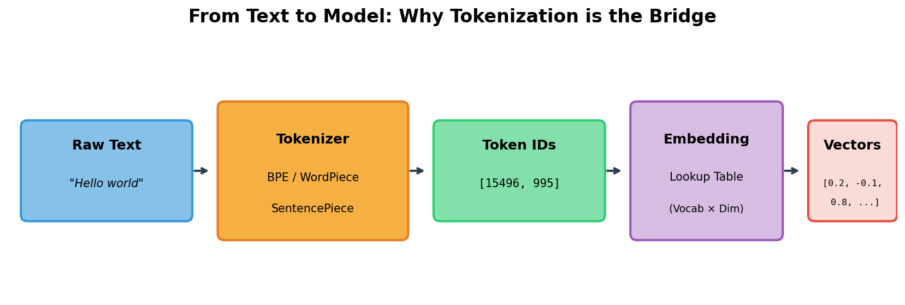
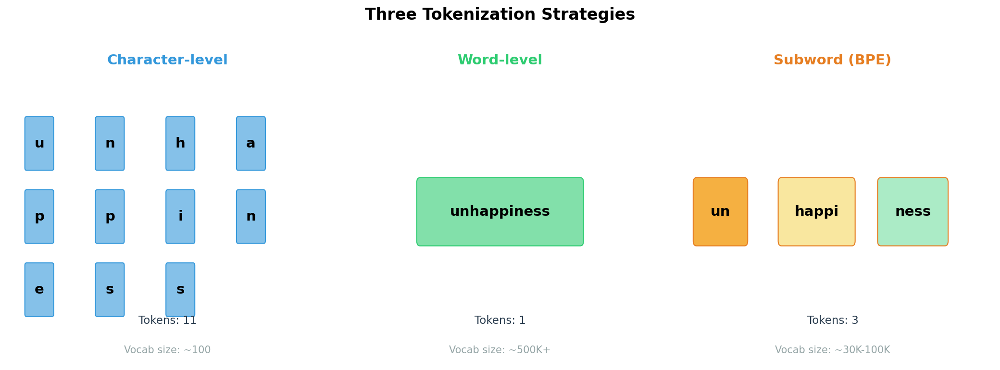
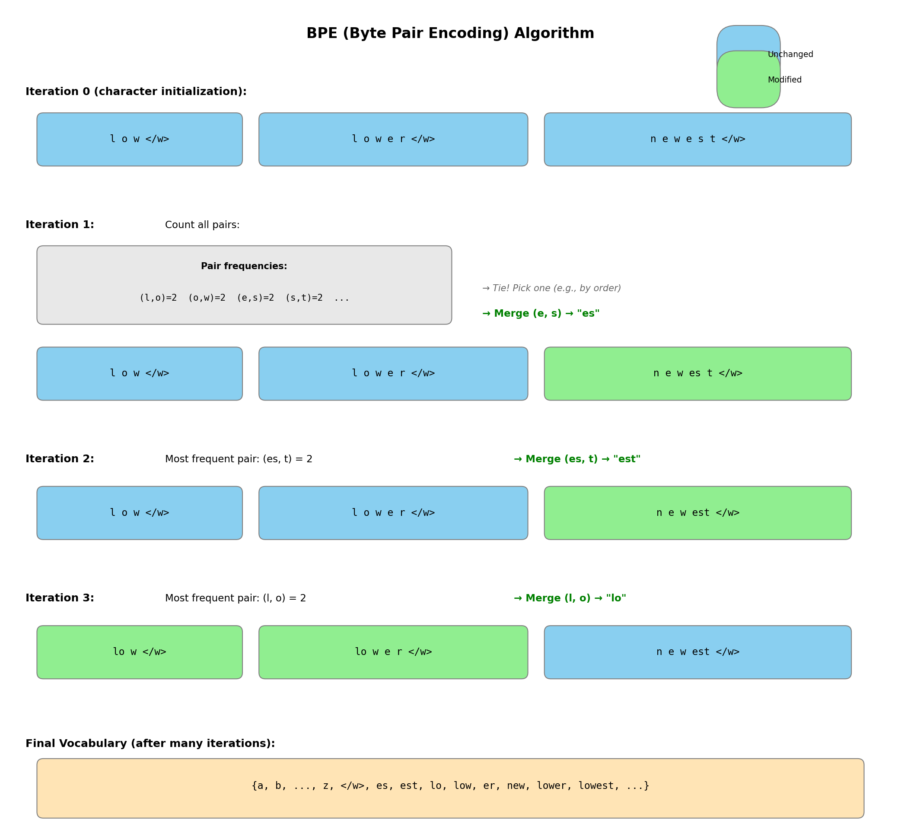
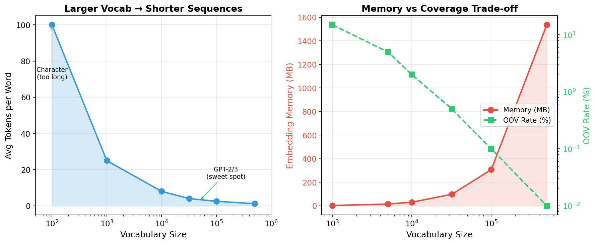
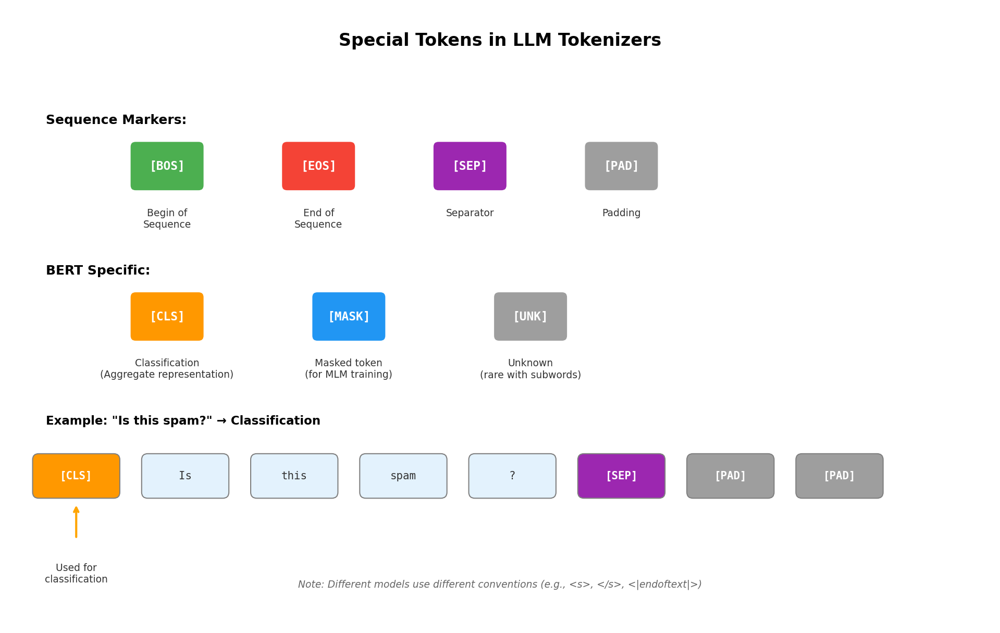
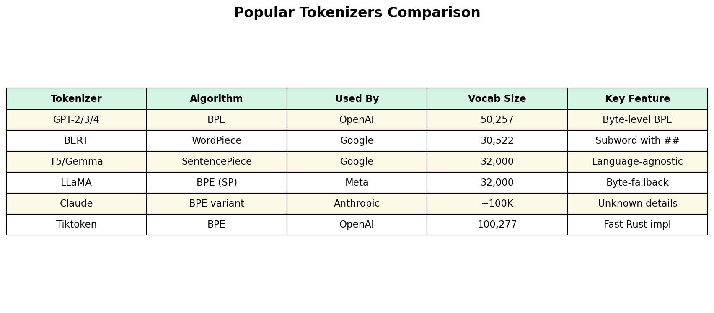
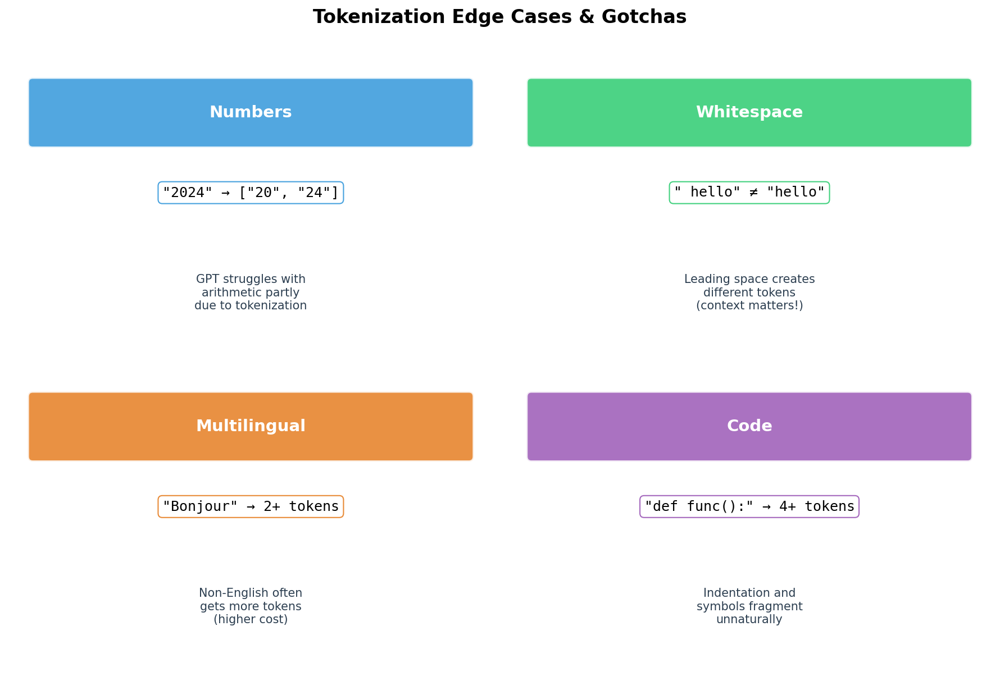

# Day 7: 分词（Tokenization）—— 语言模型的罗塞塔石碑

> **核心问题**：语言模型如何将人类文本转换成可处理的数字？这个看似平凡的步骤为何深刻影响着模型性能乃至你的 API 账单？

---

## 开篇：隐藏的翻译层

想象一下教计算器写诗。计算器只懂数字，但诗歌由文字、标点和空白组成。在任何计算发生之前，你需要一个翻译系统——将"举头望明月，低头思故乡"转换成 `[21421, 314, 8094, 534, 284, 257, 3931, 338, 1110, 30]` 这样的数字序列。

这个翻译系统叫做 **tokenizer（分词器）**，它可能是现代语言模型中最被低估的组件。当研究者们痴迷于注意力机制和 scaling laws 时，分词悄悄决定着：

- 你的 API 调用花费多少（按 token 计费，不是按词）
- 模型能否优雅地处理代码、数学或非英语文本
- 你的上下文窗口能装多少内容
- 为什么会有"ChatGPT 不会数数"的梗

本文将揭开分词的神秘面纱——从历史演变到现代分词器背后的精妙算法，以及它如何以意想不到的方式塑造 LLM 的行为。


*图 1：分词流程将原始文本转换为模型可处理的数值向量。每一步都至关重要，但对用户往往是不可见的。*

---

## 1. 为什么分词重要：不只是简单的词语切分

乍看之下，分词似乎很简单：按空格切分就行了，对吧？"hello" 变成一个 token，"world" 变成另一个。问题解决了。

但这种朴素的方法立刻就会遇到麻烦：

### 词表外（OOV）问题

如果你的词表只包含训练时见过的词，当用户输入 "ChatGPT"、"cryptocurrency" 甚至拼错的 "teh" 时怎么办？用词级分词，这些都会变成 `[UNK]`（未知）token——破坏意义的黑盒。

想想看："The new GPT-4o model is impressive" 可能变成 "The new [UNK] model is impressive"——丢失了句子中最重要的信息。

### 词表规模爆炸

仅英语就有超过 17 万个常用词，加上数百万的专有名词、技术术语和俚语。再加上其他语言、代码和 emoji，你面对的是数百万潜在 token。每个 token 都需要一个 embedding 向量（通常 768-4096 维），所以词表大小直接影响：

$$
\text{Embedding 内存} = \text{词表大小} \times \text{Embedding 维度} \times 4 \text{ 字节}
$$

100 万 token 的词表配 4096 维 embedding 需要 **16 GB** 仅用于 embedding 表！

### 序列长度问题

另一方面，字符级分词（每个字符一个 token）完全解决了 OOV 问题——任何文本都能表示。但 "hello world" 变成 11 个 token 而不是 2 个，序列长度急剧增加。由于 Transformer 注意力的复杂度是 $O(n^2)$，这在计算上是灾难性的。

**根本张力**：我们需要一个足够小以实用、又足够表达力以高效处理任何文本的词表。


*图 2：字符级分词产生很长的序列，词级需要巨大词表，而子词分词（如 BPE——字节对编码）则找到了最佳平衡点。*

---

## 2. 子词分词：优雅的解决方案

现代分词器背后的突破性洞见是 **子词分词（subword tokenization）**：不用固定的词或字符，而是学习一个可变长度片段的词表，平衡覆盖率和效率。

常见词如 "the" 或 "and" 获得自己的 token（高效），而罕见词如 "tokenization" 被分成片段如 `["token", "ization"]`（覆盖）。这样：

- **无 OOV**：任何词都能由子词片段构建
- **适中词表**：通常 3 万-10 万 token
- **合理序列**：常见文本保持紧凑

三种算法主导现代 NLP：

### 2.1 字节对编码（BPE）

BPE 原本是 1994 年的数据压缩算法，2016 年被改编用于 NLP。思路非常简单：

1. **从字符开始**：用所有唯一字符初始化词表
2. **统计对频**：找到最频繁的相邻对
3. **合并**：将该对组合成新 token
4. **重复**：直到达到目标词表大小


*图 3：BPE 迭代合并最频繁的字符对。经过多次迭代，常见词变成单个 token，而罕见词保持拆分。*

让我们用语料 `["low", "lower", "newest", "widest"]` 走一遍具体例子：

**迭代 0**（字符初始化）：
```
词表: {l, o, w, e, r, n, s, t, i, d, </w>}
语料: l o w </w>, l o w e r </w>, n e w e s t </w>, w i d e s t </w>
```

**迭代 1**：最频繁对是 `(e, s)`，出现 2 次
```
新 token: es
语料: l o w </w>, l o w e r </w>, n e w es t </w>, w i d es t </w>
```

**迭代 2**：最频繁对是 `(es, t)`，出现 2 次
```
新 token: est
语料: l o w </w>, l o w e r </w>, n e w est </w>, w i d est </w>
```

经过更多迭代，你会得到像 `low`、`er`、`est`、`new`、`wid` 这样的 token——捕获了有意义的语素。

**关键特性**：BPE 是**确定性的**。给定相同语料和合并次数，总能得到相同词表。这对可复现性至关重要。

### 2.2 WordPiece

由 Google 为 BERT 开发，WordPiece 类似 BPE 但使用不同的合并标准：

$$
\text{score}(x, y) = \frac{\text{freq}(xy)}{\text{freq}(x) \times \text{freq}(y)}
$$

WordPiece 不只看频率，而是最大化训练数据的**似然（Likelihood）**。它合并比偶然预期更经常一起出现的对。

#### WordPiece 背后的数学原理

**"最大化似然"是什么意思？**

给定词表 $V$，对语料库分词的似然是：

$$
P(\text{corpus} | V) = \prod_{\text{word } w} P(w | V)
$$

对于每个词，我们计算其分词的概率。如果 "tokenization" 被拆成 `["token", "ization"]`：

$$
P(\text{"tokenization"}) = P(\text{token}) \times P(\text{ization})
$$

其中每个子词的概率从语料频率估计：

$$
P(\text{subword}) = \frac{\text{count}(\text{subword})}{\text{total tokens}}
$$

**为什么这个 score 公式有效？**

WordPiece 的分数 $\frac{\text{freq}(xy)}{\text{freq}(x) \times \text{freq}(y)}$ 实际上是**点互信息（PMI, Pointwise Mutual Information）**——衡量 $x$ 和 $y$ 一起出现的概率比偶然情况高多少。

- **PMI > 1**：$x$ 和 $y$ 一起出现比预期多 → 好的合并候选
- **PMI = 1**：独立出现，纯粹偶然
- **PMI < 1**：$x$ 和 $y$ 互相"回避"

**例子**：假设语料库有 10,000 词，"to" 出现 1000 次，"ken" 出现 500 次，"token" 出现 400 次：
- 偶然共现的期望值：$\frac{1000 \times 500}{10000} = 50$
- 实际共现：400
- PMI 类似的分数：$\frac{400}{50} = 8$ → 强信号，应该合并！

**BPE vs WordPiece：**
- **BPE**：合并最高频的对 → 贪婪、简单
- **WordPiece**：合并 PMI 最高的对 → 统计学上更有原则

实践中两者产生类似结果，但 WordPiece 倾向于创建更有语言学意义的子词。

**视觉标记**：WordPiece 用 `##` 表示续接。"tokenization" 变成 `["token", "##ization"]`。`##` 信号表示"这个片段续接前一个 token"。

### 2.3 SentencePiece

由 Google 为多语言模型开发，SentencePiece 将输入视为原始字节流——不预先按空格分词。这使它真正**语言无关**：中文、日文和 emoji 与英语一样好用。

SentencePiece 可以实现 BPE 或称为 Unigram 的变体（从大词表开始逐步裁剪）。T5、LLaMA 和 Gemma 都使用它。

**关键创新**：通过将空格视为普通字符（通常标记为 `▁`），SentencePiece 自然处理没有空格的语言。

#### 澄清：算法 vs 工具

这些术语容易混淆。关键区别如下：

| | BPE / WordPiece | SentencePiece |
|--|-----------------|---------------|
| **是什么** | 分词**算法** | 分词**工具/库** |
| **层面** | 合并策略（怎么选 pair） | 实现框架（怎么处理输入） |
| **类比** | 菜谱（做法） | 厨房（工具） |

**SentencePiece 是一个工具，内部可以使用不同算法：**

```
SentencePiece (工具) + BPE (算法)     → LLaMA, T5
SentencePiece (工具) + Unigram (算法) → 也支持
WordPiece (算法) + 自己的实现         → BERT
```

当你看到 "LLaMA 使用 BPE (SentencePiece)" 时，意思是：**用 SentencePiece 库实现的 BPE 算法**。

---

## 3. 词表大小：金发姑娘问题

选择词表大小是关键设计决策：

| 词表大小 | 优点 | 缺点 |
|----------|------|------|
| 小 (8K) | 低内存，快速 embedding 查找 | 长序列，罕见词处理差 |
| 中 (32K) | 英语的良好平衡 | 可能多语言表现不佳 |
| 大 (100K+) | 短序列，更好覆盖 | 高内存，softmax 更慢 |


*图 4：词表大小涉及序列长度与内存/计算之间的根本权衡。现代 LLM 通常使用 3 万-10 万 token。*

**业界选择**：
- GPT-2: 50,257 tokens (BPE)
- BERT: 30,522 tokens (WordPiece)
- LLaMA 2: 32,000 tokens (SentencePiece BPE)
- GPT-4/Claude: ~100K tokens（针对多样输入优化）

趋势是随着模型规模增长使用更大词表——更多 embedding 的固定成本被更短序列和更好覆盖所抵消。

#### 为什么大词表在大规模时更划算

可以理解为**固定成本 vs 可变成本**：

**Embedding 成本（固定，一次性）：**
```
内存增加 = (100K - 32K) × embedding_dim × 4 bytes
         = 68K × 4096 × 4 ≈ 1.1 GB
```
这是一次性支付，不管处理多少文本都不变。

**序列长度成本（可变，每次推理都要付）：**

Transformer 注意力复杂度是 $O(n^2)$，$n$ 是序列长度。

| 词表 | "tokenization" 变成 | Token 数 |
|------|-------------------|---------|
| 小（字符级） | `["t","o","k","e","n","i","z","a","t","i","o","n"]` | 12 |
| 大 | `["token", "ization"]` | 2 |

每次推理都要付这个成本。处理 1 万亿 token 时，节省的计算量会大量累积。

**权衡对比：**

| 因素 | 小词表 (8K) | 大词表 (100K) |
|------|------------|---------------|
| Embedding 内存 | 小（一次性） | 大（一次性） |
| 序列长度 | 长 | **短** |
| 每次推理计算 | 高（$n^2$） | **低** |
| 稀有词覆盖 | 差 | **好** |

**类比**：就像买房 vs 租房：
- **大词表 = 买房**：首付高（embedding 表大），但每月成本低（短序列）
- **小词表 = 租房**：首付低，但每月付更多（长序列）

当模型已经几十 GB 时，多 1-2 GB 的 embedding 不算什么。但每次推理省下的计算量是**永远累积**的。

---

## 4. 特殊 Token：控制面板

除了常规文本 token，每个分词器都包含作为控制信号的**特殊 token**：


*图 5：特殊 token 为模型训练和推理提供必要信号。不同架构使用不同的特殊 token。*

| Token | 全名 | 用途 |
|-------|------|------|
| `[PAD]` | Padding | 将序列填充到统一长度以便批处理 |
| `[UNK]` | Unknown | 词表外 token 的后备（子词分词中罕见） |
| `[BOS]` / `<s>` | Begin of Sequence | 信号生成开始 |
| `[EOS]` / `</s>` | End of Sequence | 信号完成；模型应停止 |
| `[SEP]` | Separator | 分隔段落（如问题与答案） |
| `[CLS]` | Classification | BERT 的聚合表示 token |
| `[MASK]` | Mask | BERT 的掩码语言模型目标 |

**对 prompt 至关重要**：许多微妙的 prompt 工程问题源于特殊 token 处理。例如，在错误位置添加 `[EOS]` 会让模型过早停止。

现代聊天模型添加了更多特殊 token：
```
<|im_start|>system
You are a helpful assistant.
<|im_end|>
<|im_start|>user
Hello!
<|im_end|>
<|im_start|>assistant
```

这些界定角色并启用多轮对话结构。

---

## 5. 流行分词器：实用比较

不同组织做出了不同选择：


*图 6：主要模型使用的分词器。Tiktoken（OpenAI）以其 Rust 实现著称，极快。*

### GPT 分词器 (BPE)

OpenAI 的分词器已经演进：
- **GPT-2**: 50,257 tokens，字节级 BPE
- **GPT-3.5/4**: `cl100k_base`，100,277 tokens
- **GPT-4o**: 多语言优化，~200K tokens

"字节级"意味着基础词表是 256 字节，不是字符。这可以处理任何 UTF-8 文本而不出现 `[UNK]`。

### BERT 分词器 (WordPiece)

BERT 使用 30,522 tokens 的 WordPiece。`##` 前缀表示词续接：
```
"tokenization" → ["token", "##ization"]
"unhappiness"  → ["un", "##happiness"]  # 或进一步拆分
```

### Tiktoken：速度很重要

OpenAI 开源了 [tiktoken](https://github.com/openai/tiktoken)，一个用 Rust 实现的极快 BPE，带 Python 绑定。对于处理数百万请求的生产系统，分词速度很重要：

```python
import tiktoken

enc = tiktoken.get_encoding("cl100k_base")  # GPT-4 编码
tokens = enc.encode("Hello, world!")
print(tokens)  # [9906, 11, 1917, 0]
print(enc.decode(tokens))  # "Hello, world!"
```

---

## 6. 分词边缘情况和陷阱

理解分词怪癖能解释许多令人困惑的 LLM 行为：


*图 7：常见的让开发者措手不及的边缘情况。这些分词怪癖直接影响模型行为。*

### 数字被碎片化

数字 "2024" 可能被分词为 `["20", "24"]` 甚至 `["2", "0", "2", "4"]`。这种碎片化解释了 LLM 为何在以下方面挣扎：
- 算术（"17 × 24 等于多少？"）
- 计数（"strawberry 里有几个 r？"）
- 数字比较（"12345 大于 9999 吗？"）

模型从未将数字视为统一实体——只是任意符号序列。

### 空白敏感

前导空格产生不同 token：
```python
enc.encode("hello")   # [15339]
enc.encode(" hello")  # [24748]  # 不同的 token！
```

这对以下方面很重要：
- Prompt 格式（模板拼接）
- 代码补全（缩进）
- 跨实现的可复现性

### 多语言低效

主要在英语文本上训练的分词器对其他语言效率低下：

| 文本 | 英语 Token 数 | 西班牙语等价含义 |
|------|---------------|------------------|
| "Hello, how are you?" | 5 tokens | "Hola, ¿cómo estás?" = 7+ tokens |

这意味着：
- 非英语用户 API 调用花费更多
- 上下文窗口容纳的非英语词更少
- 某些语言面临 2-5 倍 token 膨胀

### 代码分词

编程语言有自己的怪癖：
```python
def calculate_sum(a, b):
    return a + b
```
可能被分词为许多独立片段，缩进和符号被不自然地碎片化。专门的代码模型通常使用定制分词器。

---

## 7. 代码示例：探索分词

让我们用不同分词器做实验：

```python
import tiktoken
from transformers import AutoTokenizer

# OpenAI 的 tiktoken
enc = tiktoken.get_encoding("cl100k_base")

# 测试字符串
texts = [
    "Hello, world!",
    "tokenization",
    "🚀 Let's go!",
    "def func(x): return x * 2",
    "2024年3月31日",  # 日语/中文日期
]

print("=" * 60)
print("OpenAI cl100k_base (GPT-4)")
print("=" * 60)
for text in texts:
    tokens = enc.encode(text)
    print(f"'{text}'")
    print(f"  Tokens: {tokens}")
    print(f"  Count: {len(tokens)}")
    print(f"  Decoded pieces: {[enc.decode([t]) for t in tokens]}")
    print()

# 与 BERT 分词器对比
print("=" * 60)
print("BERT WordPiece")
print("=" * 60)
bert_tokenizer = AutoTokenizer.from_pretrained("bert-base-uncased")

for text in texts[:3]:  # BERT 处理 emoji 困难
    tokens = bert_tokenizer.tokenize(text.lower())
    ids = bert_tokenizer.encode(text, add_special_tokens=False)
    print(f"'{text}'")
    print(f"  Tokens: {tokens}")
    print(f"  IDs: {ids}")
    print(f"  Count: {len(tokens)}")
    print()
```

**示例输出**（简化）：
```
'Hello, world!'
  Tokens: [9906, 11, 1917, 0]
  Count: 4
  Decoded pieces: ['Hello', ',', ' world', '!']

'tokenization'
  Tokens: [5765, 2065]
  Count: 2
  Decoded pieces: ['token', 'ization']

'🚀 Let's go!'
  Tokens: [9468, 248, 10058, 596, 733, 0]
  Count: 6
  Decoded pieces: ['🚀', '', " Let's", ' go', '!']
```

**关键观察**：
1. 常见词保持完整；罕见词拆分
2. Emoji 使用多个 token（编码为字节序列）
3. 空格处理不同（" world" vs "world"）
4. 不同分词器产生不同拆分

---

## 8. 数学推导：信息论视角 [选读]

> 本节供想深入理解的读者阅读。

分词可以从信息论角度理解。目标是找到一个最小化语料总描述长度的词表。

**最小描述长度（MDL）原则**：

$$
\begin{aligned}
L_{\text{total}} &= L_{\text{vocab}} + L_{\text{corpus}} \\
&= |\mathcal{V}| \cdot \text{avg\_token\_len} + \sum_{t \in \text{corpus}} \log_2 \frac{1}{P(t)}
\end{aligned}
$$

其中：
- $L_{\text{vocab}}$：存储词表的代价
- $L_{\text{corpus}}$：用词表编码语料的代价
- $P(t)$：语料中 token $t$ 的概率

**BPE 近似这个目标**：通过合并频繁对，BPE 创建经常出现的 token，减少 $L_{\text{corpus}}$。固定词表大小限制了 $L_{\text{vocab}}$。

**Unigram（BPE 替代方案）** 显式优化：

$$
\mathcal{L}(\mathbf{x}) = \sum_{i=1}^{N} \log P(x_i | \theta)
$$

其中 $\mathbf{x}$ 是语料，$\theta$ 表示词表参数。Unigram 从大词表开始，迭代裁剪对似然影响最小的 token。

---

## 9. 常见误解

### ❌ "分词只是预处理——不重要"

**事实**：分词从根本上决定了模型能学习什么模式。一个将 "2024" 视为 `["20", "24"]` 的模型字面上无法学习 2024 是一个单独的数字。分词是有深远影响的**设计选择**。

### ❌ "更多 token = 更长文本"

**事实**：Token 数与词数没有直接关联。"Hello" 是 1 个 token，但 "🚀" 可能是 3 个 token（编码为 UTF-8 字节）。这就是为什么按 token 计价的 API 会让写非英语或使用 emoji 的用户感到意外。

### ❌ "所有分词器工作方式相同"

**事实**：GPT-4 的分词器产生的 token ID 与 BERT 完全不同。你不能混用分词器——用某个分词器训练的模型必须在推理时使用完全相同的分词器。

---

## 10. 历史背景：从字符到子词

分词的演进反映了领域的成长：

| 时代 | 方法 | 局限 |
|------|------|------|
| 1990s | 词级 | OOV 问题，巨大词表 |
| 2000s | 字符级 | 序列很长，训练慢 |
| 2016 | BPE (Sennrich et al.) | 第一个实用的子词方法 |
| 2018 | WordPiece (BERT) | 为语言理解优化 |
| 2018 | SentencePiece | 语言无关，无预处理 |
| 2020+ | 字节级 BPE | 处理任何 UTF-8，无 [UNK] |

Sennrich 等人 2016 年的开创性论文 [Neural Machine Translation of Rare Words with Subword Units](https://arxiv.org/abs/1508.07909) 表明 BPE 大幅提升了罕见词的翻译质量。这一洞见传播到整个 NLP 领域。

---

## 11. 实践意义

### 对 API 用户

- **数 token，不是数词**：用 `tiktoken` 或提供商的分词器估算成本
- **非英语更贵**：预期非英语文本有 1.5-3 倍 token
- **代码被碎片化**：编程语言经常分词效率低下
- **Prompt 工程**：注意空白和特殊字符影响分词

### 对模型开发者

- **词表大小**：在序列长度和 embedding 内存之间平衡
- **多语言支持**：全球应用考虑 SentencePiece 或字节级 BPE
- **领域特定**：金融、医疗或代码模型可能受益于定制分词器
- **评估**：Token 级指标（困惑度）不总是与词级质量相关

---

## 12. 延伸阅读

### 初学者
1. [OpenAI Tokenizer Tool](https://platform.openai.com/tokenizer)
   实时可视化文本如何被分词

2. [Hugging Face Tokenizers Tutorial](https://huggingface.co/docs/tokenizers/)
   训练自定义分词器的全面指南

### 进阶
1. [tiktoken GitHub Repository](https://github.com/openai/tiktoken)
   OpenAI 的快速 BPE 实现，有详细文档

2. [SentencePiece GitHub](https://github.com/google/sentencepiece)
   Google 的语言无关分词器库

### 论文
1. [Neural Machine Translation of Rare Words with Subword Units](https://arxiv.org/abs/1508.07909)
   Sennrich et al. (2016) — 开启一切的 BPE 论文

2. [SentencePiece: A simple and language independent subword tokenizer](https://arxiv.org/abs/1808.06226)
   Kudo & Richardson (2018) — 介绍 SentencePiece

3. [A Systematic Comparison of BPE and Byte-Level Models](https://arxiv.org/abs/2004.03720)
   分词策略的详细分析

---

## 思考题

1. **为什么你认为 GPT 模型使用更大的词表（100K+），而早期模型使用较小的（30K）？** 考虑序列长度、内存和覆盖率之间的权衡。

2. **分词可能如何影响模型学习数学推理的能力？** 想想数字如何被表示，哪些模式变得可见或不可见。

3. **如果你为非英语语言构建专门的 LLM，你会做出哪些与英语中心模型不同的分词选择？**

---

## 总结

| 概念 | 一句话解释 |
|------|-----------|
| 分词（Tokenization） | 将文本转换为模型可处理的数字 ID |
| 子词分词 | 词级和字符级方法之间的平衡 |
| BPE | 迭代合并频繁字符对构建词表 |
| WordPiece | 类似 BPE 但最大化训练数据似然 |
| SentencePiece | 语言无关的分词器，将输入视为原始字节 |
| 词表大小 | 序列长度与 embedding 内存之间的权衡 |
| 特殊 token | [PAD]、[EOS]、[CLS] 等模型行为控制信号 |
| Token 碎片化 | LLM 在数字、代码和非英语上挣扎的原因 |

**核心要点**：分词是语言模型的隐形基础。它决定了哪些模式可学习、文本处理效率如何、以及模型为何表现出某些怪癖。理解分词能将神秘的 LLM 行为转化为设计选择的可预测后果。下次 GPT 数不清 "strawberry" 里有几个字母时，你就知道原因了——并能欣赏让其他一切正常运作的精妙工程。

---

*Day 7 of 60 | LLM 基础课程*
*字数：约 3,200 | 阅读时间：约 16 分钟*
