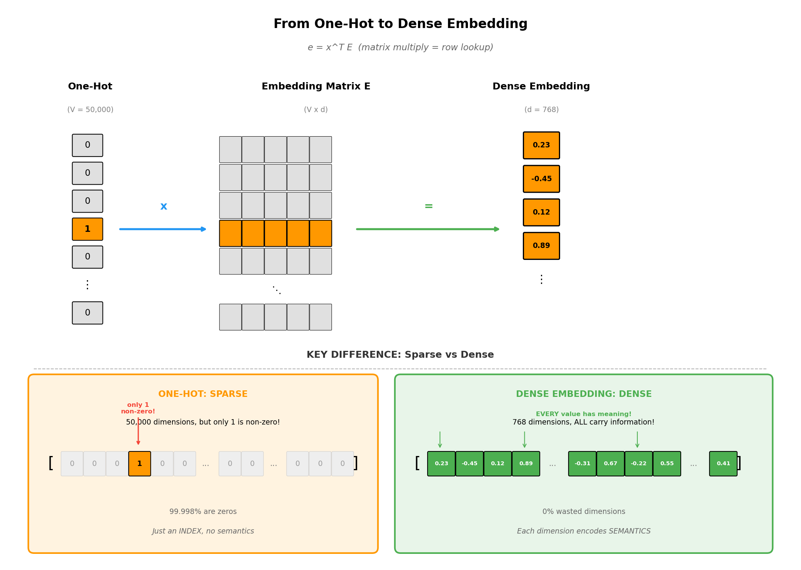

# Day 8: 嵌入的魔法

> **核心问题**：神经网络如何理解词语？"king - man + woman = queen" 是怎么实现的？

---

## 开篇

想象一下，有人让你测量两个词之间的"距离"：*cat* 和 *dog*。你会怎么做？

如果词只是任意符号——就像字典中的索引号——就没有有意义的方式来衡量这种距离。"Cat" 可能是第 3,847 号词，"dog" 可能是第 12,456 号词。数值差异并不能告诉我们它们之间的关系。

但如果我们能把词放入一个**空间**，让位置本身承载意义呢？如果 *cat* 和 *dog* 自然地靠在一起（都是宠物、动物、四条腿），而 *democracy* 则飘在远处呢？

这正是 **嵌入（Embedding）** 所做的事情。它们将离散的符号转换为连续的向量，其中 **几何关系编码语义关系**。就像给词语在意义的宇宙中分配 GPS 坐标——这是现代 AI 中最优美的想法之一。

可以这样理解：图书馆按索书号组织书籍（离散标签），但一个好的图书管理员知道，相似主题的书 *应该* 放在相邻的书架上。嵌入就是自动发现每本"书"（词）应该放在哪里的数学机制。

在这篇文章中，我们将探索嵌入如何工作、为什么它们是每个语言模型的基础，以及向量上的简单算术如何捕获复杂的语义关系。

---

## 1. 从 One-Hot 到稠密：表示问题

### 1.1 One-Hot 编码的诅咒

用计算机表示词语的朴素方法是 **One-Hot 编码（独热编码）**：创建一个与词表一样长的向量，在该词的位置放 1，其他位置全是 0。


*图 1：One-hot 编码创建稀疏、高维的向量，不包含语义信息。稠密嵌入将意义压缩到少量维度中。*

对于 50,000 个词的词表，每个词变成一个 50,000 维的向量，其中只有一个非零元素。这有三个致命问题：

1. **维度爆炸**：内存和计算随词表大小线性增长
2. **没有相似性**：任意两个 one-hot 向量都是等距的（正交）
3. **无法泛化**："cat" 和 "kitten" 在结构上毫无共同之处

最后一点至关重要。如果模型学到了关于 "cat" 的知识，这些知识无法迁移到 "kitten"，因为它们的表示没有共享任何结构。

### 1.2 分布式假设

解决方案来自一个语言学洞见，称为 **分布式假设（Distributional Hypothesis）**：

> *"从一个词的陪伴者，你就能了解这个词。"* — J.R. Firth, 1957

出现在相似上下文中的词往往具有相似的含义。"Dog" 和 "cat" 都出现在 "pet"、"fur"、"veterinarian" 等词附近——这种上下文模式揭示了它们的语义相似性。

嵌入将这一洞见操作化：它们学习向量表示，使得出现在相似上下文中的词获得相似的向量。

### 1.3 稠密嵌入：有意义的压缩

**稠密嵌入（Dense Embedding）** 将每个词映射到一个低维向量（通常是 256-1024 维），其中：

- **邻近编码相似性**：相似的词有相似的向量
- **维度是学习的特征**：每个维度可能捕获某些意义方面（尽管通常不可解释）
- **算术捕获关系**：向量运算对应语义运算

嵌入矩阵 $E \in \mathbb{R}^{V \times d}$（其中 $V$ 是词表大小，$d$ 是嵌入维度）每行对应一个词。查找一个词的嵌入就是获取该行：

$$
\text{embedding}(\text{word}_i) = E[i, :] \in \mathbb{R}^d
$$

这在数学上等价于将 one-hot 向量乘以嵌入矩阵——但为了效率，实现为直接查表。


*图 2：嵌入层就是一个查找表。One-hot 乘法等价于从学习的矩阵中选择一行。*

---

## 2. Word2Vec：从上下文学习嵌入

### 2.1 Word2Vec 革命

2013 年，Google 的 Tomas Mikolov 及其同事发布了 **Word2Vec**，展示了在大规模文本语料上训练的简单神经网络可以学习到捕获显著语义属性的嵌入。

Word2Vec 有两种变体：

- **CBOW（Continuous Bag of Words）**：从周围上下文预测中心词
- **Skip-gram**：从中心词预测周围上下文词


*图 3：CBOW 从上下文预测中心词；Skip-gram 从中心词预测上下文。Skip-gram 通常对罕见词效果更好。*

### 2.2 Skip-gram 详解

对于句子 "The quick **fox** jumps over"，Skip-gram 问：给定 "fox"，我们能预测 "quick" 和 "jumps" 吗？

模型有两个矩阵：
- $W_{\text{in}} \in \mathbb{R}^{V \times d}$：输入嵌入（用于中心词）
- $W_{\text{out}} \in \mathbb{R}^{d \times V}$：输出嵌入（用于上下文词）

对于每个（中心词，上下文词）对，概率是：

$$
P(\text{context} | \text{center}) = \frac{\exp(w_{\text{context}}^T \cdot w_{\text{center}})}{\sum_{w \in V} \exp(w^T \cdot w_{\text{center}})}
$$

**公式拆解：**

| 符号 | 含义 | 例子 |
|------|------|------|
| $w_{\text{center}}$ | 中心词的向量（来自 $W_{\text{in}}$） | "fox" → [0.7, 0.8, 0.9] |
| $w_{\text{context}}$ | 上下文词的向量（来自 $W_{\text{out}}$） | "quick" → [0.3, 0.4, 0.5] |
| $w_{\text{context}}^T \cdot w_{\text{center}}$ | 点积 = 相似度分数 | 0.98（越高越相似） |
| $\exp(\cdot)$ | 指数函数，把值变成正数（见下文） | $e^{0.98} = 2.66$ |
| $\sum_{w \in V}$ | 对词表中所有词求和 | 对 the, quick, fox, jumps, over... 求和 |

**通俗解释：**

- **分子** $\exp(w_{\text{context}}^T \cdot w_{\text{center}})$："fox 和 quick 有多相似？" — 点积越大 = 越相似 = 分子越大。

- **分母** $\sum_{w \in V} \exp(w^T \cdot w_{\text{center}})$："fox 和词表里每个词的相似度总和是多少？" — 这是归一化项，让所有概率加起来等于 1。

- **整个公式**："quick 占了总相似度的多少比例？" — 如果 fox-quick 的相似度相对于 fox-其他所有词 更高，那 P(quick|fox) 就更高。

> **直觉**：这就是 softmax！我们在问："看到 'fox' 后，哪个词最可能出现在它旁边？" 模型会学着给真正共现的词打高分。

**为什么要用 exp()？**

向量元素可以是**负数**（它们是从随机初始化学出来的），所以点积也可能是负数：

| 点积 | exp() 结果 | 含义 |
|------|-----------|------|
| -2.0 | 0.135 | 相似度低 → 概率低 |
| 0.0 | 1.0 | 中性 |
| +2.0 | 7.39 | 相似度高 → 概率高 |

因为概率必须是正数，exp() 能把任意实数映射到 **(0, +∞)**。这就是 softmax 用 exp() 的原因——它把任意相似度分数转换成有效的概率。

**为什么概率加起来等于 1？**

注意分母是对**所有词**求和，而分子只是**一个词**。当我们把所有词的概率加起来：

$$\sum_{\text{所有词}} P(\text{word}|\text{fox}) = \sum_{\text{所有词}} \frac{\exp(\text{score}_{\text{word}})}{\underbrace{\sum_{w} \exp(\text{score}_w)}_{\text{每个词都一样}}} = \frac{\text{分母}}{\text{分母}} = 1$$

**用我们的数字验证：**
```
P(the|fox)   = 1.65 / 11.45 = 0.144
P(quick|fox) = 2.66 / 11.45 = 0.232
P(fox|fox)   = 2.10 / 11.45 = 0.183
P(jumps|fox) = 3.39 / 11.45 = 0.296
P(over|fox)  = 1.65 / 11.45 = 0.144
────────────────────────────────────
总和                        = 0.999 ≈ 1 ✓
```

训练最大化语料库中所有观察到的（中心词，上下文词）对的这个概率。得到的 $W_{\text{in}}$ 矩阵就是词嵌入。

#### 具体例子：计算 P(quick | fox)

让我们用实际数字一步步走完整个过程。

**设定：**
- 句子："The quick fox jumps over"
- 中心词："fox"
- 要预测的上下文词："quick"（窗口大小 = 1）
- 迷你词表：{the, quick, fox, jumps, over}（V = 5）
- 嵌入维度：d = 3

**两个矩阵（随机初始化）：**

$W_{\text{in}}$（5×3）- 用于中心词：
| 词 | dim0 | dim1 | dim2 |
|------|------|------|------|
| the | 0.1 | 0.2 | 0.3 |
| quick | 0.4 | 0.5 | 0.6 |
| **fox** | **0.7** | **0.8** | **0.9** |
| jumps | 0.2 | 0.3 | 0.4 |
| over | 0.5 | 0.6 | 0.7 |

$W_{\text{out}}$（3×5）- 用于上下文词：
| | the | quick | fox | jumps | over |
|------|------|------|------|------|------|
| dim0 | 0.1 | 0.3 | 0.2 | 0.4 | 0.1 |
| dim1 | 0.2 | 0.4 | 0.3 | 0.5 | 0.2 |
| dim2 | 0.3 | 0.5 | 0.4 | 0.6 | 0.3 |

**Step 1：** 取出 "fox" 的输入向量：$w_{\text{center}} = [0.7, 0.8, 0.9]$

**Step 2：** 取出 "quick" 的输出向量：$w_{\text{context}} = [0.3, 0.4, 0.5]$

**Step 3：** 计算点积（相似度）：
$$w_{\text{context}}^T \cdot w_{\text{center}} = 0.3 \times 0.7 + 0.4 \times 0.8 + 0.5 \times 0.9 = 0.98$$

**Step 4：** 计算所有词的点积（分母部分）：
- the：$0.1 \times 0.7 + 0.2 \times 0.8 + 0.3 \times 0.9 = 0.50$
- quick：$0.98$ ← 我们的目标
- fox：$0.2 \times 0.7 + 0.3 \times 0.8 + 0.4 \times 0.9 = 0.74$
- jumps：$0.4 \times 0.7 + 0.5 \times 0.8 + 0.6 \times 0.9 = 1.22$
- over：$0.50$

**Step 5：** 应用 softmax：
$$P(\text{quick} | \text{fox}) = \frac{e^{0.98}}{e^{0.50} + e^{0.98} + e^{0.74} + e^{1.22} + e^{0.50}} = \frac{2.66}{11.45} = 0.23$$

**结果：** 只有 23% 的概率——太低了！训练会调整矩阵，让 "fox" 和 "quick" 的点积更大（向量更相似），从而提高 P(quick|fox)。

> **核心洞察：** 经常一起出现的词，通过这个训练过程，它们的向量会被"推"得越来越相似。

### 2.3 负采样：让训练变得可行

softmax 的分母需要对所有词表词求和——代价高得难以承受。**负采样（Negative Sampling）** 通过重新表述问题来解决这个问题：

模型不是预测正确的上下文词，而是学习区分 **真实的**（中心词，上下文词）对和 **虚假的**（中心词，随机词）对。

对于正样本对 $(w, c)$ 和 $k$ 个负样本 $\{n_1, ..., n_k\}$：

$$
\begin{aligned}
\mathcal{L} &= \log \sigma(w_c^T \cdot w_w) + \sum_{i=1}^{k} \log \sigma(-w_{n_i}^T \cdot w_w)
\end{aligned}
$$

其中 $\sigma$ 是 sigmoid 函数。这将昂贵的 softmax 转换为 $k+1$ 个二元分类。

#### 具体例子：为什么负采样更快

继续用 "fox" 的例子来看看为什么这很重要。

**Softmax 的问题：**

在上面的 Step 4 中，我们计算了所有 5 个词的点积。但真实词表有 50,000+ 个词——每个训练样本要算 50,000 次点积！

**负采样的解决方案：**

不再问"上下文是哪个词？"（50,000 类分类），而是问"这个配对是真是假？"（二分类）。

**设定：**
- 正样本：(fox, quick) ✅ — 真的一起出现过
- 负样本 (k=2)：(fox, the) ❌、(fox, over) ❌ — 随机配对

**模型要学习的：**
- 给 (fox, quick) **高分** → 真实共现
- 给 (fox, the) **低分** → 假配对
- 给 (fox, over) **低分** → 假配对

**计算 Loss：**

用前面的向量：
- fox = [0.7, 0.8, 0.9]
- quick = [0.3, 0.4, 0.5]（正样本）
- the = [0.1, 0.2, 0.3]（负样本）

点积：
- fox · quick = 0.98（希望这个大）
- fox · the = 0.50（希望这个小）

Loss 计算：
$$\mathcal{L} = \log \sigma(0.98) + \log \sigma(-0.50) = \log(0.73) + \log(0.38) = -0.31 + (-0.97) = -1.28$$

训练会让：
- fox · quick **变大** → 第一项改善
- fox · the **变小** → 第二项改善

**速度对比：**

| 方法 | 每个样本的点积次数 |
|--------|------------------------|
| Softmax | 50,000 |
| 负采样 (k=5) | **6**（1 正 + 5 负）|

快了 **8,000 倍**！

> 📚 **历史小记：负采样是怎么被发明的？**
> 
> 负采样由 Tomas Mikolov 等人于 2013 年在 Google 提出，发表在论文 *"Distributed Representations of Words and Phrases and their Compositionality"* 中。
> 
> 这个想法经历了几个阶段的演变：
> 1. **早期 Word2Vec (2013 年初)**：使用*层次 Softmax*——一种二叉树结构，把 V 次计算减少到 log(V) 次。更快了，但实现复杂。
> 2. **来自 NCE 的灵感**：一种叫做*噪声对比估计* (Noise Contrastive Estimation) 的统计技术（Gutmann & Hyvärinen, 2010）提出：与其学习"正确答案是什么"，不如学习"怎么区分真的和假的"。
> 3. **简化**：Mikolov 通过去掉归一化常数的估计，简化了 NCE。数学上不那么严格，但实践中效果一样好——而且实现起来简单得多。
> 
> 核心洞察：把一个 50,000 类分类问题重新表述为"这个配对是真是假？" 就像把考试从"从 50,000 个选项中选出正确答案"改成"这个答案对不对？是/否"。

---

## 3. 魔法：语义算术

### 3.1 King - Man + Woman = Queen

Word2Vec 最著名的结果是向量算术捕获了语义关系：

$$
\vec{\text{king}} - \vec{\text{man}} + \vec{\text{woman}} \approx \vec{\text{queen}}
$$

这之所以有效，是因为嵌入学习了 **一致的方向关系**：
- "男性→女性" 方向是相似的，无论你从 "king"、"man"、"uncle" 还是 "actor" 开始
- "平民→皇室" 方向在不同性别之间是一致的


*图 4：词类比之所以有效，是因为关系被编码为嵌入空间中的一致方向。*

### 3.2 为什么这会奏效？

魔法来自训练目标。考虑类比 "king:queen :: man:woman"。

在训练过程中：
- "King" 和 "queen" 出现在相似的上下文中（royalty、throne、crown）
- "King" 和 "man" 共享上下文（he、him、男性名字）
- "Queen" 和 "woman" 共享上下文（she、her、女性名字）

优化压力迫使嵌入同时满足所有这些约束。解决方案是一个结构化空间，其中语义关系作为几何属性涌现。

### 3.3 静态嵌入的局限性

Word2Vec 嵌入是 **静态的**——每个词只有一个向量，与上下文无关。这对以下情况失效：

- **多义词**："bank"（金融）vs "bank"（河岸）获得相同的嵌入
- **依赖上下文的含义**："Apple stock" 中的 "apple" vs "apple pie"

这一局限性催生了 **上下文嵌入（Contextual Embeddings）**（ELMo、BERT、GPT），其中词的表示取决于其周围的上下文。我们将在后续文章中探讨这些。

---

## 4. 向量空间中的语义聚类

嵌入自然地组织成语义簇。相似的词聚集在一起，簇之间的关系通常与现实世界的分类法平行。


*图 5：词按语义类别聚类。动物、国家、动词和数字在嵌入空间中形成不同的区域。*

这种聚类从训练数据的分布模式中自动涌现。没有人告诉模型 "dog" 和 "cat" 是动物——它通过观察它们出现在相似的上下文中发现了这种结构。

**为什么会自组织？** 想想看："cat" 和 "dog" 都经常和 "feed"、"vet"、"pet"、"cute" 这些词一起出现。训练会把 "cat" 推向这些上下文词，同时也把 "dog" 推向同样的上下文词。结果是，"cat" 和 "dog" 最终靠在了一起——不是因为我们标注它们相似，而是因为它们共享相似的上下文。语义几何是从共现统计中自然涌现的。

实际意义：查找同义词、检测相关概念或聚类文档等任务变成了简单的几何操作（最近邻、聚类算法等）。

---

## 5. 位置编码：你在序列中的位置

### 5.1 位置问题

嵌入解决了词的表示问题，但它们不能捕获 **词序**。句子 "Dog bites man" 和 "Man bites dog" 会有相同的词袋嵌入表示，尽管含义完全不同。

RNN（循环神经网络）通过顺序处理词来解决这个问题——位置隐含在处理顺序中。但 Transformer 并行处理所有位置，所以它们需要显式的位置信息。

### 5.2 正弦位置编码

原始 Transformer 论文引入了 **正弦位置编码（Sinusoidal Positional Encoding）**：

$$
\begin{aligned}
PE_{(pos, 2i)} &= \sin\left(\frac{pos}{10000^{2i/d}}\right) \\
PE_{(pos, 2i+1)} &= \cos\left(\frac{pos}{10000^{2i/d}}\right)
\end{aligned}
$$

其中 $pos$ 是位置，$i$ 是维度索引。


*图 6：正弦位置编码。不同的维度以不同的频率编码位置，使模型能够关注局部和全局位置。*

### 5.3 为什么是正弦函数？

这种设计有优雅的属性：

1. **唯一编码**：每个位置获得唯一的模式
2. **相对位置**：$PE_{pos+k}$ 可以表示为 $PE_{pos}$ 的线性函数
3. **有界值**：所有值保持在 $[-1, 1]$
4. **外推**：理论上可以扩展到比训练更长的位置

直觉是：不同的频率让模型在不同尺度上推理位置。低频维度在位置之间缓慢变化（捕获全局结构），而高频维度快速变化（捕获局部关系）。

### 5.4 学习的 vs 固定的位置编码

现代模型通常使用 **学习的位置嵌入**——只是另一个按位置索引的嵌入矩阵。GPT-2 和 BERT 都使用学习的位置。

更近期的创新包括：
- **RoPE（旋转位置嵌入）**：通过复数空间中的旋转编码相对位置
- **ALiBi（线性偏置注意力）**：向注意力分数添加位置相关的偏置
- **NoPE**：一些模型通过依赖因果注意力结构而无需显式位置编码

---

## 6. Token + Position = 输入表示

在 Transformer 中，最终的输入表示结合了 token 嵌入和位置编码：

$$
x_i = \text{TokenEmbed}(w_i) + \text{PositionEncode}(i)
$$


*图 7：输入 Transformer 的最终嵌入是 token 嵌入和位置编码的和。*

这种简单的加法效果出奇地好。模型学会使用这两部分信息——token 嵌入告诉它词 *是什么*，位置编码告诉它词 *在哪里*。

---

## 7. 代码示例：探索嵌入

```python
import torch
import torch.nn as nn
import numpy as np

# 创建一个简单的嵌入层
vocab_size = 10000
embedding_dim = 256

# 这只是一个可学习的查找表！
embedding = nn.Embedding(vocab_size, embedding_dim)

# 查找一些 token 的嵌入
token_ids = torch.tensor([42, 1337, 999])  # 三个词
vectors = embedding(token_ids)  # 形状: (3, 256)

print(f"Token IDs shape: {token_ids.shape}")
print(f"Embeddings shape: {vectors.shape}")

# 计算词之间的余弦相似度
def cosine_similarity(v1, v2):
    return torch.dot(v1, v2) / (torch.norm(v1) * torch.norm(v2))

# 训练前，嵌入是随机的
sim_01 = cosine_similarity(vectors[0], vectors[1])
print(f"Similarity between word 42 and 1337: {sim_01:.4f}")

# 位置编码实现
def get_positional_encoding(max_len, d_model):
    """生成正弦位置编码。"""
    pe = torch.zeros(max_len, d_model)
    position = torch.arange(0, max_len, dtype=torch.float).unsqueeze(1)
    div_term = torch.exp(torch.arange(0, d_model, 2).float() * 
                        (-np.log(10000.0) / d_model))
    
    pe[:, 0::2] = torch.sin(position * div_term)  # 偶数维度
    pe[:, 1::2] = torch.cos(position * div_term)  # 奇数维度
    
    return pe

# 生成位置编码
pe = get_positional_encoding(max_len=512, d_model=256)
print(f"Positional encoding shape: {pe.shape}")

# 组合 token + position 嵌入
sequence_length = 3
token_embeddings = vectors  # 从嵌入查找
position_embeddings = pe[:sequence_length]  # 获取前 3 个位置

# Transformer 的最终输入
final_embeddings = token_embeddings + position_embeddings
print(f"Final embeddings shape: {final_embeddings.shape}")
```

---

## 8. 数学推导 [选读]

> 本节为感兴趣的读者提供更深入的数学基础。

### 8.1 为什么点积衡量相似性

两个向量 $\mathbf{a}$ 和 $\mathbf{b}$ 的点积是：

$$
\mathbf{a} \cdot \mathbf{b} = \|\mathbf{a}\| \|\mathbf{b}\| \cos(\theta)
$$

其中 $\theta$ 是它们之间的夹角。对于归一化向量（单位长度）：

$$
\mathbf{a} \cdot \mathbf{b} = \cos(\theta)
$$

这的范围是：
- 当向量指向相同方向时为 $+1$（夹角 = 0°）
- 当向量垂直时为 $0$（夹角 = 90°）
- 当向量指向相反方向时为 $-1$（夹角 = 180°）

这就是为什么 **余弦相似度（Cosine Similarity）** 是比较嵌入的标准度量。

### 8.2 嵌入矩阵作为线性变换

从数学上看，查找嵌入可以视为矩阵乘法：

$$
\mathbf{e} = \mathbf{x}^T E
$$

其中 $\mathbf{x} \in \mathbb{R}^V$ 是 one-hot 向量，$E \in \mathbb{R}^{V \times d}$ 是嵌入矩阵。

由于 $\mathbf{x}$ 只有一个非零元素（在位置 $i$），这个乘法只是选择 $E$ 的第 $i$ 行。但矩阵表述表明嵌入是从 one-hot 空间到嵌入空间的可学习线性投影。


*图 7：从 one-hot 到 dense embedding 的完整流程。左：稀疏的 one-hot 向量（只有 1 个非零）。中：学到的嵌入矩阵（每行是一个词的"含义"）。右：稠密嵌入（每个值都携带语义信息）。操作就是矩阵乘法，但等价于查找 E 的第 i 行。*

**这个投影的真正含义：**

| 空间 | 维度 | 特性 |
|------|------|------|
| One-hot 空间 | V = 50,000 | 稀疏，无语义，只是索引 |
| Embedding 空间 | d = 768 | 稠密，每个维度都有意义 |

嵌入矩阵 $E$ 学习将庞大、无意义的 one-hot 空间压缩到紧凑、语义丰富的空间，让相似的词彼此靠近。

### 8.3 为什么加法对 Position + Token 有效

当我们把 token 和 position 嵌入相加时，看起来信息会混在一起丢失。但模型之后可以通过线性操作分离它们！

考虑注意力查询：

$$
Q = W_Q (E_{\text{token}} + E_{\text{pos}}) = W_Q E_{\text{token}} + W_Q E_{\text{pos}}
$$

这利用了**线性代数的分配律**。但为什么信息不会互相干扰呢？

**具体例子：**

```
E_token("fox") = [0.5, 0.3, 0.8, 0.2]   ← "fox" 的语义
E_pos(3)       = [0.1, 0.0, 0.1, 0.0]   ← 位置 3 的编码
──────────────────────────────────────
相加后         = [0.6, 0.3, 0.9, 0.2]   ← 混合向量
```

信息看起来"混"在一起了，但 $W_Q$ 可以学会**分离它们**：
- $W_Q$ 的某些行专注于 token 信息强的维度
- 另一些行专注于 position 信息强的维度

**为什么能分离：近似正交**

Token 嵌入和 position 嵌入往往住在向量空间的不同"方向"：

$$\langle E_{\text{token}}, E_{\text{pos}} \rangle \approx 0$$

当两个信号大致正交（垂直）时，它们不会破坏性干扰，线性变换可以学会分别提取每一个。

**类比：** 就像音频混音——如果人声主要是低频，背景音乐主要是高频，你可以设计滤波器分离它们。同样，如果 token 和 position 信息占据嵌入空间的不同"频段"，模型可以学会把它们分开。

---

## 9. 常见误解

### ❌ "嵌入的每个维度代表一个特定概念，如 'royalty' 或 'gender'"

**真相**：虽然我们用可解释的轴来可视化嵌入，但实际学习的维度通常不是人类可解释的。有意义的结构存在于 **向量之间的关系** 中，而不是单个维度中。一些研究（如 [Mikolov et al., 2013](https://arxiv.org/abs/1301.3781)）发现了半可解释的方向，但这是例外，不是规则。

### ❌ "更大的嵌入维度总是更好"

**真相**：存在一个最佳点。维度太少会欠拟合（无法捕获词表复杂性），太多会过拟合并浪费计算。大多数现代 LLM 根据模型大小使用 768-4096 维。嵌入维度通常与模型容量成比例。

### ❌ "Word2Vec 嵌入捕获了词的所有含义"

**真相**：像 Word2Vec 这样的静态嵌入给每个词只分配一个向量，这对多义词失效。"Bank" 获得一个平均了金融和河岸含义的嵌入。现代上下文嵌入（来自 Transformer）根据上下文生成不同的表示。

---

## 10. 进一步阅读

### 入门
1. [The Illustrated Word2Vec](https://jalammar.github.io/illustrated-word2vec/)
   Jay Alammar 对 Word2Vec 机制和直觉的可视化解释。

2. [Understanding Word Vectors](https://gist.github.com/aparrish/2f562e3737544cf29aaf1af30362f469)
   Allison Parrish 对嵌入捕获内容的创意探索。

### 进阶
1. [Efficient Estimation of Word Representations in Vector Space](https://arxiv.org/abs/1301.3781)
   原始 Word2Vec 论文（Mikolov et al., 2013）。

2. [GloVe: Global Vectors for Word Representation](https://nlp.stanford.edu/projects/glove/)
   Stanford 的 GloVe 项目，使用矩阵分解的 Word2Vec 替代方案。

### 论文
1. [Attention Is All You Need](https://arxiv.org/abs/1706.03762)
   第 3.5 节详细描述了正弦位置编码。

2. [RoFormer: Enhanced Transformer with Rotary Position Embedding](https://arxiv.org/abs/2104.09864)
   RoPE 论文，被 LLaMA 等现代 LLM 广泛采用。

---

## 思考题

1. **为什么把 token 和 position 嵌入相加（而不是拼接）效果这么好？** 考虑注意力机制需要访问什么信息。

2. **如果嵌入通过上下文模式捕获含义，它们可能无法捕获哪些含义？** 思考很少出现在文本中或需要世界知识的概念。

   *提示：* Embedding 只能从文本共现中学习。上下文中从未出现的信息就无法被捕获：
   
   | 类型 | 例子 | 为什么学不到 |
   |------|------|-------------|
   | 视觉信息 | "苹果是红色的" | 模型没*见过*苹果，只见过"苹果"和"红色"经常一起出现 |
   | 物理直觉 | "水往低处流" | 文本里可能提到，但模型不*理解*重力 |
   | 罕见实体 | 你家小区的名字 | 语料库里可能根本没出现过 |
   | 私有知识 | 你的生日 | 不在公开文本里 |
   | 最新事件 | 昨天的新闻 | 训练数据截止日期之后 |
   | 常识推理 | "冰箱里的大象" | 荒谬场景在文本中很少讨论 |
   
   这就是**符号接地问题（Symbol Grounding Problem）**：embedding 捕获的是文本中词语之间的关系，而不是真实世界的体验。这个局限性也是为什么多模态模型（文本+图像+音频）是一个重要的研究方向。

3. **现代 LLM 通常共享输入和输出嵌入（tied embeddings）。这对理解和生成语言之间的关系有什么暗示？**

---

## 总结

| 概念 | 一句话解释 |
|------|-----------|
| One-hot 编码 | 稀疏表示，词表大小 = 维度；没有语义相似性 |
| 稠密嵌入 | 学习的低维向量，邻近编码语义相似性 |
| Word2Vec | 通过预测上下文词学习嵌入的神经网络 |
| 分布式假设 | 具有相似上下文的词具有相似的含义 |
| 嵌入算术 | 向量运算（如 king - man + woman）捕获语义关系 |
| 位置编码 | 编码序列位置的正弦或学习的向量 |
| 最终输入 | 输入 Transformer 的 token 嵌入 + 位置编码 |

**核心要点**：嵌入是离散符号和连续数学之间的桥梁。通过学习在几何空间中放置词语——使距离反映意义——神经网络可以利用线性代数和微积分的强大工具来处理语言。这种表示学习——将符号转化为向量——可以说是现代 NLP 的基础。没有嵌入，神经网络就无法理解 "happy" 和 "joyful" 是相关的，也无法执行使语言模型有用的组合推理。

---

*Day 8 of 60 | LLM Fundamentals*
*字数: ~2800 | 阅读时间: ~15 分钟*
