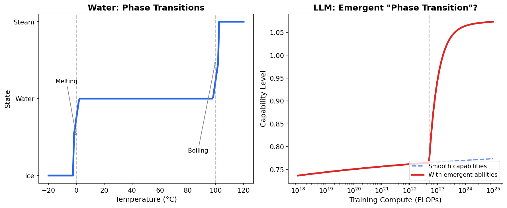
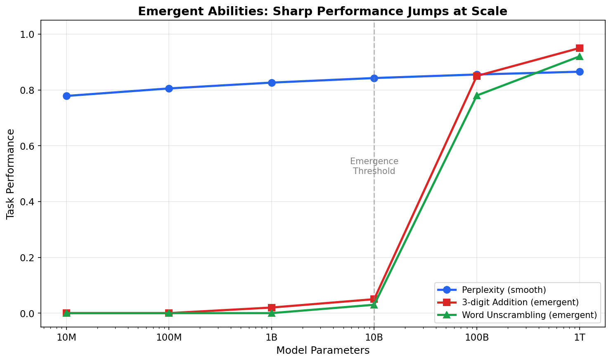
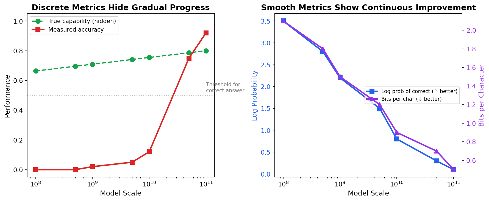
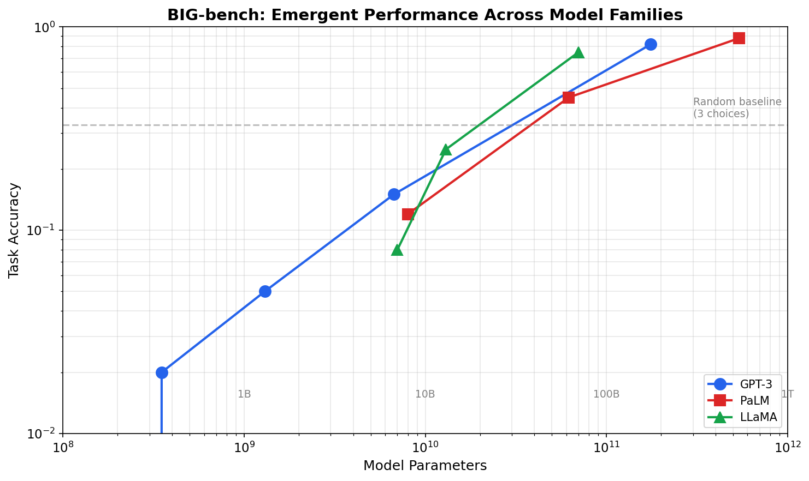
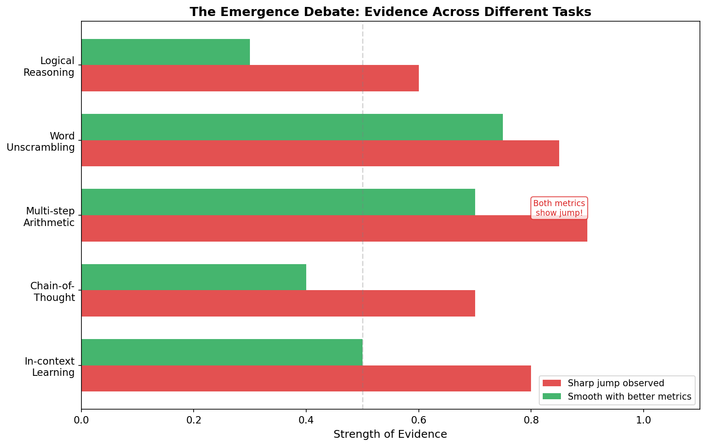
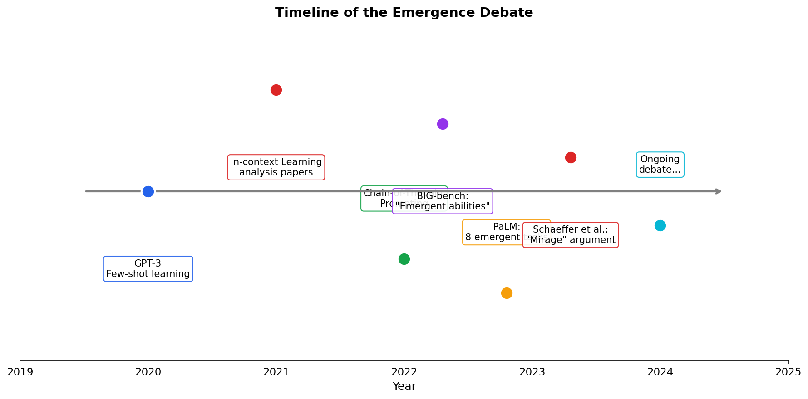
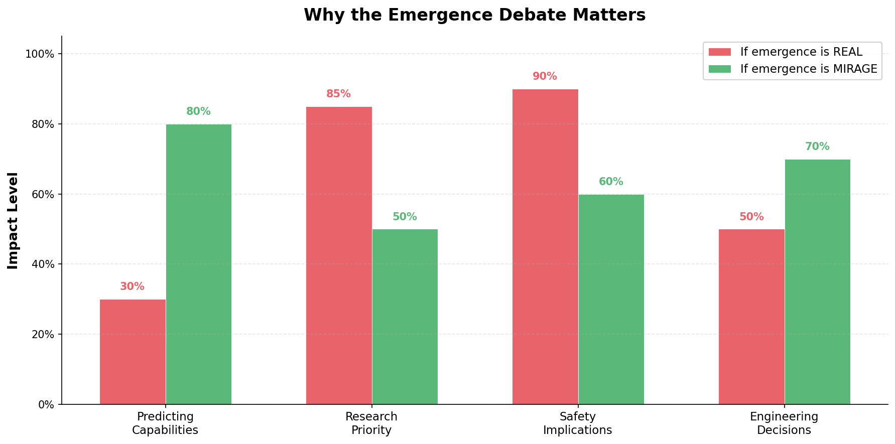

# 第十天：涌现能力

> **核心问题**：大语言模型是否会在特定规模突然发展出新能力，还是这只是一种测量假象？

---

## 开篇

2022 年，Google 的研究人员发表了一个令人着迷的观察：某些任务，小型语言模型完全无法完成，但当模型达到临界规模时却突然可以解决。三位数加法？在 100 亿参数时准确率为零，到了 1000 亿参数却达到 85%。单词重组？同样的模式。

他们将这称为**涌现能力（Emergent Abilities）**——随着模型规模扩大而突然、不可预测地出现的能力。

这一发现在 AI 社区引起了轩然大波。如果属实，这意味着我们无法通过观察小型版本来预测模型的能力。这意味着规模扩展可能解锁根本性的新行为，而不仅仅是现有能力的提升。这暗示着这些网络内部正在发生某种近乎神奇的事情。

但转折来了：一年后，另一组研究人员挑战了这一叙事。他们认为涌现可能是一种**海市蜃楼**——是我们测量性能方式的产物，而非模型本身的真实现象。

今天，我们将深入探讨这场争论。涌现究竟是什么？有哪些证据支持它？反方观点又是什么？读完本文，你将理解现代 AI 研究中最迷人也最具争议的问题之一。

---

## 1. 什么是涌现能力？

### 1.1 基本模式

**涌现能力**具有以下特征：
1. 在较小模型中**不存在**（接近随机的表现）
2. 在特定规模阈值**突然出现**
3. 表现为**急剧、不连续**的提升，而非渐进式进步

想象一下加热水。当温度从 0°C 升到 99°C 时，水保持液态——变化是渐进的、可预测的。然后在 100°C 时，砰：它突然变成蒸汽。这是一种**相变（Phase Transition）**——在临界阈值发生的质的变化。

*图 1：相变在临界阈值表现出不连续变化。AI 是否表现出类似行为？*

涌现假说认为 LLM 经历类似的过程。在某个计算/参数阈值以下，它们无法完成任务。超过阈值后，它们突然可以了。

### 1.2 最初的证据

"涌现能力"这一术语因 2022 年的 BIG-bench 论文及后续分析而流行。研究人员在 200 多个不同任务上测试了各种规模的语言模型，发现了一个惊人的模式：

*图 2：某些任务在特定模型规模显示急剧的性能跳跃，而其他任务则平稳提升。*

关键观察：
- **平滑扩展**：某些能力（如困惑度、事实回忆）随规模渐进提升
- **涌现扩展**：其他任务（如多步骤算术、某些推理任务）显示突然跳跃
- **不同阈值**：不同任务在不同规模涌现——没有单一的"临界质量"

论文确定了几种涌现能力：
- **三位数加法**（在约 10²² FLOPs 涌现）
- **单词重组**（在约 10²³ FLOPs 涌现）
- **思维链推理**（在 few-shot 评估中约 1000 亿参数时显著提升；较小模型经过微调后也能受益于 CoT）
- **多任务自然语言理解（Multi-task NLU）**（用单一模型同时处理情感分析、问答、文本蕴含、语义相似度等多种 NLU 任务；根据任务难度在不同规模涌现）

---

## 2. 相变假说

### 2.1 为什么会发生涌现？

如果涌现是真实的，为什么会发生？几种假说试图解释：

**假说 1：临界表示容量（Critical Representation Capacity）**

> 相关论文：*"Emergent Abilities of Large Language Models"* — Wei, Tay 等人 (2022, [arXiv:2206.07682](https://arxiv.org/abs/2206.07682))

某些任务需要同时存储和操作多个概念。模型可能需要足够的参数来：
1. 编码算术规则
2. 存储中间结果
3. 按序列应用操作
4. 格式化最终输出

在阈值以下，模型字面上没有足够的"心智工作空间"。超过阈值后，一切都就位了。

**假说 2：组合能力（Compositional Capabilities）**

> 相关论文：*"Are Emergent Abilities of Large Language Models a Mirage?"* — Schaeffer, Miranda, Koyejo (2023, [arXiv:2304.15004](https://arxiv.org/abs/2304.15004)); *"Grokking"* — Power 等人 (2022)

复杂能力可能需要组合更简单的技能。例如，解决 "7 × 8 + 3" 需要：
- 理解乘法
- 理解加法
- 知道正确的运算顺序
- 执行多步计算

每个子技能在较小规模可能部分存在，但完整能力只有在所有组件同时达到足够质量时才"涌现"。

**假说 3：上下文学习阈值（In-Context Learning Threshold）**

> 相关论文：*"An Explanation of In-context Learning"* — Xie 等人 (2022, [arXiv:2212.00759](https://arxiv.org/abs/2212.00759)); *"Rethinking the Role of Demonstrations"* — Min 等人 (2022)

许多涌现能力涉及**上下文学习（In-context Learning）**——使用提示中的示例来引导行为。这种元能力可能有自己的阈值：

$$
\text{上下文学习能力} = f(\text{模型规模}, \text{上下文长度}, \text{任务复杂度})
$$

当上下文学习能力跨过阈值时，一整类任务突然变得可解。

### 2.2 与物理学的联系

相变类比不仅仅是比喻——它与统计物理学有深层联系。

在物理学中，相变发生在具有许多相互作用组件的系统中。在临界点，温度（或其他参数）的微小变化会导致大规模重组。

神经网络有数百万或数十亿个相互作用的参数。它们是否表现出类似的临界现象？一些理论研究表明是的：

- **损失景观转换**：损失函数的几何形状可能在某些规模发生质的变化
- **顿悟现象（Grokking）**：模型有时在延长训练后突然泛化——另一种不连续转换
- **彩票假说**：制胜的"子网络"可能需要最小规模才能存在。

> **注：** 彩票假说（Frankle & Carbin, 2019）已被实验验证，但它解释的是"为什么过参数化网络能训练好"，而非"为什么新能力在某个规模突然涌现"。将其用于解释涌现只是一种类比推测，目前没有论文直接证明某种涌现能力需要一个最小规模的子网络才能存在。

---

## 3. 反方观点：涌现是海市蜃楼

### 3.1 测量假象假说

2023 年，Schaeffer、Miranda 和 Koyejo 的论文提出了一个挑衅性的替代观点：**涌现能力可能根本不存在**。

他们的论证围绕我们如何测量性能：

*图 3：不同的指标可以使相同的底层改进看起来要么突然（左）要么渐进（右）。*

**关键洞察**：许多"涌现"任务使用**离散指标**如准确率（对/错），而底层模型能力是连续提升的。

为什么这很重要：

1. **真实能力**（隐藏）：模型产生正确答案的概率随规模平滑提升
2. **测量准确率**（观察到的）：答案要么对（100%）要么错（0%）
3. **结果**：当概率跨过 50% 时，平滑的底层改进创造了准确率的急剧跳跃

### 3.2 三位数加法的例子

考虑三位数加法如 "234 + 567 = ?"：

| 模型规模 | P(正确) | 准确率 |
|----------|---------|--------|
| 10 亿参数 | 0.05 | 0% |
| 100 亿参数 | 0.25 | 0% |
| 500 亿参数 | 0.45 | 0% |
| 1000 亿参数 | 0.65 | 65% |
| 2000 亿参数 | 0.85 | 85% |

底层概率从 5% 平滑提升到 85%。但准确率从 0% 跳到 65%，因为在约 50% 概率以下，模型大多数问题都答错。

如果我们改为测量**正确答案的对数概率**，我们会一直看到平滑的改进！

### 3.3 支持证据

Schaeffer 等人提供了有力证据：

1. **指标转换**：当"涌现"任务用平滑指标（对数概率、Brier 分数）重新评估时，急剧跳跃消失了

2. **分辨率效应**：用更多评估样本，"跳跃"变得不那么尖锐——它实际上是一个陡峭的 sigmoid，不是不连续

3. **多选题假象**：答案选项少（是/否、A/B/C）的任务更可能因阈值效应而显示表面上的涌现

*图 4：BIG-bench 结果显示表面上的涌现，但这种模式可能取决于指标选择。*

---

## 4. 双方的证据

那么哪种观点是正确的？争论仍在继续，证据确实是混合的。

### 4.1 支持真正涌现的证据

**思维链推理**

一些研究人员认为，思维链（CoT）提示确实启用了新能力，而不仅仅是更好地表达现有能力。在原始的 few-shot 评估框架中，约 100B 参数以下的模型即使被提示也无法产生连贯的多步推理。然而，这并不意味着小模型完全缺乏 CoT 能力——当专门针对逐步推理进行微调时，较小的模型也能表现良好。因此，CoT 的「涌现」与评估方法密切相关，而不仅仅取决于模型规模。

**质的能力差异**

有些任务中，小模型不只是表现差——它们根本没有任何理解。例如：
- GPT-2（15 亿）：在类比任务上产生不连贯的输出
- GPT-3（1750 亿）：产生合理的、通常正确的类比

这似乎不仅仅是测量假象——而是行为的质的差异。

**跨指标一致性**

对于某些任务，无论选择什么指标，跳跃都会出现。这更难解释为测量假象。

*图 5：证据因任务而异——有些即使用平滑指标也显示跳跃。*

### 4.2 反对真正涌现的证据

**指标依赖性**

最有力的反证：许多"涌现"能力在用不同方式测量时变得平滑。这表明底层能力一直在渐进提升。

**样本量效应**

用更多评估样本，急剧转换变得更平滑。这表明我们观察到的是统计假象，而非根本性转换。

**没有物理必然性**

与水的相变（源于基本物理）不同，没有已知机制会导致神经网络表现出真正的不连续性。架构和训练都是连续的。

### 4.3 当前共识

该领域尚未达成共识，但一种细致入微的观点正在形成：

1. **某些表面上的涌现确实是测量假象**（可通过指标选择解释）
2. **某些任务可能表现出真正的质的转换**（但这更难证明）
3. **能力阈值在事后是可预测的**（暗示底层连续性）
4. **实际重要性因用例而异**

---

## 5. 争论的时间线

*图 6：涌现争论在短短几年内迅速演变。*

**2020 年**：GPT-3 展示了令人惊讶的少样本学习能力。"涌现"一词开始非正式流传。

**2022 年（1 月）**：BIG-bench 合作项目发布结果，显示许多任务的"涌现"性能模式。

**2022 年（3 月）**：思维链提示论文显示，逐步推理显著提高性能——但仅在规模足够大时。

**2022 年（4 月）**：PaLM 论文明确讨论"涌现能力"并确定了 8 个显示此模式的任务。

**2022 年（11 月）**：ChatGPT 发布，引发公众对 LLM 能做什么（不能做什么）的巨大兴趣。

**2023 年（4 月）**：Schaeffer 等人发表"大语言模型的涌现能力是海市蜃楼吗？"挑战涌现叙事。

**2023-2024 年**：持续研究试图区分真正的涌现和测量假象。尚无定论。

---

## 6. 为什么这很重要？

涌现争论不仅仅是学术哲学——它有真正的实际影响。

*图 7："涌现是真实的吗？"这个问题的答案影响研究优先级、安全分析和工程决策。*

### 6.1 如果涌现是真实的

**安全含义**：我们无法预测规模扩大的模型会做什么。新的、可能危险的能力可能突然出现而没有警告。这主张在扩展时要极其谨慎。

**研究优先级**：理解涌现的条件变得至关重要。我们应该大力投资机械可解释性，以理解转换点发生了什么。

**工程**：从规模预测能力变得更困难。我们可能需要训练和评估许多模型规模，以找到任务的"最佳点"。

### 6.2 如果涌现是海市蜃楼

**安全含义**：虽然扩展仍有风险，但能力更可预测。我们可以更有信心地从较小模型外推。

**研究优先级**：专注于平滑地提升底层能力，而不是寻找神奇阈值。更好的评估指标成为优先事项。

**工程**：缩放定律在规划中更可靠。我们可以在训练昂贵的大型模型之前预测能力。

### 6.3 务实的观点

无论哪种观点是"正确的"，都有实际的教训：

1. **使用多种指标**：不要仅依赖准确率。跟踪对数概率、token 级指标和校准。

2. **在多个规模测试**：不要假设小模型失败就能预测大模型失败（或成功）。

3. **理解你的评估**：知道你的指标实际测量什么及其分辨率限制。

4. **为惊喜做准备**：无论是否真正涌现，规模化的模型将具有你未明确训练的能力。

---

## 7. 数学框架

> *本节为对数学细节感兴趣的读者提供更正式的处理。*

### 7.1 形式化涌现

设 $C(N)$ 表示具有 $N$ 个参数的模型在特定任务上的真实能力水平。"涌现是假象"假说提出：

$$
\begin{aligned}
C(N) &= f(N) \quad &\text{（平滑函数）} \\
\text{准确率}(N) &= \mathbb{1}[C(N) > \theta] \quad &\text{（阈值函数）}
\end{aligned}
$$

准确率指标应用阈值 $\theta$，即使 $f(N)$ 是平滑的也会产生表面上的不连续性。

### 7.2 对数线性替代方案

如果我们改为测量正确答案的对数概率：

$$
\log P(\text{正确} \mid N) = \alpha \log N + \beta
$$

这预测平滑、可预测的改进——与"海市蜃楼"假说一致。

### 7.3 测试真正的涌现

要区分真正的涌现和假象，我们需要：

1. **分辨率分析**：用更多评估样本，"跳跃"是否存在？
2. **指标不变性**：模式在不同指标下是否成立？
3. **机制证据**：我们能否确定模型在转换时发生了什么变化？

目前，没有任务令人信服地通过所有三项测试。

---

## 8. 常见误解

### ❌ "涌现意味着我们不理解模型"

**事实**：涌现指的是特定的缩放模式，而非缺乏理解。涌现的能力仍然可以被机制性地分析和理解。

### ❌ "如果涌现是海市蜃楼，缩放就不能提升能力"

**事实**：海市蜃楼假说并不否认缩放提升能力——它认为改进是平滑的，而非突然的。能力仍然随规模显著提升。

### ❌ "涌现要么完全真实，要么完全虚假"

**事实**：真相可能是细致入微的。一些观察到的涌现是测量假象；另一些可能反映真正的质的转换。争论是关于比例和机制，而非二元真相。

---

## 9. 延伸阅读

### 基础论文

1. [Emergent Abilities of Large Language Models](https://arxiv.org/abs/2206.07682) - Wei 等人 (2022)
   创造"涌现能力"一词并记录 BIG-bench 任务模式的论文。

2. [Are Emergent Abilities of Large Language Models a Mirage?](https://arxiv.org/abs/2304.15004) - Schaeffer 等人 (2023)
   声称涌现是测量假象的反方观点。

3. [Beyond the Imitation Game: Quantifying and extrapolating the capabilities of language models](https://arxiv.org/abs/2206.04615) - BIG-bench 合作项目 (2022)
   引发涌现争论的大型基准测试。

### 理论视角：涌现为什么会发生（或不发生）？

关于涌现能力的争论涉及多个学科的深层理论问题。研究人员从不同角度进行了探索，但至今没有统一的理论框架。以下是主要的研究线索：

**统计物理学**

统计力学研究微观粒子交互如何涌现出宏观行为——这与神经网络有天然的类比。

4. [Statistical Mechanics of Deep Learning](https://arxiv.org/abs/2006.06039) — Bahri 等人 (2020)
   将神经网络训练映射到统计力学框架，包括相变现象。

5. [Phase Transitions in Deep Learning](https://arxiv.org/abs/2202.05763) — Roberts 等人 (2022)
   直接用统计物理框架分析神经网络中的相变行为。

6. Zdeborová & Krzakala 的工作——系统性地将自旋玻璃理论和统计物理应用于过参数化网络，目前是最严谨的理论路线。

**信息论**

7. [Information Bottleneck method] — Tishby & Zaslavsky (2015)
   提出网络训练经历两个阶段（先拟合再压缩），压缩阶段可能对应相变。

8. 随机矩阵理论（Pennington & Bahri, 2017）——表明大规模参数矩阵的特征值分布在规模增大时会从有序态过渡到混沌态。

**复杂系统**

9. 圣塔菲研究所（Melanie Mitchell 等人）的研究——将涌现作为复杂系统的普遍现象来研究。他们的观点：LLM 的涌现可能与经典复杂系统（如鸟群、经济系统）中的涌现有本质区别，但理论工具可能仍然适用。

10. [深度网络的重整化群分析] — Bhattacharya 等人 (2024)
    发现网络各层之间存在类似于物理系统的标度行为。

**相关的实验现象**

11. [Grokking: Generalization Beyond Overfitting](https://arxiv.org/abs/2201.06091) — Power 等人 (2022)
    模型在长期过拟合后突然泛化——这是实验中观测到的相变现象。

12. [Reconciling modern machine-learning practice and the classical bias–variance trade-off](https://www.pnas.org/doi/10.1073/pnas.1903070116) — Belkin 等人 (2019)
    发现双重下降现象：测试误差随模型规模先降→升→再降，挑战了经典理论。

**结论**：涌现是一个活跃的研究前沿。信息论、统计物理和复杂系统理论都提供了部分解释，但还没有一个确定性的定理能说明"当网络规模达到 X，必然出现能力 Y"。无论涌现是真实的还是假象，理解它为什么会出现（或看起来出现），是 AI 理论中最重要的开放问题之一。

**最新突破（2025）**

关于涌现真实性的最有力的理论证据来自 EPFL 的 Zdeborová 研究组：

13. [A phase transition between positional and semantic learning in a solvable model of dot-product attention](https://iopscience.iop.org/article/10.1088/1742-5468/ade137) — Cui 等人 (2025, JSTAT)

他们用统计物理方法严格证明了 Transformer 在训练过程中会经历真正的相变：当训练数据有限时，模型仅依赖词的**位置**来理解句子；但当数据量超过临界阈值后，策略**突然切换**为依赖词的**语义**。这个转变不是渐进的，而是不连续的，就像物理学中的相变。

这可能是迄今为止最强的理论证据，证明神经网络学习中确实存在真正的相变——不是测量假象，而是模型处理信息方式的真实质变。

> 另见：[Single-Head Attention in High Dimensions](https://arxiv.org/abs/2509.24914) — Boncoraglio, Troiani, Zdeborová, Krzakala (2025)——关于注意力机制中泛化、权重谱和标度律的理论框架。

### 其他关键资源

14. [Chain-of-Thought Prompting Elicits Reasoning in Large Language Models](https://arxiv.org/abs/2201.11903) - Wei 等人 (2022)
   通过提示展示涌现推理能力。

15. [Scaling Laws for Neural Language Models](https://arxiv.org/abs/2001.08361) - Kaplan 等人 (2020)
   理解能力如何缩放的基础（见第九天）。

---

## 10. 思考问题

1. **如果你要为新的规模化模型设计安全评估，涌现争论会如何影响你的方法？**

2. **什么会让你相信涌现是真实的（或是海市蜃楼）？你需要看到什么证据？**

3. **涌现争论如何与更广泛的问题联系：AI 系统能否具有质上全新的能力，还是只能在现有能力上量的改进？**

---

## 总结

| 概念 | 一句话解释 |
|------|-----------|
| 涌现能力（Emergent Abilities） | 在特定模型规模突然出现的能力 |
| 相变（Phase Transition） | 在临界阈值发生的质的变化（物理学类比） |
| 测量假象（Measurement Artifact） | 由离散指标导致的表面上的涌现 |
| 平滑指标（Smooth Metrics） | 对数概率、Brier 分数——揭示渐进改进 |
| BIG-bench | 记录涌现模式的 200+ 任务基准 |
| 争论 | 持续中：真实现象 vs. 指标选择的海市蜃楼 |

**核心要点**："涌现能力存在吗？"这个问题没有简单答案。证据表明，一些表面上的涌现确实是测量假象（使用平滑指标跳跃就消失），但某些任务可能表现出真正的质的转换。实际上重要的是认识到，规模化的模型将具有你未预测的能力——无论那是"涌现"还是只是我们未能预见的平滑改进的结果。使用多种指标，在多个规模测试，对预测保持谦逊。

---

*第 10 天，共 60 天 | LLM 基础*  
*字数：约 3100 | 阅读时间：约 15 分钟*
