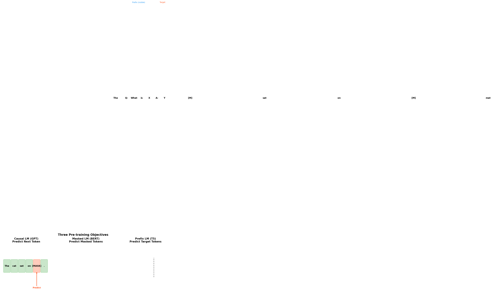
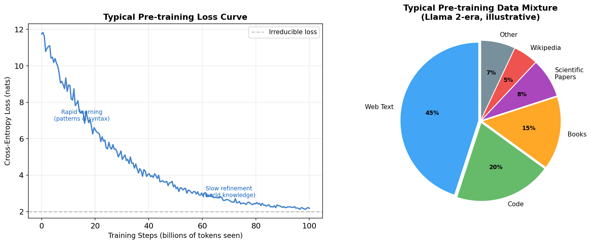
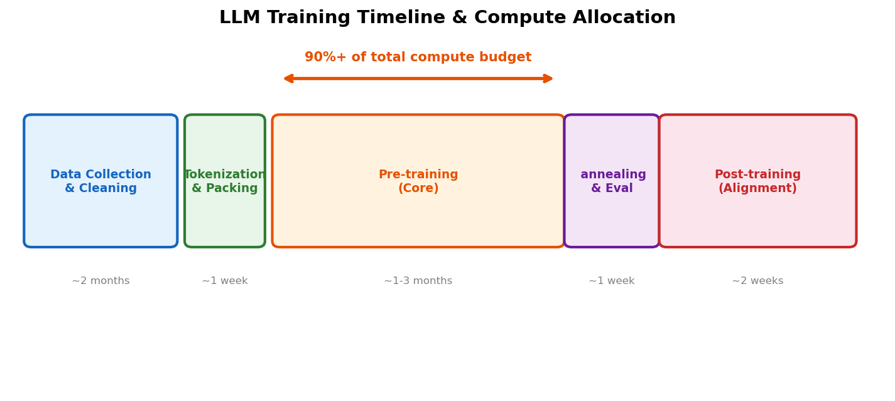

# Day 11: 预训练 — LLM 如何学会建模世界

> **核心问题**: 模型是如何从随机噪声变成理解语言的智能体，仅仅通过阅读互联网？

---

## 开篇

想象一下，你被丢进一个拥有数十亿本书的巨大图书馆，你唯一的任务是：*预测每一页上的下一个词*。没有老师，没有标签，没有指导——就是预测、预测、再预测。读了足够多的页数之后，奇迹发生了：你开始理解语法、事实、推理模式，甚至幽默感。

这就是预训练（Pre-training）做的事。它是构建 LLM 中最昂贵、最重要的阶段——将随机参数初始化变成真正理解语言的东西。GPT-4、Llama、Gemini——每个主流 LLM 都经历了这个阶段，在数千块 GPU 上消耗数万亿 token，持续数月。

把预训练想象成通过纯粹的阅读来养育一个孩子。你不需要坐下来明确地教语法规则或地理知识。相反，孩子读了数百万页后*吸收*了这些模式。预训练就是「读数百万页」的部分。对齐阶段（我们将在 Day 13-15 覆盖）是「教礼貌」的部分。

---

## 1. 什么是预训练？

**预训练（Pre-training）** 是第一个主要训练阶段，语言模型从海量的**无标注文本**中学习，使用**自监督（Self-supervised）** 目标。模型通过解决不需要人类标注的预测任务来教自己。

### 1.1 自监督学习 — 关键洞察

传统机器学习需要标注数据：标记了「猫」或「狗」的图片，标记了「垃圾邮件」或「正常邮件」的邮件。这很昂贵，而且不可扩展。自监督学习是一个巧妙的技巧：**标签已经在数据本身里面了**。

对于像「那只猫坐在___」这样的句子，下一个词「垫子上」本身就是标签。不需要人类标注员。互联网上的每一段文本都包含数百万个这样的隐式训练样本。

这就是为什么预训练可以使用整个互联网——因为我们不需要任何人来标注它。文本*本身就是*标签。

### 1.2 三种预训练目标


*图 1：三种主要预训练目标。橙色 token 是预测目标；绿色/蓝色 token 是可见上下文。*

**因果语言建模（Causal Language Modeling, CLM）** — GPT 系列使用：
- 给定所有之前的 token，预测下一个 token
- $P(x_t | x_1, x_2, ..., x_{t-1})$
- 自回归：只能看到过去，不能看到未来
- 优化文本*生成*

**掩码语言建模（Masked Language Modeling, MLM）** — BERT 使用：
- 随机遮盖约 15% 的 token，从上下文（双向）预测它们
- $P(x_{\text{masked}} | x_{\text{surrounding}})$
- 双向：同时看到左右上下文
- 优化文本*理解*

**前缀语言建模（Prefix LM）** — T5 使用：
- 将输入分为前缀（可见）和目标（预测）
- 类似 CLM，但有双向前缀部分
- 统一理解和生成

现代 LLM（GPT-4、Llama 等）几乎完全使用**因果语言建模（CLM）**，因为它自然产生具备生成能力的模型。

---

## 2. 数据 — 我们喂给模型什么？

预训练数据的质量和多样性直接决定模型能力。「垃圾进，垃圾出」在这里体现得淋漓尽致。


*图 2：左图 — 典型预训练损失曲线，显示早期快速学习和后期缓慢优化。右图 — 示意性数据配比。*

### 2.1 数据来源

现代预训练语料库来自多种来源：

| 来源 | 比例 | 提供什么 |
|------|------|---------|
| **网页爬取**（CommonCrawl） | 40-60% | 广度、通用知识、多语言文本 |
| **代码仓库**（GitHub） | 15-25% | 逻辑推理、结构化思维 |
| **书籍** | 10-15% | 长篇推理、连贯叙述 |
| **科学论文**（arXiv） | 5-10% | 技术知识、数学推理 |
| **维基百科** | 3-5% | 高质量事实知识 |
| **精选数据集** | 5-10% | 特定领域（数学、法律、医疗） |

### 2.2 数据清洗 — 无名英雄

原始 CommonCrawl 数据是混乱的。严格的清洗流水线至关重要：

1. **语言过滤** — 移除不想要的语言或低质量文本
2. **去重** — 文档和段落级别的精确去重和模糊去重（防止记忆的关键）
3. **质量过滤** — 基于分类器的过滤，移除垃圾信息、低质量内容
4. **个人隐私信息移除（PII removal）** — 清除个人身份信息
5. **有害内容过滤** — 移除有害内容（部分——这个有争议）

> **为什么去重很重要**：如果同一段文本出现 1000 次，模型会把容量浪费在记忆它上面，而不是学习可泛化的模式。Llama 3 的技术报告显示去重显著提升了下游性能。

### 2.3 数据规模

增长趋势令人震惊：

- **GPT-2（2019）**：~40 GB 文本（~100 亿 token）
- **GPT-3（2020）**：~570 GB（~3000 亿 token）
- **Llama 2（2023）**：~2 万亿 token
- **Llama 3（2024）**：~15 万亿 token
- **现代估计**：一些模型据报道在 15-20 万亿+ token 上训练

Chinchilla 缩放定律（Day 9）表明，对于给定的模型大小，存在最优的训练数据量。许多早期模型相对于其参数量来说是*欠训练*的。

---

## 3. 训练实际上是怎么工作的

### 3.1 训练循环

预训练的核心惊人地简单：

```python
# 简化的预训练循环（因果语言模型）
model = TransformerLM(vocab_size=128000, dim=4096, n_layers=32)

for batch in dataloader:  # 每个 batch：token ID 序列
    inputs = batch[:, :-1]   # 除最后一个 token 外的所有 token
    targets = batch[:, 1:]   # 所有 token 向右移一位（下一个 token 目标）
    
    logits = model(inputs)                           # 前向传播
    loss = cross_entropy(logits.reshape(-1, vocab_size), 
                         targets.reshape(-1))         # 下一个 token 预测损失
    
    loss.backward()                                   # 反向传播
    optimizer.step()                                  # 更新权重
    optimizer.zero_grad()                             # 重置梯度
```

每个训练步骤：（1）前向传播计算预测，（2）损失衡量预测有多错误，（3）反向传播计算梯度，（4）优化器更新权重。重复数十亿次。

### 3.2 损失函数

预训练目标是**交叉熵损失（Cross-Entropy Loss）**（等价于负对数似然）：

$$
\begin{aligned}
\mathcal{L} &= -\frac{1}{T} \sum_{t=1}^{T} \log P(x_t \mid x_{<t}; \theta) \\
&= -\frac{1}{T} \sum_{t=1}^{T} \log \text{softmax}(z_t)[x_t]
\end{aligned}
$$

其中 $\theta$ 是模型参数，$z_t$ 是位置 $t$ 的 logit 向量，$x_t$ 是实际的下一个 token。损失越低意味着预测越好——模型被「惊吓」的次数越少。

### 3.3 损失曲线告诉我们什么


*图 3：预训练消耗总计算预算的 90% 以上。从数据收集到后训练的整个流水线需要数月。*

损失曲线遵循一个特征模式：

1. **陡峭下降**（训练早期）：模型快速学习语法、常见词语搭配、基本事实
2. **缓慢优化**（训练中期）：世界知识、推理模式、领域特定知识
3. **渐近平台**（训练后期）：收益递减；模型接近其不可约损失（自然语言的熵）

不可约损失——曲线趋近的下限——代表了语言固有的不可预测性。即使完美的模型也无法确定地预测下一个词，因为自然语言有真正的歧义。

---

## 4. 计算需求 — 为什么这要花费数百万

### 4.1 规模

训练前沿 LLM 需要巨大的计算量：

| 模型 | 参数量 | GPU | 训练时长 | 估计成本 |
|------|--------|-----|---------|---------|
| GPT-3 | 175B | ~10,000 V100 | ~1 个月 | ~$500 万 |
| Llama 2 70B | 70B | ~2,000 A100 | ~2 个月 | ~$300 万 |
| Llama 3 405B | 405B | ~16,000 H100 | ~1-2 个月 | ~$3000-5000 万 |
| 前沿模型（估计） | 1T+ | 50,000+ H100 | 数月 | $1 亿+ |

### 4.2 关键优化

在这个规模上训练需要精心的工程设计：

**混合精度训练（Mixed Precision Training, BF16/FP8）** — 使用更低精度（16 位或 8 位浮点数代替 32 位）将内存和计算量减半，质量损失极小。

**张量并行（Tensor Parallelism）** — 将单个矩阵运算分散到多个 GPU。单个注意力层的计算跨越多个 GPU。

**流水线并行（Pipeline Parallelism）** — 不同的 Transformer 层驻留在不同的 GPU 上。数据像流水线一样流过。

**数据并行（Data Parallelism）** — 将批次分散到 GPU 组。每组独立计算梯度，然后同步（all-reduce）。

**梯度累积（Gradient Accumulation）** — 通过在多次前向传播中累积梯度来模拟更大的批次大小。

### 4.3 学习率调度

预训练使用精心调整的学习率调度，而非固定学习率：

1. **预热（Warmup）**（前 0.1-2% 步数）：将学习率从接近零线性增加到峰值（例如 3e-4）。这防止早期的不稳定性，大的梯度可能破坏随机初始化。

2. **稳定阶段**：在大部分训练过程中保持峰值学习率。

3. **余弦衰减 / 退火（Annealing）**：按照余弦曲线将学习率逐渐降低到接近零。这使模型能够收敛到尖锐的最小值。

$$
\begin{aligned}
\eta_t = \eta_{\min} + \frac{1}{2}(\eta_{\max} - \eta_{\min})\left(1 + \cos\left(\frac{\pi \cdot t}{T}\right)\right)
\end{aligned}
$$

其中 $\eta_t$ 是第 $t$ 步的学习率，$T$ 是总步数，$\eta_{\max}$ / $\eta_{\min}$ 分别是峰值和最小学习率。弄错这个调度可能浪费数百万美元的计算。

### 4.4 内存 vs. 计算

70B 参数模型在 BF16 中仅存储权重就需要约 140 GB。加上优化器状态（Adam 使用 2 个额外副本）、梯度和激活值——训练时需要约 1-2 TB 的 GPU 内存。这就是为什么模型并行不是可选项；它是必需的。

---

## 5. 预训练到底教了什么？

这是最有趣的问题。模型*从未被明确告知*要学习语法、事实或推理。它只是预测下一个 token。但它学会了：

### 5.1 表面模式 → 深层理解

| 训练阶段 | 出现了什么 | 示例 |
|---------|-----------|------|
| 前 1% 数据 | Token 共现、基本语法 | "the" → "cat"（常见搭配） |
| 前 10% | 语法、句子结构 | 产生语法正确的句子 |
| 前 50% | 世界事实、常识 | "巴黎是___的首都" → "法国" |
| 50-100% | 推理模式、风格模仿 | 可以遵循多步推理链 |

### 5.2 代码数据与推理

最有影响力的发现之一：**在预训练数据中包含代码显著提高了推理能力**，而不仅仅是编码能力。代码的结构化、逻辑性质似乎教会了模型可迁移到非代码任务的通用推理模式。

这就是为什么现代预训练数据集包含 15-25% 的代码——不仅仅是为了让模型写代码，而是让它*更好地思考*。

### 5.3 预训练不教什么

预训练单独产生的是**基础模型（Base Model）**——强大但原始：

- ❌ 它不善于遵循指令（「总结这段」→ 可能续写文本而不是总结）
- ❌ 它不知道何时应该拒绝有害请求
- ❌ 它不会将回复格式化为有帮助的答案
- ❌ 它能补全文本但不会「聊天」

这就是为什么**后训练对齐（Post-training Alignment）**（RLHF、指令微调）是必不可少的——它将文本补全器转变为有用的助手。我们将在 Day 13-15 详细讨论。

---

## 6. 预训练的现代趋势

### 6.1 数据枯竭

我们可能正在耗尽高质量文本。互联网上人类生成的文本总量是有限的（约 10-100 万亿 token 有用的内容）。一些估计表明我们可能在 2026-2028 年耗尽高质量预训练数据。

正在探索的解决方案：
- **合成数据（Synthetic Data）**：使用现有模型生成训练数据
- **多模态数据**：在图像、视频、音频上训练（数据量大幅增加）
- **数据回收**：更高效地在相同数据上训练
- **课程学习（Curriculum Learning）**：精心安排训练样本的顺序

### 6.2 多阶段预训练

现代模型通常使用多阶段方法：

1. **基础预训练**：大规模多样化数据，标准学习率
2. **退火（Annealing）**：在高质量精选数据上逐渐降低学习率
3. **领域加权**：在训练后期增加数学/代码/数据的比例

据报道 Llama 3 使用了这种方法，在精心挑选的高质量数据上的最终退火阶段显著提升了性能。

### 6.3 更长时间训练更小的模型

Chinchilla 的洞察继续产生影响：与其构建更大的模型，不如在更小的模型上训练更长时间。一个在 15 万亿 token 上训练的 7B 模型，可能与在 1 万亿 token 上训练的 70B 模型出奇地有竞争力——而且部署成本要低得多。

---

## 7. 常见误解

### ❌ 「预训练只是记忆互联网」

虽然模型确实会记忆一些训练数据（特别是罕见的、重复出现的文本），但绝大多数能力来自*泛化*。一个在 15 万亿 token 上训练的模型只有约 1000 亿参数，物理上不可能存储训练数据的哪怕一小部分。它必须学习压缩表示——对模式的真正理解。

### ❌ 「数据越多总是越好」

质量极为重要。添加低质量数据实际上会通过稀释信号来*损害*性能。据报道，Llama 3 的激进数据清洗比添加更多原始数据影响更大。

### ❌ 「预训练完成 = 模型完成了」

预训练产生的是基础模型——强大但原始的文本补全器。没有对齐（指令微调、RLHF），它就像一个不懂社交规范的天才。基础模型补全文本；对齐后的模型*提供帮助*。

---

## 8. 代码示例 — 最小预训练循环

```python
import torch
import torch.nn as nn

class SimpleLM(nn.Module):
    """用于演示的最简语言模型。"""
    def __init__(self, vocab_size=32000, d_model=512, n_heads=8, n_layers=6):
        super().__init__()
        self.embedding = nn.Embedding(vocab_size, d_model)
        # 实际中：使用完整的 Transformer
        self.transformer = nn.Transformer(
            d_model=d_model, nhead=n_heads, 
            num_encoder_layers=n_layers, batch_first=True
        )
        self.head = nn.Linear(d_model, vocab_size)
    
    def forward(self, x):
        # x: (batch, seq_len) token ID
        emb = self.embedding(x)  # (batch, seq_len, d_model)
        # 因果掩码：防止关注未来 token
        mask = nn.Transformer.generate_square_subsequent_mask(x.size(1))
        out = self.transformer(emb, mask=mask.to(x.device))
        return self.head(out)  # (batch, seq_len, vocab_size)

# --- 预训练循环 ---
model = SimpleLM().cuda()
optimizer = torch.optim.AdamW(model.parameters(), lr=3e-4, weight_decay=0.1)

for step, batch in enumerate(dataloader):
    inputs, targets = batch[:, :-1].cuda(), batch[:, 1:].cuda()
    
    logits = model(inputs)
    loss = nn.functional.cross_entropy(
        logits.reshape(-1, logits.size(-1)), targets.reshape(-1)
    )
    
    loss.backward()
    optimizer.step()
    optimizer.zero_grad()
    
    if step % 1000 == 0:
        print(f"Step {step}: loss = {loss.item():.4f}")
```

这是一个简化的示例。实际预训练使用分布式训练、混合精度、梯度检查点和更多优化。

---

## 深入理解：交叉熵损失函数

在上面的训练代码里，你反复看到 `loss = F.cross_entropy(...)` 这个调用。但我们还没有认真聊过：**交叉熵到底是什么？为什么它适合用来训练语言模型？**

要真正理解交叉熵，我们需要从信息论的基础概念出发，一步步构建直觉。

### 信息量：一个事件有多"意外"？

想象两个场景：

- 🌅 朋友告诉你："明天太阳会从东边升起。"
- 💎 朋友告诉你："明天天上会下钻石雨。"

听到第一句话，你毫无波澜——这是必然事件，没有信息量。听到第二句话，你会震惊——这是极不可能的事件，信息量巨大。

**直觉：越不可能发生的事，一旦发生，带给我们的信息量越大。**

克劳德·香农（Claude Shannon）用数学精确地表达了这种直觉：

$$I(x) = -\log_2 P(x)$$

其中 $P(x)$ 是事件 $x$ 发生的概率，$I(x)$ 是以"比特（bits）"为单位的信息量。

| 事件 | 概率 P(x) | 信息量 $-\log_2 P(x)$ (bits) |
|------|-----------|------------------------------|
| 太阳东升 | 1.0 | 0 |
| 抛硬币正面 | 0.5 | 1 |
| 骰子掷出6 | 1/6 ≈ 0.167 | 2.58 |
| 下钻石雨 | 0.000001 | ≈ 19.9 |

概率越低，信息量越高。概率为1的事件完全不让人意外，信息量为0。

### 香农熵：一个分布的平均"意外程度"

现在我们知道了单个事件的信息量。但如果我想衡量**整个概率分布**的"平均不可预测性"呢？

比如：
- 一个出老千的赌场，骰子永远出6 → 完全可预测，熵很低
- 一个公平的骰子 → 完全不可预测，熵很高

这就是**香农熵**（Shannon Entropy）：

$$H(P) = -\sum_x P(x) \log_2 P(x)$$

它就是对所有可能事件的信息量取**加权平均**。

**关键洞察：对于给定的可能结果数量，均匀分布的熵最大。**

| 分布 | 熵 (bits) |
|------|----------|
| 确定性事件 (1.0, 0, 0, 0) | 0 |
| 偏斜分布 (0.7, 0.2, 0.1, 0) | 1.16 |
| 均匀分布 (0.25, 0.25, 0.25, 0.25) | 2.0 |

熵越高，说明你对结果越不确定；熵越低，说明结果越可预测。

### 交叉熵：用错误的猜测来编码，会浪费多少？

好，现在到了核心概念。

想象你在玩一个**猜词游戏**：

> 我心里想了一个词，每次给你一个字母的提示。你需要猜下一个字母是什么。
>
> 如果你完美地知道我的用词分布（P），你平均需要 H(P) bits 的信息来猜中。
>
> 但如果你的猜测分布是 Q（和真实的 P 不一样），你平均需要的"信息量"就是**交叉熵**：

$$H(P, Q) = -\sum_x P(x) \log_2 Q(x)$$

**直觉：交叉熵衡量的是——当真实分布是 P，但你用 Q 来猜测时，你的平均"惊讶程度"。**

如果 Q = P（你猜得完全正确），交叉熵就等于香农熵 H(P)，这是理论最优。如果 Q ≠ P，交叉熵会大于 H(P)——你多浪费了一些。

### KL散度：额外浪费了多少？

交叉熵比香农熵多出来的部分，就是 **KL散度**（Kullback-Leibler Divergence）：

$$H(P, Q) = H(P) + D_{KL}(P \| Q)$$

也就是说：

$$D_{KL}(P \| Q) = H(P, Q) - H(P) = \sum_x P(x) \log \frac{P(x)}{Q(x)}$$

**用个类比：**

- **学霸**（真实分布 P）知道考试的重点在哪里，能用最少的时间（H(P)）复习完。
- **学渣**（猜测分布 Q）搞错了重点，花了更多时间（H(P,Q)）才搞定同样的事。
- 多花的时间就是 KL散度——纯粹因为"猜错了重点"而浪费的努力。

**KL散度的两个重要性质：**

1. **永远 ≥ 0**：$D_{KL}(P \| Q) \geq 0$，当且仅当 P = Q 时等于 0。你不可能比真实分布做得更好。
2. **不对称**：$D_{KL}(P \| Q) \neq D_{KL}(Q \| P)$。"用Q猜P的浪费"和"用P猜Q的浪费"是不同的。

### 在LLM训练中：这一切意味着什么？

回到语言模型训练。在每一步预测中：

- **真实分布 P** 是一个 **one-hot 向量**：正确的下一个 token 概率为 1，其他所有 token 概率为 0
- **模型分布 Q** 是模型输出的 softmax 概率

因为 P 是 one-hot 的，所以 $H(P) = 0$（完全确定性，没有惊讶）。因此：

$$H(P, Q) = 0 + D_{KL}(P \| Q) = -\log Q(x_{\text{true}})$$

**交叉熵损失就是：模型给"正确答案"分配的概率的负对数。**

简单直接。看看不同概率对应的损失值：

| 模型给正确 token 的概率 Q | 交叉熵损失 $-\log Q$ |
|--------------------------|------------------------|
| 0.99 | 0.01 |
| 0.90 | 0.105 |
| 0.50 | 0.693 |
| 0.10 | 2.303 |
| 0.01 | 4.605 |
| 0.001 | 6.908 |

**关键观察：**

- 模型越确定正确答案（概率→1），损失→0
- 模型越不确定（概率→0），损失飙升
- 损失对"错得离谱"的惩罚是指数级的

**为什么最小化交叉熵 = 最小化 KL散度？**

因为 $H(P) = 0$（one-hot 分布的熵为0），所以：

$$H(P, Q) = H(P) + D_{KL}(P \| Q) = D_{KL}(P \| Q)$$

最小化交叉熵损失，就等于让模型分布 Q 尽量靠近真实分布 P。这就是预训练的本质——**通过海量文本，让模型学会预测下一个 token 的概率分布**。

---

## 9. 延伸阅读

### 入门
1. [The Illustrated GPT-2](https://jalammar.github.io/illustrated-gpt2/) — 自回归语言模型的可视化指南
2. [Andrej Karpathy 的「Let's build GPT」](https://www.youtube.com/watch?v=kCc8FmEb1nY) — 逐步视频教程

### 进阶
1. [Llama 3 技术报告](https://ai.meta.com/blog/meta-llama-3/) — 最先进的预训练细节
2. [Chinchilla 论文（Training Compute-Optimal LLMs）](https://arxiv.org/abs/2203.15556) — 为什么数据规模与模型大小一样重要

### 论文
1. [Language Models are Few-Shot Learners (GPT-3)](https://arxiv.org/abs/2005.14165) — 展示了规模化预训练
2. [以数据为中心的 LLM 研究综述](https://arxiv.org/abs/2402.00111) — 数据质量如何塑造模型质量

---

## 思考题

1. 如果预训练只教下一个 token 预测，模型*为什么*学到了推理而不是仅仅表面统计？语言的什么特性使这成为可能？
2. 我们可能耗尽人类生成的训练数据。用其他模型生成的合成数据来训练有什么影响？这会不会产生「近亲繁殖」问题？
3. Chinchilla 定律建议我们应该更长时间地训练更小的模型。一个最优训练的 70B 模型与一个次优训练的 405B 模型之间有什么实际权衡？

---

## 总结

| 概念 | 一句话解释 |
|------|-----------|
| 预训练（Pre-training） | 在大规模无标注文本上进行自监督学习，构建通用语言理解 |
| 自监督学习（Self-supervised Learning） | 标签来自数据本身（如下一个 token），不需要人类标注 |
| 因果语言建模（Causal LM） | 给定过去上下文预测下一个 token — 现代 LLM 的主导目标 |
| 交叉熵损失（Cross-Entropy Loss） | 衡量模型对实际下一个 token 的「惊讶程度」 |
| 数据配比（Data Mixture） | 多样化来源（网页、代码、书籍、论文），配合精心清洗和去重 |
| 基础模型（Base Model） | 预训练的原始产出 — 强大但未对齐，需要后训练 |
| 数据枯竭（Data Starvation） | 担心我们在未来几年可能耗尽高质量人类生成文本 |

**核心要点**：预训练是每个 LLM 的基础——一个大规模的自监督学习过程，将随机参数变成具有广泛语言理解的模型。它之所以有效，是因为预测自然文本中的下一个 token 需要理解语法、事实和推理——预测任务*迫使*模型建立世界的内部表示。但这只是第一步：基础模型还必须经过对齐（后训练）才能成为有用的助手。

---

*Day 11 of 60 | LLM Fundamentals*
*Word count: ~2200 | Reading time: ~11 minutes*
