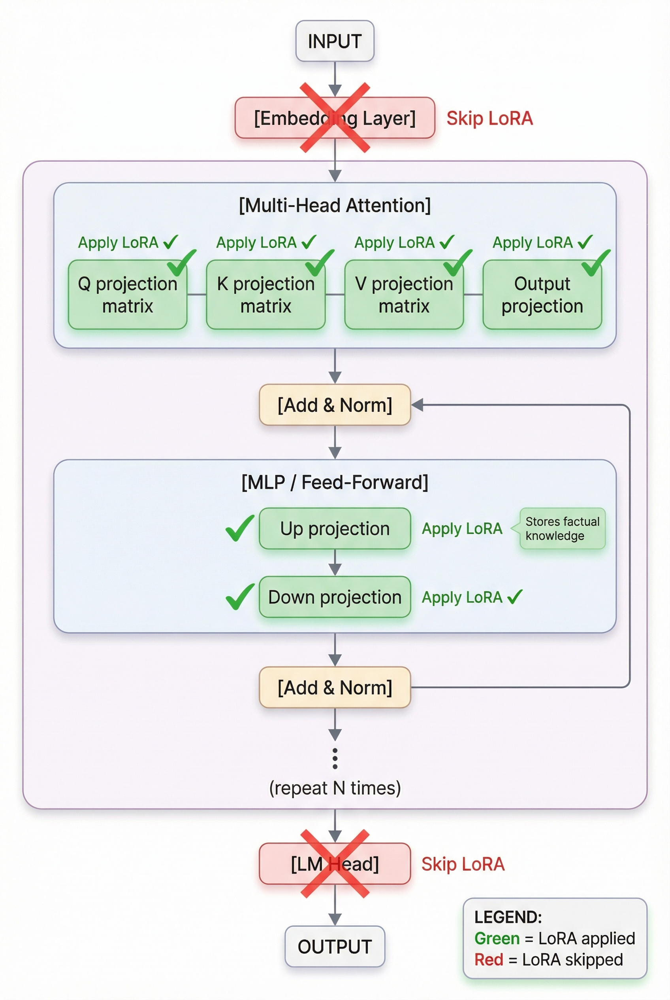
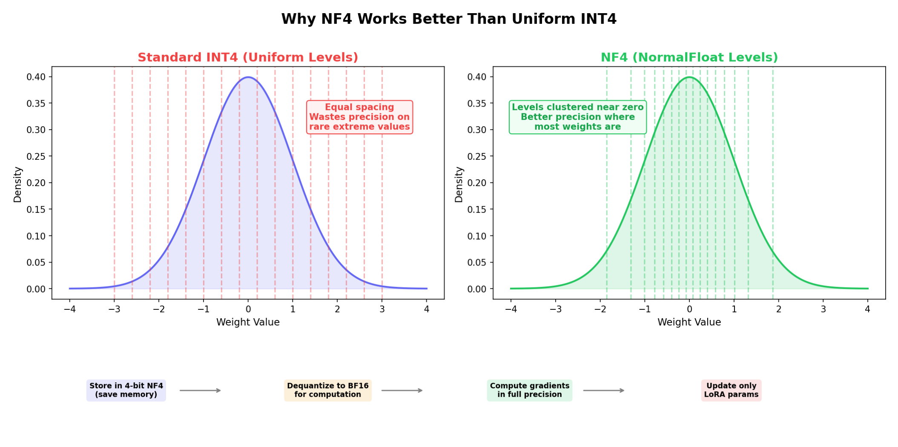
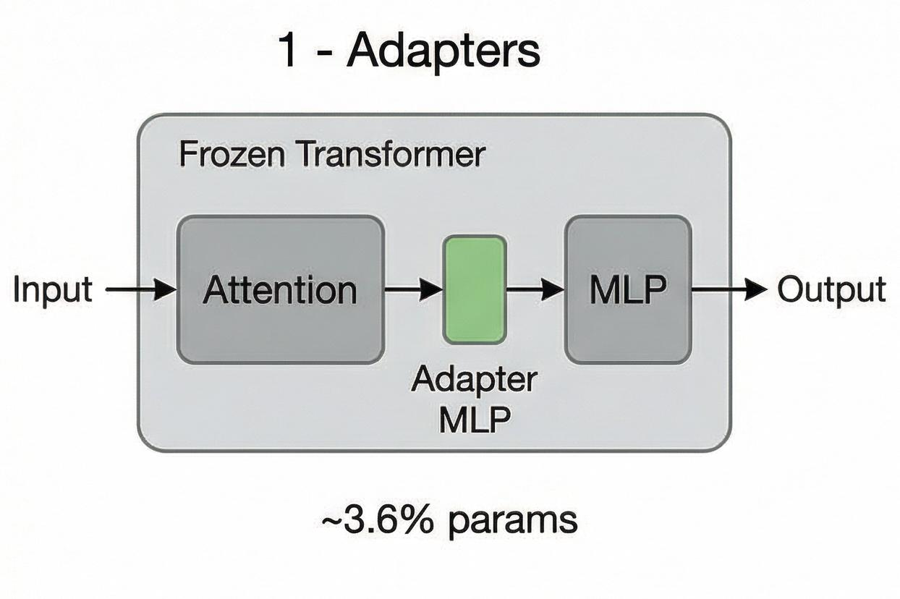
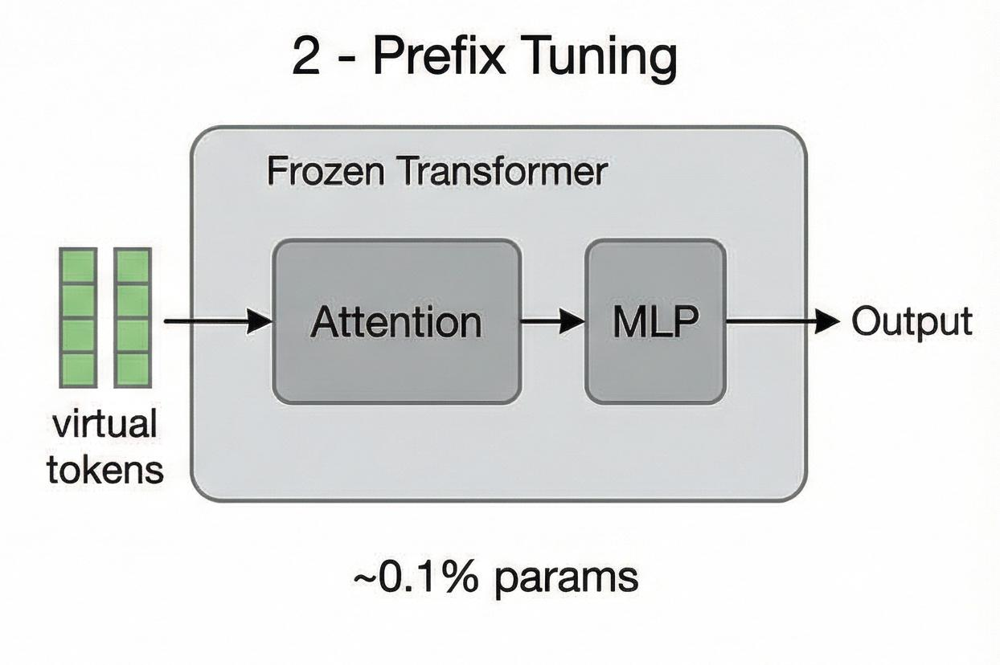
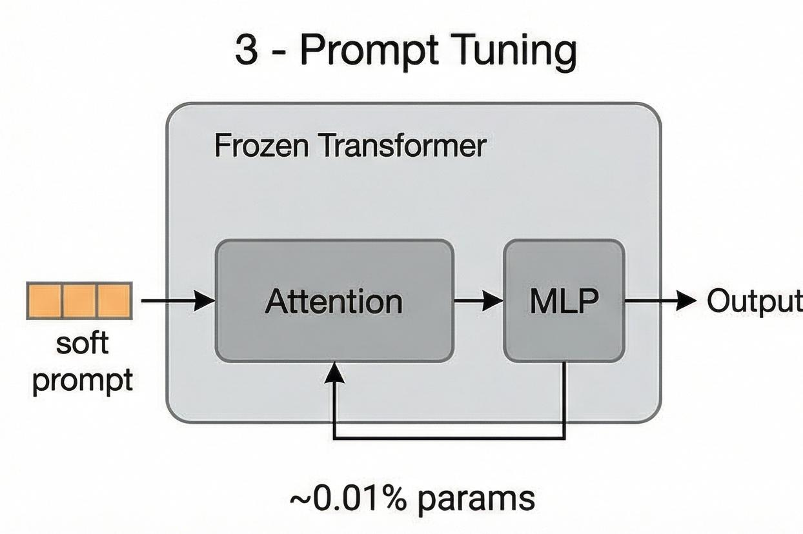
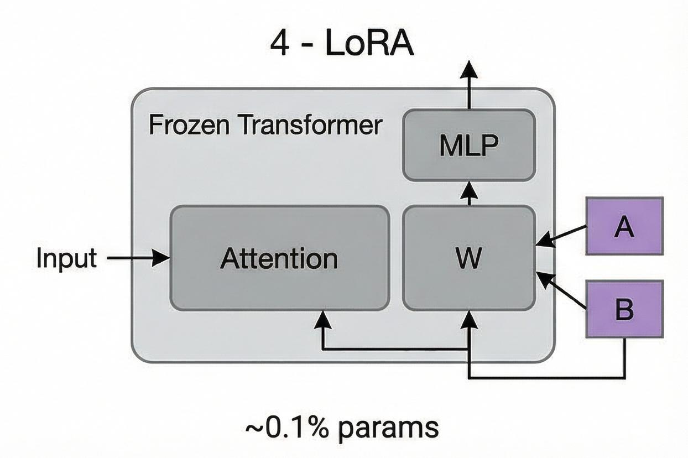
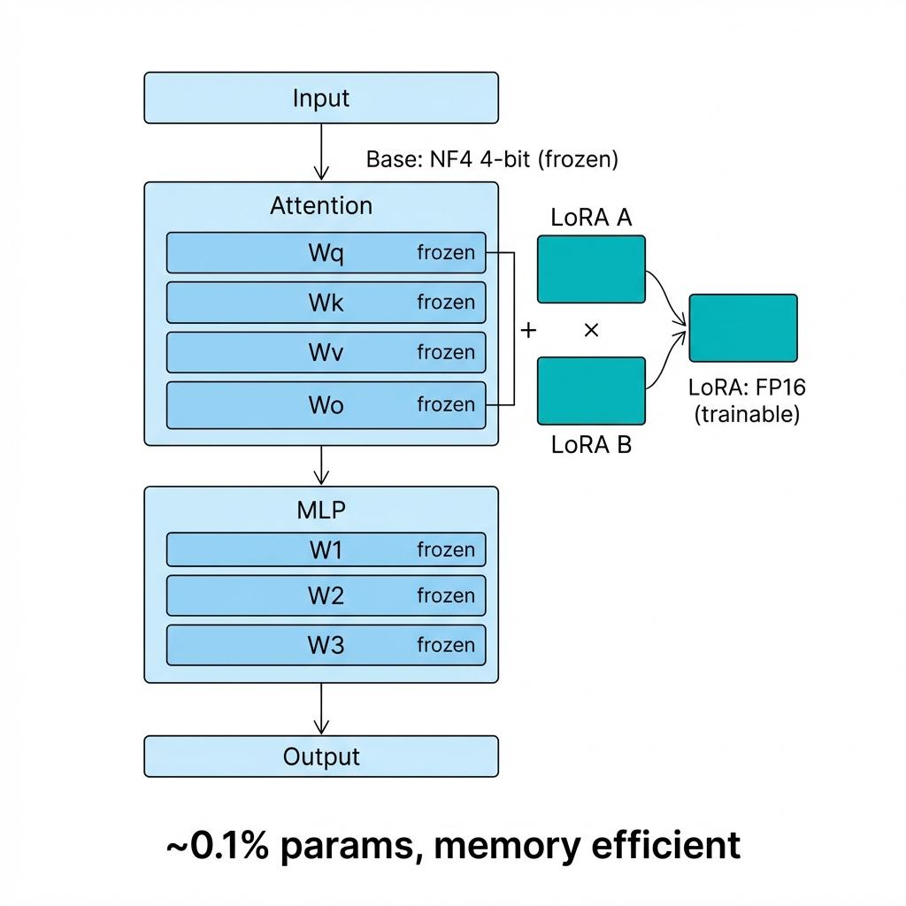

# Day 12: 微调 — 让老模型学新把戏

> **核心问题**：如何高效地将一个海量预训练 LLM 适配到特定任务，而不需要重新训练数十亿参数？

---

## 开篇

想象你招了一个通才——读过整个互联网、会说多国语言、能推理几乎所有事情的天才。但他不懂你公司的行话、不了解你的代码规范、不知道你客户的常见抱怨。你不会让他重新上学。你会给他几周的入职培训。

这正是微调（Fine-tuning）对 LLM 做的事。预训练（Day 11）给了模型广博的知识，微调让它专业化——把通才变成专家。问题是：传统微调需要更新*所有*参数，对于 175B 参数的模型，这意味着在 GPU 内存中搬运海量数据。2020 年，微调 GPT-3 需要几十块 A100。

然后出现了一个突破性的想法：如果冻结原始模型，只训练极少量新参数呢？这就是**参数高效微调（PEFT, Parameter-Efficient Fine-Tuning）**的世界，它改变了一切。

---

## 1. 为什么微调很重要

### 1.1 预训练与应用之间的鸿沟

预训练 LLM 就像大学毕业生——受过通识教育，但还不能直接上岗。部署 LLM 时，我们需要它：

- **遵循指令**（而不只是预测下一个 token）
- **采用特定风格**（专业、轻松、共情）
- **掌握领域知识**（医疗、法律、代码）
- **避免某些行为**（幻觉、有害内容）

预训练给模型*能力*，微调给它*方向*。

### 1.2 全量微调的问题

在全量微调（Full Fine-tuning）中，我们更新模型中的每一个参数：

$$
\begin{aligned}
W_{\text{new}} &= W_{\text{pretrained}} - \eta \cdot \nabla_W L(W)
\end{aligned}
$$

其中 $L(W)$ 是任务特定的损失函数，$\eta$ 是学习率。对于 FP16 格式的 175B 参数模型：

- **模型权重**：仅加载模型就需要 350 GB GPU 内存
- **梯度**：另外 350 GB（与权重同大小）
- **优化器状态**：Adam 需要 2 份额外副本 → 700 GB
- **激活值**：取决于 batch size 和序列长度

**总计：约 1.4 TB GPU 内存**。这需要 18 块 A100-80GB 仅仅做一个训练步。


*图 1：全量微调更新所有参数（红色），而 LoRA 只训练小型低秩矩阵（蓝色和绿色），保持原始权重冻结（灰色）。*

---

## 2. LoRA：低秩适应（Low-Rank Adaptation）

### 2.1 核心洞察

LoRA 论文（Hu et al., 2021）观察到了一个深刻的现象：虽然预训练模型有数十亿参数，但适配所需的*变化*存在于一个低得多的维度空间中。就像调整汽车的方向盘——你不需要重建引擎来改变方向。

数学上，LoRA 将权重更新 $\Delta W$ 分解为两个小矩阵：

$$
\begin{aligned}
\Delta W &= B \cdot A
\end{aligned}
$$

其中：
- $A \in \mathbb{R}^{r \times d}$（降维投影，秩为 $r$）
- $B \in \mathbb{R}^{d \times r}$（升维投影）
- $r \ll d$（通常 $r = 8$ 或 $16$，而 $d = 4096$ 或更大）

前向传播变为：

$$
\begin{aligned}
h &= W \cdot x + \frac{\alpha}{r} \cdot B \cdot A \cdot x
\end{aligned}
$$

这里 $\alpha$ 是缩放因子，控制 LoRA 更新相对于原始权重的幅度。这很重要——它让你在不改变学习率的情况下调整适配的"影响力"。

### 2.2 为什么这有效？

你可能会问：当原始权重矩阵的秩是 4096 时，一个秩为 8 的矩阵怎么能捕捉有意义的适配？

答案在于**内在维度（Intrinsic Dimension）**假说（Aghajanyan et al., 2020）：预训练模型已经位于参数空间中一个很好的解附近。微调只需要移动一小段距离，而这个移动可以在一个低维子空间中表达。就像站在山顶——你只需要朝着正确方向轻轻一推，就能滚向另一个山谷，而不需要整体搬迁。

#### 理解内在维度

想象一个在3D空间中的气球表面。气球存在于3维空间中，但它的表面其实只有**2维**——你只需要经度和纬度就能定位任何一点。这个“2”就是气球的内在维度：虽然嵌入在高维空间里，但真正自由移动的方向只有几个。

对模型来说：
- 一个 7B 模型有 70亿个参数，看起来是在 70亿维空间里
- 但预训练之后，好的参数配置其实只分布在一个**低维子空间**上
- 微调只需要在这个低维子空间里移动就够了

原始论文的实验发现：一个百万维的模型，其微调的内在维度可能只有**几百到几千**。LoRA 的 $r$ 直接对应这个内在维度——用 $r=8$ 意味着你只在一个8维子空间里调整。

> **核心洞察**：内在维度告诉我们**改变**模型只需要很小的空间，但**运行**模型仍然需要完整的参数空间。LoRA 压缩的是**更新量**（$\Delta W$），而不是原始权重（$W$）。这也是为什么 LoRA 节省训练显存但不降低推理成本（除非合并适配器）。

#### 等一下——既然模型活在低维子空间里，为什么不能压缩它来省推理资源？

一个很自然的追问！既然微调只在低维子空间里移动，那能不能用流形降维把模型缩小，省掉推理资源？

遗憾的是，**移动方向低维 ≠ 权重本身低维**。

想象你站在一个巨大迷宫里的某个点。你只需要往**一个方向**走就能找到出口（移动=1维）。但迷宫本身是1000维的——你不能把它压缩成1维，那样路就不通了。

三个原因：

1. **不同的任务需要不同的子空间。** 微调做翻译在子空间 A 移动，做代码在子空间 B 移动，两者可能几乎不重叠。预训练模型的强大之处正是覆盖了很多子空间——压缩到单一子空间等于丢失对其他任务的适应性。

2. **低秩的是 $\Delta W$，不是 $W$。** $W_{pretrained}$ 是满秩的（4096×4096），包含所有知识。$\Delta W$ 是低秩的（秩=8），只是微小调整。你只能压缩更新量（LoRA 已经在做了），不能压缩原始权重。

3. **模型能力需要满秩才能表达。** 注意力层的 Q/K/V 投影矩阵需要满秩才能正确编码 token 之间的复杂关系。强行降维会丢失区分相似 token 的能力。

**那实际中怎么省推理资源？** 不是流形降维，而是正交的技术：

| 方法 | 怎么省 | 效果 |
|------|--------|------|
| **量化** | FP16 → INT8/INT4 | 参数还在，每个参数用更少位存储 |
| **剪枝** | 去掉不重要的权重 | 直接删除部分参数 |
| **蒸馏** | 小模型学大模型的行为 | 用小模型替换大模型 |
| **LoRA** | 只训低秩更新 | 节省训练显存，不省推理 |

> **类比**：内在维度告诉我们，**装修**一栋楼只需要动几面墙，但**住人**还是需要整栋楼。

### 2.3 适配哪些层？

一个关键的实践问题：应该把 LoRA 应用到所有层，还是只选择特定层？

<table><tr>
<td width="45%" valign="top">



</td>
<td width="55%" valign="top">

研究表明，将 LoRA 同时应用于**注意力层和 MLP（前馈）层**的效果始终优于只适配注意力层。

**为什么两者都要？** MLP 层存储了模型的大量事实知识，适配它们对领域专业化至关重要。

**应该跳过：**
- **嵌入层** — 将 token 映射到模型内部空间，学习动态不同
- **LM Head** — 映射回词汇表，LoRA 在这里帮助不大

**应该应用 LoRA（绿色 ✓）：**
- 注意力层的 Q、K、V、O 投影矩阵
- MLP 层的上下投影矩阵

LoRA 在**中间变换层**上效果最好。

</td>
</tr></table>

### 2.4 秩的权衡

秩 $r$ 是关键超参数。太小会欠拟合，太大会浪费参数但收益递减。


*图 2：任务性能在秩 16-32 左右饱和，而参数量线性增长。最佳平衡点在质量和效率之间。*

#### 理解 d 和 r

**$d$（原始维度）** — 这不是你选的超参数，而是模型架构决定的：
- Llama 7B：hidden size = 4096 → $d$ = 4096
- Llama 70B：hidden size = 8192 → $d$ = 8192

**$r$（LoRA 秩）** — 这才是你要选的超参数，控制适配的自由度：

| $r$ | 可训练参数占比 | 适用场景 |
|-----|--------------|----------|
| 4 | 极少（<0.1%） | 简单任务、风格微调 |
| 8 | 少（~0.1%） | 通用微调 |
| 16 | 中等（~0.5%） | 复杂任务 |
| 32 | 较多（~1%） | 需要较大适应的任务 |
| 64+ | 多（~2%） | 大幅改变模型行为 |

#### 怎么确定 $r$？

没有理论公式，靠经验：

1. **从小开始**：先试 $r = 8$
2. **观察训练 loss**：降不下去 → $r$ 太小 → 加大
3. **观察验证 loss**：训练 loss 降但验证 loss 升 → $r$ 太大（过拟合）→ 减小
4. **资源约束**：显存/时间有限就用小 $r$

**直觉**：$r$ 控制「允许模型改变多少」。预训练模型已经很强了，大多数任务只需要小幅调整，所以小 $r$ 就够了。

实践中，大多数任务用 $r = 8$ 到 $16$ 就能取得好效果。复杂推理任务可能受益于 $r = 32$ 或 $64$，但收益通常很有限。

---

## 3. LoRA 合并：零推理开销

LoRA 最优雅的特性之一是适配器权重可以在部署时**合并到基础模型**中，增加的推理成本恰好为零。


*图 3：训练完成后，B × A 计算一次并加到 W 上。合并后的模型与原始模型架构完全相同——没有额外延迟。*

合并操作很简单：

$$
\begin{aligned}
W' &= W + \frac{\alpha}{r} \cdot B \cdot A
\end{aligned}
$$

这意味着：
- **不需要特殊服务基础设施**——用任何标准推理引擎部署
- **没有延迟惩罚**——合并后的模型以与基础模型相同的速度运行
- **多个适配器**——可以为不同任务合并不同的适配器，或使用共享基础模型分别服务

这相比其他 PEFT 方法（如添加额外层的 Adapters 或占用上下文窗口的 Prefix Tuning）是一个巨大优势。

---

## 4. QLoRA：在单张 GPU 上微调

### 4.1 内存问题

即使 LoRA 将可训练参数减少了 1000 倍，我们仍然需要将基础模型*加载*到 GPU 内存中。一个 65B 参数的 FP16 模型需要约 130 GB。这仅加载模型就需要 2 块 A100-80GB GPU，更不用说训练了。

**QLoRA**（Dettmers et al., 2023）通过一系列巧妙的技术组合解决了这个问题：

1. **NF4 量化**：一种专门为正态分布的神经网络权重设计的 4 位数据类型（Normal Float 4）
2. **双重量化（Double Quantization）**：对量化常数本身再量化，每个参数节省约 0.37 位
3. **分页优化器（Paged Optimizers）**：在内存峰值时使用 CPU 内存作为优化器状态的溢出空间


*图 4：QLoRA 将基础模型压缩到 4 位，然后在 FP16 中应用 LoRA。结果：在单张 48GB GPU 上微调 65B 模型。*

### 4.2 NF4 如何工作


*图：NF4 在零附近（权重密集区域）放置更多量化级别，而均匀 INT4 在稀疏的极端值上浪费精度。下方流程展示了 QLoRA 的计算管线。*

标准量化（如 INT4）假设值的均匀分布。但神经网络权重遵循**正态分布**——大多数值聚集在零附近。NF4 利用这一点，在零附近放置更多量化级别：

$$
\begin{aligned}
q_i &= \text{quantile}\left(\mathcal{N}(0,1), \frac{2i + 1}{2k}\right) \quad \text{for } i = 0, \ldots, k-1
\end{aligned}
$$

其中 $k = 16$ 对应 4 位量化。这比均匀量化保留了更多信息，特别是对于微调中最重要的小权重。

关键洞察：在前向传播期间，权重被**反量化回 FP16** 进行计算。只有存储是 4 位的。这意味着 LoRA 梯度以全精度计算，只是应用到一个更小的参数集上。

---

## 5. PEFT 方法全景

LoRA 和 QLoRA 是最受欢迎的 PEFT 方法，但不是唯一的。以下是它们的对比：

<table>
<tr><th align="left" width="18%">属性</th><th width="14%">全量微调</th><th width="14%">Adapters</th><th width="14%">Prefix Tuning</th><th width="14%">Prompt Tuning</th><th width="14%">LoRA</th><th width="14%">QLoRA</th></tr>
<tr><td align="left"><b>描述</b></td>
<td>更新所有权重</td>
<td>在块之间插入小型 MLP 层</td>
<td>在注意力 K/V 前添加虚拟 token</td>
<td>在嵌入空间学习软提示</td>
<td>权重更新的低秩分解</td>
<td>LoRA + 4 位量化基础模型</td>
</tr>
<tr><td align="left"><b>架构图</b></td>
<td align="center"><br><i>全部层变红</i></td>
<td align="center"></td>
<td align="center"></td>
<td align="center"></td>
<td align="center"></td>
<td align="center"></td>
</tr>
<tr><td align="left"><b>可训练参数</b></td><td>100%</td><td>~3.6%</td><td>~0.1%</td><td>~0.01%</td><td>~0.1%</td><td>~0.1%</td></tr>
<tr><td align="left"><b>性能</b></td><td>100%（基准）</td><td>~97.2%</td><td>~96.8%</td><td>~94.5%</td><td>~98.5%</td><td>~98.3%</td></tr>
<tr><td align="left"><b>权衡</b></td><td>最昂贵<br>无推理开销</td><td>额外延迟<br>（新增层）</td><td>占用上下文窗口</td><td>最轻量<br>实现最简单</td><td>零推理开销<br>默认选择</td><td>最适合有限 GPU<br>内存高效</td></tr>
</table>

### 三种替代 PEFT 方法详解

#### Adapter（适配器）

Adapter 在 Transformer 层之间插入小型的两层 MLP（瓶颈）模块。

```
原始：    Attention → MLP → Output
Adapter： Attention → [降维投影 → ReLU → 升维投影] → MLP → Output
                       ↑ 这个小型 MLP 是新增且可训练的 ↑
```

- 将维度从 d 降维投影到较小的瓶颈维度（如 4096 → 64）
- ReLU 激活
- 再升维投影回 d（64 → 4096）

**优点：** 模块化——每个任务训练一个 Adapter，部署时可热插拔。
**缺点：** 推理时增加额外延迟（新增的层）。这也是 LoRA 基本取代了它的原因——LoRA 可以合并到权重中，零额外开销。

#### Prefix Tuning（前缀调优）

Prefix Tuning 在每个 Attention 层的 Key 和 Value 前面添加可训练的「虚拟 Token」。

```
普通注意力：
  K = [k1, k2, k3, ...]  ← 真实 token 的 key
  V = [v1, v2, v3, ...]  ← 真实 token 的 value

Prefix Tuning：
  K = [p1, p2, p3, k1, k2, k3, ...]  ← 添加了可训练前缀
  V = [q1, q2, q3, v1, v2, v3, ...]  ← 对应的 value 前缀
```

这些不是真实的词——它们是学习到的连续向量。

**直觉理解：** 就像给模型一个「任务提示」，但这个提示是学出来的、存在于每个层、并且直接嵌入到注意力机制中。

**优点：** 参数量极少（只有前缀向量），不修改原始权重。
**缺点：** 前缀 Token 占用上下文窗口的位置，影响长文本任务。

#### Prompt Tuning（提示调优）

Prompt Tuning 只在输入 Embedding 层添加可训练的软提示向量。

```
普通输入：
  [token1, token2, token3, ...] → Embedding → Transformer

Prompt Tuning：
  [soft1, soft2, soft3, token1, token2, token3, ...] → Embedding → Transformer
   ↑ 可训练的连续向量，只在最开始添加 ↑
```

**与 Prefix Tuning 的关键区别：**
- **Prompt Tuning：** 软提示只在输入层添加一次
- **Prefix Tuning：** 虚拟 Token 在每个 Attention 层都添加

**直觉理解：** 就像在你的提示词前面加上「魔法词语」——不是人类语言的词，而是学习到的最优引导信号。

**优点：** 最轻量（~0.01% 参数），实现最简单。
**缺点：** 性能较低（~94.5%），在小模型上不稳定，只在大型模型（>10B）上效果好。

#### 快速对比

| 方法 | 改变什么 | 在哪里 | 推理开销 |
|------|---------|--------|----------|
| **Adapter** | 添加新的 MLP 层 | Transformer 块之间 | 有（额外层） |
| **Prefix Tuning** | 添加虚拟 Token | 每个 Attention 层的 K/V | 有（占用上下文） |
| **Prompt Tuning** | 添加软提示 | 仅在输入 Embedding 前 | 有（占用上下文） |
| **LoRA** | 低秩矩阵 | 原始权重旁 | **无**（可合并） |

---

## 6. 实战代码：用 Hugging Face 实现 LoRA

只需几行代码就能对模型应用 LoRA：

```python
from transformers import AutoModelForCausalLM
from peft import LoraConfig, get_peft_model

# 加载基础模型
model = AutoModelForCausalLM.from_pretrained("meta-llama/Llama-2-7b-hf")

# 配置 LoRA
lora_config = LoraConfig(
    r=16,                    # 更新矩阵的秩
    lora_alpha=32,           # 缩放因子（α/r 控制幅度）
    target_modules=[         # 应用 LoRA 的层
        "q_proj", "k_proj",  # 注意力查询和键投影
        "v_proj", "o_proj",  # 注意力值和输出投影
        "gate_proj", "up_proj", "down_proj"  # MLP 层
    ],
    lora_dropout=0.05,       # LoRA 层上的 Dropout
    bias="none",             # 不训练偏置
    task_type="CAUSAL_LM"    # 模型的任务类型
)

# 应用 LoRA — 这会用适配器层包装模型
model = get_peft_model(model, lora_config)

# 查看实际训练了多少参数
model.print_trainable_parameters()
# 输出: trainable params: 13,107,200 || all params: 6,738,415,616 || trainable%: 0.1945

# 像往常一样训练 — 只有 LoRA 参数有梯度
# 训练完成后，将适配器合并到基础模型以部署：
merged_model = model.merge_and_unload()
```

### 6.1 关键训练超参数

微调 LoRA 使用的超参数与预训练大不相同：

| 参数 | 预训练 | LoRA 微调 |
|------|--------|----------|
| 学习率 | ~1e-4 | ~1e-4 到 2e-4 |
| Batch size | 数百万 token | 8-128 个样本 |
| Epoch 数 | 1（单遍） | 3-10（多遍） |
| 预热步数 | 长（10k+） | 短（100-500） |
| 权重衰减 | 0.1 | 0.01-0.1 |

一个常见错误是使用过高的学习率。因为模型已经训练得很好了，过大的更新会导致"灾难性遗忘"——丢失预训练知识。LoRA 的优势在这里是结构性的——即使使用高学习率，低秩约束也限制了权重的偏离程度。这是一种隐式正则化。

---

## 7. 常见误解

### ❌ "LoRA 只适用于小模型"

LoRA 最初在 GPT-3 175B 上验证，适用于所有规模。事实上，相对收益随模型规模*增大*——更大的模型需要更少的适配（它们已经知道更多），所以低秩更新更加充分。

### ❌ "QLoRA 的质量比 LoRA 低"

多项基准测试表明 QLoRA 匹配全精度 LoRA 的质量。4 位量化只用于*冻结的*基础模型。在前向-反向传播期间，LoRA 梯度以全精度计算。论文表明，QLoRA 在 65B 模型上匹配全量微调质量。

### ❌ "微调可以替代 RAG"

微调和检索增强生成（RAG, Retrieval-Augmented Generation）解决不同的问题：
- **微调**改变模型的行为、风格和推理模式
- **RAG**在推理时提供最新的事实知识

它们是互补的，不是竞争关系。许多生产系统同时使用两者。

---

## 8. 延伸阅读

### 入门
1. [LoRA: Low-Rank Adaptation of Large Language Models (Hu et al., 2021)](https://arxiv.org/abs/2106.09685) — 原始论文，出人意料地易读
2. [Hugging Face PEFT 文档](https://huggingface.co/docs/peft/en/index) — 实用指南和教程
3. [Sebastian Raschka 的 LLM 微调指南](https://github.com/rasbt/LLMs-from-scratch) — 从零构建 LLM，包含微调章节

### 进阶
1. [QLoRA: Efficient Finetuning of Quantized LLMs (Dettmers et al., 2023)](https://arxiv.org/abs/2305.14314) — 4 位量化的突破
2. [Understanding the Intrinsic Dimensionality (Aghajanyan et al., 2020)](https://arxiv.org/abs/2012.13255) — 为什么低秩适配有效
3. [LoRA+: Improved Low Rank Adaptation (Hayou et al., 2024)](https://arxiv.org/abs/2402.12354) — 优化的 LoRA 初始化

### 论文
1. [Adapter: Parameter-Efficient Transfer Learning (Houlsby et al., 2019)](https://arxiv.org/abs/1902.00751)
2. [Prefix-Tuning: Optimizing Virtual Prompts (Li & Liang, 2021)](https://arxiv.org/abs/2101.00190)
3. [DoRA: Weight-Decomposed Low-Rank Adaptation (Liu et al., 2024)](https://arxiv.org/abs/2402.09353)

---

## 思考题

1. LoRA 只用了 0.1% 的参数，为什么还能有效？这对预训练表示的本质说明了什么？

2. 如果 LoRA 适配器可以零成本合并，那为什么有时*不*合并它们？（提示：考虑多租户服务。）

3. QLoRA 将基础模型量化到 4 位，但在 FP16 中计算 LoRA 梯度。如果全部在 4 位中计算会发生什么？

---

## 总结

| 概念 | 一句话解释 |
|------|----------|
| 全量微调（Full Fine-tuning） | 更新所有模型参数——昂贵但最具表达力 |
| LoRA | 将权重更新分解为低秩矩阵——0.1% 参数，约 98.5% 质量 |
| LoRA 合并 | 训练后将 B×A 加到 W 上——零推理开销 |
| QLoRA | LoRA + 4 位量化基础模型——单卡微调 65B 模型 |
| PEFT | 训练不到 1% 参数的方法的统称 |
| NF4 | Normal Float 4 位——为神经网络权重分布设计的量化格式 |
| 内在维度（Intrinsic Dimension） | 预训练模型接近好的解；适配只需低秩移动 |

**核心要点**：微调是将通才 LLM 变成专家的方式。LoRA 和 QLoRA 让这变得实际可行——曾经需要 GPU 集群的任务现在一张卡就能完成。适配存在于低维空间这一洞察是 LLM 时代最具影响力的发现之一，使得从定制聊天机器人到领域代码助手的一切成为可能。

---

*Day 12 of 60 | LLM Fundamentals*
*字数：约 2800 | 阅读时间：约 14 分钟*
