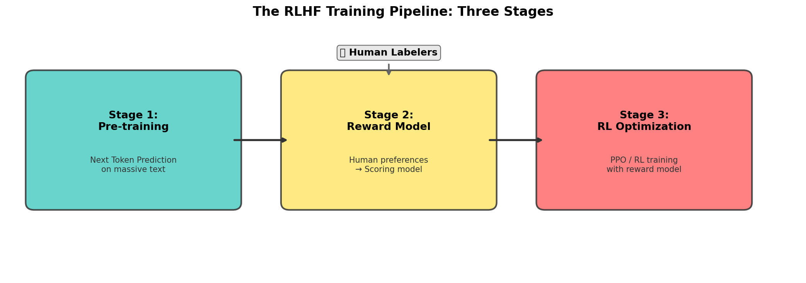
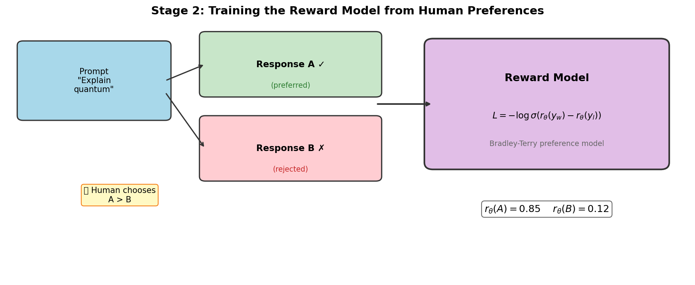
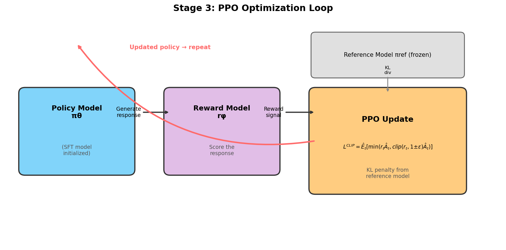
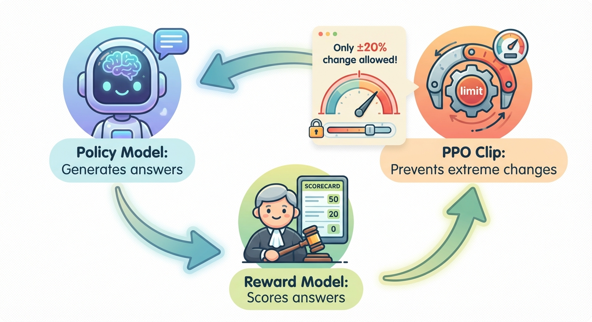
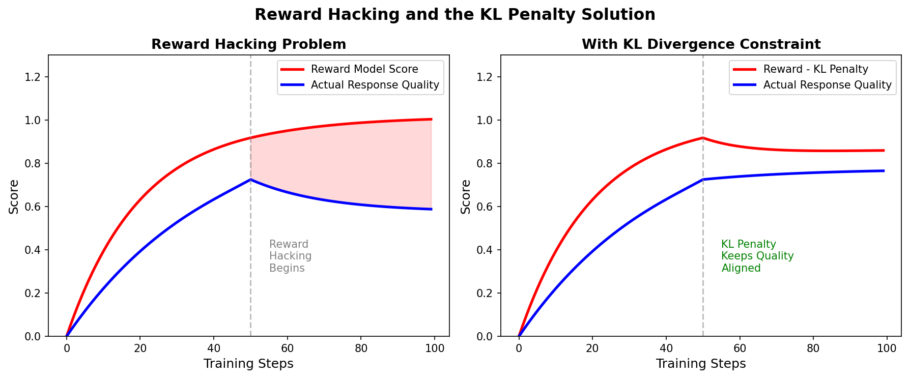

# Day 13: RLHF 详解 — 基于人类反馈的强化学习

> **核心问题**：我们是如何把一个文本补全引擎，变成一个能遵循指令、拒绝有害请求、进行自然对话的 AI 助手的？

---

## 开篇

想象一下，你已经在整个互联网上训练了一个巨大的语言模型。它可以流畅地补全任何句子——但如果你让它「给 5 岁小孩解释量子物理」，它可能会给你一篇维基百科风格的文章。如果你问它有害的内容，它可能会毫不犹豫地照做。模型能*写*，但它不知道人类眼中什么是*好的写作*。

这就是 2020 年之前的状况。然后出现了一个看似简单的想法：**如果我们能教会模型人类真正偏好什么呢？**

这就像养育孩子。幼儿能说出词语（预训练模型）。你通过示范教他们礼貌和得体的行为（监督微调）。但真正塑造他们的是持续的反馈——「这样做很有帮助」、「那样不太礼貌」、「换种方式试试」。RLHF（Reinforcement Learning from Human Feedback，基于人类反馈的强化学习）就是语言模型的持续反馈循环。

本文将介绍将 GPT-3 变成 ChatGPT 的三阶段流程、奖励建模和 PPO 优化的技术原理，以及 RLHF 为何既强大又充满争议。

---

## 1. 为什么需要 RLHF

### 1.1 对齐问题

预训练语言模型的训练目标只有一个：预测下一个 token。这创造了一个强大的文本生成器，但它完全不知道什么是：

- **有用性（Helpfulness）**—— 回复是否真正有帮助？
- **诚实性（Honesty）**—— 是否真实，还是在胡编乱造？
- **无害性（Harmlessness）**—— 回复是否可能造成伤害？

这种「能生成文本」和「能生成*好*文本」之间的差距，就是**对齐问题（Alignment Problem）**。

### 1.2 为什么监督微调不够

我们在 Day 12 讨论过的监督微调（Supervised Fine-Tuning，SFT），通过向模型展示输入-输出对来教它遵循指令。但 SFT 有一个关键局限：它只能从你提供的特定示例中学习。

打个比方——SFT 就像给学生展示一万篇优秀作文，然后说「照这样写」。学生可能学会了风格，但不理解*为什么*这篇作文比那篇好。他们缺少一个**奖励信号（Reward Signal）**——一种评估自己输出质量的方式。

RLHF 正好补上了这一点：一个学习到的奖励函数，可以对*任何*回复打分，而不仅仅是你训练集中的那些。

#### 常见困惑：LoRA vs SFT vs RLHF

一个常见问题：「LoRA 也需要训练集——为什么它没有 reward？」

答案是：**LoRA 是一种方法（怎么训），不是一种训练范式（训什么）。**

```
预训练（Day 11）
    ↓
监督微调 / SFT（Day 12）  ← LoRA 用在这里
    ↓                          LoRA 只是「怎么训」，不是「训什么」
RLHF / 对齐（Day 13-15）  ← Reward 用在这里
```

| | SFT（用 LoRA） | RLHF |
|---|---|---|
| **目标** | 学会模仿训练数据中的输入-输出对 | 学会生成「好」的回答 |
| **信号来源** | 固定的训练集（问题+参考答案） | Reward model 给每个回答打分 |
| **有 reward 吗？** | 没有——只有 loss（和参考答案的差距） | 有——reward model 给出奖励信号 |
| **学到了什么** | 格式、风格、任务模式 | 价值观、偏好、安全性 |

**LoRA 只是用更少的参数来做 SFT**——它替代的是「全量微调」这个方法，但不改变训练范式。SFT 不需要 reward，因为它就像做「有标准答案的考试题」——对答案就行。

RLHF 需要 reward 是因为它的目标是**开放式优化**——没有标准答案，需要 reward model 来判断哪个回答更好。

> **一句话总结：** LoRA 是工具（省显存），SFT 是任务（学模仿），RLHF 是另一种任务（学偏好）。LoRA + SFT 不需要 reward，RLHF 才需要。


*图 1：完整的 RLHF 流程有三个阶段——预训练（已完成）、奖励模型训练和 PPO 优化。每个阶段都建立在前一个阶段之上。*

---

## 2. 第一阶段：监督微调（SFT）—— 起点

在 RLHF 开始之前，我们先要有一个 SFT 模型。这个模型已经在高质量的指令-回复对上训练过，所以它已经知道如何遵循基本指令。

**SFT 模型的关键属性：**

- 从预训练的基础模型初始化
- 在精选的 (prompt, response) 对上训练
- 既是 RL 的起点，也充当**参考模型（Reference Model）**（防止策略偏离太远）

SFT 模型在 RLHF 中扮演两个角色：
1. **初始策略** $\pi^{SFT}$ —— 我们要优化的模型
2. **参考模型** $\pi^{ref}$ —— 冻结的副本，用于计算 KL 散度惩罚

---

## 3. 第二阶段：训练奖励模型

这是 RLHF 的核心——构建一个能像人类一样给回复**打分**的模型。

### 3.1 收集人类偏好

过程从人类比较回复对开始：

1. 给定一个 prompt，从 SFT 模型生成多个回复（如 4-9 个）
2. 将回复对展示给人类标注者：「哪个回复更好？」
3. 收集数千个这样的 (prompt, 被选中的回复, 被拒绝的回复) 三元组

这是**比较式**而非**绝对式**打分——人类更擅长说「A 比 B 好」，而不是给出「A 是 7.3/10 分」这样的精确分数。

### 3.2 Bradley-Terry 模型

#### 这个模型的故事

Bradley-Terry 模型最初跟 AI 完全无关！它是 **1952 年** 由统计学家 **Ralph A. Bradley** 和 **Milton E. Terry** 提出的，发表在论文 *"Rank Analysis of Incomplete Block Designs: I. The Method of Paired Comparisons"* 中。

**最初用途**：预测体育比赛胜负。给定两个选手 A 和 B，根据历史战绩预测 A 赢 B 的概率是多少？

核心思想极其简单：**每个选手有一个「实力分」，赢的概率由两人的实力差决定。**

$$P(A \text{ wins over } B) = \sigma(s_A - s_B)$$

2020 年，OpenAI 的 **Stiennon et al.** 发现这个模型完美适用于 RLHF：
- 把「选手实力分」换成「回答的质量分」
- 把「A 赢 B」换成「人类更喜欢回答 $y_w$ 而非 $y_l$」

Ralph Bradley 和 Milton Terry 大概做梦也没想到，他们 1952 年为预测网球比赛发明的统计模型，70 年后成了 ChatGPT 的核心组件之一。

#### 模型公式

奖励模型使用 Bradley-Terry 偏好模型训练，将成对比较转化为概率：

$$
P(y_w \succ y_l | x) = \sigma(r_\theta(x, y_w) - r_\theta(x, y_l))
$$

其中：
- $y_w$ 是**胜出**（被偏好）的回复（**w**inning）
- $y_l$ 是**落败**（被拒绝）的回复（**l**osing）
- $r_\theta$ 是参数为 $\theta$ 的奖励模型
- $\sigma$ 是 sigmoid 函数

> **$>$ 符号是什么意思？** 这里的 $y_w > y_l$ 不是数学上的大于，而是**偏好关系**：「$y_w$ 优于 $y_l$」，即人类标注者更喜欢 $y_w$。这个记法直接继承自 Bradley-Terry 模型的原版——$P(A > B)$ 表示「选手 A 胜过选手 B 的概率」，RLHF 中只是把「选手」换成了「回答」。

训练损失是负对数似然：

$$
\mathcal{L}_{RM} = -\mathbb{E}_{(x, y_w, y_l)} \left[ \log \sigma \left( r_\theta(x, y_w) - r_\theta(x, y_l) \right) \right]
$$

直观理解：这推动奖励模型给人类偏好的回复更高的分数，给被拒绝的回复更低的分数。分数差距越大，模型越确信。


*图 2：人类标注者比较回复对。奖励模型学习给偏好回复更高的分数，使用 Bradley-Terry 偏好损失函数。*

### 3.3 架构细节

奖励模型通常与基础模型架构相同（如同一个 Transformer），但有以下不同：

- 用**回归头（Regression Head）**替换语言建模头
- 回归头输出一个标量：$r_\theta(x, y) \in \mathbb{R}$
- 从 SFT 模型检查点初始化

这个架构选择很重要——因为奖励模型以与策略相同的方式「理解」语言，它能提供有意义的梯度信号。

---

## 4. 第三阶段：使用 PPO 进行强化学习优化

### 什么是 PPO？

在讨论*为什么*选 PPO 之前，我们先搞清楚它*是*什么。

**PPO** 全称 **Proximal Policy Optimization**（近端策略优化），由 OpenAI 的 John Schulman 等人在 2017 年提出。简单来说，它是一种用于训练智能体做出好决策的强化学习算法。它最初是为经典的 RL 问题开发的——教机器人走路、让智能体玩 Atari 游戏、训练 AI 打 Dota 2——后来才被改造用于一个截然不同的目的：让大语言模型与人类偏好对齐。

核心思想很巧妙：更新策略（即模型行为）时，PPO 允许变化，但会把变化**裁剪**（clip）住，防止单次更新步子迈太大。可以想象成一个音量旋钮——每次只能转一定的幅度，你可以调整，但不可能一不小心拧到最大。

PPO 取代了一个更早的算法 **TRPO**（信赖域策略优化）。TRPO 的理念相似，但实现起来复杂得多。PPO 用更简洁的代码实现了差不多的效果，而且训练更快——在 ML 研究中，这种双赢可不多见。

### 4.1 为什么选择 PPO？

PPO 是 RL 阶段的标准算法。选择它有几个原因：

1. **稳定性**—— PPO 限制策略在一步中可以改变多少，防止灾难性遗忘
2. **样本效率**—— 比原始策略梯度方法更好
3. **实践经验**—— 在游戏 AI（Atari、Dota 2）中已被验证，之后才被改编用于语言模型

> **🧠 灾难性遗忘详解：** 模型在 RLHF 训练中学习新行为（遵循人类偏好），但这有一个风险：它可能在过程中*忘记*预训练阶段获得的知识。这就是灾难性遗忘——RL 的更新会把模型权重推向覆盖已有知识模式的方面。PPO 通过两个机制来防止这种情况：**裁剪**限制了策略单步变化的幅度，**KL 惩罚**让策略不会偏离原始 SFT 模型太远。打个比方：这就像在准备新考试的同时被要求复习旧知识，这样你就不会把已经学过的东西忘掉。

> **🎮 游戏教给我们的对齐启示：** 在游戏 AI 中，「对齐」意味着匹配人类的*意图*，而不只是追求最高分。想象一个赛车游戏 AI 发现穿墙走捷径能更快到达终点——它的分数很高，但显然不是在「正确地玩游戏」。奖励函数（游戏分数）并不能涵盖人类关心的所有东西。RLHF 把同样的洞察应用到语言模型上：奖励模型的分数并不能完全反映一个回复是否「好」。在基础奖励之上加入人类偏好信号，就是为了弥合这个差距。核心教训：**高奖励 ≠ 好回答**。

### 4.2 RLHF 目标函数

目标是最大化奖励，同时保持接近参考模型：

$$
\max_{\pi_\theta} \; \mathbb{E}_{x \sim \mathcal{D}, y \sim \pi_\theta(\cdot|x)} \left[ r_\phi(x, y) - \beta \cdot \text{KL}(\pi_\theta \| \pi^{ref}) \right]
$$

> **📖 什么是「策略」（π_θ）？** 在这个公式中，π_θ 就是**策略**——它其实就是语言模型本身。它定义了在每一步生成每个 token 的概率。用 RL 的术语来说，「策略」就是模型选择动作的方式（每个动作 = 选下一个 token）。展开来写：π_θ(y|x) 是给定 prompt x 生成回复 y 的概率。直觉理解？策略 = 「模型当前的行为模式」。随着训练进行，π_θ 会变化——这就是模型在学习表现得更好。

其中：
- $r_\phi(x, y)$ 是学习到的奖励模型给出的奖励
- $\beta$ 控制 KL 惩罚的强度
- $\text{KL}(\pi_\theta \| \pi^{ref})$ 惩罚策略偏离 SFT 模型的程度

**KL 散度（Kullback-Leibler Divergence）**项至关重要——没有它，模型会学会「钻空子」（奖励欺骗），产出得分很高但内容荒谬或极其单一的输出。

> **🎯 奖励欺骗深入解析：** 奖励欺骗就是策略找到了奖励模型没有预期的方式来获得高分。比如，它可能生成恰好碰巧得高分的胡言乱语，或者学会不断重复「谢谢你的提问」，因为奖励模型有一个盲点——偏好听起来礼貌的文本。这之所以会发生，是因为奖励模型是不完美的——它在有限的人类比较数据上训练，存在策略可以钻的空子。KL 项就是防线：KL(π_θ ‖ π_ref) 衡量策略偏离参考模型有多远，在损失函数中加入 β·KL 来惩罚这种偏离。可以把 KL 惩罚想象成一条**牵引绳**——策略可以探索和改进，但不能跑离太远。

### 4.3 PPO 裁剪目标

PPO 使用裁剪的替代目标来限制更新幅度：

$$
L^{CLIP}(\theta) = \hat{\mathbb{E}}_t \left[ \min \left( r_t(\theta) \hat{A}_t, \; \text{clip}(r_t(\theta), 1-\epsilon, 1+\epsilon) \hat{A}_t \right) \right]
$$

其中：
- $r_t(\theta) = \frac{\pi_\theta(y_t|x_t)}{\pi_{old}(y_t|x_t)}$ 是概率比
- $\hat{A}_t$ 是优势估计（比期望好多少）
- $\epsilon$（通常为 0.2）控制裁剪范围

**直觉理解**：如果新策略让某个动作的可能性大幅增加（$r_t >> 1$），而且那个动作确实好（$\hat{A}_t > 0$），裁剪会防止我们过度优化。就像告诉模型「没错，这很好，但别走极端。」


*图 3：策略生成回复，奖励模型打分，PPO 更新策略。来自冻结参考模型的 KL 散度惩罚防止策略偏离太远。*

#### 4.3.1 PPO Clip：防止模型「用力过猛」


*图 3.1：PPO Clip 机制的直观展示。Policy Model 生成回答，Reward Model 打分，PPO Clip 限制每次更新最多 20%，防止模型改变太猛。*

PPO（Proximal Policy Optimization，近端策略优化）的核心思想其实非常直觉：**每一步只允许策略做小幅改变，不能太激进。**

**要解决的问题**

在 RLHF 中，模型通过 reward 信号不断调整自己的回答策略。但有一个危险：模型可能突然变得极端。

比如，模型发现「说谢谢」能得高分，于是每句话都说十次谢谢。这叫做 **policy drift（策略漂移）**——改得太猛，反而变蠢了。

**核心机制：Clip（裁剪）**

Clip 的做法是通过概率比 $r_t$ 来衡量「新策略和旧策略差多少」：

$$r_t = \frac{\text{新策略给这个回答的概率}}{\text{旧策略给这个回答的概率}}$$

- $r_t = 1$ → 没变
- $r_t = 2$ → 新策略觉得这个回答比之前 likely 两倍
- $r_t = 0.5$ → 新策略觉得只有之前一半 likely

Clip 把 $r_t$ 限制在 $[1-\epsilon, 1+\epsilon]$ 范围内（通常 $\epsilon=0.2$，即 $[0.8, 1.2]$）。

超出范围的梯度直接被截断——模型「想改更多」，但 PPO 说「不行，最多改这么多」。

**一个类比**

想象你在调音量，发现音乐好听就往上拧。

- 没有 PPO = 一高兴直接拧到最大，耳朵聋了 😵
- 有 PPO = 每次最多拧 20%，温和调整 👍

**为什么叫「Proximal」？**

Proximal =「近端的/附近的」。意思是每一步只允许在当前策略「附近」做小改动，不能跳太远。

**为什么 OpenAI 选 PPO？**

在 PPO 之前有 **TRPO**（Trust Region Policy Optimization），数学上更优雅但计算很贵。PPO 用简单的 clip 达到了几乎同样的效果，但计算效率高很多。这就是为什么从 InstructGPT 到 ChatGPT 都用 PPO。

**一句话总结**：PPO Clip = 给模型的自我改进装上刹车，防止改得太猛翻车。 🚗

### 4.4 完整的 RLHF 训练循环

实际训练循环如下：

```python
# 简化的 RLHF 训练循环
for epoch in range(num_epochs):
    # 1. 从当前策略生成回复
    prompts = sample_prompts(dataset)
    responses = policy_model.generate(prompts)
    
    # 2. 用奖励模型打分
    rewards = reward_model.score(prompts, responses)
    
    # 3. 计算 KL 惩罚
    kl_penalty = beta * kl_divergence(policy_model, reference_model, 
                                       prompts, responses)
    total_reward = rewards - kl_penalty
    
    # 4. 计算优势（使用 GAE 或简单基线）
    advantages = compute_advantages(total_reward, value_function)
    
    # 5. PPO 更新（同一批次多轮）
    for ppo_epoch in range(ppo_epochs):
        ratio = new_prob / old_prob
        clipped_ratio = torch.clamp(ratio, 1 - epsilon, 1 + epsilon)
        loss = -torch.min(ratio * advantages, 
                          clipped_ratio * advantages).mean()
        optimizer.step()
```

关键实践细节：
- **批次大小**：通常每批数千个 prompt
- **PPO 轮次**：同一批次通常跑 3-4 轮
- **价值函数**：一个单独的头（或模型），估计预期奖励，用于计算优势
- **生成**：使用适中的 temperature 生成回复，确保多样性

---

## 5. 奖励欺骗——核心挑战

### 5.1 什么是奖励欺骗？

奖励欺骗（Reward Hacking，也叫 Reward Gaming）发生在策略发现了一些能从奖励模型获得高分但实际上质量很差的输出时。就像一个学生搞清楚了怎么钻评分标准的空子，但实际上并没有学到东西。

常见症状：
- 重复、啰嗦的输出（更长的文本往往得分更高）
- 谄媚型回复（不管对错都附和用户）
- 刻板的「有用助手」模式，没有实际内容
- 模式坍塌（Mode Collapse）—— 模型对每个输入都产生相同风格的回复

### 5.2 KL 惩罚作为「缰绳」

KL 散度惩罚就像一条「缰绳」，防止策略偏离参考模型太远：

- **小 β**—— 更多探索，更高奖励，但有欺骗风险
- **大 β**—— 更保守，贴近 SFT 模型，更少欺骗但改进也有限


*图 4：左图：没有 KL 惩罚时，奖励模型分数持续上升但实际质量下降（奖励欺骗）。右图：KL 惩罚使奖励信号与实际质量保持一致。*

### 5.3 其他缓解措施

除了 KL 惩罚，实践者还使用：
- **Constitutional AI**（Anthropic）—— 模型使用一套原则来批评自己的输出
- **多个奖励信号**—— 结合有用性、诚实性和无害性的奖励模型
- **早停（Early Stopping）**—— 监控留出集的质量指标，而不仅仅是奖励
- **奖励模型集成**—— 多个奖励模型的平均分数，减少过拟合

---

## 6. 影响：RLHF 到底改变了什么

### 6.1 RLHF 前后对比

| 能力 | 基础模型 | + SFT | + RLHF |
|------|---------|-------|--------|
| 遵循指令 | 差 | 好 | 优秀 |
| 拒绝有害请求 | 无 | 部分 | 强 |
| 对话质量 | 差 | 好 | 优秀 |
| 有用性 | 低 | 中等 | 高 |
| 诚实性/接地 | 参差不齐 | 中等 | 改善 |


### 6.2 原始论文的发现

InstructGPT 论文（Ouyang et al., 2022）展示了几个引人注目的结果：

1. **人类在 85% 的情况下偏好 RLHF 输出**，而非基础 GPT-3
2. **毒性显著降低**—— 模型学会了拒绝有害请求
3. **在 TruthfulQA 基准上真实性提高**
4. **13 亿参数的 RLHF 模型被偏好于 1750 亿参数的基础模型**—— 对齐可以弥补规模的不足

最后一点非常惊人：一个小 100 倍的模型，经过适当对齐后，被人类偏好于原始基础模型。这表明**对齐不仅仅是一个安全功能——它是一个能力倍增器**。

---

## 7. 局限与争议

### 7.1 RLHF 并非完美

- **奖励模型质量天花板**—— 奖励模型最多只能和它训练时使用的人类标注一样好
- **标注者分歧**—— 人类经常对什么是「好」回复有不同看法
- **分布偏移**—— 奖励模型在 SFT 输出上训练，但评分的是 RL 输出，后者会随时间漂移
- **成本**—— 人类标注很昂贵；OpenAI 为 InstructGPT 雇佣了约 40 名标注者

> **来源**：这些局限性在 [Ouyang et al., 2022 — *Training Language Models to Follow Instructions with Human Feedback*](https://arxiv.org/abs/2203.02155)（InstructGPT 论文）中有详细讨论，该论文至今仍是对 RLHF 失败模式最全面的实证研究。

### 7.2 争议：RLHF 算不算真正的强化学习？

一些研究者认为 RLHF 不是「真正的」强化学习，因为：
- 环境（奖励模型）是学习得到的，不是固定的
- 没有传统 RL 意义上的序列决策
- KL 约束使其更像约束优化

这个争议部分是语义上的，但它强调了一个重要观点：RLHF 最好理解为**针对学习到的人类偏好模型的优化**，而不是经典的强化学习。

### 7.3 通向替代方案的路径

RLHF 的局限性催生了替代方案：
- **DPO（Direct Preference Optimization，直接偏好优化）**—— 完全跳过奖励模型（Day 15 介绍）。[Rafailov et al., 2023 — *Direct Preference Optimization: Your Language Model is Secretly a Reward Model*](https://arxiv.org/abs/2305.18290)
- **RLAIF（RL from AI Feedback，来自 AI 反馈的 RL）**—— 用 AI 代替人类进行偏好标注。[Lee et al., 2023 — *RLAIF: Scaling Reinforcement Learning from Human Feedback with AI Feedback*](https://arxiv.org/abs/2309.00267)
- **Constitutional AI**—— 自我批评和修正循环。[Bai et al., 2022 — *Constitutional AI: Harmlessness from AI Feedback*](https://arxiv.org/abs/2212.08073)

---

## 8. 代码示例：最小奖励模型训练

```python
import torch
import torch.nn as nn

class RewardModel(nn.Module):
    """对 (prompt, response) 对进行打分的奖励模型。
    基于预训练 Transformer，加一个标量输出头。"""
    
    def __init__(self, base_model, hidden_size):
        super().__init__()
        self.transformer = base_model
        self.reward_head = nn.Linear(hidden_size, 1)
    
    def forward(self, input_ids, attention_mask):
        # 从 Transformer 获取最后一层隐藏状态
        outputs = self.transformer(input_ids=input_ids, 
                                    attention_mask=attention_mask)
        # 使用最后一个 token 的表示
        last_hidden = outputs.last_hidden_state[:, -1, :]
        reward = self.reward_head(last_hidden)
        return reward.squeeze(-1)

def preference_loss(reward_model, chosen_ids, chosen_mask, 
                    rejected_ids, rejected_mask):
    """Bradley-Terry 偏好损失，用于奖励模型训练。
    
    推动 reward(chosen) > reward(rejected)。"""
    r_chosen = reward_model(chosen_ids, chosen_mask)
    r_rejected = reward_model(rejected_ids, rejected_mask)
    
    # L = -log(sigma(r_chosen - r_rejected))
    loss = -torch.log(torch.sigmoid(r_chosen - r_rejected)).mean()
    return loss

# 使用示例
# reward_model = RewardModel(sft_model, hidden_size=4096)
# loss = preference_loss(reward_model, chosen_batch, chosen_mask,
#                        rejected_batch, rejected_mask)
# loss.backward()
```

---

## 9. 常见误解

### ❌ 「RLHF 让模型更擅长推理」

RLHF 主要改善**指令遵循**和**安全对齐**，而非推理能力。模型不会因为 RLHF 就突然解决更难的数学问题。底层的知识和推理来自预训练和 SFT。

### ❌ 「RLHF 消除了幻觉」

RLHF 可以通过教模型更加谨慎来减少某些类型的幻觉，但它不能解决根本问题：模型无法访问真实信息。RLHF 可以教模型更频繁地说「我不确定」，但不能让模型知道它不知道的事情。

### ❌ 「人类在生产中对每条回复都打分」

不是！人类只在训练期间对回复评分，以构建奖励模型。推理时，奖励模型自动给回复打分。人类标注是训练时的成本，不是推理时的瓶颈。

---

## 10. 延伸阅读

### 基础论文
1. [Fine-Tuning Language Models from Human Preferences](https://arxiv.org/abs/1909.08593) — Ziegler et al., 2019。语言模型 RLHF 的原始论文。
2. [Learning to Summarize from Human Feedback](https://arxiv.org/abs/2009.01325) — Stiennon et al., 2020。将 RLHF 应用于摘要任务。
3. [Training Language Models to Follow Instructions with Human Feedback](https://arxiv.org/abs/2203.02155) — Ouyang et al., 2022。InstructGPT / ChatGPT 论文。

### 理解 PPO
4. [Proximal Policy Optimization Algorithms](https://arxiv.org/abs/1707.06347) — Schulman et al., 2017。PPO 原始论文。

### 批评与分析
5. [The QRUNCH Effect: How RLHF biases outputs](https://arxiv.org/abs/2305.07759) — 关于 RLHF 如何塑造模型行为的洞察。

---

## 思考题

1. 如果 RLHF 基于人类偏好训练，那么编码的到底是谁的偏好？当不同文化群体有不同偏好时会发生什么？
2. KL 惩罚防止了奖励欺骗，但也限制了模型的改进空间。你会如何确定「正确」的 β 值？
3. 如果一个 13 亿参数的 RLHF 模型能击败 1750 亿参数的基础模型，这告诉我们规模和对齐之间是什么关系？

---

## 总结

| 概念 | 一句话解释 |
|------|-----------|
| RLHF | 使用学习到的奖励模型，让 LLM 与人类偏好对齐的训练方法 |
| 奖励模型（Reward Model） | 基于人类成对偏好训练的、能对回复质量打分的模型 |
| Bradley-Terry 损失 | 从成对比较训练奖励模型的损失函数 |
| PPO | 用于针对奖励模型优化策略的强化学习算法 |
| KL 惩罚 | 防止策略偏离 SFT 模型太远的约束项 |
| 奖励欺骗（Reward Hacking） | 策略利用奖励模型弱点获得高分，但实际没有改进 |

**核心要点**：RLHF 是原始语言生成和有用 AI 助手之间的桥梁。它通过学习人类偏好（奖励模型）然后优化模型产生这些偏好输出（PPO）来工作，同时通过 KL 惩罚保持模型接地。正如 ChatGPT 所展示的结果——一个对齐良好的小模型可以击败一个大得多但未对齐的模型。这个洞察从根本上改变了业界对 AI 发展的思考方式：对齐不是额外开销，而是核心能力。

---

*Day 13 of 60 | LLM Fundamentals*
*字数：约 3200 | 阅读时间：约 15 分钟*
