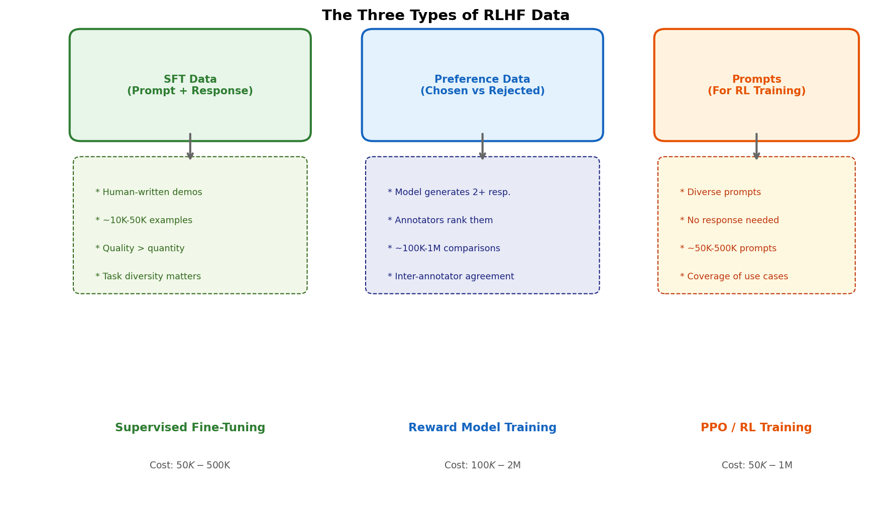
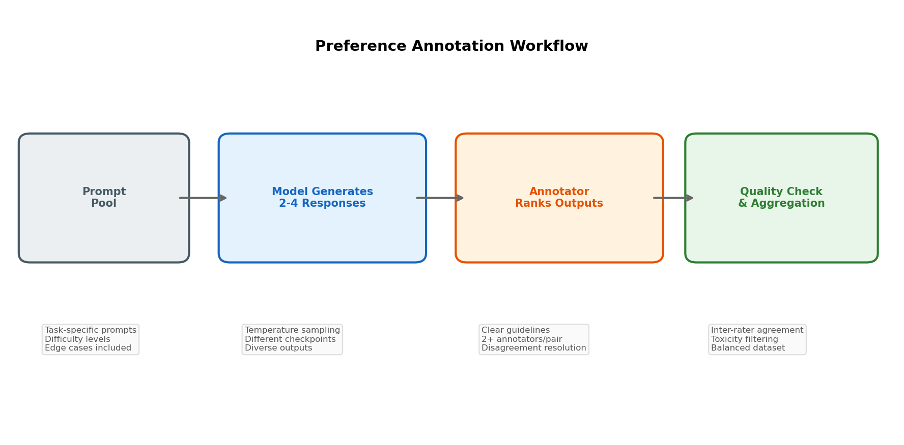
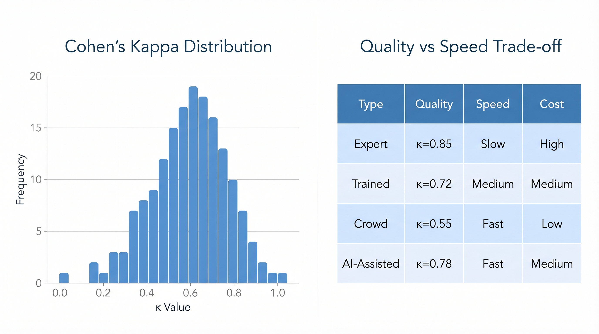
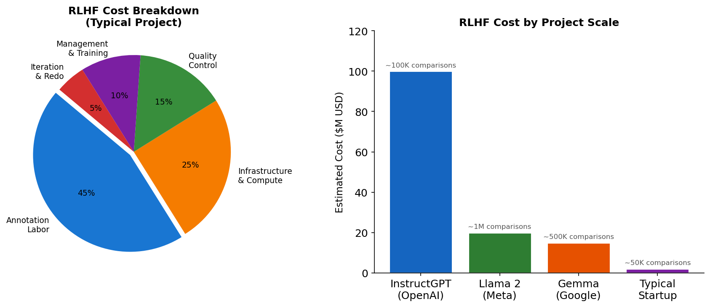
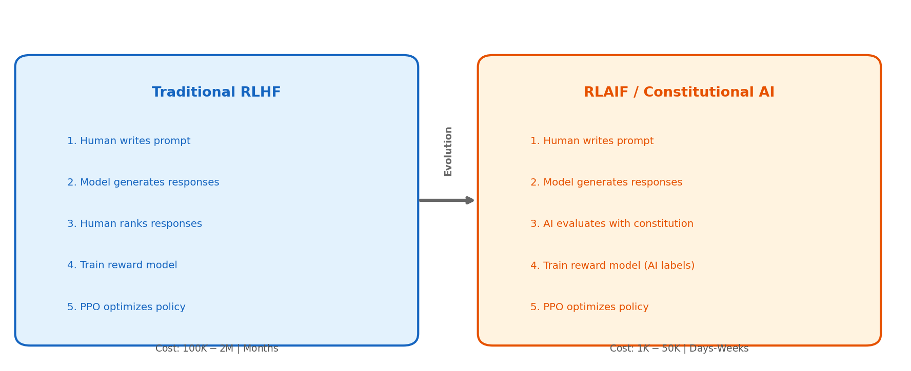

# Day 14: RLHF 的数据与实践

> **核心问题**: RLHF 的数据集到底怎么构建？要花多少钱？

---

## 开篇

昨天我们探讨了 RLHF 的三阶段管线：监督微调（SFT）、奖励模型训练和 PPO 优化。但大多数论文都刻意回避了一个不舒服的事实：**算法是最简单的部分，数据才是决定项目成败的关键。**

把 RLHF 想象成做一道精致的菜。算法是烤箱温度和时间——重要但直接。数据是你食材的品质。再精确的温度控制也救不了用臭鱼做的菜。

据报道，OpenAI 花了几个月和几百万美元做 InstructGPT 的人工标注。Meta 为 Llama 2 的对齐雇了一整支标注团队。赢得 RLHF 竞赛的公司不是因为算法更好——而是因为数据管线更出色。

今天我们深入实操层面：如何收集 SFT 演示数据、偏好标注到底怎么运作、成本多少、以及如何衡量质量。

---

## 1. RLHF 的三类数据

RLHF 需要三种不同类型的数据，各有各的用途：


*说明：每个 RLHF 阶段需要不同类型的数据，收集策略和成本各不相同*

### 1.1 SFT 演示数据

监督微调（SFT）数据由 **提示-回复对** 组成，由人类演示者写出理想回复。这教会模型*如何*回应——语气、格式、长度和有用性。

**关键特征：**
- **数据量**：10K–50K 条（出奇地少！）
- **质量门槛**：极高——每条都是手工打磨的
- **多样性**：必须覆盖全部预期使用场景
- **成本**：$50K–$500K，取决于复杂度

OpenAI 的 InstructGPT 论文使用了大约 13K 条 SFT 数据。Anthropic 的 Constitutional AI 论文用了类似量级。关键洞察：**少量高质量演示数据的效果出奇地好**。10K 条优秀的示例胜过 100K 条平庸的。

### 1.2 偏好比较数据

这是 RLHF 的核心——人类指出哪一对回复更好的数据。想象一场大型锦标赛：模型生成回复，人类裁判打分，我们从这些判断中学习奖励信号。

**关键特征：**
- **数据量**：100K–1M 条比较（这是瓶颈）
- **质量门槛**：单条要求中等，但一致性极其重要
- **标注类型**：排序（不是打分——人类不擅长绝对评分）
- **成本**：$100K–$2M

### 1.3 RL 训练用的提示数据

在 PPO 阶段，你需要一个多样化的提示池，让模型生成回复并获得奖励。不需要标准答案——只需要提示。

**关键特征：**
- **数据量**：50K–500K 条提示
- **质量门槛**：多样性比质量更重要
- **成本**：相对较低——可以合成生成或爬取

---

## 2. 偏好标注：瓶颈所在

让我们放大看最难的部分：收集偏好比较。


*说明：从提示池到质量验证的数据集的端到端工作流*

### 2.0 构建 Prompt 池

在收集偏好数据之前，需要先准备一批多样化的 prompt。这不仅仅是随机采样，而是**策略性策展**。

**任务相关的 prompts** 是为覆盖你的目标用例而设计的。如果你在构建一个代码助手，就包含不同难度的编程挑战；如果是通用聊天机器人，就包含日常问题、创意写作任务和事实查询。目标是覆盖面的广度。

**难度分级**也很重要。如果每个 prompt 都是「简单」，模型会学会处理简单情况但难以应对复杂性。如果每个 prompt 都是「困难」，模型可能会过度设计并错过基本交互。均衡的混合——简单、中等、困难——确保了鲁棒性。

**边界情况**对生产模型至关重要。这些包括旨在欺骗模型的对抗性 prompt、测试解释能力的模糊查询、测试上下文保持的多轮对话、以及用不同语言或方言测试多语言能力的 prompt。

### 2.0b 响应生成策略

有了 prompt 池，下一步是为标注者生成多样化的回复进行比较。这不仅仅是「采样一次」那么简单。

**温度采样（Temperature Sampling）**是多样性的关键工具。温度控制 token 生成的随机性。低温度（T ≈ 0.3）产生确定性输出——同一个 prompt 几乎总是给出相同的回复。高温度（T ≈ 0.8-1.2）产生更有创意、更多样的回复。对于 RLHF，通常使用中等温度（0.7-1.0）来获得既多样又合理的输出。

**为什么专门用 2-4 个回复？**少于 2 个意味着无法比较。超过 4-5 个会导致标注者疲劳，边际收益递减。InstructGPT 论文每个 prompt 使用 4 个回复是最佳平衡点。

**不同检查点（Different Checkpoints）**提供风格上的多样性。通过从 SFT 模型的不同训练阶段（例如 epoch 5 vs epoch 10）生成回复，你可以捕捉不同「风味」的回复。早期 epoch 可能更正式，后期 epoch 更有创意。这增加了比较池的多样性，而无需更多的 prompt。

### 2.1 为什么排序，而不是打分？

一个自然的问题：为什么不让标注者给每个回复打 1–5 分？

事实证明人类极不擅长绝对评分。如果你给两个标注者看同一条回复要求打分，你会得到天差地别的数字。但如果你让他们看两条回复并问"哪个更好？"，一致性会显著提高。

这是心理物理学（Psychophysics，研究人类如何感知物理刺激的学科）的已知发现。人类在**比较性**判断上比**绝对性**判断好得多。韦伯-费希纳定律（Weber-Fechner Law）告诉我们，人类感知的是相对于基线的差异，而不是绝对值。

> **什么是韦伯-费希纳定律？** 它是心理物理学的基本原理，描述感知差异与刺激强度成正比：ΔI ∝ I。通俗地说：人类感知的是*相对*变化，不是*绝对*值。这就是为什么你能轻松分辨 1kg 和 2kg 的重量差，但很难区分 50kg 和 51kg——*相对*变化比*绝对*差异更重要。在标注中：当两个回复质量差距很大时，人类很容易就哪个更好达成一致。但当差异微妙（比如「还不错」vs「挺好的」），判断就会高度不一致。这正是为什么**排序（哪个更好？）**比**打分（给个 1-5 分）**能产生更可靠的数据——比较判断绕过了韦伯-费希纳定律所描述的绝对量表问题。

实践中，大多数 RLHF 数据集使用以下格式之一：

| 格式 | 示例 | 优点 | 缺点 |
|------|------|------|------|
| 二选一 | "A 还是 B？" | 简单、快速 | 信号有限 |
| 排序列表 | "给 A、B、C、D 排序" | 丰富的比较 | 认知负担更重 |
| 李克特 + 配对 | 先各打分再比较 | 有校准数据 | 更贵 |

InstructGPT 论文主要使用二选一加第三个"平局"选项。

> **什么是"平局"选项？** 这是在比较式标注中使用的策略。通常给标注员两个选项："A 更好"或"B 更好"。但当两个回复质量非常接近时，标注员会犹豫——强行选一个可能不准确。第三个"平局"（相等）选项让标注员可以诚实地说"两个一样好"。这避免了强制选择带来的噪声数据，并帮助模型学习边界情况（没有明显偏好时）。

### 2.4 比较过程

现在我们进入偏好标注的核心：**标注者实际上是如何比较回复的**。这个过程的设计直接影响数据质量。

**盲比较（Blind Comparison）**意味着标注者不知道哪条回复是由哪个模型生成的。这至关重要，因为知道来源会引入偏见——标注者可能偏好来自「知名好」模型的回复，或者贬低他们认为来自「较弱」模型的回复。有些团队更进一步**随机打乱回复的展示顺序**（随机分配哪条显示为「回复 A」vs「回复 B」），以防止**位置偏见**，即标注者会下意识地偏好他们首先看到的。

> **有趣的事实**：位置偏见在调查研究中得到了充分记录。在选举投票中，列在第一位的候选人会获得投票数量的显著提升。同样的效应也适用于回复比较——在其他条件相等的情况下，「回复 A」仅因为先被展示就比「回复 B」被选中的频率略高。打乱可以中和这种效应。

**每对使用多个标注者**（通常是 2-3 人）对可靠性至关重要。单个标注者可能正在经历糟糕的一天、误解指南，或者只是犯错。通过让多个标注者判断相同的一对回复，你可以：
- 测量一致性（通过 Cohen's Kappa，我们下面会讲到）
- 识别持续表现不佳的标注者
- 捕获合理人们 genuinely 存在分歧的模糊对

**分歧解决（Disagreement Resolution）**是当标注者意见不一致时发生的事情。有几种策略：
- **多数投票**：最常用的方法。有 3 个标注者时，多数赢。简单有效。
- **升级**：有争议的对被发送给高级标注者或专家进行决胜裁决。
- **丢弃**：移除标注者显著分歧的对。这会减小数据集大小但提高平均质量。
- **保留分歧信号**：有争议的对——即有能力标注者 genuinely 分歧——实际上是有**信息量**的。它们告诉你回复在质量上很接近，这对奖励模型是有用的信号。有些团队将这些对明确标记为「平局（tie）」或「近平局（near-tie）」，而不是丢弃它们。

> **关键洞察**：完美的标注者一致性既不现实也不可取。如果每个标注者总是同意，你的任务可能太简单，你没有收集到微妙的信号。一定水平的分歧（κ ≈ 0.5–0.7）是理想状态——足够一致以可靠，但又有足够的差异来捕捉真正的差异性。

### 2.5 数据清洗与平衡

在偏好数据集进入奖励模型训练之前，需要质量检查和平衡。

**毒性过滤与安全检查（Toxicity Filtering & Safety Checks）**是不可商量的。在将响应包含到数据集之前，扫描有害内容。为什么？如果你的数据集包含有害的「被选中」响应——即那些粗鲁、有偏见或有害的回复——你的奖励模型将学会偏好毒性。自动化毒性分类器有助于捕捉明显的情况，但手动检查对于微妙的問題也是必要的。

**RLHF 的平衡数据集（Balanced Dataset for RLHF）**意味着在主题、难度级别和回复类型上均等表示。这关乎覆盖，而不仅仅是随机采样。如果你 80% 的偏好数据是关于编程问题，20% 关于创意写作，你的奖励模型将严重偏向于编码质量并可能降低创意表现。分层抽样确保在所有维度上按比例覆盖。

**类比**：这就像训练一个学生——如果你只给他们数学题，他们会在文学上挣扎。均衡的课程培养出全面发展的学生。

---

## 3. 衡量标注质量

写标注指南是 RLHF 中最被低估的任务之一。这些指南告诉标注者"更好"意味着什么。糟糕的指南 = 不一致的数据 = 损坏的奖励模型。

好的指南包括：

1. 每个标准的**具体示例**（好的回复 vs 差的回复）
2. 标准冲突时的**优先级排序**（如：有用性 vs 安全性）
3. **边界情况处理**——平局、拒绝、不安全内容怎么办
4. **定期校准会议**保持标注者一致

OpenAI InstructGPT 的指南据说有几十页。Anthropic 在 Constitutional AI 论文中发布了简化版本。关键洞察：**指南是活文档**，随着你发现歧义而不断迭代。

### 2.3 标注者是谁？

这是一个关键的实操决策：

| 类型 | 质量 | 速度 | 成本/条 | 适用场景 |
|------|------|------|---------|----------|
| 专家研究员 | 非常高 | 慢（~5条/分钟） | $5–$20 | 黄金标准，小数据集 |
| 受训承包商 | 良好 | 中（~15条/分钟） | $0.50–$2 | 生产级 RLHF |
| 领域专家 | 高（特定领域） | 中 | $1–$5 | 专业模型 |
| 众包工人 | 不稳定 | 快（~30条/分钟） | $0.02–$0.10 | 大规模简单任务 |


*说明：左：标注者间一致性分数的分布。右：不同标注者类型的质量-速度权衡*

大多数生产级 RLHF 管线使用**分层方法**：专家研究员制定指南并验证质量，受训承包商承担主要标注工作，众包工人处理简单明确的任务。

---

## 3. 衡量标注质量

怎么知道你的偏好数据好不好？这就需要质量指标。

### 3.1 标注者间一致性

最重要的指标是**标注者间一致性（Inter-Annotator Agreement）**——不同的标注者看到同一对回复时，是否得出相同的结论？

标准度量是 **Cohen's Kappa (κ)**（科恩卡帕系数）：

$$
\kappa &= \frac{p_o - p_e}{1 - p_e}
$$

其中 $p_o$ 是观察到的一致率，$p_e$ 是随机情况下预期的一致率。

**解读：**

| Kappa | 一致性水平 |
|-------|-----------|
| < 0.20 | 差 |
| 0.20 – 0.40 | 一般 |
| 0.40 – 0.60 | 中等 |
| 0.60 – 0.80 | 良好 |
| > 0.80 | 非常好 |

对于 RLHF，通常要求 κ > 0.6。InstructGPT 论文报告了一致率约 73%（大约对应 κ ≈ 0.5–0.6，取决于任务）。

一致性低通常意味着以下之一：
- **指南有歧义**——标注者对"更好"的理解不同
- **真正的主观比较**——两条回复确实差不多好
- **标注者培训不足**——不理解任务

### 3.2 黄金标准集

大多数团队维护一个**黄金标准**集，约 500–1000 条比较，其"正确"答案由专家确定。每批标注都会与这个黄金集交叉验证。

持续偏离黄金标准的标注者会被重新培训或移除。这是调查研究领域的标准质量控制技术。

### 3.3 对抗性测试

一个巧妙的技巧：故意在标注管线中插入**明显错误**的回复。如果标注者没有一致地拒绝这些回复，说明质量有问题。这在调查文献中叫"注意力检查"，在 ML 中叫"对抗性质量控制"。

---

## 4. RLHF 的经济学

来谈谈钱。RLHF 到底要花多少？


*说明：左：典型 RLHF 项目中资金的去向。右：成本如何随项目规模变化*

### 4.1 成本分解

一个中型模型（~7B–70B 参数）的典型 RLHF 项目成本大约：

| 项目 | 成本 | 占比 |
|------|------|------|
| 标注人力 | $50K–$500K | ~45% |
| 计算基础设施 | $25K–$250K | ~25% |
| 质量控制 | $15K–$150K | ~15% |
| 管理与培训 | $10K–$100K | ~10% |
| 迭代与返工 | $5K–$50K | ~5% |

**关键洞察**：人力是主要成本。RLHF 训练的计算成本相比预训练其实不多。瓶颈是人工标注。

### 4.2 偏好数据如何变成奖励模型

你可能会想：我们有成对比较（"A 比 B 好"），但奖励模型需要为任何回复输出一个**标量分数**。怎么跨过这个鸿沟？

标准方法使用 **Bradley-Terry 模型**，最初是为国际象棋选手排名开发的。核心思想：每条回复有一个潜在的"奖励分数" $r(x, y)$，给定提示 $x$ 时偏好回复 $y_1$ 而非 $y_2$ 的概率为：

$$
P(y_1 \succ y_2 \mid x) &= \frac{\exp(r(x, y_1))}{\exp(r(x, y_1)) + \exp(r(x, y_2))} = \sigma(r(x, y_1) - r(x, y_2))
$$

其中 $\sigma$ 是 sigmoid 函数。这很优雅：**奖励模型只需要学习相对差异，不需要绝对分数**。训练奖励模型的损失函数就是观察到的偏好的负对数似然：

$$
\mathcal{L} &= -\mathbb{E}_{(x, y_w, y_l)} \left[ \log \sigma(r(x, y_w) - r(x, y_l)) \right]
$$

其中 $y_w$ 是获胜（被选中的）回复，$y_l$ 是失败（被拒绝的）回复。这就是为什么**成对比较的质量如此重要**——奖励模型直接从这些判断中学习。噪声标签 → 噪声奖励信号 → PPO 期间的奖励黑客行为。

### 4.3 数据量的缩放规律

到底需要多少偏好数据？取决于你优化什么：

- **有用性**：100K–500K 条比较才能显著提升
- **安全性/无害性**：50K–200K 条（边界情况较少）
- **专业领域**：10K–50K 条（但需要领域专家）

数据量与奖励模型质量的关系大致遵循**幂律**：

$$
\text{奖励模型准确度} &\propto N^{\alpha}
$$

其中 $N$ 是偏好比较的数量，实践中 $\alpha \approx 0.3$–$0.5$。这意味着**数据量翻倍的收益递减**——前 100K 条比较比后 100K 条更有价值。

### 4.4 开源 RLHF 数据集

你不必从零开始收集一切。已有几个高质量的开源数据集：

1. **Open Assistant Conversations** (LAION)：~161K 棵对话树，带人类排名 — [https://huggingface.co/datasets/OpenAssistant/oasst2](https://huggingface.co/datasets/OpenAssistant/oasst2)
2. **HH-RLHF** (Anthropic)：~170K 条有用性和无害性比较 — [https://huggingface.co/datasets/Anthropic/hh-rlhf](https://huggingface.co/datasets/Anthropic/hh-rlhf)
3. **UltraFeedback** (Argilla)：~64K 条比较，使用 GPT-4 做裁判 — [https://huggingface.co/datasets/argilla/ultrafeedback-binarized-preferences-cleaned](https://huggingface.co/datasets/argilla/ultrafeedback-binarized-preferences-cleaned)
4. **SHP** (Stanford)：~385K 条来自 Reddit 点赞的比较 — [https://huggingface.co/datasets/stanfordnlp/SHP](https://huggingface.co/datasets/stanfordnlp/SHP)

这些数据集是很好的起点，但有局限：可能不反映你的特定场景，质量参差不齐。大多数生产系统从开源数据起步，再用定制收集补充。

---

## 5. RLAIF：AI 当标注员

最近最令人兴奋的进展是用 AI 模型代替（或辅助）人类做标注。这种方法叫 **RLAIF（Reinforcement Learning from AI Feedback，AI 反馈强化学习）**。


*说明：传统 RLHF 依赖人类标注者；RLAIF 用 AI 评估替代第 3 步，成本降低 10-100 倍*

### 5.1 Constitutional AI（宪法 AI）

Anthropic 的 Constitutional AI (CAI) 方法用 AI 自我评估替代人类偏好标注：

1. 模型生成多个回复
2. 一个 AI（通常是更强的模型如 Claude 或 GPT-4）根据一组原则（即"宪法"）评估每条回复
3. AI 的偏好用于训练奖励模型

"宪法"是一组规则，例如：
- "选择最有帮助且无害的回复"
- "选择最诚实、最少欺骗的回复"
- "选择最少冒犯和争议的回复"

### 5.2 真的有效吗？

效果出奇地好。多篇论文表明 RLAIF 产生的模型与人类标注的 RLHF 具有竞争力：

- **成本降低**：便宜 10x–100x
- **速度**：几天而非几个月
- **可扩展性**：数据量几乎没有上限
- **一致性**：AI 标注者不会有状态不好的日子

但也有风险：
- **AI 偏见放大**：AI 标注者的偏见会被固化
- **奖励黑客**：模型学会钻 AI 标注者的空子，而不是真正变得更好
- **同质化**：AI 偏好可能缺乏人类偏好的多样性

### 5.3 混合方法

现在大多数实践者使用**混合**方法：
1. 用 RLAIF 生成大量数据（便宜、快速）
2. 用人类标注者做质量控制和边界情况
3. 持续用人类判断验证 AI 标注

这让你以 10% 的成本获得 80% 的质量。

---

## 6. 代码示例：构建偏好数据集

以下是一个创建偏好数据集的实用示例：

```python
import json
import random
from dataclasses import dataclass
from typing import List, Optional

@dataclass
class PreferenceExample:
    """单条偏好比较示例"""
    prompt: str
    chosen_response: str
    rejected_response: str
    annotator_id: str
    confidence: float  # 0.0-1.0

def collect_preference_data(
    prompts: List[str],
    model_generate,  # 生成回复的函数
    num_responses_per_prompt: int = 4,
    min_confidence: float = 0.7,
) -> List[PreferenceExample]:
    """为一组提示收集偏好比较"""
    
    dataset = []
    
    for prompt in prompts:
        # 步骤 1: 生成多个多样化的回复
        responses = []
        for i in range(num_responses_per_prompt):
            # 调整温度以增加多样性
            temp = 0.7 + (i * 0.1)
            resp = model_generate(prompt, temperature=temp)
            responses.append(resp)
        
        # 步骤 2: 获取成对比较
        # （实际中这会发给人类标注者）
        for i in range(len(responses)):
            for j in range(i + 1, len(responses)):
                comparison = get_human_comparison(
                    prompt, responses[i], responses[j]
                )
                
                if comparison.confidence >= min_confidence:
                    dataset.append(PreferenceExample(
                        prompt=prompt,
                        chosen_response=comparison.winner,
                        rejected_response=comparison.loser,
                        annotator_id=comparison.annotator_id,
                        confidence=comparison.confidence,
                    ))
    
    return dataset

def compute_cohens_kappa(
    annotations_a: List[int],
    annotations_b: List[int],
) -> float:
    """计算两个标注者的 Cohen's Kappa"""
    n = len(annotations_a)
    assert n == len(annotations_b)
    
    # 观察到的一致率
    p_o = sum(a == b for a, b in zip(annotations_a, annotations_b)) / n
    
    # 随机情况下的预期一致率
    categories = set(annotations_a + annotations_b)
    p_e = 0.0
    for c in categories:
        p_a = sum(a == c for a in annotations_a) / n
        p_b = sum(b == c for b in annotations_b) / n
        p_e += p_a * p_b
    
    if p_e == 1.0:
        return 1.0
    
    return (p_o - p_e) / (1 - p_e)

# 使用示例
if __name__ == "__main__":
    # 模拟标注质量检查
    ann_a = [1, 1, 0, 1, 0, 0, 1, 1, 0, 1]  # 标注者 A 的标签
    ann_b = [1, 1, 0, 0, 0, 0, 1, 1, 1, 1]  # 标注者 B 的标签
    
    kappa = compute_cohens_kappa(ann_a, ann_b)
    print(f"Cohen's Kappa: {kappa:.3f}")
    # 解读：> 0.6 良好，> 0.8 非常好
```

---

## 7. 常见误解

### ❌ "数据越多越好"

对 RLHF 不是这样。糟糕的标注会主动损害你的奖励模型。50K 条高质量比较胜过 500K 条噪声数据。信噪比比原始数量更重要。

### ❌ "GPT-4 可以替代所有人类标注者"

RLAIF 很强大，但纯 AI 生成的偏好会制造信息茧房。模型优化的是 AI 标注者喜欢的东西，不一定符合人类真正的需求。人类监督仍然不可或缺。

### ❌ "偏好标注就是问'哪个更好'"

标注指南、培训和质控基础设施才是真正复杂的地方。两个团队可以用同样的模型、同样的标注平台，仅仅因为标注管线的运营方式不同，就得到天差地别的结果。

---

## 8. 延伸阅读

### 入门
1. [InstructGPT 论文](https://arxiv.org/abs/2203.02155) — 原始 RLHF 论文，有详细的标注方法论
2. [Open Assistant 数据集](https://huggingface.co/datasets/OpenAssistant/oasst2) — 在 Hugging Face 上探索真实偏好数据集

### 进阶
1. [Constitutional AI](https://arxiv.org/abs/2212.08073) — Anthropic 的 AI 生成反馈方法
2. [RLAIF 论文](https://arxiv.org/abs/2309.00267) — Google DeepMind 对 RLAIF vs RLHF 的系统比较

### 工具
1. [Argilla](https://argilla.io/) — 专为 LLM 反馈设计的开源标注平台
2. [LMSYS Chatbot Arena](https://chat.lmsys.org/) — 大规模偏好收集的实时案例

---

## 思考题

1. 如果标注质量比数量更重要，你会如何设计一个最大化"单位美元质量"的系统？
2. 将偏好标注外包给低成本国家的工作者有什么伦理影响？你会如何解决公平性问题？
3. 纯粹用 AI 反馈训练的模型能真正与人类价值观"对齐"吗？缺了什么？

---

## 总结

| 概念 | 一句话解释 |
|------|-----------|
| SFT 数据 | 人类写的演示，教模型*如何*回应（10K-50K 条） |
| 偏好数据 | 人类对模型输出的排名，用于训练奖励模型（100K-1M 条比较） |
| 提示数据 | RL 训练用的多样化提示，不需要回复（50K-500K 条） |
| Cohen's Kappa | 衡量标注者间一致性的指标；> 0.6 为可接受 |
| RLAIF | 用 AI 模型代替人类做标注；便宜 10-100 倍 |
| Constitutional AI | Anthropic 的方法：AI 根据一组原则评估回复 |
| 混合方法 | 结合廉价的 RLAIF 批量数据与人类质控 |

**核心要点**: 数据管线——而非算法——才是 RLHF 的瓶颈。收集高质量偏好比较需要精心设计的标注指南、健全的质控体系和大量投入。RLAIF 正在让成本大幅下降，但人类监督对对齐仍然不可或缺。

---

*Day 14 of 60 | LLM Fundamentals*
*Word count: ~2700 | Reading time: ~14 minutes*
